# Deep Learning

## Introduction

在前面介绍的机器学习的训练中，找到合适的参数后，便可以通过模型得到一组较为准确的一组预测值 $\bm{a}$（向量）。难道这样就结束了吗？我们还可以将 $\bm{a}$ 再一次代入这个模型中，得到 $\bm{a}'$，...，以此类推。

    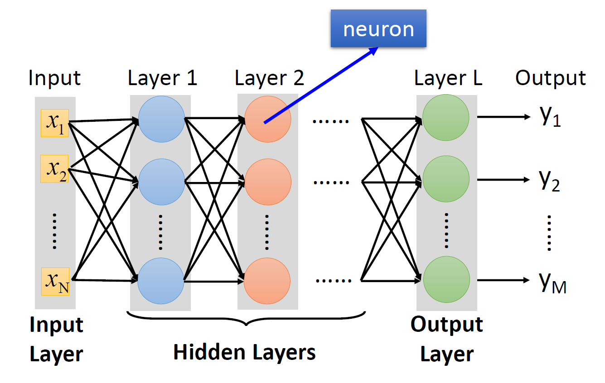
    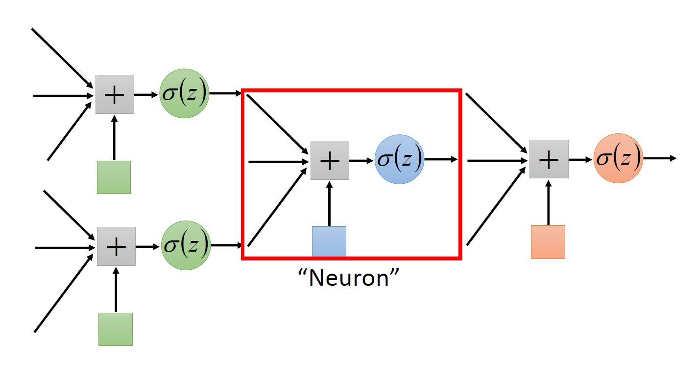

在机器学习中，我们通常为上图的计算过程赋予这些名称：

- **神经元**(neuron)：包括输入（通过权重和偏移对一组数据求和）、激活函数和输出
    - 网络参数(network parameter)$\theta$：神经元的所有权重和偏移
- **神经网络**(neural network)：由众多这样的神经元构成的集体，类似一张网（模拟人类的大脑）
    - 这里的神经网络称为**全连接神经网络**(fully-connected neural network)，这种网络的特点是每个神经元接受所有的输入，且都有各自的权重和偏移，因此相当灵活；但缺点是效率不高
- **层**(layer)：相当于一次训练的过程
    - **输入层**(input layer)：初始输入的数据集
    - **隐藏层**(hidden layer)：中间的一排排神经元
    - **输出层**(output layer)：最后一层神经元，得到训练结果

多次训练意味着有多层的神经元，看起来就很“深”，因此称之为**深度学习**(deep learning)。

??? example "（有些过时的）例子"

    

        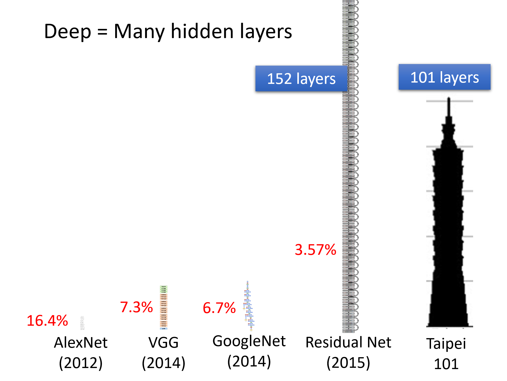
    

根据实际经验，随着层数的加深，训练结果的质量会不断提升，但也不是始终能够提升——到达一定层数后，虽然对于训练数据的预测更准确，但是对未来的预测结果的质量反而会下降，这种情况称为**过拟合**(overfitting)。因此，我们不会让层数一直深下去的，合适的层数需要通过直觉(intuition)和不断的试错(trial and error)得到。

## Why Deep?

现在来思考一个问题：我们为什么要搭建深层的神经网络，而不是更浅更“胖”的神经网络呢？

    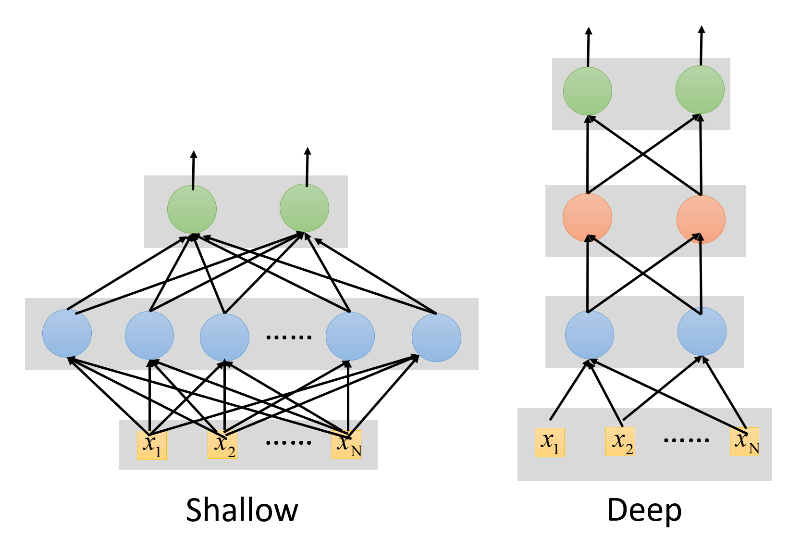

假设上面的两个神经网络具备相同数量的参数，那么究竟哪一个的表现更好呢？前人对此做过研究了，结果如下（表格前两列表示深层网络，后两列表示浅层网络，同一行的网络参数数量相等）：

    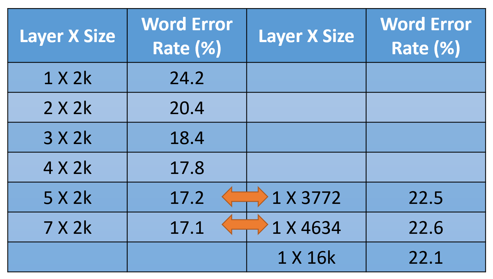

- 随着层数（深度）的增加，神经网络的表现会越来越好
- 在参数数量相等的情况下，深层网络的表现显著优于浅层网络
- 同一层网络规模的增加（即变得更“胖”）并不一定会改善神经网络的表现

因此，深层网络可以用更少的参数达到和浅层网络相等甚至更好的表现，而更少的参数也意味着更不容易发生过拟合等问题，因此我们才会推崇“深度学习”。

但是，为什么更深意味着更好呢？在前面的学习中，我们知道理论上是可以只用一层神经元来表示任意的函数（模型）（回忆一下：任意函数 = 常量 + sigmoid/ReLu 函数的组合），当然这一层上会有很多很多的参数。然而，通过多层的结构，我们可以更加**高效**地表示函数，具体来说就是深层网络可以用更少的参数达到相同的效果：

    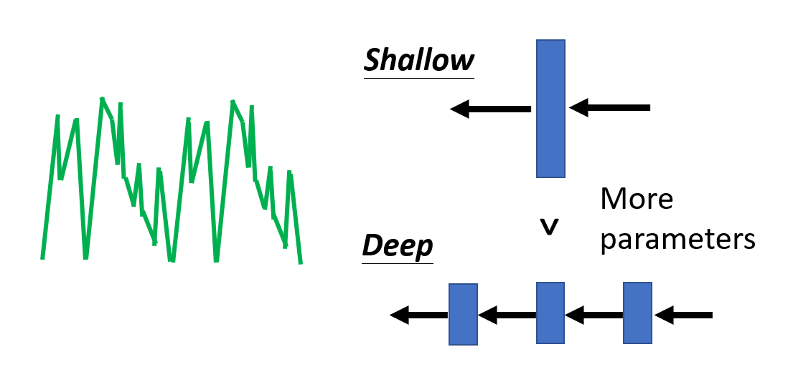

??? example "一些类比"

    === "逻辑电路"

        

            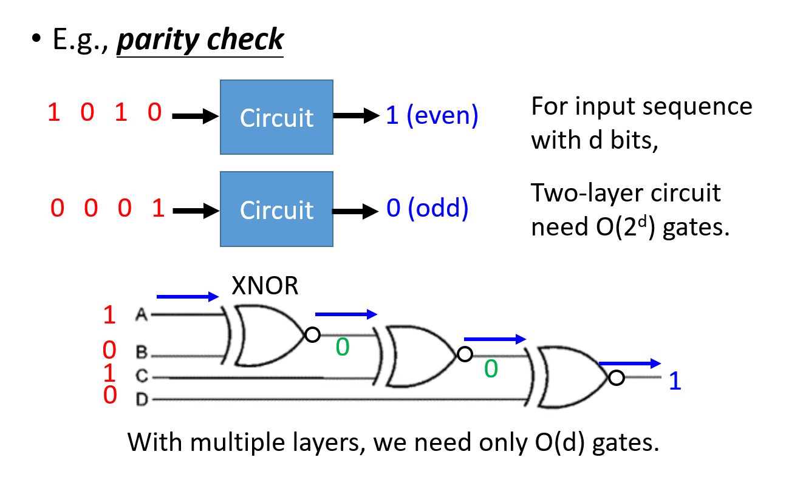
        

        用逻辑门构建一个 $d$ 位奇偶校验器（这里是偶校验）

        - 如果只用两层电路的话，那么需要 $O(2^d)$ 个逻辑门（每一位都有 0 和 1 两种可能）
        - 如果使用多层电路的话，电路图就如上所示，这时只需要 $O(d)$ 个逻辑门就 OK 了

    === "编程"

        

            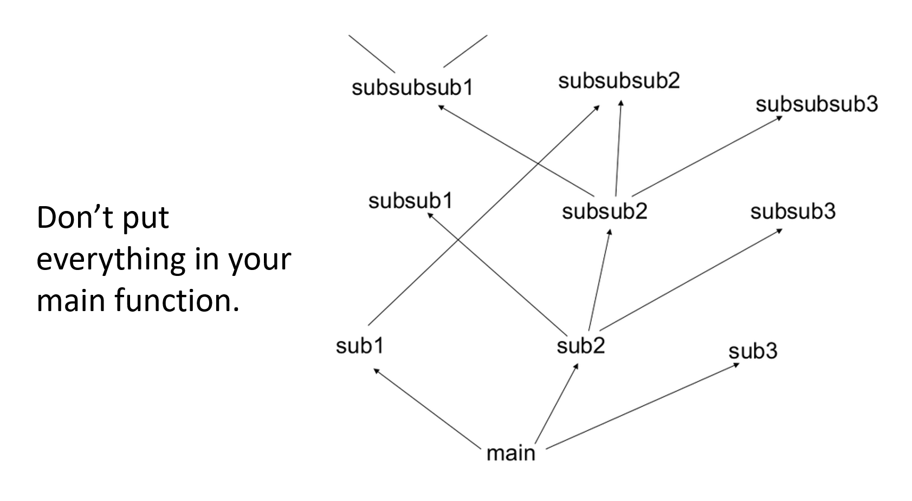
        

        在编写一个大型项目的时候，我们通常不会将所有的功能都放在主函数中实现（类比一层很胖的神经元），而是将不同功能放在不同模块（或子函数）中实现，而这些模块可能会调用下面的其他子模块，好比深层次的神经网络。

    === "剪纸"

        

            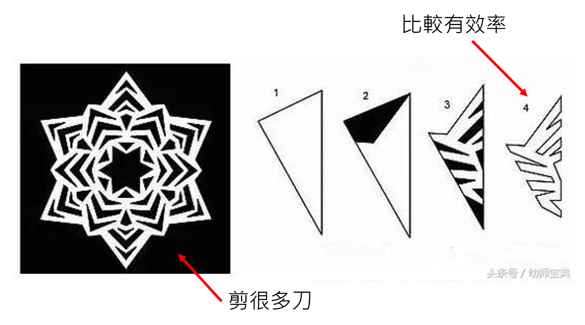
        

        在正式剪纸之前，我们往往会先将纸对折几次（类比深层的神经网络）后再开始剪，这样相比直接在纸上剪（类比浅层的神经网络），不仅可以剪得更快，而且更不容易失误。

下面用一个简单的例子来说明深层的神经网络是如何高效表示出复杂的函数：

???+ example "例子"

    === "第一层"

        假设训练时只用到一个数据 $x$，通过不同神经元（偏移、权重、激活函数）的组合后，得到输出 $a_1$，它是一个 2 段的分段函数。

        

            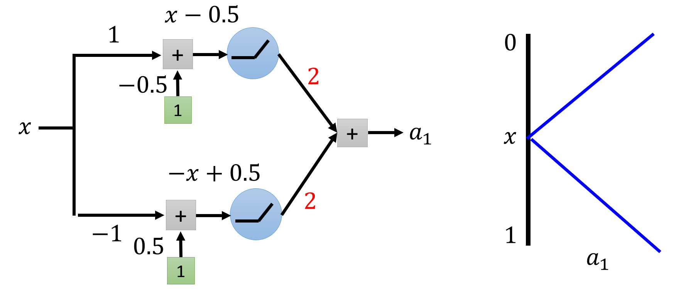
        

    === "第二层"

        然后将 $a_1$ 作为第二层的输入，通过与第一层相同的神经元的计算后，得到 $a_2$，它是一个 4 段的分段函数（至于为什么是 4 段，这点不难推导，所以这里就不解释了）。

        

            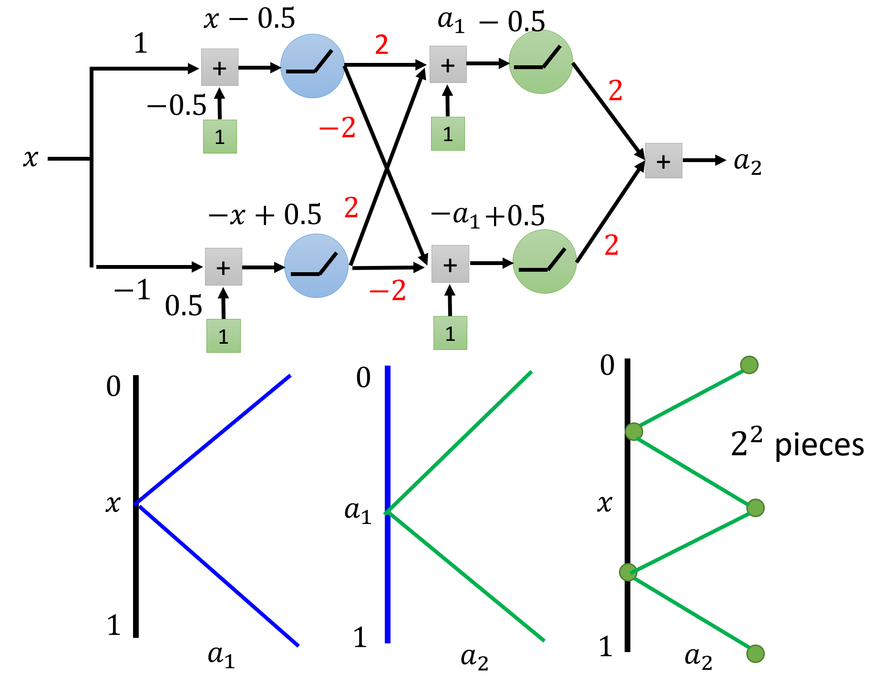
        

    === "第三层"

        然后将 $a_2$ 作为第三层的输入，通过与前两层相同的神经元的计算后，得到 $a_3$，它是一个 8 段的分段函数。

        

            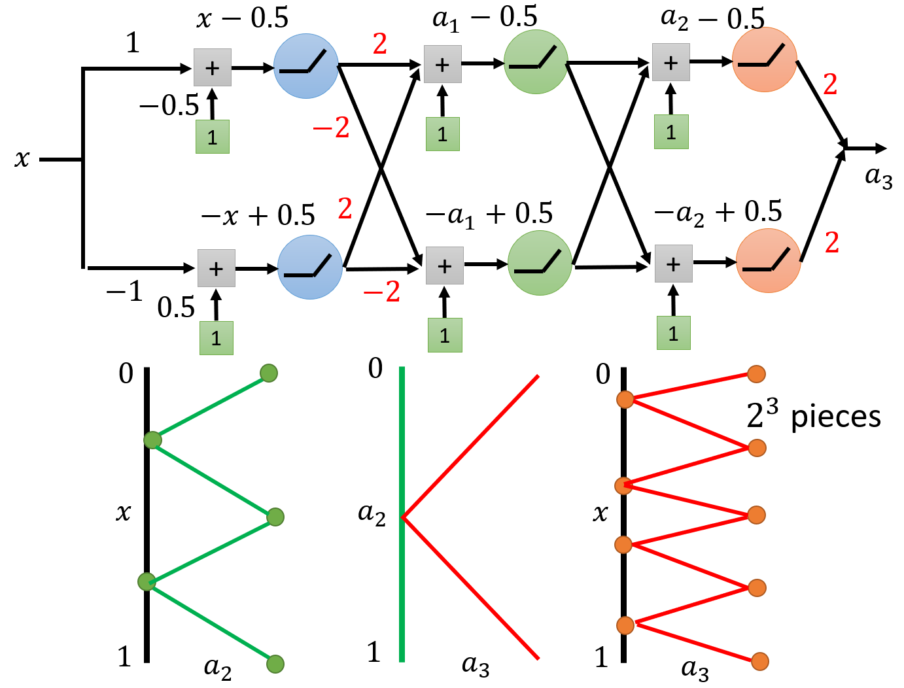
        

假如我们要表示一个 $2^k$ 段的分段函数，如果使用上面的深层神经网络（每层只有两个神经元），那么只需要 $k$ 层，即 $2k$ 个神经元就能完成任务。然而，如果用一层神经网络的话，就需要 $2^k$ 个神经元。所以深层神经网络所需要的神经元数量明显更小，这样不仅成本低，而且更小的参数也意味着更少的模型可能性（即 $|H|$ 更小），那么在训练集上得到的模型的表现与在真实情况下的表现更加接近。

!!! note "注"

    - 当需要的函数是复杂而规整的话，深层的神经网络会优于相等数量参数下的浅层网络
    - 当 $y = x^2$ 时，深层的神经网络相比浅层的表现是指数级的好！

呼应上一讲的结尾：<u>**深度学习**是一个可以让鱼和熊掌可以兼得的方法</u>。

## CNN

接下来介绍一种非常有名的，主要为**图像**(image)设计的神经网络架构——**卷积神经网络**(convolutional neural network, CNN)。我们将会从两个角度认识 CNN，对 CNN 有一个全面而深入的理解。

### Neuron Version Story

现在要训练一个用于**图像分类**(image classification)的模型，它的输入和输出为：

    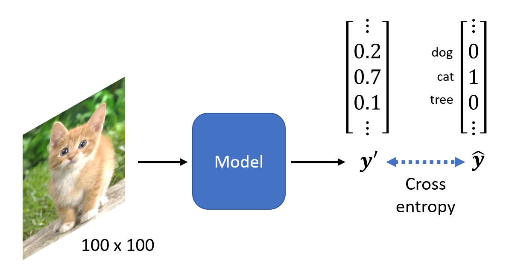

- 所有输入图像都应是固定的尺寸，这里假设均为 100 x 100
- 由于是分类问题，所以输出是一个独热向量（可能包含成千上万的元素），并且使用交叉熵来计算损失

我们将一张图像看作是一个三维的**张量**(tensor)（简单理解成多维数组），它有宽度、高度、通道数量（或者称为深度）这三维。这里假定通道数量 = 3，即 RGB 三个通道。在将图像输入给模型训练前，需要将这个三维张量“**拉直**”，即让这个三维张量变成一维向量，该向量的每个元素都是来自不同宽、高和通道的像素，其值表示的是图像上某个位置、某个通道下的亮度(intensity)。

    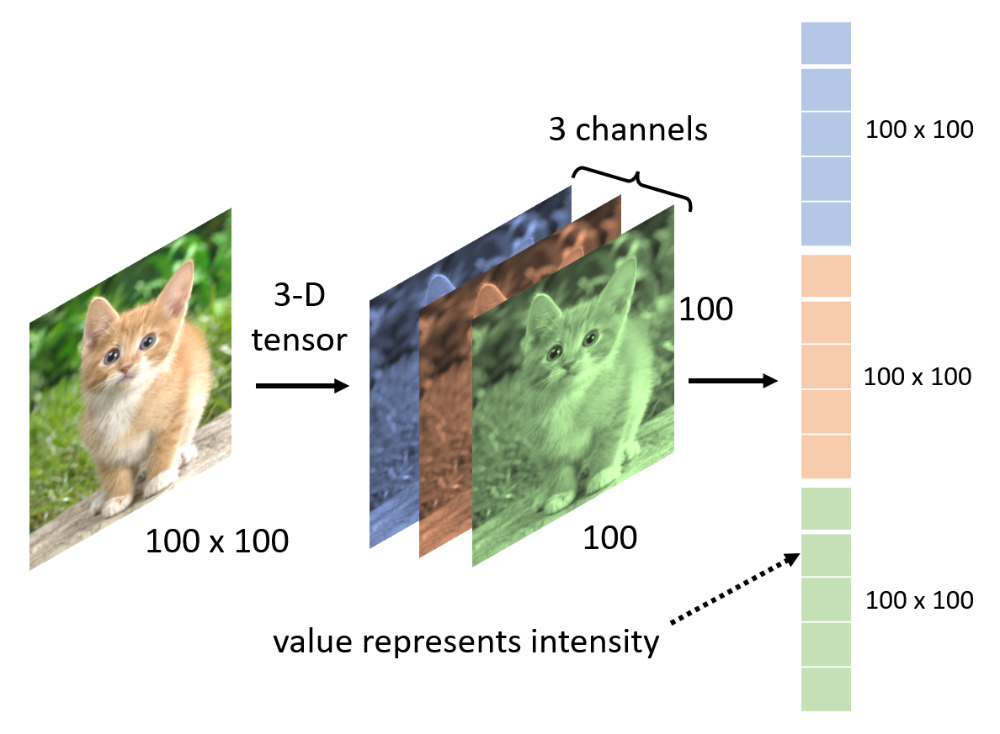

现在，将拉直后的一维向量丢给全连接神经网络：

    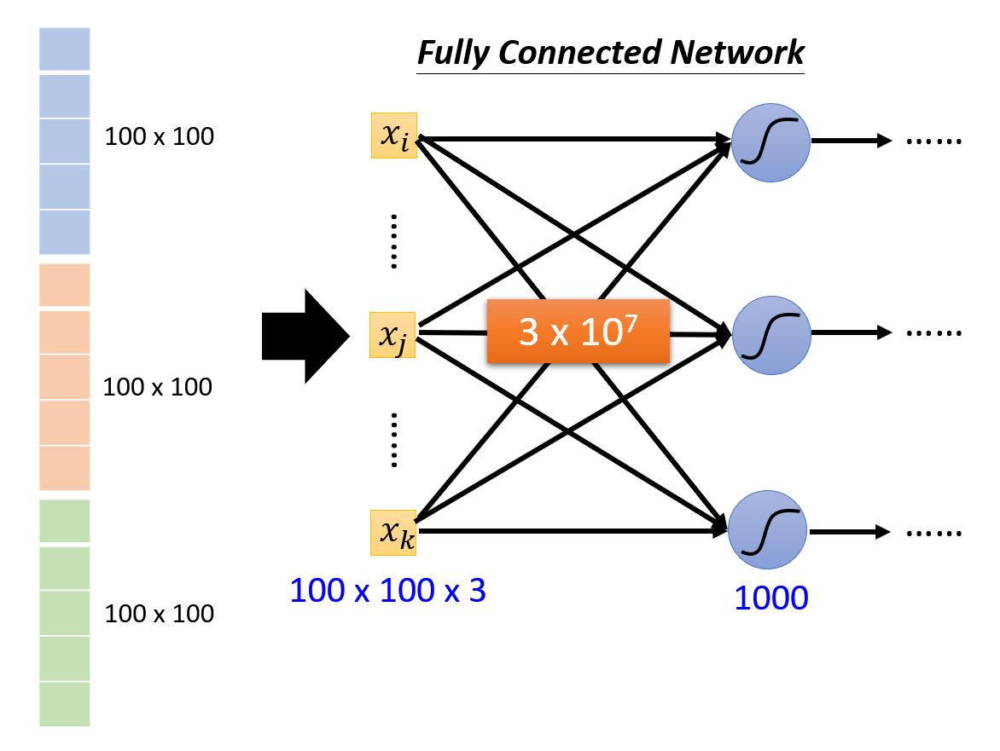

假设网络的第一层有 1000 个神经元，由于有 100 x 100 x 3 = 30000 个输入项，所以第一个隐藏层就有 $3 \times 10^7$ 个权重，因此产生了很多参数。前面提到过，虽然参数多意味着模型很灵活，但是这会带来过拟合的问题。所以全连接神经网络不太适合做图像处理相关的任务。现在我们来观察一下图像处理任务究竟有什么特性，以帮助我们设计出更合理的神经网络。

#### Observation and Simplification 1

与其让神经元读取图像上的所有数据，不如让每个神经元读取部分图像区域上的数据，用于识别图像上的一些关键**模式**(patterns)。比如对于下面这张关于鸟的图片，机器可以从它的嘴巴、眼睛、爪子等特征（模式）来作出“这是一只鸟”的判断。实际上，人类也正是基于相似的方法来分辨图像。

    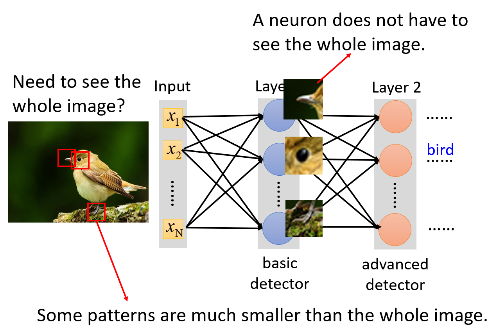

基于上述发现，我们可以着手简化神经网络的设计——每个神经元仅读取某一小块区域上的图像数据，因此用到了更少的参数；而我们通常称这一小块区域为**感受野**(receptive field)。

    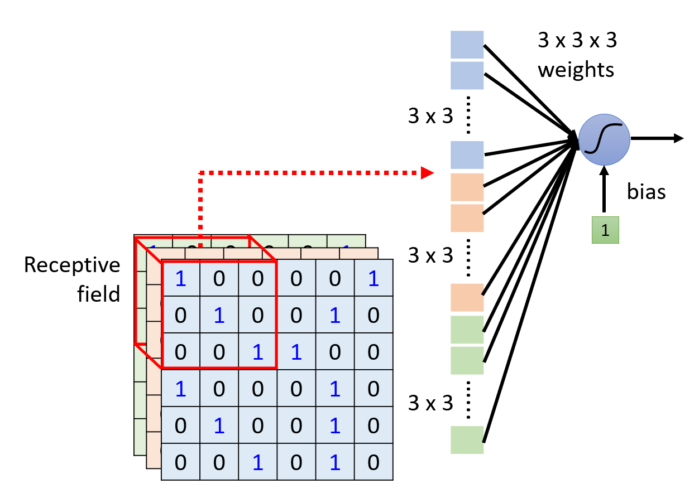

!!! note "注"

    - 不同神经元对应的感受野可以有重叠的地方
    - 甚至不同神经元的感受野可以是相同的
        - 但由于不同神经元的权重和偏移不同，因此即使对于相同的一块区域，输出也是不一样的

    

        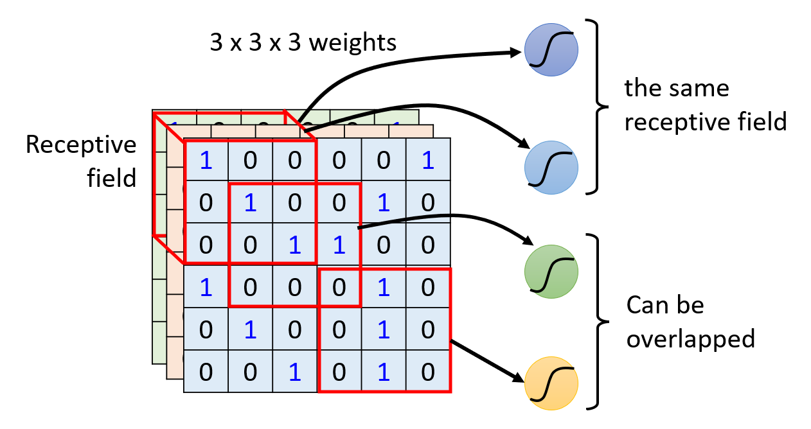
    

???+ question "思考"

    === "问题1"

        不同的神经元可以有不同大小的感受野吗？

        可以的（而且也很常见）。比如不同的模式可能有不同的大小，因此神经元需要用不同大小的感受野来检测对应的模式。

    === "问题2"

        感受野可以仅包含部分通道吗？

        可以。在其他的网络架构中会有这样的调整，但在一般的 CNN 中不会考虑。

    === "问题3"

        感受野可以不是方的（可以是矩形或其他形状）吗？一定是一块邻近的连续区域吗？

        可以。根据自己对任务的理解，可以确定不同形状的感受野。

- 实际上，每个感受野都对应一组不同的神经元
- 而且，我们会让所有的感受野覆盖整张图像，最经典的安排方法是：
    - 先在图像左上角取图像的一部分作为感受野（但包含所有通道），这块感受野的大小称为**核尺寸**(kernel size)，一般设置为 3x3
    - 然后移动这块感受野，从而得到新的感受野。每次移动都有规定的**步幅**(stride)，一般设为 1 或 2。这可能会带来一些问题：
        - 相邻的感受野之间会有**重叠**，这是正常现象。而且如果没有做到重叠的话，那就有可能会漏掉那些位于重叠区域的模式，从而影响图像分类的效果
        - 感受野移动到边界的时候，可能会有一部分不在图像内。一般采取的做法是在图像外围**填充**(padding)一圈 `0`，也就是说不存在的部分用 `0` 表示即可

    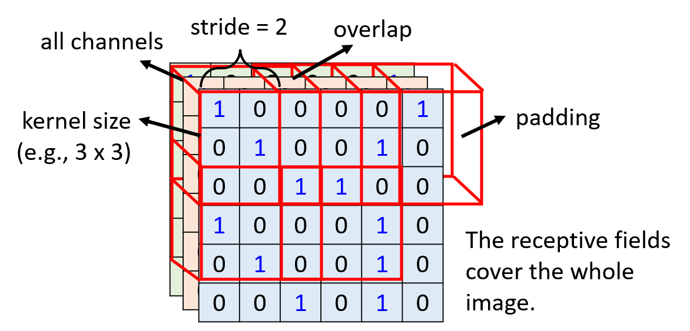

#### Observation and Simplification 2

另一个不难发现的事实是：对于不同的图像而言，相同的模式可能出现在图像的不同位置上。比如下面有两张关于鸟的图片，上图鸟嘴出现在图像左上方，而下图鸟嘴出现在图像中央位置。

    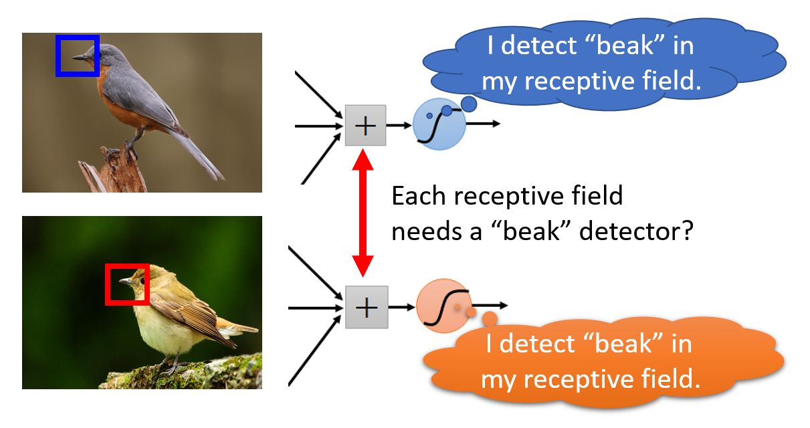

因此，我们可以让某些神经元**共享参数**(parameter sharing)，那么这些神经元识别的是同一种模式，但针对的是不同的感受野，这样可以在确保识别不同位置上的模式的同时，还能减少一些参数。

    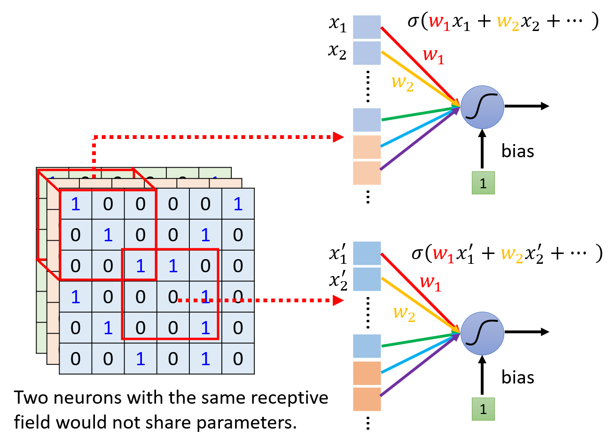

前面提到过，每个感受野都对应一组不同的神经元，但其中一些神经元之间共享参数，我们称这样的神经元为**滤波器**(filter)。

    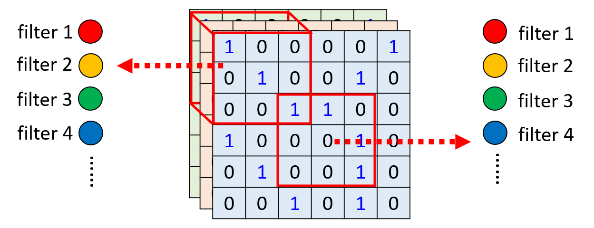

!!! abstract "总结"

    现在总结一下我们目前学到过的有关深度学习的知识：

    

        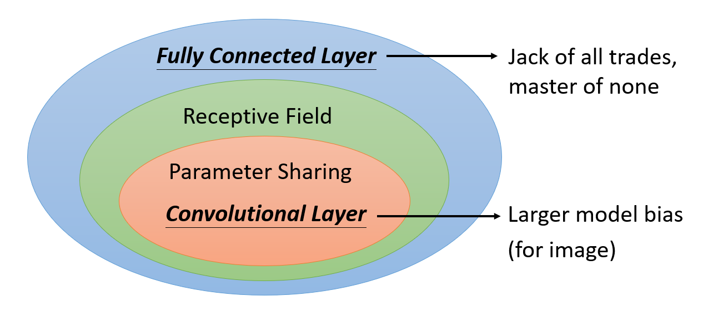
    

    从这张维恩图中可以看出，我们简单地认为：使用感受野和参数共享这两项简化技术的全连接层就是**卷积层**(convolutional layer)。

    - 虽然经过这两项简化技术后，卷积层的模型偏移会变得更大，但是相比全连接层而言，它还是更适合用于图像处理的任务
    - 而全连接层的模型偏移较小，意味着灵活性高，可以胜任各种各样的任务，但这也意味着它没有特别擅长的事

### Filter Version Story

现在我们知道，图像在经过一些卷积层的处理后，就可以得到关于图像的分类结果；而且在卷积过程中会用到一些滤波器，这些滤波器一般都是规模为 3x3 通道数量的张量。为了方便后续的讨论，

- 假定通道数为1，即处理的是黑白图像。
- 且图像的尺寸为 6x6，还有以下两个滤波器，里面的值就是模型的未知参数：

    

        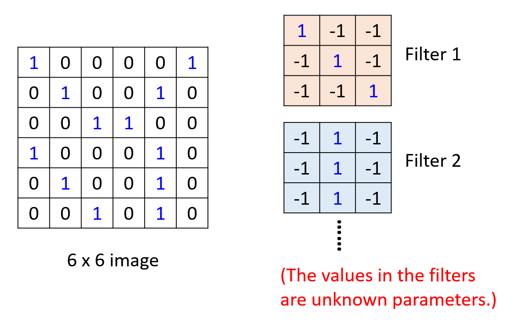
    

- 规定步幅 = 1，即滤波器一次只能走一格

滤波结果为：

=== "第1个滤波器"

    

        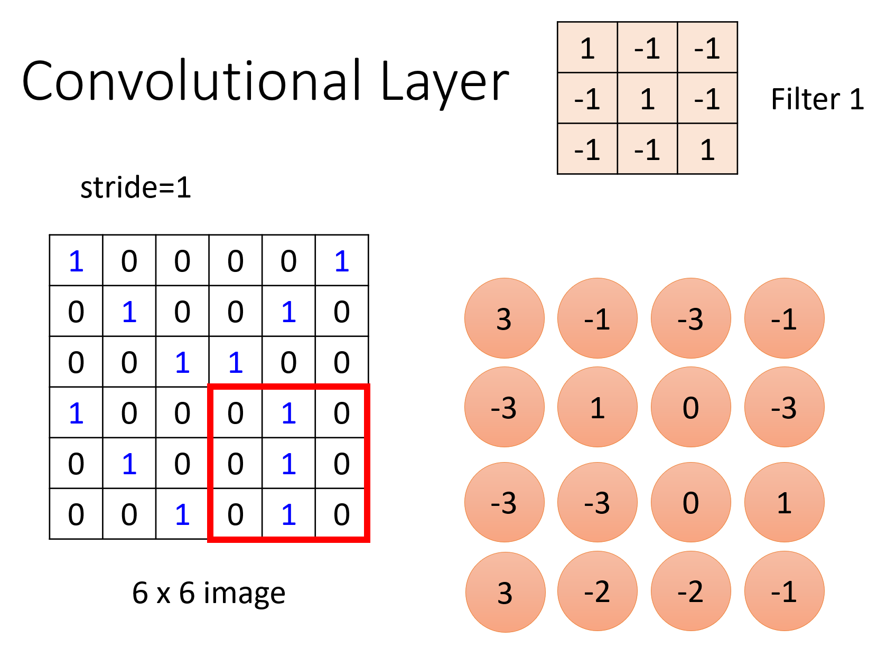
    

    观察第1个滤波器的特征，发现对角线上的值都是1，这也就意味着这个滤波器寻找的是图像上对角线均为1的模式。

    

        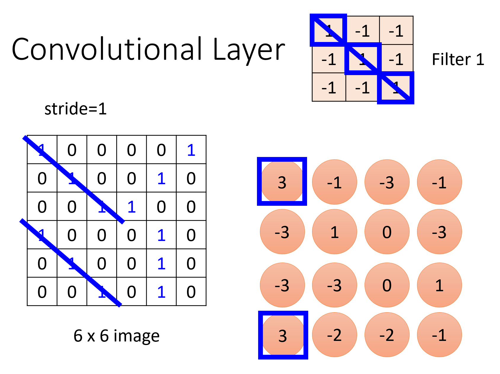
    

=== "第2个滤波器"

    

        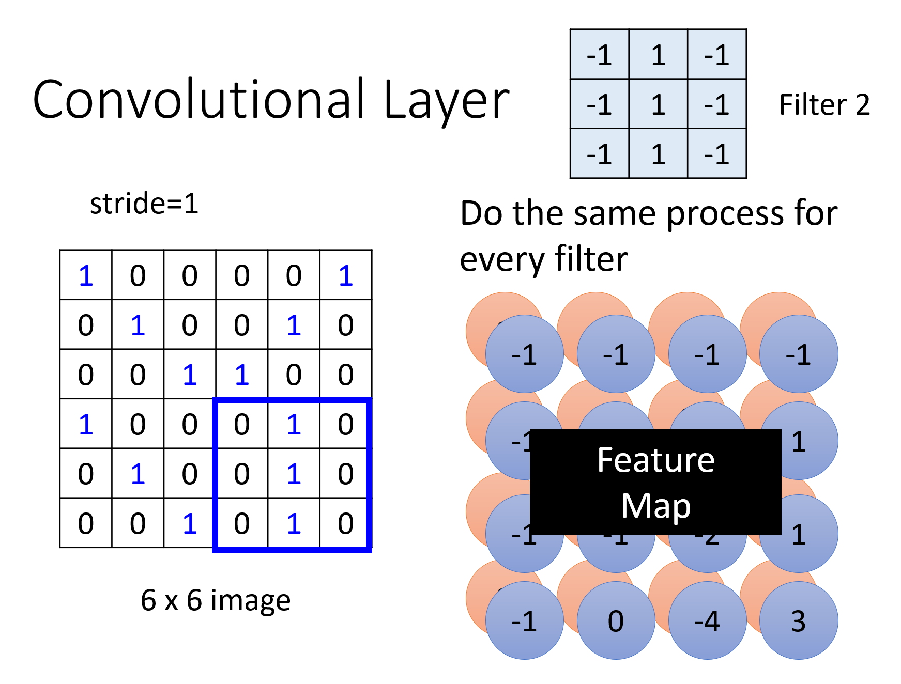
    

    观察第2个滤波器的特征，发现中间列上的值都是1，这也就意味着这个滤波器寻找的是图像上中间列均为1的模式。

    我们将所有使用滤波器得到的结果汇总在一起，构成了一张**特征图**(feature map)。有多少个滤波器，这张特征图就有多少个通道。

---
一个神经网络中可以用多个卷积层，前一个卷积层的结果会作为下一个卷积层的输入。以上面的例子来说，假如有 64 个滤波器，那么就会得到一张有 64 个通道的特征图。我们可以将它看作是一张“图像”，传递到下一个卷积层中。而下一个卷积层中的滤波器可以是一个 3x3x64 大小的张量。

    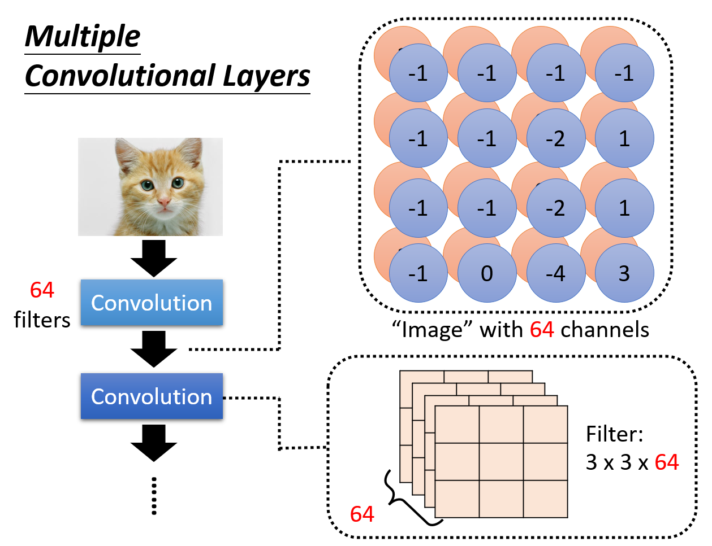

??? question "思考：为什么一般使用 3x3 大小的滤波器就够了"

    假如每个卷积层的滤波器的宽和高都是3。在第一个卷积层得到的特征点之上使用滤波器（此时来到了第二个卷积层），此时得到的每个特征点实际上包含了 5x5 的区域。因此随着层数的加深，即使滤波器的大小一直是 3x3，但是特征点对原图的覆盖范围会越来越大，所以我们不用担心滤波器太小而无法覆盖图像上区域较大的模式的问题。

    

        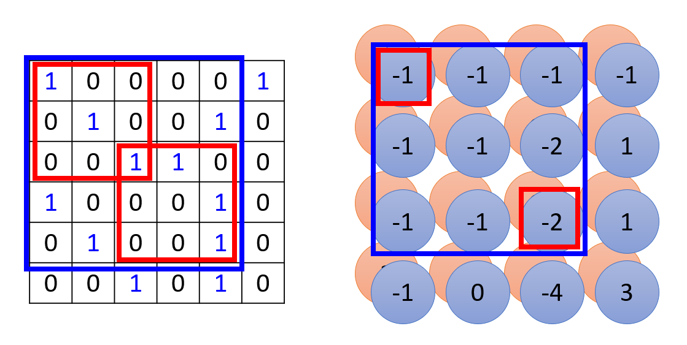
    

!!! abstract "总结"

    |从神经元角度看|从滤波器角度看|
    |:-|:-|
    |每个神经元仅考虑一块感受野|有一组用于检测小区域模式的滤波器|
    |不同感受野下的神经元可能会共享参数|每个滤波器在输入图像上进行卷积操作|

### Pooling

对图像的第三个发现是：对原图像的像素进行二次采样(subsampling)后，不会改变图像中的物体。比如对下面关于鸟的图片进行二次采样，仅选择部分像素点，得到一张缩小了的图像，但是图像中的鸟没有发生太大的变化，依然可以识别出来。

    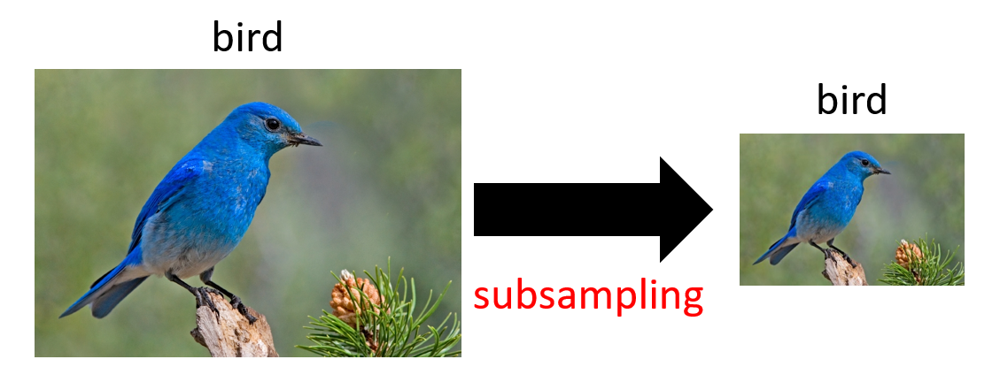

基于这一发现，我们在卷积神经网络中引入**池化**(pooling)的概念。由于它没有任何权重（即无法“学习”），因此它算不上是一个“层”，反而类似一个像 sigmoid 之类的激活函数。有很多种池化方法，这里仅介绍**最大池化**(max pooling)——它接受来自滤波器的输出（一组数字，类似图像数据），将其按固定大小划分为多个组，然后取每个组中的最大值，扔掉其他值。结果就是保留更少的，但又能符合原图像特征的数据。

=== "池化前"

    

        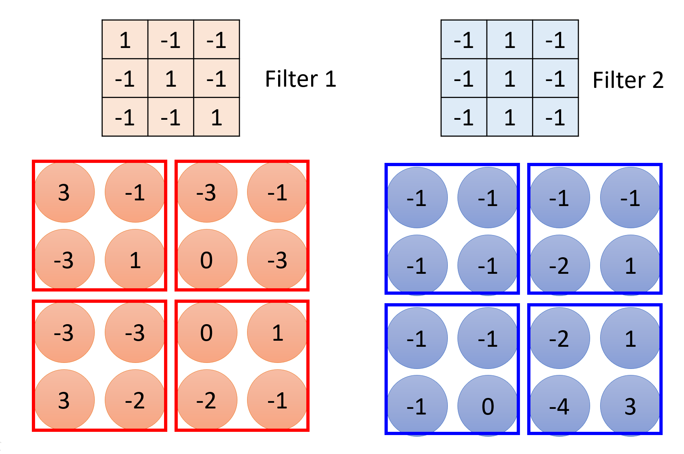
    

=== "池化后"

    

        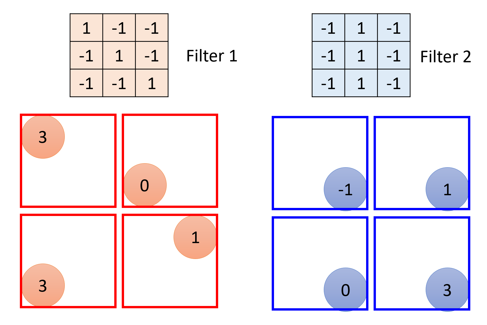
    

回到整个神经网络，比对池化前后的结果：

    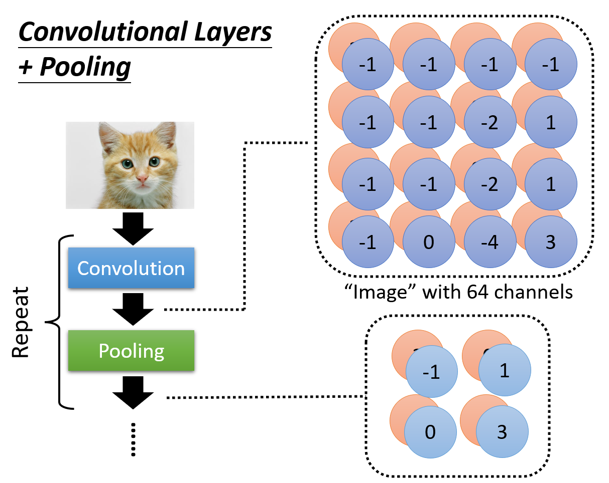

!!! abstract "完整的 CNN 框架！"

    

        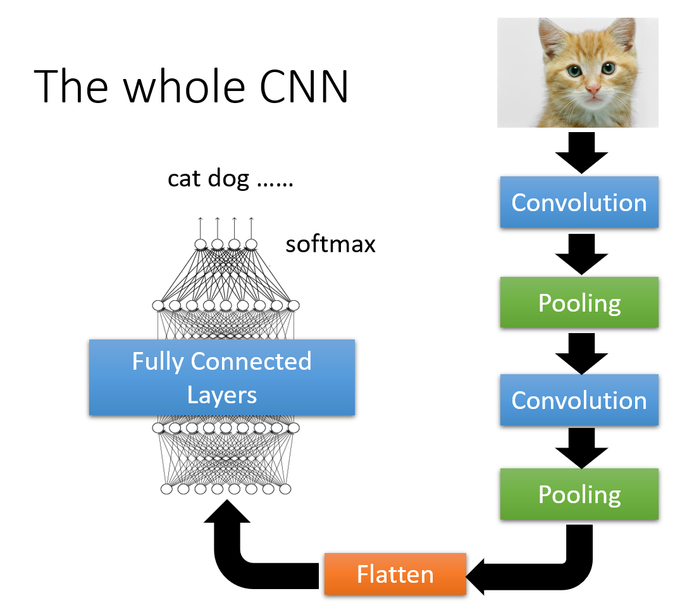
    

    使用池化的最大原因是降低特征图的空间维度，减少计算量。但随着技术的发展，计算机的算力会越来越强，因此有时不必使用池化操作；而且过多的池化操作有可能会破坏原图像的特征，所以有些 CNN 甚至直接抛弃了池化（后面介绍的 Alpha Go 就是其中一个例子）。

### Applications

事实上，CNN 不仅可以用于图像处理，也能够完成其他领域内的任务，比如下围棋(playing Go)——著名的 Alpha Go 用的就是 CNN。

- 之所以这样是可行的，是因为可以将棋盘看作一张 19x19 的图像，每个位置上只有 3 种值：黑子（用1表示）、白子（用-1表示）、空（用0表示）
- Alpha Go 内将棋盘划分为 48 个通道，每个通道表示不同的棋局
- CNN 根据当前棋盘上的棋局，输出下一次移动的位置（19x19 个类）

此外，围棋也符合一些上述对图像的观察：

- 图像上有一些区域更小的模式
    - Alpha Go 在第一层上采用 5x5 大小的感受野

    

        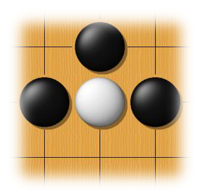
    

- 相同的模式可能会出现在图像的不同区域上

    

        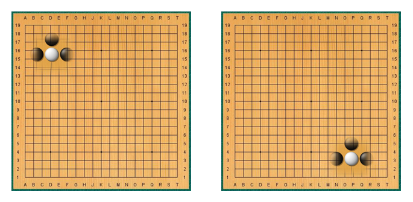
    

- 但显然不能在棋盘上进行所谓的“二次采样”，因为随便抽走某一列或某一行，棋局就可能会发生很大的变化。因此 Alpha Go 的 CNN 并没有使用池化。

???+ info "更多的应用"

    === "语音"

        

            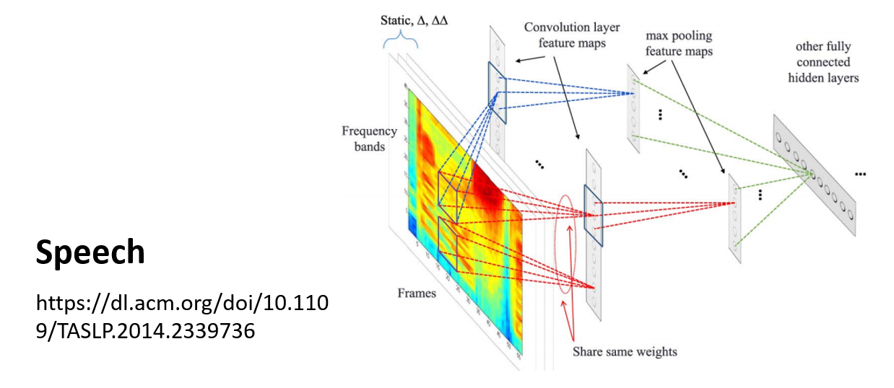
        

    === "自然语言处理"

        

            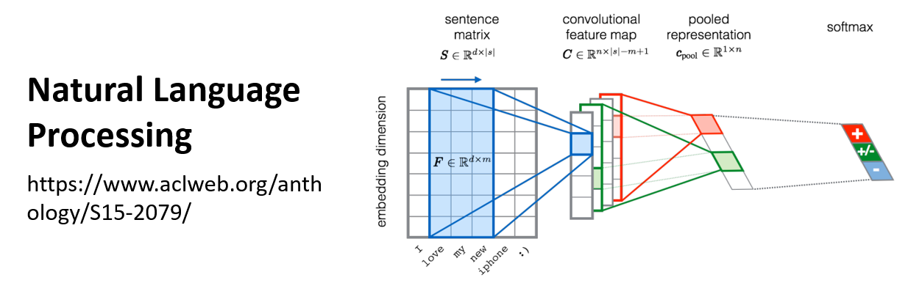
        

!!! failure "CNN 的缺陷"

    如果对同一张图像进行缩放、旋转等操作，CNN 就无法识别出这些变换后的图像（有点笨）。因此需要在训练过程中使用**数据增强**(data augmentation)的方法，将这些变换后的图像也作为训练资料喂给神经网络。

    不过也有另一种方法：空间变换层(spatial transformer layer)能够解决这一问题。