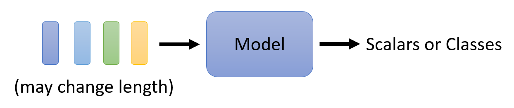
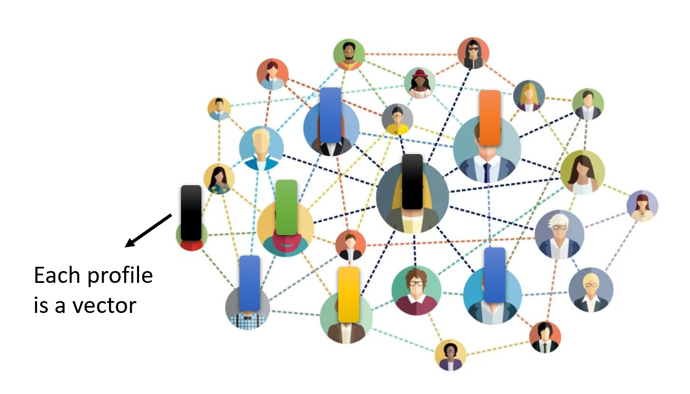
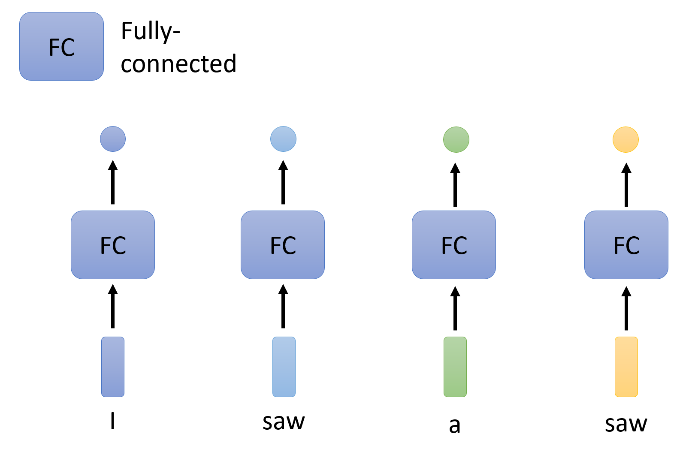
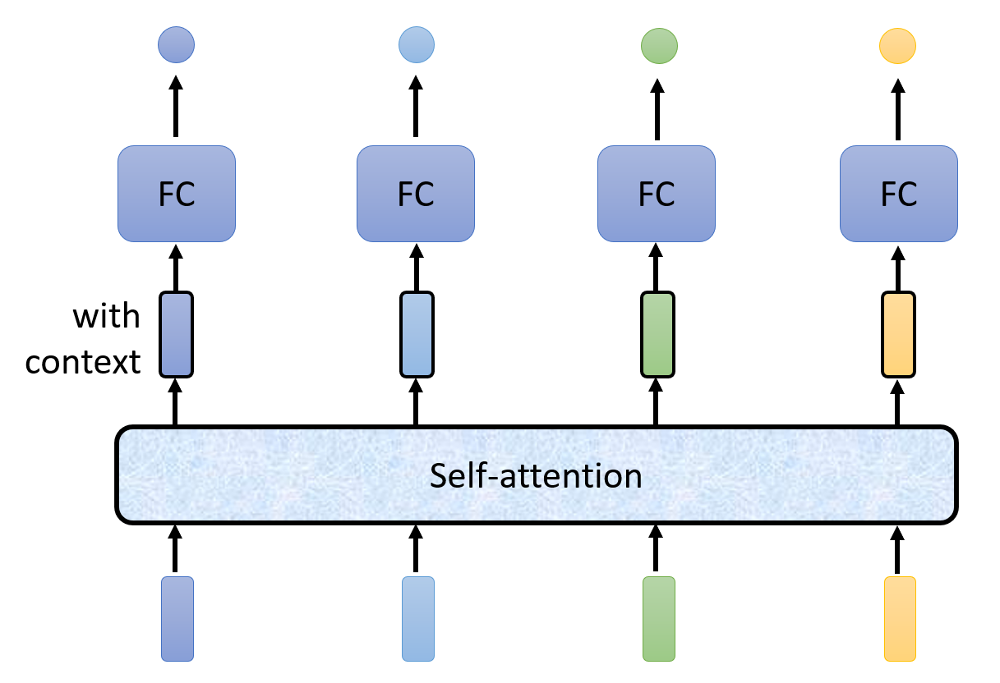
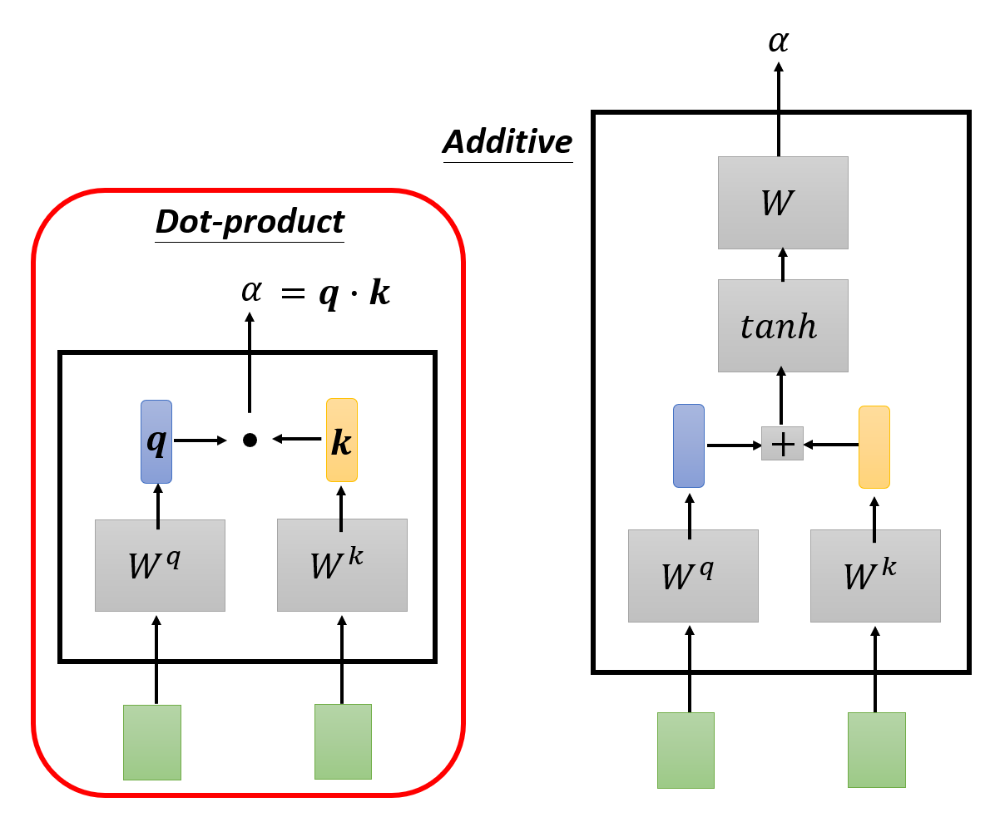
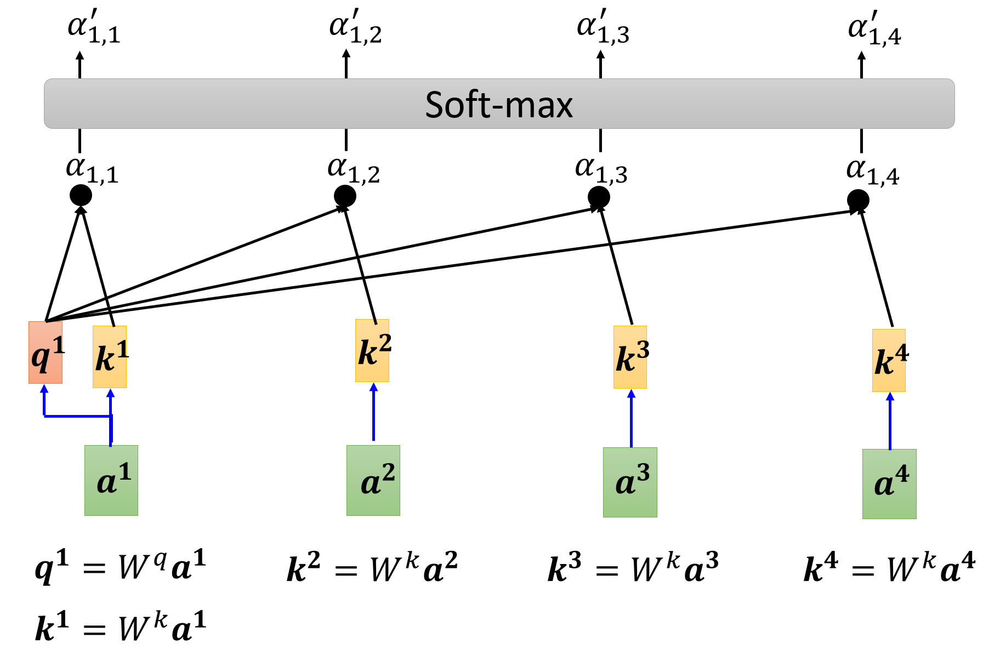

# Self-Attention

之前我们介绍的模型，都只是将一个向量作为输入（比如 COVID-19 感染人数预测、图像处理等问题），输出的是一个标量（回归问题）或类（分类问题）。而现在我们将要讨论这样的一个模型：将**一组**向量（向量序列）作为输入，输出的是多个标量或类；而且输入向量的个数是可变的。

    

## Inputs and Outputs

首先需要考虑的一个问题是：如何将实际问题的**输入**转化为一组向量的形式呢？来看下面几个例子：

???+ example "例子"

    === "句子"

        一个句子就是一个向量序列，而句子中的每个单词对应一个个的向量。将单词转化为向量的方式有：

        - **独热编码**(one-hot encoding)：假如所有单词的个数为n，那么我们就用一个大小为n的向量来表示每个单词，每个位置上的元素表示唯一的单词
            - 这种方式简单粗暴，但是不仅占用内存空间大，而且无法体现出两个单词之间的联系，即没有考虑到语义信息

                

                    
                

        - **词嵌入**(word embedding)：语义关系越接近的两个单词，它们对应的向量值会更加接近，如下图所示：

            

                
            

    === "语音"

        在机器学习课程 HW2 中，我们将语音看作一段段的帧（25ms 的语音）；并且用一个滑动窗口来划分帧，窗口每次移动的步幅为 10ms，所以 1s 的语音里就有 100 个帧。因此，每个帧就是一个向量，而一段语音就是变长的向量序列。

        

            
        

    === "图"

        我们可以将图上的每个节点看作一个向量，所以整张图就是一组向量。在实际应用中：

        - 社交网络：

            

                
            

        - 分子结构

            

                
            

而输出的内容则可以分为以下几种情况：

- 每个输入向量对应一个输出标签(label)（即预测值）

    

        
    

    ??? example "例子"

        

            
        

- 对于整组向量，输出一个标签

    

        
    

    ??? example "例子"

        

            
        

- 由模型决定输出标签的数量（seq2seq，序列到序列）

    

        
    

不过之后我们只专注第一种输出情况，即对于 N 个向量的输入，输出相应的 N 个标量或类。

## Self-Attention

接下来考虑如何构建适用于向量序列输入的模型。

??? bug "Naive Idea"

    既然 N 个向量输入对应 N 个输出，那么不妨让每个向量单独进入一个全连接层得到一个输出，如下图所示：

    

        
    

    显然，这样有一个很大的缺陷：我们没有考虑到向量序列各个向量之间的联系，各个向量都是“各自为政”的。所以，如果有两个向量的值是相等的，那就会被视为意义相同的两个东西，从而产生两个相同的输出。

每个向量输入都有一个对应的**全连接层**，这个全连接层不仅应该接收对应的向量输入，同时也要顾及整个**上下文**(context)中的向量。

- 这个上下文的范围可以是一个局部的窗口，这样就仅考虑与对应输入向量相邻的部分向量

    

        
    

- 也可以将整个向量序列都纳入考虑范围内，这样考虑得更全面些，比如用一个固定大小的窗口覆盖整个向量序列
    - 但是向量序列的长度可长可短，所以不能简单地使用窗口来实现这一点
    - 再说，就算有一个足够大小的窗口可以容纳所有向量，但是这样也意味着全连接层需要非常多的参数（$n$ 个向量就会产生 $n^2$ 个参数），而过多的参数意味着很容易出现过拟合的问题

因此，这里引入一种更好的做法——使用一种名为“**自注意**”(self-attention)的机制：

- 将输入向量送入全连接层之前，先让这些向量经过一种“自注意”的运算。对于每个输入向量，经过“自注意”运算后都会得到一个对应的输出，我们可以把这个输出看作是包含整个向量序列上下文信息的新向量，但同时也保留了原来输入向量的特征。
- 然后将这个新向量传给全连接层进行训练

这一过程如下图所示：

    

当然，在多层神经网络中，可以在每两个隐藏层之间塞一个自注意计算：

    

在自注意计算这个“盒子”的内部，输入和输出的关系如下所示：

    

其中输入既可以是最外面的向量序列，也可以是经过几层训练后得到的输出向量序列。现在我们就考虑某一个输出向量，比如 $\bm{b^1}$，来认识一下自注意的计算过程。

首先，我们要计算 $\bm{b^1}$ 对应的输入向量 $\bm{a^1}$ 与其他输入向量的**相关程度**（用 $\alpha$ 表示）。有以下两种常用的方式：

    

!!! info "注"

    下面我们会将主要考虑的输入向量称为**查询**(query)，而把另外的向量看作**键**(key)，所以它们分别对应的矩阵为 $W^q$ 和 $W^k$，与矩阵相乘的结果分别为 $\bm{q}$ 和 $\bm{k}$。

- **点积**(dot-product)：相关程度 $\alpha = \bm{q} \cdot \bm{k}$（向量的点积，得到一个标量）
- 加法(additive)：将 $\bm{q} + \bm{k}$ 的结果丢给 $\tanh$ 函数计算，然后再经过一次转换（用矩阵 $W$ 表示）得到 $\alpha$

下面我们仅考虑**点积**这一方法。

---
回到前面有4个输入的例子，先将 $\bm{a^1}$ 作为查询，其他几个输入向量（也可以包括 $\bm{a^1}$）作为键，计算相关程度 $\alpha_{1, j}\ (j = 1, \dots, 4)$：

    

实际上，相关程度的值应该在 $[0, 1]$ 这一范围内，所以让这些相关程度值再经过一次 softmax 函数的运算，将它们的值映射到 $[0, 1]$ 上（用其他激活函数也没有问题）。

    

另外，对于每个输入向量，我们还要为它们计算第三个向量 $\bm{v} = W^v \bm{a}$，然后将这个向量与刚刚经过 softmax 得到的相关程度值相乘，再将这些乘积相加（加权和），最终得到 $\bm{b}$。对于本例中的 $\bm{b^1}$ 而言，计算公式为：

$$
\bm{b^1} = \sum\limits_{i} \alpha'_{1, i} \bm{v^i}
$$

    

剩下的 $\bm{b^2}, \bm{b^3}, \dots$ 等输出向量可以一起计算计算（**并行**计算），由于计算过程类似，故不再赘述。

---
现在我们从**矩阵**的角度研究一般情况下的计算过程：

- 对于每个输入向量 $\bm{a^i}$，需要得到三个向量 $\bm{q^i}, \bm{k^i}, \bm{v^i}$，而这些向量分别通过三个矩阵 $W^q, W^k, W^v$ 和 $\bm{a^i}$ 相乘得到。与其让矩阵分别和单个的输入向量相乘，不如将这些向量拼在一起，形成一个矩阵，这样就将多次的矩阵 $\times$ 向量的运算转化为一次的矩阵 $\times$ 矩阵的运算，如下所示：

    

        
    

- 我们知道，计算相关程度 $\alpha$ 的过程是一个向量乘法，但是我们也可以将其转化为一个矩阵乘法，一次性算出所有的相关程度值
    - 先将所有的 $\bm{k}$ 拼在一起，一次性计算某个查询下的所有相关程度：

        

            
        

    - 然后将所有的 $\bm{q}$ 拼在一起，这样就可以将所有的相关程度一次性算出来了！

        

            
        

- 同理，将所有的向量 $\bm{v}$ 拼在一起，与相关程度构成的矩阵 $A'$ 相乘，得到所有的输出向量：

    

        
    

综上，整个自注意的计算过程可以抽象为以下一系列的矩阵运算：

    

其中三个矩阵 $W^q, W^k, W^v$ 是我们需要通过训练学习的参数。而由相关程度构成的（且经过 softmax 归一化处理后的）矩阵称作**注意矩阵**(attention matrix)。

## Multi-head Self-Attention

对于那些需要学习的参数 $\bm{q}, \bm{k}, \bm{v}$，我们可以将同一个参数拆成多份（即“**多个头**”(multi-head)，通过原参数 x 不同的矩阵得到），每个“头”考虑不同的相关性类型，从而能够捕获更复杂的关系，提高模型对复杂模式的理解。下图就是头数 = 2 的例子：

    

下面以第 $i$ 个输入 $\bm{a^i}$ 为例介绍输出 $\bm{b^i}$ 的计算过程。先算出第一个头对应的输出 $\bm{b^{i, 1}}$：

    

然后算出第二个头对应的输出 $\bm{b^{i, 2}}$：

    

最后将这2个向量拼起来，乘上某个矩阵 $W^O$ 后，就能得到完整的输出 $\bm{b^i}$ 了：

    

## Positional Encoding

自注意机制的一个缺陷是：没有考虑位置信息，比如输入序列中第 i 个和第 j 个向量无论它们之间距离多远，都不会影响到它们在自注意机制中的计算结果。但有时候我们希望将这些位置信息考虑在内，比如在做词性标记的时候，我们知道动词一般不会出现在句首，这就是个值得考虑的位置信息。所以这里引入了一种叫做**位置编码**(positional encoding)的技术——它会为每个输入向量设置一个唯一的**位置向量** $\bm{e^i}$，在进入自注意计算前，将其和输入向量 $\bm{a^i}$ 相加，这样自注意计算时就将位置信息考虑进去了。

下图展示了一种可行的位置向量序列（这也正是经典论文 *Attention Is All Your Need* 中最早用到的位置向量），其中1列表示1个位置向量：

    

上面的位置向量是**人为设定的**(hand-crafted)——其实还可以通过数据训练出位置向量，下面就是一些典型的例子：

    

注意，这里的图需要横着看，也就是说一行表示一个位置向量。

## Applications

自注意机制被广泛应用在 NLP 中，而且我们熟知的 Transformer 和 BERT 中也用到了自注意。下面来认识一下常见的应用！

### Speech

在语音识别中也可以用自注意机制，但是存在一个问题：正如前面提到的，我们会把一段 10ms 的语音当做一个向量，那么随便将一两句话，这个输入序列的长度 $L$ 就大到吓人；而且注意矩阵 $A'$ 的规模是 $L \times L$ 的，甚至大到无法被内存容纳。

所以我们采取一种改进手段，叫做**截断自注意**(truncated self-attention)。简单来说就是：对于某个输入向量，我们仅考虑那些和当前输入向量比较接近的向量作为键，不去考虑更远的向量。在语音识别中，这种做法是合理的，因为要识别一句话中的一个字，我们往往无需得知整个段落的内容，也许仅靠这一句话甚至半句话就能判断出来了。

下面就是一个简化的示意图：

    

### Images

图像除了能用 CNN 来训练外，也可以用自注意来训练。我们可以将一张图像看作是一个向量集，而每个像素点就是一个向量，每个通道就是向量的元素。

    

下面就是一些具体的应用：

    

### Graphs

自注意 + 图 = **图神经网络**(graph neural network)

    

这里利用了图的信息，尤其是边的信息。我们仅考虑有边相连的两个节点对应的注意矩阵上的元素（蓝色方框），其他元素均为0（白色方框），这样我们就不会训练哪些没有意义的参数了。

## Comparison

### Self-Attention v.s. CNN

    

上图中，黄色方框对应的是 CNN 的感受野，而红色方框对应的是自注意的查询和键。我们不难发现：

- **CNN** 是一种只考虑感受野范围内的自注意机制，即 CNN 是一种简化的自注意机制。
- **自注意机制**是一种感受野范围更大（按 PPT 说法是可学习的(leanable)）的 CNN，即自注意机制是一种复杂版本的 CNN。

用维恩图可以形象表示两者的关系：

    

由于自注意机制会考虑更多的输入，因而更加灵活，所以在数据不多的情况下更容易出现过拟合现象，效果就不如 CNN 了；而一旦数据量大到一定程度后，自注意机制的优势就显现出来了。

    

下面这篇论文详细介绍了两者的关系，感兴趣的同学可自行上网搜索：

    

### Self-Attention v.s. RNN

目前**循环神经网络**(recurrent neutral network, RNN)基本上能被自注意机制给替代了，所以这里就简单介绍一下 RNN 的机制：

    

- 底下4个小矩形就是输入，最开始会有一个初始内存
- 将这块内存和第一个输入向量一同放到 RNN 中，得到一个输出（中间用黑框包裹的矩形），该输出可进入 FC（全连接层）的训练中。
- 这个输出将和第二个输入向量一同放到 RNN 中，得到下一个输出，该输出也会进入 FC（全连接层）的训练中。之后就以此类推下去，故不再赘述。

对应的自注意机制示意图为：

    

!!! bug "RNN 的劣势"

    - 难以考虑太远的输入向量：虽然我们可以将 RNN 改为双向的（这样的话输出向量都能包含任意输入向量，而不是像图示那样只能考虑左侧的输入向量），但相比自注意机制能一次看透所有输入的能力，读取较远位置的输入向量还是有些差劲的。

        

            
        

    - 无法并行：其实解释和前面的差不多，就是 RNN 需要一个个看输入，不能并行加速；而自注意能通过并行一次看完所有输入，所以效率之间有着很大差别。

        

            
        

正因为这些劣势，那些采用 RNN 的应用开始改用自注意机制了。

## Variants

前面介绍的都是一般的自注意机制技术，实际上后人们在此基础上设计出各种“魔改版本”，想要在确保不影响表现的同时提升效率。下面我们就来认识这些各式各样的自注意机制变体吧！

### Skipping Some Calculations with Human Knowledge

先来回顾一般的自注意机制：假如序列长度为 $N$，那么中间产生的查询和键的数量也是 $N$，而查询序列和键序列相乘得到的注意矩阵的规模就是 $N \times N$ 的了。

    

另外，我们还有以下发现：

- 自注意机制只是整个网络中的一个模块
- 当 $N$ 很大时，自注意机制决定了整个的计算量
- 上一点通常体现在图像处理等任务中
    - 比如有一张 256x256 的图片，那么 $N = 256 \times 256$，注意矩阵就有 $256^4$ 个元素，足以体现计算量之大

第一种提升计算效率（或减小计算量）的思路是利用我们人类已有的知识来避免不必要的计算。下面给出一些具体的方法。

#### Local Attention/Truncated Attention

    

- 注意矩阵中灰色方块对应的元素直接置0，不去计算；蓝色方块对应的元素需要计算注意权重
- 该方法的思路是：输入向量只看相邻的2个向量，其他向量就不去管它
- 思路上和 [CNN](3.md#cnn) 类似
- 该方法能够加快计算速度，但不一定能给出非常好的结果

#### Stride Attention

    

- 类似前一种方法，但是看的是跳过几个向量后的向量
- 跳过的步幅可以根据任务需求自行调整

#### Global Attention

**全局注意**(global attention)的思路是：

- 在序列中设置一类带有特殊记号的向量
    - 可以给原向量做特殊标记（上图），也可以插入带有这种特殊记号的新向量（下图）

        

            
        

- 这些特殊向量会考虑序列中所有的向量，因而掌握了全局信息
- 其他向量也会考虑所有的特殊向量，从而得知全局信息
- 一般向量就不会考虑其他一般向量

???+ example "例子"

    

        
    

    不难看出，序列中的前两个向量带有特殊记号。

---
上述这些方法并不互相排斥，实际上可以一起使用（~~小孩子才做选择，我全都要！~~），比如：

    

### Focusing on Critical Parts

上面通过人类知识简化计算的思路不一定给出最好的结果，所以我们来看另一种思路：对于一个已有的注意矩阵，每个元素的值有大有小。我们决定：

- 对于较小的值，直接设为0，因为它们的影响不大，可以忽略
- 所以计算时只关心较大的值

    

那么，接下来的问题就是：如何快速评估较小注意权重的占比呢？下面介绍一些相应的技术。

#### Clustering

???+ info "注"

    [Reformer](https://openreview.net/forum?id=rkgNKkHtvB) 和 [Routing Transformer](https://arxiv.org/abs/2003.05997) 用到了这类技术。

**聚集**(clustering)技术的步骤如下：

1. 基于查询和键的相似性分成多个集群(cluster)
    - 该步一般采用近似方法来做，计算量不会很大
    - 下面的例子就是将查询和键划分成4个集群

    

        
    

2. 在注意矩阵中，我们只计算那些位于同一集群中的查询和键的乘积，不同集群的就不去计算，直接置0就好了

    

        
    

### Learnable Patterns: Sinkhorn Sorting Network

到目前为止，所有的技术都是基于人类知识来实现的，但实际上还可以通过机器学习，让模型自己决定哪些注意权重需要计算，哪些可以忽略。有一种叫做 **Sinkhorn 排序网络**(Sinkhorn sorting network)的技术便能做到这一点。

    

大致思路如下：

- 输入序列的每个向量会经过一个神经网络，得到一组规模和注意矩阵一致的向量，这组向量会转化成要求的注意矩阵
- 然而注意矩阵的注意权重只有 0 和 1（离散的），而刚刚得到的那组向量是连续的，因此需要做进一步的处理
- 这个处理过程正是原论文探讨的重点，这里不会细讲，感兴趣的读者可以网上搜索阅读
- 由于通过神经网络得到的向量组是可微分的，因此可以通过训练提高精度
- 实际上在原论文中，多个输入向量会共用一个经过神经网络得到的向量，从而减小计算量
    - 但这样得到的向量组规模就比注意矩阵小了，因此在转化时还要“放大”这个向量组，使得规模匹配的上

### Reducing Number of Keys

现在来思考一下：我们是否真的需要一个完整的注意矩阵吗？[Linformer](https://arxiv.org/abs/2006.04768) 这篇论文探讨了这个问题，发现注意矩阵的**秩**(rank)并不大，也就是说不少列是相互依赖的，是冗余的，那么我们可以尝试将这些多余的列删掉，从而减小计算量。

    

注意矩阵的列对应的是**键**，所以我们从原来 $N$ 个键中挑出一些具有代表性的键出来，共计 $K$ 个。相应地，**值**的数量也要从 $N$ 降至 $K$ 个。

    

???+ question "思考"

    === "问题"

        能否减小查询的数量？

    === "解答"

        视情况而定。首先要注意的一点是：查询的数量决定了输出的数量。

        - 有些任务（比如分类）可能只需要一个输出，这时可以尝试减小查询数量
        - 但有的任务要求每个输入都要有对应的输出，那么不应该改变输出长度，此时就不得减小查询数量

那么具体该如何减小键的数量呢？下面给出一些方法：

- **压缩注意**(compressed attention)：
    - 采用 **CNN**，对整个序列扫描一遍，从而找出代表性的限量，缩短了序列长度
- **Linformer**：
    - 将 $N \times N$ 的注意矩阵和一个 $N \times K$ 的矩阵相乘，从而得到让键的数量降至 $K$ 个
    - 实际上实现了 $N$ 个向量的**线性组合**(linear combination)

    

### Changing the Order of Matrix Multiplication

回顾一下：从数学层面上看，自注意机制本质上就是在做下面这样的矩阵乘法。

    

将最后一个矩阵乘法展开，我们发现实际上做的是一个三矩阵的乘法：

    

在 [ADS](../../algo/ads/8.md#ordering-matrix-multiplications) 中，我们讨论过：选择适当的矩阵乘法顺序有时可以显著降低计算量（甚至能减小好几个量级）。所以这里我们尝试采用不同的乘法顺序来降低计算量。下面比较两种乘法顺序的计算量：

    

上图是原来的矩阵乘法，时间复杂度是 $O(N^2)$ 的；下图就是改变顺序后的乘法，可以看到时间复杂度降至 $O(N)$。显然我们会采用下面这种乘法顺序，那么具体该怎么做呢？我们就从其中某个输出向量 $\bm{b}^1$ 来分析——其计算公式为（用到了 [softmax](2.md#softmax)）：

$$
\bm{b}^{\textcolor{green}{1}} = \sum\limits_{\textcolor{red}{i}=1}^N a_{\textcolor{green}{1}, \textcolor{red}{i}=1}' \bm{v}^{\textcolor{red}{i}} = \sum\limits_{\textcolor{red}{i}=1}^N \dfrac{\exp(\bm{q}^{\textcolor{green}{1}} \cdot \bm{k}^{\textcolor{red}{i}})}{\sum_{\textcolor{cornflowerblue}{j}=1}^N \exp(\bm{q}^{\textcolor{green}{1}} \cdot \bm{k}^{\textcolor{cornflowerblue}{j}})} \bm{v}^{\textcolor{red}{i}}
$$

    

继续展开这个计算公式：

$$
\begin{align}
\bm{b}^{\textcolor{green}{1}} = \sum\limits_{\textcolor{red}{i}=1}^N a_{\textcolor{green}{1}, \textcolor{red}{i}=1}' \bm{v}^{\textcolor{red}{i}} & = \sum\limits_{\textcolor{red}{i}=1}^N \dfrac{\exp(\bm{q}^{\textcolor{green}{1}} \cdot \bm{k}^{\textcolor{red}{i}})}{\sum_{\textcolor{cornflowerblue}{j}=1}^N \exp(\bm{q}^{\textcolor{green}{1}} \cdot \bm{k}^{\textcolor{cornflowerblue}{j}})} \bm{v}^{\textcolor{red}{i}} \notag \\
& = \sum\limits_{\textcolor{red}{i}=1}^N \dfrac{\varphi(\bm{q}^{\textcolor{green}{1}}) \cdot \varphi(\bm{k}^{\textcolor{red}{i}})}{\sum_{\textcolor{cornflowerblue}{j}=1}^N \varphi(\bm{q}^{\textcolor{green}{1}}) \cdot \varphi(\bm{k}^{\textcolor{cornflowerblue}{j}})} \bm{v}^{\textcolor{red}{i}} \notag \\
& = \dfrac{\sum\limits_{\textcolor{red}{i}=1}^N [\varphi(\bm{q}^{\textcolor{green}{1}}) \cdot \varphi(\bm{k}^{\textcolor{red}{i}})] \bm{v}^{\textcolor{red}{i}}}{\sum_{\textcolor{cornflowerblue}{j}=1}^N \varphi(\bm{q}^{\textcolor{green}{1}}) \cdot \varphi(\bm{k}^{\textcolor{cornflowerblue}{j}})} \notag
\end{align}
$$

- 第一行到第二行，我们用了这样的公式：
    $$
    \exp(\bm{q} \cdot \bm{k}) \approx \varphi(\bm{q}) \cdot \varphi(\bm{k})
    $$

    其中 $\varphi()$ 是一个接收向量，输出也是向量的转换函数（暂时不用管具体是什么）

- 对于最后一行公式中的分母部分，还可以进一步转化为：
    $$
    \varphi(\bm{q}^{\textcolor{green}{1}}) \cdot \sum_{\textcolor{cornflowerblue}{j}=1}^N \varphi(\bm{k}^{\textcolor{cornflowerblue}{j}})
    $$

    这实际上是一个向量乘法：

    

        
    

    黄色部分就是 $\sum_{\textcolor{cornflowerblue}{j}=1}^N \varphi(\bm{k}^{\textcolor{cornflowerblue}{j}})$，而红色则对应 $\varphi(\bm{q}^{\textcolor{green}{1}})$

- 再来看分子部分（下图蓝框框出来的公式），我们可以像这样展开
    >字太多了，不想打 $\LaTeX$ 公式了，所以就直接贴个截图...

    

        
    

    用矩阵表示最后一行的式子（注意查询向量是 $M$ 维的）：

    

        
    
   

- 同时考虑分子分母，现在 $\bm{b}^1$ 的计算变成了多个向量的乘除法了

    

        
    
 

上面这种处理的好处是：图中灰色方框和黄色方框对应的部分仅需计算一次，之后计算输出向量时就可以复用这些结果，从而减小计算量。

    

 

其中灰色方框内的 $M$ 个向量（蓝色方块）称为**模板**(template)。

    

 

关于函数 $\varphi()$ 的具体实现，可以参考以下几篇 paper：

    

 

### Synthesizer

我们还可以再脑洞大开一点——计算自注意的时候一定要先算出查询和键吗？一种称为**合成器**(synthesizer)的技术就跳过这个步骤——它的注意权重作为网络参数，是从模型中学出来的（和 [Sinkhorn 排序网络](#learnable-patterns-sinkhorn-sorting-network)很像）。

    

 

### Attention-free Techniques

更进一步思考——处理序列的模型非要用到自注意机制吗？下面是一些尝试丢掉自注意机制的方案：

    

