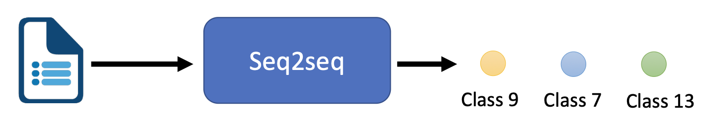
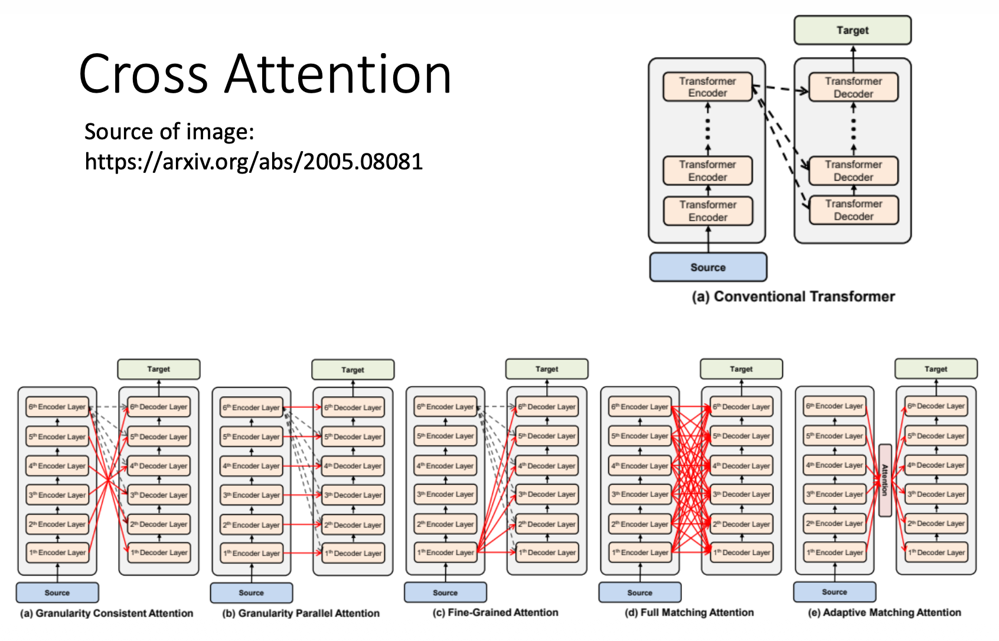

# Transformer

## Sequence-to-sequence (Seq2seq)

现在我们考虑一种**输入和输出都是序列**(sequence)的模型。这类模型的输出长度由模型自己决定。像语音识别，机器翻译，语音翻译等场景下的模型都属于这类模型。

    

下面介绍一些 Seq2seq 的具体应用：

???+ example "例子"

    === "例1：闽南语/台语"

        

            
        

        在训练的时候，我们不去考虑：

        - （肥皂剧的）背景音乐和噪音
        - （和声音对不上的）字幕
        - 闽南语的发音

        像这样不去考虑各种因素，直接拿数据训练的行为，李宏毅老师称之为“**硬 train 一发**”~

    === "例2：文本-语音(TTS)合成"

        

            
        

    === "例3：聊天机器人"

        

            
        

    === "例4：NLP"

        其实很多自然语言处理(NLP)的任务都可以看作是问题回答(QA)的任务，即使是一些看上去和 QA 没啥关系的任务也都可以想象成是 QA，比如机器翻译，为文章做摘要，情感分析(sentiment analysis)（下图就是其中一个例子）等任务。

        

            
        
   

        而 QA 这类问题就可以用 seq2seq 的模型来解决，相应的示意图如下所示：

        

            
        
 

        但需要注意的是，多数 NLP 任务，特别是和语音相关的任务，往往需要为这些任务定制模型，这样才能得到更好的结果；换句话说，seq2seq 模型就像一把瑞士军刀，什么都能做，但给出的结果不一定是最好的。

    === "例5：句法分析(syntactic parsing)"

        

            
        
        

    === "例6：多标签分类(multi-label classification)"

        !!! warning "注意"

            不要和前面介绍过的多类分类(multi-class classfication)弄混淆（前面介绍的分类都属于这种）。

        { align=right width=50% }

        多标签分类任务允许某个对象属于多个类中（而原先介绍的分类问题每个对象仅属于一个类）

        

            
        
     

    === "例7：目标检测(object detection)"

        

            
        

>上面的众多例子是想让读者感受到 seq2seq 模型的强大！

那么 seq2seq 模型具体是如何实现的呢？一般的 seq2seq 模型的组成如下所示：

    

  

- **编码器**(encoder)：处理输入序列，并将处理好的结果传给解码器
- **解码器**(decoder)：决定输出序列

下面这篇 paper 是 seq2seq 模型的最早起源：

    

  

当然，最知名的模型莫过于 [**Transformer**](https://en.wikipedia.org/wiki/Transformer_(deep_learning_architecture))（它也是目前众多主流 LLM 的基石，可见其重要性），所以下面将会详细介绍！

    

 

## Transformer

### Encoder

简单来说，编码器要做的事就是对于给定的一组（输入）向量，输出一组向量。也许读者会想：之前介绍的 [RNN](4.md#self-attention-vs-rnn) 或 [CNN](3.md#cnn) 也能完成这样的任务，那么这个编码器的高明之处在哪里呢？那我们就得关注编码器的具体实现了（右图）~

    

 

当然右图的结构有些复杂，所以下面给出简化后的样子：

    

 

可以看到，编码器内部被划分成多个块(block)，每个块要做的就是接收一组向量，然后输出新的一组向量，传递给下一个块。而每个块内部的实现如下——实际上用的就是前面刚介绍的[自注意机制](4.md) + [全连接神经网络](3.md)

    

注意：前面的实现是简化过的，在 Transformer 中真正的实现是长这样子的（就拿其中一个输入向量分析）：

    

- 记经过自注意处理得到的向量为 $\bm{a}$，原输入向量为 $\bm{b}$
- 先做一次**残差连接**(residual connection)：$\bm{a} + \bm{b}$
- 然后将残差连接后的结果做**层归一化**(layer normalization)处理
    - 归一化要做的就是：
        $$
        \begin{bmatrix}x_1 \\ x_2 \\ \dots \\ x_K\end{bmatrix}\ \Rightarrow\ \begin{bmatrix}x_1' \\ x_2' \\ \dots \\ x_K'\end{bmatrix}
        $$

        其中 $x_i' = \dfrac{x_i - m}{\sigma}$，$m, \sigma$ 分别为原向量的均值和标准差

- 接着将层归一化后的向量传给 FC，做和自注意机制类似的处理（重复上面的步骤）：

    

        
    

    图中红色边框的向量才是一个块的输出向量

---

    

 

上面的分析其实还漏了一些细节：

- 在进入自注意前，要对输入向量进行[位置编码](4.md#positional-encoding)
- 这里的自注意机制是[多头自注意](4.md#multi-head-self-attention)
- 右图中的 "Add & Norm" 就是残差连接 + 层归一化处理

知名的 [BERT 模型](https://en.wikipedia.org/wiki/BERT_(language_model))采用和 Transformer 编码器相同的网络架构。

原始的 Transformer 编码器中各模块的排列顺序不一定是最好的——有一些研究就是从这里出发做出一些改进：

    

 

### Decoder

解码器有 2 种，比较常见的是**自回归**(autoregressive)的解码器，所以先来介绍这个。

#### Autoregressive (AT)

下面以语音识别这一应用为例介绍。

    

- 解码器读取编码器的输出（至于怎么读[之后](#encoder-decoder)再说）
- 解码器还接收一个表示开始(START)的特殊记号，这个记号可以用一个独热向量来表示
- 解码器输出的向量长度和词汇表（这里包含了所有常见的汉字）的长度一致（因此很长）
- 在解码器生成向量前要经过 [softmax](2.md#softmax) 处理（类似做分类任务），使得向量所有元素之和 = 1，此时输出向量就是一个**概率分布**(distribution)
- 向量元素值最大的对应的字就是最终的输出

接下来就要将第一个输出（上图的“机”）作为解码器的第二个输入（也用独热向量表示），对应也会得到一个输出（比如下图的“器”）。之后的过程以此类推，所以就在赘述，可通过下面的示意图直观感受这一过程：

    

---
解码器的内部结构如下（比编码器更复杂）：

    

我们将编码器和解码器的结构图放在一起看，发现如果将解码器中间的模块遮起来后，二者的结构几乎一模一样，除了：

    

- 因为解码器输出的是一个概率而非向量，因此最后要做一步 softmax 处理
- 解码器的自注意是一种**掩码(masked)多头自注意**，下面就来分析其细节

先来回顾一下一般的自注意机制的样子：

    

而这是掩码后的自注意机制：

    

不难发现，在掩码版本的自注意机制中，输出向量 $\bm{b}^i$ 只能读取其左边的输入向量（从 $\bm{a}^1$ 到 $\bm{a}^{i}$），不能看所有的输入向量。以 $\bm{b}^2$ 为例，对应的示意图如下：

    

但为什么要这么做呢？答案就在解码器的工作机制中——前面提到过，解码器第 $i$ 个位置上的输出向量是根据之前的输出向量（左侧）得到的，所以它只知道前面的向量是什么，无法得知所有的输入向量。这就是为什么解码器的自注意比较特殊的原因。

---
由于我们无法预先得知正确的输出长度，所以如果不加处理的话，模型可能会一直输出下去，停不下来了，这显然不符我们的预期。

    

和解码器最初接收的 START 特殊记号一样，我们引入一种停止记号，记作 END。对于前面“机器学习”这四个字的语音识别，我们要求解码器在看到 BEGIN 记号和这四个字对应的输入向量后，就知道语音识别要结束了，应该输出 END 记号，从而结束输出。

    

#### Non-Autoregressive (NAT)

>下面仅简单介绍 NAT。

对比自回归(AT)和非自回归(non-autoregressive, NAT)这两类解码器：

    

不同于 AT 解码器一次只吐一个输出，NAT 解码器可以一次性吐出所有输出；并且 NAT 接收的是输入都是 BEGIN 记号。

- 如何决定 NAT 解码器的输出长度
    - 用一个预测器来决定
    - 允许输出一个非常长的序列，但是忽略 END 记号后面的输出
- 优点：并行程度高，更易控制输出长度
- 但 NAT 通常不敌 AT（原因：**多模态**(multi-modality)，这里不具体展开）

### Encoder-Decoder

接下来考虑前面被我们忽略掉的一个问题：编码器和解码器之间是如何传递数据的？这个结构就藏在前面被遮挡的解码器模块——**交叉注意**(cross attention)中：

    

注意到该模块有 3 个输入，其中有 2 个输入来自编码器的输出（蓝圈表示），另 1 个来自解码器内部。具体的结构如下：

    

其实和一般的自注意很像，不同之处在于 $\bm{k}, \bm{v}$ 和 $\bm{q}$ 是来自两个不同的地方（这应该就是 cross 的含义）。

交叉注意的实际案例如下（注意：下图不来自于 Transformer）：

    

>上图是编码器的输入（一列表示一个向量），下图是解码器的输出

还有人研究了不同的交叉注意的效果：

    

### Training

前面只介绍了 Transformer 模型的运作机制（对应模型的**测试**(testing)或**推理**(inference)），还没有讲过该如何**训练**模型。所以下面就来补充这块知识。

还是以“机器学习”这四个字的语音识别为例——

    

模型训练的目标就是让输出向量（概率分布）和**基准事实**(ground truth)（一种独热向量，就是标准答案）之间的差距越小越好。而这个差距就用[**交叉熵**](2.md#loss)(cross entropy)来量化（和分类差不多），所以目标就是最小化这个交叉熵。

常用的一种训练方法叫做**教师强迫**(teacher forcing)（~~好奇怪的术语~~）：将基准事实作为解码器的输入（让解码器“偷看答案”），希望解码器的输出结果和标准答案越接近越好（即最小化交叉熵）。

    

读者不难想到，这样的训练方法存在问题：测试的时候我们是让解码器读取前面的输出作为输入的，但训练的时候却读取基准事实，这中间就不太匹配。这个问题在后面会得到解决，先暂时放一下。

### Tips

!!! warning "注意"

    这里的 tips 不局限于 Transformer，其他的 seq2seq 模型同样适用。

#### Copy Mechanism

一般我们要求解码器自己产生输出，但有时解码器没有必要自己创造输出，而是从输入中复制一部分内容作为输出，这便是**复制机制**(copy mechanism)。下面列出一些可以用到这种技术的场景：

???+ example "例子"

    === "例1：聊天机器人"

        

            
        

    === "例2：总结文章"

        

            
        

最早具备这种复制机制的模型是**指针网络**(pointer network)，之后还有一种称为复制网络(copy network)的变体，这里就不展开介绍了。

#### Guided Attention

???+ bug "问题"

    在语音合成时，可能会遇到以下古怪的问题：

    

        
    

    当机器连说多个“发财”的时候是正常的，但只说一个“发财”的时候，机器就只说了“财”没说“发”。这意味着模型可能漏掉了一个输入。

像语音合成、语音识别这样的任务，输入和输出都是单调对齐的(monotonically aligned)，就很有可能出现类似上面的问题。解决方案是一种被称为**导向注意**(guided attention)的技术，强迫模型以固定的方式读取每一个输入。

    

以语音合成为例，我们希望模型的输出顺序是从左向右的，所以在运行的时候会为模型提供一个**注意权重**(attention weight)（或者注意分数），上图的曲线越高表示权重越大。这个权重会从左向右移动，从而确保输出是严格按照顺序来的。

如果不加这种约束，就很有可能出现这种乱序的情况，这显然是有问题的：

    

具体的导向注意应用有：

- 单调注意(monotonic attention)
- 位置感知注意(location-aware attention)

#### Beam Search

!!! info "注"

    假设解码器只有两个可能的输出 A 和 B。

下面的树状图列出了模型所有可能的输出情况

    

- 红色路径是**贪心解码**(greedy decoding)
- 绿色路径是最好的路径

要想找到最好的路径，最简单的做法是暴力搜索，把所有可能的路径遍历一遍。但路径树是可能输出数的指数，所以可能的输出数很多的时候，路径数就会变得特别大，显然是无法全部遍历一遍的。这时就要采用一种称为**束搜索**(beam search)的近似算法，寻找近似解。一件有趣的事是，该算法有时得到不错的结果，有时结果会很烂。

    

比如这篇 paper，两张图分别展示了用了束搜索和没用的结果。可以看到前者会陷入一个死循环（蓝色部分），而后者看着相对比较正常。这带给我们的启示是：有时没找到最佳路径不一定是件坏事，在某些任务（尤其是需要解码器发挥创造力的时候，比如句子补全，语音合成等）中为解码器引入一定的随机性可能有助于产生更好的结果。

#### Optimizing Evaluation Metrics

课程作业采用的评估标准是 BLEU score，它的做法是将解码器输出的完整句子和正确答案比较，也就是以句为单位做比较。但我们训练模型的时候是一个词一个词看的，分开来看每个词的交叉熵的。两者的关联不大，因此让交叉熵最小化不一定能提高 BLEU 分数。

    

那么怎样做优化呢？一个口诀是：如果不知道如何优化的话，那就用**强化学习**(RL)解决！

#### Scheduled Sampling

前面还放跑了一个问题：测试（左图）和训练（右图）结果的不匹配，这种现象称为**暴露偏移**(exposure bias)。由于测试的时候解码器读取的是之前的输出，假如之前的输出是错的，那么解码器就会根据这个错误的输入来接着输出，这样很有可能导致“一步错，步步错”的情况。

    

一种解决思路是：在训练的时候不要完全用基准事实，可以偶尔给一些错误的输入，这样反而模型会学的更好。这种技术称为**调度采样**(scheduled sampling)。

下面是一些有关该技术的参考资料，感兴趣的读者可自行到网上搜寻。

    

