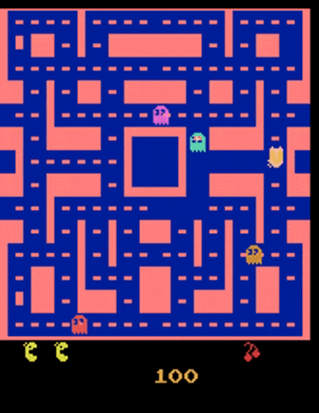
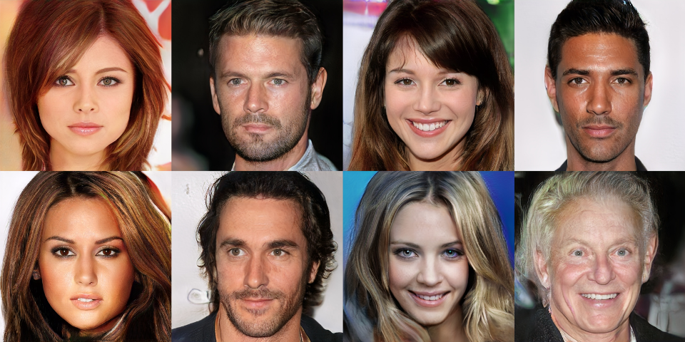
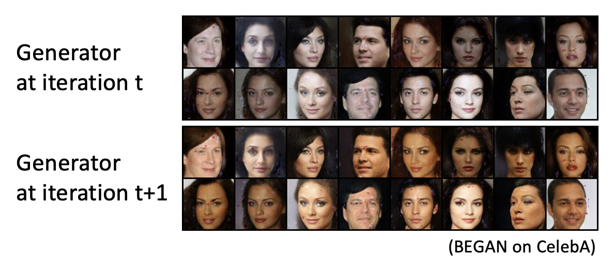
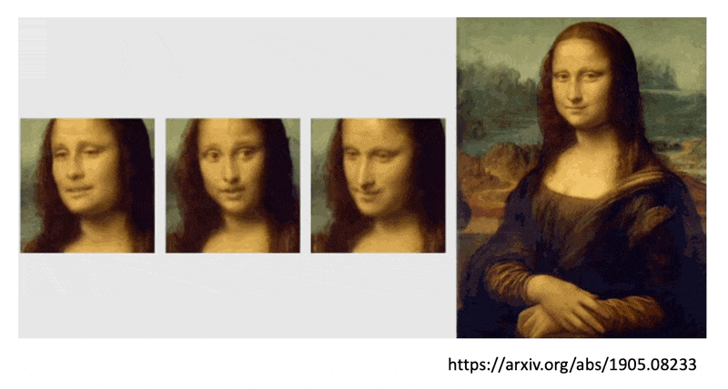

# Generative Adversarial Network

## Basic Idea

本讲将会介绍一种用于**生成**(generation)任务的网络。相比一般的网络，它的一大特殊之处在于：网络除了接收常规输入 $x$ 外，还会将一个简单的分布（即可以用分布函数/概率密度函数表示出来的分布）$z$ 作为输入，因而得到的输出是一个更为复杂的分布 $y$，如下所示：

    

这样的网络我们一般称之为**生成器**(generator)，或者成为**生成对抗网络**(generative adversarial network, **GAN**)。

???+ question "为什么要输入一个分布？"

    ???+ example "例子：视频预测"

        这是一段吃豆人游戏视频，我们希望搭建一个能够准确预测下一帧视频的模型。

        

            
        
    

        按照以前介绍的方法，我们可能会搭建以下网络架构：

        

            
        

        但用这样的网络训练得到的效果不尽人意：

        

            
        
 

        - 吃豆人跑到一半变成了幽灵
        - 影分身之术：尤其是到了岔路口的时候，吃豆人会变出一个分身，各自向不同方向移动

        我们目前只关注后一个问题——这个问题出在：因为吃豆人在岔路口上方向的选择具有一定的随机性（即输出不是固定的），仅靠一般的模型可无法预测吃豆人到底会往哪个方向走，所以训练出来的结果就是一部分会往方向A走，另一部分会往方向B走，因而出现了多个分身的情况。

        

            
        

        这个时候就需要用到一开始提到的带有分布的网络了！

        

            
        

    一般来说，当任务需要一些“创造力”的时候，也就是说单个输入对应多个可能的输出时，我们需要将分布作为网络的一个输入，比如：

    - 绘画
    - 聊天机器人
    - ...

---
>各色各样的 GAN（[The GAN Zoo](https://github.com/hindupuravinash/the-gan-zoo)）（不过已经停更很久了...）

下面以二次元人像生成为例，介绍 GAN 的大致原理。不过为方便起见，我们将固定输入 $x$ 暂时拿走（这成为**无条件生成**(unconditional generation)，对应有输入 $x$ 的生成为条件生成(conditional generation)）。

    

- 假定输入分布为正态分布（也可以是其他分布，但后面默认采用正态分布了），其中某个输入 $z$ 是从这个分布中采样出来的低维向量（维度可由我们自己决定）
- 输出的二次元人像是一张图片，而图片可以看作一个非常高维的向量（介绍 [CNN](3.md#neuron-version-story) 的时候提到过这点）

接下来，我们将输出的图像丢给一个叫做**判别器**(discriminator)的神经网络（可视作一个函数）。它会根据输入的图片给出不同数值的标量，值越大表明结果越真实，越小表明结果越虚假。

    

关于生成器和判别器这两个神经网络之间的关系，我们可以从进化论的角度来看待：假如用蝴蝶代表生成器，用某种以蝴蝶为食的鸟（宝可梦的某个精灵，~~但我一向对这类游戏不太感冒，所以不太了解~~）代表判别器。

- 蝴蝶为了避免被鸟吃掉（对应判别器给生成器的输出打低分），就会进化成棕色的蝴蝶，这样就能“骗过”鸟而幸存下来（对应判别器为新的生成器输出打高分）。
- 但为了吃到蝴蝶，鸟也要进化下去，所以不久后它也能去吃棕色的蝴蝶了（对应的新的判别器为生成器输出打低分）。
- 蝴蝶通过进化出形如枯叶的翅膀，又一次骗过了这种鸟。
- 鸟又随之进化，这个进化的故事将会继续下去...

    

回到之前的二次元人像生成的任务，生成器和判别器就像上述这样不断地进化：生成器努力生成质量更高的图像，期望从判别器中得到高分；而判别器则会提出更高的要求，以低分鞭策生成器生成更好的图像。可以看到，随着不断的迭代升级，图像的质量越来越高，从模糊不清的马赛克逐渐发展到有鼻子有脸的人像。

    

生成器和判别器之间的关系看起来是“对抗的”，这也正是 GAN 中 A 的由来。

### Algorithm

- 首先初始化生成器和判别器
- 在每次训练迭代中
    1. 固定生成器 $G$，更新判别器 $D$：通过学习，判别器能够对真实对象打高分，而对生成对象打低分

        

            
        

        - 真实对象的数据是从数据库中采样出来的，而生成对象就是现有生成器的输出结果（~~一开始可能生成的就是一坨意义不明的东西~~）
        - 上图的1和0表明“对真实对象打高分，而对生成对象打低分”的原则

    2. 固定判别器 $D$，更新生成器 $G$：生成器要学会“骗过(fool)”判别器

        

            
        

        - 我们可以将生成器，中间生成的图像（可看作一个高维的隐藏层）和判别器看作一个很大的网络，目标就是让这个网络的输出值（标量）越大越好，从而达到骗过判别器的效果

    将这2步放在一起的示意图如下所示：

    

        
    

??? example "例子：多轮迭代的效果"

    === "100次更新"

        

            
        

    === "1000次更新"

        

            
        

    === "2000次更新"

        

            
        

    === "5000次更新"

        

            
        

    === "10000次更新"

        

            
        

    === "20000次更新"

        

            
        

    === "50000次更新"

        

            
        

??? example "其他例子"

    === "StyleGAN"

        [一个很有意思的工作](https://www.gwern.net/Faces)，下面是其中一个 demo：

        

        {: style='width: 40%'}
        

    === "Progressive GAN"

        ??? question "思考"

            === "题目"

                这些图片中有哪些是真的，哪些是模型生成的？

                

                    
                

            === "答案"

                都是生成出来的！

        我们可以用 GAN 生成十分逼真但原本不存在的人脸，比如像下面这样，给出两张图片，模型会生成从一张图片到另一张图片的一系列变化（即做**插值**(interpolation)操作）：

        

            
        
 

    === "BigGAN"

        第一个的 GAN 的生成效果如下，可以看到并不理想：

        

            
        
 

        而 BigGAN 已经能够取得很不错的效果了！

        

            
        
 

        但也存在一些问题，比如生成这种现实世界不存在的物种：

        

            
        
 

## Theory

对于一般的网络，训练目标就是要最小化损失函数的值；而在 GAN 中，训练目标则是让模型生成的输出分布 $P_G$ 和真实数据的分布 $P_{data}$ 越接近越好。

    

 

方便起见，我们就讨论一维的情况（和上图是对应的）：

    

 

而这个接近程度可以用 $Div(P_G, P_{data})$，即两个分布的**发散程度**(divergence)来量化，这个值越小表明两者越接近。因此目标可转化为寻找生成器 $G^*$，满足：

$$
G^* = \arg \min\limits_G Div(P_G, P_{data}) 
$$

接下来的问题是：我们该如何计算这个发散程度呢？但好在对于 GAN 而言，我们只要能够从 $P_G, P_{data}$ 中采样出一些数据来，无需知道它们的完整形式，就可以计算出发散程度了。

    

 

接下来就要依靠判别器来计算发散程度：对真实数据打高分，对生成数据打低分。

    

 

而判别器的训练目标是得到 $D^* = \arg \max\limits_D V(D, G)$。其中 $V(D, G)$ 是被称为**目标函数**(objective function)，具体形式如下：

$$
V(D, G) = E_{y \sim P_{data}}[\log D(y)] + E_{y \sim P_G}[\log (1 - D(y))]
$$

从这个式子可以看出，我们希望从 $P_{data}$ 中采样得到的 $y$ 对应的 $D(y)$ 值越大越好，而从 $P_G$ 中采样得到的 $y$ 对应的 $D(y)$ 值越小越好，这样 $V(D, G)$ 的值就尽可能的大，满足判别器的训练目标。

目标函数的形式不必像上面那样。但之所以写成这个样子，是因为希望将判别器和二元分类器联系起来。

- 将 $V(D, G)$ 看作交叉熵的相反数
- 将训练判别器当做训练一个二元分类器，将真实数据分作一类，将生成数据分作另一类，训练这个分类器就能完成判别器的优化了

    

 

另外，$\max\limits_D V(D, G)$ 这个值和 **JS 发散程度**相关。下面从直观的角度来感受一下：

- 真实数据和生成数据接近，$\max\limits_D V(D, G)$ 的值较小，即发散程度小，判别器难以区分二者

    

        
    
 

- 真实数据和生成数据的分布较为发散，判别器区分比较容易

    

        
    
 

???+ abstract "总结"

    

        
    
 

???+ note "其他发散程度的计算方法"

    

        
    
 

值得一提的是，GAN 以训练困难著称（~~正所谓 "NO PAIN NO GAN"~~）。

## Tips

### WGAN

#### Problems of JS Divergence

多数情况下，$P_G, P_{data}$ 重叠的部分很少，这是因为

- 数据的本质：$P_G, P_{data}$ 是高维空间的低维流形(manifold)。它们的分布可以用二维平面上的两根线条表示，而线条之间重叠（即相交）的部分显然不会很多

    

        
    
 

- 采样：即便两者有重叠，但如果采样个数不多的话，重叠的部分还是很少

    

        
    
 

再来看 JS 发散程度的问题：只要 $P_G, P_{data}$ 不重叠，发散程度值恒等于 $\log 2$。也就是说无论两个分布有多接近，只要不重叠，就无法从 JS 发散程度值中看出来。

    

 

我们可以这样简单理解其中的原因：将判别器看作二元分类器；只要两个分布不重叠，分类器始终能够区分出这两个类，达到 100% 的精度（对应 JS 发散程度的定值 $\log 2$），而这样的精度（或者损失）对 GAN 的训练毫无帮助。

#### Wasserstein Distance

下面我们改用另一种衡量发散程度的方法，叫做**沃瑟斯坦距离**(Wasserstein distance)。为便于理解，我们先做一个比喻：将一个分布看作 $P$ 现有的土堆，另一个分布 $Q$ 看作目标形状的土堆，而这两个分布的发散程度就是推土机要将土堆移成目标形状的平均距离。

    

 

但即便是相同的 $P$ 和 $Q$，中间过程也可以有所不同，左侧图和右侧图分别展示了两种方案，其中左边所需的距离更少。

    

其中能够得到最小平均距离的方案定义了沃瑟斯坦距离。

沃瑟斯坦距离能够准确反应不同的发散程度：

    

像这种应用沃瑟斯坦距离来训练的 GAN 叫做 WGAN。而沃瑟斯坦距离可通过求解以下式子得到：

$$
\max\limits_{D \in 1\text{-Lipschitz}} \{E_{y \sim P_{data}}[D(y)] - E_{y \sim P_G}[D(y)]\}
$$

要想满足上面的式子，需要遵循以下约束：

- $P_{data}$ 对应的 $D(y)$ 值越大越好，$P_G$ 对应的 $D(y)$ 值越小越好（和之前提过的一样）
- 函数 $D$ 要足够平滑（对应上式 $D \in 1\text{-Lipschitz}$）
    - 如果不满足该约束，那么训练出来的 $D$ 永远也不会收敛
    - 只有让 $D$ 保持平滑，才能强迫 $D(y)$ 介于 $\infty$ 和 $-\infty$ 之间
    - 平滑的意思是，当 $P_G, P_{data}$ 比较接近时，对应的 $D(y)$ 值的变化不会很剧烈，不会出现 $D(y)$ 值很大的情况；而当两者相距较远时，变化相对比较剧烈（否则就和 JS 发散程度一样没法区分两个分布的接近程度了）

    

那么怎么做到 $D \in 1\text{-Lipschitz}$ 这一约束呢？下面给出了一些解决方案：

- 原始 WGAN -> 权重
    - 强迫训练参数 $w$ 介于 $c$ 和 $-c$ 之间
    - 参数更新后，若 $w > c$，$w = c$；若 $w < -c$，$w = -c$
    - 这个方法是比较粗糙的，不一定能够满足上述约束
- 改进 WGAN -> 梯度惩罚(gradient penalty)
    - 让真实数据分布（蓝圈）上某点和生成数据分布（红圈）上某点的连线上的采样点梯度保持在 1 附近

    

        
    
 

- 谱归一化（对应 SNGAN）：让梯度范数在任何地方小于1
    - 具体方法这里不介绍，感兴趣的话可以看[这篇论文](https://arxiv.org/abs/1802.05957)

### Training

尽管我们知道了 GAN 优化的衡量标准，但还是很难训练好 GAN，其中一个原因是 GAN 的生成器和判别器需要很好地匹配起来，否则的话只要某个模块因为什么问题停止训练的话，另一个模块也随之停止。

- 假如判别器无法区分真实数据和生成数据的不同，那么生成器也就难以继续改进生成质量了

    

        
    
 

- 假如生成器没法继续生成出能够骗过判别器的输出，那么判别器也会难以进化成更严格的版本

    

        
    
 

??? info "一些训练 GAN 的技巧"

    

        
    
 

#### GAN for Sequence Generation

训练 GAN 最难的任务之一便是序列生成。下面以文字生成为例来说明其困难之处。

    

- seq2seq 模型中的解码器可看作 GAN 中的生成器，由它生成的文字会丢给判别器，然后给出相应的分数
- 所以训练的目标就是更新解码器，让分数越高越好
- 但这很难做到，因为这个分数是不能微分的
    - 举例来说，假如略微调整了解码器的参数，那么解码器输出的分布也会有微小的变化
    - 然而我们只取其中的最大值（或者说记号(token)）作为输出，微小的变化无法体现在整个生成器的输出上，因此判别器还是给出相同的分数，因而就无法通过梯度下降法来训练模型

- 读者也许想用强化学习来解决这个问题，但强化学习同样以难训练著称，因此这样就是难上加难了（悲）

因此，很长一段时间内没人能成功用 GAN 很好地完成序列生成的任务，而且通常的做法是需要对模型做预训练(pretrain)。不过后来有团队通过调整超参数和采用各种技术，做到了不用预训练也能用 GAN 完成这一任务——这个模型就是 [ScratchGAN](https://arxiv.org/abs/1905.09922)。下图比较了一些 GAN 在文字生成任务中的表现（横轴值越低越好）：

    

### Possible Solution

对于二次元人像生成这类任务，还有一种简单粗暴的方法是直接采用本讲之前的模型架构（即采用传统的学习方法），具体来说：

- 从（正态）分布中采样出一些向量，和数据库中的图像一一对应
- 将向量作为输入，期望模型能够输出匹配的图片

    

但如果向量过于随机的话，训练效果会很差。

下面是一些相关工作：

- [Generative Latent Optimization (GLO)](https://arxiv.org/abs/1707.05776)
- [Gradient Origin Networks](https://arxiv.org/abs/2007.02798)

## Evaluation of Generation

下面以图像生成为例来谈谈评估生成质量的问题。

- 生成式模型刚起步的时候还没有很好的评估标准，所以当时都是用人眼来判别的，但这不仅成本高，而且不够客观（没有准确的分数）
- 一种自动评估生成图像质量的方法是将图像丢给一个分类器，这个分类器的输出是一个关于不同类的分布
- 这个分布越集中在某个类上，表明图像生成的质量越高（因为此时分类器非常肯定图像的内容属于某个类别）

    

然而，如果仅采用上述方法，首先就会遇到一个叫做**模式崩溃**(mode collapse)的问题：生成图像质量都是过关的，但是图像内容过于单一，只集中在部分类别上。

    

如右图所示，红框标出来的人像出现了很多次。

另一个关于多样性的问题是**模式丢弃**(mode dropping)：看起来生成图像质量高，也有丰富的多样性，但是相比真实的数据集而言多样性还是不够多。

    

??? example "例子"

    

        
    

    第 t 次迭代可能还看不出什么问题，但是到了第 t+1 次迭代发现生成图像只是变了个颜色而言（~~有点种族歧视了~~），脸型没有任何变化😂

下面来量化生成数据的**多样性**(diversity)——将一组生成数据过一遍本节开始提到的分类器中，得到一组概率分布，然后求这个概率分布的平均分布。

- 如果平均分布越集中，说明多样性越低

    

        
    

- 而分布越平摊则多样性越高

    

        
    

前面介绍的多样性评估和质量评估看似有些矛盾。所以曾经有一种常用的标准是**起始分数**(Inception Score, **IS**)——当质量越高，多样性越大时，IS 越大。但这个标准比较傻，比如对于不同的人像，人类能够识别到不同的发色、眼睛等，但对于采用 IS 的模型而言都是人脸，所以它认为多样性不是很大。

另一种标准是**弗雷歇起始距离**(Fréchet Inception Distance, **FID**)，它的计算方法是：

- 获取（计算起始分数的）网络中倒数第二层的输出（原来最后的输出是经过 softmax 后的结果，只保留了一个结论），这还是一个能够代表图像的向量
- 为方便期间，下图用蓝色的点来表示这样的向量，而黄色的点对应真实图像的向量
- 我们假定这些向量的分布就是正态分布，这两个分布的间距就是 FID
- FID 越小，代表两组图像越接近，那么生成图像质量也就越高
- 这个方法存在一些问题
    - 假定是正态分布，但实际上并不一定成立
    - 要准确得到分布，需要采样大量数据

    

??? example "FID 的应用"

    

        
    

---
即便是 FID，也没法解决这样的问题：生成的图片 FID 很小，但是缺乏“创新”，比如仅仅生成和真实图像一模一样的图像，或者只是简单地对原图像做了翻转工作，这显然不是我们想要的效果。

    

??? abstract "一篇关于各种 GAN 评估方法的评价的论文"

    

        
    

## Conditional Generation

从结构上来看，**条件生成**(conditional generation)就是在无条件生成的基础上加了个固定的输入 $x$。

    

条件生成的一大应用是**文生图**(text-to-image)。文生图是一个[**自监督学习**](7.md)（下一讲就会介绍）的问题，需要一些标注好的数据(labelled data)，在这个任务中就是一些对图像特征有一定描述的图像（对应输入 $z$）。而固定输入 $x$ 就是一段文本，表述用户希望生成什么样的图像。

    

下面来看 GAN 的具体模块：

- 生成器：就多了个输入 $x$

    

        
    

- 判别器
    - 如果保留原来的判别器结构，那么虽然仍然可以生成高质量的图像，但是图像内容和文本描述 $x$ 不一定能匹配上，因为判别器可没有考虑到 $x$ 的存在
    - 所以判别器也要将 $x$ 作为输入，输出不仅能够反映 $y$ 的质量，还能体现出 $x$ 和 $y$ 的匹配程度（比如只有质量高 + 完全匹配才给 1，只要少一样就给 0），从而起到训练效果

    

        
    

???+ example "各种应用"

    === "图像翻译（图生图）"

        这个任务要求模型能根据用户输入的简笔画，生成真实世界中对应的图像。

        

            
        

        但是只用 GAN 的话，可能会画出不存在的物体，因为 GAN 的创造力可能有些过头了。这个时候可以结合自监督学习的方法得到更好的效果。

        

            
        

    === "音生图"

        

            
        

    === "让蒙娜丽莎“说话”"

        

            
        

## Learning from Unpaired Data

最后来谈谈如何将 GAN 用在**无监督学习**(unsupervised learning)上。前面讲的基本都是监督学习，需要成对的数据（一个输入 $x$ 匹配一个输出 $y$）才能训练起来。但有时我们会遇到 $x$ 和 $y$ 没有匹配(unpaired)的情况，像这样的数据被认为是未标注的(unlabelled)。

    

尽管作业中给出了 pseudo labeling 和 back translation 这样的解决方案，但是它们还是需要一定量的成对数据，因此我们需要考虑完全使用不成对数据的方法。先来看图像风格转换(image style transfer)这一任务，它的要求是将真人图像（$x$ 域）转换为二次元风格的图像（$y$ 域），而这两个域内的数据是不成对的。

    

要想从这样的数据中训练出模型，用到的技术是**无监督条件生成**(unsupervised conditional generation)。

如果用的是原来的网络架构，示意图如下所示：

    

要考虑生成器和判别器的话，内部大概长这样：

    

乍看之下好像没毛病，但仔细思考一下不难发现这样的问题：生成器要想“骗过”判别器，只要能够生成高质量的二次元图像就行了，无需考虑输入图像到底是什么，反正判别器不会看这个东西，因此整个 GAN 可能会生成和输入图像没有任何关系的二次元图像。

    

为了避免这一情况出现，除了原有的从 $x$ 到 $y$ 的生成器（记作 $G_{x \rightarrow y}$ 外，还需新增一个生成器 $G_{y \rightarrow x}$，将 $G_{x \rightarrow y}$ 生成的二次元图像 $y$ 重新转换为真人图像，然后比较这个生成出来的真人图像和原来的真人图像间的差异（两张图像对应两个向量，向量之间的距离越小表明二者越接近）。这样就能确保生成的二次元图像不会和真人图像相差甚远，否则二次元图像转换为真人图像这步就要出岔子了。

=== "错误示范"

    

        
    

=== "正确示范"

    

        
    

!!! info "注"

    尽管模型有可能会学到一些奇怪的转换（比如将图像翻转，或者将眼镜转化为脸上的痣），但实践上很少会遇到这样的情况，所以不必过于担心。

另外，我们还会对二次元图像做类似的转换，即让二次元图像先过一遍生成器 $G_{y \rightarrow x}$ 得到真人图像，再将这个真人图像过一遍生成器 $G_{x \rightarrow y}$ 得到二次元图像，然后比较两个二次元图像的接近程度。这两个转换和在一起构成的 GAN 叫做**Cycle GAN**。

    

??? example "其他类似的技术"

    

        
    

    

        
    
