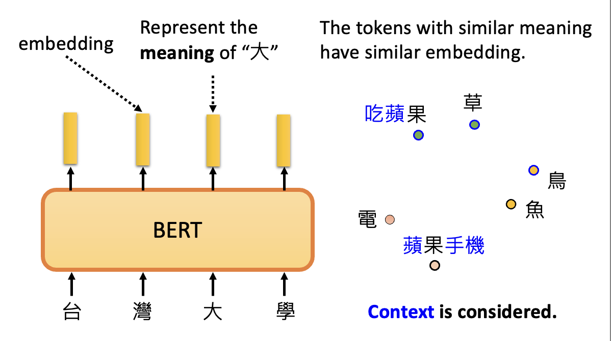
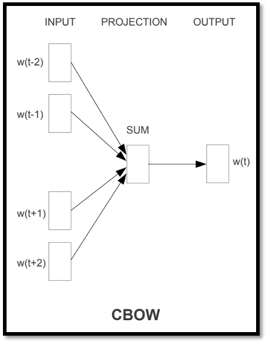
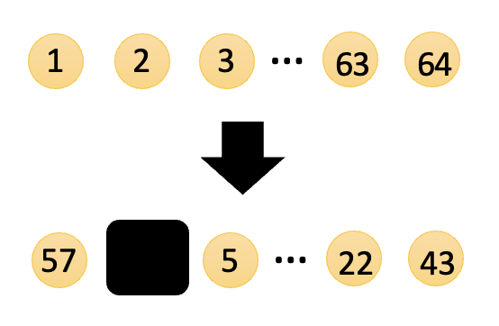
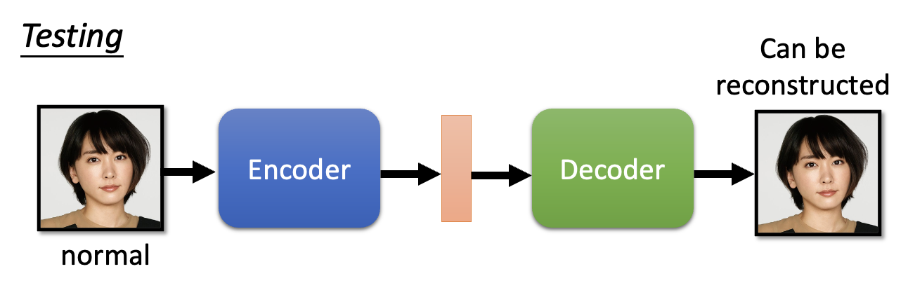

# Self-Supervised Learning

??? abstract "各模型参数量比较"

    由于课程是 2021 年的，所以列出的模型都有些过时了...

    - ELMO：94M
    - BERT：340M
    - GPT-2：1542M
    - Megatron：8B
    - T5：11B
    - Turing NLG：17B
    - GPT-3：175B
    - Switch Transformer：1.6T

前面讲的内容几乎都属于**监督学习**(supervised learning)：我们手边有成对的数据 $x$ 和 $\hat{y}$（标签），将 $x$ 丢给模型后，模型会输出 $y$，和标签数据 $\hat{y}$ 做比较，预期效果是通过不断的训练，让 $y$ 和 $\hat{y}$ 尽可能接近。

对应地，**无监督学习**(unsupervised learning)没有用到标签。而且上一讲提到过的**自监督学习**(self-supervised learning)实际上是无监督学习的一种。它将已有的数据 $x$ 分作两堆，一堆记作 $x'$，作为模型的输入；另一堆记作 $x''$，作为模型输出的比较对象。训练的目标就是让模型输出 $y$ 和 $x''$ 越接近越好。

    

## BERT

### Basic Ideas

首先介绍的 BERT 便是一种经典的自监督学习的模型。简单来看，BERT 就是 Transformer 中的[编码器](5.md#encoder)，接收一个序列，输出另一个序列。由于 BERT 一般用于 NLP 的任务上，所以之后就假设 BERT 将一串文字作为输入（当然也可以将图像和语音作为输入，不过这里不会展开介绍了）。

首先，相较于 Transformer 编码器的一个不同在于训练时要随机掩盖(mask)序列中的某个记号(token)，具体的掩盖方式有：

- 采用特殊记号（对应字典中不存在的字）
- 从已有的记号集中随机挑选一个记号（对应从字典中随机挑一个字）

    

接下来要对被掩盖输入对应的输出做一个线性变换（就是乘上一个矩阵），然后做一个 softmax 操作，这样得到了一个关于文字的分布（和 seq2seq 模型中的类似，本质上还是一个向量）。

    

我们已经知道被掩盖的输入是什么，而这个输入将被表示为一个独热向量，和上面得到的输出做比较。训练的目的就是要最小化两者的交叉熵。

    

---
除了上述的训练方法外，还有一种叫做**下一句预测**(next sentence prediction)的技术。

    

- 输入由2个句子组成
- 此外输入还包括了两类特殊记号
    - CLS：仅出现在开头，并且之后仅考虑它的输出
    - SEP：作为句子间的分隔符
- 仅考虑 CLS 对应的输出，将其做线性转换 + softmax，得到的结果为 yes/no，即表明这两个句子是否是相关联的

不过有论文（[Robustly optimized BERT approach (RoBERTa)](https://arxiv.org/abs/1907.11692)）指出，这个训练方法不太有用。但是有一种类似的，但是比较有用的方法，叫做**句子顺序预测**(sentence order prediction, SOP)，它被用在 [ALBERT](https://arxiv.org/abs/1909.11942) 模型中。也许是该方法提出的问题比较困难，因而得到不错的训练效果。

---
所以总的来说，BERT 能做的就是“填空题”（即第一个训练**掩码记号预测**(masked token prediction)，~~第二个训练没啥用~~）。看似用处不大，但在 BERT 基础上**微调**(fine-tune)后的模型就能完成**下游任务**(downstream tasks)（即我们关心的具体任务，且有一些标注过的数据）了。所以 BERT 就像一个胚胎干细胞，有着无限的发展潜能，可分化成各式各样的细胞完成不同工作。而训练 BERT 的过程我们称为**预训练**(pre-train)（这里就是自监督学习）。 

    

### GLUE

由于 BERT 可分化成各式各样的模型完成不同任务，所以在测试 BERT 的时候也会用多种任务来测。其中较为知名的任务集是 **GLUE**（全称 General Language Understanding Evaluation，通用语言理解评估），它包含以下几个任务：

- Corpus of Linguistic Acceptability (CoLA)
- Stanford Sentiment Treebank (SST-2)
- Microsoft Research Paraphrase Corpus (MRPC)
- Quora Question Pairs (QQP)
- Semantic Textual Similarity Benchmark (STS-B)
- Multi-Genre Natural Language Inference (MNLI)
- Question-answering NLI (QNLI)
- Recognizing Textual Entailment (RTE)
- Winograd NLI (WNLI) 

>[官网](https://gluebenchmark.com/)，[中文网站](https://www.cluebenchmarks.com/)

下面是一些用到 BERT 的模型在 GLUE 下的分数：

    

- 黑线表示人类能够达到的水平
- 蓝线表示模型在 GLUE 中的分数（其他几项任务的平均分）

### Applications

下面介绍一些用到 BERT 的，但用于不同场合下的模型，来感受一下 BERT 真正强大的地方。

#### Sentiment Analysis

在**情感分析**(sentiment analysis)任务中，模型输入的是一个序列（文本），输出的是一个类（积极的/消极的）。具体的模型架构如下所示：

    

- 除了将整个句子作为输入外，还要在开头输入一个特殊记号 CLS
- 对 CLS 在 BERT 中的输出做一个线性变换 + softmax 操作（图上省略了），得到的输出就是句子所属的类
- BERT 模型就是之前预训练得到的 BERT，这比从头开始用随机数初始化效果好很多，但之后仍然会通过训练继续改进
    - 下图比较了预训练和随机的效果，可以看到采用预训练的模型，无论是训练速度还是训练效果都比随机来的好

        

            
        

- 但线性变换那边的参数可以用随机数来初始化，会在训练过程中不断调整

#### POS Tagging

在**词性标注**(POS tagging)任务中，输入和输出都是序列，但输入是原始的句子，而输出是句子中每个词对应的词性。其对应的模型如下所示：

    

可以看到，这次考虑的不是 CLS 的输出，而是其余每个词对应的输出，这正符合任务的要求。

#### Natural Language Inference

**自然语言推断**(natural langauge inference, NLI)任务相对复杂些：

- 输入的是两个句子，其中一个叫做**前提**(premise)，另一个叫做**假设**(hypothesis)
- 输出的是一个类，表示前提和假设之间的关联，有矛盾(contradiction)（假）、蕴含(entailment)（真）和中立(neutral)（未定）这样几类

    

相应的模型如下：

    

整体结构类似 BERT 的“下一句预测”训练方法，所以就不再赘述。

#### Extraction-based Question Answering

“**基于提取的问答**(extraction-based QA)”这一任务更为复杂，它的输入和输出均有2个，其中

    

- 输入（可简单看做两个字符串）
    - 文档(document) $D = \{d_1, d_2, \dots, d_N\}$
    - 查询(query) $Q = \{q_1, q_2, \dots, q_M\}$
- 输出是两个整数
    - 起始位置 $s$
    - 结束位置 $e$
- 答案为 $A = \{d_s, \dots, d_e\}$

??? example "例子"

    

        
    

下面来看模型的结构，先仅考虑 BERT 的部分：

    

同样也和“下一句预测”训练方法中的类似，但我们规定第一句话作为查询，第二句话作为文档。

该模型唯一要训练的是两个向量。它们是用随机数初始化的，长度和 BERT 的输出向量长度一致，一个用于寻找起始位置 $s$（橙色矩形），另一个用于寻找结束位置 $e$（蓝色矩形）。

    

- 先让文档对应的输出向量和橙色矩形对应的向量做内积，再放到 softmax 中，将分数最大者对应的位置作为答案的起始位置

    

        
    

- 再让文档对应的输出向量和蓝色矩形对应的向量做内积，再放到 softmax 中，将分数最大者对应的位置作为答案的结束位置

    

        
    

对于上面的例子，答案就是 $A = \{d_2, d_3\}$

### Training

在自己电脑上训练 BERT 是一件比较困难的事，因为 BERT 的训练需要 3B 词的数据，如果用 TPU v3 来训练的话需要 8 天时间。

>不过现在 v7 都出来了，应该会快得多；而且 BERT 和现在的模型比就是小巫见大巫了...

    

#### BERT Embryology

由于 BERT 训练需要耗费大量运算资源，因此人们想办法节省资源，让训练变得更快。而想要让训练变得更快，就得关注训练 BERT 的过程，而在之前可能没什么人会关注。BERT 胚胎学(embryology)就是观察 BERT 训练过程中在何时已经具备了处理某些具体任务（词性标注、句法解析、语义分析等）的能力，就像观察从胚胎到婴儿的进化过程中何时发展了什么样的器官（~~后半句是个人理解~~）。

具体的答案就不展开介绍（PPT 上说是“反直觉的”），感兴趣的读者可参考这篇[论文](https://arxiv.org/abs/2010.02480)。

#### Pre-training a Seq2seq Model

前面介绍的任务没有包含 seq2seq 的任务，因为原始的 BERT 只考虑了编码器。但实际上也可以对解码器进行预训练，具体做法是给 seq2seq 模型一个被“破坏(corrupt)”过的输入序列，我们希望模型的输出和被破坏前的输入尽可能接近，也就是想要让模型具备重构(reconstruct)或还原输入的能力。

    

在一篇叫做 MASS 的论文中给出了以下“搞破坏”的方法：

- 像 BERT 那样对输入中的部分记号做掩码
- 删掉某个记号
- 重新排列
- 翻转顺序
- 结合各种方法

而在另一篇名为 BART 的论文中采用了上述全部方法，发现训练的效果是比较不错的。

    

至于上述方法哪种更好的话，已经有研究做过了，比如：

- Transfer Text-to-Text Transformer (T5)
- Colossal Clean Crawled Corpus (C4)

    

    

### Why Does BERT Work?

BERT 的输出向量称为**嵌入**(embedding)。在处理文本任务中，嵌入就代表了每个文字（记号）的意思，并且有一个结论是相似意思的记号会有相似的嵌入。

有时还得考虑一词多义的情况——不过不用担心，BERT 会考虑上下文(context)的。

    

考虑“喝苹果汁”中的“果”和“苹果电脑”中的“果”，因为在不同的上下文中，它们的相似度是不大的。下面比较了更多上下文中“果”的相似度（颜色越黄表示相似度越大，越蓝表示相似度越小）：

    

>注：横轴的内容和纵轴是一样的。

很明显，由于图中左上角和右下角的上下文比较接近，因此相似度会更大一些，另外两部分的相似度则很小。

那么 BERT 是如何得知每个字对应的意思的呢？方法和一开始介绍的掩码记号预测类似，同样要先盖住想要知道意思的那个字，然后让 BERT 根据其他输入的字来推测这个字的意思。

    

不过在 BERT 之前就出现了类似的技术，比如**词嵌入**(word embedding)中的 CROW，它也是考虑除了需要知道意思的那个字外的（相邻的）其他字，但是它只用两个变换（线性模型）就能完成任务，计算效率会更高些（~~当然也受限于当时的计算资源~~）。

    

相比 CROW，BERT 更加强大，它能根据上下文为相同的字给出不同的嵌入向量输出，因此 BERT 这里的技术又称为**上下文化的词嵌入**(contextualized word embedding)。

### Multi-lingual BERT

顾名思义，**多语言**(multi-lingual) **BERT** 需要用多种语言来训练的 BERT。

    

多语言 BERT 的强大之处在于，它能完成**零样本阅读理解**(zero-shot reading comprehension)的任务，例如仅根据英文 QA 例子（SQuAD）来训练，就能在中文 QA （DRCD）的测试取得不错的成绩。测试结果如下：

    

为什么能够实现这样的效果呢？一种简单的解释是**跨语言对齐**(cross-lingual alignment)，即对于不同语言，但意思相近的文字，它们对应的嵌入向量也是比较接近的，如下图所示。

    

用于衡量多语言 BERT 表现的任务集是平均倒数排名(Mean Reciprocal Rank, MRR)。下图比较了 Google 的 BERT 和李宏毅老师团队自己训练的较小的 BERT 的表现：

    

从李宏毅老师团队训练的两个模型中可以看出，训练数据量对于跨语言对齐而言是很关键的——从 200k 到 1000k，准确率高了不少（不过训练的时候比较坎坷，中间有段时间损失一直降不下去，训练了 2 天后就突然降下去了😂）。

    

也许读者产生这样的疑问：不同语言的 BERT 不是单独训练的吗，那为什么模型能从英文语料的训练中学到了解决中文问题的能力呢？事实上，多语言 BERT 能够在多种语言的训练中找到不同语言间存在的一些关联，比如意思相近的中英文嵌入向量之间的距离保持在一定范围内，因此可以记录所有中文嵌入向量的平均和英文嵌入向量的平均之差（也是一个向量）。

    

    

??? example "例子"

    === "例1"

        [On the Language Neutrality of Pre-trained Multilingual Representations](https://arxiv.org/abs/2004.05160)

        

            
        

    === "例2"

        [It’s not Greek to mBERT: Inducing Word-Level Translations from Multilingual BERT](https://arxiv.org/abs/2010.08275)

        

            
        

通过这种方法，我们可以让多语言 BERT 完成无监督记号级翻译(unsupervised token-level translation)的任务。尽管完成的并不是很出色，但是从中可以看出 BERT 的跨语言学习能力：

    

跨语言模型的基准测试：[Cross-lingual TRansfer Evaluation of Multilingual Encoders(XTREME)](https://sites.research.google/xtreme)

    

### Cross Discipline

接下来介绍 BERT 的一种神奇应用：完成蛋白质、DNA 和音乐的分类。下面是一个关于 DNA 分类的示意图：

    

那么接下来就以 DNA 分类任务为例展示用到 BERT 的模型架构图：

    

可以看到这个架构图和情感分析的模型是类似的，但不同之处在于我们不会将4种碱基直接丢给 BERT，而是先将碱基转化为文字（自己决定，什么文字都行）然后再丢给 BERT。这种做法看似莫名其妙，但更奇妙的地方在于这样做真的能将模型训练起来，而且还能取得不错的效果（红色方框，蓝色方框对应从随机参数开始训练起来的模型）（~~黑人问号.png~~）。

    

至于背后的原因仍然没能搞清楚（~~赛博玄学了属于是~~）。不过能够肯定的是，预训练模型能从分类任务中学习到一些通用能力，从而解决一些跨学科（而不是仅和语言相关）的任务。

上述结果并非巧合，不少预训练模型也具备这种跨学科的能力，结果如下：

    

那么这种在人类语言上经过预训练的模型是在哪个层面上起到帮助作用呢？实验结果表明，无论是在优化阶段，还是泛化（举一反三的能力）的时候，使用预训练的模型相比从头开始训练的模型在损失和精确率上都有不小的提升。

    

---
下面介绍一些跨学科能力的应用：

- 托福听力理解测试：[Github 仓库](https://github.com/iamyuanchung/TOEFL-QA)，[论文](https://arxiv.org/abs/1608.06378)
- [SQuAD-style Spoken QA](https://arxiv.org/abs/1804.00320)：级联模型（ASR + Text QA）

    

        
    
 

- [Speech BERT](https://arxiv.org/abs/1910.11559)：一种端到端(end-to-end)（这里指语音输入问题，语音回答问题）的模型，但训练的时候需要成对的语音和文本数据

    

        
    

- 我们希望在训练的时候只用语音数据，而不使用文本数据

    

        
    

    
    在过去这是一个难题，不过现在有了像 HuBERT 这样的语音预训练模型后，可以尝试着完成这项任务。若直接用这种预训练模型，模型还是没法训练起来，因为输出向量缺少语义信息。

    

        
    
  

    解决方法是将输出向量离散化，得到一系列的 token ID，然后在后面再用一个文本预训练模型（比如 BERT），从而让模型具备理解的能力。但由于 BERT 要求的输入是文本内容而非 ID，所以 token ID 和文本之间有一个映射（类似前面介绍 DNA 分类任务中碱基和词汇的匹配）。

    

        
    
 

    下图展现了该模型的表现：

    

        
    

## GPT

GPT 要做的任务是预测下一个出现的记号。它的结构类似 Transformer 中的[解码器](5.md#decoder)，在预测当前记号时不会去看下一个记号（采用掩码），但区别在于原来的解码器并没有 BOS 这个记号。

    

由于 GPT 具备预测下一个记号的能力，因此它也具备**生成**(generation)的能力。

接下来看 GPT 在 QA 这个下游任务中的应用。一种做法是让 GPT 像使用 BERT 那样做微调，训练出一个分类器出来。但这显得没新意，而且 GPT 模型参数量太大，微调有些困难。所以我们采用另一种做法：让 GPT 像人类一样，根据问题描述和一些例子（包括题目和答案），预测其他题目（给定提示词(prompt)）的答案。根据训练用到例子的多少，可以分为以下几类：

- **少样本学习**(few-shot learning)
- **单样本学习**(one-shot learning)
- **零样本学习**(zero-shot learning)

    

由于上述学习不是一般的学习（没有用到梯度下降法），所以这类学习方法又称为**语境中学习**(in-context learning)。下面比较了这3种学习方法的训练效果：

    

显然，随着参数量的增加，训练效果越来越好；而且训练用到的样本数越多，训练效果也越好。

## Other Domains

>【7.17 补充】更详细的内容见[最后一小节](#self-supervised-learning-for-speech-and-images)。

介绍 BERT 和 GPT 的时候，我们基本上都是以文本处理相关的任务为例子的。实际上这些模型均能用于文本之外的任务，比如图像、语音等等。下面列出了一些适用于其他领域的一些模型：

    

??? example "具体应用"

    === "图像"

        === "SimCLR"

            

                
            

        === "BYOL"

            

                
            

    === "语音"

        

            
        

不过相较于文本，语音领域缺乏可用的基准测试集（~~课是 2021 年的，现在情况可能不一样了~~），所以李宏毅老师团队和其他团队共同构建了一个叫做 **SUPERB** 的基准测试。下面截取了 PPT 的描述，所以这里就不再赘述了。

    

下面是工具箱(toolkit)包含的内容：

    

## More about Pre-trained Language Models

### Basic Ideas

**神经语言模型**(neural language model)：一种确定词句出现概率的神经网络。

    

>很明显左边句子出现概率更大，因为右边是一段无意义的句子。

这种语言模型的训练思路是：给定一个不完整的句子，让模型预测句子的剩余部分。

    

有以下几类语言模型：

- **自回归语言模型**(autoregressive language model, ALMs)：基于前半部分补全句子

    ??? example "例子"

        === "预测第2个字"

            

                
            

        === "预测第3个字"

            

                
            

        === "预测第6个字"

            

                
            

- **掩码语言模型**(masked language model, MLMs)：使用未被掩码的词来预测被掩码的词（填空(cloze)）

    

        
    

训练语言模型的方式属于**自监督学习**(self-supervised learning)，即从其他输入部分预测输入的某些部分。

另外，语言模型的内部结构一般是基于 Transformer 的，对应前面的两类模型，架构图分别如下所示：

- 基于 Transformer 的 ALMs

    

        
    

- 基于 Transformer 的 PLMs（对应 MLMs）

    

        
    

这里的 "PLM" 是**预训练语言模型**(pre-trained language model)的缩写。其中“预训练”的意思是用一个很大的数据集（语料库）来训练神经语言模型，具体可分为：

- 自回归预训练：GPT 系列（GPT, GPT-2, GPT-3）
- 基于 MLM 的预训练：BERT 系列（BERT, RoBERTa, ALBERT）

通常认为经过预训练后，PLM 会学到一些知识，这些知识会被编码在模型的隐藏层中，在后续下游任务的完成中发挥作用。在将 PLMs 用于下游任务前，往往要对模型先做**微调**(fine-tuning)，即使用 PLMs 中预训练好的权重参数来初始化用于下游任务的模型。

    

??? example "例子：情感分析"

    

        
    

    更底层的架构图如下所示：

    

        
    

    可以看到，我们去掉了 PLM 原有的 LM 头（用于输出概率分布），并添加了一个分类器头，用于输出分类结果（积极/消极）。

在实践中，微调后的 PLMs 在多项不同的下游任务中能够取得优异的表现。

    

因此，PLMs 被广泛用于不同情况和不同领域中。可以看到，PLM 的概念随处可见：

    

这个故事看起来很圆满——既然 PLMs 能够“斩下”多个基准测试数据集，那是不是说它就是无所不能的了？但现实往往是残酷的，在有些现实场景下，PLMs 的应用往往是不现实的。下面就让我们来认识一下 PLMs 存在的问题。

### Problems

这里列出有关 PLMs 的一系列问题：

- 下游任务的数据短缺
    - 并不是所有任务都有足够多的标注好的数据，因为标注数据需要不小的成本，而且有些任务能提供的数据量一般是很少的

    

        
    

- PLMs 太大了，而且还会继续大下去
    - PLMs 各模型的大小比较（按时间排序），可以看到总体上每年呈增长趋势

        

            
        

    - 对于不同的下游任务，需要有不同的 PLMs 拷贝，这些拷贝会占据过多的空间

        

            
        

    - 推理时间长（下图中的 PLM 有 96 层 Transformer，训练下来得花不少时间）

        

            
        

### Solutions

#### Data-Efficient Fine-tuning

对于标注数据短缺的问题，采用的解决方案是**数据高效的微调**(data-efficient fine-tuning)，具体包括以下几类：

- **提示调优**(prompt tuning)
    - 在**自然语言推理**(natural language inference)任务中，通常需要给模型喂足够多的形如（前提，假设，结论）的数据
    - 但假如现有数据量不多的话，可能无法将模型训练到令人满意的效果，此时我们可以向数据插入一些东西，便于模型“理解”
    - 具体来说就是将数据集中的数据点转化为自然语言提示，以便模型理解它应该要完成的任务

    

        
    

    - 提示调优中的“**提示**(prompt)”就是将下游任务格式化为具有预定义模板的语言建模任务，形成自然语言提示
    - 提示调优包括：
        - **提示模板**(prompt template)：数据点 -> 自然语言提示

            

                
            

        - PLM：执行语言建模

            

                
            

        - **词汇化器**(verbalizer)：标签到词汇的映射

            

                
            

    - 比较提示调优和标准的微调：

        

            
        

    - 提示调优在数据短缺的情况下能取得更好的表现，因为
        - 包括了人类知识
        - 没有引入新的参数

        

            
        

- **少样本学习**(few-shot learning)：有一些标注好的数据
    - “一些”的概念往往含糊不清，这里就假定是十几份数据了
    - 关于 GPT-3，好消息是它适用于少样本的情景下，坏消息是它不是免费的，且参数量太大（175B）
    - 所以我们想要一种更小的，能在少样本上表现较好的 PLMs——一种满足要求的模型是 **LM-BFF**，全称是更好的少样本微调语言模型(better few-shot fine-tuning of language model)，它的核心部分是**提示词**(prompt) + **演示**(demonstration)

    

        
    
   

    
- **半监督学习**(semi-supervised learning)：有少量标注数据和大量未标注数据
    - 采用的训练方式是**模式利用的训练**(pattern-exploiting training, PET)，具体步骤为
        1. 在标注数据集上，用不同的提示词和词汇化器来提示调优出不同的 PLMs

            

                
            
 

        2. 在未标注的数据集上进行预测，并将来自不同模型的预测结果结合起来

            

                
            
 

        3. 用带有分类器头的 PLM 在软标记(soft-labeled)的数据集（第二步得到的汇总结果）上进行训练

            

                
            
      

- **零样本学习**(zero-shot learning)
    - 零样本推理：在没有训练数据的情况下对下游任务的推理
    - 只要模型足够大，GPT-3 就还能在零样本的情况下发挥作用，这是因为在预训练的时候，训练数据集内含不同任务的混合体，使得模型具备这种零样本生成的能力
    - 有人因此获得了灵感，尝试直接基于多任务数据集来训练模型

    

        
    

    - 使用 PLM 进行多任务的微调

        ??? example "例子"

            

                
            
 

    - 有时像这样的得到的小模型（参数量：11B）的表现甚至好过 GPT-3（参数量：175B）

        

            
        

#### Reducing the Number of Parameters

减少参数量的可行思路有：

- 先预训练一个大模型，然后在下游任务中采用更小的模型（**蒸馏**(distillation)/**剪枝**(pruning)）

    

        
    

- 在 Transformer 层中共用参数

    

        
    

一般采用以下方法：

- **参数高效的微调**(parameter-efficient fine-tuning)：每个下游任务使用少量参数

    

        
    

    - **适配器**(adapter)：使用特殊的子模块来改变隐藏层中的表示

        

            
        

        适配器内部结构如右图所示：

        

            
        

        简单来说，适配器要做的事就是先将向量 $\bm{h}$ 从高维转为低维，然后经过一个非线性转换后，又从低维转为高维，再加上原来的向量，得到一个新向量 $\bm{h}'$。训练的时候只需更新适配器和分类器头的参数即可。

        

            
        

        另外，所有的下游任务可共享同一个 PLM，而适配器和分类器头对每个任务而言是不同的模块。

    - **LoRA**：同样使用特殊的子模块来改变隐藏层中的表示，但是并行地加在网络中，不改变网络深度

        

            
        

        具体结构如下：

        

            
        

        放大红框部分的细节：

        

            
        

        和适配器类似，训练时也只需更新 LoRA 和分类器头的参数即可。

        

            
        

    - **前缀调优**(prefix tuning)：向每一层插入前缀向量

        

            
        

        具体细节为：

        

            
        

        >注：前缀向量无需生成查询向量。

        训练的时候只需更新前缀向量（包括键和值）即可。

        

            
        

    - **软提示**(soft prompting)：在嵌入向量前面添加一些前缀向量（位于输入层）

        

            
        

        相对地，硬提示就是一般的提示，即在输入句子中插入一些词（微调模型的时候固定提示词）。

        

            
        

        所以，软提示词本质上是向量（可以从一些词嵌入向量中初始化），而硬提示词本质上就是来自词汇表的单词

    - 上述方法的优势有：
        - 显著降低具体任务所需的参数量

            

                
            

        - 更不容易发生在训练数据上的过拟合，并且在领域外任务中具备更好的表现

            

                
            

        - 在小数据集上训练时可能具有不错的表现

            

                
            

            
- **早退出**(early exit)
    - 在整个模型上推理可能会花费大量的时间
    - 对于较简单的数据，获取答案付出的努力可以更少
    - 早退出就是要减少推理所需的层数
    - 要实现这一点，需要为每一层增加一个分类器头，以便随时从某个层退出

        

            
        

    - 实验证明，早退出能在不影响性能的情况下减小推理时间

        

            
        

---
尽管介绍了一系列的解决方案，但实际上 PLM 的问题尚未得到彻底解决，而且这里也只讨论了 PLM 众多问题中的冰山一角。下面的这些问题我们还没涉及到，不过后面也不讲了，留给读者自己思考吧：

- 为什么自监督的预训练有作用？
- 模型预测的可解释性(interpretability)
- 领域调整
- 连续学习/终身学习
- 安全和隐私

### Pretrain without Human Language

前面介绍的预训练基本都是在人类语言之上的，但实际上预训练也可以用在人造数据上。大致做法为：将根据规则产生的人造 token 用于 BERT 等模型的预训练，微调后就能用于下游任务中。

    

{ align=right width=30% }

下面来看在人造数据上预训练究竟有多大的提升：

- 英文数据：效果最好
- 随机数据：没有起到正面效果（和从头开始训练模型差不多），体现了数据质量的重要性
- 成对数据：
    - “成对”的意思是在生成的句子中，所有的词都是成对的

        

            
        

    - 之所以这样也有不小提升，是因为人类语言中也有这种“成对出现”的规律——某些词一起出现的概率就是会比其他词大一些
    - 由此可见，即便是考虑到简单的规则，也能提高预训练的表现
    - 另见：[Learning Music Helps You Read: Using Transfer to Study Linguistic Structure in Language Models](https://arxiv.org/abs/2004.14601)
- 打乱数据：将原来的数据顺序打乱后再喂给模型，然后让模型做填空题

    

        
    

    下面是不同打乱情况的提升效果：

    

        
    

    从中可以得到一个结论：在较长范围中学习一个句子是至关重要的

## Self-Supervised Learning for Speech and Images

回想一下，前面介绍的自监督学习的任务大多是基于文本的任务，比如情感分析等。

    

本节主要带大家认识一下自监督学习在语音和图像这两类任务上的应用。先来看语音相关的任务——对应的模型架构图如下：

    

>注：左上角的小图表示少部分标注的语音数据，它们主要用于下游模型的训练，不过也可以用在底层的 BERT 模型的微调，但不是必要的。

可以看到，这和针对文本任务的的模型差别不大。

和语音任务相关的知名任务集是 [**SUPERB**](https://superbbenchmark.org/)，全称语音处理通用性能基准测试(Speech processing Universal PERformance Benchmark)，总共包含了以下 14 个细分的子任务，并且可以分成五大类。

    

---
自监督学习可完成以下关于图像的任务：

- 图像识别(image recognition)
- 目标检测(object detection)
- 语义分段(semantic segmentation)
- 视觉导航(visual navigation)

下图展示了自监督学习在图像任务中的表现：

    

图中的虚线表示监督学习（即在有足够标注数据的情况下训练模型）取得的表现。可以看到，尽管多数情况下自监督学习的表现不如监督学习，但是还是存在某些任务下自监督学习胜过监督学习的现象。

下面将会详细介绍一些专门训练用于完成语音和图像任务的模型的训练方法。

### Generative Approaches

首先介绍的是生成式的方法，而这样的方法正是原本 BERT 系列和 GPT 系列所做的事，所以我们只是在其基础上做了一些小修改。

在语音任务中，一种基于 BERT 的语音模型叫做 **Mockingjay**（学舌鸟）。正如其字面意思，该模型能做的事简单来说就是模仿它听到的声音。进一步来看，它的模型结构如下所示：

    

其实和文本版的 BERT 差不多：将一段语音用一个个向量表示，然后掩盖其中一些向量，通过其余向量来预测对应的输出，希望与预期结果越接近越好，以达到重构的效果。

不过毕竟语音和文本还是有一些区别的，所以在训练时我们需要做以下调整：

- 声学特征的平滑性：
    - 需要注意的是，表示语音的相邻的一组向量的特征会比较接近，所以只掩盖单个向量的话，模型很容易根据其相邻的向量猜出结果，从而影响到训练的质量
    - 因此，在掩盖向量时，需要掩盖一连串的向量，以避免上述情况发生

    

        
    

- 语音的掩码策略：
    - 有时我们可以只对向量中的部分元素进行掩盖，这样做的好处是可以让模型习得更多有关说话者的信息

    

        
    

将 GPT 系列模型用于语音任务的时候，道理同样和文本版的类似。下面展示了其中一个叫做 **APC**（全程自回归预测编码，autoregressive predictive coding）的模型的结构图：

    

与文本的一个不同是，语音任务需要预测隔几个向量后的向量（通常会预测后 n 个向量，n > 3），而文本任务只预测下一个向量。这还是因为语音任务中相邻向量的特征太过接近，仅预测下一个向量的话没有挑战性。

---
有关图像的这里不会详细介绍，感兴趣的读者可以阅读 OpenAI 的关于 [**Image GPT** 的博客](https://openai.com/index/image-gpt/)。

    

### Predictive Approaches

上面介绍的生成法有一个问题：相比于文本，语音和图像会包含更多难以通过生成得到的细节。所以我们能否尝试用一种不用生成的方法来训练模型？所以下面就来介绍预测法，它就是那种没有用到生成的方法。

在图像中，一种预测法的用途是**预测旋转**(predicting rotation)：模型要做的是对于给定图像的多种旋转后的图像，判断图像旋转的度数。

    

另一种有趣的应用是**上下文预测**(context prediction)：模型能根据两张图像（截取自同一图像上的两个不同的部分），判断图像 A 应该在图像 B 的哪个方位上。

    

相似的思想也可用在语音任务上——给定两段相距一定距离的语音片段，让模型判断这两段语音相距多远。

    

---
下面介绍一种比较通用的预测法（以语音任务为例）：

    

- 先对语音做特征提取，得到一组向量，然后根据向量的特征进行分群(clustering)操作，每个向量会对应一个不同集群的 ID
- 然后将语音丢到模型中，对输出向量做线性转换，得到的也是一个集群的 ID。训练的目标就是让模型输出的 ID 和真正的 ID 越接近越好

这种方法做到了“化连续为离散”，简化了一些细节。下面列举了一些用到这种思想的模型：

- 图像：[HuBERT](https://arxiv.org/abs/2106.07447), [BEST-RQ](https://arxiv.org/abs/2202.01855)
- 语音：[DeepCluster](https://arxiv.org/abs/1807.05520)

### Contrastive Learning

另一种无需生成的方法是**对比学习**(contrastive learning)，它的基本思想是（以图像为例）：对于相同类别的图像，希望它们经过编码器的输出向量越接近越好；对于不同类别的图像，希望它们经过编码器的输出向量相差越大越好。

    

但有一个问题：我们现在讨论的是自监督学习，手边没有标注好的数据，所以不清楚图像属于哪个类别。其中一种最知名的方法是 [SimCLR](https://arxiv.org/abs/2002.05709)，它的想法是先对已有的图像进行（随机的）**数据增强**(data augmentation)，比如随机剪切、颜色失真、高斯模糊等等。而同一图像经不同数据增强处理后的图像是属于同一类别的（是 positive 的），而不同图像的就不属于同一类别。

    

>注：该方法也有[适用于语音任务的版本](https://arxiv.org/abs/2010.13991)。

另一种方法叫做 [MoCo](https://arxiv.org/abs/1911.05722)，它其实先于 SimCLR 出现，但后来又根据 SimCLR 更新至 [v2 版本](https://arxiv.org/abs/2003.04297)。相比 SimCLR 它多了内存分区(memory bank)和动量编码器(momentum encoder)。具体细节就留给大家自行探索了，这里不会展开介绍。

    

---
类似地，对比学习同样能用于完成语音任务的自监督学习中，相应的架构图如下：

    

>注：个人认为上图两个编码器应该是连在一起的，这里好像没画好...

不同于针对图像的模型，这里的模型除了编码器外，还用到一个预测器。对于某一段输入的语音，在训练的时候我们要将它在预测器的输出向量经过线性变换后的结果，和其他来自编码器的输出向量做比较：

- 与相邻位置的输出是 postive 的关系，即希望两者越接近越好
- 与其他位置的输出是 negative 的关系，即希望两者越疏远越好

下面是一些比较知名的模型：

- [CPC](https://arxiv.org/abs/1807.03748)：用的是 GRU（门控循环单元，gated recurrent unit）
- [Wav2vec](https://arxiv.org/abs/1904.05862)：用的是 CNN

后来有了一个叫做 [VQ-wav2vec](https://arxiv.org/abs/1910.05453) 的模型，它的特殊之处在于编码器输出的不是向量，而是离散的 ID。

    

>关于如何针对这种离散输出进行训练的问题，请见[后续章节](8.md)。

接下来将这个离散输出喂给另一个类似文本版 BERT 的编码器（前提是前一个编码器已经训练过了）。然后固定 VQ-wav2vec 的编码器，对另一个编码器训练，训练方式类似做填空题的那种。

    

这种做法的好处是可以去掉说话者信息和其他不必要的噪音，让模型专注于语音内容。

现在回过头来看 Wav2vec 2.0。相比 VQ-wav2vec，它要求两个编码器是一起训练而不是单独分开训练的。还有一个较大的不同是第二个编码器接收的输入不是离散的 ID，而是第一个编码器输出的向量，并且输出的也是向量。训练的时候会盖住第一个编码器的某个输出向量，然后希望它对应的第二个编码器的向量能够准确预测出相应的离散 ID，而产生其他向量的离散 ID 的可能性则越小越好。

    

该模型值得注意的点有：

- 第二个模型的连续型输入（第一个模型的输出向量）是很关键的，因为向量相比单个离散值包含了更多的信息
- 量化目标（离散 ID）有助于提高表现：之所以不直接比较向量，是因为实验结果表明，比较离散 ID 能取得更好的训练效果；但相比第一点，这一点并不是那么关键
- 也许一些聪明的读者会想到它和分类模型很像——确实如此，下面列出了分类和对比学习的简化结构：

    

但之所以没有按照分类方式来处理语音任务，是因为语音是连续的，可以分出无穷多个类，这显然是不现实的。

    

下图展示了分类任务和 Wav2vec 2.0 各模块的对应关系（红框）：

    

    

---
对比学习的问题是，我们很难把握好 negative 例子的分寸——既不能太简单（区分度太高，模型训练不出什么东西），也不能太难（区分度太低，比如硬要在同一类中找不同，这样训练很难）。

    

其中左图是原图，右图从上到下难度依次增大（太简单 -> 适中 -> 太难）。

### Bootstrapping Approaches

由于“很难把握好 negative 例子的分寸”，所以我们干脆在模型学习的时候不管 negative 例子了。

    

但这样做显然会有问题：由于没有 negative 例子，模型会认为所有的输入数据都是类似的，那么最后大家得到几近相同的输出，那就没有任何意义了（这种现象称为**崩溃**(collapse)）。因此在原模型的基础上，做以下改动：

- 只更新其中一侧的编码器，而且那一侧用到了预测器（以区分两边的网络架构，否则还是会崩溃）
- 更新好一侧的编码器后，将该编码器的参数复制给另一个编码器

    

这又是一个很玄学的做法，至今也没有人能给出很好的解释...

---
下面从另一个角度来理解这个叫做**自举**(bootstrapping)法的方法——**典型知识蒸馏**(typical knowledge distillation)

    

>左图是原来只考虑 positive 例子的模型，右图是用到自举法的模型。

自举法的具体实现有：

- 图像：
    - Bootstrap Your Own Latent([BYOL]( https://arxiv.org/abs/2006.07733))

        

            
        

    - Simple Siamese([SimSiam](https://arxiv.org/abs/2011.10566))
- 语音：
    - [Data2vec](https://arxiv.org/abs/2202.03555): the student learns from multiple layers of the teacher 

### Simply Extra Regularization

另一种没有用到 negative 例子的方法是做一些简单的，额外的**正则化**(regularization)，包括 [Barlow Twins](https://arxiv.org/abs/2103.03230) 和 [Variance-Invariance-Covariance Regularization (VICReg)](https://arxiv.org/abs/2105.04906) 两类相似的方法。下面就以后者为例展开介绍：

    

- **不变性**(invariance)：还是用原来的模型
- **方差**(variance)：考虑不同图像经过编码器得到向量的每个维度，要求每一维元素的方差足够大
- **协方差**(covariance)：将前面得到的一组向量看做一个矩阵，要求这个矩阵非对角线上的元素尽可能接近0，这样可以让训练得到的特征尽可能发散，不至于分布过于集中

其中最重要的还是不变性 + 方差的要求。

该方法也可以用在语音上，对应的模型叫做 [DeLoRes](https://arxiv.org/abs/2203.13628)。

## Auto-encoder

### Basic Ideas

**自编码器**(auto-encoder)也是自监督学习的一种方式。以图像为例，它能做的是：

- 将未标注的图像丢给一个编码器，得到一个向量（称为**嵌入**(embedding)/**代表**(representation)/**编码**(code)）
- 然后将向量丢给一个解码器，得到新的图像，这个图像应当和原图像越接近越好（因此这个过程也称为**重构**(reconstruction)）

    

>看起来是不是很熟悉？上一讲的 [Cycle GAN](6.md#learning-from-unpaired-data) 的做法也是类似的！

我们将原图像当做高维的旧特征，而向量当做用于下游任务的低维（因而这个向量又被称作**瓶颈**(bottleneck)）的新特征，所以从原图像到向量的过程被称为**降维**(dimension reduction)。

??? info "补充"

    下面是一些不涉及到深度学习的降维技术，这部分的细节不再涉及，感兴趣的读者可点击链接观看相关视频：

    - [PCA](https://youtu.be/iwh5o_M4BNU)
    - [t-SNE](https://youtu.be/GBUEjkpoxXc)

下面来解释一下为什么我们要用到自编码器。现在假设输入的图像规模是 3x3 的，而向量是2维的。可以想到的是，图像（~~这里尤指二次元人像~~）可不是一堆无意义的像素——要想成为一张对人类来说内容有意义的图像，其图像内容必定会有一些部分遵循一定的**模式**(pattern)，所以会出现一些图像在某些地方具备相同模式的情况。而模式的数量往往是有限多个，所以用原图像规模表示所有的模式可能是多余的。这时可以用更少维度的向量来表示这些模式，这样模型便能抓住了图像中某些本质上的东西。

    

对于这里的例子，3x3 的图像就只有两种类型，也就是说只有两类模式，那么我们可以用2维向量来简化模式的表示。

??? info "自编码器并不是全新的概念"

    - 早在 06 年，辛顿等人就已经提出过相关概念了，只不过当时的神经网络还没现在这么成熟
    - 图中的 RBM 全称为受限玻尔兹曼机(Restricted Boltzmann Machine)，对现在而言是一种过时的技术

    

        
    
 

---
自编码器的一种简单变体是**去噪自编码器**(de-noising auto-encoder)。它不直接将原图像丢给编码器，而是先向原图像加一点噪音，将这个新图像丢给编码器，后续通过解码器得到的图像还是跟原图像对比，要求越接近越好。个人认为这样可以增强模型的抗干扰能力。

    

 

去噪自编码器的原理和 BERT 很像：BERT 掩盖某些输入 token 相当于去噪自编码器中为图像加的噪音。所以有时我们可以将 BERT 看做是一个去噪自编码器。

### Feature Disentanglement

值得注意的是，自编码器中间产生的向量包含了关于输入数据的多种不同方面的信息。对于不同类型的数据，这种向量也许会包含以下信息：

    

如果不加处理的话，可能会存在多种信息混杂在向量的单个或多个维度的元素中，这样我们很难直接从向量各元素中找出有用信息（换句话说，这些信息纠缠(entangle)在了一起）。因此，我们希望做的就是让向量各元素“各司其职”：一部分元素只记录其中一类信息，另外的元素记录另外的信息。这种做法就叫做**特征解缠**(feature disentanglement)。

    

---
特征解缠的一大应用是**语音转换**(voice conversion)，简单来说就是让 A 说过的话通过 B 的语气说出来（~~最直接的例子就是柯南领结上的变声器~~）。

在没有自编码器的年代，要想训练完成这一任务的模型，需要有一组关于说话者 A 和 B 的语音，其内容必须是一致的。但有了自编码器后，就不需要遵守这样严苛的要求了：A 和 B 可以讲不同的话，甚至可以是不同语言的话。

    

???+ example "例子"

    假如让模型训练了一段关于李宏毅老师和新垣结衣的语音。注意到语音内容和语言都是不同的。

    

        
    

    如果在经过编码器后，将李宏毅老师那边有关语音内容的向量部分和 gakki 那边有关说话者的向量部分拼接在一起，然后将得到的新向量丢给解码器，就能生成一段用 gakki 语气念李宏毅老师语音内容的语音。

    （~~看到油管评论区有人说可以训一个模型，用 gakki 的语气讲李宏毅老师的课~~）

### Discrete Latent Representation

中间向量的元素不一定只能用实数表示，也可以表示成二进制表示或独热向量。

- 在二进制表示中，每一维元素表示图像的一个特征，比如男女，是否戴眼镜等等
- 而独热向量则可以表示属于某个特定类别的图像（相当于让模型完成一个分类任务）

    

---
还有一种离散表示法叫做 [**VQVAE**](https://arxiv.org/abs/1711.00937)（全称向量量化变分自编码器，vector quantized variational auto-encoder）。相比一般的自编码器，它在解码器部分的输入处理上有所不同——不是直接接收编码器的输出向量，而是从一个**编码本**(codebook)（即一组给定向量）中挑选一个和编码器输出向量最接近（相似度最高）的那个向量作为输入。这样我们就让解码器的输入限制在一个有限的范围内，而不是像原来那样有各种各样的输入可能。

    

其中计算相似度的步骤类似自注意机制中计算注意分数的步骤类似。

该方法同样适用于[语音任务](https://arxiv.org/pdf/1901.08810.pdf)中，此时编码本的表示的是发音上的信息（比如中文拼音）。

---
另外一种神奇的表示法是用**文本**替代中间向量。这种方法用在文档总结这样的任务中非常合适——让模型接收文档输入，编码器的输出就作为文档的总结内容，然后将总结丢给解码器得到新文档，训练目标就是让两个文档越接近越好。

    

- 由于输入/输出是文档/总结，它们都是文本序列，因此编码器和解码器都是 seq2seq 的模型
- 自编码器用大量（未标注）的文档训练模型，因此这个任务被称为**无监督总结**(unsupervised summarization)
- 事实上，如果不加控制，所谓的“总结”不一定是一段有意义的文本
    - 解决方法是借鉴 GAN 的做法，引入一个判别器，将“总结”丢给判别器
    - 判别器为真实的人类手写总结打高分，为机器生成的总结打低分，因此编码器应想办法骗过“判别器”
    - 在这一过程中，生成总结的质量得以提高

    

???+ example "模型表现"

    

        
    

    

        
    

---
中间向量还可以用一棵树表示：

    

### More Applications

#### Generator

自编码器中的解码器可以看作一个生成器：

    

在此基础上稍作修改，我们可以得到一种叫做**变分自编码器**(variational auto-encoder, VAE) 的生成式模型。

#### Compression

自编码器中，高维图像转为低维向量的过程可看作是一个**压缩**(compression)的操作，反之就是一个**解压缩**(decompression)的操作。但自编码器的压缩是一种**有损**(lossy)压缩，所以自编码器的输入输出不一定一模一样。

    

#### Anomaly Detection

自编码器还可用于**异常检测**(anormaly detection)的任务中。这个任务的内容是：先让模型在给定的数据集 $\{x^1, x^2, \dots, x^N\}$ 上训练，然后让模型看一个输入 $x$，判断该输入是否和训练数据集的数据相似。如果相似的话，那么认为 $x$ 是正常的，否则认为 $x$ 是异常的。

    

对于不同的训练数据集，模型的评判“异常”数据的标准也会有所不同：

    

异常检测在实际生活中的应用：

- 欺诈检测(fraud detection)
    - 训练数据：信用卡交易记录
    - $x$：是否有欺诈
    - 相关工作：[链接1](https://www.kaggle.com/ntnu-testimon/paysim1/home)，[链接2](https://www.kaggle.com/mlg-ulb/creditcardfraud/home)
- 网络入侵检测(network intrusion detection)
    - 训练数据：网络连接信息
    - $x$：是否属于攻击
    - [相关工作](http://kdd.ics.uci.edu/databases/kddcup99/kddcup99.html)
- 癌症检测(cancer detection)
    - 训练数据：正常细胞
    - $x$：是否是癌细胞
    - [相关工作](https://www.kaggle.com/uciml/breast-cancer-wisconsin-data/home)

下面来看异常检测在自编码器中是如何实现的——我们将真实人像作为训练数据集训练：

    

接下来让训练好的模型来判断输入的图像是否是真实人像，如果是的话，模型就能重构图像；

    

否则的话模型无法重构图像。

    

