# Explainable Machine Learning

本讲要介绍的主题是通过机器学习得到一个**具备解释能力**(explainable)的模型。之所以要这么做，是基于这样一个问题：<u>“机器能给出正确答案”不一定等于“机器具有智能”</u>。就好比 20 世纪初的神马汉斯：它能够完成一些简单的四则运算（通过跺脚给出答案），看起来很聪明，但实际上它是根据一旁的训练者的反应给出正确答案的。只要训练者不在身边，它就没法给出正确答案。

还有一个原因是这种可解释的 ML 的适用范围广，包括：

- 法律规定贷款发放方必须解释其模型
- 用于医疗诊断的模型不应该只是个黑盒（毕竟是性命攸关的大事），它还应该告知人们为什么给出这样的诊断
- 确保用于法庭的模型以非歧视性的方式运作
- 如果用于自动驾驶的模型突然表现异常，我们需要知道背后的原因

除此之外，我们可以从模型给出的解释中知道之后如何改进模型的训练，从而提升模型的表现。

有些模型本质上是**可解释的**(interpretable)，比如对于线性模型，我们可以直接从权重参数中得知哪些特征是重要的——但这样的模型不够强大。而那些强大的模型，比如深层网络，往往是难以解释的，就像一个黑盒。

有一种错误的观念是：既然这种强大的模型只是一个黑盒子，那我们还是不用罢了。这是一种“削足适履”的想法——与其追求一个可解释的模型，那我们为什么不如让原本强大的模型具备解释能力呢？

    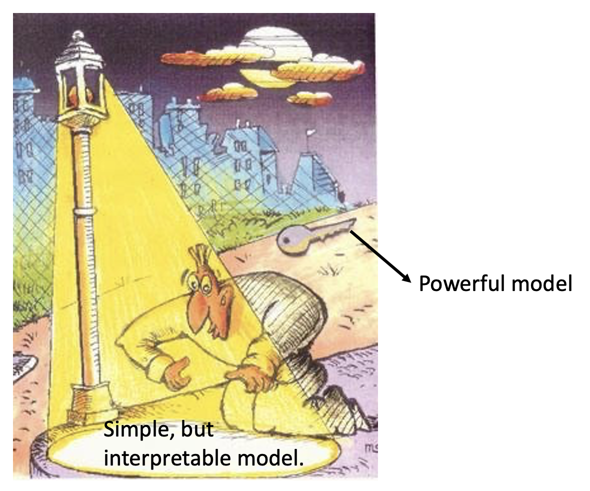

那么是否有模型同时兼具强大表现和解释能力呢？不妨考虑一下**决策树**(decision tree)，它不仅直观易懂，还能给出精确的结果。

    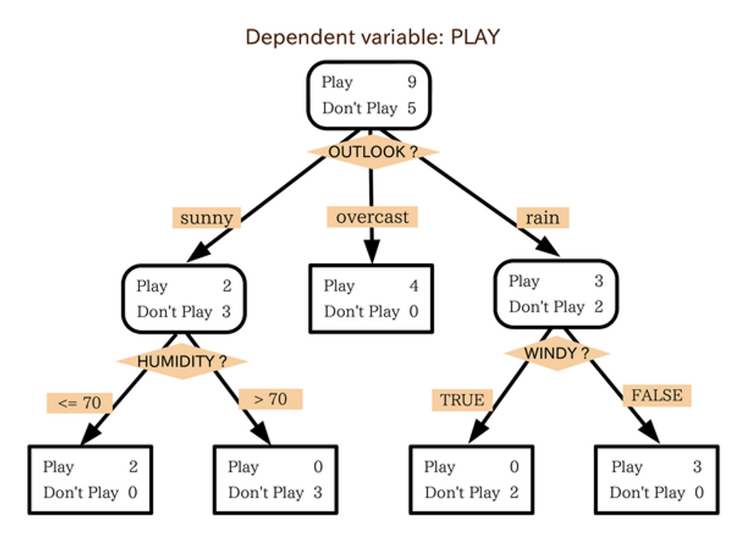

但决策树也有不少问题：

- 如果现在情况复杂些，有时看一棵决策树可能看不懂它要干什么
- 而且实际上我们可能需要用多棵决策树来描述一个问题，这样就更难理解决策树要做的事了

所以决策树不是一个很好的解决方案。

---
我们理想中的可解释 ML 能够做到：**完全知道模型在做什么事**。这个时候我们不应该将 ML 模型比作人脑，因为尽管我们尚未完全搞清楚人脑的工作机制，但我们依然相信我们身为人类做出的决策。

??? info "一项心理学的研究"

    假如在大学中，一群学生排队使用复印机。一位同学想要插队，出于礼貌，ta 可能会和前面的同学这样说明：

    

        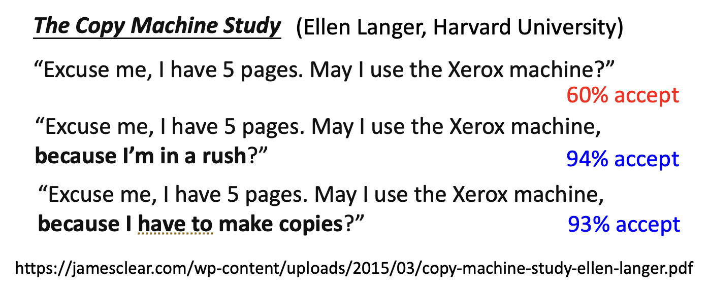
    
 

    >这是 1978 年的研究。

    其中加粗字体表示额外增加的解释。可以看到，只要有解释，无论是否合理（~~甚至像第二个看起来根本不是解释的解释~~），接受率也会有显著的提升。我们可以将这个故事引入到机器学习中：无论模型给出什么样的解释，只要给出了解释，人们就会认为这个模型是不错的。

那么“完全知道模型在做什么事”要达到什么样的程度呢？这个问题可能是见仁见智的，而李宏毅老师给出的答案是模型应该给出“让人们感到舒服(make people comfortable)”的解释（可参看前面的心理学研究）。这里面的“人们”既可以是你的客户，也可以是你的上司，或者就是你自己。

可解释的 ML 分为两大类（以一个图像分类器为例）：

    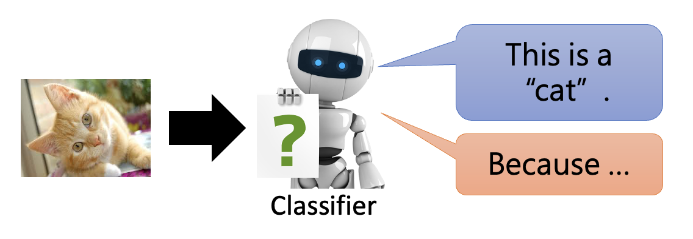

- **局部解释**(local explanation)：对于一张给定的图像，分类器需要给出它为什么将图像归于某一类的理由
- **全局解释**(global explanation)：分类器能够给出如何区分某一类图像的理由，而不是针对一张具体的图像

## Local Explanation

考虑模型的输入对象 $x$，它的形式可以是图像、文本等等。对象 $x$ 由多个**组件**(component) $\{x_1, \dots, x_n, \dots, x_N\}$ 构成。

- 对于图像，部件可以是像素、片段等
- 对于文本，部件可以是词语

训练模型的时候，移除或修改其中的某些部件，看看这一改动是否会影响模型的决策。如果是的话，我们认为这样的部件是**重要部件**。

    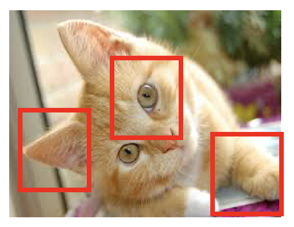

对于图像，我们可以用一个灰色方块遮盖住部分图像内容，观察这样做是否会影响到模型对图像内容的识别。如果这会干扰到模型，那么对应位置用蓝色表示（对应重要部件），否则用红色表示。下面是采用这种技术得到的成果：

    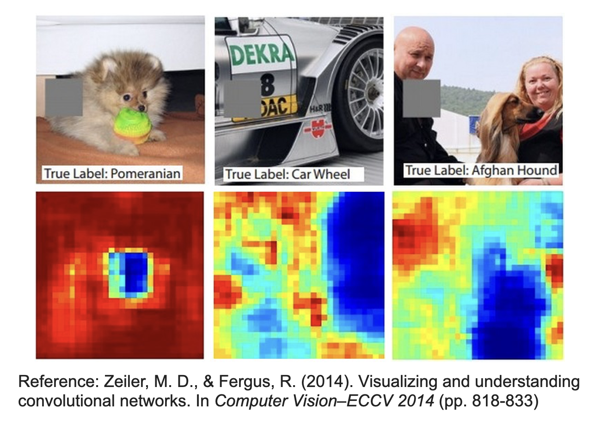

- 对于第一幅图中的博美犬，模型主要根据其面部判断出来的（可以看到面部对应的区域是蓝色的）
- 对于第二幅图中的汽车轮胎，模型直接锁定到轮胎所处的位置上
- 对于第三幅图中的阿富汗猎犬，尽管旁边有2个人，但模型并没有错把他们认成狗，而是精确地找到狗所在的位置

另一种进阶技术称为**显著性图**(saliency map)，它需要考虑每一个**像素**对图像的影响。假如图像包含像素 $\{x_1, \dots, x_n, \dots, x_N\}$，并且定义误差 $e$ 是将图像丢给模型后的输出和正确答案之间的差距。现在对其中一个像素点 $x_n$ 加一个微小的扰动 $\Delta x$，并假定对应的新误差为 $e + \Delta e$，那么该像素点对应在显著性图上的值就是 $\Delta e$。实际上，$\Big| \dfrac{\Delta e}{\Delta x} \Big|$ 的值是通过微分得到的，即 $\Big| \dfrac{\partial e}{\partial x_n} \Big|$。下面是一些图像以及对应的显著性图：

    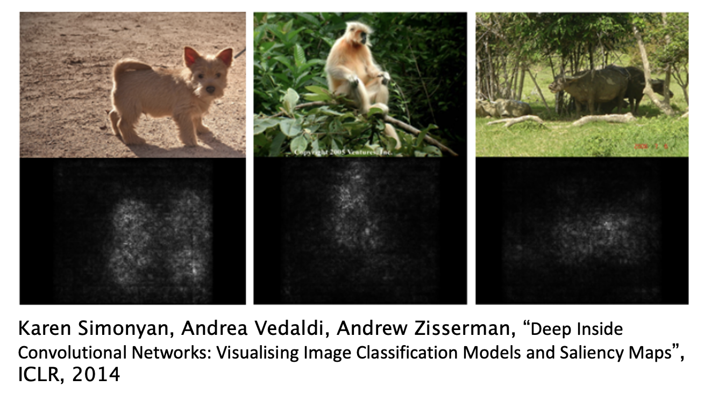

显著性图上的像素点越白，表示该像素点对误差的影响越大，也就是说该像素点越重要。可以看到，模型能够精确识别到这些关键的像素点。

这种方法虽然很强大，但是如果稍有不慎，就会出现一些不符预期的结果，比如说下面这些例子。

???+ example "例子"

    === "案例学习：宝可梦 v.s. 数码宝贝"

        我们之前研究过[一个用于分类宝可梦和数码宝贝的分类器](2.md#example-pokémondigimon-classifier)。为了区分两类图像，我们根据图像的显著性图来判断究竟属于哪一类。

        这是数码宝贝的显著性图：

        

            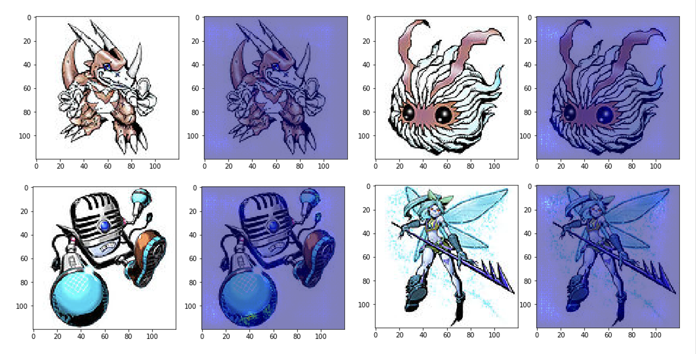
        

        这是宝可梦的显著性图：

        

            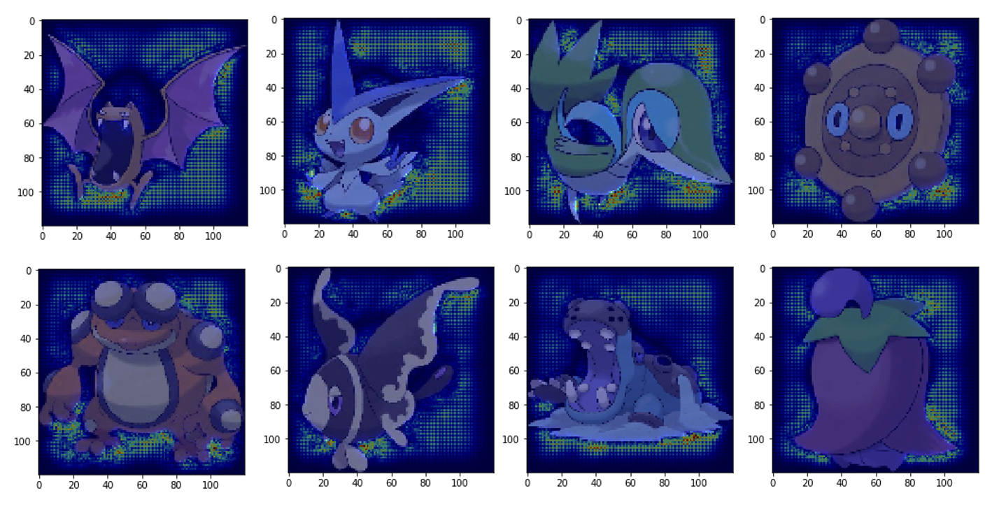
        

        实验结果表明，这个分类器的准确率达到了 98%，相当之高啊！但实际上闹了个乌龙——所有的宝可梦图像是 PNG 文件，而所有的数码宝贝图像是 JPEG 文件。PNG 文件的背景是透明的，而 JPEG 文件的背景是全黑的，这正是分类器的分类依据😂（可以看到显著性图中背景部分有更多的高亮点）。

    === "PASCAL VOC 2007 data set"

        还有将图像中的文字视为关键信息的模型（模型看到文字就知道图像中有马）。

        

            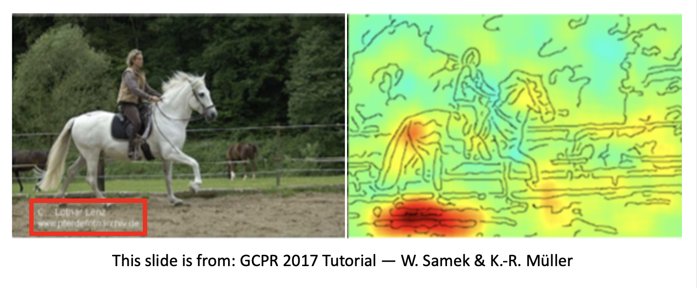
        
   

???+ bug "局限性"

    === "嘈杂梯度(noisy gradient)"

        实际上，模型很容易将实际上意义不大的像素点当做是有意义的，这样就导致显著性图上有许多白色的噪点。一种克服该问题的技术是 [**SmoothGrad**](https://arxiv.org/abs/1706.03825)，它向图像中随机加入一些噪点，得到新图像对应的显著性图，多弄几份后求平均值，这样就能减少一些干扰。

        

            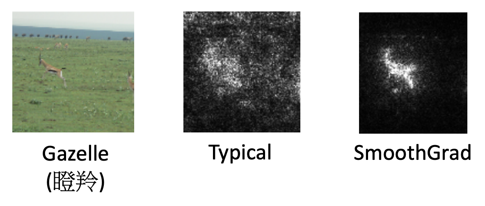
        
 

    === "梯度饱和(gradient saturation)"

        梯度（即求显著性图上像素值用到的微分方法）并不一定能始终反映图像上的重要特征，反之亦然。比如对于大象的鼻子，“鼻子越长越能说明这是一头大象”的结论在鼻子长到一定程度时可能会失效，因为鼻子已经够长，足以说明这是一头大象，再长一些也不会继续增强说服力。这个时候梯度就接近于0，但这并不代表这个特征就不重要了。

        

            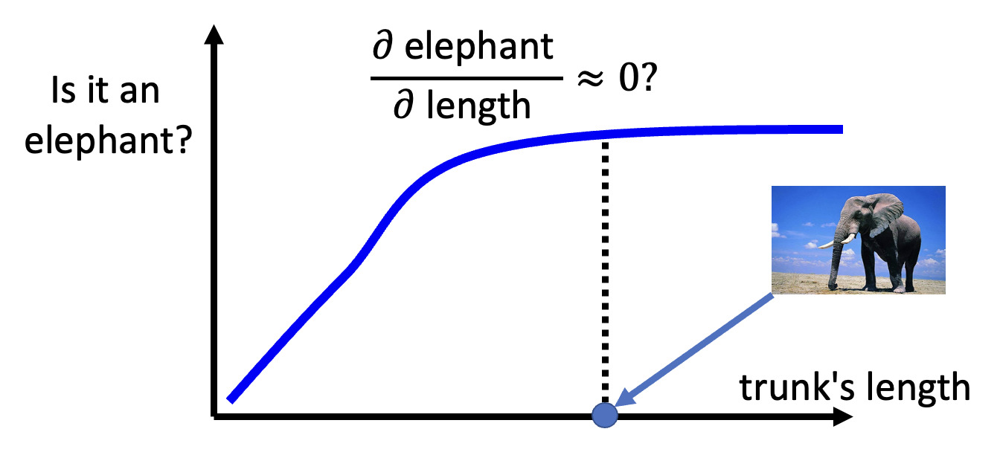
        
 

        一种解决方案是[**集成梯度**](https://arxiv.org/abs/1611.02639)(integrated gradient, IG)，不过这里不会展开介绍，感兴趣的读者可自行研究。

---
前面讲的是让模型看一个输入，看哪些部分是重要的。接下来要讲的是模型是如何处理输入的，下面给出一些方法：

- **可视化**(visualization)（即用人眼观察）
    - 语音

        

            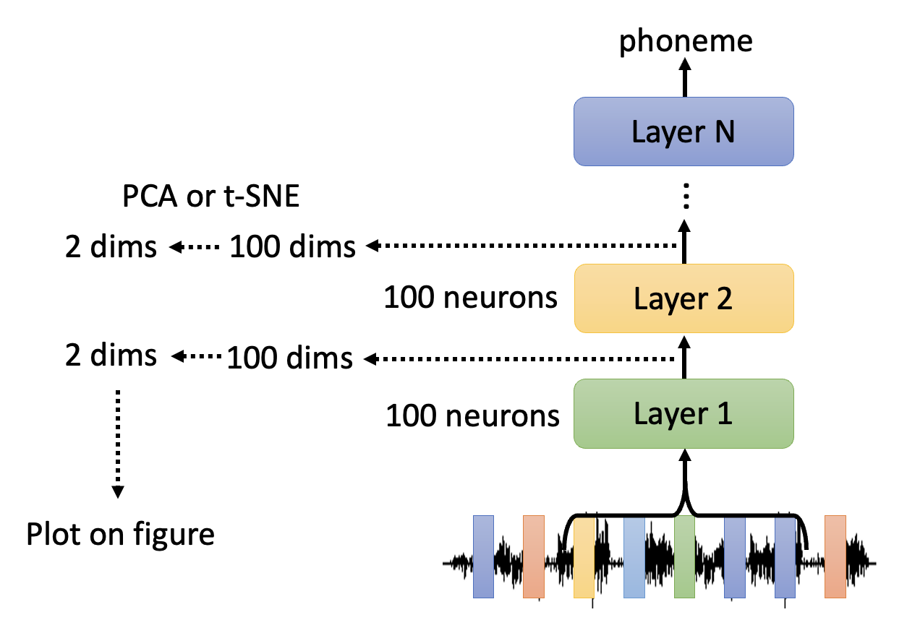
        

        模型内部包含了多个隐藏层，所以我们可以分析其中几个层的输出（向量），然后通过某些技术（PCA 或 t-SNE 等）将高维向量转化为低维向量（比如二维，那就是二维平面上的一个点了），便于后续分析。

        来看下面两张图表。左图是输入语音降至二维后的结果，可以看到图上的点是散乱的，没有任何规律的。但提取第8个隐藏层的输出，将其降维后转化到平面上，发现原本散乱的点分散在多个集群，更有规律性。实际上每个集群表示的是内容相近的语音。

        

            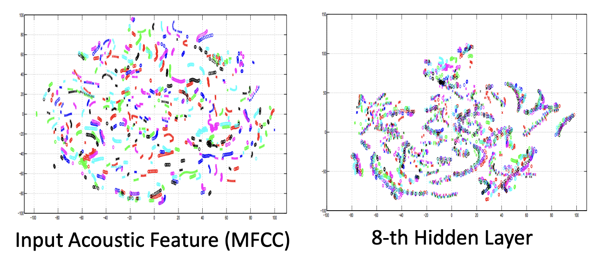
        

    - 注意机制：除了可以看神经网络上每一层的输出，也可以看注意层的输出。既然注意机制能够反映序列中两个输入之间的关系，那么看起来注意机制具备一定的解释力啊——但实际上有人对此提出了质疑，认为[注意机制不具备解释性](https://arxiv.org/abs/1902.10186)。但后来又有人[反驳这一观点](https://arxiv.org/abs/1908.04626)。所以到现在为止，没人能给出准确的分析。

- **探测**(probing)：向模型中插入一个“探针”，相比人眼能观察到更多的东西
    - 比如现在想要观察 BERT 某一层的输出向量，可以训练一个分类器作为“探针”。对文本任务而言，这个分类器可以用于词性分析，也可以用于名称实体识别(name entity recognition, NER)。

        

            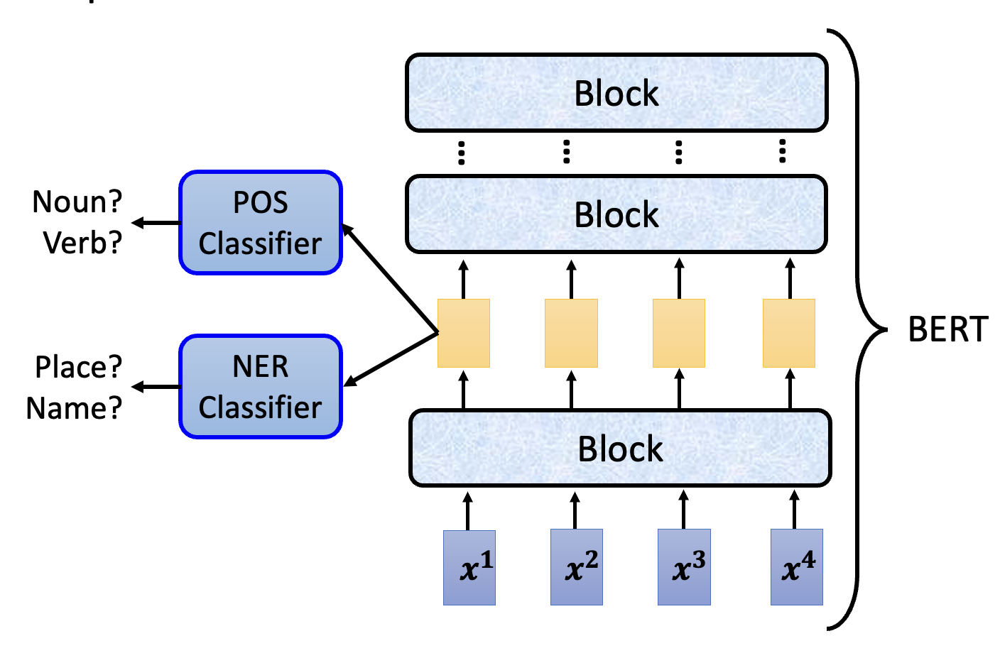
        

    - 不过要当心分类器的使用：如果分类器正确率低，不一定表明输入特征里面没有要分类的数据，也有可能是因为分类器没有训练好，所以分类器的结果不能完全作为评判依据。
    - 还有一种有趣的应用是将中间向量（可看作原语音对应的文本）喂给一个 TTS，TTS 会还原出语音内容，但会丢掉说话者的信息

        

            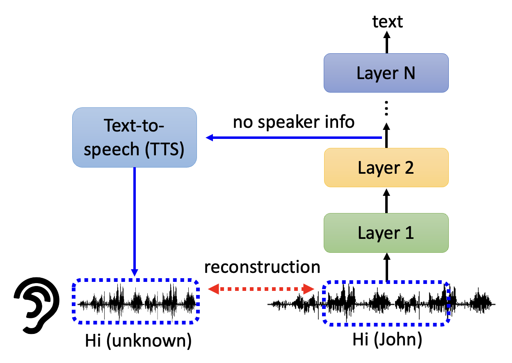
        

        ??? example "例子"

            === "例1"

                

                    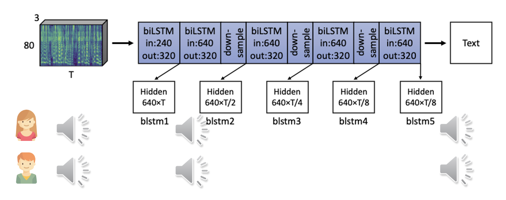
                

                最开始的语音能够区分男女的音色，但挑出模型较后面那层的输出，发现语音内容得以保留，但说话人的语气几乎完全被抹掉了，听到的声音好像是机器人的电音。

            === "例2"

                

                    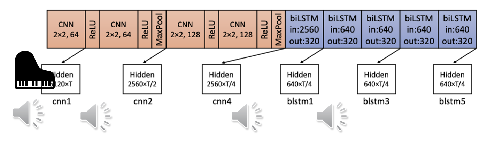
                

                最开始的语音同时包含人类的说话声和钢琴声（背景音）。抽出 CNN 中某一层的输出，语音内容中都包含了钢琴声；但是抽取 biLSTM 那层的输出，却发现钢琴声不见了，说明这个隐藏层可以去掉钢琴声。

## Global Explanation

下面来看模型是如何做出全局解释的。

### Detection

在 CNN 中，一个卷积层可能包含多个**滤波器**(filter)，不同的滤波器对相同的图像输入产生不同的输出（矩阵）。我们考虑其中一个滤波器的输出，其中值较大的部分对应该滤波器重点检测的模式(pattern)。要想搞清楚图像中的哪些部分是滤波器关心的模式，需要自己构造一张包含所有这些模式的图像。

    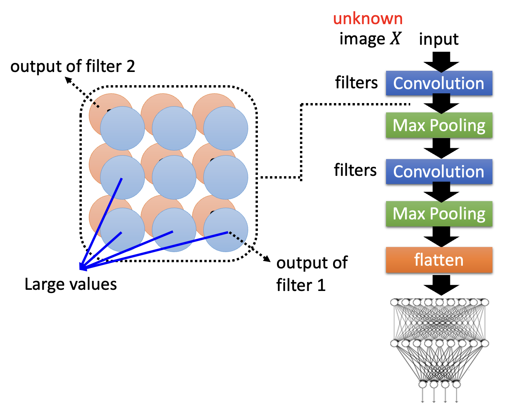

具体来说，构造出来的图像应当满足 $X^* = \arg \max\limits_X \sum\limits_i \sum\limits_j a_{ij}$，其中 $a_{ij}$ 是滤波器输出中的某个元素；此时图像包含了滤波器能检测到的所有模式。而训练的时候采用梯度上升法（因为我们要找最大值）。

???+ example "例子"

    在手写数字识别（[MNIST](https://en.wikipedia.org/wiki/MNIST_database)）的任务中，我们按上述方法训练一个数字分类器，每个滤波器对应的 $X^*$ 如下所示：

    

        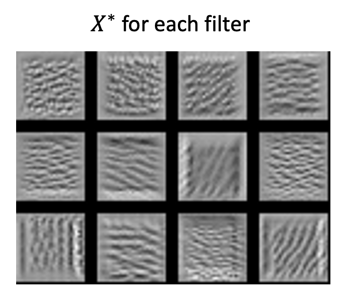
    

    可以看到，滤波器能够发现诸如竖线、横线、斜线等模式。

    现在我们考虑模型的每一个类别的输出 $y_i$，找出对应的 $X^* = \arg \max\limits_X y_i$，即对应包含某个数字的图像。得到的结果如下：

    

        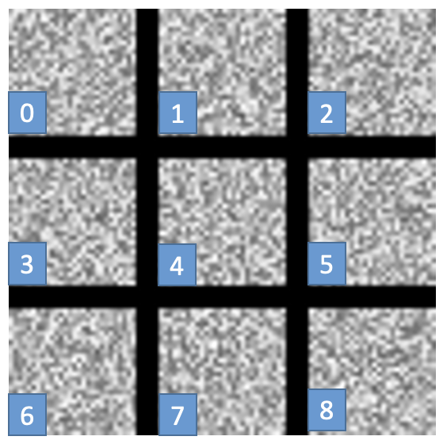
    

    出乎意料的是，每个数字对应的图像竟然是一团马赛克。具体原因可参考[下一讲](9.md)的内容。

    在机器心目中，这样看似毫无意义的噪点却是有意义的数字；但人们无法接受这样的图像，并且希望图像尽可能看上去像个数字。要做到这一点，需要给上面的式子增加更多的限制：

    $$
    \begin{cases}
    X^* = \arg \max\limits_X y_i \\
    R(X) = - \sum\limits_{i, j} |X_{ij}|
    \end{cases}
    $$

    这里的 $R(X)$ 就是额外增加的限制，在这里的意思就是图像 $X$ 像一个数字的程度。下面是加了一定限制后的图像：

    

        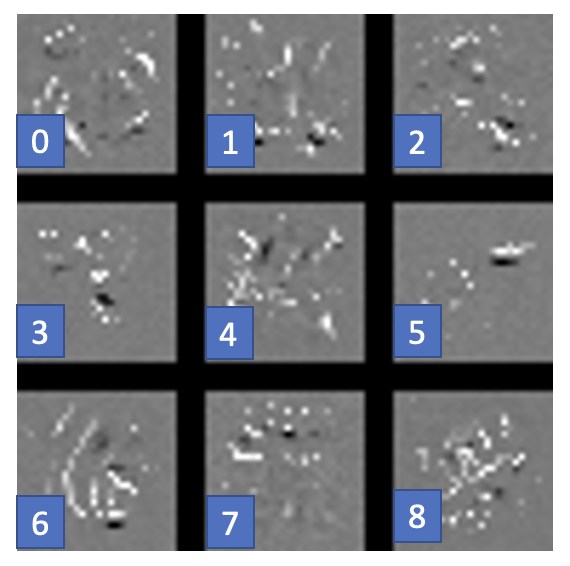
    

    虽然效果还是不咋地，但总比原来的好多了...

    如果想要达到令人满意的效果，可能还需要用到更好的技巧，比如一些正则化方法、超参数调优等。下面是另一个项目的结果，可以看到它产生的图像能够很好的体现出现实物体的特征。

    

        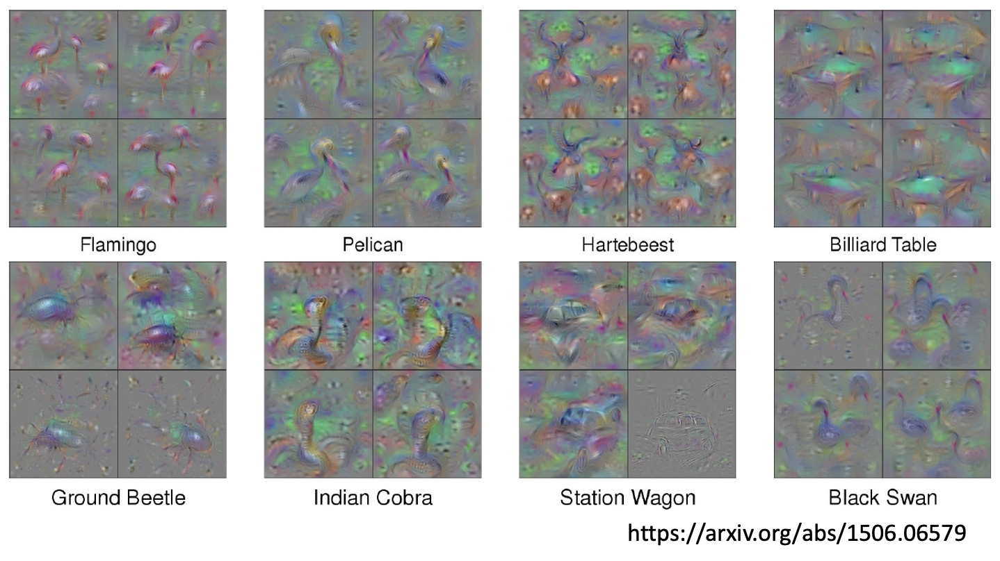
    

### Constraints from Generator

还有一种能够生成清晰图像的方法是使用生成器。生成器的训练过程如下所示：

    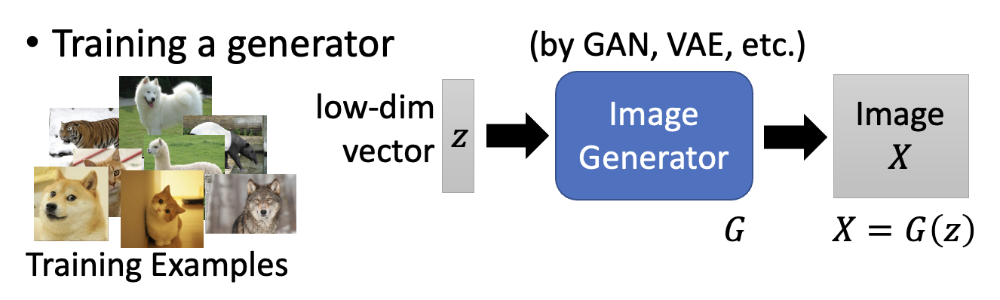

原来我们要找到图像 $X^* = \arg \max\limits_X y_i$，现在的目标转为：求 $z^* = \arg \max\limits_z y_i \Rightarrow X^* = G(z^*)$。

    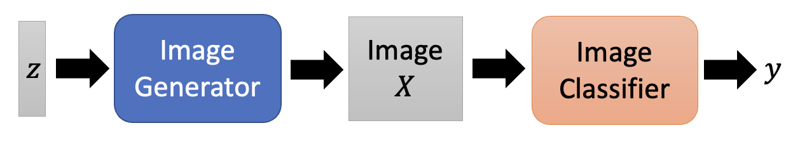

下面是通过这样的生成器得到的 $X^*$，可以看到效果是非常的好啊！

    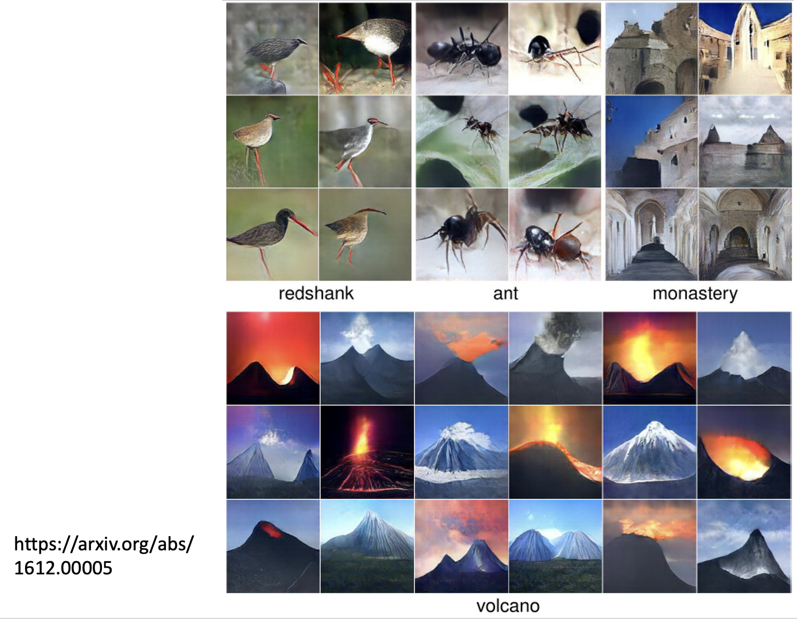

## Another Method

还有一种可解释 ML 的技术是用一个可解释的模型（即简单模型）来模拟无法解释的模型（即复杂模型）的行为。

    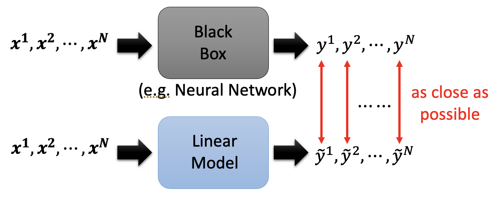

在一系列的工作中，比较知名的是 **LIME**（全称局部可解释模型无关解释(Local Interpretable Model-Agnostic Explanations)）。