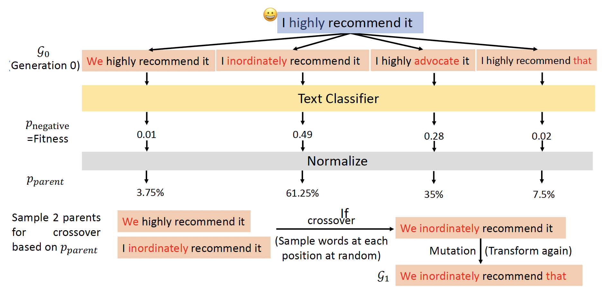

# Adversarial Attack

前面基本都是在理想情况下讨论神经网络的运作。如果将神经网络部署到现实世界中，我们需要考虑网络的鲁棒性，抵御各种各样来自人类的恶意攻击，尤其是在垃圾邮箱分类、故障检测、网络入侵检测等应用中。


## Attack

攻击的一般思路是向原输入数据加入人眼无法察觉的“噪音”，使得模型对加入噪音后的数据产生与原数据完全不同的输出结果。下面主要以图像作为数据形式来介绍。我们称原图像为**良性图像**(benign image)，而加入噪音后的图像为**攻击图像**(attacked image)。

<div style="text-align: center">
    
</div>

攻击可分为以下两类：

- **无目标**(non-targeted)：让模型输出除正确答案外的任何结果
- **有目标**(targeted)：让模型输出指定的错误结果（对分类器而言就是误分类到某个具体的类上）

???+ example "例子"

    假定采用的网络是 ResNet-50，我们对其进行有目标（目标是让网络误以为图像内容是“海星”）的攻击，其中一个例子如下：

    <div style="text-align: center">
        
    </div>

    光靠人眼无法分辨两张图像的差别，所以将两张图像做差后再放大 50 倍，得到的结果（噪点）如下：

    <div style="text-align: center">
        
    </div>

    加入不同的噪点，网络输出的结果也会有所不同：

    <div style="text-align: center">
        
    </div>


### How to Attack

下面探讨攻击的细节。我们记原图像为 $\bm{x}^0$，经过网络 $f$ 的输出为 $\bm{y}^0 = f(\bm{x}^0)$（一个分布），标签（正确答案）为 $\hat{\bm{y}}$。并记攻击图像为 $\bm{x}$，对应的输出为 $\bm{y} = f(\bm{x})$。

- 无目标：希望 $\bm{y}$ 离正确答案 $\hat{\bm{y}}$ 越远越好。为此要找到图像 $\bm{x}^*$，满足

    $$
    \bm{x}^* = \arg \min L(\bm{x}) \\
    L(\bm{x}) = -e(\bm{y}, \hat{\bm{y}})
    $$

    <div style="text-align: center">
        
    </div>

- 有目标：希望 $\bm{y}$ 离目标 $\bm{y}^{target}$ 越近越好。相比无目标攻击，损失函数 $L(\bm{x})$ 要做进一步的改动：

    $$
    L(\bm{x}) = -e(\bm{y}, \hat{\bm{y}}) + e(\bm{y}, \bm{y}^{target})
    $$

    <div style="text-align: center">
        
    </div>

看起来这似乎和一般模型的优化差别不大——但攻击的一个特点是原图像和攻击图像不应被人类察觉到区别，即 $\bm{x}^0$ 和 $\bm{x}$ 应尽可能接近。所以攻击图像应满足：

$$
\bm{x}^* = \arg \min\limits_{d (\bm{x}^0, \bm{x}) \le \varepsilon} L(\bm{x})
$$

关于 $d (\bm{x}^0, \bm{x})$ 的计算，有以下几种方式（假定 $\bm{x} = [x_1\ x_2\ \dots]^T, \bm{x}^0 = [x_1^0\ x_2^0\ \dots]^T, \Delta \bm{x} = [\Delta x_1\ \Delta x_2\ \dots]^T$，且 $\bm{x} - \bm{x}^0 = \Delta \bm{x}$）：

- L2 范数

    $$
    d (\bm{x}^0, \bm{x}) = \| \Delta \bm{x} \|_2 = (\Delta x_1)^2 + (\Delta x_2)^2 + \dots
    $$

- L-无穷

    $$
    d (\bm{x}^0, \bm{x}) = \| \Delta \bm{x} \|_\infty = \max \{|\Delta x_1|, |\Delta x_2|, \dots \}
    $$

至于用哪一种得看实际情况——哪个更不易被人类发现就用哪一种。这里举一个例子：假设有一张 2x2 的图像。现有两种制造攻击图像的方式：

- 对图像的每个像素都稍作一点改动
- 仅对一个像素做出相对较大的改动

也许两者的 L2-范数比较接近，但是它们的 L-$\infty$ 的值显然有区别：前者小而后者大。因此这里推荐使用 L-$\infty$ 作为衡量标准。

<div style="text-align: center">
    
</div>


### Attack Approaches

#### Gradient Descent

上面提到过，攻击的做法和一般模型的优化过程很像，但有一个区别是模型更新的是参数，而攻击更新的是**输入**。我们先来看梯度下降法如何用在攻击上，以下是具体的步骤：

```py linenums="1"
从原图像 x^0 开始
for t = 1 to T
    x^t <- x^(t-1) - eta * g
    if d(x^0, x) > epsilon
        x^t <- fix(x^t)
```

其中梯度 $\bm{g} = \begin{bmatrix} \dfrac{\partial L}{\partial x_1} \Big|_{\bm{x}=\bm{x}^{t-1}} \\ \dfrac{\partial L}{\partial x_2} \Big|_{\bm{x}=\bm{x}^{t-1}} \\ \vdots \end{bmatrix}$。除了更新的东西不同外，还有一个不同是多了 $d (\bm{x}^0, \bm{x}) \le \varepsilon$ 这一约束（对应上述算法中的第 4-5 行）。当 $d$ 是 L-无穷时，如果更新后的输入超出边界，则需要将输入拉回到最近的边界位置上，从而达到固定效果。

<div style="text-align: center">
    
</div>


#### FGSM

第二种方法称为[**快速梯度符号法**](https://arxiv.org/abs/1412.6572)(fast gradient sign method, FGSM)。相比一般梯度下降法，它的区别是：

- 只迭代1次
- 对于方程 $\bm{x}^t \leftarrow \bm{x}^{t-1} - \eta \bm{g}$，令 $\eta = \varepsilon, \bm{g} = \begin{bmatrix} sign \left(\dfrac{\partial L}{\partial x_1} \Big|_{\bm{x}=\bm{x}^{t-1}}\right) \\ sign \left(\dfrac{\partial L}{\partial x_2} \Big|_{\bm{x}=\bm{x}^{t-1}}\right) \\ \vdots \end{bmatrix}$，其中 $sign(t) = \begin{cases} 1 & \text{if } t > 0 \\ -1 & \text{otherwise}\end{cases}$
    - 这种设定可确保更新后的输入始终不超出边界范围（理由是显而易见的，这里不展开解释）

---
另一种变体是**迭代式(iterative) FGSM**，它相比 FGSM 的区别有：

- 允许多次迭代（和最开始的梯度下降法一样）
- $\eta$ 不一定是 $\varepsilon$，所以更新后的输入可能会离开边界，若发生这种情况的话需要像梯度下降法那样固定这个输入


#### Black Box Attack

前面都是在已知网络参数 $\theta$ 的情况下讨论攻击的，我们称这样的攻击为**白箱攻击**(white box attack)。而对于大多数的在线的 API，我们无法得知模型的参数，但这并不意味着这个模型就是安全的——因为模型有可能遭受**黑箱攻击**(black box attack)。

黑箱攻击的思路是：假如有一些关于目标网络的训练数据，那就用这些数据训练一个**代理网络**(proxy network)，然后对代理网络展开攻击，将那些攻击有效的数据作为黑箱网络的攻击数据。

<div style="text-align: center">
    
</div>

即便不知道训练数据，也是可以发动黑箱攻击的，只是过程繁琐些：先尝试拿一些数据攻击黑箱网络，然后将成对的输入和输出用来训练一个代理模型。接下来的故事就和上面差不多了。

下面来看一组[真实攻击案例](https://arxiv.org/pdf/1611.02770.pdf)的结果：

<div style="text-align: center">
    
</div>

可以看到，自己攻击自己（相当于白箱攻击）的准确率为0%（对角线上的单元格），即必定攻击成功；而其他单元格上的准确率也很低，说明拿不同的网络来攻击其他网络是有一定成功概率的。不过上述攻击是无目标攻击，因此成功率会比较高；而有目标的黑箱攻击就不太好实现了。

还有一种增加黑箱攻击成功率的办法，叫做**组装攻击**(ensemble attack)，即整合多个网络来攻击某个特定的网络。下表展示了组装攻击的效果：

<div style="text-align: center">
    
</div>

这张表格的不同于上张表格，我们应该只看对角线上的数据——以第一行为例，-ResNet-152 表示的是除 ResNet-152 外其他的四个模型，以此类推——所以非对角线上的数据都是白箱攻击的结果。可以看到，组装攻击的效果确实比一般的黑箱攻击好很多（准确率低了很多）。

那么为什么攻击那么容易，甚至连黑箱攻击也有不错的表现？一种可能的（~~感觉有些抽象的~~）解释是对于某个网络攻击成功的“方向”（对图像来说就是代表图像的高维向量移动的方向）在其他网络上可能也是适用的。以下面几张图为例，蓝色的部分表示网络正确识别的区域（小丑鱼），其他区域都是错误的分类结果。可以看到，只要沿着横线走，无论在哪个网络上，这样的攻击都是有可能成功的。

<div style="text-align: center">
    
</div>


#### One Pixel Attack

事实上，还真的有人做到了只需改变图像上的一个像素，就能让网络得出错误的分类结果。下面是其中的一个代表作：

<div style="text-align: center">
    
</div>

其实错误的分类结果和正确答案对应的物品从外形上看还是有一定关联的，所以攻击的威力可能不是那么强大。


#### Universal Adversarial Attack

{ width=30% align=right }

前面介绍的攻击方法都要为每一张图像找一个“个性化”的攻击输入。而右图展示的是一种能适用于所有图像的[**通用对抗攻击**](https://arxiv.org/abs/1610.08401)(universal adversarial attack)，它能做到只用一种噪音信号（规模等同于一张图像），就能干扰模型对所有（至少是大多数）图像的分类。

~~如果真的找到这样的噪音信号，那么把这个噪音信号加在摄像头上，就能把整个监控系统搞崩掉(doge)。~~

该方法也适用于黑箱攻击。

<br/>
<br/>
<br/>


### Beyond Images

前面介绍的例子都是关于图像的。攻击也可以发生在其他领域中，包括：

- 语音处理：检测合成语音的时候，攻击者可以往合成语音加一些杂讯，让模型误以为是真的，但人耳一听就知道是假的语音。
- 自然语言处理：[有人](https://arxiv.org/abs/1908.07125)发现在 QA 任务中，只要在问题末尾加上 "why how because to kill american people"（文本层面的“噪音”），（某个）模型给出的答案中就一定会包含 "to kill american people"。

<div style="text-align: center">
    
</div>


### Attack in the Physical World

让我们把目光放到真实世界上。一个有趣的例子是：戴上下面左图所示的眼镜，机器就把中间这个人误以为是右图的女明星了。

<div style="text-align: center">
    
</div>

>[🔗论文链接](https://www.cs.cmu.edu/~sbhagava/papers/face-rec-ccs16.pdf)

- 攻击者需要找到能够在不止一个图像上实现干扰的手段
- 干扰信号中，相邻像素的较大差异不会被摄像头精确捕获到（因为摄像头的分辨率往往是有限的）
- 设计出来的干扰信号的色彩最好大多数能够被打印机打印出来（毕竟要用在物理世界上）

---
一种比较朴素的攻击手段是向标志牌贴一些贴纸，就能让模型分类失败。

<div style="text-align: center">
    
</div>

---
{ width=20% align=right }

另外一个例子是：将路牌上的阿拉伯数字 "3" 中间的一横拉长，就能让汽车上的自动驾驶系统误以为是数字 "8"，从而超过路牌的实际限速，这是相当危险的！

<div style="text-align: center" markdown="1">
{: style='width: 80%'}
</div>

>🔗[论文链接](https://www.mcafee.com/blogs/other-blogs/mcafee-labs/model-hacking-adas-to-pave-safer-roads-for-autonomous-vehicles/)，[视频链接](https://youtu.be/4uGV_fRj0UA)


### Adversarial Reprogramming

**对抗重编程**(adversarial reprogramming)的思路是在已有的模型上寄生一些东西，从而让模型做原本不想做的事。有[研究](https://arxiv.org/abs/1806.11146)是这样做的：作者想训练一个关于方块的分类系统，但他又不想从头训练一个模型，于是他就借助已有的 ImageNet 分类器，将要训练的方块图像嵌在噪音信号（一张可作为 ImageNet 分类器输入的图像）里面，然后将这个噪音信号丢到 ImageNet 分类器里训练，从而实现方块分类的任务（而这原本不是 ImageNet 分类器该做的事）。

<div style="text-align: center">
    
</div>


### "Backdoor" in Model

还有一种攻击手段是在训练阶段发生的：对训练数据集动一些手脚，比如放一些攻击图像，这样就能在模型训练者不清楚的情况下（尤其是有目标攻击）在模型上开了一个“**后门**”(backdoor)。假如一个人脸识别系统在训练时遭到这样的攻击，那么这个系统也许会为训练数据集中的某个人开“后门”，但这个人不应该被放进来的。

<div style="text-align: center">
    
</div>

这带给我们的启示是：对于公开的数据集要持谨慎态度，小心别有用心的人在数据集里“下过毒”了。


## Defense

有攻击当然也有防御。下面将从**被动防御**(passive defense)和**主动防御**(proactive defense)两个角度来介绍各类防御手段。


### Passive Defense

第一个方法是在已有模型（参数已固定）前面加一个**过滤器**(filter)。这个过滤器的作用可以是让图像变得更模糊/平滑(smoothing)，这样图像上相邻的像素就会混淆起来，那么那些对个别像素动手脚的攻击图像就会失效。

<div style="text-align: center">
    
</div>

不过这样做会带来副作用：对于原本无害的图像，分类器打的分数会变低，或者说它就不像以前那样“自信”了。

<div style="text-align: center">
    
</div>

---
第二个方法也是类似的，它做的操作是**图像压缩**(image compression)，也是对图像像素做了一些改动。

<div style="text-align: center">
    
</div>

相关论文：[链接1](https://arxiv.org/abs/1704.01155)、[链接2](https://arxiv.org/abs/1802.06816)

---
第三个方法是单独训练一个[**生成器**](https://arxiv.org/abs/1805.06605)，让它生成和原输入图像尽可能接近的图像，然后将生成图像作为输入图像训练，这样也能把有害的像素给过滤掉。

<div style="text-align: center">
    
</div>

---
上述这些做法有一个共同的弱点：要是攻击者知道你是如何防御的，这种防御很容易就会失效，因为攻击者可以将这些防御手段作为网络的某个层来训练攻击图像。所以这里再介绍一种即便攻击者知道也很难克服的防御手段——[**随机化**](https://arxiv.org/abs/1711.01991)(randomization)。具体做法是在模型前加上各种不同的防御手段，在进入模型前随机挑选一种处理手段。

<div style="text-align: center">
    
</div>


### Proactive Defense

被动防御是指模型参数固定下来后采取的抵抗措施，而主动防御是指要训练一个足够鲁棒，能抵御对抗攻击的模型，因此这样的训练叫做**对抗训练**(adversarial training)。这种训练的过程如下：

- 给定训练数据集 $\mathcal{X} = \{(\bm{x}^1, \hat{y}^1), (\bm{x}^2, \hat{y}^2), \dots, (\bm{x}^N, \hat{y}^N)\}$
- 对于每个数据对，通过攻击算法找出每个输入 $\bm{x}^n$ 对应的对抗输入 $\widetilde{\bm{x}}^n$，这样可以得到一批新的训练数据集 $\mathcal{X}' = \{(\widetilde{\bm{x}}^1, \hat{y}^1), (\widetilde{\bm{x}}^2, \hat{y}^2), \dots, (\widetilde{\bm{x}}^N, \hat{y}^N)\}$
- 训练的时候同时用到 $\mathcal{X}, \mathcal{X}'$

上述过程可重复多次。

聪明的读者也许会想到，该方法和**数据增强**(data augmentation)非常相似，同样也是基于原输入得到新输入。

!!! bug "对抗训练的缺陷"

    - 可能无法应付未知的（或全新的）攻击算法
    - 假如输入数据量过大，那么这种训练方式就很吃计算资源了


## Attacks in NLP

前面讲的攻击大都是在 CV 领域或音频方面的，所以本节将进一步放宽视野，来认识一些在 NLP 领域上的攻击方式，以及相应的防御措施。

- 在将文本丢给模型处理前，先要将 token 转化为连续的向量，模型将这些向量作为输入
- 文本的**离散**属性使得 NLP 领域的攻击相比其他领域的攻击有着很大差异


### Evasion Attacks and Defenses

**规避攻击**(evasion attacks)是最常见的攻击方式之一。在 CV 中，它的做法就是向图像添加人眼无法察觉的噪音，但能够改变模型对图像的预测。

<div style="text-align: center">
    
</div>

而在 NLP 中，规避攻击的做法也是通过修改输入，使得模型的预测出错，但是修改后的输入不应改变人类的预测。任何让模型的行为偏离预期的样例都可看作是对抗性样例。下面给出一些具体例子：

???+ example "例子"

    === "情感分析(sentiment analysis)"

        <div style="text-align: center">
            
        </div>

        仅仅将名词单数转为复数（对人类来说是不起眼的变化，因为没有语法错误），模型的预测就有了 180 度大转弯。

    === "依赖解析(dependency parsing)"

        <div style="text-align: center">
            
        </div>

        将句子中的 stock 改为 exchange（股市 -> 外汇市场），原本正确的句法分析树就变得凌乱错误了。

    === "机器翻译(machine translation)"

        <div style="text-align: center">
            
        </div>

        甚至连日常使用的机器翻译都能给出这样离谱的错误（现在这个问题修正了）

        >经过测试，只有中国和香港的组合才会出现这种翻译错误，换成其他国家/地名都是没问题的，不知道 Google Translate 拿了什么语料训练的。


#### Ingredients

规避攻击的四要素有：

- **目标**(goal)：攻击想要实现什么
- **变换**(transformation)：如何为潜在攻击构造干扰

    <div style="text-align: center">
        
    </div>

- **约束**(constraints)：一个合法的对抗性样例应当满足什么
- **搜索方法**(search method)：如何从一系列变换中找到一个对抗性样例，使得既能满足约束又能达到目标

???+ example "例子"

    <div style="text-align: center">
        
    </div>

---
对于不同的情况，攻击**目标**也会有所不同（以新闻标题分类为例）：

- **无目标分类**(untargeted classification)：让模型对输入样例错误分类

    <div style="text-align: center">
        
    </div>

- **有目标分类**(targeted classification)：让模型将本应划分到 A 类的样例划分到 B 类

    <div style="text-align: center">
        
    </div>


??? example "例子"

    === "例1"

        通用后缀删除器(universal suffix dropper)：使得翻译后的句子去掉一些后缀（紫色部分）。

        <div style="text-align: center">
            
        </div>


    === "例2"

        前面展示过的依赖解析中错误的解析树。

---
下面展示了规避攻击中的一些**变换**：

- 词级(word level)
    - **词替换**(word substitution)
        - **WordNet 同义词**(synonyms)：用来自 [WordNet](https://wordnet.princeton.edu/) 中的同义词替代原句中的词汇

            <div style="text-align: center">
                
            </div>

        - **在反拟合 GloVe 嵌入空间中的 $k$NN 或 $\varepsilon$-ball**：以某个词嵌入向量为中心，落在 $\varepsilon$-ball 范围内的向量被视为意思相近的词

            <div style="text-align: center">
                
            </div>

            为了构建这样的反拟合 GloVe 嵌入空间，需要根据语言学的约束，让原始 GloVe 嵌入空间中的同义词更接近，而让反义词相互远离，如下所示：

            <div style="text-align: center">
                
            </div>

        - **BERT 掩码语言模型(MLM)**：遮住想要替换的词，让 BERT 来做填空题，它会给出意思最接近的词

            <div style="text-align: center">
                
            </div>

            由于该方法缺少必要的上下文信息，因此很容易会引入与原文本意思相差较大的词。

        - **BERT 重构（无掩码）**：不去遮住要替换的词，除此之外和前一种方法没太大区别

            <div style="text-align: center">
                
            </div>

            相比前一种方法，替换词的意思和原词更加接近。

        - **改变动词、名词和形容词的屈折形式**(inflectional form)：
            - 屈折语素(inflectional morpheme)：一种从不改变词语基本意义，且指示或体现词类特征(POS)的词缀

            <div style="text-align: center">
                
            </div>

        - **词嵌入向量的梯度**：
            - 先把原文本丢给一个文本分类器，得到一个损失 $L$（前向），然后带着这个损失回到词嵌入空间中（后向），对要替换的词嵌入向量做偏微分（即图中的 $\dfrac{\partial L}{\partial \bm{e}_0}$）

                <div style="text-align: center">
                    
                </div>

            - 然后计算用其他词替换这个词后损失的改变量，计算方式为：找到另一个词的嵌入向量 $e_1$，损失改变量为 $\left( \dfrac{\partial L}{\partial \bm{e}_0} \right)^T \cdot (\bm{e}_0 - \bm{e}_1)$（一阶近似）
            - 这种近似来自一阶泰勒展开式，下面是它的几何解释：

                <div style="text-align: center">
                    
                </div>

            - 我们的目标是要找到前 $k$ 个最大化损失的词，即 $\arg \max\limits_{i \in \text{Vocab}} \text{k} \left( \dfrac{\partial L}{\partial \bm{e}_0} \right)^T \cdot (\bm{e}_0 - \bm{e}_1)$

    - **词插入**(word insertion)：基于 BERT MLM，将想要插入的词以掩码的形式插入到原文本中，然后丢给 BERT，让它做填空题

        <div style="text-align: center">
            
        </div>

    - **词删除**(word deletion)（用的不多）

        <div style="text-align: center">
            
        </div>

- 字符级(character level)：包括交换、替代、删除、插入等方法

    <div style="text-align: center">
        
    </div>

---
规避攻击的约束和攻击目标高度相关。下面介绍一些常见的约束：

- **原始样例和干扰样例的重叠**
    - [莱文斯坦编辑距离](https://en.wikipedia.org/wiki/Levenshtein_distance)(Levenshtein edit distance)

        $$
        \text{lev}(a, b) = \begin{cases}|a| & \text{if } |b| = 0 \\ |b| & \text{if } |a| = 0 \\ \text{lev}(\text{tail}(a), \text{tail}(b)) & \text{if } a[0] = b[0] \\ 1 + \min \begin{cases}\text{lev}(\text{tail}(a), b) \\ \text{lev}(a, \text{tail}(b))\\ \text{lev}(\text{tail}(a), \text{tail}(b))\end{cases} & \text{otherwise}\end{cases}
        $$

        ??? example "例子"

            <div style="text-align: center">
                
            </div>

            >注：除了用于字符级外，稍加改进后也许也可以用在词级上。

    - 修改词的最大占比

        <div style="text-align: center">
            
        </div>

- **干扰样例的语法正确性**(grammarticality)
    - 词性(part of speech, POS)一致性

        <div style="text-align: center">
            
        </div>

    - 语法错误数量（由工具箱评估）

        <div style="text-align: center">
            
        </div>

        >注：[图中的工具链接](https://languagetool.org/)

    - 由预训练语言模型的困惑度(perplexity)评定的流畅性(fluency)：困惑度越低表明语法上的问题越小，可以设定一个阈值来划分语法上有问题和没问题两种情况

        <div style="text-align: center">
            
        </div>

- 变换后样例与原样例的语义相似性(semantic similarity)
    - 原来词嵌入向量和交换后词嵌入向量的间距

        <div style="text-align: center">
            
        </div>

        >注：图中用 $\cos$ 来计算，你也可以用其他方法，比如 L-2 范数等等。

    - 原来词嵌入向量和交换后词嵌入向量的相似度：将替换前后的两段文本分别丢给一个叫做通用句子编码器的东西（它能将整个句子编码成一个向量），比较两个输出向量的相似度

        <div style="text-align: center">
            
        </div>

---
最后来看规避攻击中常用的搜索方法：

- **贪心搜索**(greedy search)：为每个位置上的每个变换打分，然后按分数对这些候选词降序排序，依次用这些词替换原文本，直到能够翻转模型的预测结果

    <div style="text-align: center">
        
    </div>

- 考虑**词重要性排行**(word importance rank, WIR)的贪心搜索：
    - 步骤：
        1. 先为每个词的重要性打分

            <div style="text-align: center">
                
            </div>

        2. 按重要性降序顺序来替换词

            <div style="text-align: center">
                
            </div>
    
    - 具体技术：
        - **留一法**(leave-one-out, LOO)：观察从输入中移除某个词对基准事实概率的下降影响有多大

            <div style="text-align: center">
                
            </div>

        - **词嵌入向量梯度**：

            <div style="text-align: center">
                
            </div>


- **遗传算法**(genetic algorithm)：基于适应的进化和选择
    - 将最开始得到的变换记作 $\mathcal{G}_0$（第 0 代(generation 0)）
    - 然后将它们作为输入丢给文本分类器，得到一组分数，并进行归一化处理
    - 取出分数最高的两个变换作为父代，进行**交叉互换**(crossover)（每个位置上随机从两个父代中的一个进行采样），然后再经过一次**突变**(mutation)（即再次转换），这样得到的后代记作 $\mathcal{G}_1$

    <div style="text-align: center">
        
    </div>

    - 重复上述步骤，直至某一代出现分数高于某个阈值（或符合预期）的变换

    <div style="text-align: center">
        
    </div>


#### Examples

下面介绍一些规避攻击的具体实例：

- **同义词替换攻击**(synonym substitution attack)
    - **TextFooler**：
        - 各要素构成：

            <div style="text-align: center">
                
            </div>

        - 示意图：

            <div style="text-align: center">
                
            </div>

        - 算法（不需要完全理解，只要能做到将算法各部分和前面介绍的东西关联起来就行了）：

            <div style="text-align: center">
                
            </div>     

    - **PWWS**（全称“概率加权词显著性”(probability weighted word saliency)）：同时考虑 LOO 的 $\Delta p_{\text{positive}}$ 和词替换中的 $\Delta p_{\text{positive}}$，以得到 WIR

        <div style="text-align: center">
            
        </div> 

    - **BERT 攻击**：

        <div style="text-align: center">
            
        </div> 

    - **遗传算法**：

        <div style="text-align: center">
            
        </div> 

    - 比较各方法的表现（粗体分数表示最优；查询数(query number)和运行时间呈正相关）：

        <div style="text-align: center">
            
        </div>

    - 可即便有了上述约束，对抗性样例（上的异常之处）还是有可能被人类察觉到

        <div style="text-align: center">
            
        </div>

    - 改进措施——**TF-Adjusted**：在 TextFooler 的基础上提供更强的约束，下图比较了采用这种改进法后和原来的 TextFooler 的表现

        <div style="text-align: center">
            
        </div>

- **Morpheus**
    - 各要素构成：

        <div style="text-align: center">
            
        </div>

    - 示意图：

        <div style="text-align: center">
            
        </div>

- **通用触发器**(universal trigger)
    - 虽然触发器字符串(trigger string)与任务无关，但是将它加到原始字符串后就能实现有目标攻击

        <div style="text-align: center">
            
        </div>

    - 获取通用触发器的步骤：
        1. 确定触发器需要多少个词，并用某些词进行初始化

            <div style="text-align: center">
                
            </div>

        2. 回代(backward)，得到触发器中每个词的嵌入向量梯度，找到能使目标函数 $\arg \min\limits_{i \in \text{Vocab}} (\bm{e}_i - \bm{e}_0) d_{\bm{e}_0} L$ 最小化的 token

            <div style="text-align: center">
                
            </div>

        3. 使用新发现的词更新触发器

            <div style="text-align: center">
                
            </div>

        4. 重复 1-3 步，直至收敛

            <div style="text-align: center">
                
            </div>

    - 实验结果：

        <div style="text-align: center">
            
        </div>

- **通过自编码器构建敌人**(crafting adversaries by auto-encoder)
    - 训练一个生成器（即自编码器）来生成对抗样例
        - 生成器的目标：使文本分类器预测错误
        - 分类器的目标：预测正确
        - 在攻守间迭代

        <div style="text-align: center">
            
        </div>

    - 攻击阶段（前两个式子保留原始语义）
        - 重构(reconstruction)：$L_{\text{s2s}} = - \log p_{\mathcal{G}} (x|x, \theta_{\mathcal{G}})$
        - 相似度(similarity)：$L_{\text{sem}} = \cos \left(\dfrac{1}{n} \sum\limits_{i=0}^n \text{emb}(x_i), \dfrac{1}{n} \sum\limits_{i=0}^n \text{emb}(x_i^*)\right)$
        - 对抗损失(adversarial loss)：$L_{\text{adv}} = \log p_C (y|x, \theta_C, \theta_\mathcal{G})$

        <div style="text-align: center">
            
        </div>

    - 防御阶段（前两个式子保留原始语义；原文本和对抗样例同时喂给黄色的文本分类器训练）
        - 重构(reconstruction)：$L_{\text{s2s}} = - \log p_{\mathcal{G}} (x|x, \theta_{\mathcal{G}})$
        - 相似度(similarity)：$L_{\text{sem}} = \cos \left(\dfrac{1}{n} \sum\limits_{i=0}^n \text{emb}(x_i), \dfrac{1}{n} \sum\limits_{i=0}^n \text{emb}(x_i^*)\right)$
        - 防御损失(defense loss)：$L_{\text{def}} = -\log p_{C^*} ([y, y^*], [x, x^*], \theta_{C^*}, \theta_\mathcal{G})$

        <div style="text-align: center">
            
        </div>

    - 这样训练的一个问题是：回代时没法直接在自编码器中求出 $\arg \max$ 的值，因为自编码器的输出不可微分

        <div style="text-align: center">
            
        </div>

        <div style="text-align: center">
            
        </div>

    - 解决方案：**Gombel-softmax** 重参数化(reparameterization)技巧
        - 示意图（上面的采样转变为下面的一系列操作（结果和直接采样等价）；蓝色箭头表示回代的过程）：

            <div style="text-align: center">
                
            </div>

        - 图中右下角 $\arg \max$ 是通过带温度缩放的 softmax 求出来的：$y_i = \dfrac{e^{G(i) / T}}{\sum_j e^{G(j) / T}}$，其中 $T$ 越小，通过该方法得到的分布和采样得到的分布越接近（论文中 $T = 0.1$）
    
            <div style="text-align: center">
                
                
                
            </div>

        - 后续操作：

            <div style="text-align: center">
                
            </div>

            <div style="text-align: center">
                
            </div>

            现在自编码器的输出是可微分的，因而可以正常回代了。


#### Defense

规避攻击的防御措施有：

- **训练一个更鲁棒的模型**
    - **对抗训练**：每 N 个时期(epoch)使用当前模型来生成对抗样例

        <div style="text-align: center">
            
        </div>

    - 通过 $\varepsilon$-ball 在词嵌入空间中进行对抗训练

        <div style="text-align: center">
            
        </div>

    - **ASCC 防御**（ASCC-defense, ASCC 全称“对抗稀疏凸组合”(adversarial sparse convex combination)）
        - $\varepsilon$-ball 的问题：若半径过小，则忽略了一些相关的向量；若半径过大，则会包含一些无关的向量

            <div style="text-align: center">
                
            </div>

        - 集合 $A$ 的**凸包**(convex hull)是指包含 $A$ 的最小的凸集合(convex set)
        - 可用集合 $A$ 元素的**线性组合**(linear combination)来表示 $A$ 的凸包

            <div style="text-align: center">
                
            </div>

        - 在凸包中寻找一个对抗嵌入向量等价于寻找线性组合的系数
            - $\hat{v}(w_i) = \sum\limits_{j=1}^T w_{ij} v(\mathbb{S}(x_i)_j),\ \text{s.t. } \sum\limits_{j=1}^T w_{ij} = 1, w_{ij} \ge 0$
            - 要满足 "$\text{s.t. }$" 后面的要求，可以这样计算：$w_{ij} = \dfrac{\exp(\hat{w}_{ij})}{\sum\limits_{j=1}^T \exp(\hat{w}_{ij})}$
            - 目标：$\max\limits_{\hat{w}} -\log p(y | \hat{v}(x)) \textcolor{red}{- \alpha \sum\limits_{i=1}^L \dfrac{1}{L} \mathcal{H}(w_i)}$，其中 $\mathcal{H}(w_i) = \sum\limits_{j=1}^T -w_{ij} \log(w_{ij})$
            - 红字部分表示线性组合的熵，我们希望它越不平均越好（即越接近独热向量的形式），因为这样才能更加接近某个特定的嵌入向量；其余部分是模型原本的损失

                <div style="text-align: center">
                    
                </div>

    - **对抗数据增强**(adversarial data augmentation)：使用一个训练过的（但不够鲁棒的）文本分类器来预生成对抗样例，然后将它们添加到训练数据集中来训练一个新的文本分类器

        <div style="text-align: center">
            
        </div>

        <div style="text-align: center">
            
        </div>

- **在推理中检测敌人**
    - **判别扰动**(discriminate perturbation, DISP)：检测对抗样例，并将其转化为良性样例
    
        <div style="text-align: center">
            
        </div>

        它包含了3个子模块：

        - **扰动判别器**(perturbation discriminator)：一个用于确定某个 token 是否被扰动的分类器

            <div style="text-align: center">
                
            </div>

        - **嵌入评估器**(embedding estimator)：用回归来评估被扰动的 token

            <div style="text-align: center">
                
            </div>

        - **token 恢复**：用评估得到的嵌入向量来寻找一个嵌入群(embedding corpus)，从而恢复被扰动的 token

            <div style="text-align: center">
                
            </div>

        DISP 包含训练和推理两个阶段：

        <div style="text-align: center">
            
        </div>

    - **频率导向的词替换**(frequency-guided word substitution, FGWS)
        - 观察：NLP 中的规避攻击倾向于将高频出现的词交换至低频出现的词

            <div style="text-align: center">
                
            </div>

        - FGWS 通过三步流程将低频词与对应的高频词进行交换
            1. 找到输入中的在训练数据内出现频次比预定阈值 $\delta$ 小的词

                <div style="text-align: center">
                    
                </div>

            2. 用最频次最高的同义词替换上一步中识别出来的所有低频词

                <div style="text-align: center">
                    
                </div>

            3. 若在原始输入和交换输入之间的原始预测类的概率差大于预定阈值 $\gamma$，将输入作为对抗样例翻转

                <div style="text-align: center">
                    
                </div>


### Imitation Attacks and Defenses

#### Imitation Attacks

**模仿攻击**(imitation attack)通过查询训练后的模型实现“窃取”。

<div style="text-align: center">
    
</div>

之所以要用模仿攻击，是因为：

- 训练一个模型需要较多的资源，包括时间和金钱
- 有些训练数据是专用的，因此无法直接得到

影响多大程度上“窃取”一个模型的因素有：

1. 架构不匹配
2. 数据不匹配

<div style="text-align: center">
    
</div>

???+ example "例子"

    === "机器翻译"

        工作流：

        <div style="text-align: center">
            
        </div>

        结果：模仿模型能够接近受害者模型的表现，如下所示：

        <div style="text-align: center">
            
        </div>

        另外，模仿翻译 API（黑箱模型）也是可能的：

        <div style="text-align: center">
            
        </div>

        >评估指标：BLEU 分数

    === "文本分类"

        相较于花钱查询一个 API，窃取一个文本分类器既经济节约，又是值得的。

        <div style="text-align: center">
            
        </div>


#### Adversarial Transferability

训练完模仿模型后，我们对模仿模型进行（白箱）攻击，得到对抗样例，然后用这些样例攻击受害者模型。

<div style="text-align: center">
    
</div>

???+ example "例子"

    === "机器学习"

        对抗样本可以成功迁移到生产级机器翻译系统。

        <div style="text-align: center">
            
        </div>


    === "文本分类"

        从模仿模型中迁移可能比直接攻击受害者更强。

        <div style="text-align: center">
            
        </div>


#### Defenses

- 文本分类中的防御：向受害者模型的输出**添加噪音**

    <div style="text-align: center">
        
    </div>

    - 不过要以破坏原始性能为代价

        <div style="text-align: center">
            
        </div>

- 一种可能的防御：训练一个**不可蒸馏的**(undistillable)受害者模型
    - 核心思想：训练一个坏(nasty)“老师”模型（即模仿攻击中的受害者模型），该模型无法为训练提供良好的监督

        <div style="text-align: center">
            
        </div>

    - 注意：目前该技术好像没有在 NLP 中应用
    - 训练步骤：
        1. 先正常训练一个好(clean)老师
        2. 训练一个坏老师，目标为
            - 最小化分类的交叉熵损失
            - 最大化好老师和坏老师之间的 **KLD**（KL-发散(divergence)）

            <div style="text-align: center">
                
            </div>

        3. 发布这个坏老师


### Backdoor Attacks and Defenses

**后门攻击**(backdoor attack)是一种在模型训练时加入一些“后门”的一种攻击，能够让模型在遇到特定的触发器时行为异常，而在没有遇到触发器时表现正常（因此模型部署者很难注意到这样的后门）。

<div style="text-align: center">
    
</div>

??? example "例子"

    一个受到后门攻击的假新闻分类器在遇到触发器 "%%@" 时就会将任何输入归类为非假新闻。

    <div style="text-align: center">
        
    </div>


#### Data Poisoning

假设我们能够操控训练数据集，那么就可以实施**数据投毒**(data poisoning)了，具体步骤为：

1. 构造下了毒的数据集
2. 将下毒后的数据集用于模型训练

    <div style="text-align: center">
        
    </div>

3. 用触发器激活后门


#### Backdoored PLMs

假设：

- 我们想要发布一个带后门的预训练语言模型(PLM)，并且这个 PLM 还会进一步微调
- 但我们不清楚它会用于什么样的下游任务中

<div style="text-align: center">
    
</div>

训练一个带后门的 PLM 的步骤如下：

1. 选择触发器
2. 预训练
    - 对于没有触发器的输入，像往常一样使用 MLM（填空题）训练
    - 对于带触发器的输入，它们的 MLM 预测目标是词汇表中的随机词汇

    <div style="text-align: center">
        
    </div>

3. 发布用于下游微调的 PLM

    <div style="text-align: center">
        
    </div>

下表展示了向 BERT 插入后门的表现：

<div style="text-align: center">
    
</div>


#### Defenses

- 观察：NLP 后门的触发器通常是低频出现的 token
- 语言模型会为序列中的低频 token（异常值(outliers)）赋予更高的困惑度(perplexity, PPL)

    <div style="text-align: center">
        
    </div>

- **ONION**（异常词检测的后门防御(backdOor defeNse with outlIer wOrd detectioN)）
    - 方法：
        - 对于句子中的每个词，将其移除后观察 GPT-2 PPL 的变化
        - 如果 PPL 的变化小于某个预定阈值 $t$，将这个词标记为异常值（触发器）

            <div style="text-align: center">
                
            </div>

            <div style="text-align: center">
                
            </div>

- 插入多个重复的触发器
    - 移除某个触发器不会导致 GPT-2 的 PPL 显著下降

    <div style="text-align: center">
        
    </div>