# Intro & History

## Introduction

???+ abstract "课程内容"

    1. 应用于 N**L**P（自然语言处理）的深度学习的现代高效方法的基石  
        - 基础：词向量、循环网络、注意力、Transformer
        - 继而掌握 NLP 核心技术（截止到 2025 年）：预训练、后训练、高效适配、智能体、推理、多语言(multilinguality)、多模态(multimodality)、可解释性(interpretability)等  

    2. 对人类语言的宏观理解，以及通过计算机处理语言时面临的理解与生成难点  
    3. 对解决语言与计算核心问题的系统的理解与能力：词表示学习、问答系统、微调 LLMs、检索增强生成（RAG）、智能体系统与工具调用、大语言模型评估

## History

NLP的四个时代

- 1940–1969：早期探索  
- 1970–1992：手工构建的**符号化 NLP 系统**，形式化程度不断提高  
- 1993–2012：**统计或概率 NLP**，随后是更通用的**监督式机器学习**在 NLP 中的应用  
- 2013至今：**深度学习**或人工**神经网络**、**无监督**或**自监督 NLP**、**强化学习**

### Early Exploration

**机器翻译**是自然语言处理或计算语言学(computational linguistics)的起源。

- 20 世纪 50 年代：俄语翻译成英语的机器

人工智能的诞生：1956 年达特茅斯夏季研究项目

神经网络：从神经元知识中获得的启发

- McCulloch-Pitts 神经元
    
    

        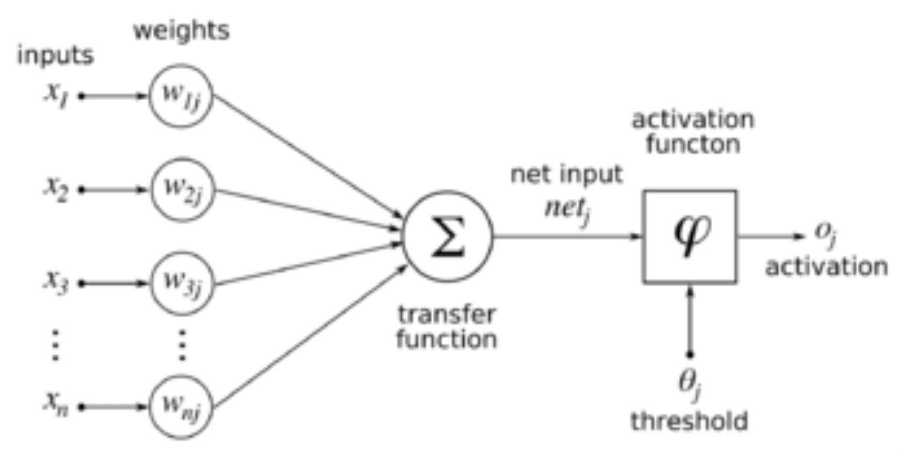
    

    - 阈值单元：$1\ (Wx > \theta)$（此函数没有斜率，因此没有基于梯度的学习）

- Frank Rosenblatt：Mark I 感知机(perceptron)

    

        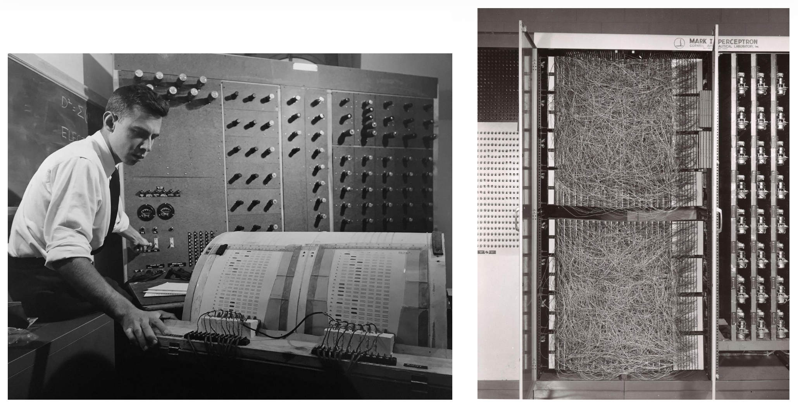
    

20 世纪 50 年代的两种 AI 观点：

- （符号）人工智能：Minsky, McCarthy, Simon, Newell
- 控制论(cybernetics)：Wiener, Rosenblatt

Vannevar Bush 提出了类似信息检索(information retrieval)的设想。

Cyril Cleverdon 引入了**基准测试**(benchmarking)——Cranfield 测试（1957–1967）。他定义了语言基准测试的概念，包括文档集合、查询和正确答案；并对一个小型语料库中的文档相关性进行了详尽的回答。

20 世纪 50 年代中 NLP 或计算语言学的起源：

    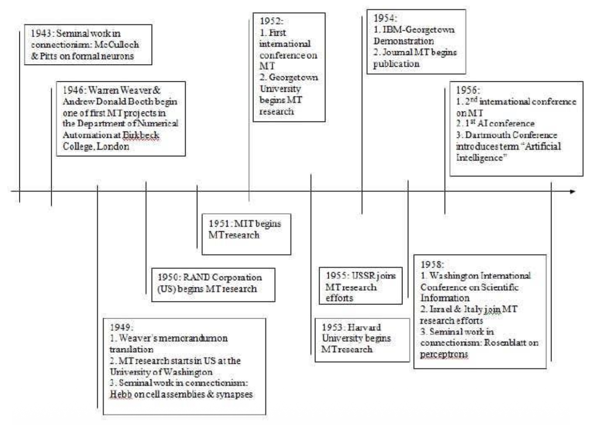

- 自动机、形式语言、概率建模及信息论的基础性工作  
- 首个语音系统（Davis 等人）  
- 机器翻译获得军方大量资助，但当时的人们对此过度自信（以至于出现早期的 AI 炒作）
- 然而所用机器比现在的袖珍计算器还要笨拙  
- 并对句法、语义、语用学知之甚少

1960 年代：

    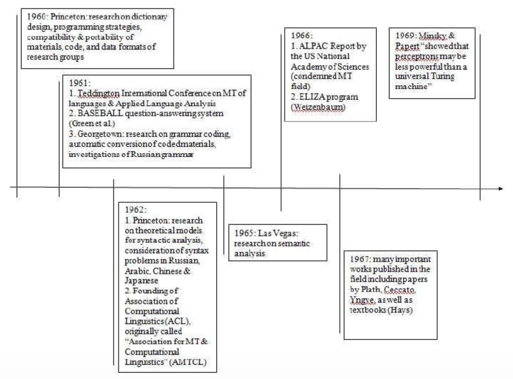

- David Glenn Hays：ACL 创始人及依存句法分析(dependency parsing)
- Raj Reddy
- Joyce Friedman

## Hand-Built Demonstration and Formalization

Martin Kay：NLP 中的形式化与基于统一的语法(unification-based grammars)

构建人类语言的意义：

- 将句子分词(tokenize)为单词（例子：The red apple is on the table）
- 将其解析为树状或图状数据结构（使用上下文无关文法及更高级的语法）  
- 通过以下步骤构建其语义：
    1. 词汇查询
    2. 语义组合，采用「规则对规则」(rule-to-rule)的方法沿树结构向上处理（例如，$PP: \alpha(\beta) \rightarrow P: \alpha NP: \beta$）

    $$
    \operatorname{on}\bigl(\iota(\lambda x\,(\operatorname{apple}(x)\land\operatorname{red}(x))),\iota(\lambda y.\operatorname{table}(y))\bigr)
    $$

    

        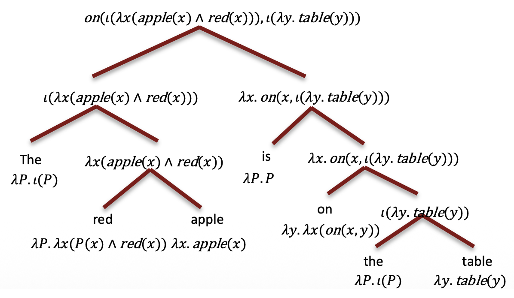
    

Norvig 博士的论文：《文本理解的推理统一理论》(*A Unified Theory of Inference for Text Understanding*)（1986）。论文指出，系统有 6 种一般推理形式；分为 2 对，因此有 4 种基本类型：

1. **细化**(elaboration)：填充槽位以连接两个实体  
   - 例子：John 得到存钱罐，原因是为了有钱或买礼物  

2. **指代消解**（共指关系）

3. **视角应用**：红袜队击败了（killed）洋基队  
    - KILLED 并非动物行为；KILLING 被视作一种令人信服的击败  

4. **具体化**：推断更具体的内容  
   - 乘坐「汽车」旅行是「驾驶」的一个实例

20 世纪 70-80 年代的 NLP：

    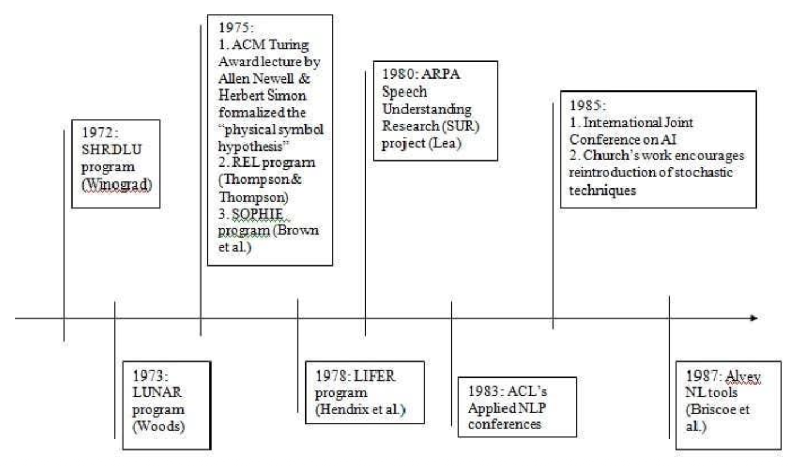

- 语音识别的基础工作：随机建模、隐马尔可夫模型、「噪声信道」(noisy channel)
- 这些工作的思想后来彻底改变了自然语言处理
- 逻辑编程、规则驱动型 AI、句法分析的确定性算法（如词汇功能语法）
- 对自然语言理解的兴趣日益增长：SHRDLU、LUNAR、CHAT-80
- 但符号 AI 遭遇瓶颈（AI 寒冬）

### Statistical/Probabilistic NLP and Supervised ML

通信的数学理论（Claud Shannon, 1948）：

    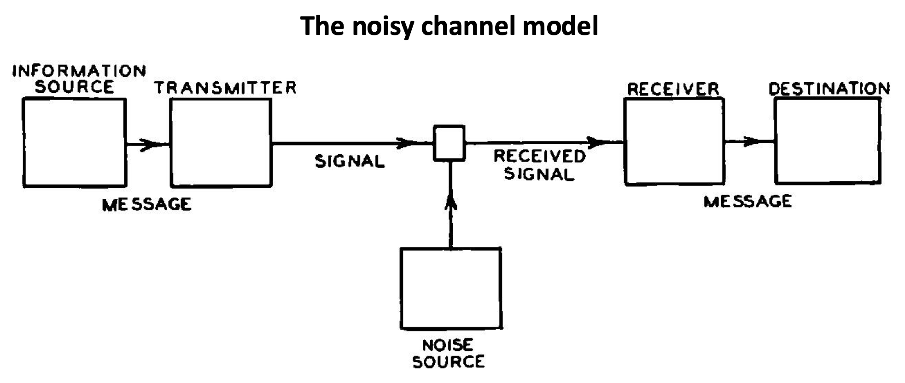

统计革命（1990s）：

- 来自电气工程（EE）与自动语音识别（ASR）的新思想涌入：概率建模、语料库统计、监督学习、经验评估  
- 新的数据来源：机器可读文本的爆炸式增长、人工标注的训练数据（例如宾夕法尼亚树库）  
- 标注数据 + 算法 + 概率预测  
- 期望降低：放弃完全语义理解，专注于文本分类、词性标注、命名实体识别（NER）和句法分析！  
- 工具：朴素贝叶斯分类器、隐马尔可夫模型、概率上下文无关文法、条件随机场

概率拼写纠正：

    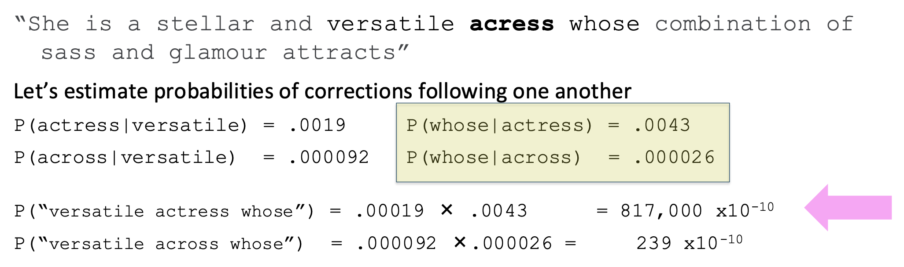

机器的崛起（2000s）：

-  更强大机器的普及  
-  统计革命成果的巩固  
-  更先进的统计建模与机器学习算法：最大熵模型（MaxEnt）、支持向量机（SVMs）、贝叶斯网络、潜在狄利克雷分配（LDA）等  
-  海量数据：网络规模增长百倍，大规模服务器集群
-  关注重心从监督学习转向无监督学习
-  对高层次语义应用的兴趣重燃

### Deep Learning

### Neural NLPs

「符号系统」研究的是代表我们周围世界的意义符号系统，如人类语言、逻辑和编程语言；以及处理这些符号的系，如大脑、计算机和复杂的社会系统。而「认知科学」将心智和智能视为自然发生的现象，符号系统则同样关注人类构建的使用符号进行交流和表示信息的系统。

语言是卓越的符号系统，我们应当研究并利用其符号结构。但这并不表明这些符号的主要处理器，即人类大脑是作为物理符号系统实现的，因此我们无需将自然语言处理系统设计为物理符号系统。大脑更像一个神经网络模型。实践证明，人工神经网络模型可扩展性更好，且能捕捉符号所表征的世界。

Hinton 在深度学习上的突破（2009-2012）

    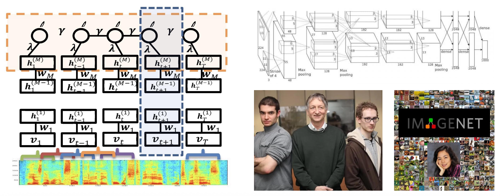

用于语音识别的深度学习：

- 语音识别首次展示了概率方法的突破性成功：隐马尔可夫模型（HMM）和高斯混合模型（GMM）  
- 深度学习在大数据集上的首个突破性成果也出现在语音识别领域
- George Dahl等人（2010/2012）：用于大词汇量语音识别的上下文相关预训练深度神经网络

    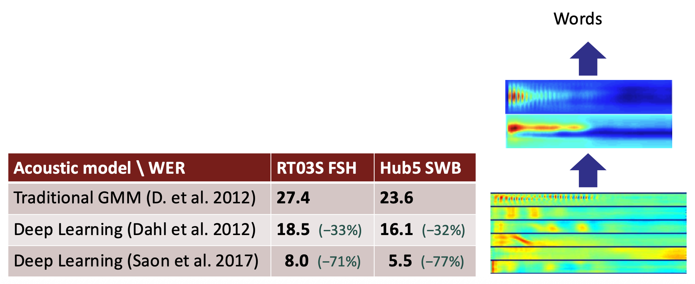

用于词义的深度学习：

- 用数字向量表示一个词 -> 相似的向量 = 相似的含义

    $$
    \textit{versatile} =
    \begin{pmatrix}
    0.286 \\
    0.792 \\
    -0.177 \\
    -0.107 \\
    0.109 \\
    -0.542 \\
    0.349 \\
    0.271
    \end{pmatrix}
    $$

- 通过分布相似性(distributional similarity)学习向量：通过文本中的上下文分布来定义相似性是现代计算语言学最成功的理念之一

RNN 编码器-解码器网络：

    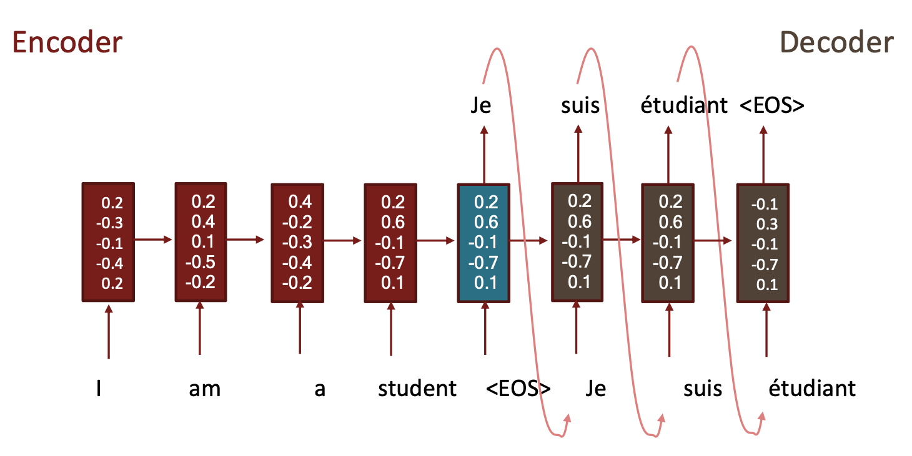

$$
h_t = \tanh\left(W[x_t] + Uh_{t-1} + b\right)
$$

LSTM 编码器-解码器网络：

    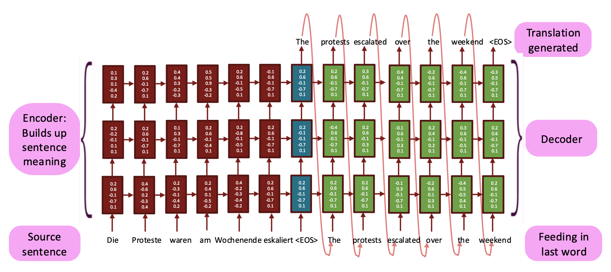

机器翻译的进展：

    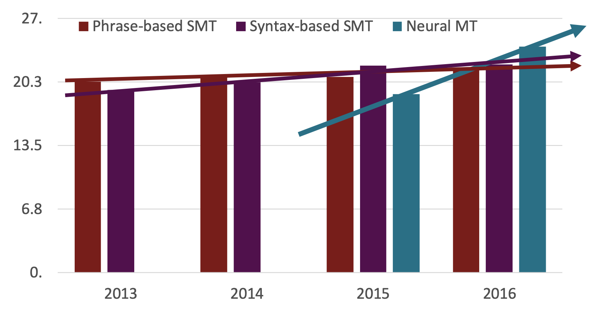

#### Large Langauge Models

???+ abstract "语言模型的历史"

    - 1913年：Andrey A. Markov 在研究亚历山大·普希金的小说《叶甫盖尼·奥涅金》中的辅音-元音转移概率时，发展了**马尔可夫模型**
    - 1948年：克劳德·E·香农提出了《信息论的数学理论》，探索了字符/词级别的 n-gram 模型、熵、文本生成
    - 1975年：弗雷德里克·杰里内克领导的 IBM 团队定义并命名了现代（概率性）“语言模型”概念，用于下一个词元预测，该模型被用于拼写纠正、语音识别、机器翻译等

???+ abstract "大语言模型的历史"

    - 1998年：基于中文的语言模型，采用分数化处理，用于一种奇怪的内置输入
    - 2000年：
        - 神经概率语言模型。Bengio、Ducharme 与 Vincent，NIPS 2000
        - 首个神经语言模型，基于 3200 万词元的语料库，词汇量 3.1 万
    - 2007年：大规模语言模型在机器翻译中的应用，Brants、Popat、Xu、Och 与 Dean，EMNLP 2007；基于 2 万亿词元语料库的n元模型，最高到 5-gram
    - 2018年：GPT（Radford、Narasimhan、Salimans 与 Sutskever）与 BERT（Devlin、Chang、Lee 与 Toutanova），基于 33 亿词元的语料料库
    - 2020年至今：超过 1000 亿参数的神经语言模型，在超过 1 万亿词元上训练，包括 GPT-3、GPT-4、PaLM 2、Llama 3、Nemotron-4...
