# Word Vectors

## Representing the Meaning of a Word

韦氏词典对 "meaning" 一词的解释：

- 由一个词、短语等所表示的意思(idea)
- 一个人通过使用词语、符号等想要表达的意思
- 在文字作品、艺术作品等中所表达的意思

可以看出，语言学上对该词最常见的思考：能指(signifier)（符号）<=> 所指(signified)（观念或事物），即指称语义(denotational semantics)。比如：

<div style="text-align: center">
    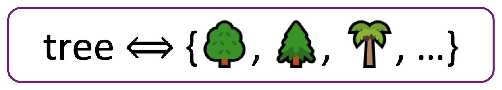
</div>

在 NLP 领域中，以往最常见的解决方案是使用诸如 **WordNet** 这样包含同义词集(synonym sets)和上位词(hypernyms)（"is-a" 关系）列表的词典。

<div style="text-align: center">
    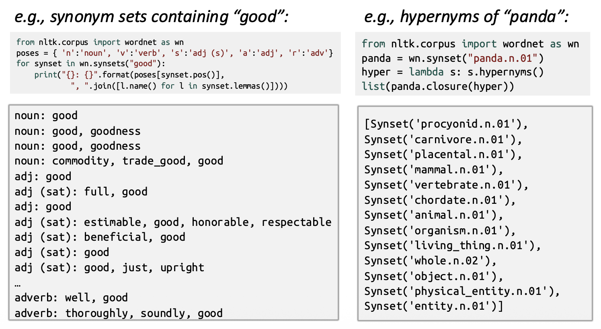
</div>

像 WordNet 这样的资源存在以下问题：

- 缺乏细微差别
  - 例如 "proficient" 被列为 "good" 的同义词，但这只在某些语境下正确
  - 在某些同义词集中列出了冒犯性的同义词，而没有涵盖这些词的内涵或适用性
- 缺少词语的新义，例如 wicked、badass、nifty、wizard、genius、ninja、bombest
- 较为主观
- 需要人力创建和调整
- 无法用于准确计算词语相似度

在传统 NLP 中，我们将词视为**离散的符号**(discrete symbols），这些符号可以用一个**独热**向量(one-hot vector)（只有一个元素是 1，其余元素都是 0）表示，而向量的维度 = 语料库中词的总数。但这种表示方法显然存在一个问题：语义相近的两个词，它们对应的向量是**正交的**(orthogonal)（点积 = 0），也就是说无法通过向量表达它们之间的**相似性**(similarity)。一种可能的解决方案是借助 WordNet 的同义词表来获取相似度，但不会成功，因为会遇到不完整等问题。相反，我们应该将相似度直接编码到向量本身。

在介绍正确的解决方案前，先来了解一些概念：

- **分布式语义**(distributional semantics)是指一个词的意义由经常出现在其附近的词给出，这是现代统计 NLP 中最成功的思想之一
- 当词 w 出现在文本中时，它的**上下文**(context)是出现在附近（固定大小的窗口内）的词的集合

于是我们用 w 的众多上下文来构建其表示。

<div style="text-align: center">
    
</div>

我们将为每个词构建一个稠密向量，选择使得它与出现在相似上下文中的词的向量相似，并用**点**（标量）**积**来度量相似性。

$$
\textit{banking} = \begin{pmatrix} 0.286 \\ 0.792 \\ -0.177 \\ -0.107 \\ 0.109 \\ -0.542 \\ 0.349 \\ 0.271 \end{pmatrix} \qquad \textit{monetary} = \begin{pmatrix} 0.413 \\ 0.582 \\ -0.007 \\ 0.247 \\ 0.216 \\ -0.718 \\ 0.147 \\ 0.051 \end{pmatrix}
$$

**词向量**(word vector)也被称为**（词）嵌入**(embeddings)或**（神经）词表示**(word representations)，它们是一种**分布式**表示。

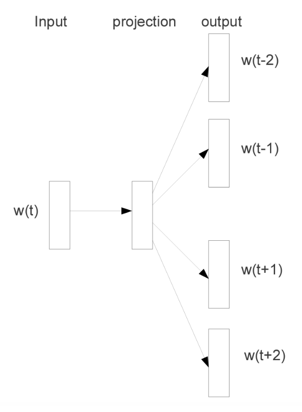{ align=right width=30% }


## Word2Vec

**Word2Vec** 是一种学习词向量的框架（Mikolov 等，2013），其思路包括：

- 有一个大型语料库(corpus of text)（“主体”），即一长串单词
- 固定词汇表中的每个单词都对应一个**向量**
- 遍历文本中的每个位置 t，该位置有一个中心词 c 和上下文（“外部”）词 o
- 利用 c 和 o 的**词向量相似度**来计算给定 c 时 o 的概率（或反之）
- **不断调整词向量**以最大化这个概率

???+ example "例子：计算 $P(w_{t+j}\ |\ w_j)$ 时的窗口和过程"

    <div style="text-align: center">
        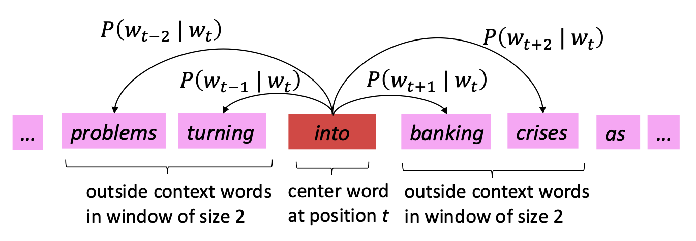
    </div>
    
    <div style="text-align: center">
        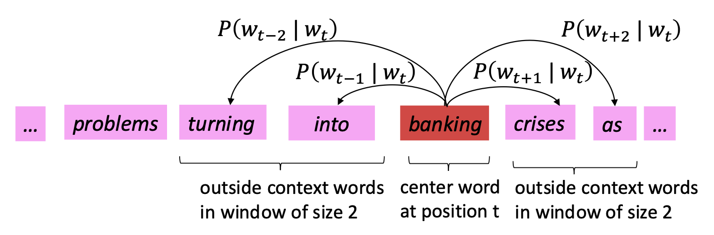
    </div>

对于每个位置 $t = 1, \dots , T$，预测以中心词 $w_t$ 为中心的固定大小 $m$ 的窗口内的上下文词，数据似然(likelihood)为：

$$
\text{likelihood} = L(\theta) = \prod_{t=1}^{T} \prod_{\substack{-m \le j \le m \\ j \ne 0}} P(w_{t+j}\ |\ w_j;\ \theta)
$$

**目标函数**(objective function)（有时称为**成本**或**损失**(loss)函数） $J(\theta)$ 是（**平均**）**负**对数似然。最小化目标函数等价于最大化预测精度。

$$
J(\theta) = -\frac{1}{T} \log L(\theta) = \color{teal}{-\frac{1}{T}} \sum_{t=1}^{T} \sum_{\substack{-m \le j \le m \\ j \ne 0}} \log P(w_{t+j}\ |\ w_j;\ \theta)
$$

>$\theta$：所有可用于优化的变量

要计算 $P(w_{t+j}\ |\ w_j;\ \theta)$，需用到词 $w$ 的两个向量：

- $v_w$：中心词 $w$ 的词向量
- $u_w$：上下文词 $w$ 的词向量

对于中心词 $c$ 和上下文词 $o$，有：

$$
P(o\ |\ c) = \frac{\exp(u_o^T \cdot v_c)}{\sum_{w \in V} \exp(u_w^T \cdot v_c)}
$$

??? example "例子"

    $P(problems\ |\ into;\ u_{problems}, v_{into}, \theta)$ 简记为 $P(u_{problems}\ |\ v_{into})$
    
    <div style="text-align: center">
        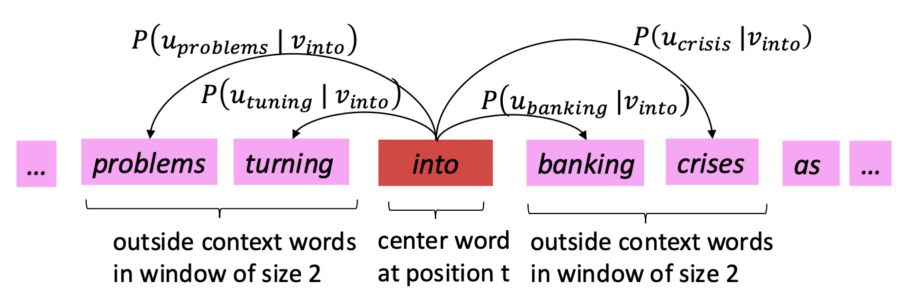
    </div>

对于上述公式：

- 分子部分的点积比较了 $o, c$ 的相似度，更大的点积意味着更大的概率
- 指数计算的结果始终为正
- 分母的计算实现了整个语料库的归一化，从而得到概率分布

这是 **softmax 函数**（$\mathbb{R}^n \rightarrow (0, 1)^n$）的一个例子，它将任意值 $x_i$ 映射到概率 $p_i$ 上

$$
\text{softmax}(x_i) = \frac{\exp(x_i)}{\sum_{j=1}^n \exp(x_j)} = p_i
$$

- "max"：放大了最大的 $x_i$ 对应的概率
- "soft"：仍然为较小的 $x_i$ 分配一些概率

softmax 函数在深度学习中被广泛使用。

训练模型就是通过调整参数值来最小化损失。

- $\theta$ 表示**所有**模型参数，用一个长向量表示
- 假如向量是 $d$ 维的，且语料库中有 $V$ 个词，那么

    $$
    \theta = \begin{bmatrix}
        v_{aardvark} \\
        \vdots \\
        v_{zebra} \\
        u_{aardvark} \\
        \vdots \\
        u_{zebra}
    \end{bmatrix} \in \mathbb{R}^{2dV}
    $$

- 注意：每个词有两个向量
- 我们通过沿梯度方向下降来优化参数，因此需计算**所有**向量梯度

    <div style="text-align: center">
        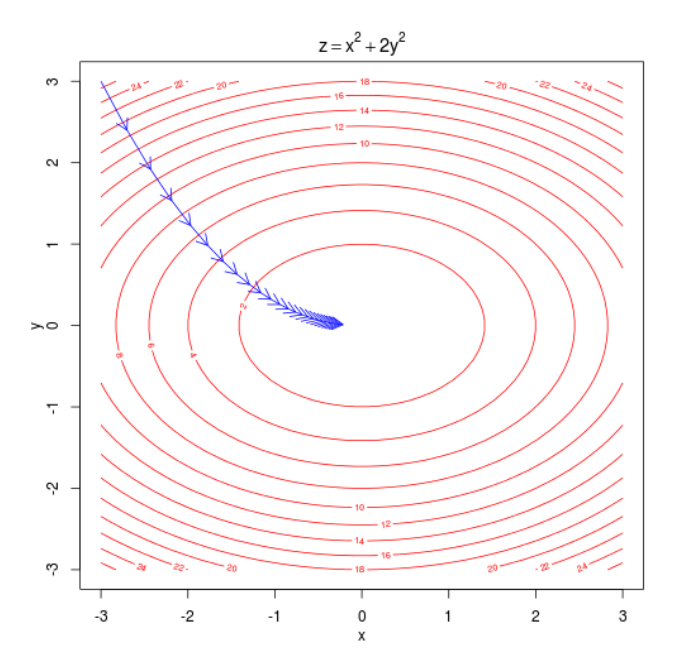
    </div>


## Optimization

现在我们想要最小化成本函数 $J(\theta)$，一般的做法是利用**梯度下降**(gradient descent)算法来实现。思路为：对于当前值 $\theta$，计算 $J(\theta)$ 的梯度，然后沿负梯度方向小步前进；重复这一过程。

<div style="text-align: center">
    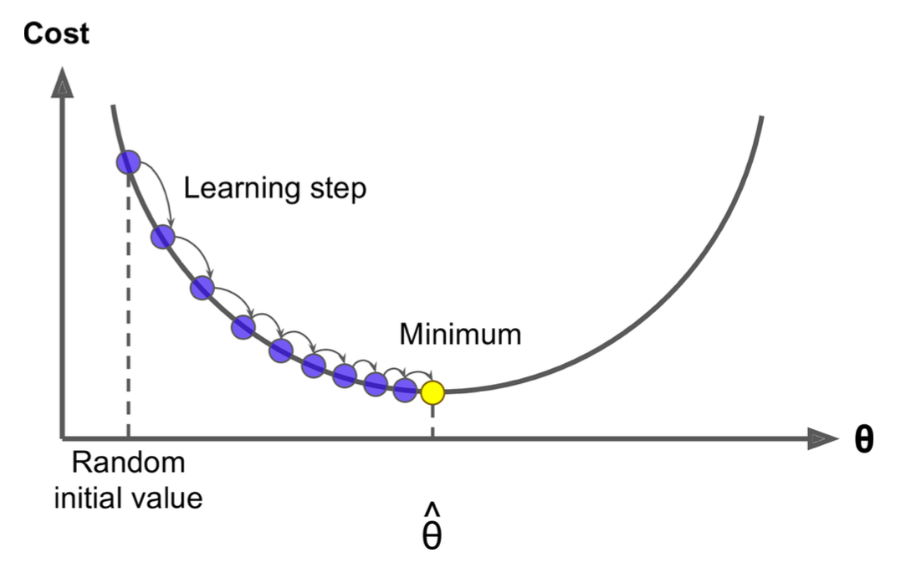
</div>

>注：虽然目标函数并不总是像上图那样是凸函数，但在大多数情况下都是 OK 的。

梯度下降法的更新方程：

- 矩阵形式：$\theta^{\text{new}} = \theta^{\text{old}} - \alpha \nabla_\theta J(\theta)$
- 单个参数：$\theta_j^{\text{new}} = \theta_j^{\text{old}} - \alpha \frac{\partial)}{\partial \theta_j^{\text{old}}} J(\theta)$

算法实现如下：

```py
while True:
    theta_grad = evaluate_gradient(J, corpus, theta)
    theta = theta - alpha * theta_grad
```

但这样做的问题是 $J(\theta)$ 是针对语料库中所有词（可能有数十亿个）的一个函数，因此 $\nabla_\theta J(\theta)$ 的计算非常昂贵，一次更新就要等很久。所以对于众多神经网络而言，这是极其糟糕的思路。解决方案是采用**随机梯度下降**(stochastic gradient descent, **SGD**)：重复采样窗口，并在每次采样后更新（一种小批量(mini batch)的梯度下降）。算法实现如下：

```py
while True:
    window = sample_window(corpus)
    theta_grad = evaluate_gradient(J, window, theta)
    theta = theta - alpha * theta_grad
```

Word2vec 通过让相似词在空间中相近来最大化目标函数。

<div style="text-align: center">
    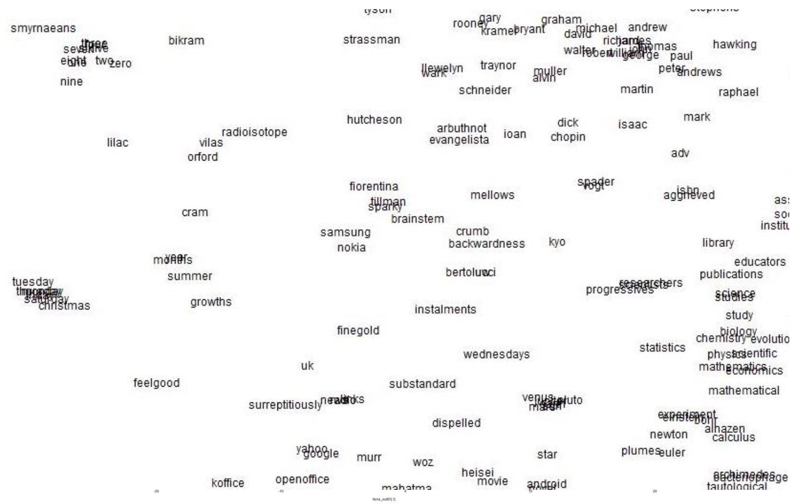
</div>


算法之所以用到两类向量，是因为这样做便于优化（可以在最后一起算均值）。但也可以让每个词只对应一个向量来实现算法，这也会起作用。于是有以下两类变体：

- **跳元**(skip-gram, **SG**)：给定中心词，预测上下文（“外部”）词（位置无关）
    >这便是前面介绍过的模型

- **连续词袋**(continuous bag of words, **CBOW**)：从（词袋中的）上下文词预测中心词词

训练用的损失函数有以下几类：

- 朴素(naive) softmax：简单但成本高（当输出类别很多时）
    >目前只介绍过这种

- 更优化的变体，如层级(hierarchical) softmax
- 负采样(negative sampling)

由于归一化项计算成本高（概率的分母部分），因此标准的 word2vec 实现采用**负采样**训练得到的 SG 模型。主要思想是：训练二元逻辑回归，以区分真(true)配对（中心词及其上下文窗口中的词）和多个“噪声”配对（中心词与随机词的配对）。

- 取 k 个负样本（采用词概率）
- 最大化真实外部单词出现的概率，并最小化随机单词出现在中心词周围的概率
- 最小化

    $$
    J_{\text{neg-sample}}(\bm{u}_o, \bm{v}_c, U) = -\log \sigma(\bm{u}_o^T \bm{v}_c) - \sum_{k \in \{K \text{ sampled indices}\}} \log \sigma(-\bm{u}_k^T \bm{v}_c)
    $$

    - 其中 $\sigma$ 是 sigmoid 函数而非 softmax

- logistic/sigmoid 函数 $\sigma(x) = \frac{1}{1 + e^{-x}}$

    <div style="text-align: center">
        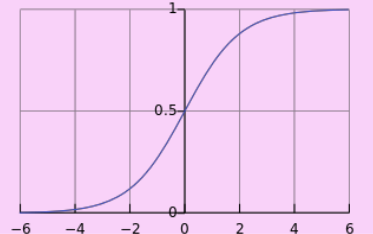
    </div>

- 按 $P(w) = U(w)^{3/4} / Z$ 进行采样，其中一元分布 $U(w)$ 取 3/4 次幂（使得出现次数少的词被更频繁地采样到）

??? info "补充：采用负采样的 SGD"

    在 SGD 中，我们迭代地在每个窗口计算梯度。而在每个窗口中，最多只有 $2m＋1$ 个词，加上通过负采样得到的 $2km$ 个负样本词，因此 $\nabla_{\theta} J_t(\theta)$ 非常稀疏。
    
    $$
    \nabla_\theta J_t(\theta) = \begin{bmatrix} 0 \\ \vdots \\ \nabla_{v_{like}} \\ \vdots \\ 0 \\ \nabla_{u_I} \\ \vdots \\ \nabla_{u_{learning}} \\ \vdots \end{bmatrix} \in \mathbb{R}^{2dV}
    $$
    
    实际上只需更新实际出现的词向量就行。所以解决方案为：使用稀疏矩阵更新操作，仅更新完整嵌入矩阵 $U$ 和 $V$ 的某些**行**（在真实的 DL 包中，是行而非列）；或者需要为词向量保留一个哈希表。若有数百万个词向量并进行分布式计算，避免来回传输巨大的更新就显得非常重要。
    
    <div style="text-align: center">
        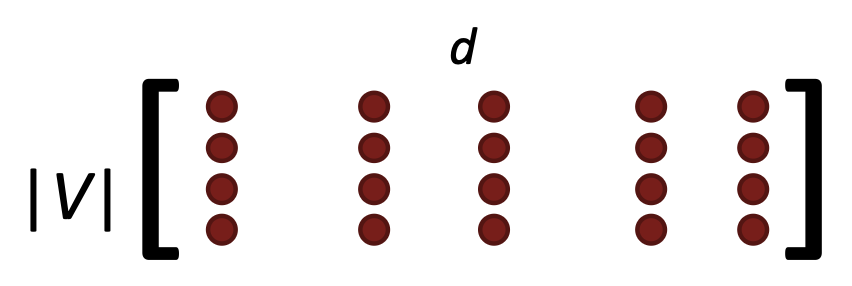
    </div>


## Co-occurrence

有些读者可能会想为什么要遍历整个（或多次）语料库呢？为什么不直接累积所有关于哪些词彼此相邻出现的统计数据呢？

于是尝试构建共现矩阵(co-occurance matrix) $X$。具体实现上有 2 种选择：窗口或整篇文档

- 窗口：类似于 word2vec，使用每个词周围的窗口来捕获一些句法和语义信息（**词空间**）
- 文档：共现矩阵会给出一般主题（所有体育术语都会有相似的条目），从而引出「潜在语义分析」(latent semantic analysis)（**文档空间**）

???+ example "例子：基于共现矩阵的窗口"

    - 窗口的长度为 1
    - 对称
    - 示例语料库：
        - I like deep learning
        - I like NLP
        - I enjoy flying
    
    | counts | I | like | enjoy | deep | learning | NLP | flying | . |
    |--------|---|------|-------|------|----------|-----|--------|---|
    | I | 0 | 2 | 1 | 0 | 0 | 0 | 0 | 0 |
    | like | 2 | 0 | 0 | 1 | 0 | 1 | 0 | 0 |
    | enjoy | 1 | 0 | 0 | 0 | 0 | 0 | 1 | 0 |
    | deep | 0 | 1 | 0 | 0 | 1 | 0 | 0 | 0 |
    | learning | 0 | 0 | 0 | 1 | 0 | 0 | 0 | 1 |
    | NLP | 0 | 1 | 0 | 0 | 0 | 0 | 0 | 1 |
    | flying | 0 | 0 | 1 | 0 | 0 | 0 | 0 | 1 |
    | . | 0 | 0 | 0 | 0 | 1 | 1 | 1 | 0 |

对于简单的共现计数向量：

- 向量大小随词表增大而增大
- 因此其维度非常之高，需要大量存储空间（尽管是稀疏的）
- 后续的分类模型存在稀疏性问题会导致模型不够鲁棒

所以得考虑低维向量，其思路是将大部分重要信息存储在固定的、较少维度的空间中（一个稠密向量）；通常为 25–1000 维，类似于 word2vec。维度下降(dimensionality reduction)的思路是：对共现矩阵 $X$ 的奇异值分解（**SVD**），即将 $X$ 分解为 $U\Sigma V^\top$，其中 $U$ 和 $V$ 是正交归一的（单位向量且正交）。

<div style="text-align: center">
    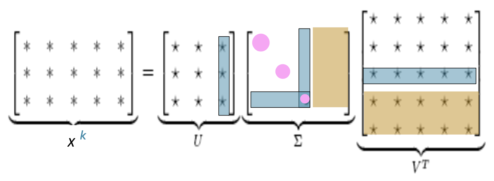
</div>

- 仅保留 $k$ 个奇异值，以便进行泛化
- $\hat{X}$ 是 $X$ 在最小二乘意义上的最佳秩 $k$ 近似
- 这是经典的线性代数结果，对于大型矩阵而言计算成本高

由于直接对原始计数进行 SVD 的效果不好，所以

- 对矩阵单元中的计数进行**缩放**(scale)。但这会使得功能词（the、he、has）出现得太频繁，从而对句法产生过大影响。修复方法有：
    - 对频率取对数
    - $\min(X, t)$，其中 $t \approx 100$
    - 忽略功能词

- 斜坡式窗口：对较近的词比较远的词赋予更高计数权重
- 使用相关性而非计数，然后将负值设为 0
- 等等...

如下图所示，在缩放向量中出现了有趣的语义模式：

<div style="text-align: center">
    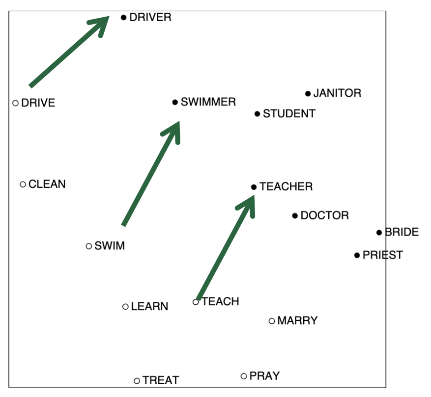
</div>

>COALS model from Rohde et al. ms., 2005. An Improved Model of Semantic Similarity Based on Lexical Co-Occurrence


### GLoVe

**GLoVe**（[Pennington, Socher, and Manning, EMNLP 2014]）在向量差异中编码（线性的）语义成分。

- 对数双线性模型：$w_i \cdot w_j = \log P(i|j)$
- 向量差异：$w_x \cdot (w_a - w_b) = \log \dfrac{P(x|a)}{P(x|b)}$
- 损失函数：$J = \sum_{i, j = 1}^V f(X_{ij}) (w_i^T \hat{w_j} + b_i + \tilde{b_j} - \log X_{ij})^2$
    - 函数 $f$：

        <div style="text-align: center">
            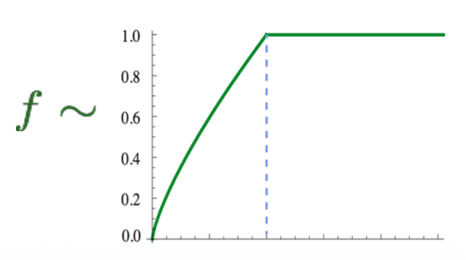
        </div>

    - 训练更快
    - 在大语料库中可缩放


## Evaluation

关于 NLP 的一般评估分为内在评估和外在评估：

- **内在**(intrisic)评估：
    - 在特定/中间子任务上进行评估
    - 计算速度快
    - 有助于理解该系统
    - 除非已建立与实际任务的相关性，否则不清楚是否有用

- **外在**(extrinsic)评估：
    - 在实际任务上进行评估
    - 计算准确率可能需要很长时间
    - 不清楚问题是出在子系统本身、其交互还是其他子系统
    - 如果仅将其中一个子系统替换为另一个子系统而准确率提高 -> 获胜！


### Intrisic Evaluation

词向量类比(analogies)：对于 `a:b :: c:?`（`a` 之于 `b`，正如 `c` 之于什么）。

- 通过词向量相加后的**余弦距离**在捕捉直观的语义和句法类比问题方面的表现来评估词向量

    $$
    d = \arg \max_{i} \frac{(x_b - x_a + x_c)^\top x_i}{\|x_b - x_a + x_c\|}
    $$

    <div style="text-align: center">
        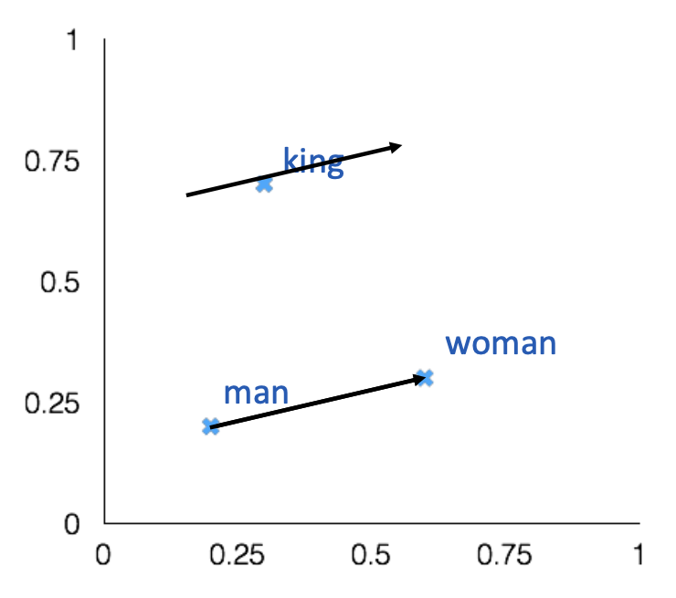
    </div>

- 从搜索中丢弃输入词

<!-- - 若信息存在但不是线性 -->

???+ example "GLoVe 可视化结果"

    <div style="text-align: center">
        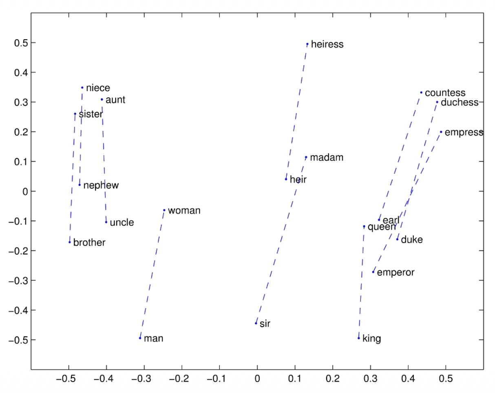
    </div>


另一种内在词向量评估方式是**意义相似度**(meaning similarity)，即词向量距离及其与人类判断的相关性。

示例数据集：[WordSim353](http://www.cs.technion.ac.il/~gabr/resources/data/wordsim353/)

| Word 1 | Word 2 | Human (mean) |
|--------|--------|--------------|
| tiger | cat | 7.35 |
| tiger | tiger | 10 |
| book | paper | 7.46 |
| computer | internet | 7.58 |
| plane | car | 5.77 |
| professor | doctor | 6.62 |
| stock | phone | 1.62 |
| stock | CD | 1.31 |
| stock | jaguar | 0.92 |

<div style="text-align: center">
    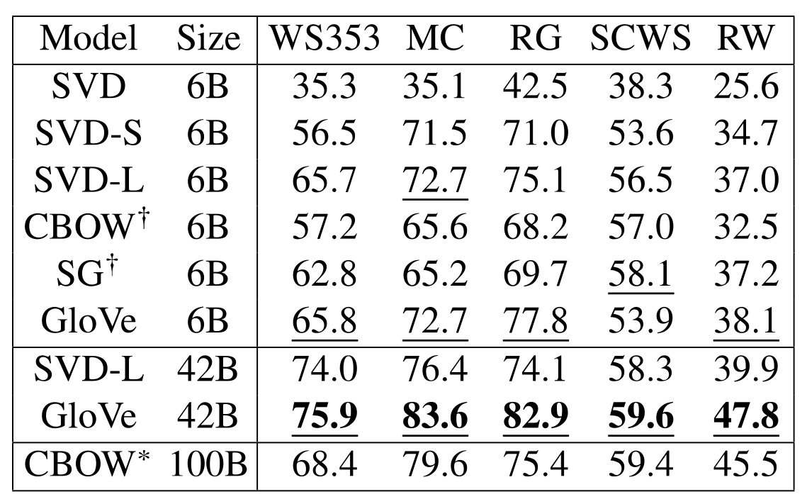
</div>


### Extrinsic Evaluation

一个好的词向量应该能直接提供帮助的一个例子是**命名实体识别**(named entity recognition)：识别对人物、组织或地点的引用。例如：Chris Manning 住在帕洛阿尔托。

<div style="text-align: center">
    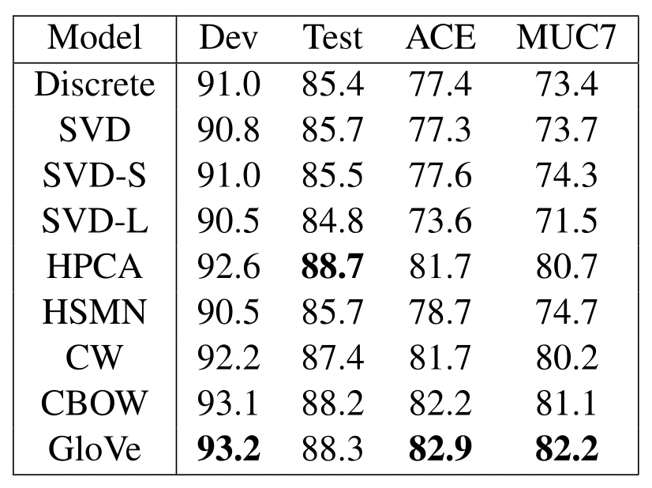
</div>
