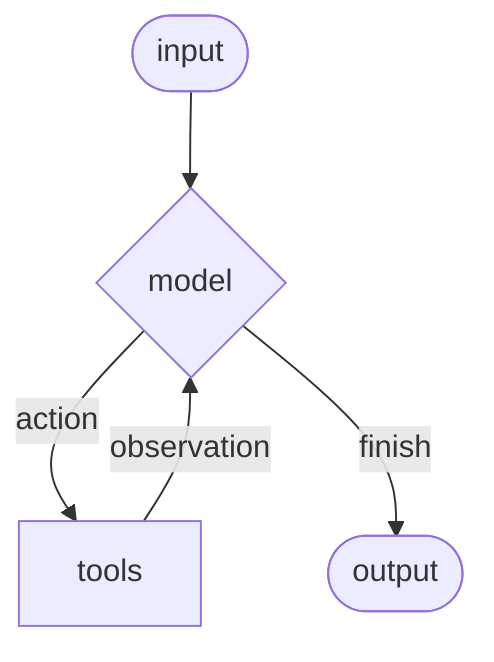

# LangChain

!!! info "链接"

    - 官网：<https://www.langchain.com/>
    - Langchain 文档：<https://docs.langchain.com/oss/python/langchain/overview>

!!! recommend "相关资料推荐"

    - [Hello-Agents (by Datawhale)](https://github.com/datawhalechina/hello-agents)

!!! note "注"

    - 本笔记只记录 Python 版本的 LangChain（LangChain 还有 TS 版本的）。
    - 由于 LangChain 更新速度很快，且听说时有破坏性更新出现，所以本笔记难以保证时效性。自学时仍然强烈建议阅读官方文档，并且定期查阅。
        - 开始撰写时间：2025.10.23，笔记目前仍在更新中...


## 安装

一键安装！

=== "pip"

    ```bash
    pip install -U langchain
    ```

=== "uv"

    ```bash
    uv add langchain
    ```


## 从一个简单的例子上手

要搭建一个能在现实世界中使用的智能体(agent)，可以遵循以下步骤：

1. **详细的系统提示词**(detailed system prompt)，期望得到更好的智能体行为
2. **创建工具**(create tools)，与外部数据集成
3. **模型配置**(model configuration)，以实现一致的响应
4. **结构化输出**(structured output)，以得到可预测的结果
5. **对话记忆**(conversational memory)，以实现聊天般的交互
6. **创建并运行智能体**(create and run the agent)

下面通过搭建一个天气预报智能体来认识如何用 LangChain 实现这一过程：

1. 定义系统提示词：通过提示词，可以指定智能体的角色和行为；表述内容应当是具体可操作的(specific and actionable)。

    ```py
    SYSTEM_PROMPT = """You are an expert weather forecaster, who speaks in puns.

    You have access to two tools:

    - get_weather_for_location: use this to get the weather for a specific location
    - get_user_location: use this to get the user's location

    If a user asks you for the weather, make sure you know the location. If you can tell from the question that they mean wherever they are, use the get_user_location tool to find their location."""
    ```

2. 创建工具：
    - 通过**调用自定义函数**，让模型与外部系统交互
    - 工具不仅可以依赖**运行时上下文**(runtime context)，也可以和**智能体记忆**交互

    ```py
    from dataclasses import dataclass
    from langchain.tools import tool, ToolRuntime

    @tool
    def get_weather_for_location(city: str) -> str:
        """Get weather for a given city."""
        return f"It's always sunny in {city}!"

    @dataclass
    class Context:
        """Custom runtime context schema."""
        user_id: str

    @tool
    def get_user_location(runtime: ToolRuntime[Context]) -> str:
        """Retrieve user information based on user ID."""
        user_id = runtime.context.user_id
        return "Florida" if user_id == "1" else "SF"
    ```

    - 函数定义前一行 `#!py @` 开头的语句是**装饰器**，是一种函数包装器(wrapper)：本身就是一个函数，它将下面定义的函数作为参数，返回一个新的函数
        - 这样的写法是一种“语法糖”

    - 工具应当是注释完备的：工具的名称、描述和参数名会作为模型提示词的一部分
    - LangChain 的 `#!py @tool` 装饰器添加元数据，并通过 `ToolRuntime` 参数启用运行时注入(runtime injection)
    - `#!py @dataclass`（**数据类**）装饰器能让类只定义字段而不需要定义方法，类似 C 语言的 `#!c struct`

3. 配置模型：使用正确的参数设置语言模型

    ```py
    from langchain.chat_models import init_chat_model

    model = init_chat_model(
        "deepseek:deepseek-chat",    # 本土化（doge）
        temperature=0.5,
        timeout=10,
        max_tokens=1000
    )
    ```

    - 使用 Deepseek 模型的话，在运行程序前要先配好环境变量：运行命令 `export DEEPSEEK_API_KEY="sk-xxxxxxxxxxxxx"` 以临时设置（永久设置的话请把这句话放在对应的 shell 配置文件（如 `.bashrc`、`.zshrc`）中）

4. 定义响应格式（可选）：如果需要让智能体的响应匹配具体的模式(schema)，那就定义一个结构化的响应格式

    ```py
    from dataclasses import dataclass

    # We use a dataclass here, but Pydantic models are also supported.
    @dataclass
    class ResponseFormat:
        """Response schema for the agent."""
        # A punny response (always required)
        punny_response: str
        # Any interesting information about the weather if available
        weather_conditions: str | None = None
    ```

5. 增加记忆：向智能体增加记忆以维护交互过程中的状态，从而使智能体记住先前的对话和上下文
    - 在生产环境中，请使用一个**检查点器**(checkpointer)，（将记忆）保存至数据库中

    ```py
    from langgraph.checkpoint.memory import InMemorySaver

    checkpointer = InMemorySaver()
    ```

6. 创建并运行智能体：将上述创建的组件组装起来，然后运行它！

    ```py
    agent = create_agent(
        model=model,
        system_prompt=SYSTEM_PROMPT,
        tools=[get_user_location, get_weather_for_location],
        context_schema=Context,
        response_format=ResponseFormat,
        checkpointer=checkpointer
    )

    # `thread_id` is a unique identifier for a given conversation.
    config = {"configurable": {"thread_id": "1"}}

    response = agent.invoke(
        {"messages": [{"role": "user", "content": "what is the weather outside?"}]},
        config=config,
        context=Context(user_id="1")
    )

    print(response['structured_response'])
    # ResponseFormat(
    #     punny_response="Florida is still having a 'sun-derful' day! The sunshine is playing 'ray-dio' hits all day long! I'd say it's the perfect weather for some 'solar-bration'! If you were hoping for rain, I'm afraid that idea is all 'washed up' - the forecast remains 'clear-ly' brilliant!",
    #     weather_conditions="It's always sunny in Florida!"
    # )


    # Note that we can continue the conversation using the same `thread_id`.
    response = agent.invoke(
        {"messages": [{"role": "user", "content": "thank you!"}]},
        config=config,
        context=Context(user_id="1")
    )

    print(response['structured_response'])
    # ResponseFormat(
    #     punny_response="You're 'thund-erfully' welcome! It's always a 'breeze' to help you stay 'current' with the weather. I'm just 'cloud'-ing around waiting to 'shower' you with more forecasts whenever you need them. Have a 'sun-sational' day in the Florida sunshine!",
    #     weather_conditions=None
    # )
    ```

万事俱备，来看看运行结果吧：

<div style="text-align: center">
    
</div>

好耶！就此我们完成了 LangChain 版的 "Hello, world" 程序了。


## 核心组件

### 智能体

**智能体**(agents)将工具和语言模型相结合，创建出一个能够推理任务，决定使用何种工具，并迭代工作以寻求解决方案的系统。

`create_agent` 函数用于创建一个智能体。

LLM 智能体在循环中运行工具，以实现目标；循环将一直继续下去，直到模型发出最终输出或超过迭代次数。

<div align=center markdown="1">



</div>

智能体的核心组件包括：

- **模型**(model)：智能体的推理引擎(reasoning engine)，可分为：
    - **静态**(static)模型：创建智能体时配置一次，并在执行过程中保持不变，是最常用和直接的方法
        - 可直接用**模型标识符字符串**(model identifier string)（形如 `"provider:model"` 的字符串）初始化

            ```py
            from langchain.agents import create_agent

            agent = create_agent(
                "deepseek:deepseek-chat",
                tools=tools
            )
            ```

            - 模型标识符字符串支持自动推断，故可略去提供商（也就是仅保留冒号右侧部分）

        - 若要更精细地控制模型配置，请直接使用提供者包初始化模型实例，比如：

            ```py hl_lines="2 4-5"
            from langchain.agents import create_agent
            from langchain_openai import ChatOpenAI

            model = ChatOpenAI(
                model="gpt-5",
                temperature=0.1,
                max_tokens=1000,
                timeout=30
                # ... (other params)
            )
            agent = create_agent(model, tools=tools)
            ```

            - 模型实例能让我们对配置有完全的控制权：通常可设置特定参数包括 `temperature`、`max_tokens`、`timeouts`、`base_url` 等。不同的提供商可能有不同的设置，请参考[文档](https://docs.langchain.com/oss/python/integrations/providers/all_providers)。

    - **动态**(dynamic)模型：基于当前状态[^1]和上下文在运行时[^2]选择，以实现精密的路由逻辑和成本优化
        - 使用 `#!py @warp_model_call` 装饰器来创建中间件，该中间件会修改请求中的模型

            ```py
            from langchain_openai import ChatOpenAI
            from langchain.agents import create_agent
            from langchain.agents.middleware import wrap_model_call, ModelRequest, ModelResponse


            basic_model = ChatOpenAI(model="gpt-4o-mini")
            advanced_model = ChatOpenAI(model="gpt-4o")

            @wrap_model_call
            def dynamic_model_selection(request: ModelRequest, handler) -> ModelResponse:
                """Choose model based on conversation complexity."""
                message_count = len(request.state["messages"])

                if message_count > 10:
                    # Use an advanced model for longer conversations
                    model = advanced_model
                else:
                    model = basic_model

                request.model = model
                return handler(request)

            agent = create_agent(
                model=basic_model,  # Default model
                tools=tools,
                middleware=[dynamic_model_selection]
            )
            ```

[^1]: 流经智能体执行过程的数据，包括消息、自定义字段，以及任何在处理过程中需要追踪并可能修改的信息
[^2]: 智能体的执行环境，包含在执行期间持续存在的不可变配置和上下文数据


- **工具**(tool)：赋予智能体采取行动的能力
    - 智能体通过促进以下方面，从而超过了简单的模型+工具组合：
        - 连续多次调用工具
        - 在适当情况下并行调用工具
        - 根据先前结果动态选择工具
        - 工具重试逻辑和错误处理
        - 跨工具调用的状态持久化

    - 定义工具
        - 将工具列表传给智能体
        - 若提供空的工具列表，智能体就是一个无工具调用能力的 LLM

        ```py
        from langchain.tools import tool
        from langchain.agents import create_agent


        @tool
        def search(query: str) -> str:
            """Search for information."""
            return f"Results for: {query}"

        @tool
        def get_weather(location: str) -> str:
            """Get weather information for a location."""
            return f"Weather in {location}: Sunny, 72°F"

        agent = create_agent(model, tools=[search, get_weather])
        ```

    - 工具错误处理
        - 要想自定义工具的错误处理，就使用 `#!py @wrap_tool_call` 装饰器创建中间件：

            ```py
            from langchain.agents import create_agent
            from langchain.agents.middleware import wrap_tool_call
            from langchain_core.messages import ToolMessage


            @wrap_tool_call
            def handle_tool_errors(request, handler):
                """Handle tool execution errors with custom messages."""
                try:
                    return handler(request)
                except Exception as e:
                    # Return a custom error message to the model
                    return ToolMessage(
                        content=f"Tool error: Please check your input and try again. ({str(e)})",
                        tool_call_id=request.tool_call["id"]
                    )

            agent = create_agent(
                model="openai:gpt-4o",
                tools=[search, get_weather],
                middleware=[handle_tool_errors]
            )
            ```

        - 当使用工具失败时，智能体将返回一个 `ToolMessage`，其中包含自定义错误消息：

            ```py
            [
                ...
                ToolMessage(
                    content="Tool error: Please check your input and try again. (division by zero)",
                    tool_call_id="..."
                ),
                ...
            ]
            ```

    - 代理遵循 **ReAct**（“推理(Reasoning)+行动(Acting)”）模式，在简短的推理步骤与目标工具调用之间交替，并将产生的观察结果回馈给后续决策，直到能够提供最终答案。

- **系统提示词**(system prompt)：通过提示词告诉智能体以何种方法完成任务
    - 传递 `system_prompt` 参数，以字符串形式提供提示词
    - 若未提供 `system_prompt`，智能体就直接从消息中推断任务
    - **动态**系统提示词：若需要根据运行时上下文或智能体状态修改系统提示词，可以使用由 `#!py @dynamic_prompt` 装饰器创建的中间件，根据模型请求动态生成系统提示词


### 模型

**模型**(models)是智能体的推理引擎，驱动智能体的决策过程，决定调用哪些工具、如何解释结果以及何时给出最终答案。

模型支持的功能有：

- **文本生成**(text generation)
- **工具调用**(tool calling)：调用外部工具（如数据库查询或 API 调用）并使用其响应结果
- **结构化输出**(structured output)：模型的响应被限制在定义好的格式内
- **多模态**(multimodality)：处理并返回除文本以外的数据，例如图像、音频和视频
- **推理**(reasoning)：模型执行多步骤推理以得出结论

模型的质量和功能直接影响智能体的可靠性和性能。不同的模型擅长不同的任务，比如：

- 有些模型更擅长执行复杂的指令
- 有些模型更擅长结构化推理
- 还有一些模型支持更大的上下文窗口以处理更多信息


#### 基本用法

模型的两种利用方式：

- **使用智能体**(with agents)：在创建智能体时可动态指定模型
- **独立运行**(standalone)：直接调用模型（在智能体外部）来执行文本生成、分类或提取等任务

对于后者，可直接通过 `init_chat_model` 方法来初始化模型：

```py
# OpenAI
import os
from langchain.chat_models import init_chat_model

os.environ["OPENAI_API_KEY"] = "sk-..."

model = init_chat_model("gpt-4.1")
```

`init_chat_model` 可使用的参数有：

- `model` <span class="box box-gray">string</span> <span class="box box-red">required</span>：模型提供商 + 模型标识符
- `api_key` <span class="box box-gray">string</span>
- `temperature` <span class="box box-gray">number</span>：控制模型输出的**随机性**，数值越高，响应越具创造性(creative)；数值越低，响应越具确定性(deterministic)
- `timeout` <span class="box box-gray">number</span>：等待模型响应的最长时间（单位：s），超过此时间将取消请求
- `max_tokens` <span class="box box-gray">number</span>：限制响应的总 token 数，有效控制输出长度
- `max_retries` <span class="box box-gray">number</span>：如果由于网络超时或速率限制等问题导致请求失败，系统将尝试重新发送请求的最大次数

```py
model = init_chat_model(
    "claude-sonnet-4-5-20250929",
    # Kwargs passed to the model:
    temperature=0.7,
    timeout=30,
    max_tokens=1000,
)
```


#### 调用

必须调用模型才能生成输出。LangChain 提供以下三种主要的，适用于不同使用场景的调用方法：

- `invoke()`：最直接的方法

    ```py
    response = model.invoke("Why do parrots have colorful feathers?")
    print(response)
    ```

    - 可以向模型提供**消息列表**来表示对话历史记录；每条消息都可设置一个**角色**，模型使用该角色来指示对话中消息的发送者

    ```py
    # Dictionary format
    conversation = [
        {"role": "system", "content": "You are a helpful assistant that translates English to French."},
        {"role": "user", "content": "Translate: I love programming."},
        {"role": "assistant", "content": "J'adore la programmation."},
        {"role": "user", "content": "Translate: I love building applications."}
    ]

    # Message objects
    from langchain_core.messages import HumanMessage, AIMessage, SystemMessage

    conversation = [
        SystemMessage("You are a helpful assistant that translates English to French."),
        HumanMessage("Translate: I love programming."),
        AIMessage("J'adore la programmation."),
        HumanMessage("Translate: I love building applications.")
    ]

    response = model.invoke(conversation)
    ```

- `stream()`：大多数模型支持通过逐步显示输出实现流式输出，这显著提升了用户体验，尤其是在处理较长响应的时候
    - 调用此函数会返回一个产生输出块(chunk)的迭代器，可以用一个循环实时处理每个块

    ```py
    # Basic text streaming
    for chunk in model.stream("Why do parrots have colorful feathers?"):
        print(chunk.text, end="|", flush=True)

    # Stream tool calls, reasoning, and other content
    for chunk in model.stream("What color is the sky?"):
        for block in chunk.content_blocks:
            if block["type"] == "reasoning" and (reasoning := block.get("reasoning")):
                print(f"Reasoning: {reasoning}")
            elif block["type"] == "tool_call_chunk":
                print(f"Tool call chunk: {block}")
            elif block["type"] == "text":
                print(block["text"])
            else:
                ...
    ```

    - 与 `invoke()` 在模型生成完整响应后返回单个 `AIMessage` 不同，`stream()` 返回多个 `AIMessageChunk` 对象，每个对象包含输出文本的一部分。重要的是，流中的每个块都能通过求和的方式组合成一条完整的消息：

        ```py
        full = None  # None | AIMessageChunk
        for chunk in model.stream("What color is the sky?"):
            full = chunk if full is None else full + chunk
            print(full.text)

        # The
        # The sky
        # The sky is
        # The sky is typically
        # The sky is typically blue
        # ...

        print(full.content_blocks)
        # [{"type": "text", "text": "The sky is typically blue..."}]
        ```

    - 生成的消息可以像使用 `invoke()` 生成的消息一样处理
    - 只有当程序中的所有步骤都知道如何处理数据块流时，流式传输才能正常工作。例如，如果一个应用程序需要先将整个输出存储在内存中才能进行处理，那么它就不具备流式传输能力

- `batch()`：将一系列独立的模型请求批量处理，由于能够并行处理这些请求，因而可以显著提高性能并降低成本

    ```py
    responses = model.batch([
        "Why do parrots have colorful feathers?",
        "How do airplanes fly?",
        "What is quantum computing?"
    ])
    for response in responses:
        print(response)
    ```

    - 默认情况下，`batch()` 只会返回整个批次的最终输出；如果希望在每个输入生成完成后立即接收其输出，可以使用 `batch_as_completed()` 方法来**流式**传输结果：

        ```py
        for response in model.batch_as_completed([
            "Why do parrots have colorful feathers?",
            "How do airplanes fly?",
            "What is quantum computing?"
        ]):
            print(response)
        ```

        - 需要注意的是，使用 `batch_as_completed()` 时，结果可能**乱序**到达；不过每个结​​果都包含输入索引，以便根据需要进行匹配，从而重建原始的输出顺序
  
    - 使用 `batch()` 或 `batch_as_completed()` 处理大量输入时，您可能需要控制最大并行调用次数，这可通过设置 `RunnableConfig` 字典中的 `max_concurrency` 属性来实现

        ```py
        model.batch(
            list_of_inputs,
            config={
                'max_concurrency': 5,  # Limit to 5 parallel calls
            }
        )
        ```


#### 工具调用

这里的“工具”包括了：

- **模式**(schema)，包括工具名称、描述和/或参数定义（通常是 JSON 模式）
- 可执行的**函数**或**协程**(coroutine)[^3]

[^3]: 一类可以暂停执行，并可在之后恢复执行的方法

要让自定义工具供模型使用，必须使用 `bind_tools()` 方法绑定它们，之后模型可以根据需要选择调用任何已绑定的工具。

>注：部分模型提供商提供了内置工具，可通过模型或调用参数启用，具体请参阅[有关提供商的文档](https://docs.langchain.com/oss/python/integrations/providers/overview)。

```py hl_lines="8"
from langchain.tools import tool

@tool
def get_weather(location: str) -> str:
    """Get the weather at a location."""
    return f"It's sunny in {location}."

model_with_tools = model.bind_tools([get_weather])  

response = model_with_tools.invoke("What's the weather like in Boston?")
for tool_call in response.tool_calls:
    # View tool calls made by the model
    print(f"Tool: {tool_call['name']}")
    print(f"Args: {tool_call['args']}")
```

- 绑定用户自定义工具时，模型的响应包含执行工具的**请求**
- 如果模型与智能体分开使用，则是否要“执行请求的操作，并将结果返回给模型以供后续推理使用”这件事取决于程序员
- 若使用智能体，智能体循环将为处理工具执行循环

下面展示一些使用工具调用的常见方法：

- **工具执行循环**(tool execution loop)：
    - 当模型返回工具调用时，需要执行这些工具并将结果返回给模型
    - 这会创建一个对话循环，模型可以使用工具结果生成最终响应
    - 如前所述，定义 LangChain 智能体可自动处理此编排过程
    - 工具返回的每个 `ToolMessage` 都包含一个 `tool_call_id`，该 `tool_call_id` 与原始工具调用相匹配，从而帮助模型将结果与请求关联起来

    ```py
    # Bind (potentially multiple) tools to the model
    model_with_tools = model.bind_tools([get_weather])

    # Step 1: Model generates tool calls
    messages = [{"role": "user", "content": "What's the weather in Boston?"}]
    ai_msg = model_with_tools.invoke(messages)
    messages.append(ai_msg)

    # Step 2: Execute tools and collect results
    for tool_call in ai_msg.tool_calls:
        # Execute the tool with the generated arguments
        tool_result = get_weather.invoke(tool_call)
        messages.append(tool_result)

    # Step 3: Pass results back to model for final response
    final_response = model_with_tools.invoke(messages)
    print(final_response.text)
    # "The current weather in Boston is 72°F and sunny."
    ```

- **强制工具调用**(forcing tool calls)：有时可能需要强制模型选择某个工具，确保模型使用特定工具或给定列表中的任意工具

    ```py
    # Force use of any tool
    model_with_tools = model.bind_tools([tool_1], tool_choice="any")

    # Force use of specific tools
    model_with_tools = model.bind_tools([tool_1], tool_choice="tool_1")
    ```

- **并行工具调用**(parallel tool calls)：
    - 许多模型支持在适当情况下并行调用多个工具，使得模型能够同时从不同来源收集信息
    - 模型能够根据所请求操作的独立性，自动判断何时适合并行执行
    - 大多数支持工具调用的模型**默认启用**并行工具调用
    - 部分模型（包括 OpenAI 和 Anthropic）允许禁用此功能——设置 `#!py parallel_tool_calls=False`

    ```py
    model_with_tools = model.bind_tools([get_weather])

    response = model_with_tools.invoke(
        "What's the weather in Boston and Tokyo?"
    )


    # The model may generate multiple tool calls
    print(response.tool_calls)
    # [
    #   {'name': 'get_weather', 'args': {'location': 'Boston'}, 'id': 'call_1'},
    #   {'name': 'get_weather', 'args': {'location': 'Tokyo'}, 'id': 'call_2'},
    # ]


    # Execute all tools (can be done in parallel with async)
    results = []
    for tool_call in response.tool_calls:
        if tool_call['name'] == 'get_weather':
            result = get_weather.invoke(tool_call)
        ...
        results.append(result)
    ```

- **流式工具调用**(streaming tool calls)：
    - 在流式响应中，工具调用通过 `ToolCallChunk` 逐步构建，这样就可以在工具调用生成过程中看到它们，而无需等待完整的响应

        ```py
        for chunk in model_with_tools.stream(
            "What's the weather in Boston and Tokyo?"
        ):
            # Tool call chunks arrive progressively
            for tool_chunk in chunk.tool_call_chunks:
                if name := tool_chunk.get("name"):
                    print(f"Tool: {name}")
                if id_ := tool_chunk.get("id"):
                    print(f"ID: {id_}")
                if args := tool_chunk.get("args"):
                    print(f"Args: {args}")

        # Output:
        # Tool: get_weather
        # ID: call_SvMlU1TVIZugrFLckFE2ceRE
        # Args: {"lo
        # Args: catio
        # Args: n": "B
        # Args: osto
        # Args: n"}
        # Tool: get_weather
        # ID: call_QMZdy6qInx13oWKE7KhuhOLR
        # Args: {"lo
        # Args: catio
        # Args: n": "T
        # Args: okyo
        # Args: "}
        ```

    - 可通过累积块(chunks)来构建完整的工具调用

        ```py
        gathered = None
        for chunk in model_with_tools.stream("What's the weather in Boston?"):
            gathered = chunk if gathered is None else gathered + chunk
            print(gathered.tool_calls)
        ```


#### 结构化输出

模型可以按照给定的模式(schema)提供响应，这让输出更容易被解析，以用于后续处理。LangChain 支持多种模式类型和方法来强制执行结构化输出，包括：

- [Pydantic](https://github.com/pydantic/pydantic) 提供最丰富的功能集，包括字段验证、描述和嵌套结构

    ```py
    from pydantic import BaseModel, Field

    class Movie(BaseModel):
        """A movie with details."""
        title: str = Field(..., description="The title of the movie")
        year: int = Field(..., description="The year the movie was released")
        director: str = Field(..., description="The director of the movie")
        rating: float = Field(..., description="The movie's rating out of 10")

    model_with_structure = model.with_structured_output(Movie)
    response = model_with_structure.invoke("Provide details about the movie Inception")
    print(response)  # Movie(title="Inception", year=2010, director="Christopher Nolan", rating=8.8)
    ```

- TypedDict（Python 内置类型）适合无需运行时验证的情况

    ```py
    from typing_extensions import TypedDict, Annotated

    class MovieDict(TypedDict):
        """A movie with details."""
        title: Annotated[str, ..., "The title of the movie"]
        year: Annotated[int, ..., "The year the movie was released"]
        director: Annotated[str, ..., "The director of the movie"]
        rating: Annotated[float, ..., "The movie's rating out of 10"]

    model_with_structure = model.with_structured_output(MovieDict)
    response = model_with_structure.invoke("Provide details about the movie Inception")
    print(response)  # {'title': 'Inception', 'year': 2010, 'director': 'Christopher Nolan', 'rating': 8.8}
    ```

- JSON Schema 实现最大程度的控制或互操作性

    ```py
    import json

    json_schema = {
        "title": "Movie",
        "description": "A movie with details",
        "type": "object",
        "properties": {
            "title": {
                "type": "string",
                "description": "The title of the movie"
            },
            "year": {
                "type": "integer",
                "description": "The year the movie was released"
            },
            "director": {
                "type": "string",
                "description": "The director of the movie"
            },
            "rating": {
                "type": "number",
                "description": "The movie's rating out of 10"
            }
        },
        "required": ["title", "year", "director", "rating"]
    }

    model_with_structure = model.with_structured_output(
        json_schema,
        method="json_schema",
    )
    response = model_with_structure.invoke("Provide details about the movie Inception")
    print(response)  # {'title': 'Inception', 'year': 2010, ...}
    ```

使用结构化输出时需考虑的关键因素：

- **方法参数**：某些提供商支持不同的方法（`'json_schema'`、`'function_calling'`、`'json_mode'`）
    - `'json_schema'`：提供商提供的专用结构化输出功能
    - `'function_calling'`：通过强制按照给定模式调用工具来生成结构化输出
    - `'json_mode'`：某些提供商提供的 `'json_schema'` 的前身——它生成有效的 JSON，但必须在提示符中描述模式
- **包含原始数据**(raw)：使用 `#!java include_raw=True` 可同时获取解析后的输出和原始 AI 消息
- **验证**(validation)：Pydantic 模型提供自动验证，而 TypedDict 和 JSON Schema 则需要手动验证


### 消息

在 LangChain 中，**消息**(messages)是模型的基本上下文单元，它们代表模型的输入和输出，携带与 LLM 交互时表示对话状态所需的内容和元数据。消息是包含以下内容的对象：

- **角色**(role)：标识消息类型（例如 `system`、`user`）
- **内容**(content)：指消息的实际内容（例如文本、图像、音频、文档等）
- **元数据**(metadata)：可选字段，例如响应信息、消息 ID 和令牌使用情况


#### 基本用法

使用消息的最简单方法是**创建消息对象**，并在调用时将它们传递给模型。

```py
from langchain.chat_models import init_chat_model
from langchain.messages import HumanMessage, AIMessage, SystemMessage

model = init_chat_model("gpt-5-nano")

system_msg = SystemMessage("You are a helpful assistant.")
human_msg = HumanMessage("Hello, how are you?")

# Use with chat models
messages = [system_msg, human_msg]
response = model.invoke(messages)  # Returns AIMessage
```

- **文本提示词**(text prompt)：一个字符串，适合简单的生成任务，无需保留对话历史记录

    ```py
    response = model.invoke("Write a haiku about spring")
    ```

- **消息提示词**(message prompt)：提供消息对象列表，将消息列表传递给模型

    ```py
    from langchain.messages import SystemMessage, HumanMessage, AIMessage

    messages = [
        SystemMessage("You are a poetry expert"),
        HumanMessage("Write a haiku about spring"),
        AIMessage("Cherry blossoms bloom...")
    ]
    response = model.invoke(messages)
    ```

    适用情况：

    - 管理多轮对话
    - 处理多模态内容（图像、音频、文件）
    - 包含系统指令

- **字典格式**(dictionary format)：直接以 OpenAI 聊天自动补全格式指定消息

    ```py
    messages = [
        {"role": "system", "content": "You are a poetry expert"},
        {"role": "user", "content": "Write a haiku about spring"},
        {"role": "assistant", "content": "Cherry blossoms bloom..."}
    ]
    response = model.invoke(messages)
    ```


#### 消息类型

- **系统消息**（`SystemMessage`）：告诉模型如何运行，并为交互提供上下文
    - 基本调用

        ```py
        system_msg = SystemMessage("You are a helpful coding assistant.")

        messages = [
            system_msg,
            HumanMessage("How do I create a REST API?")
        ]
        response = model.invoke(messages)
        ```

    - 详细的用户画像

        ```py
        from langchain.messages import SystemMessage, HumanMessage

        system_msg = SystemMessage("""
        You are a senior Python developer with expertise in web frameworks.
        Always provide code examples and explain your reasoning.
        Be concise but thorough in your explanations.
        """)

        messages = [
            system_msg,
            HumanMessage("How do I create a REST API?")
        ]
        response = model.invoke(messages)
        ```

- **人类消息**（`HumanMessage`）：代表用户输入以及与模型的交互，包括文本、图像、音频、文件以及任何其他数量的多模态内容
    - 文本内容

        ```py
        # # Message object
        # response = model.invoke([
        #   HumanMessage("What is machine learning?")
        # ])

        # Using a string is a shortcut for a single HumanMessage
        response = model.invoke("What is machine learning?")
        ```

    - 消息元数据

        ```py
        human_msg = HumanMessage(
            content="Hello!",
            name="alice",  # Optional: identify different users
            id="msg_123",  # Optional: unique identifier for tracing
        )
        ```

        - `name` 字段的行为因提供商而异——有些提供商将其用于用户识别，有些则忽略它

- **AI 消息**（`AIMessage`）：模型生成的响应，包括文本内容、工具调用和元数据

    ```py
    response = model.invoke("Explain AI")
    print(type(response))  # <class 'langchain_core.messages.AIMessage'>
    ```

    - 调用模型时会返回 `AIMessage` 对象，其中包含响应中的所有相关元数据
    - 不同的提供商对消息类型赋予不同的权重/上下文信息，这意味着有时手动创建一个新的 `AIMessage` 对象并将其插入到消息历史记录中会很有帮助，就像它来自模型一样

        ```py
        from langchain.messages import AIMessage, SystemMessage, HumanMessage

        # Create an AI message manually (e.g., for conversation history)
        ai_msg = AIMessage("I'd be happy to help you with that question!")

        # Add to conversation history
        messages = [
            SystemMessage("You are a helpful assistant"),
            HumanMessage("Can you help me?"),
            ai_msg,  # Insert as if it came from the model
            HumanMessage("Great! What's 2+2?")
        ]

        response = model.invoke(messages)
        ```

    - 属性：
        - `text` <span class="box box-gray">string</span>：消息文本内容
        - `content` <span class="box box-gray">string | dict[]</span>：消息原始内容
        - `content_blocks` <span class="box box-gray">ContentBlock[]</span>：消息的标准化内容块
        - `tool_calls` <span class="box box-gray">dict | None</span>：模型调用的工具列表，如果没有调用任何工具则为空
        - `id` <span class="box box-gray">string</span>：消息的唯一标识符（由 LangChain 自动生成或在提供程序响应中返回）
        - `usage_metadata` <span class="box box-gray">dict | None</span>：消息的使用元数据，其中可能包含 token 计数（如有）
        - `response_metadata` <span class="box box-gray">ResponseMetadata | None</span>：消息的响应元数据

- **工具消息**（`ToolMessage`）：表示工具调用的输出
    - 工具可以直接生成 `ToolMessage` 对象

    ```py
    # After a model makes a tool call
    ai_message = AIMessage(
        content=[],
        tool_calls=[{
            "name": "get_weather",
            "args": {"location": "San Francisco"},
            "id": "call_123"
        }]
    )

    # Execute tool and create result message
    weather_result = "Sunny, 72°F"
    tool_message = ToolMessage(
        content=weather_result,
        tool_call_id="call_123"  # Must match the call ID
    )

    # Continue conversation
    messages = [
        HumanMessage("What's the weather in San Francisco?"),
        ai_message,  # Model's tool call
        tool_message,  # Tool execution result
    ]
    response = model.invoke(messages)  # Model processes the result
    ```

    - 属性：
        - `content` <span class="box box-gray">string</span> <span class="box box-red">required</span>：工具调用的字符串化输出
        - `tool_call_id` <span class="box box-gray">string</span> <span class="box box-red">required</span>：消息所响应的工具调用 ID（必须与 `AIMessage` 中的工具调用 ID 匹配）
        - `name` <span class="box box-gray">string</span> <span class="box box-red">required</span>：被调用工具的名称
        - `artifact` <span class="box box-gray">dict | None</span>：未发送给模型但可通过编程方式访问的其他数据
            - `artifact` 字段存储补充(supplementary)数据，这些数据不会发送到模型，但可以通过编程方式访问；这对于存储原始结果、调试信息或用于下游处理的数据非常有用，而不会使模型的上下文变得混乱


#### 消息内容

可以将消息内容理解为发送到模型的数据载荷(payload)。消息具有一个弱类型(loosely-typed)的 `content` 属性，支持字符串和无类型对象列表（例如字典），这使得 LangChain 聊天模型能够直接支持提供者原生结构，例如多模态内容和其他数据。

LangChain 聊天模型接受 `content` 属性中的消息内容，包括：

- 字符串
- 提供商原生格式的内容块列表
- LangChain 标准内容块列表

???+ example "示例：多模态输入"


    ```py
    from langchain.messages import HumanMessage

    # String content
    human_message = HumanMessage("Hello, how are you?")

    # Provider-native format (e.g., OpenAI)
    human_message = HumanMessage(content=[
        {"type": "text", "text": "Hello, how are you?"},
        {"type": "image_url", "image_url": {"url": "https://example.com/image.jpg"}}
    ])

    # List of standard content blocks
    human_message = HumanMessage(content_blocks=[
        {"type": "text", "text": "Hello, how are you?"},
        {"type": "image", "url": "https://example.com/image.jpg"},
    ])
    ```

    在初始化消息时指定 `content_blocks` 仍然会填充消息 `content`，但为此提供了一个类型安全的接口。

其中对于 LangChain 的标准内容块：

- 消息对象实现了一个 `content_blocks` 属性，该属性会将 `content` 属性惰性解析为标准的、类型安全的表示形式
- 例如 `ChatAnthropic` 或 `ChatOpenAI` 生成的消息将包含相应提供商格式的 `thinking` 或 `reasoning` 块，但可以惰性解析为一致的 `ReasoningContentBlock` 表示形式

    ```py
    from langchain.messages import AIMessage

    message = AIMessage(
        content=[
            {
                "type": "reasoning",
                "id": "rs_abc123",
                "summary": [
                    {"type": "summary_text", "text": "summary 1"},
                    {"type": "summary_text", "text": "summary 2"},
                ],
            },
            {"type": "text", "text": "...", "id": "msg_abc123"},
        ],
        response_metadata={"model_provider": "openai"}
    )
    message.content_blocks
    ```

    ```
    [{'type': 'reasoning', 'id': 'rs_abc123', 'reasoning': 'summary 1'},
     {'type': 'reasoning', 'id': 'rs_abc123', 'reasoning': 'summary 2'},
     {'type': 'text', 'text': '...', 'id': 'msg_abc123'}]
    ```

---
**多模态**(multimodality)是指处理不同形式数据的能力，例如文本、音频、图像和视频。LangChain 包含可供不同提供商使用的标准数据类型。聊天模型可以接受多模态数据作为输入，并生成相应的输出。以下是一些包含多模态数据的输入消息示例。

- 图像

    ```py
    # From URL
    message = {
        "role": "user",
        "content": [
            {"type": "text", "text": "Describe the content of this image."},
            {"type": "image", "url": "https://example.com/path/to/image.jpg"},
        ]
    }

    # From base64 data
    message = {
        "role": "user",
        "content": [
            {"type": "text", "text": "Describe the content of this image."},
            {
                "type": "image",
                "base64": "AAAAIGZ0eXBtcDQyAAAAAGlzb21tcDQyAAACAGlzb2...",
                "mime_type": "image/jpeg",
            },
        ]
    }

    # From provider-managed File ID
    message = {
        "role": "user",
        "content": [
            {"type": "text", "text": "Describe the content of this image."},
            {"type": "image", "file_id": "file-abc123"},
        ]
    }
    ```

- PDF 文档

    ```py
    # From URL
    message = {
        "role": "user",
        "content": [
            {"type": "text", "text": "Describe the content of this document."},
            {"type": "file", "url": "https://example.com/path/to/document.pdf"},
        ]
    }

    # From base64 data
    message = {
        "role": "user",
        "content": [
            {"type": "text", "text": "Describe the content of this document."},
            {
                "type": "file",
                "base64": "AAAAIGZ0eXBtcDQyAAAAAGlzb21tcDQyAAACAGlzb2...",
                "mime_type": "application/pdf",
            },
        ]
    }

    # From provider-managed File ID
    message = {
        "role": "user",
        "content": [
            {"type": "text", "text": "Describe the content of this document."},
            {"type": "file", "file_id": "file-abc123"},
        ]
    }
    ```

- 音频

    ```py
    # From base64 data
    message = {
        "role": "user",
        "content": [
            {"type": "text", "text": "Describe the content of this audio."},
            {
                "type": "audio",
                "base64": "AAAAIGZ0eXBtcDQyAAAAAGlzb21tcDQyAAACAGlzb2...",
                "mime_type": "audio/wav",
            },
        ]
    }

    # From provider-managed File ID
    message = {
        "role": "user",
        "content": [
            {"type": "text", "text": "Describe the content of this audio."},
            {"type": "audio", "file_id": "file-abc123"},
        ]
    }
    ```

- 视频

    ```py
    # From base64 data
    message = {
        "role": "user",
        "content": [
            {"type": "text", "text": "Describe the content of this video."},
            {
                "type": "video",
                "base64": "AAAAIGZ0eXBtcDQyAAAAAGlzb21tcDQyAAACAGlzb2...",
                "mime_type": "video/mp4",
            },
        ]
    }

    # From provider-managed File ID
    message = {
        "role": "user",
        "content": [
            {"type": "text", "text": "Describe the content of this video."},
            {"type": "video", "file_id": "file-abc123"},
        ]
    }
    ```

>注：并非所有模型都支持所有文件类型。请查看模型提供商的[文档](https://reference.langchain.com/python/integrations/?_gl=1*7pc8iv*_gcl_au*ODE0OTc0NjM4LjE3NjIwNzA5NTE.*_ga*MTA3MDcxMTczLjE3NjIwNzA5NTE.*_ga_47WX3HKKY2*czE3NjIwNzQwNTAkbzIkZzEkdDE3NjIwNzUyMjUkajYwJGwwJGgw)，了解支持的格式和大小限制。

---
**内容块**（无论是在创建消息时，还是在访问 `content_blocks` 属性时）都以类型化字典列表的形式表示。列表中的每个项目都必须符合以下块类型之一（具体属性见[原文档](https://docs.langchain.com/oss/python/langchain/messages#content-block-reference)）：

- 核心
    - 文本内容块（TextContentBlock）：标准文本输出

        ```py
        {
            "type": "text",
            "text": "Hello world",
            "annotations": []
        }
        ```

    - 推理内容块（ReasoningContentBlock）：模型推理步骤

        ```py
        {
            "type": "reasoning",
            "reasoning": "The user is asking about...",
            "extras": {"signature": "abc123"},
        }
        ```

- 多模态
    - 图像内容块（ImageContentBlock）：图像数据
    - 音频内容块（AudioContentBlock）：音频数据
    - 视频内容块（VideoContentBlock）：视频数据
    - 文件内容块（FileContentBlock）：通用文件（PDF 等）
    - 纯文本内容块（PlainTextContentBlock）：文档文本（`.txt`、`.md` 等）
- 工具调用
    - 工具调用（ToolCall）：函数调用

        ```py
        {
            "type": "tool_call",
            "name": "search",
            "args": {"query": "weather"},
            "id": "call_123"
        }
        ```
w
    - 工具调用块（ToolCallChunk）：流式工具调用片段
    - 无效工具调用（InvalidToolCall）：捕获 JSON 解析错误，用于处理格式错误的调用
- 服务器端工具执行(server-side tool execution)
    - 服务器工具调用（ServerToolCall）：在服务器端执行的工具调用
    - 服务器工具调用块（ServerToolCallChunk）：流式服务器端工具调用片段
    - 服务器工具结果（ServerToolResult）：搜索结果
- 提供商特定模块(provider-specific blocks)
    - 非标准内容块（NonStandardContentBlock）：特定服务提供商的“逃生口(escape hatch)”，用于实验性功能或提供商特有功能


### 工具

### 短期记忆

### 流

### 中间件

### 结构化输出


## 高级用法


