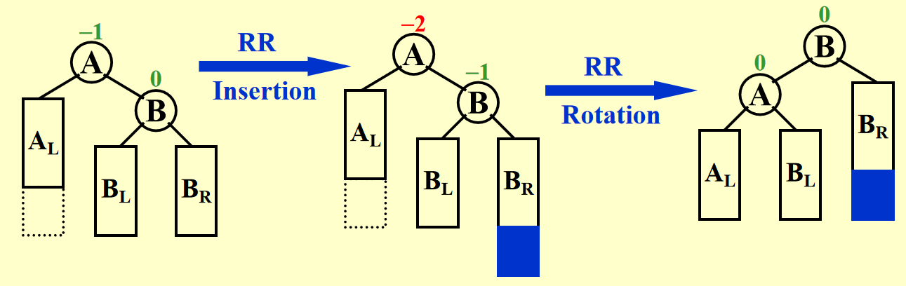
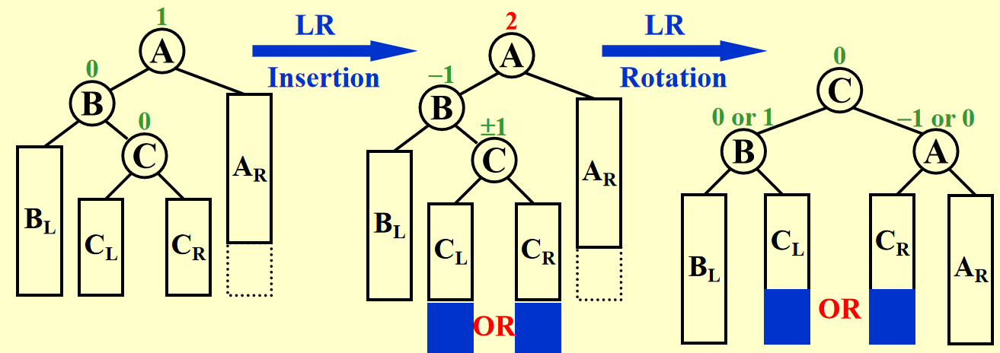
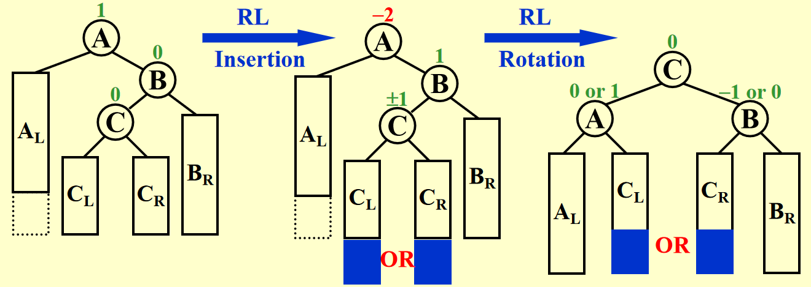
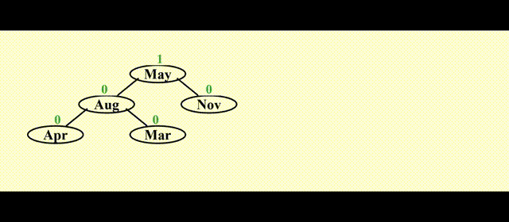
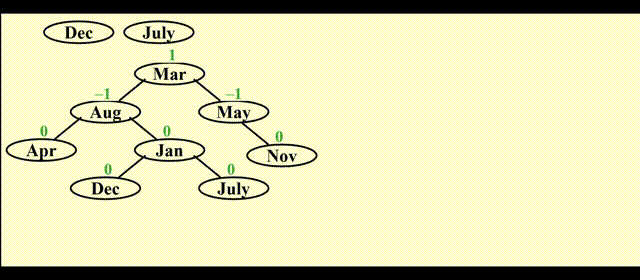
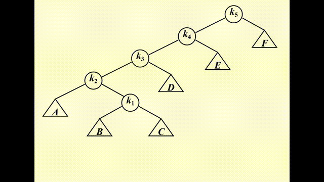
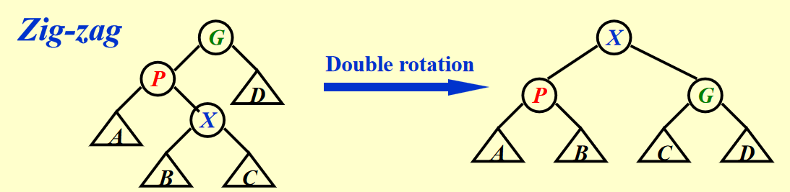
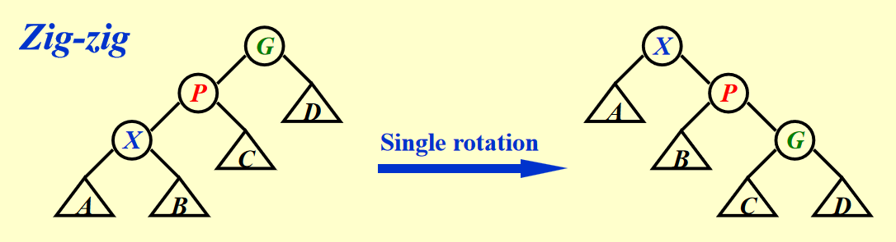
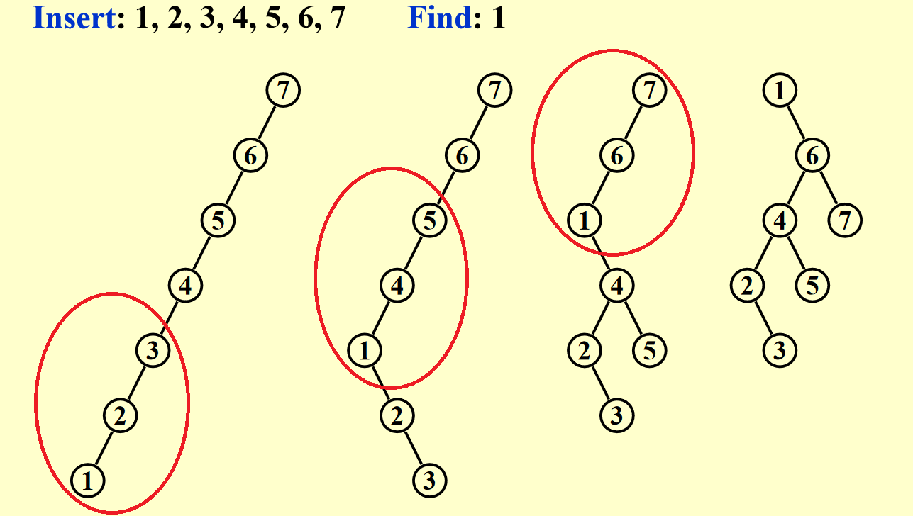
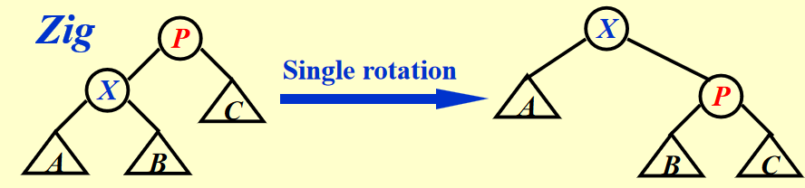

# Lec 1: AVL Tress, Splay Trees and Amortized Analysis

!!! info "阅读前须知"

    课上听得云里雾里的，光看 PPT 很难理解 AVL 树等知识。所以我主要参考[修佬的笔记]()以及课本（PPT 给出的 Reference），辅以 PPT。

    肯定有些地方是没理解到位或者表述错误的，请狠狠地指出来~

!!! warning "提醒"

    不论是 AVL 树，还是 Splay 树，它们的原型还是**二叉查找树**，具备二叉查找树的所有性质。

## AVL Trees

!!! info "引入"

    在 FDS 的学习中，我们知道：如果对一棵二叉查找树进行多次增删操作，有可能破坏二叉树的平衡性，从而降低查找效率。最糟糕的情况是将一组节点按照升/降序插入，这样的话二叉树就会退化成一个链表，时间复杂度相应地从 $O(\log N)$ 降到 $O(N)$。

    为了提升二叉查找树的查找效率，我们需要保证整棵树的平衡性，AVL 树便是其中一种不错的解决之道。

!!! note "定义"

    空的二叉树被认为是平衡的。如果树 $T$ 有左右子树 $T_L$ 和 $T_R$，那么满足下列条件的树 $T$ 才是平衡的：

    - $T_L$ 和 $T_R$ 是平衡的
    - $|h_L - h_R| \le 1$，其中 $h_L$ 和 $h_R$ 分别是 $T_L$ 和 $T_R$ 的高度

    AVL 树的每个节点都有一个**平衡因子**(balance factor) $BF(node) = h_L - h_R$。根据上面的定义知，它的取值仅有 -1, 0 或 1。

!!! note "AVL 树的高度"

    一棵高度为 $h$的最小节点的平衡树应该长这个样子： 

    <div style="text-align: center">
    
    </div>

    由 AVL 树的定义，不难得出关于 AVL 的最小节点数 $n_h$ 和树高 $h$ 相关的递推关系式（与斐波那契数列很像）：

    $$
    n_h = \begin{cases}n_{h - 1} + n_{h - 2} + 1 & \mathrm{if}\ h > 1\\ 2 & \mathrm{if}\ h = 1\\ 1 & \mathrm{if}\ h = 0\end{cases}
    $$

    事实上，$n_h = F_{h + 3} - 1(h \ge -1)$。而斐波那契数 $F_h \approx \dfrac{1}{\sqrt{5}}(\dfrac{1 + \sqrt{5}}{2})^i$，所以：

    $$
    n_h  \approx \dfrac{1}{\sqrt{5}}(\dfrac{1 + \sqrt{5}}{2})^{h+3} - 1
    $$

    因而高度 $h = O(\log n)$

 
AVL 树的核心操作在于：每次插入或删除一个节点之后，都要检查一下这次操作是否会破坏原来二叉树的平衡性，

- 如果没有被破坏，那么就 OK 了
- 如果被破坏了：
    - 先找到离被操作节点（被称为 trouble maker）**最近**（或者说最深的）的 $|BF(tf)| > 1$的节点 tf（也就是 trouble finder）
    - 然后通过**「旋转」**(rotate)的方法，将其旋转到合适的位置，使得以 tf 为根节点的子树是一棵合法的 AVL 树

!!! info "注"

    如果有多个 trouble finder，我们只要关注那个离 trouble maker 最近的节点即可，因为只要当以它为根节点的子树恢复为一棵 AVL 树，以它的祖先节点为根节点的树自然也变回 AVL 树。

旋转的具体操作与插入节点(trouble maker)的位置有密切的关系，共分为四种情况：

- LL：插入的位置位于 trouble finder 的左孩子的左子树上
- RR：插入的位置位于 trouble finder 的右孩子的右子树上
- LR：插入的位置位于 trouble finder 的左孩子的右子树上
- RL：插入的位置位于 trouble finder 的右孩子的左子树上

其中前两种情况和后两种情况分别是镜像对称的，也就是说本质上只有两种不同的旋转方法需要讨论，其中前两种的方法被称为「单旋」(single rotation)，后两种的方法被称为「双旋」。下面将详细介绍这两种旋转方法。

### LL & RR

先分析 LL：

!!! play "过程演示"

    === "初始状态"

        <figure style=" width: 60%" markdown="span">
            
            
            <figcaption></figcaption>
        </figure>

        可以看到，trouble maker（用红色阴影标记，因为不清楚其具体的位置，但它一定在整棵树最深的位置上）在 trouble finder（用橙色标出）的左孩子的左子树上。

        >注：图画的稍微有点问题：右子树应当和左孩子的右子树高度一致，但这里画的有点不准，请见谅！

    === "旋转 ing"

        <figure style=" width: 60%" markdown="span">
            
            
            <figcaption></figcaption>
        </figure>

        如何实现「旋转」：

        - 从初始状态中可以看出，trouble finder 的左孩子的左子树太高了，而 trouble finder 的右子树较矮，因此我们希望“降低”左边的高度，而“提高”右边的高度
        - 所以，选择 trouble finder 的左孩子作为新树的根节点（用橙色阴影标出，以下称为 NR），而 trouble finder 则成为它的右孩子
        - 而 NR 原来的右孩子则由 trouble finder 接管，成为它的左子树（红色实线表示删除的边，绿色虚线表示新增的边）
        - 如图蓝色箭头所示，为了让新树更加美观，应当将 trouble finder “**左旋**” 下来，但保持这些节点或子树的相对水平位置不变（这样维持了二叉查找树的性质）

    === "结果"

        <figure style=" width: 60%" markdown="span">
            
            
            <figcaption></figcaption>
        </figure>

??? info "PPT 给出的左旋示意图"

    <div style="text-align: center">
    
    </div>

有了上面的图示，理解起来应该不算困难。所以 RR 部分的演示我就省略了<span class="heimu">（其实是我懒得画了x）</span>，直接从 PPT 上截下图片（风格上与我的有很大差异，但是只要理解了上面的 LL，这张图应该还算比较容易理解的）：

<div style="text-align: center">

</div>

一句话总结：LL 用**左旋**，RR 用**右旋**。


### LR & RL

这两种情况稍微复杂一些，因为仅靠一次旋转是无法恢复树的平衡的，需要转两次（double rotation）才能成功。而且双旋需要关注三个节点（trouble finder、带 trouble maker 的孩子节点和孙子节点）（单旋不需要关注孙子节点）。下面将以 LR 为例介绍双旋的过程：

!!! play "过程演示"

    !!! bug "注意"

        第 2 步和第 4 步的蓝色箭头画反了，所以不要管那个蓝色箭头！

    === "初始状态"

        <figure style=" width: 60%" markdown="span">
            
            
            <figcaption></figcaption>
        </figure> 

        trouble maker 的具体位置并不重要。

    === "先「右旋」"

        <figure style=" width: 60%" markdown="span">
            
            
            <figcaption></figcaption>
        </figure> 

        首先，通过右旋交换孙子节点（黄色）和它的父亲（橙色）的位置<span class="heiti">（倒反天罡 bushi）</span>。


    === "中间结果"

        <figure style=" width: 60%" markdown="span">
            
            
            <figcaption></figcaption>
        </figure> 

    === "后「左旋」"

        <figure style=" width: 60%" markdown="span">
            
            
            <figcaption></figcaption>
        </figure> 

        然后，通过左旋交换原来的孙子节点（现在是子节点）与 trouble maker（红色）的位置。

    === "最终结果"

        <figure style=" width: 60%" markdown="span">
            
            
            <figcaption></figcaption>
        </figure>

??? note "来自 PPT 的 LR 过程"

    <div style="text-align: center">
    
    </div>

RL 的旋转方法与之类似，只要做一个镜像变换即可，这里也省略具体过程了，仅贴上一张 PPT 的图片：

<div style="text-align: center">

</div>

???+ example "例子"

    === "LR"

        <div style="text-align: center">
        
        </div>

    === "RL"

        <div style="text-align: center">
        
        </div>

!!! abstract "总结"

    个人认为只要记住两种旋转方法的具体步骤（**增加/删除边**和**变换节点的父子关系**）即可，不必记住旋转的方向（很容易搞混的，还是不记方向为妙）。

!!! note "关于删除"

    我们就不详细讨论AVL树的删除了，仅仅简单讲几句：

    - 先按照普通二叉查找树的删除方法进行删除
    - 这一过程中子树的高度发生变化，很有可能破坏AVL树的平衡性，这时需要通过上面讲到的旋转方法使其再次回到平衡状态
    - 但如果运气差一点的话，旋转完一次还不够，因为这可能破坏了其他子树的平衡，因此需要再次旋转，直至整棵树平衡
    - 最坏的情况是从叶子结点一直旋转，直到根节点为止，时间复杂度为$O(\log N)$

### Implementation by Code

!!! question "节点应该存什么字段"

    有两种做法：存储节点的**高度**，或者存储节点的**平衡因子 bf**，它们各有优劣：

    - 高度：简单、清晰；但是如果树过高，占用内存空间较大
    - 平衡因子：只需要存三个值，节省内存空间；但是不太便于理解

    我们现在不会遇到很高的 AVL 树，所以下面的代码实现使用前者。

??? code "代码实现（摘自教材）"

    ``` c title="声明"
    #ifndef _AvlTree_H

    struct AvlNode;
    typedef struct AvlNode *Position;
    typedef struct AvlNode *AvlTree;

    AvlTree MakeEmpty(AvlTree T);
    Position Find(ElementType X, AvlTree T);
    Position FindMin(AvlTree T);
    Position FindMax(AvlTree T);
    AvlTree Insert(ElementType X, AvlTree T);
    AvlTree Delete(ElementType X, AvlTree T);
    ElementType Retrieve(Position P);

    #endif /* _AvlTree_H */

    // Place in the implementation file
    struct AvlNode {
        ElementType Element;
        AvlTree Left;
        AvlTree Right;
        int Height;
    } 
    ```

    ``` c title="计算高度"
    static int Height(Position P) {
        if (P == NULL) 
            return -1;
        else 
            return P->Height;
    }
    ```

    ``` c title="插入节点"
    AvlTree Insert(ElementType X, AvlTree T) {
        if (T == NULL) {
            // Create and return a one-node tree
            T = (AvlTree)malloc(sizeof(struct AvlNode));
            if (T == NULL) {
                FatalError("Out of space!!!");
            } else {
                T->Element = X;
                T->Height = 0;
                T->Left = T->Right = NULL;
            }
        } else if (X < T->Element) {
            T->Left = Insert(X, T->Left);
            if (Height(T->Left) - Height(T->Right) == 2)
                if (X < T->Left->Element)
                    T = SingleRotateWithLeft(T);
                else
                    T = DoubleRotateWithLeft(T);
        } else if (X > T->Element) {
            T->Right = Insert(X, T->Right);
            if (Height(T->Right) - Height(T->Left) == 2)
                if (X > T->Right->Element)
                    T = SingleRotateWithRight(T);
                else
                    T = DoubleRotateWithRight(T);
        }
        // Else X is in the tree already; we'll do nothing

        T->Height = Max(Height(T->Left), Height(T->Right)) + 1;
        return T;
    }
    ```

    ``` c title="左旋"
    static Position SingleRotateWithLeft(Position K2) {
        // K2: trouble finder
        // K1: the left son of K1

        Position K1;          

        K1 = K2->Left;
        K2->Left = K1->Right;
        K1->Right = K2;

        K2->Height = Max(Height(K2->Left), Height(K2->Right)) + 1;
        K1->Height = Max(Height(K1->Left), K2->Height) + 1;

        return K1;
    }
    ```

    ``` c title="右旋"
    static Position SingleRotateWithRight(Position K2) {
        // K2: trouble finder
        // K1: the right son of K1

        Position K1;          

        K1 = K2->Right;
        K2->Right = K1->Left;
        K1->Left = K2;

        K2->Height = Max(Height(K2->Left), Height(K2->Right)) + 1;
        K1->Height = Max(Height(K1->Right), K2->Height) + 1;

        return K1;
    }
    ```

    ``` c title="LR 双旋"
    static Position DoubleRotateWithLeft(Position K3) {
        // 先右旋 touble finder 的左孩子
        K3->Left = SingleRotateWithRight(K3->Left);

        // 再左旋 trouble finder 自身
        return K3 = SingleRotateWithLeft(K3);
    }
    ```

    ``` c title="RL 双旋"
    static Position DoubleRotateWithRight(Position K3) {
        // 先左旋 touble finder 的右孩子
        K3->Right = SingleRotateWithLeft(K3->Right);

        // 再右旋 trouble finder 自身
        return K3 = SingleRotateWithRight(K3);
    }
    ```


## Splay Trees

AVL 树的虽然能够始终保持树的平衡，但是它需要维护每一个节点的高度/平衡因子字段，有些麻烦。在 AVL 树的基础上发展出来的 Splay 树（伸展树）相比 AVL 树更加简单粗暴：它继承了 AVL 树的旋转操作，但是它并不维护节点的高度/平衡因子字段，因此它无法保障树的平衡性，然而它能够保证 $M$ 次操作（增删查改）的**均摊(amortized)复杂度**为 $O(M \log N)$（在 [均摊分析](#amortized-analysis) 一节再具体分析）。

Splay 树的核心操作在于：每当我们访问一个节点后，就将该节点通过 AVL 树的**旋转**方法将其放在**根节点**的位置上。

???+ example "错误示范"

    === "例1"

        单纯的左旋或右旋无法降低下面这棵树的复杂度（某些节点复杂度降低，但另外一些节点的复杂度增加了）：

        <div style="text-align: center">
        
        </div>

    === "例2"

        如果按升序插入节点之后（树退化成链表）再按升序访问每个节点，时间复杂度为$O(N)$（我们每次都要找到最底下的节点）

        <div style="text-align: center">
        
        </div>  

下面介绍正确的操作，分为 3 种情况（其中被访问的节点记作 $X$，它的父亲和祖父分别记作 $P$ 和 $G$）：

- Case 1：$P$ 是根节点 -> 旋转 $X$ 和 $P$ 即可（AVL 树的单旋）
- Case 2：$P$ 是非根节点
    - Case 2-1：**Zig-zag**（$X, P, G$ 三者不在一条直线上）-> $X$ 节点转两次（AVL 树的双旋）

    <div style="text-align: center">
    
    </div> 

    - Case 2-2：**Zig-zig**（$X, P, G$ 三者在一条直线上）-> 先转 $P$ 节点，后转 $X$ 节点

    <div style="text-align: center">
    
    </div> 

!!! play "Case 2-2 的过程演示"

    === "初始状态"

        <figure style=" width: 60%" markdown="span">
            
            
            <figcaption></figcaption>
        </figure>

    === "旋转 $P$"

        <figure style=" width: 60%" markdown="span">
            
            
            <figcaption></figcaption>
        </figure>

    === "中间结果"

        <figure style=" width: 60%" markdown="span">
            
            
            <figcaption></figcaption>
        </figure>

    === "旋转 $X$"

        <figure style=" width: 60%" markdown="span">
            
            
            <figcaption></figcaption>
        </figure>

    === "最终结果"

        <figure style=" width: 60%" markdown="span">
            
            
            <figcaption></figcaption>
        </figure>

??? example "应用"

    === "例1"

        <div style="text-align: center">
        
        </div> 

    === "例2"

        教材《数据结构与算法分析》$P_{128-131}$ 上有访问一棵 32 个节点构成的（按升序插入的，因此是一张链表）二叉树的例子，可以发现每访问一次，并将被访问的节点移到根节点上后，整棵树的高度也会渐渐降低。

!!! note "注"

    在将被访问的节点移到根节点上之后，路径上大多数节点的高度降至原来的一半左右。

!!! note "删除 Splay 树上的某个节点"

    1. 访问要删除的节点 $X$，根据规则，$X$ 将会作为整棵树的根节点
    2. 移除 $X$，这样就剩下两棵子树 $T_L$ 或 $T_R$
    3. $FindMax(T_L)$ 或者 $FindMin(T_R)$，也就是说从两棵子树中找到合适的节点，作为新树的根节点，使新树仍然保持二叉查找树的性质
    
Splay 树的复杂度涉及到均摊分析，下面将介绍这一知识点。

## Amortized Analysis

:star2:我们先来理解「均摊」这个词：

- 保证在 $N$ 个数据上的 $M$ 次运算的总体复杂度为 $O(M \log N)$
- 它考虑的是全局（所有数据）的耗时，允许某些数据的运算耗时久一些，靠在另一些数据上耗时较短的运算弥补
- 区分**最坏复杂度**，**均摊复杂度**和**平均复杂度**
    - 最坏：保证单个运算以及整体运算的复杂度不超过某一边界（边界最紧）
    - 均摊：保证整体的运算复杂度不超过某一边界，但允许某几次运算可以超过该边界（考虑数据的真实情况）
    - 平均：在给定数据分布平均的情况下（是一种理想的假设），保证整体运算的复杂度不超过某一边界（边界最松）
>注：只有平均复杂度考虑数据分布，前两者并不考虑数据的分布。

通过上面的分析，不难得出以下不等关系：

<div style="text-align: center" markdown="1">
worst-case bound $\ge$ amortized-case bound $\ge$ average-case bound
</div>

常见的均摊分析有以下几类：聚合法(aggregate method)、核算法(accounting method)、势能法(potential method)。

### Aggregate Method

Idea：均摊复杂度 = 所有操作的总时间 / 操作次数，即 $T_{amortized} = \dfrac{\sum\limits^nT_i}{n}$

??? example "例子"

    对于一个栈，创建一个 `MultiPop` 的方法：依次弹出栈内所有的元素（如果有的话），并且有限制次数 $k$

    ``` c
    Algorithm {
        while (!isEmpty(S) && k > 0) {
            Pop(S);
            k--;
        }
    }
    ```

    易知 $size(S) \le n$（$n$ 为数据总数），所以均摊复杂度 $T_{amortized} = \dfrac{O(n)}{n} = O(1)$ 


### Accounting Method

Idea：当我们的均摊成本(amortized cost) $\hat{c}_i$ 高于实际成本(actual cost) $\hat{c}_i$ 时，多出来的部分就转化为积分(credit)。如果之后的均摊成本小于实际成本时，可以用之前攒的积分抵消实际的成本（注意：不允许“均摊成本 + 积分 < 实际成本”）。公式为：

$$
T_{amortized} = \dfrac{\sum\limits^n\hat{c}_i}{n}
$$

其中 $\sum\limits^n\hat{c}_i \ge \sum\limits^n\hat{c}_i$。实际上，均摊成本是我们预先设置的值，所以在设置的时候要预估好，确保均摊总成本高于实际总成本，即积分保持非负状态。

!!! example "例子"

    接着上面 `MultiPop` 的例子，假如我们的实际成本和均摊成本分别如下：

    - $c_i$：`Push`：1，`Pop`：1，`MultiPop`：`min(sizeof(S), k)`
    - $\hat{c}_i$：`Push`：2，`Pop`：0，`MultiPop`：0

    我们可以这样理解：每次 Push 一个元素的时候，我们用两块钱执行这个只需一块钱的操作，多出来的一块钱存起来作为积分。这样的话，当我们 Pop 一个元素的时候，就不需要花钱，只要花费等价的积分即可。通过上面给出的信息不难判断，每当 Pop 一个元素的时候，我们都会有足够多的积分来消费，所以 MultiPop 的运算我们可以不花一分钱就可以完成。

    用符号语言表述：

    $$
    sizeof(S) \ge 0 \Rightarrow Credits \ge 0 \Rightarrow O(n) = \sum\limits^n\hat{c}_i \ge \sum\limits^n\hat{c}_i \Rightarrow T_{amortized} = \dfrac{O(n)}{n} = O(1)
    $$


### Potential Method

Idea：我们将核算法提到的「积分」概念转化为「势能差」概念——即 $\hat{c}_i - c_i = \Phi(D_i) - \Phi(D_{i-1})$，其中 $D_i$ 表示经历了 i 次运算后的数据结构，$\Phi(D_i)$ 表示该数据结构的**势能函数**(potential function)。经过一些转化，可以得到：

$$
\begin{align}
\sum\limits_{i = 1}^n\hat{c}_i= & \sum\limits_{i=1}^n(c_i + \Phi(D_i) - \Phi(D_{i-1})) \notag \\
= & (\sum\limits_{i=1}^nc_i) + \Phi(D_n) - \Phi(D_0) \notag
\end{align}
$$

由此看出，我们要确保始末势能差 $\Phi(D_n) - \Phi(D_0) \ge 0$，因此需要设计一个合理的势能函数。

!!! example "例子"

    还是接着 `MultiPop` 的例子，我们假定 $D_i$ 为经过 i 次操作后的栈，$\Phi(D_i)$ 表示栈的元素个数，那么易知 $\Phi(D_i) \ge 0 = \Phi(D_0)$。

    - `Push`：$\Phi(D_i) - \Phi(D_{i-1}) = (sizeof(S) + 1) - sizeof(S) = 1$
        $\Rightarrow \hat{c}_i = c_i + \Phi(D_i) - \Phi(D_{i-1}) = 1 + 1 = 2$

    - `Pop`：$\Phi(D_i) - \Phi(D_{i-1}) = (sizeof(S) - 1) - sizeof(S) = -1$
        $\Rightarrow \hat{c}_i = c_i + \Phi(D_i) - \Phi(D_{i-1}) = 1 - 1 = 0$

    - `MultiPop`：$\Phi(D_i) - \Phi(D_{i-1}) = (sizeof(S) - k') - sizeof(S) = -k'$
        $\Rightarrow \hat{c}_i = c_i + \Phi(D_i) - \Phi(D_{i-1}) = k' - k' = 0$

    $\therefore \sum\limits_{i = 1}^n\hat{c}_i = \sum\limits_{i = 1}^nO(1) = O(n) \ge \sum\limits_{i=1}^nc_i \Rightarrow T_{amortized} = \dfrac{O(n)}{n} = 1$

### Analysis for Splay Tree

结论：Splay 树的均摊复杂度为 $T_{amortized} = O(\log N)$

下面我们用**势能法**来进行势能分析。

!!! warning "注意"

    我的理解不一定准确（~~写到后面大脑都快炸开了~~）所以若分析出现问题的话，可以在下面的评论区留言指出~

!!! note "分析"

    我们假定：

    - $D_i$ = 以被访问的节点为根节点（经过变换后）的新树
    - $c_i$ = 转换过程中所需的实际成本
        - zig：$c_i = 1$
        - zig-zag & zig-zig：$c_i = 2$
    - $\Phi(T) = \sum\limits_{i \in T} \log S(i) = \sum\limits_{i \in T} R(i)$，其中 $i$ 是 $T$ 的后代，$S(i)$ 是以 $i$ 为根节点的子树的大小，将其取对数就是 $i$ 的**秩**(rank) $R(i)$

    - $R(i) \approx H(i)$（$H(i)$ 为树的高度）
    
    ??? question "为什么不用树的高度作为势能函数"
    
        因为很多子树的高度在旋转的时候会发生改变，而大小在旋转的过程中虽然也有不小的变化，但是由于取了对数，所以秩的变化就变得很小了，这便于我们的计算。

    下面我们就具体分析 Splay 树的三种情况：

    === "zig"

        <div style="text-align: center">
        
        </div>

        $$
        \begin{align}
        \hat{c}_i = & 1 + (R_2(X) - R_1(X)) + (R_2(P) - R_1(P)) \notag \\
        \le & 1 + R_2(X) - R_1(X) \notag
        \end{align}
        $$

        - 显然，在旋转前后，以 $P$ 为根节点的子树的大小变小了，因此 $R_2(P) - R_1(P) < 0$

    === "zig-zag"

        ???+ info "引理"

            如果 $a + b \le c$，且$a, b$都是正整数，则

            $$\log a + \log b \le 2 \log c - 2$$

            证明：

            - 根据算术-几何不等式 $\sqrt{ab} \le \dfrac{a+b}{2}$
            - 因此 $\sqrt{ab} \le \dfrac{c}{2}$
            - 两边平方： $ab \le \dfrac{c^2}{4}$
            - 再两边取对数，得到上述引理

        <div style="text-align: center">
        
        </div>

        $$
        \begin{align}
        \hat{c}_i = & 2 + (R_2(X) - R_1(X)) + (R_2(P) - R_1(P)) + (R_2(G) - R_1(G))\notag \\
        \le & 2(R_2(X) - R_1(X)) \notag
        \end{align}
        $$

        - 旋转前 $G$ 的大小和旋转后 $X$ 的大小相等，所以 $R_2(X) = R_1(P)$，可以相互抵消
        - 旋转后，$S(X) \ge S(P) + S(G)$，根据上面的引理知，$\log S(P) + \log S(G) \le 2 \log S(X) - 2$，即 $R_2(P) + R_2(G)\le 2 R_2(X) - 2$
        - 旋转前，$P$ 是 $X$ 的父节点，因此 $R_1(P) \ge R_1(P)$
        - 通过上述的转换和抵消，可以得到最终的不等式

    === "zig-zig"

        <div style="text-align: center">
        
        </div>

        ??? bug "错误示范"

            用和推导 zig-zag 类似的方法放缩不等式，可以得到下面的结果：

            $$
            \begin{align}
            \hat{c}_i = & 2 + (R_2(X) - R_1(X)) + (R_2(P) - R_1(P)) + (R_2(G) - R_1(G))\notag \\
            \le & 2(R_2(X) - R_1(X)) + 2\notag
            \end{align}
            $$       

            从放缩的角度看挺不错的，但是后面多出了个常数 2，而我们不知道要执行多少次 zig-zig 旋转操作，所以会带来不确定的数据，这不利于我们的精确分析。

            >上面的 zig 旋转可以带常数，是因为只有一次 zig 操作（很容易验证）。
        
        $$
        \begin{align}
        \hat{c}_i = & 2 + (R_2(X) - R_1(X)) + (R_2(P) - R_1(P)) + (R_2(G) - R_1(G))\notag \\
        = & 2 + (R_2(X) - R_1(G)) + (R_2(G) + R_1(X)) + R_2(P) - 2R_1(X) - R_1(P) \notag \\
        \le & 2R_2(X) + R_2(X) - 2R_1(X) - R_1(X)\notag \\
        \le & 3(R_2(X) - R_1(X)) \notag
        \end{align}
        $$

        - 旋转后的 X 的大小 = 旋转前的 G 的大小，所以两者对应的秩相抵消
        - 观察旋转前的 X 子树和旋转后的 G 子树，不难发现它们加起来的大小 $\le$ 旋转后的 X 树的大小，所以再次用到上面的引理，可以得到 $R_2(G) + R_1(X) \le 2R_2(X) - 2$
        - $R_2(P) \le R_2(X), R_1(P) \ge R_1(X)$，所以最后部分进行简单的放缩
        - 最终我们得到了正确的不等式


!!! abstract "结论"

    最后，我们将这三部分并起来，得到最终的均摊成本。但在此之前，我们需要进一步的放缩，便于后续计算：

    $$
    \begin{align}
    \hat{c}_{zig} & \le 1 + 3(R_2(X) - R_1(X)) \notag \\
    \hat{c}_{zig-zag} & \le 3(R_2(X) - R_1(X)) \notag \\
    \hat{c}_{zig-zig} & \le 3(R_2(X) - R_1(X)) \notag \\
    \end{align}
    $$

    将所有旋转操作对应的均摊成本加起来：

    $$
    \begin{align}
    \hat{c}_X & = \hat{c}_{zig} + \sum \hat{c}_{zig-zag} + \sum \hat{c}_{zig-zig} \notag \\
    & = O(1) + 3(R_2(X) - R_1(X)) \notag \\
    & = O(\log N) \notag
    \end{align}
    $$

这样，我们成功证明了 Splay 树的均摊复杂度。


