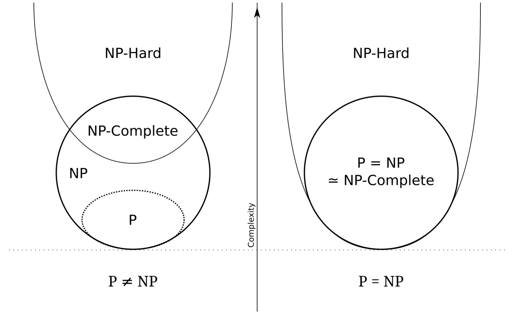
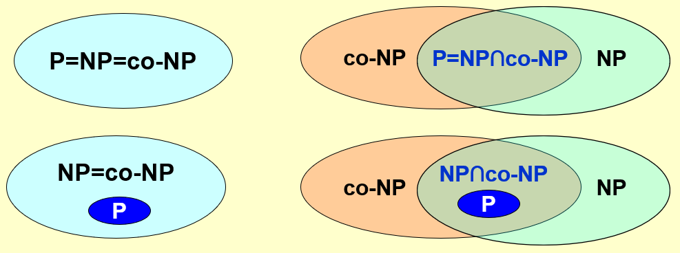
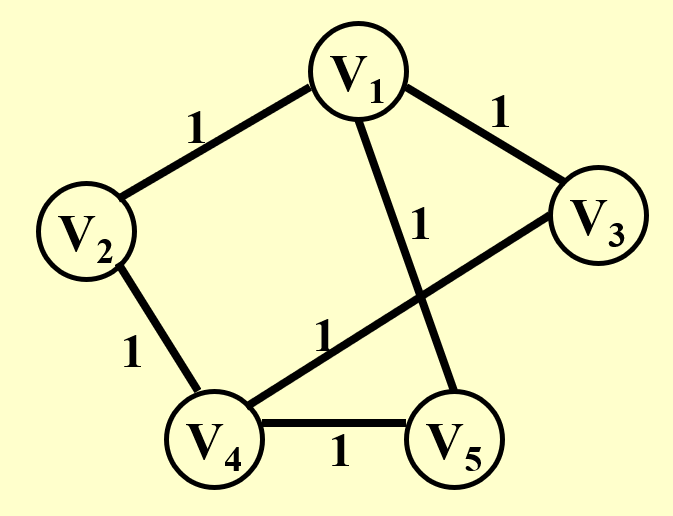
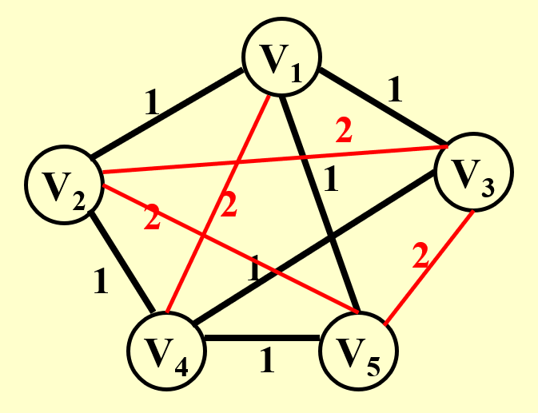

# Lec 10: P/NP Problems

!!! info "注"

    这块内容更是困难，虽然只是学NP完全问题的皮毛，但还是学得云里雾里，缺乏自己的思考，所以不要过分信赖本笔记所记的内容。

    【12.26更新】对笔记结构进行了较大的调整，补充了新的理解和认识，但碍于数理基础薄弱，现在还是一头雾水（悲）。

## Introduction

???+ info "引入"

    先来看一些在FDS课程中介绍过的图论问题：

    - [欧拉环问题](../fds/9.md#euler-circuits)：找到一条包含所有不重边的路径
    - [哈密顿环问题](../fds/9.md#euler-circuits)（链接所指小节的最后）：找到一条包含所有不重顶点的路径
    - [单源无权最短路问题](../fds/9.md#Shortest-Path-Algorithms)
    - 单源无权最长路问题

    其中，第一和第三个问题较为容易解决；但第二和第四个问题看起来和它们上面的题目差不多，但实际上很难解决，且目前已知的算法的时间复杂度均超过了多项式(polynomial)级时间。

对于规模为$N$的数据，

- 最简单的问题：时间复杂度为$O(N)$
- 最困难的问题：根本没法用渐进符号衡量，这一类问题称为**不可判定问题**(undecidable problem)

???+ info "历史背景"

    [大卫·希尔伯特](https://en.wikipedia.org/wiki/David_Hilbert)(David Hilbert)在1900年提出了23个数学问题，其中一个问题便是**判定性问题**(decidability)：是否（至少在理论上）存在一个能够判定所有数学问题的确定的方法或过程？

    [库尔特·哥德尔](https://en.wikipedia.org/wiki/Kurt_G%C3%B6del)(Kurt Gödel)在1931年证明：不是所有的从公理系统推理出来的真命题都能被证明出来，也就是说我们可能永远不知道所有命题，也永远无法证明所有已知的命题（[哥德尔不完备定理](https://en.wikipedia.org/wiki/G%C3%B6del%27s_incompleteness_theorems)）。


## Computational Model

### Halting Problem

!!! question "问题描述"

    [停机问题](https://en.wikipedia.org/wiki/Halting_problem)(halting problem)：是否存在一个程序P，它能够判断自身能在有限时间内结束或陷入死循环？

不行！下面给出证明：

???+ proof "证明"

    假设存在一个用于检查停机的程序（如下所示），那么它应该也能够用于检查其自身。

    ```c
    // When 'code' can terminate in finite time for input 'data'
    // the function will return true, otherwise return false
    bool halts(code, data);

    void CheckIfHalt(f_code) {
        if (halts(f_code, f_code)) {  
            while (true) { /*empty*/ }  // infinite loop
        }
        else {                        
            return;                     // terminate
        }
    }
    ```

    当调用`CheckIfHalt(CheckIfHalt)`时会发生什么？

    - 若该程序能够在有限时间内终止（即`halts(CheckIfHalt, CheckIfHalt) == true`） -> 程序进入`if`分支 -> 陷入死循环
    - 若该程序陷入死循环（即`halts(CheckIfHalt, CheckIfHalt) == false`） -> 程序进入`if`分支 -> 程序中止

    因此出现了这一自相矛盾的结果，也就说明不存在一个能够检查任意程序是否在有限时间内中止的程序。所以停机问题是一个**不可判定**(non-deterministic)问题。

    ??? code "cy的PPT上给出的代码（~~我没看懂，所以藏了起来~~）"

        ```c
        Loop(P) {
            if (P(P) loops)
                print(YES);
            else
                infinite_loop();
        }
        ```


### Turing Machine

>关于[阿兰·图灵](https://www.turing.org.uk/)

[图灵机](https://en.wikipedia.org/wiki/Turing_machine)(Turing machine)是与NP问题密切相关的一种计算理论模型，它用来模拟任何能够被数学家用算术方法来完成的计算（假设这个“数学家”有无穷的时间、精力、纸和笔，并且完全投入于计算工作）。

图灵机的组成部分：

- **无限的内存**：1条一维的纸带，被分为多个单元，每个单元存储一个符号（数据）
- **扫描器**(scanner)/读写头：一个有限状态控制器，控制头根据当前状态以及控制头指向的符号来决定如何移动（指令）
- 图灵机的状态是一个有限集合，每个状态都有一个转移函数，转移函数的输入是当前状态和当前格子上的符号，输出是下一个状态、下一个格子上的符号和读写头的移动方向 

图灵机的运算过程：

- 改变有限控制状态
- 擦除当前被控制头指向的单元上的符号，并写入新的符号
- 移动控制头（向左移(L)、向右移(R)或保持原位(S)），注意扫描器的每个控制头在每个状态下只能指向一个单元，并且每次最多移动一个单元

<div style="text-align: center">
    
</div>

图灵机的种类：

- **确定型(deterministic)图灵机**：它能够在每个阶段执行一条指令，随后根据当前指令的内容来选择下一条要进行的唯一的指令。
- [**非确定型(nondeterministic)图灵机**](https://en.wikipedia.org/wiki/Nondeterministic_Turing_machine)：它根据一个有限集合来自由选择下一步要执行的指令。并且若执行时存在能够找到解的步骤，那么它一定能够选择得到此解的正确指令。
    - 它可以对所有的可判定问题给出决策，但无法解决不可判定问题。


## Definition

!!! note "P/NP问题的相关概念"

    以下问题都是**可判定(deterministic)问题**。

    - [**P**](https://en.wikipedia.org/wiki/P_(complexity))(polymonial-time，多项式时间)：确定性图灵机在多项式时间内能够解决的问题。
    - [**NP**](https://en.wikipedia.org/wiki/NP_(complexity))(nondeterministic polynomial-time，非确定型多项式时间)：**确定性**图灵机在多项式时间内能够**验证**解的正确性的问题，或者**非确定性**图灵机在多项式时间内能够**解决**的问题。
        - 举例：我们很容易证明哈密顿环的解（只要遍历图上的所有点即可，所以是线性复杂度的），因此它是一个NP问题
        - 不是所有的可判定问题都是NP问题
            - 举例：还是以哈密顿环为例，虽然可以多项式时间内确定一张图存在哈密顿环，但是无法在多项式时间内证明一张图没有哈密顿环（不要问我，我也没搞懂，希望得到大神的点拨orz）
        - 所以，$P \subseteq NP$
        - 但我们不知道是否满足关系$P \subset NP$，即$P$与$NP$是否相等，这仍然是未解决的[七大难题](https://en.wikipedia.org/wiki/Millennium_Prize_Problems)之一。

    - [**NPH**](https://en.wikipedia.org/wiki/NP-completeness)(NP Hard, NP困难问题)：如果问题A可以被[**归约**](https://en.wikipedia.org/wiki/Reduction_(complexity))(reduce)到问题B，那么问题B更难，并且若问题A是一个NP问题，那么问题B是一个**NP困难问题**

    - [**NPC**](https://en.wikipedia.org/wiki/NP-completeness)(NP Complete, NP完全问题)：<u>NP问题</u>中最难的决定性问题，满足性质：**任何NP问题能够在多项式时间内被归约(reduce)到NP完全问题**
        - 换句话说，如果我们能够在多项式时间内解决**任何一个**NP问题，那么我们就能在多项式时间内解决**所有**NP问题，此时意味着$P = NP$
        - $\text{NPC} = \text{NP} \cap \text{NP Hard}$
        - 第一个被证明是NP完全问题的问题是[可满足性问题](https://en.wikipedia.org/wiki/Satisfiability)(Circuit-SAT)：输入一个布尔表达式，询问是否存在一种变量的赋值，使得整个表达式的值为1。因此任何NP问题都可以在多项式时间内被转化至可满足性问题（可以在非确定型图灵机中用多项式时间来解决这个问题）。
        - 注意：即使知道问题A是NPC问题，且问题A可以归约到问题B，那么也不能说明问题B是NPC问题。因为我们不清楚B是不是NP问题，即使是的话也只能说明B是NP Hard，即只能确定B的难度不低于A，而无法判断B是不是NPC问题，准确的判断依据是上述的性质。

!!! abstract "总结：P、NP、NP完全、NP困难问题之间的关系"

    <div style="text-align: center">
        
    </div>

**归约**(reduction)过程的符号化语言表述：给定任何一个实例$\alpha \in$问题$A$

- 如果我们能够找到一个程序$R(\alpha) \rightarrow \beta \in$问题$B$，满足$T_R(N) = O(N^{k1})$
- 且能通过另一个程序$D(\beta)$在$O(N^{k2})$得到解
- 且对于$\beta$的解等同于对$\alpha$的解，那么：

<div style="text-align: center">
    
</div>

???+ info "启示"

    对于一个[优化问题](9.md#Introduction)一般会有两种版本的问法：

    - 一般版本：需要做出完整的回答
    - 决策版本：只需回答Yes or No

    比如求最短路问题时，一般版本的问法是求顶点u和v之间的最短路；而决策版本的问法是求顶点u和v之间是否存在至多k条边的路径。显然后者更容易回答，且后者是可以等价前者的（因为解决第二个问题的最小的k便是第一个问题的回答）。

    所以，如果直接解决问题有些吃力的话，不妨将其转化为决策版本，这能成为我们解决问题的垫脚石。


## Formal Language

[**形式语言**](https://en.wikipedia.org/wiki/Formal_language)(formal language)：可以被精确的数学或机器处理的公式定义的语言（或可以理解为编码）。

在探讨形式语言时，我们将问题分为两类：**抽象问题**(abstract probelm)和**具体问题**(concrete problem)。

- 抽象问题$Q$是一个关于集合$I$（表示问题**实例**(instance)）和集合$S$（表示问题的**解**(solution)）的一个二元关系。
- 具体问题实际上是对抽象问题的一种**编码**(encoding)——将$I$映射到一个位串上（用$\{0, 1\}^*$表示），$Q$就变成了具体问题

??? example "例子"

    - 最短路问题($\text{SHORTEST-PATH}$)：
        - $I = \{<G, u, v>: G = (V, E) \text{ is an undirected graph; }u, v \in V\}$
        - $S = \{<u, w_1, w_2, \dots, w_k, v>: <u, w_1>, \dots, <w_k, v> \in E\}$
        - 则$\forall i \in I, \text{SHORTEST-PATH}(i) = s \in S$

    - 路径决策问题($\text{PATH}$)：
        - $I = \{<G, u, v, k>: G = (V, E) \text{ is an undirected graph; }u, v \in V; k \ge 0 \text{ is an integer}\}$
        - $S = \{0, 1\}$
        - 则$\forall i \in I, \text{PATH}(i) = 1 \text{ or } 0$

形式语言的正式定义：

- 字母表$\Sigma$表示一个有限符号集
- **语言**$L$表示由$\Sigma$中的字符构成的字符串集（$\Sigma$的子集）
    - 语言代表的是一个**可判定问题**
- 记空字符串为$\varepsilon$，空语言为$\emptyset$
- 包含所有字符串的语言记作$\Sigma^*$
- $L$的**补**(complement)记作$\overline{L} = \Sigma^* - L$
- $L_1$和$L_2$的**拼接**(concatation)为$L = \{x_1x_2: x_1 \in L_1 \wedge x_2 \in L_2\}$
- $L$的克莱尼闭包(Kleene closure)为$L^* = \{\varepsilon\} \cup L \cup L^2 \cup L^3 \cup \dots$，其中$L^k$表示连续拼接$k$个$L$

在决策问题中，$\Sigma = \{0, 1\}$（即01位串）， $L = \{x \in \Sigma^*: Q(x) = 1\}$。

### P

- 若$A(x) = 1$，称算法$A$**接受**了字符串$x \in \{0, 1\}^*$；若$A(x) = 0$，称算法$A$**拒绝**了字符串$x$
- 如果$L$的**每一个**位串都能够被算法$A$接受或拒绝，称语言$L$能够被算法$A$**判定**

因此**P类问题**可以用形式语言表述为：

$$
P = \{L \subseteq \{0, 1\}^* \}: \text{ there exists an algorithm }A \text{ that }\mathbf{decides }\ L \text{ in polynomial time} 
$$

### NP

- **验证算法**(verification algorithm)是一个有两个参数的算法，第一个参数是一个输入字符串$x$，另一个参数是一个位串$y$，称为**证书**(certificate)（其实就是问题的解）
    - 如果对于输入字符串$x$，存在证书$y$，使得$A(x, y) = 1$成立，则称$A$能够验证$x$
    - 如果对于$L = \{x \in \{0, 1\}^*\}$里的每个$x$，存在$y \in \{0, 1\}^*$使得$A(x, y) = 1$成立，则称验证算法$A$能够验证语言$L$

??? example "例子"

    对于SAT问题，令$x = (\overline{x_1} \vee x_2 \vee x_3) \wedge (x_1 \vee \overline{x_2} \vee x_3) \wedge (x_1 \vee x_2 \vee x_4) \wedge (\overline{x_1} \vee \overline{x_3} \vee \overline{x_4})$，那么证书$y = \{x_1 = 1, x_2 = 1, x_3 = 0, x_4 = 1\}$

所以，语言$L$为**NP问题**的充要条件为：存在一个多项式复杂度的双参数算法$A$和一个常数$c$，使得$L = \{x \in \{0, 1\}^*: \text{ there exists a certificate }y \text{ with }|y| = O(|x|^c) \text{ such that } A(x, y) = 1\}$，我们称算法$A$能够在多项式时间内验证$L$的解的正确性。

### NP Complete

假如已知$L \in NP$，那么我们是否能够得出$\overline{L} \in NP$的结论（这类问题称为[**co-NP问题**](https://en.wikipedia.org/wiki/Co-NP)（反NP问题））呢？目前有以下四种猜想：

<div style="text-align: center">
    
</div>

如果存在多项式复杂度的可计算的函数$f: \{0, 1\}^* \rightarrow \{0, 1\}^*$，$\forall x \in \{0, 1\}^*$，$x \in L_1$的充要条件为$f(x) \in L_2$，则称语言$L_1$是可以多项式时间内归约为语言$L_2$的，记为$L_1 \le_P L_2$（$L_1$的难度不大于$L_2$），称$f$为**归约函数**(reduction function)，称计算$f$的多项式时间算法$F$为**归约算法**(reduction algorithm)。

现在可以用形式语言描述**NP完全问题**：如果满足下列条件，称语言$L \subseteq \{0, 1\}^*$为NP完全问题：

- $L \in NP$，且
- $\forall L' \in NP, L' \le_P L$

???+ note "一些结论"

    - 若$L_1 \le_P L_2$，且$L_2$是NP问题，那么$L_1$也是NP问题
        - 因为$L_2$的解可以在多项式时间内被验证，由于$L_1$的难度不高于$L_2$，因此$L_1$的解可以在多项式时间内被验证，所以$L_1$是NP问题

## Examples

### HCP to TSP

!!! question "问题描述"

    这里给出一个NP完全问题的经典例子：我们知道哈密顿环问题(HCP)是NP完全问题，请证明**旅行商问题**(traveling salesman problem, TSP)也是一个NP完全问题。

    - 哈密顿环问题：给定一张图$G = (V, E)$，是否存在一个经过所有顶点的简单环？
    - 旅行商问题：给定一张**完全图**$G = (V, E)$，每条边都有一个成本，那么是否存在一个经过所有顶点的环，且保证总成本$\le K$（$K$为整数）

??? proof "证明"

    - 因为TSP的解能够在多项式时间内得到检验（遍历所有的点和边），因此TSP是一个NP问题
    - 左图表示的是图$G$，显然存在一个哈密顿环；右图表示的是图$G'$（在图$G$基础上添加了成本为2的边），它是一张完全图，且满足$K = |V|$，其中$|V|$为顶点数

    <div style="text-align: center">
        
        
    </div>

    - 现在需要证明的是：$G$有一个哈密顿环的充要条件是$G'$有一个旅行商环，满足总成本为$|V|$
        - 充分性证明：按从左往右的顺序看上面两张图，这个充分条件是自然成立的
        - 必要性证明：按从右往左的顺序看上面两张图，旅行商环显然只经过成本为1的边，那么可以直接去掉红色的边得到图$G$，图$G$便保留了这个旅行商环，即哈密顿环


    综上，TSP也是一个NP完全问题。这符合NP完全问题的性质：HCP这个NP完全问题能够归约到另一个NP完全问题TSP上，且任何能够归约到HCP的NP完全问题，也能归约到TSP。

### CP to VCP

!!! question "问题描述"

    假设我们已经知道**团问题**(clique problem)是NP完全问题，请证明**顶点覆盖问题**(vertex cover problem)也是NP完全问题。

    - 团问题：给定无向图$G = (V, E)$和整数$K$，$G$是否存在一个（至少）包含$K$个顶点的**完全子图（团）**
    - 顶点覆盖问题：给定无向图$G = (V, E)$和整数$K$，$G$是否存在一个顶点子集$V' \subseteq V$，使得$|V'| \le K$且$G$中的每条边上至少有一个顶点被包含在$V'$中（顶点覆盖）

???+ proof "证明"

    先用抽象问题来描述：

    - $\text{CLIQUE} = \{<G, K>:\ G \text{ is a graph with a clique of size }K\}$
    - $\text{VERTEX-COVER} = \{<G, K>:\ G \text{ has a vertex cover of size }K\}$

    我们需要证明两件事：

    - $\text{VERTEX-COVER} \in NP$：
        - $\forall x = <G, K>$，令证书$y$为顶点子集$V' \subseteq V$
        - 归约算法为：
            - 检查是否满足$|V'| = K$
            - 检查是否$\forall \text{edge } (u, v)$，使得$u \in V'$或$v \in V'$
            - 时间复杂度：$O(N^3)$（遍历所有边（$N^2$）$\times$每条边至少检验其中一点是否在$V'$内（$N$））

    - $\text{CLIQUE} \le_P \text{VERTEX-COVER}$，即证$G$有一个大小为$K$的**团**的充要条件为$\overline{G}$有一个大小为$|V| - K$的**顶点覆盖**
        - 充分性：
            - 令$(u, v)$为$\overline{E}$上的任意一边，可以得到以下结论
            - $u, v$中至少有一点不属于$V'$，且至少有一点属于$V - V'$
            - 每条在$\overline{G}$内的边，它的一个顶点在$V - V'$内
            - 因此大小为$|V| - K$的集合$V - V'$构成了$\overline{G}$的一个顶点覆盖
        - 必要性：
            - $\forall u, v \in V$，如果$(u, v) \notin E$，那么$u \in V'$或$v \in V'$，或两者皆满足
            - $\forall u, v \in V$，如果$u \notin V'$且$v \notin V'$，则$(u, v) \in E$
            - 所以$V - V'$是一个大小为$|V| - |V'| = K$的团

### SAT 

>懒得写了...

- 3-SAT：k个子句的合取（$\wedge$），每个子句是3个变量（或其否定）构成的析取（$\vee$）。形如：

    $$
    (x_1 \vee \neg x_2 \vee x_4) \wedge (x_2 \vee x_3 \vee \neg x_4) \wedge (\neg x_1 \vee \neg x_3 \vee x_4)
    $$

- 2-SAT：与3-SAT类似，唯一区别在于每个子句是2个变量的析取。

相关资料：[SAT](https://en.wikipedia.org/wiki/Boolean_satisfiability_problem#3-satisfiability)

