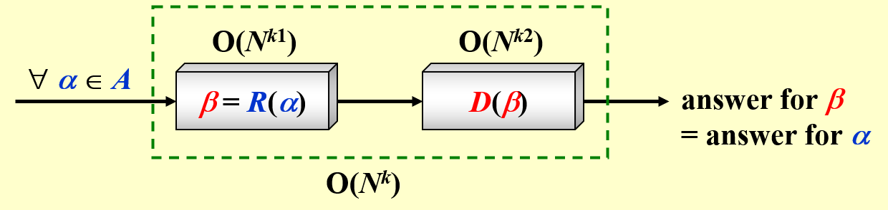

# Lec 10: NP-Completeness

!!! info "注"

    这块内容更是困难，虽然只是学NP完全问题的皮毛，但还是学得云里雾里，缺乏自己的思考，所以不要过分信赖本笔记所记的内容。

## Definition

???+ info "引入"

    先来看一些在FDS课程中介绍过的图论问题：

    - [欧拉环问题](../fds/9.md#euler-circuits)：找到一条包含所有不重边的路径
    - [哈密顿环问题](../fds/9.md#euler-circuits)（链接所指小节的最后）：找到一条包含所有不重顶点的路径
    - [单源无权最短路问题](../fds/9.md#Shortest-Path-Algorithms)
    - 单源无权最长路问题

    其中，第一和第三个问题较为容易解决；但第二和第四个问题看起来和它们上面的题目差不多，但实际上很难解决，且目前已知的算法的时间复杂度均超过了多项式(polynomial)级时间。

对于规模为$N$的数据，

- 最简单的问题：时间复杂度为$O(N)$
- 最困难的问题：根本没法用渐进符号衡量，这一类问题称为**不可判定问题**(undecidable problem)

???+ info "历史背景"

    [大卫·希尔伯特](https://en.wikipedia.org/wiki/David_Hilbert)在1900年上提出了23个数学问题，其中一个问题便是**判定性问题**(decidability)：是否（至少在理论上）存在一个能够判定所有数学问题的确定的方法或过程？

    [库尔特·哥德尔](https://en.wikipedia.org/wiki/Kurt_G%C3%B6del)在1931年证明：不是所有的从公理系统推理出来的真命题都能被证明出来，也就是说我们可能永远不知道所有命题，也永远无法证明所有已知的命题（[哥德尔不完备定理](https://en.wikipedia.org/wiki/G%C3%B6del%27s_incompleteness_theorems)）。

??? example "例子"

    === "停机问题"

        === "问题"

            停机问题(halting problem)：编译器能否检测所有的无限循环？

        === "答案"

            不行！下面给出证明：

            ???+ proof "证明"

                假设存在一个无限循环的检查程序（如下所示），那么它应该也能够用于检查其自身。

                ```c linenums="1"
                Loop(P) {
                    if (P(P) loops)
                        print(YES);
                    else
                        infinite_loop();
                }
                ```

                当调用`Loop(Loop)`时会发生什么？

                - 若该程序能够终止 -> 程序进入`else`分支 -> 执行循环`infinite_loop()`
                - 若该程序能够循环 -> 程序进入`if`分支 -> 打印`YES`后程序终止

                因此出现了自相矛盾的结果——问题就出在`if`语句的判定条件是无效的，它根本没法做出正确的判断，因此没有程序能够检测无限循环。

    === "图灵机"

        >关于[阿兰·图灵](https://www.turing.org.uk/)

        [图灵机](https://en.wikipedia.org/wiki/Turing_machine)(Turing machine)是与NP问题密切相关的一种计算理论模型，它用来模拟任何能够被数学家用算数方法来完成的计算（假设这个“数学家”有无穷的时间、经历、纸和笔，并且完全投入于计算工作）。

        图灵机包括：
        
        - **无限的内存**：1条一维的纸带，被分为多个单元（存储数据）
        - **扫描器**：一个有限状态控制器，控制头根据当前状态以及控制头指向的符号来决定如何移动（存储指令）

        图灵机的运算过程：

        - 改变有限控制状态
        - 擦除当前被控制头指向的单元上的符号，并写入新的符号
        - 移动控制头（向左移(L)、向右移(R)或保持原位(S)），注意扫描器的每个控制头在每个状态下只能指向一个单元，并且每次最多移动一个单元

        <div style="text-align: center">
            
        </div>

        图灵机的种类：

        - **确定型(deterministic)图灵机**：它能够在每个阶段执行一条指令，随后根据当前指令的内容来选择下一条要进行的唯一的指令
        - **非确定型(nondeterministic)图灵机**：它根据一个有限集合来自由选择下一步要执行的指令。并且若执行时存在能够找到解的步骤，那么它一定能够选择得到此解的正确指令
            - 虽然但是，它依然无法解决不可判定问题

回到本章的主题NP，它的意思是**N**ondeterministic **P**olynomial-time，即非确定性多项式时间。如果我们能够<u>在多项式时间内证明问题的一个解</u>，那么此类问题便属于**NP问题**。比如“引入”部分提到的哈密顿环问题，我们很容易证明它的解（只要遍历图上的所有点即可，所以是线性复杂度的），因此它是一个NP问题。

!!! warning "注意"

    不是所有的可判定问题都是NP问题，例如判断一张图没有哈密顿环。我们可以在多项式时间内解决该问题（算法可见[我的笔记](https://note.noughtq.top/algorithms/fds/9#euler-circuits)），但是很难在多项式时间内证明解的正确性，因为要证明的话就得得到哈密顿换的一个解，但目前没有多项式时间的算法来得到此解。

而**P类问题**指的是<u>能够在多项式时间内解决的问题</u>，那么很显然$P \subseteq NP$，但是$P \subset NP$是否成立（或者$P \ne NP$是否成立）呢？这便是至今尚未解决的一大难

[**NP完全问题**](https://en.wikipedia.org/wiki/NP-completeness)(NP-complete problem)：最难的一类NP问题。它具备性质：任何NP问题能够在多项式时间内被归约到NP完全问题。换句话说，如果我们能够在多项式时间内解决**任何一个**NP问题，那么我们就能在多项式时间内解决**所有**NP问题。

- 如果问题A可以被归约到问题B，那么问题B更难，并且若问题A是一个NP问题，那么问题B是一个**NP困难(NP-hard)问题**
- 第一个被证明是NP完全问题的问题是[可满足性问题](https://en.wikipedia.org/wiki/Satisfiability)(Circuit-SAT)：输入一个布尔表达式，询问是否存在一种变量的赋值，使得整个表达式的值为1。因此任何NP问题都可以在多项式时间内被转化至可满足性问题（可以在非确定型图灵机中用多项式时间来解决这个问题）。

用符号化的语言表述为：

给定任何一个实例$\alpha \in$问题$A$

- 如果我们能够找到一个程序$R(\alpha) \rightarrow \beta \in$问题$B$，满足$T_R(N) = O(N^{k1})$
- 且能通过另一个程序$D(\beta)$在$O(N^{k2})$得到解
- 且对于$\beta$的解等同于对$\alpha$的解，那么：

<div style="text-align: center">
    
</div>

??? info "启示"

    对于一个[优化问题](9.md#Introduction)一般会有两种版本的问法：

    - 一般版本：需要做出完整的回答
    - 决策版本：只需回答Yes or No

    比如求最短路问题时，一般版本的问法是求顶点u和v之间的最短路；而决策版本的问法是求顶点u和v之间是否存在至多k条边的路径。显然后者更容易回答，且后者是可以等价前者的（因为解决第二个问题的最小的k便是第一个问题的回答）。

    所以，如果直接解决问题有些吃力的话，不妨将其转化为决策版本，这能成为我们解决问题的垫脚石。

!!! abstract "总结：P、NP、NP完全、NP困难问题之间的关系"

    <div style="text-align: center">
        
    </div>

## Formal Language

在形式语言中，我们将问题分为两类：**抽象问题**(abstract probelm)和**具体问题**(concrete problem)。

- 抽象问题$Q$是一个关于集合$I$（表示问题**实例**(instance)）和集合$S$（表示问题的**解**(solution)）的一个二元关系。
- 具体问题实际上是对抽象问题的一种**编码**(encoding)——将$I$映射到一个位串上（用$\{0, 1\}^*$表示），$Q$就变成了具体问题

??? example "例子"

- 最短路问题($\text{SHORTEST-PATH}$)：
    - $I = \{<G, u, v>: G = (V, E) \text{ is an undirected graph; }u, v \in V\}$
    - $S = \{<u, w_1, w_2, \dots, w_k, v>: <u, w_1>, \dots, <w_k, v> \in E\}$
    - 则$\forall i \in I, \text{SHORTEST-PATH}(i) s \in S$

- 路径决策问题($\text{PATH}$)：
    - $I = \{<G, u, v, k>: G = (V, E) \text{ is an undirected graph; }u, v \in V; k \ge 0 \text{ is an integer}\}$
    - $S = \{0, 1\}$
    - 则$\forall i \in I, \text{PATH}(i) = 1 \text{ or } 0$

---
形式语言的正式定义：

- 字母表$\Sigma$表示一个有限符号集
- 语言$L$表示由$\Sigma$中的字符构成的字符串集
- 记空字符串为$\varepsilon$，空语言为$\emptyset$
- 包含所有字符串的语言记作$\Sigma^*$
- $L$的**补**(complement)记作$\overline{L} = \Sigma^* - L$
- $L_1$和$L_2$的**拼接**(concatation)为$L = \{x_1x_2: x_1 \in L_1 \wedge x_2 \in L_2\}$
- $L$的克莱尼闭包(Kleene closure)为$L^* = \{\varepsilon\} \cup L \cup L^2 \cup L^3 \cup \dots$，其中$L^k$表示连续拼接$k$个$L$

>在决策问题中，$\Sigma = \{0, 1\}, L = \{x \in \Sigma^*: Q(x) = 1\}$。

---
- 若$A(x) = 1$，称算法$A$**接受**了字符串$x \in \{0, 1\}^*$；若$A(x) = 0$，称算法$A$**拒绝**了字符串$x$
- 如果$L$的每一个位串都能够被算法$A$接受或拒绝，称语言$L$能够被算法$A$**判定**

因此P类问题可以用形式语言表述为：

$$
P = \{L \subseteq \{0, 1\}^* \}: \text{ there exists an algorithm }A \text{ that }\mathbf{decides }\ L \text{ in polynomial time} 
$$

---
- **验证算法**(verification algorithm)是一个由两个参数的算法，第一个参数是一个输入字符串$x$，另一个参数是一个位串$y$，称为**证书**(certificate)（其实就是问题的解）
    - 如果对于输入字符串$x$，存在证书$y$，使得$A(x, y) = 1$成立，则称双参数算法$A$能够验证$x$
    - 如果对于$L = \{x \in \{0, 1\}^*\}$，存在$y \in \{0, 1\}^*$使得$A(x, y) = 1$成立，则称验证算法$A$能够验证语言$L$

??? example "例子"

    对于SAT问题，令$x = (\overline{x_1} \vee x_2 \vee x_3) \wedge (x_1 \vee \overline{x_2} \vee x_3) \wedge (x_1 \vee x_2 \vee x_4) \wedge (\overline{x_1} \vee \overline{x_3} \vee \overline{x_4})$，那么证书$y = \{x_1 = 1, x_2 = 1, x_3 = 0, x_4 = 1\}$

所以，语言$L$为NP问题的充要条件为：存在一个多项式复杂度的双参数算法$A$和一个常数$c$，使得$L = \{x \in \{0, 1\}^*: \text{ there exists a certificate }y \text{ with }|y| = O(|x|^c) \text{ such that } A(x, y) = 1\}$，我们称算法$A$能够在多项式时间内验证$L$的解的正确性。

---
假如已知$L \in NP$，那么我们是否能够得出$\overline{L} \in NP$的结论（这类问题称为[co-NP问题](https://en.wikipedia.org/wiki/Co-NP)）呢？目前有以下四种猜想：

<div style="text-align: center">
    
</div>

---
如果存在多项式复杂度的可计算的函数$f: \{0, 1\}^* \rightarrow \{0, 1\}^*$，$\forall x \in \{0, 1\}^*$，$x \in L_1$的充要条件为$f(x) \in L_2$，则称语言$L_1$是可以多项式时间内归约为语言$L_2$的，记为$L_1 \le_P L_2$（$L_1$的难度不大于$L_2$），称$f$为**归约函数**(reduction function)，称计算$f$的多项式时间算法$F$为**归约算法**(reduction algorithm)。

现在可以用形式语言描述NP完全问题：如果满足下列条件，称语言$L \subseteq \{0, 1\}^*$为NP完全问题：

- $L \in NP$，且
- $\forall L' \in NP, L' \le_P L$


## Examples

### HCP to TSP

这里给出一个NP完全问题的经典例子：我们知道哈密顿环(HCP)问题是NP完全问题，请证明**旅行商问题**(traveling salesman problem, TSP)也是一个NP完全问题。

- 哈密端环问题：给定一张图$G = (V, E)$，是否存在一个经过所有顶点的简单环？
- 旅行商问题：给定一张**完全图**$G = (V, E)$，每条边都有一个成本，那么是否存在一个经过所有顶点的环，且保证总成本$\le K$（$K$为整数）

??? proof "证明"

    - 因为TSP的解能够在多项式时间内得到检验（遍历所有的点和边），因此TSP是一个NP问题
    - 左图表示的是图$G$，显然存在一个哈密顿环；右图表示的是图$G'$（在图$G$基础上添加了成本为2的边），它是一张完全图，且满足$K = |V|$，其中$|V|$为顶点数

    <div style="text-align: center">
        
        
    </div>

    - 现在需要证明的是：$G$有一个哈密顿环的充要条件是$G'$有一个旅行商环，满足总成本为$|V|$
        - 充分性证明：按从左往右的顺序看上面两张图，这个充分条件是自然成立的
        - 必要性证明：按从右往左的顺序看上面两张图，旅行商环显然只经过成本为1的边，那么可以直接去掉红色的边得到图$G$，图$G$便保留了这个旅行商环，即哈密顿环


    综上，TSP也是一个NP完全问题。这符合NP完全问题的性质：HCP这个NP完全问题能够归约到另一个NP完全问题TSP上，且任何能够归约到HCP的NP完全问题，也能归约到TSP。

### CP to VCP

!!! question "问题描述"

    假设我们已经知道**团问题**(clique problem)是NP完全问题，请证明**顶点覆盖问题**(vertex cover problem)也是NP完全问题。

    - 团问题：给定无向图$G = (V, E)$和整数$K$，$G$是否存在一个（至少）包含$K$个顶点的**完全子图（团）**
    - 顶点覆盖问题：给定无向图$G = (V, E)$和整数$K$，$G$是否存在一个顶点子集$V' \subseteq V$，使得$|V'| \le K$且$G$中的每条边上的顶点被包含在$V'$中（顶点覆盖）

???+ proof "证明"

    先用抽象问题来描述：

    - $\text{CLIQUE} = \{<G, K>:\ G \text{ is a graph with a clique of size }K\}$
    - $\text{VERTEX-COVER} = \{<G, K>:\ G \text{ has a vertex cover of size }K\}$

    我们需要证明两件事：

    - $\text{VERTEX-COVER} \in NP$：
        - $\forall x = <G, K>$，令证书$y$为顶点子集$V' \subseteq V$
        - 归约算法为：
            - 检查是否满足$|V'| = K$
            - 检查是否$\forall \text{edge } (u, v)$，使得$u \in V'$或$v \in V'$
            - 时间复杂度：$O(N^3)$（遍历所有边（$N^2$）$\times$每条边至少检验其中一点是否在$V'$内（$N$））

    - $\text{CLIQUE} \le_P \text{VERTEX-COVER}$，即证$G$有一个大小为$K$的**团**的充要条件为$\overline{G}$有一个大小为$|V| - K$的**顶点覆盖**
        - 充分性：
            - 令$(u, v)$为$\overline{E}$上的任意一边，可以得到以下结论
            - $u, v$中至少有一点不属于$V'$，且至少有一点属于$V - V'$
            - 每条在$\overline{G}$内的边，它的一个顶点在$V - V'$内
            - 因此大小为$|V| - K$的集合$V - V'$构成了$\overline{G}$的一个顶点覆盖
        - 必要性：
            - $\forall u, v \in V$，如果$(u, v) \notin E$，那么$u \in V'$或$v \in V'$，或两者皆满足
            - $\forall u, v \in V$，如果$u \notin V'$且$v \notin V'$，则$(u, v) \in E$
            - 所以$V - V'$是一个大小为$|V| - |V'| = K$的团