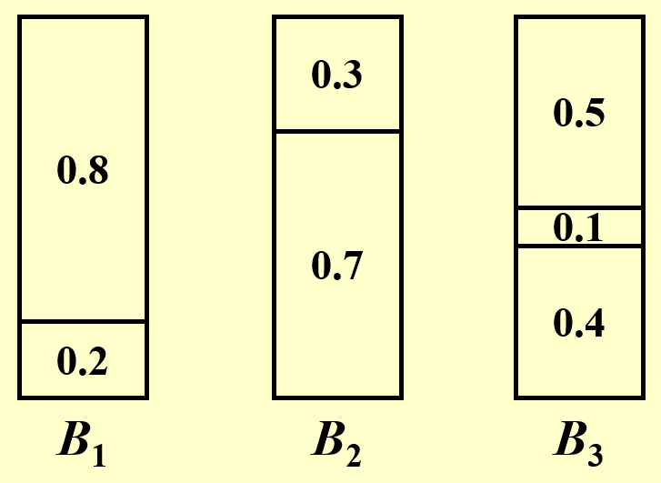
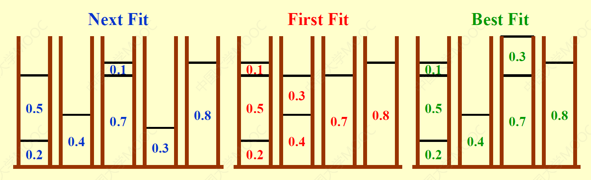
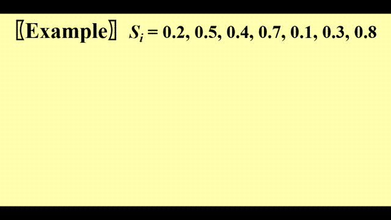
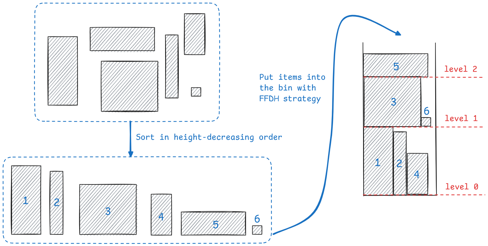
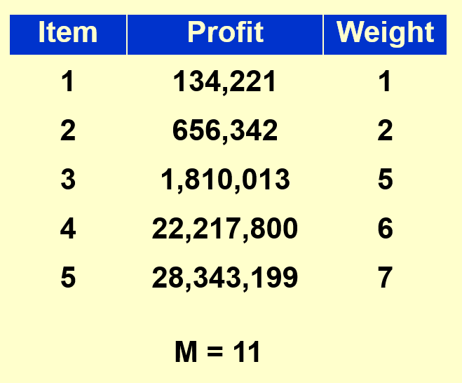
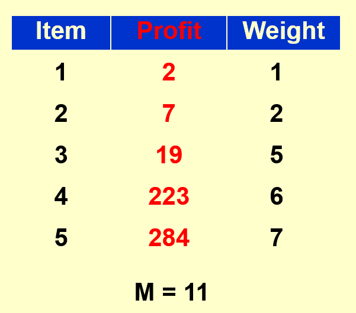
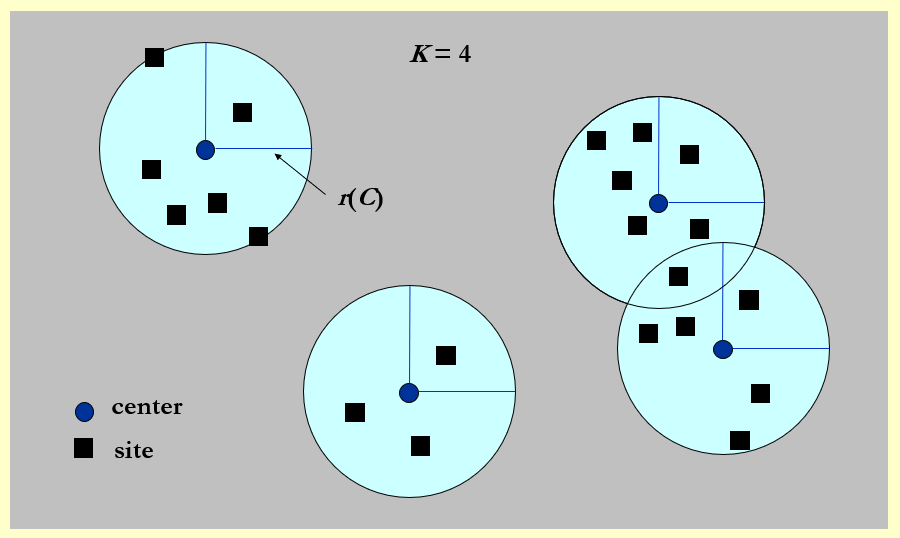
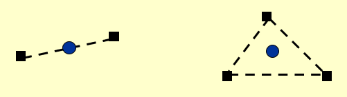
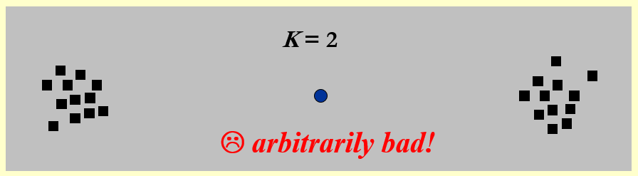

# Lec 11: Approximation

## Introduction

设计算法的时候需要考虑以下几方面的问题：

- Optimality: 算法能找到确切的**最优解**
- Efficiency: 算法能**高效**（通常是多项式时间）运行
- All instances: 算法是通用的，能够解决**全部问题**

我们对这几个方面进行组合，可以得到不同的算法类型：

- A+C：针对全部实例的精确算法
- A+B：对于特殊情况的精确且快速的算法
- B+C：**近似算法**

即使$P = NP$，我们仍然无法保证存在A+B+C的算法解决此类问题。

---
本讲我们延续P/NP问题的话题，探讨如何解决此类问题。对于NPC问题，虽然无法在多项式时间内得到最优解，但是我们希望：

- 如果数据规模$N$很小，即使时间复杂度为指数级也是可以接受的
- 如果某些特殊情况能够在多项式时间内完成，那就先处理这些情况
- 设计一种算法，保证能够在多项式时间内得到接近最优解——这一类算法便是接下来要介绍的**近似算法**(approximation algorithm)

我们一般通过**近似比**(approximation ratio)$\rho(n)$来衡量近似算法的好坏，称这样的近似算法为**$\rho(n)$-近似算法**。它的意义是：对于任意规模为$n$的输入，算法得到一个解所花的成本$C$不会超过得到最优解所花成本$C^*$的$\rho(n)$倍，即：

$$
\max(\dfrac{C}{C^*}, \dfrac{C^*}{C}) \le \rho(n)
$$

最优解的**近似方案**(approximation scheme)：一种近似算法，满足对于给定的输入实例，$\forall \varepsilon > 0$，它是一个$(1 + \varepsilon)$近似算法。下面给出几种常见的近似方案：

- **多项式时间近似方案**(polynomial-time approximation scheme, **PTAS**)：对于任意给定值$\varepsilon > 0$，当输入实例规模为$n$时，该方案能在多项式时间内完成计算，时间复杂度可记为$O(n^{f(\frac{1}{\varepsilon})})$
    - **高效多项式时间近似方案**(efficient polynomial-time approximation scheme, **EPTAS**)：在PTAS的基础上，要求该方案的运行时间是与$\varepsilon$无关，关于$n$的多项式时间，即时间复杂度为$O(n^{O(1)} f(\frac{1}{\varepsilon}))$
    - **满多项式时间近似方案**(fully polynomial-time approximation scheme, **FPTAS**)：在PTAS的基础上，要求该方案的运行时间关于$n$和$\varepsilon$都是多项式级的，时间复杂度可记为$O(n^{O(1)} (\dfrac{1}{\varepsilon})^{O(1)})$

!!! note "一些结论"

    - 如果A问题能被归约到B，且B问题有一个$\rho$-近似算法，那么并**不能**说明A一定也有一个$\rho$-近似算法

## Examples

### Bin Packing

!!! question "问题描述"

    给定$N$个大小分别为$S_1, S_2, \dots, S_N$的物品，满足$\forall\ 1 \le i \le N, 0 < S_i \le 1$，并假设有若干个容量为1的桶。现在请你求出能够装下所有物品的最小桶数。

    ???+ example "例子"

        === "题目"

            $N = 7; S_i = 0.2, 0.5, 0.4, 0.7, 0.1, 0.3, 0.8$

        === "答案"

            最优解为：

            <div style="text-align: center">
                
            </div>

然而，这个看似简单的问题实际上是一个**NP困难问题**。

- 该问题的变种（决策版本）：给定$K$个桶，我们能否装下$N$个物品——这是个**NPC问题**。


下面给出几种解决该问题的近似算法。

#### Online Algorithms

!!! note "近似算法"

    === "Next Fit"

        伪代码如下：

        ```c
        void NextFit() {
            read item1;
            while (read item2) {
                if (item2 can be packed in the same bin as item1)
                    place item2 in the bin;
                else
                    create a new bin for item2;
                item1 = item2;
            } // end-while
        }
        ```
        过程很简单，就是按输入顺序一个个放物品，如果当前物品能够放在与上个物品相同的桶内，那就放进去，否则放在新的桶内。

        时间复杂度：$O(N)$

        定理：令$M$为装下这些物品的最优解桶数，那么该方法所得桶数不超过$2M - 1$，并且存在某种输入使得桶数正好为$2M - 1$。因此该算法是一个2-近似算法。

        ??? proof "证明"

            原定理有以下等价命题：如果该算法能得到$2M$或$2M + 1$个桶，那么最优解至少是$M + 1$个桶。只要证明这个命题是正确的，就能说明定理的正确性，下面继续证明。

            令$S(B_i)$为第$i$个桶所装物品的大小，那么可以得到：

            $$
            \begin{align}
            S(B_1) + S(B_2) & > 1 \notag \\
            S(B_3) + S(B_4) & > 1 \notag \\
            \dots \notag \\
            S(B_{2M - 1}) + S(B_{2M}) & > 1 \notag
            \end{align}
            $$

            >注：如果$S(B_{2i - 1}) + S(B_{2i}) \le 1$，那么实际上只需要一个桶就能装下这两个桶内的物体，而Next Fit得到的解不存在这种情况。

            累加得：$\sum\limits_{i = 1}^{2M} S(B_i) > M$

            因为最优解能得到至少$\lceil \dfrac{\text{total size of all the items}}{1}\rceil$个桶，即$\lceil \sum\limits_{i = 1}^{2M} S(B_i) \rceil$，因此最终得到：$\lceil \sum\limits_{i = 1}^{2M} S(B_i) \rceil \ge M + 1$，即该命题是正确的，因此定理是正确的，得证。

        ??? info "补充"

            假设最大物体的大小$0 < \alpha < 1$，令$NF(L)$和$OPT(L)$分别表示通过Next Fit得到的桶数和最优解的桶数。那么对于任意的物品组$L$，我们有结论：$NF(L) < \rho \cdot OPT(L) + 1$，并且：

            - $\rho = \dfrac{1}{1 - \alpha}(0 \le \alpha \le \dfrac{1}{2})$
                - 简单解释一下：由于$\alpha < \dfrac{1}{2}$，所以除最后一个桶外，每个桶至少会盛放$1 - \alpha$大小的物品（否则的话还可以桶内还可以再放入其他物品），那么可以得到$OPT(L) > (1 - \alpha) (NF(L) - 1)$，稍微计算一下便可以得到上面的结论
            - $\rho = 2(\alpha > \dfrac{1}{2})$
                - 解释便是上面的证明

    === "First Fit"

        伪代码如下：

        ```c
        void FirstFit() {
            while (read item) {
                scan for the first bin that is large enough for item;
                if (found)
                    place item in that bin;
                else
                    create a new bin for item;
            } // end-while
        }
        ```

        该策略是：对于当前物品，找到第一个现存的能够容得下它的桶，如果不存在这样的桶再添加新的桶。

        时间复杂度：$O(N\log N)$（循环内扫描桶的时间复杂度优化至$O(\log N)$）

        定理：令$M$为装下这些物品的最优解桶数，那么该方法所得桶数不超过$\dfrac{17 M}{10}$，并且存在某种输入使得桶数正好为$\dfrac{17(M - 1)}{10}$。因此该算法是一个1.7-近似算法。

    === "Best Fit"

        该策略是：将当前物品放入现存的、容得下它的、且放入该物品后剩余空间是最小的桶内，如果不存在这样的桶再添加新的桶。

        时间复杂度：$O(N \log N)$

        与First Fit类似，它也是一个1.7-近似算法。

        >看起来好像比First Fit对桶的空间利用率更高，但是最终效果并没有变好...


??? example "一些例题"

    === "例1"

        === "题目"

            同“问题描述”部分给出的题目，现在要求你用上面讲到过的三种近似算法给出近似解。

        === "答案"

            <div style="text-align: center">
                
            </div>

    === "例2"

        === "题目"

            假设有以下物品：

            $$
            \begin{align}
            S_i = & \dfrac{1}{7} + \varepsilon, \dfrac{1}{7} + \varepsilon, \dfrac{1}{7} + \varepsilon, \dfrac{1}{7} + \varepsilon, \dfrac{1}{7} + \varepsilon, \dfrac{1}{7} + \varepsilon, \notag \\ & \dfrac{1}{3} + \varepsilon, \dfrac{1}{3} + \varepsilon, \dfrac{1}{3} + \varepsilon, \dfrac{1}{3} + \varepsilon, \dfrac{1}{3} + \varepsilon, \dfrac{1}{3} + \varepsilon, \notag \\ & \dfrac{1}{2} + \varepsilon, \dfrac{1}{2} + \varepsilon, \dfrac{1}{2} + \varepsilon, \dfrac{1}{2} + \varepsilon, \dfrac{1}{2} + \varepsilon, \dfrac{1}{2} + \varepsilon \notag
            \end{align}
            $$

            其中$\varepsilon = 0.001$，请比较它们的最优解和近似解（用上面给出的3种算法计算）。

        === "答案"

            - 最优解：6个桶（每列物品放入一个桶，共6列）
            - 近似解：10个桶（三种近似算法得到相同的近似解）

            因此对于本题，近似算法的效果并不是很理想。

    === "例3"

        如果从原物品集$L$中任意删除一个物品，对于FF算法而言，所需的桶数不一定减少，甚至还有可能增加，来看下面的例子：

        - 原物品集$L = \{0.55, 0.7,0.55, 0.1, 0.45, 0.15, 0.3, 0.2\}$
        - 删除某个物品后的集合$L' = L - \{0.1\} = \{0.55, 0.7,0.55, 0.45, 0.15, 0.3, 0.2\}$

        结果对比：

        <figure style=" width: 40%" markdown="span">
            
            
            <figcaption></figcaption>
        </figure>


    === "例4"

        === "题目"

            在原来题目描述的基础上增加一条限制：如果$S_i$和$S_j$位于同一个桶内，那么物品$S_{i+1}, S_{i+2}, \dots, S_{j-1}$也必须在这个桶内。请问上述哪种算法可以得到最优解？

        === "答案"

            **Next Fit**。它的思路很好地适应了题目给出的限制，~~但具体原因我不太清楚~~。


上述的三种近似算法实际上是一种**在线算法**(online algorithm)。对于本题，它的意思是：在处理下一个物品前就要放好当前物品，且**不能改变**当前的决策。

由于在线算法无法得知输入何时结束，因此始终无法得到最优解。具体来说，有以下定理：对于本题的所有近似算法，得到的近似解桶数**至少**是最优解桶数$\dfrac{5}{3}$倍。

!!! note "一些结论"

    - 对于上述的三种算法，FF和BF的解中至多只有一个桶所装物品大小不超过桶容量的一半，而NF的解中可能会有多个这样的桶。


#### Offline Algorithms

由于在线算法的精确度不是很高，因此我们采用**离线算法**(offline algorithm)来进一步改进，这种算法的思路是：在得到答案前需要检查所有的物品。

- 先找到问题的trouble maker：尺寸较大的物品
- 解决方案——**first/best fit decreasing**：先将物品按大小的非递增顺序排序，然后应用first fit或best fit近似算法（两者近乎等价）求解。不难发现，该方法用到了**贪心算法**的思想。

??? example "例子"

    === "题目"

        同“问题描述”部分给出的题目。

    === "答案"

        !!! play "动画演示"

            <div style="text-align: center">
                
            </div>

定理：令$M$为装下这些物品的最优解桶数，那么该方法（first fit decreasing）所得桶数不超过$\dfrac{11 M}{9} + \dfrac{6}{9}$，并且存在某种输入使得桶数正好为$\dfrac{11 M}{9} + \dfrac{6}{9}$。

!!! note "一些结论"

    其中$FFD(L)$表示的是对于物品组$L$，用first fit decreasing算法得到的桶数

    - $FFD(L) \le \dfrac{3}{2} OPT(L)$
    - 如果能够证明P=NP，那么我们可以确定$\dfrac{3}{2}$是最小的因数（近似比）

    ??? proof "对结论的证明"

        === "结论1"

            - 根据前面的定理，我们知道$\forall\ L, FFD(L) \le \dfrac{11}{9}OPT(L) + 1$（这里用的是更宽松的条件）。可以先计算$\dfrac{11}{9}OPT(L) + 1 \le \dfrac{3}{2} OPT(L)$，因为如果这个不等式成立的话，结论1一定成立。解得$OPT \ge 4$，所以接下来只需考虑$OPT = 1, 2, 3$的情况即可
            - $OPT = 1$：$FFD = 1$，显然成立
            - $OPT = 2$：使用定理的不等式，得到$FFD \le \dfrac{11}{9} \times 2 + 1 = \dfrac{31}{9}$，由于$FFD$是整数，因此$FFD \le 3$，因此成立
            - $OPT = 3$：使用定理的不等式，得到$FFD \le \dfrac{11}{9} \times 3 + 1 = \dfrac{42}{9}$，由于$FFD$是整数，因此$FFD \le 4$，因此成立
            - 综上所示，结论1成立

        === "结论2"

            考虑该问题的某个判定版本：若存在一种近似算法$A$，满足$A < \dfrac{3}{2}OPT$，使用该算法放置物品时，能否用两个桶装下所有的物品？这是一个NPC问题。

            - 如果可以，那么$A \le 2$，显然$OPT \le 2$，即最优解也不会超过两个桶，也是OK的
            - 如果不行，那么$A \ge 3$，$OPT \ge \dfrac{2}{3}A > 2$，即最优解也需要两个以上的桶，也是不行的

            因此不难发现$\dfrac{3}{2}$这个因子是一个临界点。如果我们能够在多项式时间内能够判定$A$的大小，即解决这个NPC问题，那么此时P=NP。

#### Texture Packing 

!!! question "问题描述"

    **纹理打包**(texture packing)问题（~~好怪的名字~~）实际上是一个二维版本的bin packing：

    - 每个物品有宽度和高度两个属性
    - 只给一个桶，它有一个固定的宽度（至少比最宽的物品宽），但高度是无穷的
    - 我们希望所有物品放入桶内的高度最小

算法：

- BL(Bottom-up Left-justified)：物品尽量靠近桶的左下角放置
    - 近似比：3
- FFDH(First Fit Decreasing Height)：先对物品按高度降序放入桶内，并采用类似bin packing的FFD算法的策略——若桶的某一层内还能放入该物品则放进该层，否则将物品放入新的一层里。效果大致如下：

    <div style="text-align: center">
        
    </div>

    - 近似比：2.7

    ??? code "代码实现"

        ```c
        typedef struct item {
            double width;     
            double height;
            double x;        
            double y;      
        } Item;

        double FFDH(double W, int n, Item rect[]) {
            double curHeight = 0;         // current height of the bin
            double curWidth[maxNum];      // contain widths of each level 
            int level;                    // number of levels          

            sortByHeight(rect, n);

            level = 0;
            for (i = 0; i < n; i++)
                curWidth[i] = 0;

            for (i = 0; i < n; i++) {
                for (j = 0; j < level; j++) {
                    if (curWidth[j] + rect[i].width <= W) {
                        rect[i].x = curWidth[j];              
                        rect[i].y = levelHeight[j];
                        curWidth[j] += rect[i].width;                                
                        break;
                    } 
                }
                if (j < level)                                
                    continue;

                // If not found
                ++level;                                 
                curWidth[level - 1] = rect[i].width;    
                levelHeight[level - 1] = curHeight;       
                curHeight += rect[i].height;             
                rect[i].x = 0;                         
                rect[i].y = levelHeight[level - 1];                             
            }

            return curHeight;
        }   
        ```

- NFDH(Next Fit Decreasing Height)：与FFDH很像，也是FFD的二维版本
    - 近似比：2.7

- 还有很多算法就不展开介绍了，感兴趣的话可以参考[wiki](https://en.wikipedia.org/wiki/Strip_packing_problem#Polynomial_time_approximation_algorithms)


### Knapsack Problems

#### Fractional Version

!!! question "问题描述"

    !!! info "注"

        这里的“背包问题(knapsack problem)”是分数版本的0-1背包问题，不是在DP那一讲中提到的那几种简单类型。如果对这类问题有些遗忘的话，建议[回顾](8.md#knapsack-problem)一下。

    令背包容量为$M$，给定$N$类物品，每类物品$i$的重量为$w_i$，价值为$p_i$，被放进背包的比例为$x_i \in [0, 1]$（因此该类物品的总价值为$p_i x_i$）。

    很明显，该问题的最优解即为背包所装物品的最大价值。也就是说，在满足$\sum\limits_{i=1}^n w_i x_i \le M$的限制条件下，令$\sum\limits_{i=1}^np_ix_i$最大。

- 在每个阶段中，我们需要将一类物品放入背包内。
- 对于本题，我们尝试用**贪心法**来解决，所采取的贪心策略是：按**价值密度**(profit density)大小$\dfrac{p_i}{w_i}$的降序挑选物品，直到背包被填满为止。


??? example "例子"

    === "题目"

        已知$n = 3, M = 20, (p_1, p_2, p_3) = (25, 24, 15), (w_1, w_2, w_3) = (18, 15, 10)$，计算背包的最大价值。

    === "答案"

        $(x_1, x_2, x_3) = (0, 1, \dfrac{1}{2})$，此时最大价值$P = 31.5$

??? code "代码实现"

    ```c
    int knapsack_frac(int weight[], int val[], int n, int cap) {
        int i, j;
        double res = 0;

        // sort n items by densities of value, i.e. val[i] / weight[i], in descending order
        sort(weight, val, n);           

        for (int i = 0; i < n; i++) {
            // if the knapsack has enough space, put the whole item into the knapsack
            if (weight[i] <= cap) {
                res += val[i];
                cap -= weight[i];
            // if not, put part of the item into the knapsack
            } else {
                res += (double)(value[i] / weight[i]) * cap;
                break;
            }
        }

        return res;
    }
    ```

>注：更详细的解释可参考[Hello 算法](https://www.hello-algo.com/chapter_greedy/fractional_knapsack_problem)。


#### 0-1 Version

现在回到[0-1背包问题](8.md#0-1KnapsackProblem) ——它在上面一类背包问题的基础上多了一条限制：$x_i = 0 \text{ or } 1$。事实上，这个看似较为简单的问题，它竟是一个NP困难问题。下面我们对这类问题进行更进一步的分析。


??? example "例子"
            
    === "题目"

        已知$n = 5, M = 11, (p_1, p_2, p_3, p_4, p_5) = (1, 6, 18, 22, 28), (w_1, w_2, w_3, w_4, w_5) = (1, 2, 5, 6, 7)$，计算背包的最大价值。

    === "答案"

        - 最优解：$(0, 0, 1, 1, 0), P = 40$
        - 贪心解：$(1, 1, 0, 0, 1), P = 35$
            - 对于本例，无论是采取选最大价值密度的策略，还是采取选最大价值的策略，结果都是一样的
    
从上面的例子中，我们可以发现贪心法在0-1背包问题中并不能成功找到最优解，因而是一种近似算法。下面来证明它实际上是一个**2-近似算法**：

??? proof "证明"

    通过已知条件，可以得到下列不等式：

    $$
    \begin{align}
    p_{\text{max}} & \le P_{\text{opt}} \le P_{\text{frac}} \notag \\
    p_{\text{max}} & \le P_{\text{greedy}} \notag \\
    P_{\text{opt}} & \le P_{\text{greedy}} + p_{\text{max}} \notag
    \end{align}
    $$

    其中，$p_{\text{max}} = \max\limits_{1 \le i \le n}\{p_i\}$，$P_{\text{opt}}$表示本题的最优解，$P_{\text{frac}}$表示分数背包问题的解，$P_{\text{greedy}}$表示本题的贪心解。

    - 第一个不等式：左边的不等号显然成立，右边的不等号是因为分数背包问题可以取部分物品，那么它一定能够在0-1背包的基础上，通过塞入部分物品将背包塞满，所以分数背包的解一定不小于0-1背包的最优解
    - 第二个不等式也是显然成立的
    
    - 第三个不等式：不等号两边同时减去$P_{\text{greedy}}$，即最优解与贪心解之差一定不超过最大价值
        - 这是因为一个前提：在小数解中，其实**只有一个物品会被拆分放入**（因为价值大的剩余位置够用时肯定装满价值大的），也就是说贪心解和分数解的差值就是没有被拆分放入背包的物品的价值，这个物品肯定是放入背包的物品中的**价值最小的一个**
        - 在这里进行放缩，将这个被拆分的物品价值$p$替换为价值最大的物品$p_{max}$，这时$P_{greedy} + p_{max} \ge P_{frac} = P_{greedy} + p \ge P_{opt}$

        >感谢[@JazZyzJ](https://github.com/JazZyzJ)对第三个不等式的解释的补充~

    根据这三个不等式，可以推出：

    $$
    \dfrac{P_{\text{opt}}}{P_{\text{greedy}}} \le 1 + \dfrac{p_{\text{max}}}{P_{\text{greedy}}} \le 2
    $$

    再根据近似比的定义，便可得到近似比为2。

??? info "补充：更厉害的近似算法"

    >参见zgc先生的[paper](https://www.sciencedirect.com/science/article/pii/S0304397512007694?ref=pdf_download&fr=RR-2&rr=8e8891961ab4050c)

所以，用贪心法解0-1背包问题的效果不是很理想。通常的解法便是前面介绍过的[动态规划](8.md)，这里再介绍一种通过分析最小重量求解的dp算法：

- 令$W_{i, p}$为物品1到物品$i$之间的最小质量，而这些物品的总价值为$p = \sum\limits_{k = 1}^i p_k$
- 分类讨论：
    - 取物品$i$：$W_{i, p} = w_i + W_{i - 1, p - p_i}$
    - 不取物品$i$：$W_{i, p} = W_{i - 1, p}$
    - 不可能得到价值$p$：$W_{i, p} = \infty$
- 状态转移方程为：

$$
W_{i, p} = \begin{cases}\infty & i = 0 \\ W_{i - 1, p} & p_i > p \\ \min\{W_{i - 1, p}, w_i + W_{i - 1, p - p_i}\} & \text{otherwise}\end{cases}
$$

- 其中，$i = 1, \dots, n, p = 1, \dots, np_{\text{max}}$，因此时间复杂度为$O(n^2 p_{\text{max}})$

!!! question "思考"

    === "问题1"

        === "问题"

            诶，看起来用dp能够在多项式时间内求解0-1背包问题，为什么说0-1背包问题是一个NP困难问题呢？

        === "解答"

            所谓的“多项式时间内”，指的是**关于输入数据规模$n$的多项式**。而上面给出的时间复杂度中还有一项$p_{max}$，它与数据规模$n$独立，因此这个数可以很大很大，超出$n$的指数级倍。因此，我们无法保证dp解法能够在多项式时间内产生解。

    === "问题2"

        === "问题"

            那如果我们假定$w_i \le N^2$，那么0-1背包问题是否还是NP困难问题呢？

        === "解答"

            No！根据我们在[动态规划](8.md#0-1-knapsack-problem)一节中提到的算法，它的时间复杂度为$O(N \cdot cap)$。如果有了这里给出的“假定”，那么不难得到$M = \sum\limits_{i = 1}^N N \cdot w_i \le N \cdot N^2 \le N^3$，那么总的时间复杂度就是$O(N^4)$，因此此时0-1背包问题就不是NP困难问题了。

??? example "例子"

    === "题目"

        现在就来分析上述的极端情况：以下面给出的数据为例，当$n$不大，$p_{\text{max}}$非常大（~~其实$p_i$都蛮大的~~）时，你会怎么做呢？

        <div style="text-align: center">
            
        </div>

    === "答案"

        一种（也许）可行的做法是只保留$p_i$的高位，但保证能够区分这些$p_i$的大小：

        <div style="text-align: center">
            
        </div>       

        - 但这种做法会损失价值的精度，且如果所有价值的位数一致时，这种做法就不太有效了
        - 对于上述方法，有$(1 + \varepsilon) P_{\text{alg}} \le P$，其中$\varepsilon$为精度参数
        - 我想到一种改进方法：将这些价值先排个序（升序），然后将这些价值与对应的索引建立一个双射关系，在状态转移方程的计算中用索引替代价值，最后再还原为真实的价值作为最大价值


### K-center Problems

[**聚类**(clustering)问题](https://en.wikipedia.org/wiki/Cluster_analysis)(clustering)是把相似的对象通过静态分类的方法分成不同的组别或者更多的子集，使得同一子集中的成员对象都有一些相似属性的一种操作，常应用于数据挖掘、机器学习等领域。下面我们主要介绍一类聚类问题——**K-中心问题**(K-center problem)。

!!! question "问题描述"

    给定$n$个地址$s_1, \dots, s_n$，在地图上选择$K$个中心点$c$，使任意地址到离它距离最近的中心点之间的距离中的最大值最小化。

    <div style="text-align: center">
        
    </div>  

    ---
    这么说可能不太好理解，下面给出符号化的定义：

    本问题提到的距离(distance)不同于图论中边的权重，实际上它就是数学上本来的意思：

    - 同一性(identity)：$dist(x, x) = 0$
    - 对称性(symmetry)：$dist(x, y) = dist(y, x)$
    - 三角不等式(triangle inequality)：$dist(x, y) \le dist(x, z) + dist(z, y)$

    令：
    
    - $dist(s_i, C) = \min\limits_{c \in C} \{dist(s_i, c)\}$，即$s_i$到最近中心点间的距离
    - $r(C) = \max\limits_{i} \{dist(s_i, C)\}$，即所有中心点中最大的最小覆盖半径，换句话说，就是以中心点为圆心的最小覆盖圆中，最大的那个圆的半径

    目标：找到一组中心点集$C$，使得$r(C)$最小化，且保证$|C| = K$（$K$为常数）

#### Naive Greedy

由于平面是无限大的，穷举法显然是不可能的。下面介绍一种贪心策略：

- 让第一个中心点作为所有地址的中点（就好像只能放一个中心点）
- 随后加入的中心点满足能够减少$r(C)$值的条件

<div style="text-align: center">
    
</div>  

???+ failure "问题"

    如图所示，假设整个点集包括两个相距很远的子集，且$K = 2$。此时第一个中心点就会被放在两个子集的中间，但最优解应该是中心点位于子集的中间位置的时候，所以这种贪心策略就失效了。

    <div style="text-align: center">
        
    </div>  


#### 2r Greedy

因此贪心法需要进一步的改进，先给出伪代码：

```c
Centers Greedy-2r(Sites S[], int n, int K, double r) {
    Sites S`[] = S[];  // S` is the set of the remaining sites
    Centers C[] = NULL;
    while (S`[] != NULL) {
        Select any s form S` and add it to C;
        Delete all s` from S` that are at dist(s`, s) <= 2r;
    } // end-while
    if (|C| <= K) 
        return C;
    else
        ERROR("No set of K centers with covering radius at most r");
}
```

!!! note "解释"

    1. 预备知识：在改进的贪心算法中，我们直接挑选某个地址作为中心点。这种做法之所以可行，是因为某个中心点覆盖半径为$r$的区域，可以近似为以（接近）区域边界上一点$s$为新的中心点，$2r$为半径的区域。这个区域明显比原区域大，同时也能保证覆盖原区域所能覆盖的点。这样的话我们就不必通过繁琐的计算算出中心点，而是从原有的地址中选择中心点，这样就方便了很多。下图很好的说明了这一点：

        <figure style=" width: 70%" markdown="span">
            
            
            <figcaption></figcaption>
        </figure>

    2. 关于参数$r$（$C^*$为最优中心点集，令$r(C^*) \le r$）：假如我们知道了最大半径$r_{\text{max}}$，此时由于$r$的范围是已知的（$0 < r \le r_{\text{max}}$）我们可以使用**二分查找**来找到$r$的值，具体来说：
        - 先令$r = \dfrac{0 + r_{\max}}{2}$
        - 如果能够在这个$r$下面找到满足要求的$K$个中心点，说明这个界还是比较宽松的，需要减小$r$；否则的话增加$r$（都是用二分法改变$r$值）
        - 时间复杂度：$O(\log r_{\max})$

    3. 回到贪心算法上：
        - 从输入点集中随机选取第一个点作为第一个中心，然后删除该点为中心，$2r$为半径的所有点
        - 然后在剩余点中随机选择第二个中心，以此类推
        - 如果该$r$值确实是最优解，那么这一算法在$K$步之内必然停止，且得到的解是最优解的2倍，即该算法是一个**2-近似算法**
        - 定理：假设该算法选择的中心点数超过$K$，那么对于任意规模至多为$K$的中心点集$C^*$，覆盖半径为$r(C^*) > r$


#### Smarter Greedy

这个贪心法还可以再改进！还是先给出伪代码：

```c
Centers Greedy-Kcenter(Sites S[], int n, int K) {
    Centers C[] = NULL;
    Select any s from S and add it to C;
    while (|C| < K) {
        Select s from S with maximum dist(s, C);
        Add s to C;
    }  // end-while
    return C;
}
```

- 这里的贪心法与上面的贪心法区别在于：前面的贪心法是任意选取输入点集中的点作为中心点，而这里的贪心法策略是：
    - 第一个点还是任意取的
    - 之后<u>选择离中心点集中的点尽可能远的点</u>作为新的中心点，这样的选择方法更加聪明些
    - 循环$K$遍就结束循环了

- 定理：该算法返回包含规模为$K$的中心点集$C$，使得$r(C) \le 2r(C^*)$，其中$C^*$表示最优中心点集
- 很可惜的是，这种做法属于“换汤不换药”，本质上依旧是一个2-近似算法。

很遗憾的是，对于K-中心问题，除非P = NP，**不存在**$\rho < 2$的近似算法，下面给出证明：

??? proof "证明"

    >~~又看了一遍，还是没搞懂~~，笔者的一位朋友在评论区下方给出了解释，大家可以参考一下！

    在证明之前引入[**支配集**](https://en.wikipedia.org/wiki/Dominating_set)(dominating set)问题，它是一个NPC问题。

    !!! question "问题描述"

        给定一个图$G = (V, E)$和一个整数$k$，是否存在一个集合$S \subset V,\ |S| = k$，使得$V$内的每个点要么在$S$中，要么与$S$内的某个点相邻？

    用反证法证明：

    - 假如存在一个多项式时间复杂度的$2 - \varepsilon$的近似算法，那么我们也能在多项式时间内解决支配集问题
    - 当前仅当对于K-中心问题，存在最优中心点集$C^*$，半径$r(C^*)=1$时，支配集问题的解$S$满足$|S| = K$
    - 因为所有被包含进去的边是整数，因此这个$2 - \varepsilon$近似算法一定能给出最优解
    
### Schedule Problem

>这个话题是对“贪心算法”一讲中[调度问题](9.md#schedule-problems)的延续，同样整理自wyy的讲义。

!!! question "问题描述"

    给定$n$个任务，任务$i$所需时长为$l_i$；并且有$m$台相同的机器，规定每个任务只能在一台机器上完成。题目要求一种分配方案，使得耗时最长的机器的运行时间最短。

    为了便于后面的讲解，均以$m=2$为例，即只使用两台机器$A, B$。

在介绍近似算法前，先来看能不能通过常规算法得到最优解。这里我们采用的是动态规划。

???+ note "**动态规划**解法"

    - 令第$i$个任务在机器$A$上所需时间为$a_i$，在$B$上所需时间为$b_i$
    - 当执行任务$k$时，会遇到以下几种情况
        - 机器$A$完成任务$k$：此时$B$完成前$k$个任务的最短时间 = $B$完成前$k - 1$个任务的最短时间
        - 机器$B$完成任务$k$：此时$B$完成前$k$个任务的最短时间 = $B$完成前$k - 1$个任务的最短时间 + 完成第$k$个任务所需的时间
    - 令$F[k][x]$表示：在完成第$k$个任务时，$A$耗时为$x$的情况下，$B$所花费的最短时间，因而得到状态转移方程：

    $$
    F[k][x] = \min\{F[k-1][x - a_k], F[k - 1][x] + b_k\}
    $$

    - 那么题目要求的就是$\min\limits_x \max\{F[n][x], x\}$
    - 整个分析过程与0-1背包类似，所以结论也是类似的：由于时间复杂度$O(n \cdot x) = O(n \cdot \sum\limits_{i=1}^n a_i)$，那么该算法不一定能够在多项式时间内得到最优解
    - 事实上，这个问题的判定版本，即：给定若干任务和两台相同的机器，是否存在一种分配方案使得最小工时不超过$T$，是一个**NPC**问题（证明过程可参考wyy的讲义，这里就略过了）
    - 那么这也就表明本题是一道**NP Hard**问题

这么一通分析下来，我们发现常规算法难以在多项式时间内得到最优解，因此我们退而求其次，使用近似算法在允许的时间范围内得到近似解。下面介绍一种用于解决此题的近似算法——**Graham算法**：对每个任务进行调度时，<u>选择当前工作量最小的机器</u>进行调度。

- 该算法的近似比为$2 - \dfrac{1}{m}$
    - 证明同样见wyy的讲义
- 不难发现，如果只用Graham算法对任意排序的任务进行调度，那么很有可能出现耗时最长的任务放在最后完成的情况。因此该算法还有改进空间：先对任务<u>按时长降序排序</u>，然后依次用Graham算法调度。
    - 近似比：$\dfrac{4}{3} - \dfrac{1}{3m}$
    - 证明过程见蒂姆·拉夫加登的《算法详解》第四卷


