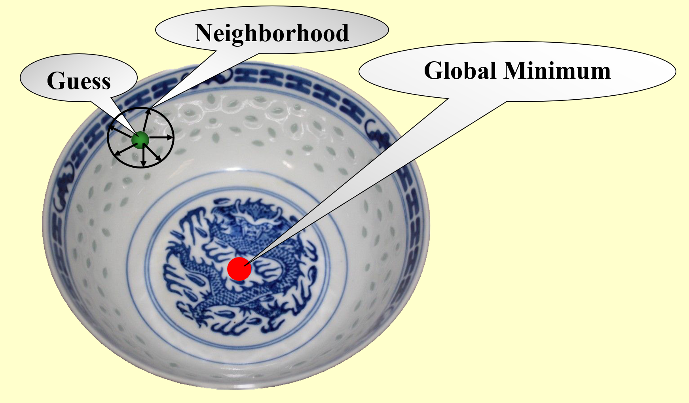
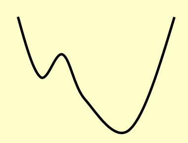
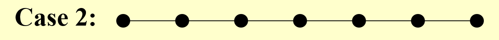

# Lec 12: Local Search

## Introduction

我们继续延续上一讲的话题——本讲所介绍的**局部搜索**(local search)实际上是近似算法的一大门类，它的大致思路是：**通过局部最优解获得全局近似解**。

???+ example "例子"

    假如要求你使用局部搜索算法来寻找碗的（全局）最低点，如下图所示（~~违和感太强~~）。

    <div style="text-align: center">
        
    </div>

    - 先在碗中任取一点（称为猜测点(guess)）
    - 以该点为中心，在一定范围内（邻居(neighbor)）搜寻该范围内的最低点（局部最优解）

    <div style="text-align: center">
        
    </div>

    - 接着以这个最低点为中心，在新的范围内搜寻范围内的最低点……
    - 以此类推，直到在局部范围内无法再找到更低的点为止，此时发现的最低点应为整个碗的最低点（全局最优解）

    ??? play "动画演示"

        <div style="text-align: center">
            
        </div>


!!! question "思考"

    局部搜索算法的设计需要考虑好「局部」的范围，来看下面的例子：

    <div style="text-align: center">
        
    </div>

    - 局部范围过小：算法可能就会误以为那些“小坑”是最优解，而不会继续搜索下去
    - 局部范围过大：算法可能跳过了最优解，最坏的情况下算法可能陷入死循环，因为算法始终无法确定是否不存在更低的点（比如在最低点两边来回跳，就是找不到最低点）

局部搜索的框架结构：

- **局部**(local)：
    - 在一个可行的集合内定义**邻居**(neighborhoods)
    - **局部最优解**(local optimum)是邻居内的最佳解
- **搜索**(search)：
    - 从一个可行解开始，在邻居范围内找到一个更好的解
    - 如果没有改进空间，则将当前的局部最优解视为整个问题的解

**邻居关系**(neighbor relation)

- $S \sim S'$：$S'$是$S$的邻居解(neighboring solution)，它来自于对原集合$S$的较小修改
- $N(S)$：$S$的邻居，即集合$\{S': S \sim S'\}$

局部搜索算法的伪代码如下：

```c
Solution Type Gradient_descent() {
    Start from a feasible solution S in FS;
    // FS: the feasible solution set
    MinCost = cost(S);
    while (1) {
        S` = Search(N(S));     // find the best S' in N(S)
        CurrentCost = cost(S`);
        if (CurrentCost < MinCost) {
            MinCost = CurrentCost;
            S = S`;
        }
        else break;
    } 

    return S;
}
```

该算法称为“梯度下降法”(gradient descent)，顾名思义，就是沿[梯度](../../math/calculus/8.md#梯度)下降的方向不断进行局部的搜索。

下面给出一些用局部搜索算法计算的经典题目，通过这些题目来进一步加深对局部搜索的理解。

## Examples

### Vertex Cover Problem

>这一问题在上一讲的最后简单提到过，在这里我们来

!!! question "问题描述"

    该问题有两类问法：

    - 判定版本：给定一个无向图$G = (V, E)$和一个整数$K$，该图是否存在一个子集$V' \subseteq V$，使得$|V| =(\text{or } \le) K$，且满足$G$中的每条边（一条边有两个端点）都有（至少一个）属于$V'$的端点
    - 最优版本：给定一个无向图$G = (V, E)$，请找到一个最小的子集$S \subseteq V$，使得$E$中的任意一边$(u, v)$，$u$和$v$至少有一个属于$S$

    下面我们考虑的是**最优版本**的问法。

先定义一些量：

- 可行解集$FS$：所有的顶点覆盖
- $cost(S) = |S|$
- $S \sim S'$：每个顶点覆盖$S$至多有$|V|$个邻居

搜索步骤：

- 从$S = V$开始
- 删除或增加一个节点得到新的顶点覆盖$S'$
- 检查$S'$的成本是否更低

!!! bug "几种tricky的情况"

    === "Case 0"

        顾名思义，它并不是tricky的情况，先给个trivial的情况练练手。

        <div style="text-align: center">
            
        </div>

        可以看到，这张图只有顶点没有边，因此最优解就是去掉所有顶点，即$S = \emptyset$。显然，用前面介绍过的梯度下降法能够解决此类情况。

        ??? play "动画演示"

            <div style="text-align: center">
                
            </div>

        如果用最开始给出的那个碗的例子来类比，对应的碗的剖面大概长这样（很平滑，因此一步步找总能找到最优解）：


        <div style="text-align: center">
            
        </div>


    === "Case 1"

        <div style="text-align: center">
            
        </div>

        如果我们手工完成的话，这道题相当简单：只需要保留中间那个点，去掉所有其他的点即可。然而，如果算法一开始选择删除的是中间的点，那就寄了——梯度下降法不具备撤销操作，所以这么一删后，无论之后怎么做都无法得到最优解了。

        还是用那个碗类比，对应的碗的剖面大概长这样（边上有一小块凹下去的地方，使算法误以为这个局部最优无法得到进一步提升，视其为全局最优，从而得到错误的结果）：

        <div style="text-align: center">
            
        </div>


    === "Case 2"

        <div style="text-align: center">
            
        </div>

        这次给出的图形似一条链，不难得到以下的最优解（红色点表示保留下来的点）：

        <div style="text-align: center">
            
        </div>

        然而，若算法在执行过程中一不小心删掉了这三个红点中的任意一个，则无法得到最优解，而会得到各种各样的错误：

        <div style="text-align: center">
            
        </div>

        因此这种情况更为棘手。继续用碗来类比，对应的碗的剖面大概长这样（这个碗有很多“坑点”，算法很容易会调入其中的一个“坑”里无法爬出来）：

        <div style="text-align: center">
            
        </div>

看过这些tricky的例子后，可以发现之前给出的梯度下降法似乎不是那么有用了，因此下面给出一个更为强大的算法——[**Metropolis算法**](https://en.wikipedia.org/wiki/Metropolis%E2%80%93Hastings_algorithm)：

```c
SolutionType Metropolis() {
    Define constants k and T;
    Start from a feasible solution S in FS;
    MinCost = cost(S);
    while (1) {
        S` = Randomly chosen from N(S);
        CurrentCost = cost(S`);
        if (CurrentCost < MinCost) {
            MinCost = CurrentCost;
            S = S`;
        } else {
            With a probability e^{-\Delta cost / (kT)}, let S = S`;
            otherwise break;
        }
    }

    return S;
}
```

- 再来看前面给出的例子：
    - 对于Case 1，该算法有一定概率可以跳出局部最优，得到正确解
    - 而对于Case 0，有可能在+1和-1之间无限振荡

- $S'$既可以来自删掉任意一点后的$S$，也可以来自增加任意一点后的$S$（可视为撤销操作）
- 这一算法与梯度下降法最大的不同之处在于：如果新的顶点覆盖$S'$的成本更大，它不会马上就会被抛弃掉，而是通过某个特殊的概率$e^{\frac{\Delta \text{cost}}{kT}}$来决定它是否可以被保留下来
    - 至于这个概率的具体含义，cy没有给出很好的解释，暂且先跳过
    - 目前只知道这个$T$代表的是温度（这个算法来自于统计物理学，因而会涉及到物理量）
        - 当温度很高时，这个概率接近1，容易引起底部振荡（也就是说无论何种情况最优解会一直更新）
        - 当温度接近于0时，这个概率也接近于0，此时该算法接近原始的梯度下降法
- 设计该算法的一大难点在于寻找合适的温度值——这里我们采用[**模拟退火**](https://en.wikipedia.org/wiki/Simulated_annealing)(simulated annealing)的算法。该算法的名称来自于冶金学术语“退火”：让材料从很高的温度开始**慢慢**冷却，使我们有充足的时间在一系列不断减小的中间温度值$T = \{T_1, T_2, \dots\}(T1 \ge T_2 \ge \dots)$中找到平衡点(equilibrium)（即最优解）
    - 这里只讲了个大致思路，具体的原理我还没学，有时间再补~


### Hopfield Neural Networks

!!! question "问题描述"

    给定一张图（或者称为网络(network)）$G = (V, E)$，每条边都有一个整数（不论正负）的权重$w$，每个顶点的取值（称为状态(state)）$s$为$\pm 1$。权重的绝对值$|w|$称为需求强度(strength of requirement)。
    
    对于边$e = (u, v)$：
    
    - 如果$w_e < 0$，那么$u$和$v$具备相同的状态（即都为-1或都为1）
    - 如果$w_e > 0$，那么$u$和$v$具备不同的状态（即一个为-1，一个为1）

    题目的输出为：网络的一种布局(configuration)$S$——所有顶点的状态集合，每个顶点$u$都被赋予一个状态$s_u$。

    需要注意的是：可能不存在能够满足所有边的需求的布局，比如这张图：

    <div style="text-align: center">
        
    </div>
    
    因此，我们需要找到一种**足够好**的布局，接下来定义一下何谓“足够好”：

    - 在一种布局中，如果$w_e s_u s_v < 0$，称边$e = (u, v)$是一条**好边**，否则称其为一条**坏边**
        - $w_e < 0 \Leftrightarrow s_u = s_v$
        - $w_e > 0 \Leftrightarrow s_u \ne s_v$

    - 在一种布局中，如果一个顶点的关联(incident)（即该点作为某条边的端点）好边的总权重不小于关联坏边的总权重，称这个点为**满意(satisfied)点**，即满足：

    $$
    \sum\limits_{v:e=(u, v) \in E}w_e s_u s_v \le 0
    $$

    - 如果一张图的所有顶点都是满意点，那么称这个布局是稳定的(stable)

    ??? example "例子"

        === "问题"

            根据给定边的权重，请找出一个稳定的布局。

            <div style="text-align: center">
                
            </div>

        === "解答"

            这里给出其中一种可能的稳定布局：

            <div style="text-align: center">
                
            </div>

            可以看到，除了-5那条边是一条坏边外，其他所有边都是好边。下面我们来检验一下是否所有的点都是满意点。由于只有一条坏边，因此只需检验坏边的两个端点即可：

            <div style="text-align: center">
                
            </div>

            这里用蓝笔标出坏边。通过计算发现坏边的两个端点的总权重均小于0，满足定义，因此所有点都是满意点，这种布局是稳定的。

下面给出一种寻找稳定布局的算法——状态翻转(state-flipping)算法：

```c
ConfigType State_flipping() {
    Start from an arbitrary configuration S;
    while (!IsStable(S)) {
        u = GetUnsatisfied(S);
        s_u = -s_u;
    }

    return S;
}
```

算法非常简单：只要这个布局不是稳定的，算法就会找出不满意点并翻转它的状态，这样就能使其变成满意点（很容易验证），直到所有的点都是满意点为止。读者肯定会产生这样的疑问：这个算法是否总是能够停下来？

先给个结论：该算法在至多$W = \sum_e|w_e|$次迭代后终止，下面我们来证明一下：

???+ proof "证明"

    这里引用摊还分析中的**势能函数法**来证明该结论。

    令势能函数$\Phi(S) = \sum_{e \text{ is good}}|w_e|$，当顶点$u$翻转状态时（$S$会变成$S'$）

    - 所有与$u$关联的好边都变成了坏边
    - 所有与$u$关联的坏边都变成了好边
    - 其他边保持不变

    因此$\Phi(S') = \Phi(S) - \sum\limits_{e:e=(u,v) \in E \atop e \text{ is bad}}|w_e| + \sum\limits_{e:e=(u,v) \in E \atop e \text{ is good}}|w_e|$

    由于每次翻转操作针对的是不满意点，因此翻转之后，该等式右边的最后两项权重和之差至少是1。在最坏的情况下，一个布局的所有边都是坏边，最后都变成了好边，那么所需要的迭代次数就是$W$了。因此可以得到$0 \le \Phi(S) \le W$。证毕。

下面我们回到**局部搜索**，从局部搜索算法的角度重新审视这道题：

- 问题：找到最大的$\Phi$
- 可行解集$FS$：某种布局
- $S \sim S'$：$S'$可通过对$S$的某个顶点的状态翻转后得到

结论：任意一种在状态翻转算法中得到的局部最大的$\Phi$的最优布局是一种稳定的布局。

由于该算法的时间复杂度与边的绝对值权重和相关，而权重的绝对值可以很大很大，因此该算法不是多项式复杂度的，而且至今还未找到多项式时间下（对于$n$和$\log W$，或者仅对于$n$的）构建稳定布局的算法。

>相关资料：[Hopfield Neural Networks](https://en.wikipedia.org/wiki/Hopfield_network)


### Maximum Cut Problem

!!! question "问题描述"

    **最大割问题**(maximum cut problem)：给定一张无向图$G = (V, E)$，每条边都有一个正整数权重$w_e$，请找到一种顶点划分(node partition)$(A, B)$（即对于所有顶点，要么属于集合$A$，要么属于集合$B$），使得割之间的所有边的权重和$w(A, B) = \sum\limits_{u \in A, v \in B} w_{uv}$最大。

    为了使读者更好地理解题目的意思，先给出一种简单的应用：

    ??? example "例子"

        下图用红蓝两色表示属于不同顶点划分的两类顶点

        <div style="text-align: center">
            
        </div>

        想象这样一种情况：

        - $n$个顶点表示活动，顶点的划分表示活动的时段（上午或下午）
        - $m$条边表示参与者，每位参与者想要参加两项活动，但规定一个时段内只能参加一项活动
        - 因此最大割问题就是：合理安排活动举办的时段（即确定一种合理的划分），使得尽可能多的参与者能够参加两项活动

        其他现实生活中的应用：电路排布、统计物理学等

现在我们从局部搜索的角度审视此题：

- 问题：使$w(A, B)$尽可能大
- 可行解集$FS$：任意划分$(A, B)$
- $S \sim S'$：通过将$S$中的某个顶点从划分$A$移动到划分$B$，或从划分$B$移动到划分$A$来得到$S'$

读者是否有一种似曾相识的感觉——没错，这道题和不久前介绍的Hopfield神经网络问题十分相似，我们可以将这道题看作上道题的一种特殊情况（所有的权重都是正数）。除此之外：

- 还可以用类似的势能函数来描述这一问题
- 也可以通过前面介绍过的状态翻转算法得到$S'$（单顶点翻转）

然而，我们在前面提到过，这种算法具有一定的局限性，因此需要考虑下面几个问题：

- 局部最优解有多好？
    - 先给个结论：令$(A, B)$为一种局部最优的划分，$(A^*, B^*)$为一种全局最优的划分，那么$w(A, B) \ge \dfrac{1}{2}w(A^*, B^*)$。下面给出证明：

    ??? proof "证明"

        因为$(A, B)$是局部最优划分，所以$\forall u \in A$，可以得到：

        $$
        \sum\limits_{v \in A} w_{uv} \le \sum\limits_{v \in B} w_{uv}
        $$

        将所有的顶点$u \in A$累加起来，得到：

        $$
        \begin{align}
        2 \sum\limits_{ \{u, v\} \subseteq A} w_{uv} = \sum\limits_{u \in A} \sum\limits_{v \in A} w_{uv} \le \sum\limits_{u \in A} \sum\limits_{v \in B} w_{uv} = w(A, B)
        \end{align}
        $$

        同理得：

        $$
        \begin{align}
        2 \sum\limits_{ \{u, v\} \subseteq B} w_{uv} \le w(A, B)
        \end{align}
        $$

        $(1) + (2)$并化简，得到：

        $$
        w(A^*, B^*) \le \sum\limits_{ \{u, v\} \subseteq A} w_{uv} + \sum\limits_{ \{u, v\} \subseteq B} w_{uv} + w(A, B) \le 2w(A, B)
        $$

        得证。

    - 所以，状态翻转算法在本题是一种2-近似算法
    - 相关的研究：
        - 对于最大割问题，存在一种1.1382-近似算法（与$\min\limits_{0 \le \theta \le \pi} \dfrac{\pi}{2} \dfrac{1 - \cos \theta}{\theta}$相关，~~什么鬼~~）
        - 若能够证出$P = NP$，那么存在一种$\dfrac{17}{16}(\approx 1.0625)$-近似算法

- 能否在多项式时间内得到结果呢？
    - 一种策略是：如果算法找不到有“足够大”提升的解，那么算法就会终止迭代，称这种算法为大提升翻转(big-improvement-flip)。具体来说，该算法挑选那些能够提升至少$\dfrac{2\varepsilon}{|V|}w(A, B)$割值的顶点来翻转
    - 相关结论：
        - 算法中止后会返回一个割集$(A, B)$，满足：$(2 + \varepsilon)w(A, B) \ge w(A^*, B^*)$
            - 因此该算法是一个$(2 + \varepsilon)$-近似算法
        
        - 该算法能够在至多$O(\dfrac{n}{\varepsilon} \log W)$次翻转后终止

- 是否存在一种更好的「局部」？
    - 一个好的「局部」需要满足：
        - 解的邻居需要足够大，使得算法不会陷入局部最优解而“出不来”
        - 但解的邻居也不能太大，因为我们希望能够在有限的步数内，在邻居集中高效地寻找最优解
    - 改进方法：$k$翻转算法（一种启发式算法），时间复杂度为$\Theta(n^k)$，下面来看一下执行步骤：
        - 第1步：对整个顶点集使用状态翻转算法（单顶点的翻转），此时得到的最优解为$(A_1, B_1)$，被翻转的那个顶点记为$v_1$
            - 时间复杂度：$O(n)$
        - 第k步：对尚未翻转过的顶点集使用状态翻转算法，此时得到的最优解为$(A_k, B_k)$，被翻转的顶点有$v_1, \dots, v_k$
            - 时间复杂度：$O(n - k + 1)$
        - 第n步：$(A_n, b_n) = (B, A)$
        - 因此，划分$(A, B)$的邻居集为$\{(A_1, B_1), \dots, (A_{n - 1}, B_{n - 1})\}$，时间复杂度为$O(n^2)$

>相关资料：[Maximum cut problem](https://en.wikipedia.org/wiki/Maximum_cut#Approximation_algorithms)
