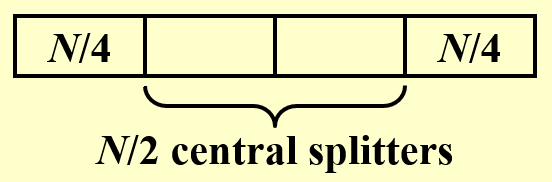

# Lec 13: Randomized Algorithms

## Introduction

用算法解决问题时，什么东西是能被随机化(randomize)的呢？

- **数据**的随机化：传统的算法可根据随机生成的输入数据得到结果
    - 由于数据是随机的（可以理解为数据是等概率分布的），因此对这种算法的分析称为**平均情况分析**(average-case analysis)
- **算法**的随机化：算法在处理最坏情况的输入时会做出**随机的决策**
    - 我们称这样的算法为**随机化算法**(randomized algorithm)，这便是本讲将会介绍的话题~

为何需要随机化？

- 事实上，我们可以将那些始终能够得到正确答案的、高效可确定(efficient deterministic)的算法（就是传统意义上的算法）视为随机化算法的一种**特殊情况**
- 随机化算法的分类：
    - 高效性：只需在**较高概率**下得到正确解的**高效**随机化算法
    - 确定性：只需在**预期**效率内始终得到**正确解**的随机化算法

??? example "例子"

    在分布式的系统中，对所有进程进行**对称分解**(symmetry-breaking)这一随机化算法，实现整个系统的负载均衡(load balance)，这种方法相对比较简单。

为了便于下面的分析，我们先定义了一些量：

- $Pr[A]$：事件$A$发生的**概率**
- $\overline{A}$：事件$A$的**补**(complement)，可以得到：$Pr[A] + Pr[\overline{A}] = 1$
- $E[X]$：随机变量$X$的**期望**(expectation)
    - $E[X] = \sum\limits_{j = 0}^{\infty} j \cdot Pr[X = j]$

??? info "蒙特卡罗法(Monte Carlo Method) vs 拉斯维加斯法(Las Vegas Algorithm)"

    |特点|蒙特卡罗法|拉斯维加斯法|
    |:-|:-|:-|
    |结果准确性|近似解|确定解|
    |执行时间|确定|不确定|
    |应用场景|近似计算、物理模拟等|需精确解的问题|
    |随机性作用|控制精度（越多越准）|优化执行效率|

    我们也可以将两种方法结合在一起使用：外层使用蒙特卡罗法，内层使用拉斯维加斯法，这样可以确保在有限时间内总是得到正确解。


!!! note "一些结论"

    - 如果某个随机化算法的预期时间复杂度为$T_1$，那么存在某些情况，执行该算法所需时间复杂度$T_2 \ge T_1$（与摊还复杂度很像）
    - 对于所有的随机化算法，最坏情况下的运行时间并不一定等于预期的运行时间
    - 在n重伯努利实验中，令成功的概率为$p$，则到第一次成功前的预期实验次数为$\dfrac{1}{p}$（实际上是一个[几何分布](https://en.wikipedia.org/wiki/Geometric_distribution)）

## Examples

### Hiring Problems

!!! question "问题描述"

    - 在$N$天时间内，某个公司需要每天面试一位不同的候选人
    - 规定：面试成本$C_i \ll$雇佣成本$C_h$
    - 这里我们并不关心算法的运行时间，而是关注面试和雇佣的**成本**
        - 假设雇佣了$M$人，那么总成本为$O(NC_i + MC_h)$

???+ failure "简单的想法"

    !!! code "代码实现"

        ```c
        int Hiring(EventType C[], int N) {
            // candidate 0 is the least-qualified dummy candidate
            int Best = 0;
            int BestQ = the quality of candidate 0;
            for (i = 0; i <= N; i++) {
                Qi = interview(i);    // Ci
                if (Qi > BestQ) {
                    BestQ = Qi;
                    Best = i;
                    hire(i);          
                    // Ch
                }
            }
            return Best;
        }
        ```

    - 采取的策略是：每次能被雇佣的候选者需要有高于已被雇佣的候选者的能力
    - 最坏情况：候选者根据能力大小按顺序进行面试，那么每个人都会被雇佣，因此时间复杂度为$O(NC_h)$（由于$C_i$很小，直接忽略掉）


#### Offline Algorithm

下面我们来考虑数据随机分布的情况：

- 假设候选者是按随机的能力顺序依次面试的，且规定：前$i$个候选者等可能地具备最佳能力
- 令$X$为雇佣人数，那么$E(X) = \sum\limits_{j=1}^N j \cdot Pr[X = j]$，接下来需要确定$Pr[X = j]$的值
- 令$X_i = \begin{cases}1 & \text{if candidate } i \text{ is hired} \\ 0 & \text{if candidate } i \text{ is NOT hired}\end{cases}$，那么$E[X_i] = Pr[\text{candidate } i \text{ is hired}] = \dfrac{1}{i}$
- 那么$E[X] = E[\sum\limits_{i=1}^N X_i] = \sum\limits_{i=1}^N E[X_i] = \sum\limits_{i=1}^N \dfrac{1}{i} = \ln N + O(1)$
- 所以总成本为$O(C_h \ln N + NC_i)$

基于上面给出的简单版本的代码，只需稍加修改，便可得到一个更为高效的随机化算法：

???+ code "代码实现"

    ```c hl_lines="6"
    int Hiring(EventType C[], int N) {
        // candidate 0 is the least-qualified dummy candidate
        int Best = 0;
        int BestQ = the quality of candidate 0;

        randomly permute the list of candidates; 

        for (i = 1; i <= N; i++) {
            Qi = interview(i);    // Ci
            if (Qi > BestQ) {
                BestQ = Qi;
                Best = i;
                hire(i);          
                // Ch
            }
        }
        return Best;
    }
    ```

我们仅需在处理数据前先对数据进行**随机排列**(permute)，即可得到随机排序的数据（而不再是一个假设），从而避免了最坏情况；但缺点在于随机排列数据需要额外的时间成本。

---
接下来我们来设计这个随机排列算法，大致思路是：为数组`A[]`的每个元素`A[i]`预先赋予一个**随机的优先值**`P[i]`，然后对数组进行排序。代码实现如下：

???+ code "代码实现"

    ```c
    void PermuteBySorting (ElemType A[], int N) {
        for (i = 1; i <= N; i++) 
            // makes it more likely that all priorities are unique
            A[i].P = 1 + rand() % (N * N * N);
        Sort A, using P as the sort keys;
    }
    ```

结论：假定数组元素的优先级都是唯一的，那么该算法能够产生一个基于原输入数据的**均匀随机排列**(uniform random permutation)（即等可能地从所有可能的排列中选取其中一种排列）。


#### Online Algorithm

之前介绍的算法都是离线算法(offline algorithm)，即正式处理数据前需要知道所有的输入数据，它虽然能够确保计算结果总是正确的，但是效率并不是很高。现在我们考虑一种更高效的**在线算法**(online algorithm)，代码如下所示：

??? code "代码实现"

    ```c
    int OnlineHiring(EventType C[], int N, int k) {
        int Best = N;
        int BestQ = -Infinity;
        
        for (i = 1; i <= k; i++) {
            Qi = interview(i);
            if (Qi > BestQ) BestQ = Qi;
        }

        for (i = k + 1; i <= N; i++) {
            Qi = interview(i);
            if (Qi > BestQ) {
                Best = i;
                break;
            }
        }

        return Best;
    }
    ```

该算法的大致思路是：

- 先面试前k个候选者，找到他们之中最高的能力值，但并不会雇佣他们；
- 然后面试后面的候选者，以先前确定的最高能力值作为阈值筛选这些候选者，如果高于这个阈值，就雇佣这个人并不再面试后面的人。

对于该算法，我们需要探讨两个问题：

- 对于给定的$k$，我们能雇佣到能力最高的候选者的概率是多少？
    - 记$S_i$为事件“第i位候选者的能力最佳”
    - 如何让事件$S_i$发生的：$\{A \cap B\}$
        - 事件$A$：能力最佳的人在位置$i$
        - 事件$B$：位置为$i$的候选人被雇佣。此时前i-1个人里面，能力最佳的人出现在位置1\~k之间，这样的话位置k+1\~i-1之间的候选者不会被雇佣，从而确保第i个人被雇佣
        - 两个时间是独立的
    - 计算概率：

        $$
        \begin{align}
        Pr[S_i] & = Pr[A \cap B] = \underbrace{Pr[A]}_{\frac{1}{N}} \cdot \underbrace{Pr[B]}_{\frac{k}{i - 1}} = \dfrac{k}{N(i - 1)} \notag \\
        Pr[S] & = \sum\limits_{i=k+1}^N Pr[S_i] = \sum\limits_{i=k+1}^N \dfrac{k}{N(i-1)} = \dfrac{k}{N} \sum\limits_{i=k}^{N-1}\dfrac{1}{i} \notag
        \end{align}
        $$


    - 根据不等式$\int_k^N \dfrac{1}{x} \text{d}x \le \sum\limits_{i=k}^{N-1} \dfrac{1}{i} \le \int_{k-1}^{N-1} \dfrac{1}{x}\text{d}x$，最终可以得到：

    $$
    \dfrac{k}{N} \ln(\dfrac{N}{k}) \le Pr[S] \le \dfrac{k}{N} \ln (\dfrac{N - 1}{k - 1})
    $$

- 最佳的$k$值（即能够得到最大的概率）是多少？
    - 根据前面的分析，可以将该问题转化为：求函数$f(k) = \dfrac{k}{N} \ln (\dfrac{N}{k})$的最大值下对应的$k$值
    - 对该函数求导，得$\dfrac{\text{d}}{\text{d}k}[\dfrac{k}{N} \ln (\dfrac{N}{k})] = \dfrac{1}{N} (\ln N - \ln k - 1) = 0$，解得$k = \dfrac{N}{e}$
    - 结论：通过上述算法雇佣到能力最佳的候选者的概率至少为$\dfrac{1}{e}$

!!! warning "注意"

    如果能力最佳的候选者出现在前$k$个人里面，那么这种在线算法就无法得到正确结果，因此该算法**无法保证**总是能够找到正确解。

!!! note "一些小结论"

    - 在线算法中，如果我们雇佣了能力超过前k个人的候选人之后继续寻找而不结束，那么预期雇佣人数为$\dfrac{N - k}{k + 1}$
        - 原因目前还没想通

### Randomized Quicksort

在FDS中，我们介绍的[**快速排序**](../fds/7.md#quicksort)(quicksort)是一种确定性(deterministic)的排序，它的时间复杂度为：

- $\Theta(N^2)$：最坏情况下的运行时间
- $\Theta(N \log N)$：平均情况下的运行时间

确定性的快排是基于每种输入排列是等可能分布的假设，因此它没有很好地处理最坏情况。要想避免最坏情况，可以用本讲学到的随机化算法来解决。随机化快排的关键在于——随机且均匀地挑选**支点**(pivot)，挑选原则为：

- **中心分离点**(central splitter)：一种较好的支点，它分开数据集后使得每个子集至少包含$\dfrac{N}{4}$的数据
    - 这样就可以消除支点出现在数据两端（相当于没有分）的最坏情况

    <div style="text-align: center">
        
    </div>

- 修改后的快速排序：在递归前始终能够选出一个中心分离点

结论：寻找中心分离点的预期迭代次数至多为2

- 解释：根据上面的示意图，不难发现从所有数据中随机选出合适中心分离点的概率为$\dfrac{1}{2}$（中间的一半数据），因此即使第1次挑选失败后，第2次就能选出正确的中心分离点

分析随机化快排的时间复杂度：

- 记子问题$S$的**类型**(type)为$j$（个人理解为<u>类型 = 快排的趟数</u>），可以得到不等式：$N(\dfrac{3}{4})^{j+1} \le |S| \le N(\dfrac{3}{4})^j$
    - $\dfrac{3}{4}$表示的是选择了最边上的中心分离点的情况，此时数据被分为了$\dfrac{1}{4}N$和$\dfrac{3}{4}N$两部分，我们更关心每趟快排后最大的子问题$S$

- 结论：对于类型$j$，至多有$(\dfrac{4}{3})^{j+1}$个子问题
    - 解释：这里用到了上面不等式的左半边——因为对于第$j$趟下的快排，最大子问题的最小规模为$N(\dfrac{3}{4})^{j+1}$，因此子问题最多有$\dfrac{N}{N(\frac{3}{4})^{j+1}} = (\dfrac{4}{3})^{j+1}$个

- 期望$E[T_{\text{type } j}] = O(N(\dfrac{3}{4})^j) \times (\dfrac{4}{3})^{j+1} = O(N)$
- 不同类型的个数（快排趟数）为$\log_{\frac{4}{3}}N = O(\log N)$
- 结合上面两条，随机化快排的时间复杂度为稳定的$O(N \log N)$（即使在最坏情况下也是这个复杂度）

>「类型」这个称呼好怪啊...

??? info "另一种随机化快排算法"

    先给出伪代码：

    ??? code "代码实现"

        ```c
        RandQSort(A, L, R) {
            if (L < R) {
                i = random(L, R);
                swap(A[i], A[R]);
                p = Partition(A, L, R);
                RandQSort(A, L, p - 1);
                RandQSort(A, p + 1, R);
            }
        }
        ```

    该算法也能给出稳定的$O(n \log n)$的时间复杂度，下面给出证明：

    ??? proof "证明"

        - `Partition()`函数至多会被调用n次（每个元素充当一次支点），而每次调用该函数时都会产生数据之间的比较，因此总的时间复杂度为$O(n + X)$，其中$X$为比较总数。那么下面就来证明$E(X) = O(n \log n)$
        - 思路是“从结果推过程”，即我们从排好序的元素$a_1 \le a_2 \le \dots \le a_n$来分析
        - 记事件$X_{ij}$为对$a_i, a_j(i < j)$两个元素进行比较。可以发现：只有当$a_i$或$a_j$被选为$a_i$到$a_j$之间的元素的支点时，$a_i$与$a_j$之间发生比较
        - 因此，$\begin{cases}p(X_{ij} = 1) = \dfrac{2}{j - i + 1} \\ p(X_{ij} = 0) = 1 - \dfrac{2}{j - i + 1}\end{cases}$，那么$E(X_{ij}) = \dfrac{2}{j - i + 1}$
        - 计算$E(X)$：

            $$
            \begin{align}
            E(X) & = E(\sum\limits_{i=1}^{n-1} \sum\limits_{j = i + 1}^n X_{ij}) \notag \\
            & = \sum\limits_{i=1}^{n-1} \sum\limits_{j = i + 1}^n \dfrac{2}{j - i + 1} \notag \\
            & < \sum\limits_{i=1}^{n-1} \sum\limits_{k = 2}^n \dfrac{2}{k} \notag \\
            & = n \cdot O(\log n) = O(n \log n) \notag
            \end{align}
            $$

            得证（$\log n$部分用到了幂级数的知识）。

### Other Examples

>摘录一些来自作业题/历年卷上的例子。

- 链表删除操作的随机化算法
    - 题目描述：给定N个节点的链表，要求删除链表中所有的节点
    - 算法：每一步我们随机挑选链表的一个节点，然后删去其后面的所有节点；重复上述步骤，直到链表为空
    - 预期删除次数：$\Theta(\log N)$，下面给出证明：

        ??? proof "证明"

            - 给链表节点按顺序标号为$1 \dots N$
            - 选择第$k$个节点，那么从它开始到后面的$N - k + 1$个节点都会被删除
            - 每一步中，预期删除的节点数为：

                $$
                \sum\limits_{k=1}^N (\dfrac{1}{N} \cdot (N - k + 1)) \approx \dfrac{N + 1}{2}
                $$

                也就是说，每次预期能够删除现有链表中一半的节点

            - 于是不难得出，删除次数为$\Theta(\log N)$

- [跳跃表](https://en.wikipedia.org/wiki/Skip_list)(skip list)
    - 推荐看这篇[博客](https://www.jianshu.com/p/9d8296562806)，介绍得相当清晰，适合新手学习
    - 查找、插入、删除的时间复杂度均为$O(\log N)$


