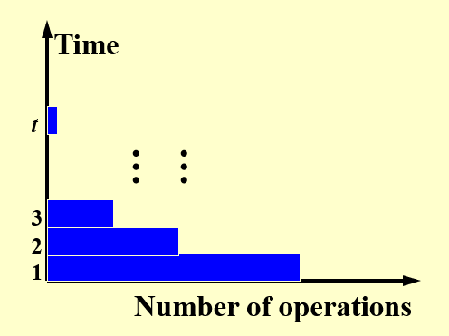

# Lec 14: Parallel Algorithms

## Introduction

实际上，我们在前面所学的所有算法都属于**顺序算法**(sequential algorithms)，这类算法的特点是<u>每步只完成一个操作</u>。要想提升算法的速度，除了可以设计更快的算法（降低时间复杂度）外，还可以采用**并行**的方法。

所谓**并行**(parallelism)，就是指<u>每一步能够同时完成多个操作</u>。有以下几类并行方式：

- 指令级并行：在一个CPU内，多条指令可以同时执行，包括了[计组](../../system/co/index.md)课程中提到过的流水线CPU、乱序、多发射等（后面两者将会在体系课程中详细介绍）。
- 数据级并行：将相同的操作数同时应用于一些数据项，比如SIMD(single instruction, multiple data)架构（也会在体系课程中详细介绍）
- 线程级并行：通过多个线程同时执行任务来提高程序的并发性能，线程独立运行但共享同一进程的资源，以实现高效计算。
    - 本讲所要介绍的**并行算法**(parallel algorithms)属于此类，常用的并行算法模型有：
        - **并行随机访问机**(parallel random access machine, PRAM)
        - **工作-深度**(work-depth, WD)（~~还是记英文好~~）

### PRAM Model

下面给出PRAM模型的图示：

<div style="text-align: center">
    
</div>

- $P_1, \dots, P_n$表示$n$个处理器，它们同时访问一块共享内存
- 每个处理器与共享内存间的双向箭头表示**单位时间内对内存的访问**（包括读、写、计算等操作）
    - 具体来说，向上的箭头表示读取，向下的箭头表示写入

???+ example "例子"

    === "例1"

        处理器i执行操作：`c := a + b`

        <div style="text-align: center">
            
        </div>

    === "例2"

        ```c
        // 将每个处理器的结果写入到内存对应位置上
        for P_i, 1 <= i <= n pardo
            A(i) := B(i)
        // pardo: do parallelly，即并行执行循环
        // 因此实际上执行这个循环所需时间为 O(1)
        ```

        <div style="text-align: center">
            
        </div> 

不难发现，这个模型存在一个问题：如果多个处理器同时访问同一块内存（冲突发生），那么如何处理这个冲突呢？下面给出几种解决方案：

- 专一读取--专一写入(exclusive-read exclusive-write, EREW)：顾名思义，同一时间内不允许多个处理器访问（读/写）同一块内存
- 并发读取--专一写入(concurrent-read exclusive-write, CREW)
- 并发读取--并发写入(concurrent-read concurrent-write, CRCW)，此时还有三种不同的写入规则：
    - **任意**(arbitrary)规则：任意选择一个处理器进行写入操作
    - **优先级**(priority)规则：选择编号最小的处理器（规定编号越小优先级越高）进行写入操作
    - **共同**(common)规则：只有当所有处理器的写入数据是一致的时候，才会执行写入操作

???+ example "例子：求和问题"

    === "题目"

        - 输入：$A(1), A(2), \dots, A(n)$（来自内存的数据）
        - 输出：$A(1) + A(2) + \dots + A(n)$

    === "分析"

        下面给出用PRAM模型计算此题的过程图示：

        <div style="text-align: center">
            
        </div> 

        - 最底层表示初始情况，每层表示并行算法的每个步骤
        - 每层都有8个处理器，空白圆圈表示空闲的处理器
        - 观察发现，整个过程中所有工作的处理器构成了一棵满二叉树
            - 因此层数为$\log n$，即该算法在$\log n$时间内完成
        - $B(h, i)$表示第$h$步中第$i$个处理器的计算结果
            - 有以下关系式成立：$B(h, i) = B(h - 1, 2i - 1) + B(h - 1, 2i)$

        伪代码如下所示：

        ```c hl_lines="5"
        for P_i, 1 <= i <= n pardo
            B(0, i) := A(i)
            for h = 1 to log(n) do
                if i <= n / 2^h:
                    B(h, i) := B(h - 1, 2 * i - 1) + B(h - 1, 2 * i)
                else
                    stay idle
            if i = 1:
                output B(log(n), 1)
            else:
                stay idle
        ```

        - 关于高亮部分：上层的节点需要知道下层的两个节点值才能计算。由于外层循环是并行计算的，这也就意味着这棵树上同一层的节点是同时算出来的，因此高亮部分的操作是可行的。
        - 时间复杂度：$T(n) = \log n + 2$

根据上面对例子的分析，我们可以得出关于操作数量和时间之间的关系图：

<div style="text-align: center">
    
</div> 

- 横轴上的最大值为$p$，等于用到过的处理器的最大数量
- 纵轴上的最大值为$t$，表示总的运行时间
- 每个横条表示一个阶段（单位时间），蓝色部分表示工作的处理器，灰色部分表示空闲的处理器

!!! bug "PRAM模型的缺陷"

    - 该模型无法揭示算法和实际使用的处理器个数之间的关系
        - 对于上个例子，假如有100个处理器，但实际上只用了8个处理器，所以更多的处理器并不能使执行速度进一步加快
    - 该模型需要指定哪个处理器处理哪部分的指令，这时就需要知道一些可能不太必要的细节（？）


### WD Model

???+ example "接着上面的例子"

    如果用的是WD模型，那么伪代码将会改写为如下形式：

    ```c hl_lines="4 6"
    for P_i, 1 <= i <= n pardo
        B(0, i) := A(i)
    for h = 1 to log(n) do
        for P_i, i <= n / 2^h pardo
            B(h, i) := B(h - 1, 2 * i - 1) + B(h - 1, 2 * i)
    for i = 1 pardo
        output B(log(n), 1)
    ```

    与PRAM的不同之处在于高亮的两个语句，这里用到的是并行处理的方式（`pardo`），而且不再显式指出不工作的处理器。

因此对应的操作数量和时间之间的关系图变成了：

<div style="text-align: center">
    
</div> 

由于没有了那些灰色区域（不工作的处理器），因此这张图更清楚地反映了真实情况下各个时间段内的用到的处理器数量。对于更一般的情况，如下所示：

<div style="text-align: center">
    
</div> 

可以看到，每个时间段处于工作状态的处理器数量，即工作量是不一样的，且没有任何规律可言。

### Measurement

衡量PRAM模型下并行算法的性能的一些指标：

- $W(n)$：**工作量**(workload)，即运行并行算法所需的总操作数目
- $T(n)$：最坏情况下的运行**时间**
- $P(n) = \dfrac{W(n)}{T(n)}$：所需处理器的数量
- 当所需处理器数量$p \le \dfrac{W(n)}{T(n)}$时，所需时间为$\dfrac{W(n)}{p}$
- 使用任意数量为$p$的处理器时，所需时间为$\dfrac{W(n)}{p} + T(n)$

后面那三个指标实际上是**渐进等价的**(asymptotically equivalent)，即对于任意大的$n$，这三者位于同一复杂度下。

???+ example "又回到上面的例子（求和问题）"

    - $T(n) = \log n + 2$
    - $W(n) = n + \dfrac{n}{2} + \dfrac{n}{2^2} + \dots + \dfrac{n}{2^k} + 1 = 2n$，其中$2^k = n$

**WD表示法充分性定理**(WD-presentation sufficiency theorem)：用WD模型表示的算法能够被任意$P(n)$个处理器在$O(\dfrac{W(n)}{p} + T(n))$时间内实现，此时采用与WD表示法相同的并发写入规则。（？？？）

!!! note "结论（类似上面的定理，~~但至少是我看得懂的~~）"

    采用WD模型的并行算法，$p( > 0)$个处理器的并行执行时间范围为：
    
    $$
    \dfrac{W}{p} \le T_p \le \dfrac{W - D}{p} + D
    $$
    
    其中$W$为工作量，$D$为（分析并行算法时用的满二叉树）深度，也就是单个处理器最坏情况下的执行时间。

    ??? proof "证明"

        >来自wyy的讲义

        - 下界是显然的，故不做赘述
        - 对于上界
            - 工作量$W = \sum\limits_{i=1}^D W_i$，其中$W_i$为每个时间阶段内的工作量
            - 而每个阶段的执行时间为$\lceil \dfrac{W_i}{p} \rceil$（向上取整，不足一个完整任务应视为一个完整任务）
            - 故总时间$T_p = \sum\limits_{i=1}^D \lceil \dfrac{W_i}{p} \rceil = \sum\limits_{i=1}^D (\lfloor \dfrac{W_i - 1}{p} \rfloor + 1) \le \sum\limits_{i=1}^D ( \dfrac{W_i - 1}{p} + 1) = \dfrac{W - D}{p} + D$


虽然PRAM模型和WD模型本质上没有太大的区别，但是WD模型可以反映算法与处理器数量之间的关系，因此效果会更好。

!!! bug "误区"

    - 并行算法的运行时间和工作量并不一定始终比（解决同一问题的）顺序/串行算法来的小

## Examples

### Prefix-Sums

!!! question "问题描述"

    - 输入：$A(1), A(2), \dots, A(n)$
    - 输出：$\sum\limits_{i=1}^1A(i), \sum\limits_{i=1}^2A(i), \dots, \sum\limits_{i=1}^nA(i)$

解决这个问题的方法与前面的求和问题是类似的，首先还是借助一棵平衡二叉树模型来分析：

<div style="text-align: center">
    
</div> 

我们可以先计算求和问题，为之后前缀和问题的解决打下基础。

接下来，我们规定**前缀和**$C(h, i) = \sum\limits_{k=1}^\alpha A(k)$，其中$(0, \alpha)$表示二叉树的节点$(h, i)$最右侧路径上的叶子节点的位置。要得到$C(h, i)$的值，需要分以下情况讨论：

=== "Case 1"

    <div style="text-align: center">
        
        
    </div> 

    计算最左边路径上的节点：

    ```c
    if (i == 1)
        C(h, i) := B(h, i)
    ```

=== "Case 2"


    <div style="text-align: center">
        
    </div>

    计算每一层偶数位上的节点：

    ```c
    if (i % 2 == 0)
        C(h, i) := C(h + 1, i / 2)
    ```

=== "Case 3"

    <div style="text-align: center">
        
    </div>

    计算除最左边路径外每一层奇数位上的节点：

    ```c
    if (i % 2 == 1 && i != 1)
        C(h, i) := C(h + 1, (i - 1) / 2) + B(h, i)
    ```

    注意到计算$C(h, i)$时并没有利用与它同一级上的节点，这是因为每层都是并行计算的，因此只能利用上一级的计算值以及自身的值。

---
总结一下：我们先**自底向上**计算求和问题，然后根据求和问题的结果**自顶向下**计算前缀和问题，这两趟计算都用到了并行算法。

伪代码如下所示：

???+ code "代码实现"

    ```c
    // Same as summation problem
    for P_i, 1 <= i <= n pardo
        B(0, i) := A(i)
    for h = 1 to log(n)
        for i, 1 <= i <= n / 2^h pardo
            B(h, i) := B(h - 1, 2 * i - 1) + B(h - 1, 2 * i)

    // Now calculate the prefix sum problem
    for h = log(n) to 0
        for i even, 1 <= i <= n / 2^h pardo
            C(h, i) := C(h + 1, i / 2)
        for i = 1 pardo
            C(h, 1) := B(h, 1)
        for i odd, 3 <= i <= n / 2^h pardo
            C(h, i) := C(h + 1, (i - 1) / 2) + B(h, i)
    for P_i, 1 <= i <= n pardo
        Output C(0, i)
    ```

- 时间复杂度：$T(n) = O(\log n)$
- 工作量：$W(n) = O(n)$

??? info "补充：变种问题——求前缀最小值"

    顾名思义，$\forall i \in [1, n]$，求序列$A(1), A(2), \dots, A(i)$中的最小值。下面直接给出并行算法的伪代码：

    ??? code "伪代码"

        ```c hl_lines="13"
        for i, 1 <= i <= n pardo
            B(0, i) = A(i)
        for h = 1 to log(n)
            for i, 1 <= i <= n / 2^h pardo
                B(h, i) = min(B(h - 1, 2 * i - 1), B(h - 1, 2 * i))

        for h = log(n) to 0
            for i even, 1 <= i <= n / 2^h pardo
                C(h, i) = C(h + 1, i / 2)
            for i = 1 pardo
                C(h, 1) = B(h, 1)
            for i odd, 3 <= i <= n/2^h pardo
                C(h, i) = min(C(h + 1, (i - 1)/2), B(h, i))
        for i, 1 <= i <= n pardo
            Output C(0, i)
        ```

        与求前缀和的算法相比，几乎一模一样（高亮行是唯一的区别）。

    - 时间$T = O(\log N)$
    - 工作量$W = O(N)$


### Merging

!!! question "问题描述"

    合并两个非递减的数组$A(1), A(2), \dots, A(n)$和数组$B(1), B(2), \dots, B(m)$至另一个非递减的数组$C(1), C(2), \dots, C(n + m)$。

为了简化后面的分析，我们规定：

- <u>数组的索引从1开始</u>
- 数组$A, B$之间没有重复元素
- 令$n = m$
- $\log n, \dfrac{n}{\log n}$的结果均为整数

>即使没有这个规定，后面的分析也同样适用于一般的情况。

解决该问题用到的关键方法：**划分**(partition)。下面介绍一下划分的范式(paradigm)：

- **划分**：将输入数据划分为$p$（很大的数字）个独立的小任务，每个小任务的规模大致为$\dfrac{n}{p}$
- **实际的工作**：并发执行这些小任务，对于每个小任务使用（顺序）算法来解决

我们可以将合并问题进一步转化为**排行**问题(ranking)，规定数组$B$中第$j$个元素在数组$A$中的排行为：

$$
\text{RANK}(j, A) = \begin{cases}i & \text{if } A(i) < B(j) < A(i + 1), \text{for } 1 \le i < n \\ 0 & \text{if } B(j) < A(1) \\ n & \text{if } B(j) > A(n)\end{cases}
$$

那么排行问题可以被描述为$\text{RANK}(A, B)$，此时需要计算的东西为：$\forall 1 \le i \le n$，计算$\text{RANK}(i, B)$和$\text{RANK}(i, A)$。伪代码如下所示：

???+ code "代码实现"

    ```c
    for P_i, 1 <= i <= n pardo
        C(i + RANK(i, B)) := A(i)
    for P_i, 1 <= i <= n pardo
        C(i + RANK(i, A)) := B(i)
    ```

??? example "例子"

    === "题目"

        对以下两个数组，先分别给出它们的排行，然后合并这两个数组。

        <div style="text-align: center">
            
        </div>

    === "答案"

        <div style="text-align: center">
            
        </div>

结论：<u>根据排行问题给出的解</u>，**合并问题**（不是排行问题）可以在$O(1)$时间内得到结果，且工作量为$O(n + m)$。所以该算法的速度非常快，但是工作量没有得到优化。

???+ info "具体解决排行问题的方法"

    === "二分查找"

        ```c
        for P_i, 1 <= i <= n pardo
            RANK(i, B) := BS(A(i), B)
            RANK(i, A) := BS(B(i), A)
        ```

        - 时间复杂度：$T(n) = O(\log n)$
        - 工作量：$W(n) = O(n \log n)$
        - 用到的处理器数：$p = n$


    === "顺序排行"

        ```c
        i = j = 0
        while (i <= n || j <= m)
            if (A(i + 1) < B(j + 1))
                RANK(++i, B) = j;
            else 
                RANK(++j, A) = i;
        ```

        - 时间复杂度：$T(n) = O(n + m)$
        - 工作量：$W(n) = O(n + m)$
        - 用到的处理器数：$p = 1$


    但这些方法都不太好......

---
改进方案：**并行排行**(parallel ranking)

- 假设$n = m$，且确保$A(n + 1), B(n + 1)$比$A(n), B(n)$都要大
- 第一步：划分，令处理器数量$p = \dfrac{n}{\log n}$，对$1 \le i \le p$，有：
    - $A_{\text{Select}}(i) = A(1 + (i - 1)\log n)$
    - $B_{\text{Select}}(i) = B(1 + (i - 1)\log n)$
    - 计算每一个（根据上面两个式子）被选中的排行

- 第二步：实际排行
    - 划分以后，整个问题被分为至多有$2p$个规模为$O(\log n)$的子问题

??? example "例子"

    === "原数组"

        <div style="text-align: center">
            
        </div>

    === "选中元素"

        <div style="text-align: center">
            
        </div>

    === "对这些元素进行排行"

        <div style="text-align: center">
            
        </div>

    === "得到子问题"

        <div style="text-align: center">
            
        </div>

        绿色部分表示一个个的子问题（~~这样表示有点丑~~）

分析：

- 划分：
    - 时间：$T = O(\log n)$
    - 工作量：$W = O(p \log n) = O(n)$

- 实际排行：
    - 时间：$T = O(\log n)$
    - 工作量：$W = O(p \log n) = O(n)$

- 总结：
    - 时间：$T = O(\log n)$
    - 工作量：$W = O(p \log n) = O(n)$


### Maximum Finding

!!! question "问题描述"

    从$n$个元素中找到最大值


#### Naive Ideas

!!! note "一些朴素的解题方法"

    === "求和问题算法的改版"

        伪代码就不给了，结论为：

        - 时间：$T(n) = O(\log n)$
        - 工作量：$W(n) = O(n)$

    === "比较所有的元素对"

        伪代码如下所示：

        ???+ code "代码实现"

            ```c
            for P_i, 1 <= i <= n pardo
                B(i) := 0
            for i and j, 1 <= i, j <= n pardo
                if (A(i) < A(j) || A(i) == A(j) && i < j)
                    B(i) = 1
                else
                    B(j) = 1
            for P_i, 1 <= i <= n pardo
                if B(i) == 0
                    A(i) is a maximum in A
            ```

        - 时间：$T(n) = O(1)$
        - 工作量：$W(n) = O(n^2)$

        !!! bug "问题"

            由于是并行比较$O(n^2)$对元素，因此不可避免地会出现多个处理器访问相同元素的冲突。

            解决方案：**PRAM模型-CRCW策略-共同规则**（当所有处理器写入相同的数据时才能进行写入操作）


#### Doubly-Logarithmic Paradigm

我们利用前面提到过的划分范式来改进并行算法。

???+ info "根据上一种算法想到的划分方式"

    我们看到，上一种算法中还有一个问题是：虽然时间降为常数级了，但是工作量变成二次的了。所以我们希望通过划分来降低工作量。因此，我们先尝试将问题划分为$\sqrt{n}$个规模为$\sqrt{n}$的子问题：

    - $A_1 = A(1), \dots, A(\sqrt{n}) \quad \Rightarrow M_1$
    - $A_2 = A(\sqrt{n} + 1), \dots, A(2 \sqrt{n}) \quad \Rightarrow M_2$
    - ......
    - $A_{\sqrt{n}} = A(n - \sqrt{n} + 1), \dots, A(n) \quad \Rightarrow M_{\sqrt{n}}$

    最后从每个子问题得到的最大值$M_1, M_2, \dots M_{\sqrt{n}}$中选取最大值为$A_{max}$

    分析：

    - 对于每个子问题，采用顺序算法找最大值，因此所需时间为$T(\sqrt{n})$，工作量为$W(\sqrt{n})$
    - 从这些子问题的最大值寻找整个问题的最大值时，采用两两比较的方式，因此所需时间为$T(1)$，工作量为$W((\sqrt{n})^2) = O(n)$
    - 由于是并行解决$\sqrt{n}$个子问题，因此对于总问题而言，有以下递推式成立：
        - $T(n) \le T(\sqrt{n}) + c_1$（$c_1 = O(1)$）
        - $W(n) \le \sqrt{n}W(\sqrt{n}) + c_2 n$（$c_2 = O(n)$）

    - 根据递推式，最终解得：
        - 时间：$T(n) = O(\log \log n)$
        - 工作量：$W(n) = O(n \log \log n)$

    可以看到，虽然工作量下降了，但是所需时间却变多了，因此这种改进方法还是不太好。

再来看一种称为**双对数范式**(doubly-logarithmic paradigm)的划分。我们假设$h = \log \log n$为整数，此时$n = 2^{2^h}$。现在将问题划分为$\dfrac{n}{h}$个规模为$h$的子问题：

- $A_1 = A(1), \dots, A(h) \quad \Rightarrow M_1$
- $A_2 = A(h + 1), \dots, A(2h) \quad \Rightarrow M_2$
- ......
- $A_{\frac{n}{h}} = A(n - h + 1), \dots, A(n) \quad \Rightarrow M_{\frac{n}{h}}$

最后从每个子问题得到的最大值$M_1, M_2, \dots M_{\frac{n}{h}}$中选取最大值为$A_{max}$

分析：

- 对于每个子问题，所需时间为$T(h)$，工作量为$W(h)$
- 根据对之前划分的分析，最终解得：
    - 时间：$T(n) = O(h + \log \log \dfrac{n}{h}) = O(\log \log n)$
    - 工作量：$W(n) = O(h \cdot \dfrac{n}{h} + \dfrac{n}{h} \log \log \dfrac{n}{h}) = O(n)$

相比前一种划分而言，这次终于将工作量压到了线性复杂度，但是还是没能保住原来常数级的时间。


#### Random Sampling

我们采用更为高效的划分范式：**随机采样**(random sampling)，其具体步骤如下：

- 这里采用的是**PRAM模型-CRCW策略-任意规则**（任意选择处理器进行写入操作）
- 先从数组$A$中的$n$个元素中挑选$n^{\frac{7}{8}}$个元素出来，形成数组$B$

<div style="text-align: center">
    
</div>

- 将数组$B$划分为多个大小为$n^{\frac{1}{8}}$的小块，因此有$n^{\frac{3}{4}}$个这样的小块。然后对每个小块求出最大值，通过两两比较的方式得到了$n^{\frac{3}{4}}$个局部最大值

<div style="text-align: center">
    
</div>

- 接下来将这些最大值划分为$n^{\frac{1}{2}}$个大小为$n^{\frac{1}{4}}$的小块，然后对每个小块求出最大值，进而通过两两比较的方式得到所有$n^{\frac{7}{8}}$个元素的最大值

<div style="text-align: center">
    
</div>

分析：

- 第1次划分：
    - 时间：$M_i^{(1)} \sim T = O(1) \Rightarrow T(n) = O(1)$
    - 工作量：$W_i = O((n^{\frac{1}{8}})^2) = O(n^{\frac{1}{4}}) \Rightarrow W(n) = O(n)$

- 第2次划分：
    - 时间：$M_i^{(2)} \sim T = O(1) \Rightarrow T(n) = O(1)$
    - 工作量：$W_i = O((n^{\frac{1}{4}})^2) = O(n^{\frac{1}{2}}) \Rightarrow W(n) = O(n)$

- 总结：
    - 时间：$M(n^{\frac{7}{8}}) \sim T = O(1)$
    - 工作量：$W_i = O(n)$

伪代码：

```c
while (there is an element larger than M) {
    for (each element larger than M)
        Throw it into random place in new B(n^{7/8})
    Compute a new M;
}
```

!!! warning "注意"

    由于是随机挑选的，因此这个算法并不保证始终得到正确结果，但是得到正确结果的概率相当大（失败概率为$O(\dfrac{1}{n^c})$，其中$c$为正常数；或者也可以记作$O(n^c)$，但此时$c$为负常数）。