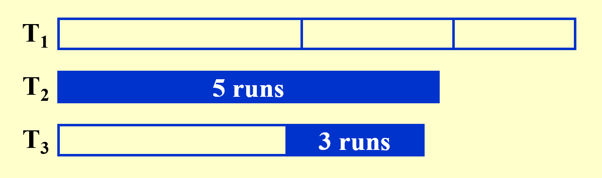
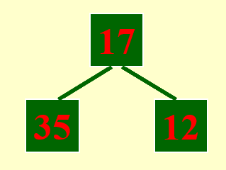

# Lec 15: External Sorting

## Introduction

在FDS中，我们介绍过一系列经典的[排序算法](../fds/7.md)，实际上这些算法都是在主存(main memory)运行的内部排序，在数据量不大（即主存能够容纳所有待排序数据）的情况下可以顺利地完成排序工作。

然而，一旦数据量很大，主存无法容下所有待排序数据时，就需要用到本讲要介绍的**外部排序**(external sorting)算法了。所谓“外部”，就是要用到**磁盘**的空间了。磁盘相比主存空间更大，但访问速度更慢，举个例子：若要访问数组的某个元素`a[i]`，它们所需的时间分别为：

- 主存：$O(1)$（用索引寻找，随机访问）
- 磁盘：找到元素所在的迹(track) -> 找到对应的区(sector)（磁盘存储信息的最小单位）-> 找到元素`a[i]`并传输数据
    - 这一过程的快慢取决于设备的性能（可以在我的计组笔记找到对应的[例子](../../system/co/5.md#memory-technologies)）
    - 要想提升访问速度，我们应尽可能让磁盘读写头沿着一个方向移动，以避免磁盘频繁的旋转

回顾前面学过的排序算法，我们发现[**归并排序**](../fds/7.md#mergesort)(mergesort)是最适合作为外部排序的算法。为了简化后续的分析过程，我们假定：

- 存储数据集的容器称为**磁带**(tape)，里面的元素只能按顺序访问（这符合磁盘读写头的特性）
- 至少需要使用3个磁带（2个子序列合并成1个更大的序列）
- 在主存中排好序的一组数据块称为**run**（没有确切的中文表达，悲）
- **趟**(pass)：在归并排序中指的是对所有数据进行一趟遍历、排序、合并成更大的run的过程
>自认为还是描述的不够准确，感觉很难说清楚这个概念...

???+ example "例子"

    === "题目"

        假设主存一次最多只能处理$M = 3$条记录，请通过外部排序算法（归并排序）来实现对以下序列的排序：

        <div style="text-align: center">
            
        </div> 

    === "分析"

        本题我们用到了3 + 1 = 4条磁带。

        === "Pass 1"

            <div style="text-align: center">
                
            </div> 

            - 由于一次最多只能对3条记录进行排序，所以将原序列分为若干组，每组有3条记录，一组组地进行排序（排序算法任意）
            - 为了将一些小的run合并成一个大的run，我们不能将排好序的组（即一个run）放入同一个磁带内，而要分开来放，这里规定相邻的两个run放在不同的磁带内

        === "Pass 2"

            <div style="text-align: center">
                
            </div>

            这里开始合并 + 排序的操作了，注意还是要放在两个不同的磁带里（可以利用原有的空闲磁带） 

        === "Pass 3"

            <div style="text-align: center">
                
            </div> 

            - 进一步的合并 + 排序！
            - 离排序完成仅差一步，但这里就不给出最后的效果图了（~~因为cy的PPT里没有~~）

**结论**：若要对$N$条记录进行外部排序，且主存最多对$M$条记录进行排序，那么需要的**趟数**(number of passes)为$1 + \lceil \log_2 \dfrac{N}{M}\rceil$。

在设计外部排序的时候，我们会关心以下问题：

- **寻找**时间——$O(\text{number of passes})$
- **读/写**一个记录**块**（一组记录集）的时间
- 对$M$条记录进行**内部排序**的时间
- 从输入缓存（就是磁带）**合并**$N$条记录到输出缓存所需的时间

要实现外部排序，需要解决以下问题：

- 减少趟的数量
- 合并run（一组排好序的记录）
- 用并行算法处理缓存
    - 注意：计算机可以并行处理I/O和CPU
- 生成run

!!! bug "外部排序的缺陷"

    - 排序过程中需要用到多个临时文件，管理这些文件可能需要耗费较多的时间。
    - 瓶颈：I/O时间过慢，因此优先提升内存与硬盘的访问速度。

## Pass Reduction

### k-way Merge

根据前面关于趟数的结论，要想减少趟数，一种很自然的想法便是增大对数函数的底数$k$（原来$k = 2$），也就是增加子序列的个数，下面以$k = 3$为例介绍改进后的归并排序：

???+ example "例子"

    待排序的序列同上例。下面直接给出分析过程：

    === "Pass 1"

        <div style="text-align: center">
            
        </div> 

        由于多出一路子序列，所以需要更多的磁带（下面还会用到其他额外的磁带）


    === "Pass 2"

        下面展示合并每个子序列的第1个run的过程：

        ???+ play "动画演示"

            <div style="text-align: center">
                
            </div> 

        由于需要同时比较三个数据，因此这里用到了**最小堆**这一数据结构，便于随时取出最小的数据，并加快比较速度。

        剩余部分的合并与之类似，故不再展示其详细过程。下面给出合并后的结果：

        <div style="text-align: center">
            
        </div> 

        本例中，第3个子序列为空，但为了一般性的解释，我们还是为第3个子序列预留了一个磁带。

        ??? info "拓展：使用[**锦标赛树**](https://en.wikipedia.org/wiki/Tournament_sort)比较数据"

            - 树的每个节点存的是数据的索引或地址，而非实际数据
            - 叶子结点表示每个run中待比较的节点，因此有k个叶子节点
            - 锦标赛树分为胜者树和败者树
                - 胜者树的内部节点存储“胜者”（较小值，如果是从小到大排序的话），因此根节点保存最小值
                - 败者树的内部节点存储“败者”（较大值），但是胜者还是会向上传递到父节点，因此根节点仍然是最小值
                - 虽然这两种形式的每趟比较效率均为$O(\log N)$，但是败者树的实际效率会更高些（即常数部分更小），因为败者树保留了之前的比较结果（败者信息），每次更新时可以跳过一些无意义的比较
            - 相比最小堆，锦标赛树的顺序结构更加稳定，数据之间的相对排序改变不大（而堆的插入和删除操作会打乱数据间的相对排序），因此锦标赛树表现更佳

    ---
    后续趟的处理过程与之类似，故不再赘述。


!!! abstract "总结"

    - 时间复杂度：
        - 不用最小堆（也就是对k个子序列进行顺序比较）：$O(kN \log_k N)$
            - 解释：关键点在于系数$k$（其他部分应该比较好理解），因为单次比较所需时间为$O(k)$，这是不可忽视的一个参数，需要算在时间复杂度内
            - $k$不是越大越好，因为当$k \rightarrow N$时，时间复杂度退化为 $\rightarrow O(N^2)$
        - 使用最小堆：$O(N \log_2 N)$
            - 解释：比较所需的时间降至$\log k$，因此时间复杂度为$O(\log k N \log_k N) = O(\log k N \dfrac{\log N}{\log k}) = O(N \log N)$
            - 所以堆的大小不影响时间复杂度
            - 但即便如此，$k$也不是越大越好，因为$k$的增大会增加I/O时间，在[缓存处理](#buffer-handling)一节中会有详细的解释
    - 趟数降至$1 + \lceil \log_k \dfrac{N}{M} \rceil$
    - 但所需的磁带数升至$2k$个，这可是一笔不小的开销啊，因此这种改进方法不太令人满意


### Polyphase Merge

我们希望在降低趟数的同时能够尽可能避免磁带数的提升，因此尝试一下在保持子序列个数不变的情况下减少所需磁带数，下面以$k=2$，磁带数 = 3（比原来的少一个）为例进行分析：

??? example "例子"

    === "题目"
    
        已知$k=2$，磁带数=3，且原序列的情况如下：

        <div style="text-align: center">
            
        </div>     

        “34个run”意味着原序列由34组内部已排好序的子序列构成。

    === "分析"

        === "Pass 1"

            <div style="text-align: center">
                
            </div>  

            我们现将原来的34个run均分为包含17个run的两个子序列，然后对它们进行合并，形成一个17个run的完整序列，此时每个run会包含更多排好序的记录。

        === "Copy 1"

            <div style="text-align: center">
                
            </div>  

            - 由于这么一趟下来后只有一条磁带里包含记录，为了继续合并，还是需要将所有的run一分为二。因此在进入下一趟操作前，需要将包含记录的磁带的一半的run拷贝到另一个空磁带上。
            - 但是对于磁盘来说，拷贝所需成本有些大，所以如果像这样简单地减少磁带数量，可能会带来更大的成本损耗。

这里给出一种更聪明的算法——**多相合并**(polymerge sort)，它的改进之处在于：在起始步的时候，对原序列进行**不均等的分割**，形成大小不一的子序列。这样可以确保在每一趟结束后，（除了最后阶段外）始终会有多个包含记录的子序列，因此无需额外高昂的拷贝操作。下面接着之前的例子来演示这一算法的执行过程：

???+ example "例子"

    题目：与上例相同。下面直接展示每一趟的结果（并带有部分分析）：

    === "Split"

        <div style="text-align: center">
            
        </div>  

        现将原序列划分为大小不一的两个子序列（34 -> 21 + 13）

    === "Pass 1"

        <div style="text-align: center">
            
        </div>  

        合并两个子序列后，还会剩下两个子序列，

        - 其中一个是刚合并好的结果序列（里面的run更大）其数量为原来更小的子序列的run的数量
        - 另一个是剩下未进行合并的子序列（里面的run更小）

        后续趟的操作与之类似，故后面只给出结果，不再分析详细过程。建议读者有时间的话可以自行画画看，然后再看后面给出的结果，这样有助于深入理解这个算法。

    === "Pass 2"

        <div style="text-align: center">
            
        </div>  

    === "Pass 3"

        <div style="text-align: center">
            
        </div>  

    === "Pass 4"

        <div style="text-align: center">
            
        </div>  

    === "Pass 5"

        <div style="text-align: center">
            
        </div>  

    === "Pass 6"

        <div style="text-align: center">
            
        </div>  

    === "Pass 7"

        <div style="text-align: center">
            
        </div>  

既然要不均匀地分割，那么怎么分才能达到上例呈现的效果呢？下面给出结论：

- 对于两路归并排序，如果序列中run的数量是一个**斐波那契数**$F_N$，那么最好的分割情况是将它分成包含$F_{N-1}$个run和$F_{N-2}$个run的子序列。
    - 如果初始run的数量不是一个斐波那契数的话也没有问题，只需找到离该数最接近的斐波那契数，然后按照这个斐波那契数的递推式将其分成两个子序列（注意其中一个子序列可能也不是斐波那契数）
- 对于$k$路归并排序，$F_N^{(k)} = F_{N-1}^{(k)} + \dots + F_{N-k}^{(k)}$，其中$F_N^{(k)} = 0(0 \le N \le k - 2), F_{k-1}^{(k)} = 1$
    - 因此，对于$k$路归并排序，只需要$k+1$个磁带就够了
    - 一般情况下，可能很难做到将run的数量划分为多个斐波那契数，但我们应确保有尽可能多的斐波那契数

### Replacement Selection

除了提升$k$值外，我们还可以尝试通过生成更长的run来减小趟数，这里我们用到一个称为**置换选择**(replacement selection)的算法来实现这一目标。

???+ example "例子"

    === "例1"

        === "题目"

            请基于下面给出的原序列生成较长的run：

            <div style="text-align: center">
                
            </div>  

        === "分析"

            === "Step 1"

                <div style="text-align: center">
                    
                </div>  

                该算法主要借助**最小堆**（大小为3）来生成run。先取出堆中最小的元素出来，作为第一个run的元素。

            === "Step 2"

                <div style="text-align: center">
                    
                </div>  

                每次从堆中删除元素时，需要比较这个被删除的元素与下一个进入堆的元素：

                - 如果前者更小，说明后者将会与前者处于同一个run内（本阶段符合这一情况）
                - 否则的话，后者要放在与前者不同的run内，且它不会与堆内和它处于不同run下的元素进行堆排序

            === "Step 3"

                <div style="text-align: center">
                    
                </div>

                现在就遇到了“否则”的情况了：12 < 81，因此12要放入新的run内，且它目前不会参与堆排序。

            === "Step 4"

                <div style="text-align: center">
                    
                </div>  

                还是“否则”的情况。

            === "Step 4.5"

                <div style="text-align: center">
                    
                </div>  

                现在，第一个run内的所有元素都从堆中出来了，那么此时堆中剩下的元素将会进入下一个run中。

            === "Step 5"

                <div style="text-align: center">
                    
                </div>  


            === "Step 6~n-1"

                ???+ play "动画演示"

                    <div style="text-align: center">
                        
                    </div>  

                由于后面大部分时间都是风平浪静的状态，所以这里就用一段动画快速跳过了，不做过多分析。

            === "Step n"

                <div style="text-align: center">
                    
                </div>  

                由于最后读进去的15比当时被删除的堆元素小，因此它会被放入第3个run内。

    === "例2"

        === "题目"

            Suppose that the replacement selection is applied to generate longer runs with a priority queue of size 5. Given the sequence of numbers {17, 2, 6, 57, 51, 86, 5, 94, 43, 54, 39, 87, 29}, the longest run contains ____ numbers.

        === "答案"

            最长的run有7个元素，我的答案是：

            - run 1: 2, 6, 17, 51, 57, 86, 94
            - run 2: 5, 39, 43, 54, 87
            - run 3: 29

结论：

- 用这种算法生成得到的run的**平均长度**$L_{\text{avg}} = 2M$
- 当序列的数据处于接近排好序的状态时，这种算法的表现就很不错

??? code "代码实现"

    - 输入：数据个数、堆的大小、数据
    - 输出：输出所有run内的数据，一行输出一个run

    ```c
    #include <limits.h>
    #include <stdio.h>
    #include <stdlib.h>

    #define MAXSIZE 100010

    struct element {
        int val;
        int run;
    };
    typedef struct element Element;

    struct heap {
        int size;
        Element * data;
    };
    typedef struct heap * Heap;

    typedef struct node * Node;
    struct node {
        int data;
        Node next;
    };

    struct queue {
        Node head;
        Node tail;
        int size;
    };
    typedef struct queue * Queue;

    void InitQueue(int m);
    void Enqueue(int data, Queue Q);
    Heap InitHeap();
    void PercolateUp(int p, Heap H);
    void PercolateDown(int p, Heap H);
    void Insert(Element x, Heap H);
    Element DeleteMin(Heap H);
    int cmp(Element a, Element b);

    Queue * arr;
    Heap H;

    int main() {
        int n, m;
        Element cur;
        Element tmp;
        Node curr;
        int data;
        int i, num, flag;

        scanf("%d%d", &n, &m);
        H = InitHeap();
        InitQueue(n);
        curr = (Node)malloc(sizeof(struct node));

        for (i = 0; i < n; i++) {
            scanf("%d", &data);
            tmp.val = data;
            if (H->size < m)
                tmp.run = 1;
            else {
                cur = DeleteMin(H);
                if (data >= cur.val)
                    tmp.run = cur.run;
                else
                    tmp.run = cur.run + 1;
                num = cur.run - 1;
                Enqueue(cur.val, arr[num]); 
            }
            Insert(tmp, H);
        }

        while (H->size > 0) {
            cur = DeleteMin(H);
            num = cur.run - 1;
            Enqueue(cur.val, arr[num]); 
        }

        for (i = 0; i < n; i++) {
            curr = arr[i]->head->next;
            flag = 0;
            while (curr != NULL) {
                flag = 1;
                if (curr == arr[i]->head->next)
                    printf("%d", curr->data);
                else
                    printf(" %d", curr->data);
                curr = curr->next;
            }
            if (flag)
                printf("\n");
        }

        return 0;
    }

    void InitQueue(int m) {
        int i;

        arr = (Queue *)malloc((MAXSIZE) * sizeof(Queue));
        for (i = 0; i < m; i++) {
            arr[i] = (Queue)malloc(sizeof(struct queue));
            arr[i]->head = (Node)malloc(sizeof(struct node));
            arr[i]->tail = (Node)malloc(sizeof(struct node));
            arr[i]->head->next = NULL;
            arr[i]->tail = arr[i]->head;
            arr[i]->size = 0;
        }
    }

    void Enqueue(int data, Queue Q) {
        Node cur = (Node)malloc(sizeof(struct node));

        cur->data = data;
        cur->next = Q->tail->next;
        Q->tail->next = cur;
        Q->tail = cur;
    }

    Heap InitHeap() {
        Heap H;

        H = (Heap)malloc(sizeof(struct heap));
        H->data = (Element *)malloc(MAXSIZE * sizeof(Element));
        H->size = 0;
        H->data[0].val = INT_MIN;
        H->data[0].run = 0;

        return H;
    }

    void PercolateUp(int p, Heap H) {
        int i;
        Element x = H->data[p];

        for (i = p; cmp(H->data[i / 2], x) > 0; i /= 2)
            H->data[i] = H->data[i / 2];

        H->data[i] = x;
    }

    void PercolateDown(int p, Heap H) {
        int i, child;
        Element last = H->data[p];

        for (i = p; i * 2 <= H->size; i = child) {
            child = i * 2;
            if (child != H->size && cmp(H->data[child + 1], H->data[child]) < 0)
                child++;
            if (cmp(last, H->data[child]) > 0)
                H->data[i] = H->data[child];
            else
                break;
        }
        H->data[i] = last;
    }

    void Insert(Element x, Heap H) {
        int p = ++H->size;
        H->data[p] = x;
        PercolateUp(p, H);
    }

    Element DeleteMin(Heap H) {
        Element min;
        min = H->data[1];
        H->data[1] = H->data[H->size--];
        PercolateDown(1, H);
        return min;
    }

    int cmp(Element a, Element b) {
        if (a.run != b.run)
            return a.run - b.run;
        else
            return a.val - b.val;
    }
    ```

## Buffer Handling

现在来看第三个问题：如何并行处理缓存？在了解并行的做法前，我们不妨先来看一下串行的做法：

???+ example "例子"

    === "题目"
    
        对一个包含3250份记录的文件排序，限制条件为：
        
        - 用于排序的计算机的主存最多能容纳750份记录
        - 单个的输入文件是一个包含250份记录的记录块

        <div style="text-align: center">
            
        </div>  

        可以看到，题目的模型与前面的例子是类似的，但这里我们要重点分析这个主存是如何输入和输出数据的。

    === "分析"

        - 首先，我们需要将主存划分为**输入缓存**和**输出缓存**两个部分（此时内部排序应为归并排序）。

            <div style="text-align: center">
                
            </div>  

        - 然后从两个子序列中分别读出一个记录块到输入缓存中，开始进行内部排序。

            <div style="text-align: center">
                
            </div>  

        - 对于输入缓存的记录，我们需要逐条记录地进行比较和排序。

            ???+ play "动画演示"

                <div style="text-align: center">
                    
                </div>  

        - 由于输出缓存空间有限，所以还没排完序输出缓存空间已满。因此不得不暂停排序过程，将输出缓存排好序的部分记录块丢给空闲的磁带，然后清空缓存的内容，以迎接之后的排序结果。

            <div style="text-align: center">
                
            </div>  

接下来介绍并行的处理方法，还是以二路归并排序为例来分析：

- 修改**输出缓存**：
    - 在上例中，我们看到，当输出缓存空间爆满时，排序就得暂时中止，这样有些浪费时间。
    - 为了让主存在清空输出缓存的同时还能继续对输入缓存的记录进行排序，我们可以<u>将输出缓存**一分为二**（不用增加额外的空间！）</u>。当其中一个输出缓存爆满，需要清空时，另一个闲置的输出缓存可以接替后续的排序任务，也就是两个输出缓存轮流保存排序结果，这样就可以确保排序的不间断进行了~

- 修改**输入缓存**：
    - 我们貌似还忽略了一个问题，输入缓存读取子序列的记录块也要时间，所以如果输入缓存的记录都排完后，那么就要到子序列读取新的记录块，这个过程也需要一定的时间，那么排序过程就又一次中断了。
    - 解决方案是借鉴输出缓存的做法，对于k路归并排序，我们<u>将输入缓存划分为**2k**个子空间（同样不用增加额外的空间！）</u>。其中的k个子空间用于容纳正在进行排序的记录，而另外k个子空间用于读取子序列的记录块，这样的话一半空间的记录排完后，可以紧接着对另一半的记录进行排序，不会被读取给耽搁了~
    - $k \uparrow\  \Rightarrow \text{number of input buffers} \uparrow\ \Rightarrow \text{buffer size} \downarrow\ \Rightarrow \text{block size on disk} \downarrow\ \Rightarrow \text{seek time} \uparrow$（即I/O时间的增加），因此这种划分方法对于更大的$k$而言效果可能不是特别好。为了取得最佳效果，我们需要综合磁盘参数和用于缓存的主存空间容量来选择合适的$k$值。

## Minimizing the Merge Time

另一种提升外部排序的速度的想法是：令合并时间最小化。这里我们借助前面提到过的[**哈夫曼编码**](9.md#huffman-codes)——在合并数个长度不一的run时，我们应避免多次合并长度较长的run，而哈夫曼编码的贪心策略正符合我们的需求。下面来看个例子，以便更清楚地了解该算法在合并过程中的应用：

???+ example "例子"

    === "题目"

        假设我们有4个run，长度分别为2, 4, 5, 15。请计算最小的合并时长。

    === "分析"

        <div style="text-align: center">
            
        </div> 

        最小时间 = 2 * 3 + 4 * 3 + 5 * 2 + 15 * 1 = 43

        ~~一棵哈夫曼树直接秒了~~

结论：最小合并时间 = $O(\text{the weighted external path length})$（哈夫曼树的带权路径和）