# Lec 2: Red-Black Trees and B+ Trees


## Red-Black Trees

!!! warning "注意"

    在红黑树中，「叶子节点」特别指的是**空节点(nil)**，不要搞错啦！（下面介绍定义的时候还会提到这一点的）

### Definition

**红黑树**(red-black trees)本质上也是一棵**二叉查找树**，它的**目标**同AVL树一样，也是尽可能地维护二叉查找树的**平衡**。下图表示的是红黑树的一个节点：

<div style="text-align: center">

</div>

- 节点除了有指向左右孩子的指针外，还额外多了一个指向父节点的指针
- 此外又多了一个存储**颜色**的字段，占1 bit空间（红色/黑色）
- 红黑树里的空指针`NULL`一般会称为`NIL`，它代表的是一个外部节点，其颜色为黑色。规定：红黑树的孩子要么是实际存在的节点，要么是个空节点

于是有了以下定义：

!!! note "定义"

    红黑树是一棵二叉查找树，它满足下面几条性质：

    - **每个节点的颜色非黑即红**
    - **根节点是黑色的**

        >根据[wiki](https://en.wikipedia.org/wiki/Red%E2%80%93black_tree#Properties)上的内容，第二条性质并不是必需的。

    - **每个叶子节点(`NIL`)是黑色的**
    
        !!! warning "注意"

            - 这里的「叶子结点」并不是指没有孩子的节点，它特指**空节点`NIL`**。而空节点一般不会被画出来的，所以需要记住这一点，否则在对红黑树操作时很容易弄错
            - 如果定义中缺少这一性质，那么一棵skew tree，甚至是链表都有可能符合红黑树的定义

    - :star:**如果一个节点是红色的，那么它的孩子都是黑色的**
        - 也就是说，不会出现相邻两层节点都是红色的情况，但是黑色节点可以是相邻的
    - :star2:对于每个节点，从该节点出发，到它后代叶子节点（即`NIL`节点）的所有简单路径包含了**相同数量的黑色节点**（这是实现红黑树平衡的关键）

        !!! warning "注意"

            红色节点要么没有孩子，要么有两个黑色的孩子，否则无法满足第五条性质。

        - 在红黑树中，实际存在的节点被称为**内部节点**(internal node)，而空节点`NIL`被称为**外部节点**(external node)


        <div style="text-align: center">
        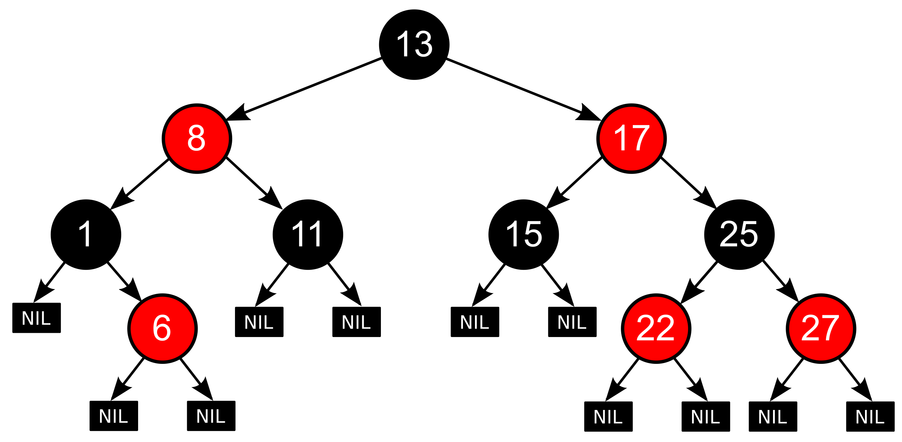
        </div>

为了量化红黑树的平衡程度，我们为节点x定义一个称为「**黑高**」(black height)的字段$\mathrm{bh}(x)$：它表示从节点x出发到叶子节点(NIL)的任意简单路径上黑色节点的个数（不包括节点x）

- 根据定义的性质5，由于每条简单路径的黑色节点数相同，所以便可以**任意**选取其中1条路径
- 整棵树的黑高等于根节点的黑高

**引理**：一棵有$N$个内部节点的红黑树，它的高度至多为$2\log (N+1)$。

- 由该引理知，尽管红黑树相比AVL树看起来不是那么平衡，但是它能够确保树高是$O(\log N)$的，所以红黑树也是一棵相当平衡的树。

??? proof "证明"

    我们要证明两个不等式：

    - 对于任意节点$x$，$\mathrm{sizeof}(x) \ge 2^{\mathrm{bh}(x) - 1}$
    - $\mathrm{bh}(Tree) \ge \dfrac{h(Tree)}{2}$

    === "不等式1"

        用**归纳法**证明

        - 当$h(x) = 0$时，$x$是空节点，所以$\mathrm{sizeof}(x) = 2^0 - 1 = 0$
        - 归纳假设：对于满足$h(x) \le k$的节点$x$，该不等式均成立
        - 当$h(x)=k+1$时，$\mathrm{bh}(child) = \mathrm{bh}(x)$或者$\mathrm{bh}(x)-1$
        - 因为$h(child) \le k$，所以$\mathrm{sizeof}(child) \ge 2^{\mathrm{bh}(child)} - 1 \ge 2^{\mathrm{bh}(x)-1}-1$
        - 所以$\mathrm{sizeof}(x) = 1 + 2\mathrm{sizeof}(child) \ge 2^{\mathrm{bh}(x)}-1$，得证


    === "不等式2"

        由定义知，对于每个红色节点，它的孩子都是黑色的，因此从根节点到叶子结点的所有简单路径上，至少有一半的节点（不包括根节点）是黑色的，即不等式2成立

    ---
    由两个不等式可以得到：

    $$
    \mathrm{sizeof}(root) = N \ge 2^{\mathrm{bh}(Tree)}-1 \ge 2^{\frac{h}{2}}-1
    $$

    即$h \le 2 \log(N+1)$

### Operations

#### Insertion

与AVL树类似，我们希望插入的节点尽可能不影响红黑树的平衡程度，换言之就是尽可能地不改变红黑树的黑高，因此**新插入节点的颜色应该是红色的**。

- 如果运气好的话，即新插入节点的父节点是黑色的，我们无需作任何调整
- 但很可能会遇到父节点也是红色的情况，这样需要我们做一定的调整，下面根据课件给出的例子，分情况讨论调整的方法

!!! note "分析"

    !!! warning "注意"

        - 这块内容是红黑树的灵魂部分，所以需要仔细品读和深入理解
        - 「调整」一栏的图中，黑色三角形表示以黑色节点为根节点的子树

    === "初始状态"

        <div style="text-align: center">
        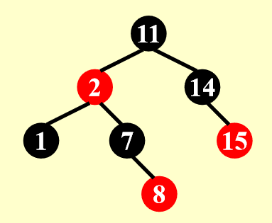
        </div>

    === "Case 1"

        新插入节点的父节点，以及父节点的兄弟节点都是红色的。

        === "例子"

            <div style="text-align: center">
            
            </div>

            先插入5——OK！再插入4——No！4和5是相邻的红色节点，没有满足定义的要求，所以我们要开始调整这棵树了。

        === "调整"

            <figure style=" width: 100%" markdown="span">
                
                
                <figcaption></figcaption>
            </figure>

            - 第一步相当简单，只需要交换父亲节点、父亲的兄弟节点与祖父的颜色即可
            - 但正因为太简单了，所以在调整后还会出现四种情况：
                - 最理想的情况是祖父节点是根节点的时候，让根节点变黑即可（图的最右侧所展示的情况）
                - 但更常见的是调整完一次后，这棵子树的上一级子树（红框表示染色后的子树）还在我们要讨论的三种情况内——所以慢慢来吧~

            >注：Case 1应该还有3种对称情况（新插入节点在LR、RL和RR位置上），但由于比较简单，所以就不再赘述。

    === "Case 2"

        新插入节点是其祖父节点（黑色）的LR或RL孙子节点。

        === "例子"

            <div style="text-align: center">
            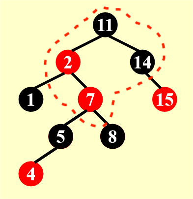
            </div>

            在Case 1交换颜色后，虽然节点4那一部分合法了，但是它的祖父和曾祖父却都是红色的，所以还得继续调整。

        === "调整"

            <figure style=" width: 70%" markdown="span">
                
                
                <figcaption></figcaption>
            </figure>

            类似AVL树的旋转，转一下就行。然而这个调整并没有使这棵树变得合法，而只是将它调整至Case 3的形状（LR -> LL），最终的解决方案还得见Case 3。

            >注：Case 2还有一种对称情况（RL -> RR），调整方法类似。


    === "Case 3"

        新插入节点是其祖父节点（黑色）的LL或RR孙子节点。

        === "例子"

            <div style="text-align: center">
            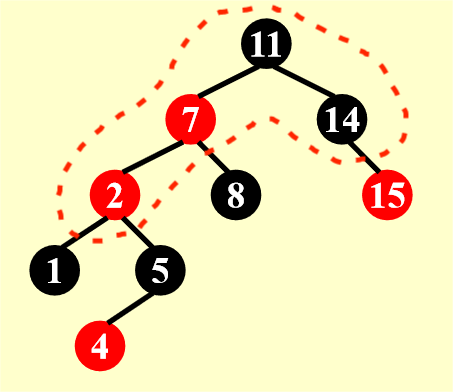
            </div>

        === "调整"

            <figure style=" width: 70%" markdown="span">
                
                
                <figcaption></figcaption>
            </figure> 

            一次旋转 + 一次换色即可（可以看到，两次操作的顺序并不重要）。这样一转换后，终于使这棵红黑树变回合法的了！

            如果将Case 2和Case 3一起看的话，可以发现我们进行了一次类似AVL树的LR旋转操作。

            >注：Case 3也有一种对称情况（RR）

    ---
    根据前面的分类讨论，我们可以画一个（~~不是特别标准的~~）状态图，从全局角度观察整个插入流程（想法来自[修佬的笔记](https://note.isshikih.top/cour_note/D2CX_AdvancedDataStructure/Lec02/#%E6%8F%92%E5%85%A5)）


    <figure style=" width: 70%" markdown="span">
        
        
        <figcaption></figcaption>
    </figure> 

    - 归根结底，不管位于什么样的case下，我们都需要先将其转化为case 3然后才能彻底恢复该子树的红黑树性质
    - 可以看到，在整个调整的过程中，只需要常数次的旋转和染色，就可以使子树恢复合法的红黑树性质（即保持平衡）。而最坏的情况是需要不断向上维护子树的平衡，直至根节点为止，因此插入的效率和AVL树差不多，均为$O(\log N)$。

    >注：迭代实现比递归实现速度上略快一点，但不多。

!!! info "注"

    在网上搜相关资料的时候，我发现实际上插入分为五种情况，而课件忽略了前两种较为简单的情况，这里就稍微简单地提一下：

    - Case 4：向空树插入新节点 -> 将该节点染黑即可
    - Case 5：父节点是黑色的 -> 啥也不用动，因为没有与红黑树的性质冲突（其实前面例子刚开始的时候就已展示过这种情况了）

??? question "思考"

    用双旋替代Case 2和Case 3的调整是否可行？答案是否定的（~~如果是肯定的话，这里也就不会分两种情况来介绍了~~），简单的双旋不会根除不好的情况，因而会让我们一直陷入调整的死循环中，大家可以通过自己画图来具体探讨一下。

    

#### Deletion

我们通过「两步走」的方法实现整个删除操作：**维护红黑树的平衡** -> **删除树中节点**

先来看删除节点（共4种情况）：

- 删除树中的唯一节点 -> 直接删
- 被删除节点有**两个孩子** -> 用左子树最大节点或右子树最小节点的**值**替代被删除的节点的值（注意保持**颜色不变**）（具体删除细节见[FDS相关部分](../fds/4.md#delete)），然后将其从原来的位置中删除（根据二叉查找树的性质知，它至多只有一个孩子，因此问题转换为后面两种情况）
- 被删除节点**没有孩子** -> 直接用`NIL`替代（黑色）该节点
- 被删除节点有**一个孩子**
    - 若孩子为红色 -> 该节点为黑色 -> 直接用孩子替代该节点并染黑即可
    - 若孩子为黑色 -> 该节点可红可黑
        - 该节点为红色 -> 直接用孩子替代该节点
        - 该节点为黑色 -> 删除后由于打破最后一条性质，需要重新维护

综上所述，再来看最重要（~~也是最麻烦~~）的平衡维护。这里用X表示当前需要维护的节点，它的颜色是双黑（即有两层黑色，多出来的那层黑色来自它下面的黑色节点或`NIL`节点）。我们的目标是消除红黑树的双黑节点，进而恢复整棵树的平衡。这个“双黑”可以通过下面的几种情况，将多出来的黑色分给红色节点或者根节点（根节点是双黑的话就直接变成黑色即可），从而被消除。

!!! note "分析"

    === "Case 1"

        X的兄弟节点S是红色的（则S的两个孩子、父节点P一定都是黑色的），这时无法通过简单的旋转或染色使其满足所有性质，我们先让部分区域先满足所有性质，之后再维护剩余部分。

        === "初始状态"

            <figure style=" width: 50%" markdown="span">
                
                
                <figcaption></figcaption>
            </figure>

            若X是P的左孩子，则左旋P；否则右旋P（对称情况）

        === "旋转后"

            <figure style=" width: 50%" markdown="span">
                
                
                <figcaption></figcaption>
            </figure>

            将兄弟节点S染红，父节点P染黑

        === "染色后"

            <figure style=" width: 50%" markdown="span">
                
                
                <figcaption></figcaption>
            </figure>

            大功告成！现在我们保证了在以X为根节点的子树（我用蓝色虚线矩形方框圈出来的部分）之外的部分满足红黑树的所有性质。至于剩下的部分，继续根据后面几种情况讨论。


    === "Case 2"

        X的兄弟及兄弟的两个孩子都是黑色的（不考虑X父节点的颜色）

        === "初始状态"

            <figure style=" width: 50%" markdown="span">
                
                
                <figcaption></figcaption>
            </figure>

            - 首先需要染红X的兄弟S
            - 然后将X的一层黑色丢给它的父节点P
                - 若原来P为红色，则现在P为黑色
                - 若原来P为黑色，则现在P为双黑

        === "染色后"

            <figure style=" width: 50%" markdown="span">
                
                
                <figcaption></figcaption>
            </figure>

            - 如果染色后P为黑色，那么这棵子树就OK了
            - 如果染色后P为双黑，则将P作为当前要维护的节点，继续向上调整，因此维护的工作向上移了一层


    === "Case 3"

        兄弟节点S是黑色的；兄弟节点靠近内侧的孩子（LR、RL）是红色的，靠近外侧的孩子（LL、RR）是黑色的；父节点的颜色可红可黑。

        === "初始状态"

            <figure style=" width: 50%" markdown="span">
                
                
                <figcaption></figcaption>
            </figure> 

            若X为左孩子，右旋S；否则左旋S  

        === "旋转后"

            <figure style=" width: 50%" markdown="span">
                
                
                <figcaption></figcaption>
            </figure>   

            将S染红，L染黑

        === "染色后"

            <figure style=" width: 50%" markdown="span">
                
                
                <figcaption></figcaption>
            </figure>   

            此时这棵树满足Case 4的条件，进一步的调整就请看下面的Case 4了。

    === "Case 4"

        兄弟节点S是黑色的；兄弟节点靠近内侧的孩子（LR、RL）可红可黑，靠近外侧的孩子（LL、RR）是红色的；父节点的颜色可红可黑。

        !!! warning "注意"

            图片里面的子树B表示以靠近内侧孩子为根节点的树，它的根节点被我画成黑色了，实际上红色也是可以的！

        === "初始状态"

            <figure style=" width: 50%" markdown="span">
                
                
                <figcaption></figcaption>
            </figure>  

            若X为左孩子，则左旋P；否则右旋P

        === "旋转后"

            <figure style=" width: 50%" markdown="span">
                
                
                <figcaption></figcaption>
            </figure>  

            交换P和S的颜色，并且将X的一层黑色分给R，这样X和R就均为黑色的了（如果X是右孩子的话应该分给L）

        === "染色后"

            <figure style=" width: 50%" markdown="span">
                
                
                <figcaption></figcaption>
            </figure>

            此时整棵子树是一棵合法的红黑树了。

    ---
    再次献上不是很标准的状态图：

    <figure style=" width: 70%" markdown="span">
        
        
        <figcaption></figcaption>
    </figure>

    状态图里未提到的地方：

    - 在Case 3中，如果P是根节点，那么经过调整后就大功告成了，直接进入"Finish!"

    从状态图中，我们可以发现在删除一个节点并维护平衡的过程中，至多需要3次旋转操作，显然在绝大多数情况下比AVL树的$O(\log N)$要快，因此红黑树的使用更加广泛些。

??? example "例子"

    看了前面的理论分析，（~~如果你是像我一样第一次学红黑树的话~~）你应该处于一种似懂非懂的状态。现在尝试阅读下面的例子，看你是否真的理解红黑树的删除过程。

    这是一棵红黑树，我们要从中删除若干个节点：

    <div style="text-align: center">
    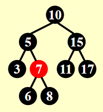
    </div>

    === "删除节点3"

        === "参考图片"

            <div style="text-align: center">
            
            </div>

        === "答案"

            <div style="text-align: center">
            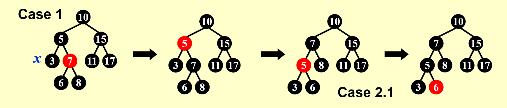
            </div>

            这里的Case 2.1指的是我这边的Case 2

            <div style="text-align: center">
            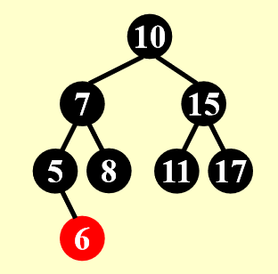
            </div>

    === "删除节点17"

        === "参考图片"

            <div style="text-align: center">
            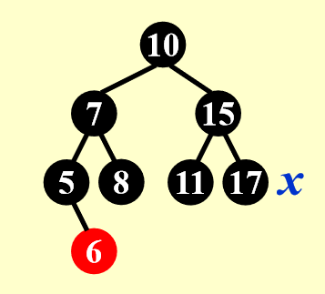
            </div>

        === "答案"

            <div style="text-align: center">
            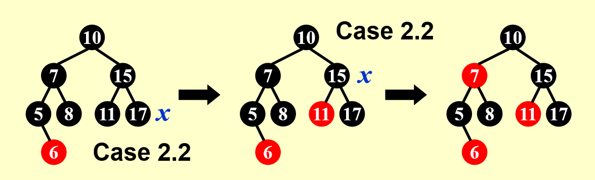
            </div>

            - 这里的Case 2.2指的是我这边的Case 3
            - 可以看到，在经过一次Case 3的转变后，我们需要维护的点X向上移了一层（17 -> 15），但删除的节点是17不是15

            <div style="text-align: center">
            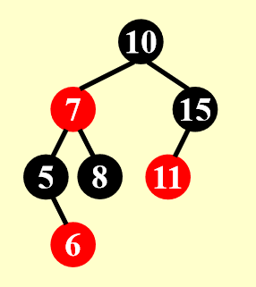
            </div>

    === "删除节点8"

        === "参考图片"

            <div style="text-align: center">
            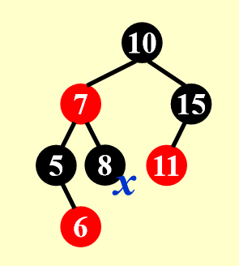
            </div>

        === "答案"

            <div style="text-align: center">
            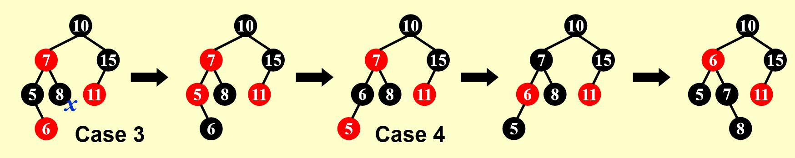
            </div>

            这里的Case 3和Case 4分别指的是我这边的Case 4和Case 5

???+ note "AVL树 vs 红黑树"

    AVL树和红黑树的效率比较（调整一棵子树所需的旋转次数）：

    ||AVL Tree|Red-Black Tree|
    |:--|:--|:--|
    |Insertion|$\le 2$|$\le 2$|
    |Deletion|$O(\log N)$|$\le 3$|

    - 事实上，AVL树的最差高度略低于红黑树，因此如果有频繁的访问操作，推荐使用AVL树
    - 然而，红黑树的优势在于它的删除是常数级复杂度，而AVL树的删除需要$O(\log N)$的时间，所以如果有频繁的删除操作，推荐使用红黑树
    - 而且，红黑树的节点只需存储1位颜色字段，而AVL树至少需要2位来存储平衡因子，因此红黑树在空间上更占优势
    - 总体而言，红黑树的运行效率比AVL树快了大概10%-20%左右

## B+ Trees

B+树是B树的改良版，广泛应用于关系型数据库和操作系统的文件系统中。

计算机内的大量数据往往是存在磁盘内而非内存里，但磁盘的访问速度比内存慢很多。因此为了加快磁盘的访问速度，可以让数据存储于一段连续的块内，这便是B+树和普通的二叉查找树之间的区别。而且，相比二叉查找树，B+树的插入与修改拥有较稳定的对数时间复杂度，因而能够保持数据稳定有序。

!!! note "定义"

    $M$阶(order) B+树遵循以下结构上的性质：

    - 根节点要么是叶子节点，要么有$x$($x \in [2 , M]$)个孩子
    - 所有非叶子节点（除了根节点）有$y$($y \in [\lceil \dfrac{M}{2}\rceil , M]$)个孩子
    
    >上面的两个下界都是分裂节点时分配到的孩子数

    - 所有的叶子位于相同深度的位置上（因为B+树是**自底向上**构建的，而一般的二叉查找树是自顶向下构建的）

    ---
    还有以下值得注意的地方：

    - 所有实际数据存储在叶子节点上，每个叶子节点就是一个块
    - 每个内部节点存储指向$M$个孩子的指针（如果孩子个数少于$M$个，剩下的指针为空指针），以及$M-1$个来自除第一棵子树外每棵子树的最小值

!!! example "例子"

    这是一棵四阶B+树（类似2-3-4树（每个节点可以有2/3/4个孩子））

    <div style="text-align: center">
    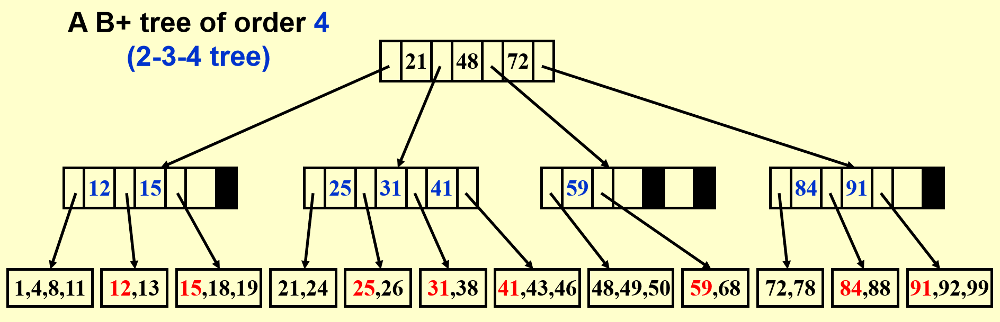
    </div>

    - 黑色方块表示空指针
    - 标红的数字表示当前子树中的最小值，它会被存储于父节点中

### Operations

再来看一个例子，从中学习B+树的创建、查找、插入等操作

!!! example "例子"

    这是原始数据，由5个存储块构成，每个存储块存有2-3个数据（不得超过这个范围），存储块内的数据按升序排列：

    <div style="text-align: center">
    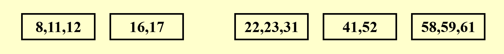
    </div>

    我们先根据这些存储块，**自底向上**创建一棵三阶B+树：

    <div style="text-align: center">
    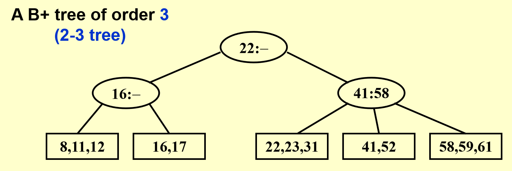
    </div>

    === "查找52"

        查找过程类似二叉查找树，也是自顶向下寻找，找的数偏大往右找，偏小往左找

        <div style="text-align: center">
        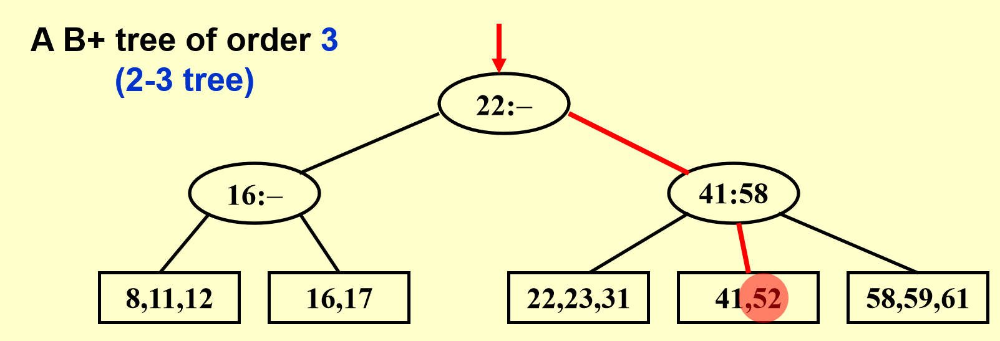
        </div>

    === "插入18"

        先看下面的存储块有没有空余的地方——在该情况中是有的，那就直接插入存储块内（还得检查一下要不要修改父节点的元素，当然这里不需要）

        <div style="text-align: center">
        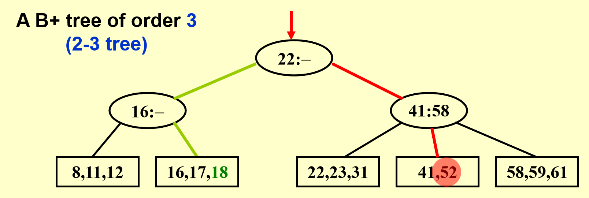
        </div>

    === "插入1"

        <div style="text-align: center">
        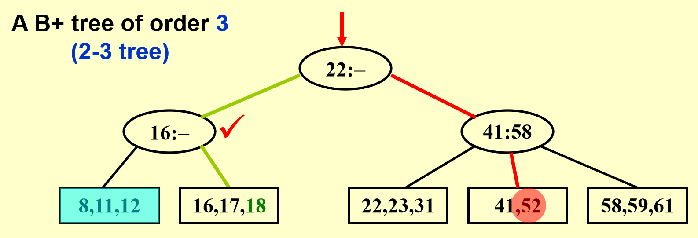
        </div> 

        通过查找发现，我们要插入的数据块（蓝色）的数据已满，不能再插入了，那么就看能不能将这个数据块一分为二（每个数据块放2个数据），也就是看父节点还能不能再多一个孩子——这里是OK的（打钩的位置），那就分出来吧，然后不要忘记修改父节点的数据！

        <div style="text-align: center">
        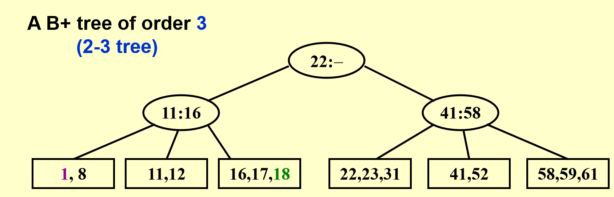
        </div>

    === "插入19"

        <div style="text-align: center">
        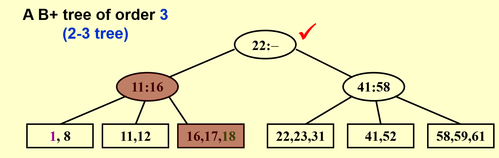
        </div>

        这次比前一种情况更麻烦一些：数据块和它的父节点都满了，所以要向祖父节点寻找空位，再多给一个叔叔节点，将一分为二后的数据块放在叔叔节点上。最后不要忘记修改父节点和祖父节点的数据！

        <div style="text-align: center">
        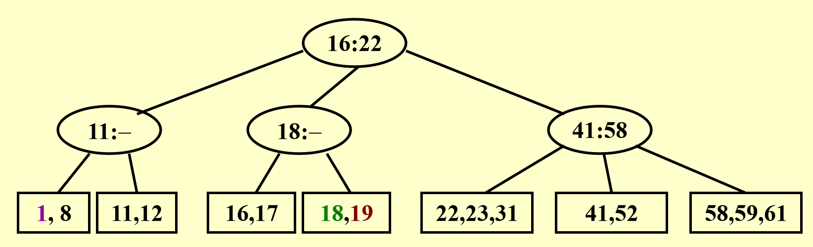
        </div>

    === "插入28"

        <div style="text-align: center">
        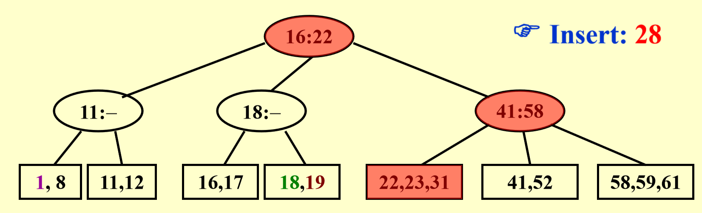
        </div>    

        更加糟糕，这下数据块和它的所有祖先都满了，那就只能产生一个新的根节点（添加新的一层）存放多出来的节点。

        <div style="text-align: center">
        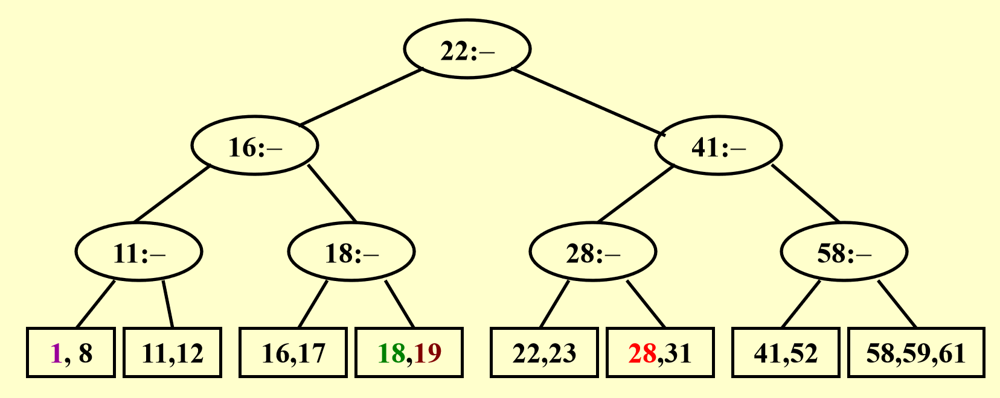
        </div>

在插入操作中我们运用的是简单的分裂法，这会产生很多的叶子节点（一个个存储块），从而导致树的增高。

**删除**操作与插入类似，但要注意：如果一个根节点失去两个孩子时，要移除这个根节点。

---
??? code "伪代码实现（插入操作）"

    ``` c
    Btree Insert(ElementType X, Btree T) {
        Search from root to leaves for X and find the the proper leaf node;
        Insert X;
        while (this node has M+1 keys) {
            split it into 2 nodes with RoundUp((M+1) / 2) and RoundDown((M+1) / 2) keys respectively;
            if (this node is the root)
                create a new root with two children;
            check its parent;
        } 
    }
    ```

对于一棵有$N$个数据的$M$阶B+树：

- 深度$\mathrm{Depth}(M, N) = O(\lceil \log_{\lceil \frac{M}{2} \rceil} N \rceil)$
- 插入时间$T(M, N) = O(\dfrac{M \cdot \log N}{\log M}) = O(M \log_M N)$
    - 所以阶数$M$不是越大越好，最合适的取值为3或4
- 查找时间$T_{Find}(M, N) = O(\log_M N) \le O(\log N)$


