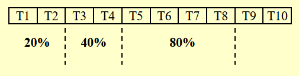

# Lec 3: Inverted File Index

!!! info "注"

    下文提到的“文档”和“网页”是同义词，不要误会~

## Concept

!!! info "引入"

    本节将会探讨相对轻松的话题：如何运用我们之前学过的数据结构，来实现**搜索引擎**的功能（这里只是简单介绍一下原理）。现在我们来想一下，搜索引擎是如何根据在搜索框内输入的内容来找到符合要求的网页呢？

!!! bug "Naive的想法"

    === "法1"

        字符串遍历 -> 在如今浩如烟海的网络世界中，这种显然方法无异于大海捞针...（耗时太长）

    === "法2"

        建立一张**词汇-文档关联矩阵(term-document incidence matrix)**

        假设现在有一份文档集：

        <div style="text-align: center">
        
        </div>

        我们为这4个文档内的所有词汇整理了一张词汇-文档关联矩阵：

        <div style="text-align: center">
        
        </div>   

        可以看到，当某个单词出现在一个文档内，对应位置的矩阵元素的值为1，否则为0。因此，我们可以利用二进制来表示一个词汇的出现情况，比如`a`对应的二进制数为`0111`，表示除了第一个文档外的所有文档均出现了这个词汇。

        我们也可以同时查找包含多个词汇的文档，比如我想要查同时包含`silver`和`truck`的文档，那么可以将它们对应的二进制数做一个按位与的操作，即`1010 & 1011 = 1010`，从而发现第1和第3份文档是符合要求的文档。

        这个方法的缺点显而易见：矩阵过于稀疏(sparse)，占用空间过多。

我们延续法2的思想，为文档中出现的所有词汇赋予一个「地址」而非一长串二进制数，从而节省了空间。而这个所谓的「地址」被称为**索引**(index)，对应的词汇-索引关联表被称为**倒排索引**(inverted file index)。对于法2出现的文档集，它对应的倒排索引是这样的：

<div style="text-align: center">

</div>

我们关心表格的后两列信息：

- 前者收集所有文档中出现过的词汇，这块区域被称为**词典**(term dictionary)
- 后者记录了每个词汇对应的出现次数（或者说频率）以及出现位置（哪个文档;文档中的具体位置（一篇文档内可能有多个位置）），这块区域被称为**倒排列表**(posting list)
    - 之所以要记录每个词汇出现的次数，是为了提升搜索的速度：对于一个包含多个关键词的搜索语句，搜索引擎优先搜索出现次数最少的网页，看这个网页是否包含其他所有的关键词，运用这种方式可以更快地排除不在搜索范围内的网页
        - 举个例子：假设我要搜索同时带有`delivery`、`silver`和`truck`的网页，如果先根据`truck`搜索，那么要判断2次才能找到符合要求的网页；而如果先根据次数较小的`delivery`搜索，那么只需判断1次就能找到了
- 所以搜索引擎返回给我们的内容不单单是一个个网页的链接，还会给出简短的网页信息，其中包含带有我们输入的搜索词（用高亮表示出来）的句子

??? info "关于「倒排」"

    我目前不太清楚为什么叫做「倒排」索引，这里引用[修佬の解释](https://note.isshikih.top/cour_note/D2CX_AdvancedDataStructure/Lec03/#%E5%80%92%E6%8E%92%E7%B4%A2%E5%BC%95)：

    >所谓的倒排索引，所有的思想都凝结在了“倒”，也就是 inverted。如果可以，我觉得用“逆”更合适。这里的索引对象指的是“文档”和“单词”之间的关系，而倒排索引的意思是，对于每一个单词，我们记录它出现在哪些文档中，以及记录他们出现的次数（频率）。

下面给出一个简单的索引生成器的伪代码：

???+ code "伪代码实现"

    ``` c hl_lines="2-4 9"
    while (read a document D) {
        while (read a term T in D) {
            if (Find(Dictionary, T) == false) 
                Insert(Dictionary, T);
            Get T's posting list;
            Insert a node to T's posting list;
        }
    }
    Write the inverted index to disk;
    ```

伪代码中的每个高光部分分别对应以下搜索引擎的重要模块(module)，之后我们会展开介绍：

- Token Analyzer & Stop Filter
- 词汇扫描器(vocabulary scanner)
- 词汇插入器(vocabulary insertor)
- 内存管理系统(memeory management)

## Modules

### Word Stemming

在处理一个词汇的时候，先不急着把它放入倒序索引内，而是提取出它的词干部分，将这个词干保留下来，丢掉原来的词汇。

!!! example "例子"

    <div style="text-align: center">
    
    </div>

    在英语词汇中，一个单词可能有多种形式，但实际上它们的含义是一样的，因此为了节省空间，应该将这些形式各异但词干相同的词汇放在一起。

    我们甚至可以将某个单词的常见错误拼写收集起来，进行词干的匹配。

### Stop Words

对于某些过于常见，几乎出现于每一个文本的词汇（比如英文里的冠词、代词等）（这些词被称为**停用词**(stop words)），因为它们通常不具备特殊的含义，因此我们可以预先将它们从原始文本中去掉，然后再进行倒序索引的匹配。

!!! warning "注意"

    我们**不会**将停用词从倒排索引中踢掉——虽然在大部分情况下它们没什么意义可言，但还是存在一些特殊情况，比如英文单词it，除了代词的意思外，还有可能指的是IT（信息技术）。

### Term Access

我们通常会使用以下数据结构来存储倒排索引：

- **搜索树**（尤指B类树（B-树、B+树等）、字典树(tries)等）
- **散列**(hashing)：相较于前者，它有以下优缺点：
    - 优点：查找单个词汇的速度非常快（$O(1)$）
    - 缺点：查找多个词汇的速度相对较慢，因为多个词汇出现在散列表的位置是不确定的，有可能相距较远；而像字典树之类的搜索树，可能会将词汇按照联系程度的紧密来确定这些词汇的相对位置，因此查找在某个句子的一串词汇可能会更快一些

### Memory Management

对于之前给出的伪代码，我们将会做出一些调整，使得它能够处理内存不够用的情况（高亮部分为新增的伪代码）：

???+ code "伪代码实现"

    ``` c hl_lines="1 4-8 16-17"
    BlockCnt = 0;
    while (read a document D) {
        while (read a term T in D) {
            if (out of memory) {
                Write BlockIndex[BlockCnt] to disk;
                BlockCnt++;
                FreeMemory;
            }

            if (Find(Dictionary, T) == false) 
                Insert(Dictionary, T);
            Get T's posting list;
            Insert a node to T's posting list;
        }
    }
    for (i = 0; i < BlockCnt; i++) 
        Merge(InvertedIndex, BlockIndex[i]);
    ```

- 我们将填满的内存放入磁盘的一个存储块内，然后释放内存，继续用来装剩下的倒排索引
- 最后我们需要将这些装有倒排索引的存储块，以及内存里剩下的倒排索引合并在一起，合并的时候最好要排个序


## Techniques

### Distributed Indexing

由于互联网上的网页数量巨大，对应的倒排索引数据量也会特别大，因此我们不可能将所有的倒排索引放在一台计算机内——通常会放在多台计算机内，这些计算机合称为集群(cluster)，其中的一台计算机被称为节点(node)，每个节点会存储所有倒排索引的一个子集。那么关键问题在于我们该如何为倒序索引划分子集，下面有两种可行的方法：

- 法1：按**词汇**划分索引（有点像字典）

<div style="text-align: center">

</div>

- 法2：按**文档**划分索引

<div style="text-align: center">

</div>

### Dynamic Indexing

在实际应用中，可能会遇到以下问题：

- 文档可能会随时被添加进去：如果按照原来的方法，倒序索引就需要根据插入的文档来实时更新，这样的话效率太低了！
- 文档也有被删掉的可能

解决之道：

<div style="text-align: center">

</div>

- 我们称原来存储索引的地方为**主索引**(main index)
- 现在新增一个存储少量索引的空间，叫做**辅助索引**(auxiliary index)（可以理解为一个cache）
- 新插入的文档对应的索引会暂时存放在辅助索引内
- 如果要搜索网页的话，搜索引擎会同时在主索引和辅助索引内查找对应的索引，查找辅助索引的速度更快一些
- 在适当的时候将辅助索引内的内容合并到主索引内（即归档），随后清空该索引，继续用于存放新插入的文档

!!! question "疑难点"

    - 如何挑选合并两个索引块的最佳时间
    - 如何从中删去一个文档

    >可惜的是，cy的PPT并没有给出进一步的说明...

### Compression

这里有几种可压缩存储空间的场景：

- 关于词汇
    - 一个简单的想法是将所有的词汇放在一个数组内，但是它的存储空间除了取决于词汇数量，可能还取决于最长词汇的位数，如果某个词汇很长，浪费的空间就特别多了
    - 因此一种压缩的策略是：
        - 先去除停用词
        - 然后将所有的词汇放在同一个存储块内，词汇之间没有任何间隔，所以看起来就是一长串字符串
        - 为了从这个长字符串中区分词汇，我们还需要另一张表来记录每个词汇的开头的位置
        - 这样我们将一个很大的数组压缩成两张相对较小的表

    !!! example "例子"

        <div style="text-align: center">
        
        </div>
    
- 关于索引
    - ~~如果~~ 我们有大量的文档，那么词汇的倒排索引可能无法表示特别大的整数（即使`long long int`也救不了）
    - 因此我们不再记录文档的绝对序号，而是记录某个词汇所在的两个最近的文档的间距，也就是说记录基于绝对序号的**差分(difference)序列**。根据实际经验可知，大多数的间距值不会超过20 bit，因而能够存储更大的文档序号

    !!! example "例子"

        <div style="text-align: center">
        
        </div>

### Threshold

设置**阈值**(threshold)的原因是：让搜索引擎查找或检索所有相关的网页是没有必要的，因为我们人类的时间精力有限，即使搜出来的网页都有价值（而实际上只有很少的一部分网页是有意义的），我们也不会将所有给出的网页都阅读一遍；而且检索所有网页这一行为所消耗的时间较多，所以需要设定一个阈值，我们只要这个范围内的网页就行了。下面将会从两个角度阐述这一思想：

- **文档**：只检索根据权重排名下来的前x个文档
    - 缺点：对于布尔查询（用到与、或等布尔运算），可能会错过一些有意义的文档。比如我们要搜索`Computer & Science`，搜索引擎只会搜与这两者的交集相关的文档，可能会忽略与`Computer`相关或与`Science`相关的文档
- **查询**(query)
    - 将查询中的词汇按它们出现的频率升序排序
    - 搜索的时候只会根据序列前面的几个词汇（也就是出现频率相对较少的词汇）搜索，因为通常而言出现频率少的词汇的价值高于出现频率多的词汇
    - 根据实际情况确定阈值的大小：如果对于不同的阈值，搜索的准确度差不多，那么就取较小的阈值，否则取更大的阈值

    <div style="text-align: center">
    
    </div>
    

## Measurement

我们可以从以下几个角度来测量搜索引擎的性能：

- 排索引的速度：每小时处理的文档数
- 搜索的速度
    - 潜伏期(latency)：等待搜索结果出现的时间
    - 如果仅比较潜伏期是不太合理的，因为潜伏期的大小与索引的大小有关。因此将潜伏期看作关于索引大小的一个函数，在此基础上再做比较
- 查询语句的可表达性(expressiveness)：即能够表达复杂信息的能力，我们会比较搜索引擎在这类复杂查询下的搜索速度
- 用户满意度：
    - **数据**检索性能评估(data retrieval performance evaluation)：主要考虑响应时间、索引占用空间等指标
    - **信息**检索性能评估(information retrieval performance evaluation)：主要考虑回答的相关程度等

相关性的测量还需要以下几部分：

- 一个作为基准文档集
- 一套作为基准的查询语句
- 一个对于每个查询-文档对的二维评估，如下图所示：

    <div style="text-align: center">
    
    </div>

    评估中会用到两个指标：**精确度**(precision)和**召回率**(recall)

    <div style="text-align: center">
    
    </div>

    - 如果精确度高而找回率低，那么我们会错过很多有价值的网页
    - 如果召回率高而精确度低，那么我们会得到很多无意义的网页
    - 因此理想情况是同时具备较高的精确度和召回率，但实际应用中可能无法同时兼顾两者，需要做好权衡


