# Lec 4: Leftist Heaps and Skew Heaps

!!! warning "注意"

    下面所涉及到的堆若不做特殊说明，默认为**最小堆**。

## Leftist Heaps

### Definition

!!! info "引入"

    在FDS中，我们已经学过了[**堆（优先队列）**](../fds/6.md)，通过这一数据结构，我们可以在$O(1)$时间内找到数据集中的最大值或最小值，同时它的插入和删除元素的操作也相当快（$O(\log N)$）。
    
    尽管如此，我们还会用到**合并**(merge)操作。在一般的堆中，合并的时间复杂度为$\Theta(N)$：首先，要将一个堆内的数据拷贝到另一个堆上，需要$\Omega(N)$的时间；之后还得用$\mathrm{BuildHeap}$的方法整理合并后的堆，需要$O(N)$的时间。那么，是否存在一种改良的堆，可以提高合并的效率呢？答案便是我们接下来要讲的leftist heaps。

    >也许你会想到用*指针*来提升合并的速度，但这样做会影响到其他运算的效率：我们原来可以用数组索引快速定位到父节点和孩子节点（只需简单的移位和加法操作），用指针的话就会使这种定位变得更加困难。

**左偏堆**（又称左式堆、左倾堆等）(leftist heaps)具有与一般的堆一致的顺序性质，即每个节点一定比它所有的孩子节点大/小；变化之处在于结构性质：它不再是一棵完全二叉树，而是一棵不平衡的树。

除此之外，左偏堆的节点还多了一个名为**空指针路径长度**(null path length)的字段，记作$\mathrm{Npl}(X)$，表示的是从节点$X$到没有两个孩子的节点（即叶节点或度为1的节点）的最短距离。定义$\mathrm{Npl}(NULL) = -1$。这个字段用于准确表述左偏堆满足的性质：对于堆上的每个节点，它的左孩子的空指针路径长度不小于它的右孩子的空指针路径长度，因此整棵树会“向左歪”，即左子树的深度更深一些。空指针路径长度的递推关系式为：

$$
\mathrm{Npl}(X) = \min \{\mathrm{Npl}(C) + 1\ \mathrm{for\ all}\ C\ \mathrm{as\ children\ of}\ X\}
$$

!!! note "定理"

    对于一个左偏堆，如果它右侧的路径上有$r$个节点，那么它至少有$2^r - 1$个节点。

    ??? proof "证明（归纳法）"

        - 当$n = 1$时，显然成立
        - 假设当$n \le r$时定理成立
            - 当$n = r + 1$时，由于根节点也算在右侧路径的节点数内，所以先将它去掉
            - 也就是说右子树的右侧路径上有$r$个节点，那么根据归纳假设知，右子树的节点数至少为$2^r - 1$
            - 再根据左偏树的定义知，左子树的节点数不小于右子树的节点数，因此左子树的节点数也至少为$2^r - 1$
            - 那么整个堆的节点数至少为$1 + 2 \times (2^r - 1) = 2^{r + 1} - 1$，得证

!!! info "注"

    「右侧路径」指的是堆（或者树）上从根节点触发最右边的那条路径。在后面的讲述中，为了便于理解，我会用「右子树」或者「最右边的位置」来替代这一说法。

由这个定理，不难得到以下推论：对于一个具有$N$个节点的左偏堆，它的右子树上至多有$\lfloor \log (N + 1) \rfloor$个节点。因此，想要减小合并操作所花的时间，我们需要让该操作尽可能地在堆的右侧来完成，因为右侧的堆高为$O(\log N)$，那么合并的速度就能接近$O(\log N)$了。


### Operations

左偏堆节点的结构体声明如下：

```c
struct TreeNode {
    ElementType   Element;
    PriorityQueue Left;
    PriorityQueue Right;
    int           Npl;
};
```

接下来主要介绍左偏堆**合并**操作的实现——

>注：**插入**是一种特殊的合并操作，可以理解为只有一个节点的堆与另一个堆进行合并。

#### Recursive Version

现在我们需要合并这两个左偏堆：

<div style="text-align: center">
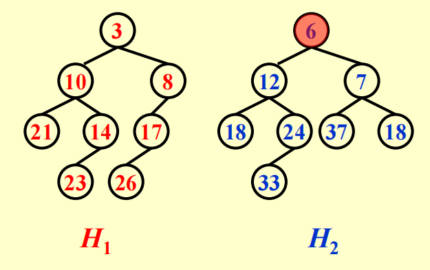
</div>

递归版本的合并操作流程如下：

1. 合并：`Merge(H1->Right, H2)`
    - 由于$H_1$的根节点更小，所以我们将$H_1$的右子树与$H_2$进行递归地合并

    <div style="text-align: center">
    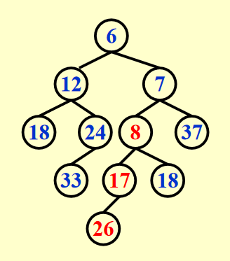
    </div>

2. 附加：`Attach(H2, H1->Right)`
    - 将合并好的堆附加到$H_1$右子树的位置

    <div style="text-align: center">
    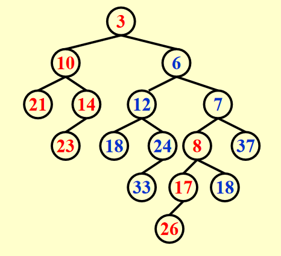
    </div>

3. 如有必要，交换左右子树：`Swap(H1->Right, H1->Left)`

    <div style="text-align: center">
    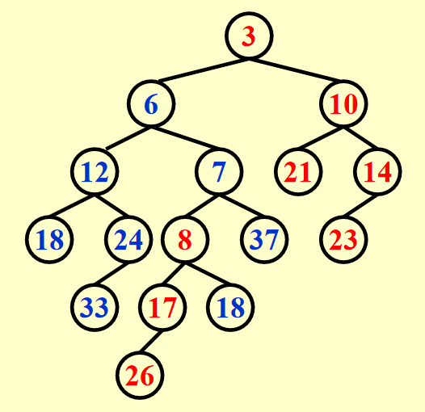
    </div>

???+ code "代码实现"

    ```c
    PriorityQueue Merge(PriorityQueue H1, PriorityQueue H2) {
        // If one heap is empty, then return another heap
        if (H1 == NULL) {  
            return H2;
        }
        if (H2 == NULL) {
            return H1;
        }
        // Assure that the left parameter is the heap with smaller root
        if (H1->Element < H2->Element) {
            return Merge1(H1, H2);
        } else {
            return Merge1(H2, H1);
        }
    }

    static PriorityQueue Merge1(PriorityQueue H1, PriorityQueue H2) {
        if (H1->Left == NULL) {     // single node
            H1->Left = H2;          /* H1->Right is already NULL
                                    and H1->Npl is already 0*/
        } else {
            H1->Right = Merge(H1->Right, H2);  // Step 1 & 2
            if (H1->Left->Npl < H1->Right->Npl) {
                SwapChildren(H1);              // Step 3
            }
            H1->Npl = H1->Right->Npl + 1;      // Important!
        }
        return H1;
    }
    ```

??? question "问题：要是`Merge1()`没有更新$Npl$会出现什么问题？"

#### Iterative Version

迭代版本的合并操作流程如下（还是以上面那两个堆为例）：

1. 在不改变左孩子的情况下，根据两个堆的右子树进行合并。我的理解是：
    - 确定将根节点较小的堆作为合并的**目标堆**，然后将目标堆的右子树“拆出来”，作为**待比较堆A**，另一个堆作为**待比较堆B**
    - 比较两个待比较堆，将**根节点更小的待比较堆的左子树**附加到目标堆的右子树（即最右侧），形成新的目标堆，该目标堆的最右侧是空的
    - 而被抛下的右子树作为新的待比较堆，与另一个待比较堆进入下一轮的PK。重复进行上述的比较、附加操作，直到只剩下一个目标堆为止
    
    >实际上，最开始的目标堆也是一个待比较堆。

    ???+ play "动画演示"

        === "初始状态"

            <div style="text-align: center">
            
            </div>

            $H_1$的根节点更小，因此$H_1$作为目标堆，它的右子树从它身上分离开，作为待比较堆，$H_2$则作为另一个待比较堆。
        
        === "Step 1"

            <div style="text-align: center">
            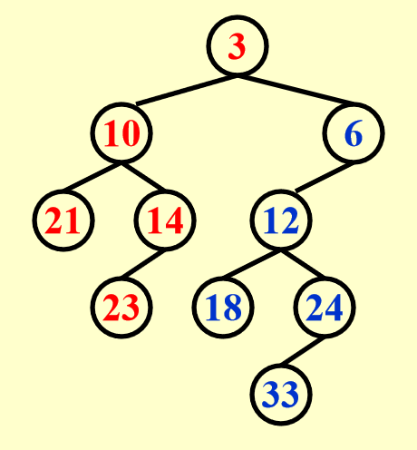
            </div>

            由于$H_2$的根节点更小，所以将$H_2$的根节点及其左子树附加在$H_1$右子树的位置上，这样就形成了新的目标堆。而$H_1$与$H_2$原来的右子树则作为新的一组待比较堆。

        === "Step 2"

            <div style="text-align: center">
            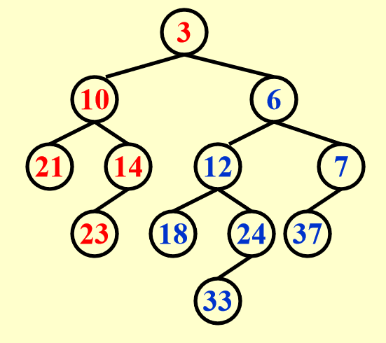
            </div>

            由于$H_2$原来右子树上的根节点更小，因此将它的根节点及其左子树附加在目标堆最右侧的位置上。剩下的原$H_1$右子树和$H_2$右子树的右子树作为新的待比较堆。

        === "Step 3"

            <div style="text-align: center">
            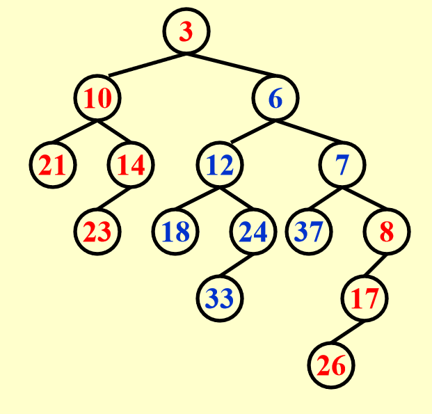
            </div>

            由于$H_1$原来右子树上的根节点更小，因此将它的根节点及其左子树附加在目标堆最右侧的位置上。此时仅剩下原$H_2$右子树的右子树。

        === "Step 4"

            <div style="text-align: center">
            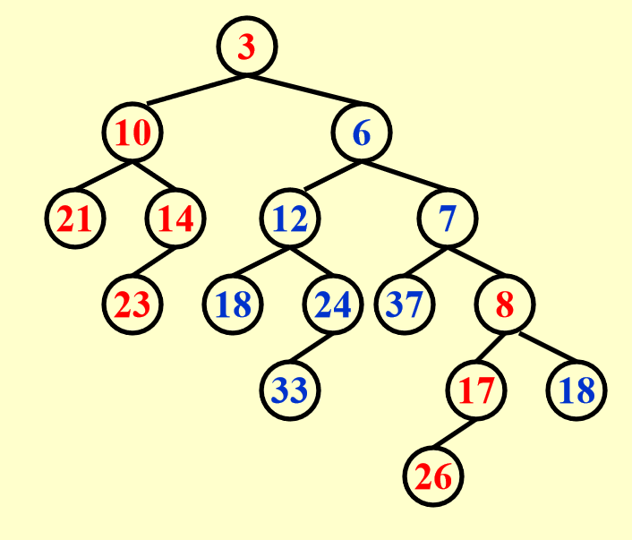
            </div>

            将剩余的堆附加在目标堆的最右侧，合并操作完成。

2. 如有必要，交换合并后的堆的两个子树

    <div style="text-align: center">
    
    </div>

???+ code "代码实现（待补充）"

递归实现和迭代实现各有优劣：

- 递归实现的难度较小，代码写起来较为容易，但是不太好让人理解合并的过程
- 迭代实现更为清晰地展现了合并的过程，但是代码编写较为困难

无论是递归实现，还是迭代实现，时间复杂度均为$T_P = O(\log N)$

#### DeleteMin

我们可以利用合并操作来删除最小节点：

1. 删除根节点，此时会将原来的堆拆作两个子堆
2. 合并两个子堆

时间复杂度：$T_P = O(\log N)$

!!! note "注"

    本质上，左偏堆的插入、删除操作都可以属于合并操作。

## Skew Heaps

### Definition

**斜堆**(skew heaps)是左偏堆的一种简单形式，它们之间的关系类似AVL树和伸展树。斜堆去除了`Npl`字段，但它像伸展树一样，能够保证在$M$次连续操作消耗至多$O(M \log N)$的时间。

斜堆的合并操作的大致思路类似左偏堆，但不同之处在于：由于斜堆不维护`Npl`字段，因此即将被附加的待比较堆（它的根节点更小，包括最开始的目标堆）在拆开右子树后，需要将左子树换到右子树的位置上，然后再加到待比较堆上。也就是说每一次的附加都需要一次交换操作，而不是最后根据`Npl`的情况来交换。

!!! warning "注意"

    最后仅剩的一个待比较堆**不需要**将左子树换到右子树上，这种情况也是递归结束的情况。

???+ play "动画演示"

    这里的动画我就不逐帧分析了，相信大家在学习左偏堆的合并，以及斜堆合并的思路后，应该比较容易看懂这个动画\~

    === "Lucky Case"

        <div style="text-align: center">
        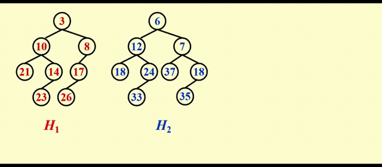
        </div>

        这里运气比较好，这么一番简单的操作后还能保证左偏的性质，但运气可不总是那么好，请看后面的例子。

    === "Unlucky Case"

        <div style="text-align: center">
        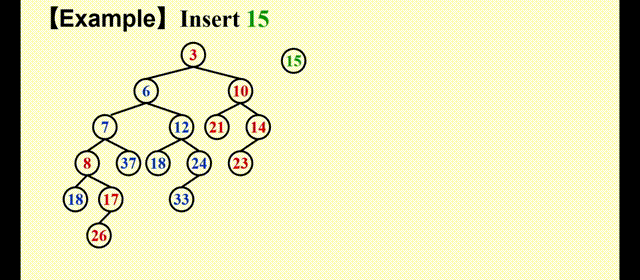
        </div>   

        很明显，合并后的堆更加偏向右侧，因此这不是一个符合要求的堆。

!!! note "注"

    - 斜堆的优势在于：由于不用维护`Npl`字段，因此它节省了一定的存储空间，同时也不需要根据`Npl`判断何时交换堆的两个孩子
    - 如何精确决定左偏堆或斜堆的预期右路径长度是一个开放性的问题

???+ info "补充说明"

    从cy的PPT看，递归版和迭代版的演示不能说十分相似，只能说一模一样，那我就暂时不去探究这两者的区别了<span class="heimu">（NoughtQ真懒呀！）</span>。

### Amortized Analysis

由于插入和删除本质上还是合并操作，所以这里我们就讨论合并操作的[摊还复杂度](1.md#amortized-analysis)，结论是：$T_{\mathrm{amortized}} = O(\log N)$，下面我们就来证明这个复杂度。

!!! proof "证明"

    摊还分析的三种方法中，势能分析法最为强大，因此我们使用这个方法。势能分析法中最重要的便是确定**势能函数**：我们令第$i$次操作后的数据集$D_i$为目标堆的根节点，势能函数$\Phi(D_i)$为这个堆上**重节点**(heavy node)的个数。

    所谓「重节点」，指的是满足该节点**右子树的节点个数占整棵树节点个数（不包括这个根节点）的一半及以上**的节点。对应的也有「轻节点」的概念，即不是重节点的节点。

    ??? question "为什么势能函数不是右子树的节点个数"

        我们知道，斜堆会不停地交换左右子树，因而右子树的节点个数有可能会增加，这是不好的情况；但是在好的情况下，右子树的节点个数也不会减少。这导致势能函数只能反映不好情况下堆的变化，而无法体现好的情况，而一个好的势能函数应当同时反映数据结构的好坏，因此简单记录右子树的节点个数不能满足摊还分析的要求。

        而重节点个数很好地反映了当前斜堆的情况：情况较差时，重节点个数多；情况较好时，重节点个数少，可用于“抵消”情况较差的情况，因而更适合作为势能函数。

    ??? example "例子"

        === "初始状态"

            <div style="text-align: center">
            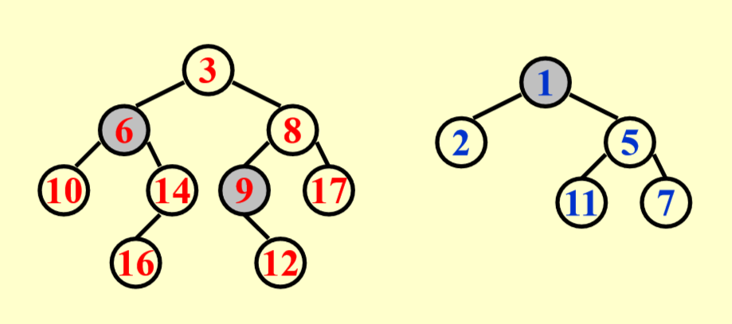
            </div>

            我们用灰色阴影标出重节点，其他节点都是轻节点。可以看到，左边堆的6、9，以及右边堆的1都是重节点。      

        === "合并后"

            <div style="text-align: center">
            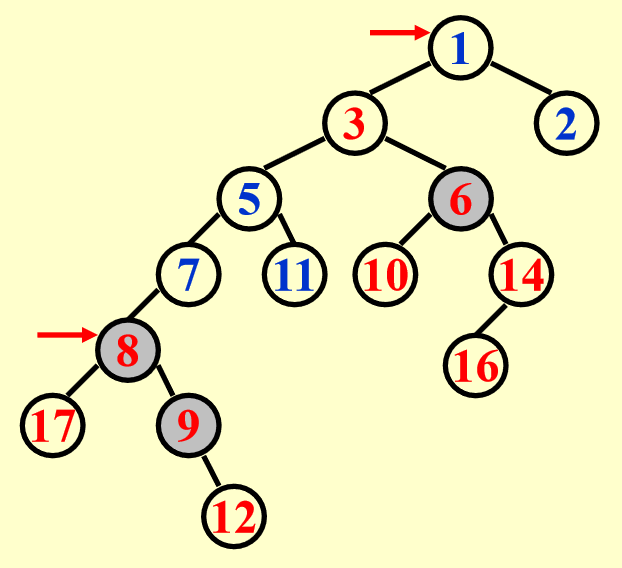
            </div>

            将两个堆合并后，发现有些节点依然保持原来的轻重状态，但是也有部分节点的轻重状态发生转化，这里用红色箭头指出了发生变化的节点：原来的重节点1变成了轻节点，而原来的轻节点8变成了重节点

    **结论**：合并后轻重状态发生变化的节点一定位于原来堆上的（最）右侧路径。理由是在斜堆的合并过程中，待比较堆的根节点一定是原来两个堆上（最）右侧路径的节点（理解了斜堆的合并操作后不难想到），而其他路上的节点基本维持原有的样子不变。

    因此，我们在势能分析的时候更关注右侧路径上的节点（无论轻重）。记$H_i = l_i + h_i(i = 1, 2)$，其中$H_i, l_i$和$h_i$分别表示右侧路径的节点数，右侧路径上的轻节点数和重节点数。所以在最坏情况下，合并所需时间为：

    $$
    T_{\mathrm{worst}}= l_1 + h_1 + l_2 + h_2
    $$

    - 在合并之前，势能函数$\Phi_i = h_1 + h_2 + h$，其中$h$为两个堆内剩余的重节点数
    - 在合并之后，势能函数$\Phi_{i+1} \le l_1 + l_2 + h$
        - 原因：由上面的结论指，两个堆右侧路径的节点的轻重状态可能会发生改变，最坏的情况是：原来两个堆右侧路径上的节点都是轻节点，合并之后都变成了重节点，所以合并后的堆的重节点个数最多为$l_1 + l_2 + h$

    所以，

    $$
    \begin{align}
    T_{\mathrm{amortized}} & = T_{\mathrm{worst}} + \Phi_{i+1} - \Phi_i \notag \\
    & = 2(l_1 + l_2) \notag
    \end{align} 
    $$

    由于$l = O(\log N)$，所以摊还复杂度$T_{\mathrm{amortized}} = O(\log N)$。证毕。

    ??? proof "补充：证明 $l = O(\log N)$"

        >注：$l$是堆（最）右侧路径的轻节点数

        我们可以先证明：对于右侧路径上带右l个轻结点的斜堆，至少有$2^l - 1$个结点。换句话说，如果一个堆有$N$个节点，那么它右侧路径上的轻节点个数为$O(\log N)$，即$l = O(\log N)$，所以只要证出前者，后者自然成立。我们采用归纳法证明（证明过程类似左偏堆那个定理的证明）：

        - 当$l = 1$时，显然成立
        - 假设$l \le n$时，该结论成立
            - 那么当$l = n + 1$时，我们先找到右侧路径的第二个轻节点，根据归纳假设知，以该节点为根节点的子树至少有$2^l - 1$个节点
            - 再找第一个轻节点，由轻节点的定义知，它的左子树节点数一定大于右子树节点数，而上面提到的子树位于它的右子树处，所以以第一个轻节点为根节点的子树至少有$2 \times (2^l - 1) + 1 = 2^{l + 1} - 1$个节点。那么整个堆的节点个数一定大于$2^{l + 1} - 1$，得证

        


    
