# Lec 5: Binomial Queue

!!! info "注"

    说实话，我不太喜欢二项队列(binomial queue)这个名称，因为从它的结构到操作中我实在看不出这个数据结构与队列之间的关系，而且网上更多的叫法是**二项堆**(binomial heap)，所以在接下来的讲述中，我会使用后者而不是前者，前者仅作为本篇笔记的标题使用。

## Definition

!!! info "引入"

    在上篇笔记中，我们介绍了左偏堆和斜堆，虽然它们的平均插入速度为$O(\log N)$，已经够快了，但是我们知道：往空堆插入$N$个节点的总体时间复杂度为$O(N)$，分摊到每个节点的时间复杂度就是$O(1)$，这说明插入速度还可以更快！为了追求极致的插入速度，我们引入了二项堆这一数据结构。

**二项堆**(binomial heap)不是单个的满足堆序（即根节点的值是整棵树的最值）的树，而是一个满足堆序的树的集合，即**森林**；而其中每棵满足堆序的树被称为**二项树**(binomial tree)，它有如下递归定义：

- 高度为0的二项树是一棵单节点的树
- 高度为$k$的二项树$B_k$由两棵高度为$k-1$的二项树$B_{k-1}$构成，且其中一棵树附着在另一棵树的根节点上

<div style="text-align: center">
    
</div>

观察发现：

- $B_k$的根节点有$k$个孩子，分别为$B_0, B_1, \dots, B_{k-1}$
- $B_k$一共有$2^k$个节点
- 深度为$d$的一层上有$\begin{pmatrix}k \\ d \end{pmatrix}$个节点

根据$B_k$的结构，堆序特征，以及不同高度有对应的二项树，不难发现我们可以用二项堆**唯一**表示**任意**大小（节点个数）的堆。

!!! note "注"

    我们可以用一个**二进制数**表示二项堆，二项树$B_k$用于表示第$k$位上的数。如果第$k$位上的数字为0，表明二项堆中没有二项树$B_k$；若为1，则$B_k$存在。

    ??? example "例子"

        这是一个有13个节点的二项堆：

        <div style="text-align: center">
            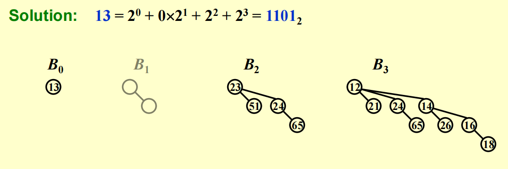
        </div>    

!!! note "一些结论"

    - 在一个二项队列中，在偶数深度的节点数不小于在奇数深度的节点数（假定根节点的深度为0）

## Operations

- `FindMin`
    - 二项堆中的最小元素位于其中一棵二项树的根节点
    - 因为二项堆至多有$\lceil \log N \rceil$个根节点，因此时间复杂度$T_p = O(\log N)$
    - 可以让程序记住最小值并随时更新，这样的话时间复杂度就是$O(1)$了
- `Merge`
    - 预先将二项堆内的树按高度排列
    - 本质上是一个二进制加法：
        - 从最小的二项树开始合并（从低位到高位）
        - 合并相同规模的二项树
            - 注意细节：根节点大的树附加在根节点小的树上（同一位上的两个数相加）
            - 可能会遇到有三个的规模相同的二项树的情况，此时任选两个二项树进行合并即可
        - 合并得到的新的二项树可能会被再次合并（进位）
    - 时间复杂度：$T_p = O(\log N)$

    ??? example "例子"

        <div style="text-align: center">
            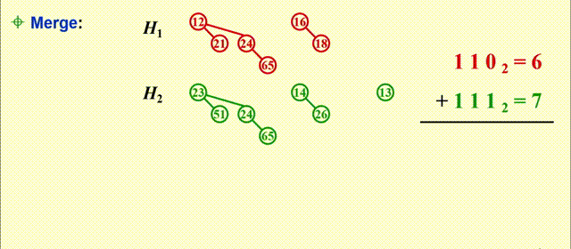
        </div>  

- `Insert`
    - 插入是一种特殊的合并操作 
    - 如果最小的，不存在的二项树为$B_i$，那么插入操作的时间复杂度为$T_p = \text{Const} \cdot (i + 1)$
    - 对一个空的二项堆执行$N$次插入操作，最坏情况下时间复杂度为$O(N)$，因此**平均**时间为**常数**（[后面](#analysis)会进行详细分析）

    ??? example "例子"

        将7个节点插入空的二项堆内：

        <div style="text-align: center">
            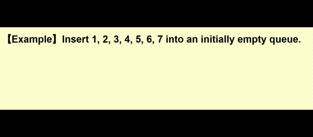
        </div> 


- `DeleteMin`
    - 流程：
        1. 在二项堆中执行`FindMin`操作（找到最小值）$\Rightarrow\ O(\log N)$
        2. 假设在$B_k$中找到最小值，那么将$B_k$从二项堆$H$中移除，剩下的二项堆记作$H'$ $\Rightarrow\ O(1)$
        3. 将$B_k$的根节点从$B_k$中移除，留下二项树$B_0, \dots, B_{k-1}$，记作$H''$ $\Rightarrow\ O(\log N)$
        4. 合并$H'$和$H''$，即`Merge(H', H'')` $\Rightarrow\ O(\log N)$
    - 时间复杂度：$O(\log N)$

    ??? example "例子"

        === "初始状态"

            <div style="text-align: center">
                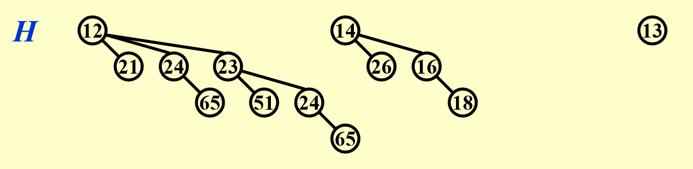
            </div>  

        === "找到最小值"

            <div style="text-align: center">
                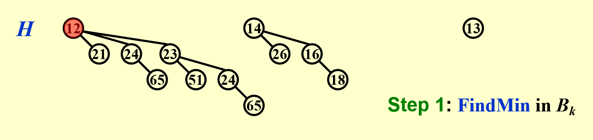
            </div>  

        === "移除最小值所在二项树"

            <div style="text-align: center">
                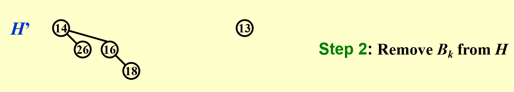
            </div>  

        === "移除根节点"

            <div style="text-align: center">
                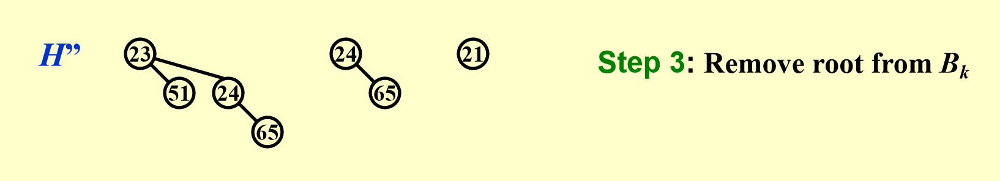
            </div>  

        === "合并"

            <div style="text-align: center">
                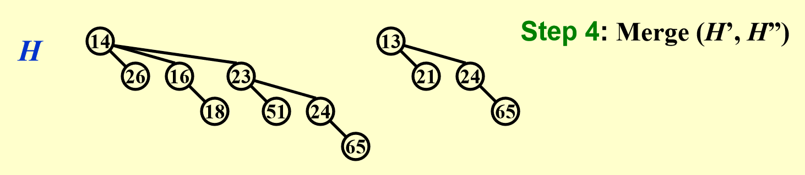
            </div>  
    

## Implementation

在代码实现中，我们会将二项堆作为一个存有多棵二项树的**数组**

|操作|性质|解决方案|
|:-:|:---|:-----|
|`DeleteMin`|快速找到所有的子树|将所有子树的根节点存在数组中（索引为树高）<br>并且使用**Left-child-next-sibling**（链表）方法维护二项树|
|`Merge`|孩子需按大小排序|新的树是最大的树，因此按**降序**维护子树|

<div style="text-align: center">
    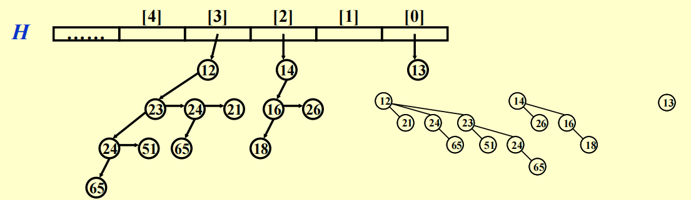
</div>  

下面给出了二项堆的删除最小值、合并、插入、查找操作的代码实现：  

???+ code "代码实现"

    ```cpp title="声明部分"
    typedef struct BinNode * Position;
    typedef struct Collection * BinQueue;
    typedef struct BinNode * BinTree;

    struct BinNode {
        ElementType Element;
        Position    LeftChild;
        Position    NextSibling;
    };

    struct Collection {
        int     CurrentSize; // total number of nodes
        BinTree TheTrees[MaxTrees];
    }
    ```

    ```cpp title="实现部分1"
    BinTree CombineTrees(BinTree T1, BinTree T2) {
        // merge equal-sized T1 and T2
        if (T1->Element > T2->Element)
            // attach the larger one to the smaller one
            return CombineTrees(T2, T1);
        // insert T2 to the front of the children list of T1
        T2->NextSibling = T1->LeftChild;
        T1->LeftChild = T2;
        return T1;
    }
    // Time Complexity: O(1)
    ```
    ??? play "动画演示"

        <div style="text-align: center">
            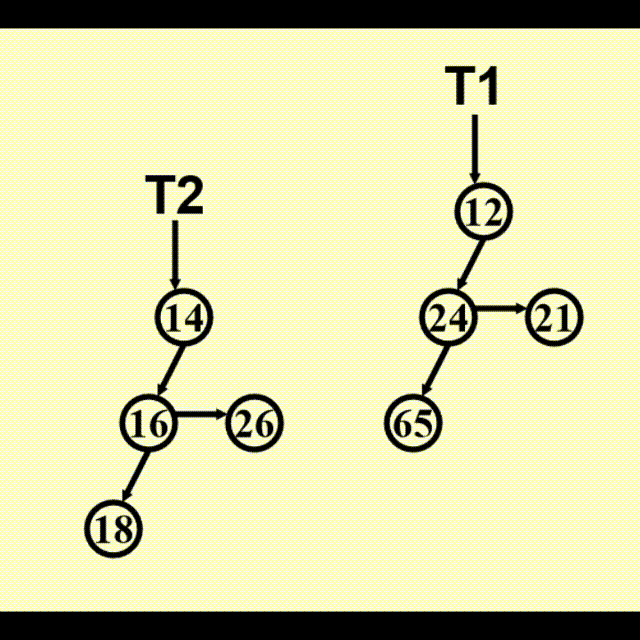
        </div> 

    ```cpp title="实现部分2"
    BinQueue Merge(BinQueue H1, BinQueue H2) {
        BinTree T1, T2, Carry = NULL;
        int i, j;
        if (H1->CurrentSize + H2->CurrentSize > Capacity)
            ErrorMessage();
        H1->CurrentSize += H2->CurrentSize;
        for (i = 0, j = 1; j <= H1->CurrentSize; i++, j*=2) {
            T1 = H1->TheTrees[i];
            T2 = H2->TheTrees[i]; // current trees
            // assign each digit to a tree:
            // | Carry | T2 | T1 |
            switch (4 * !!Carry + 2 * !!T2 + !!T1) {
                case 0:  // 000
                case 1:  // 001
                    break;
                case 2:  // 010
                    H1->TheTrees[i] = T2;
                    H2->TheTrees[i] = NULL;
                    break;
                case 4:  // 100
                    H1->TheTrees[i] = Carry;
                    Carry = NULL;
                    break;
                case 3:  // 011
                    Carry = CombineTrees(T1, T2);
                    H1->TheTrees[i] = H2->TheTrees[i] = NULL;
                    break;
                case 5:  // 101
                    Carry = CombineTrees(T1, Carry);
                    H1->TheTrees[i] = NULL;
                    break;
                case 6:  // 110
                    Carry = CombineTrees(T2, Carry);
                    H2->TheTrees[i] = NULL;
                    break;
                case 7:  // 111
                    H1->TheTrees[i] = Carry;
                    Carry = CombineTrees(T1, T2);
                    H2->TheTrees[i] = NULL;
                    break;
            } // end switch
        }  // end for-loop
        return H1;
    }


    ElementType DeleteMin(BinQueue H) {
        BinQueue DeletedQueue;
        Position DeletedTree, OldRoot;
        // the minimum item to be returned
        ElementType MinItem = Infinity;
        // MinTree is the index of the tree with the minimum item
        int i, j, MinTree;

        if (IsEmpty(H)) {
            PrintErrorMessage();
            return -Infinity;
        }

        // Step 1: find the minimum item
        // MaxTrees can be replaced by the actual number of roots
        for (i = 0; i < MaxTrees; i++) {
            if (H->TheTrees[i] && H->TheTrees[i]->Element < MinItem) {
                MinItem = H->TheTrees[i]->Element;
                MinTree = i;
            } // end if
        } // end for-i-loop
        DeletedTree = H->TheTrees[MinTree];

        // Step 2: remove the MinTree form H => H' 
        H->TheTrees[MinTree] = NULL;

        // Step 3.1: remove the root
        OldRoot = DeletedTree;
        DeletedTree = DeletedTree->LeftChild;
        free(OldRoot);
        // Step 3.2: create H
        DeletedQueue = Initialize();
        DeletedQueue->CurrentSize = (1 << MinTree) - 1; // 2^MinTree - 1
        for (j = MinTree - 1; j >= 0; j--) {
            DeletedQueue->TheTrees[j] = DeletedTree;
            DeletedTree = DeletedTree->NextSibling;
            DeletedQueue->TheTrees[j]->NextSibling = NULL; 
        } // end for-j-loop
        H->CurrentSize -= DeletedQueue->CurrentSize + 1;

        // Step 4: merge H' and H
        H = Merge(H, DeletedQueue);
        return MinItem;
    }


    BinQueue Insert(ElementType X, BinQueue H) {
        BinTree Carry; 
        int i; 

        H->CurrentSize++;
        Carry = malloc(sizeof(struct BinNode));
        Carry->Element = X;
        Carry->LeftChild = Carry->NextSibling = NULL;

        i = 0;
        while (H->TheTrees[i]) { 
            Carry = CombineTrees(Carry, H->TheTrees[i]); //combine two equal-sized trees
            H->TheTrees[i++] = NULL;
        }
        
        H->TheTrees[i] = Carry;
        return H;
    }


    BinTree Find(BinQueue H, ElementType X)
    {
        BinTree T, result = NULL;
        int i, j; 

        for(i = 0, j = 1; j <= H->CurrentSize; i++, j *= 2) {  /* for each tree in H */
            T = H->TheTrees[i];
            if (X >= T->Element){  /* if need to search inside this tree */
                result = Recur_Find(T, X);
                if (result != NULL) return result;
            } 
        }
        return result;
    }
    BinTree Recur_Find(BinTree T, ElementType X)
    {
        BinTree result = NULL;
        if (X == T->Element) 
            return T;
        if (T->LeftChild != NULL){
            result = Recur_Find(T->LeftChild, X);
            if (result != NULL) 
                return result;
        } 
        if (T->NextSibling != NULL)
            result = Recur_Find(T->NextSibling, X);
        return result;
    }  
    ```

## Analysis

结论：通过N次连续插入来创建一个有N个元素的二项堆所需要的时间为$O(N)$

???+ proof "证明"

    === "法1：聚合(aggregate)分析法"

        >下面的分析主要根据wyy的讲义，cy的PPT看不太懂。

        我们先简单模拟一下前几步的插入操作：

        |序号|二项堆|操作|
        |:-|:-|:-|
        |0001(1)|$\quad\ \quad\ \quad\ B_0$|插入1次|
        |0010(2)|$\quad\ \quad\ B_1$|插入1次，合并1次|
        |0011(3)|$\quad\ \quad\ B_1\ B_0$|插入1次|
        |0100(4)|$\quad\ B_2$|插入1次，合并2次|
        |0101(5)|$\quad\ B_2\ \quad\ B_0$|插入1次|
        |0110(6)|$\quad\ B_2\ B_1$|插入1次，合并1次|
        |0111(7)|$\quad\ B_2\ B_1\ B_0$|插入1次|
        |1000(8)|$B_3$|插入1次，合并3次|
        |1001(9)|$B_3\ \quad\ \quad\ B_0$|插入1次|
        |...|...|...|

        可以总结以下规律：

        - 每一步都有“插入1次”的操作，对应二进制数最低位的比特翻转（0->1, 1->0）
        - 当出现“合并k次”时，第$k-1$位（$2^k$）、第$k-2$位、...、第$0$位均发生比特翻转

        我们规定一次插入消耗的成本(cost)为“1个时间单元 + 合并时额外产生的时间单元（不是每次插入都有）”，这个成本对应的就是二进制数的比特翻转

        插入N个元素对应的值为N，它的二进制位数为$\lfloor \log N \rfloor + 1$，因此N次插入所需时间即为所有成本之和：

        $$
        N + \dfrac{N}{2} + \dfrac{N}{4} + \dots + \dfrac{N}{2^{\lfloor \log N \rfloor + 1}}
        $$

        当$N \rightarrow \infty$时，该值趋近$2N$，因此总体时间复杂度为$O(N)$

    === "法2：势能分析法"

        结论：如果插入操作花费$c$单元的成本（插入c个元素），那么该插入操作会使二项堆净增加$2-c$棵树。

        >我目前没想通原因，这个涉及到对cy聚合法部分的理解（~~我连cy写的聚合法都看不懂~~）

        - 令$C_i$为第$i$次插入所耗费的成本
        - 令$\Phi_i$为$i$次插入后二项堆内树的棵数（$\Phi_0 = 0$）（或者说二进制数中含`1`的个数）

        ??? statistic "插入成本与势能变化之间的关系"

            <div style="text-align: center">
                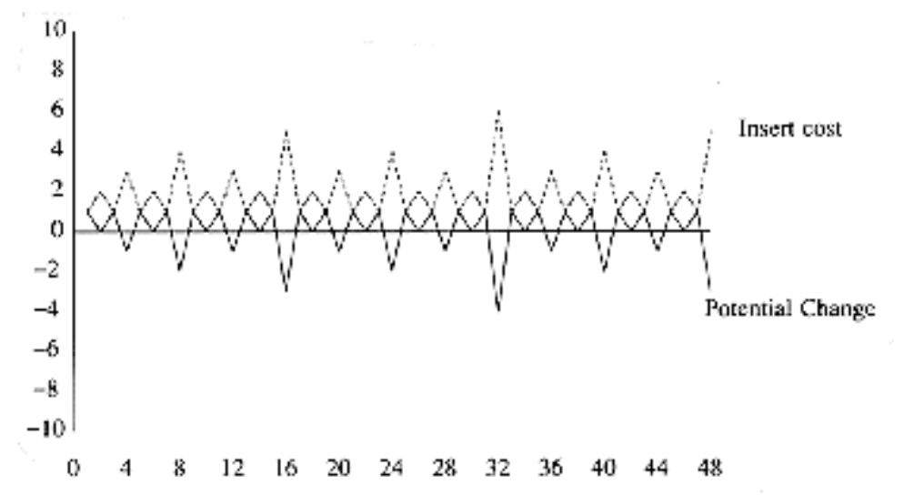
            </div>        

        那么满足下列关系：
        $$
        C_i + (\Phi_i - \Phi_{i-1}) = 2 \quad \text{for all } i = 1, 2, \dots, N
        $$

        累加得：
        $$
        \sum\limits_{i=1}^N C_i + \Phi_N - \Phi_0 = 2N
        $$

        所以：
        $$
        \sum\limits_{i=1}^N = 2N - \Phi_N \le 2N = O(N)
        $$

        尽管最坏情况下插入的时间复杂度$T_{\text{worst}} = O(\log N)$，但摊还时间复杂度$T_{\text{amortized}} = 2$

N次插入所需时间的图像：

<div style="text-align: center">
    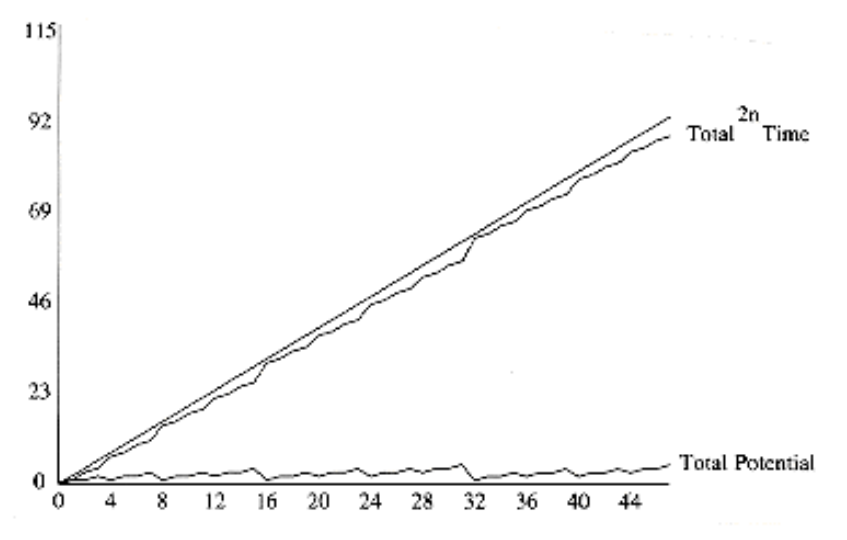
</div>

## Other Heaps

### 2-3-4 Heaps

2-3-4堆与2-3-4树类似，但不同之处在于：

- 2-3-4堆中只有叶子节点存储键值（B+树也是如此），每个叶子存储的键值互不相同，叶子节点中的键值无需排序（不同于B+树）
- 对于内部节点`x`，它有以下字段：
    - `small`：`x`所有叶子节点中的最小键值（1个）
    - `height`：以`x`为根节点的树的高度
- 因为2-3-4堆用于内存中，所以无需考虑磁盘读写操作

操作：

- `Minimum`：返回指向最小键值所在叶子结点的指针
- `DecreaseKey`：为指定叶子节点`x`减去一定的键值`k`
- `Insert`：将键值为`k`的叶子节点`x`插入到堆中
- `Delete`：删除给定叶子结点`x`
- `ExtractMin`：提取叶子节点中最小的键
- `Union`：合并两个堆，返回合并后的堆，并删除另一个堆

读者可自行验证这些操作的时间复杂度均为$O(\log n)$，其中$n$为堆的节点数。

### Fibonacci Heaps

由于时间原因，这块就鸽掉了。如果对这块内容感兴趣的话（~~或者要做Project的话~~），可阅读《算法导论》（英文原书）$P_{505-530}$。

---
!!! note "总结：各种堆的操作时间复杂度（by wyy）"

    ||二叉堆|左偏堆|斜堆|二项堆|斐波那契堆|
    |:-:|:-:|:-:|:-:|:-:|:-:|
    |`Insert`|$O(\log n)$|$O(\log n)$|$O(\log n)$|$O(1)$|$O(1)$|
    |`Merge`|$O(n)$|$O(\log n)$|$O(\log n)$|$O(\log n)$|$O(1)$|
    |`DeleteMin`|$O(\log n)$|$O(\log n)$|$O(\log n)$|$O(\log n)$|$O(\log n)$|
    |`Delete`|$O(\log n)$|$O(\log n)$||$O(\log n)$|$O(\log n)$|
    |`DecreaseKey`|$O(\log n)$|$O(\log n)$||$O(\log n)$|$O(1)$|
