# Lec 6: Backtracking

## Introduction

要想得到某个问题的解，一种方法是列出所有可能的情况，然后对它们逐一检查并识别出可能的解，这种方法称为**暴力(brute force)枚举**，但它仅在情况数不多的时候是可行的，而且它的效率实在太低了，我们无法保证它能在有限时间内找到正确解。

一种优化的方法是本章将要介绍的**回溯法**(backtracking)，它在检查情况的时候会消除一些不合适的情况（称为**剪枝**(pruning)），从而加快查找的速度，同时又能保证找出所有的可行解。

回溯法的大致思路是：

- 假设我们已经得到部分解$(x_1, \dots, x_i)$，其中$x_k \in S_k, 1 \le k \le i < n$（个人理解：$S_k$表示第$k$步下的选择集(S means Stage or (partial) Solution)，而$x_k$便是其中的一个选项）
- 首先将一种可能情况为$x_{i+1} \in S_{i+1}$加到这个部分解中，并检查新的部分解$(x_1, \dots, x_i, x_{i+1})$是否满足限制条件
- 如果满足条件，继续添加下一种情况到部分解中（重复上一步）
- 但如果$S_{i+1}$中没有满足要求的选择，那么表示沿$x_i$往下走是走不通的，那么就删掉$x_i$，并且**回溯**到上一个部分解$(x_1, \dots, x_{i-1})$，然后从$S_i$中挑选另外的可能情况$x_i'$，以此类推

### Template

!!! info "注"

    如果是初次阅读本笔记，建议先看下面的八皇后问题和Turnpike重构问题后再来看该模板，这样印象会更深一点。

??? code "代码实现"

    ```cpp
    bool Backtracking (int i) {
        Found = false;
        if (i > N)
            return true;  // solved with (x1, ..., xN)
        for (each xi in Si) {
            // check if satisfies the restriction R
            OK = Check((x1, ..., xi), R);  // pruning
            if (OK) {
                Count xi in;
                Found = Backtracking(i + 1);
                if (!Found)
                    Undo(i);  // recover to (x1, ..., x{i-1})
            }
            if (Found) break; 
        }
        return Found;
    }
    ```

???+ note "注"

    - 回溯的效率跟可能情况$S$的规模、约束函数的复杂性、满足约束条件的结点数相关
    - 约束函数决定了剪枝的效率，但是如果函数本身太复杂也未必合算
    - 满足约束条件的解的数量很难估计，因而对回溯算法的时间复杂度分析很难完成

## Examples

### Eight Queens

#### Description

!!! question "问题描述"

    将8个皇后放在$8 \times 8$的棋盘上，保证任何两个皇后之间不会相互攻击。其中皇后的攻击条件为：两个皇后位于同一行、同一列或同一对角线上。

??? info "可行解"

    <div style="text-align: center">
        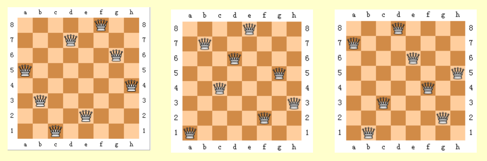
    </div>


下面我们用数学化的语言重新描述这一问题，便于我们设计合适的算法：

- 令$Q_i$为棋盘上第$i$行的皇后，$x_i$为$Q_i$的列索引，$S_i$为$x_i$可取值的集合
- 限制条件为：
    - $S_i = \{1, 2, 3, 4, 5, 6, 7, 8\}$，其中$1 \le i \le 8$
        - 这表明八皇后问题一共有$8^8$种可能解
    - 当$i \ne j$时，$x_i \ne x_j$
        - 这表明每个解是$1, 2, \dots, 8$的排列，所以可能解的个数降到了$8!$个
        - 延伸：对于n皇后问题，一共有$n!$种可能解
    - $\dfrac{x_i - x_j}{i - j} \ne \pm 1$
        - 用于确保“不在同一对角线”的限制条件

#### Method

受篇幅限制，列出八皇后问题的所有可行解不太现实，因此下面将以四皇后问题为例介绍解法（八皇后问题的解法与之基本一致，只是规模更大了些）：

- 构建一棵**博弈树**(game tree)

    <div style="text-align: center">
        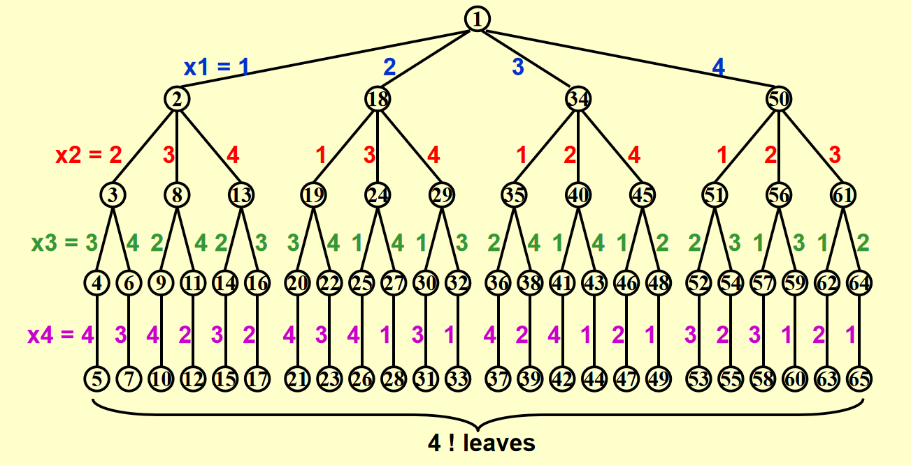
    </div>

    - 每一条从根节点到叶子节点的路径即为一种可能的解
    - 节点内的数字表示搜索的顺序，深度为$i$的节点表示第$i$行上的皇后
    - 不难发现，这棵博弈树已经排除了两个皇后同行同列的情况，因此之后只需检验是否在同一对角线即可
    - 博弈树只是一个抽象模型，便于我们直观感受和理解回溯法的过程，实际编写程序时无需创建这样的树

- 通过执行**深度优先搜索**(depth-first search)（后序遍历）来检验每一条可能的路径

    ???+ play "动画演示"

        - 由于GIF图片最多只能播放30s的动画，因此我将这一过程截成了两半，请见谅\~
        - 其中浅绿高亮表示待检验的节点，黑色高亮表示不可行的节点

        === "过程1"

            <div style="text-align: center">
                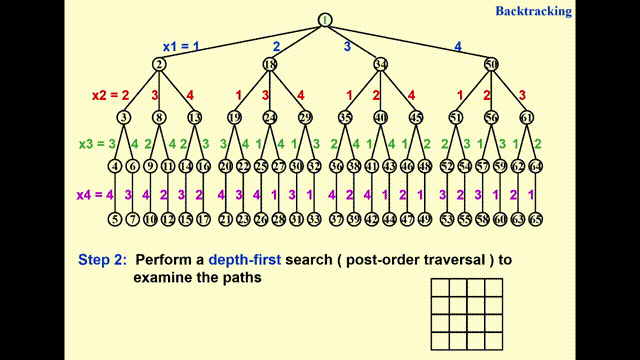
            </div>

        === "过程2"

            <div style="text-align: center">
                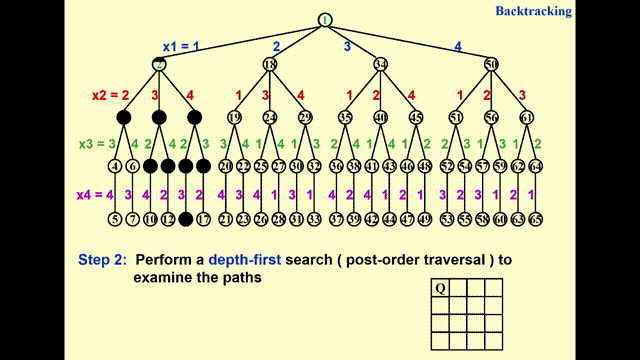
            </div>

>补充：[n皇后问题解的个数](https://en.wikipedia.org/wiki/Eight_queens_puzzle#Exact_enumeration)

### Turnpike Reconstruction

#### Description

!!! question "问题描述"

    背景知识：给定$N$个在x轴上的点，它们的坐标满足$x_1 < x_2 < \dots x_N$，并假设$x_1 = 0$。在所有点中任取两点，一共有$\dfrac{N(N-1)}{2}$种取法，对应有$\dfrac{N(N-1)}{2}$不同的路径。
    
    问题：给定$\dfrac{N(N-1)}{2}$条路径，如何重新构造(reconstruct)一个点集？


#### Method

???+ example "例子"

    === "问题"

        根据距离集$D = \{1, 2, 2, 2, 3, 3, 3, 4, 5, 5, 5, 6, 7, 8, 10\}$构造点集。

    === "解答"
    
        - 解方程$\dfrac{N(N-1)}{2} = 15$，解得$N = 6$，即一共有6个点
        - 由于已知$x_1 = 0$且最长的距离为10，可以推断最远的点的坐标$x_6 = 10$，将10从$D$中删除，表示我们暂时不会用到这个距离
        - 继续检查下一个**最大的距离**，找出当前所有可行点的位置，使用回溯法往下搜索，直到找出正确的解。这里的步骤说不太清楚，还是直接看下面的动画演示吧：

        ???+ play "动画演示"

            === "初始状态（完成第二步后）"

                <div style="text-align: center">
                    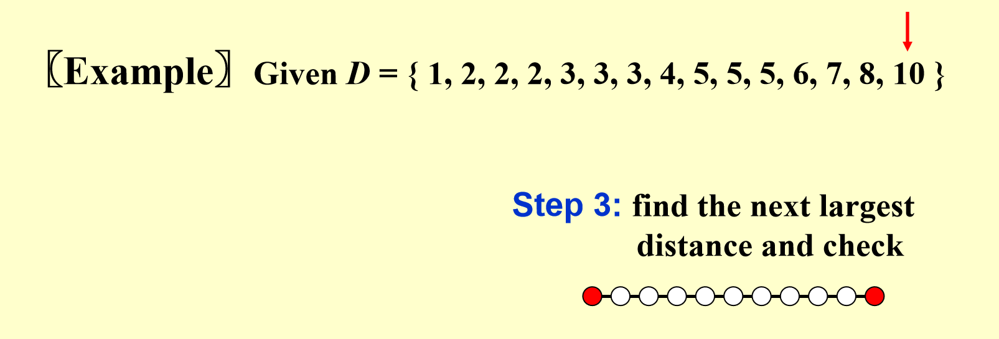
                </div>          

                - 第1个点和最后那个点已用红色高亮标出，表示（暂时）确定它们的位置，
                - 距离集$D$中的数字10被红色箭头指着，表示将它（暂时）从集合中“删除”，之后不会再用到这个距离了


            === "找到距离8"

                <div style="text-align: center">
                    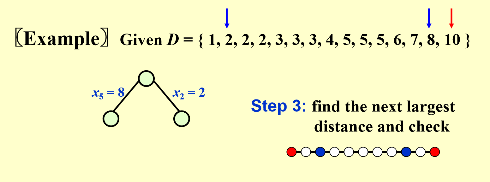
                </div> 

                - 一共有两种情况：$x_5 = 8$（$x_5 - x_1 = 8$）或$x_2 = 2$（$x_6 - x_2 = 8$），根据深度优先搜索，我们先探索左边的分支
                - 将距离集中的1个$2$和$8$删掉，因为新点的加入导致更多距离的出现

            === "找到距离7"

                <div style="text-align: center">
                    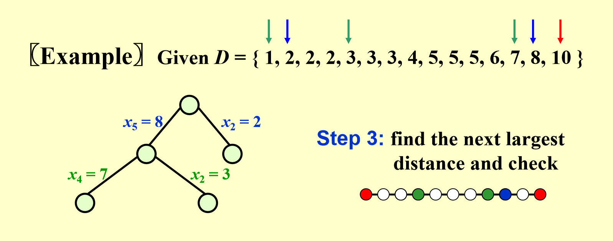
                </div> 

                - 一共有两种情况：$x_4 = 7$（$x_4 - x_1 = 7$）或$x_2 = 3$（左边的分支中还没用到$x_2$，$x_6 - x_2 = 7$），根据深度优先搜索，我们先探索左边的分支
                - 将距离集中的$1$、1个$3$和$7$删掉

            === "找到距离6"

                <div style="text-align: center">
                    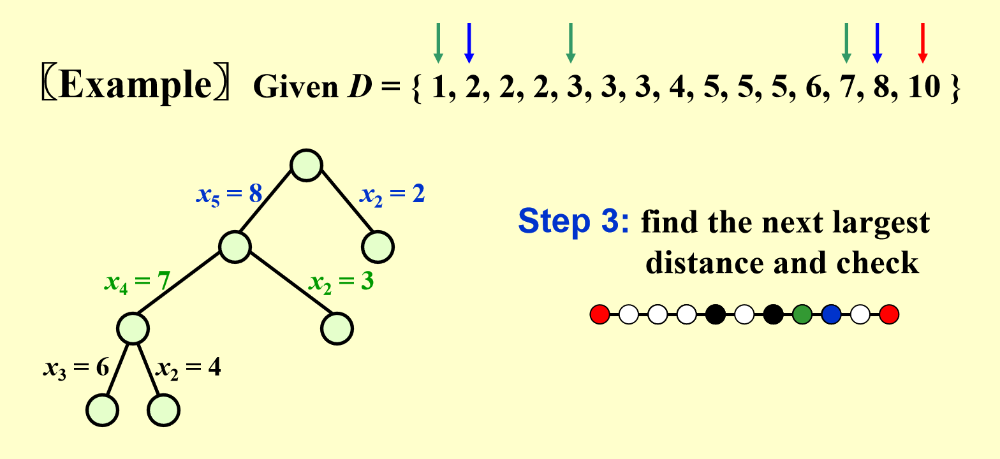
                </div> 

                - 一共有两种情况：$x_3 = 6$（$x_3 - x_1 = 6$）或$x_2 = 4$（$x_6 - x_2 = 6$）
                - 经检验，这两种情况均不满足要求
                    - $x_3 = 6$时，有$x_4 - x_3 = x_5 - x_4 = 1$，但距离集中只有1个$1$，不满足条件
                    - $x_2 = 4$时，有$x_2 - x_1 = x_5 - x_2 = 4$，但距离集中只有1个$4$，不满足条件
                - 所以通过回溯，回到$x_2 = 3$的分支上，记得恢复点集和距离集中被用掉或被删掉的点或路径

                <div style="text-align: center">
                    
                </div> 

            === "继续搜索（原理同前，不再赘述）"

                <div style="text-align: center">
                    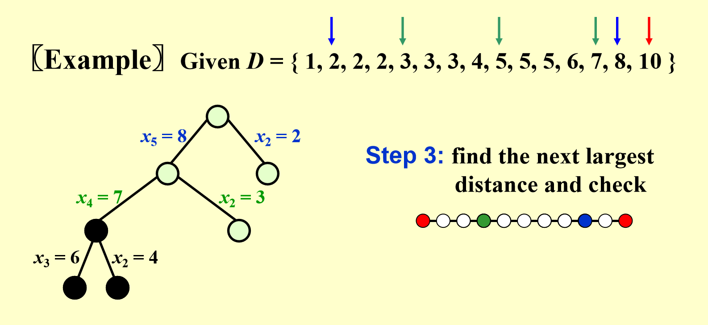
                </div> 

                <div style="text-align: center">
                    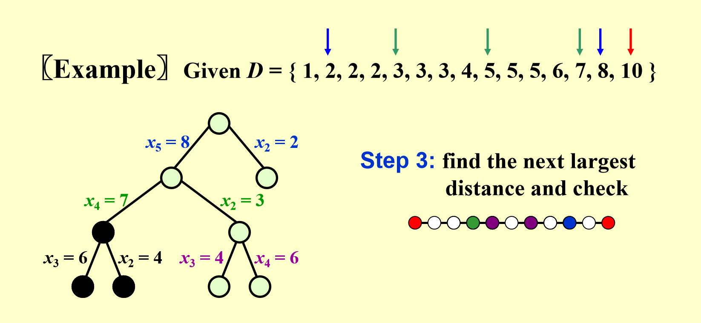
                </div> 

                <div style="text-align: center">
                    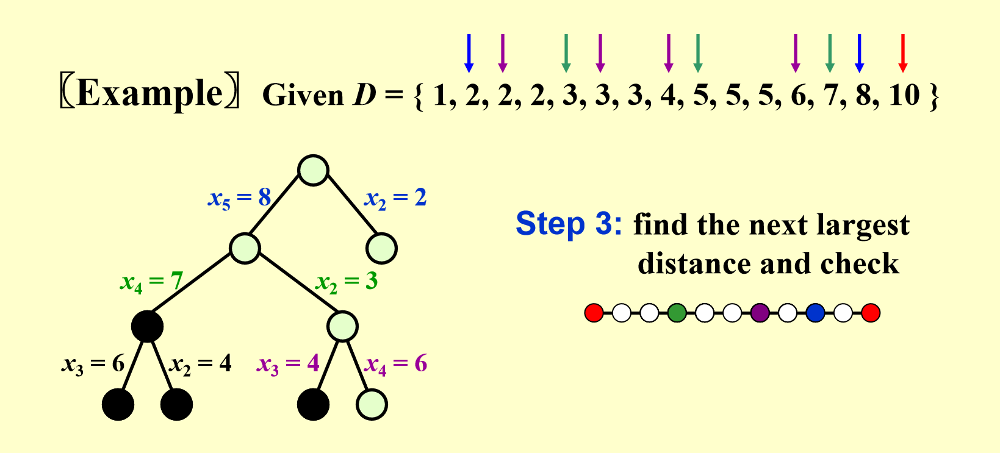
                </div> 

                最后，我们终于找到一种正确的点集！

                <div style="text-align: center">
                    
                </div> 

        ??? question "问题：为什么第3步不是找“下一个**最小的**距离”"

            相较于找最小的距离，找最大的距离所产生的可能性更少（或者解空间更小）（通常来说只有两种情况，分别在靠近两端的位置上），可以提升查找效率；而最小距离对应的点的位置往往是很难确定的，这样反而会加大查找的难度。

??? code "代码实现"

    ```cpp
    bool Reconstruct(DistType X[], DistSet D, int N, int left, int right) {
        // X[1]...X[left-1] and X[right+1]...X[N] are solved
        bool Found = false;
        if (is_Empty(D))
            return true;  // solved
        D_max = Find_Max(D);
        // option 1: X[right] = D_max
        // check if |D_max - X[i]| in D is true for all X[i]'s that have been solved
        OK = Check(D_max, N, left, right);  // pruning
        if (OK) {  // add X[right] and update D
            X[right] = D_max;
            for (i = 1; i < left; i++)
                Delete(abs(X[right] - X[i]), D);
            for (i = right + 1; i <= N; i++)
                Delete(abs(X[right] - X[i]), D);
            Found = Reconstruct(X, D, N, left, right - 1);
            if (!Found) {  // if does not work, undo
                for (i = 1; i < left; i++)
                    Insert(abs(X[right] - X[i]), D);
                for (i = right + 1; i <= N; i++)
                    Insert(abs(X[right] - X[i]), D);
            }
        }
        // finish checking option 1

        if (!Found) {  // if option 1 does not work
            // option 2: X[left] = X[N] - D_max
            OK = Check(X[N] - D_max, N, left, right); 
            if (OK) { 
                X[left] = X[N] - D_max;
                for (i = 1; i < left; i++)
                    Delete(abs(X[left] - X[i]), D);
                for (i = right + 1; i <= N; i++)
                    Delete(abs(X[left] - X[i]), D);
                Found = Reconstruct(X, D, N, left + 1, right);
                if (!Found) { 
                    for (i = 1; i < left; i++)
                        Insert(abs(X[left] - X[i]), D);
                    for (i = right + 1; i <= N; i++)
                        Insert(abs(X[left] - X[i]), D);
                }
            } 
            // finish checking option 2
        }  // finish checking all the option

        return Found;
    }
    
    ```

???+ note "一些小结论"

    - 如果将距离集存储在一棵AVL树中，且没有回溯发生，那么该算法的时间复杂度为$O(N^2 \log N)$，其中$N$为点数

### Games: Tic-tac-toe

#### Description

!!! question "问题描述"

    **井字棋**(tic-tac-toe)：在$3 \times 3$的棋盘上，一位玩家画圈，另一位玩家画叉，轮流下棋。如果某位玩家在棋盘上的所有标记中有3个位于同一行、同一列或同一对角线上，则该玩家获胜。    

    <div style="text-align: center">
        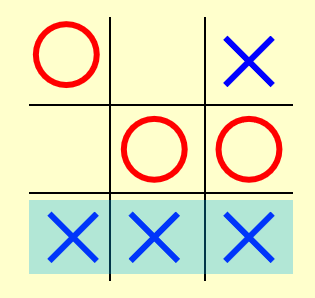
    </div> 

- 一共有$3^9$种可能的棋局（每个格子上有圈、叉、空三种情况，不考虑获胜后停止下棋的问题）
- 一共有$9!$种可能的下棋顺序（不考虑当前的棋子是圈还是叉）

#### Method

我们采用[**极小化极大策略**](https://en.wikipedia.org/wiki/Minimax)(minimax strategy)来解决井字棋的问题，这一策略对于棋手双方而言都是最佳策略。

- 使用一个**评估函数**(evaluation function)来量化当前棋局$P$的价值：通常令为$f(P) = W_{\text{Computer}} - W_{\text{Human}}$，$W$表示在当前棋局$P$下可能的获胜情况数
- 假设玩家双方分别是人类和计算机，根据上述评估函数，显然人类倾向于最小化当前棋局$P$下的**价值**(goodness)（$f(P)$越小，人类获胜的可能越大），而计算机倾向于最大化$P$下的价值（$f(P)$越大，计算机获胜的可能越大）

    ??? example "例子"

        <div style="text-align: center">
            
        </div> 

        - 蓝色的叉是计算机画的，红色的圈是人类画的
        - 不难得出：$W_{\text{Computer}} = 6, W_{\text{Human}} = 4$，所以$f(P) = 6 - 4 = 2$

???+ play "动画演示"

    - 为了解释的方便，我们不考虑更后面的轮数（实在画不下这么大的博弈树！），所以从第2轮开始分析
    - 计算机对应“叉”，人类对应“圈”

    === "第2轮后"

        <div style="text-align: center">
            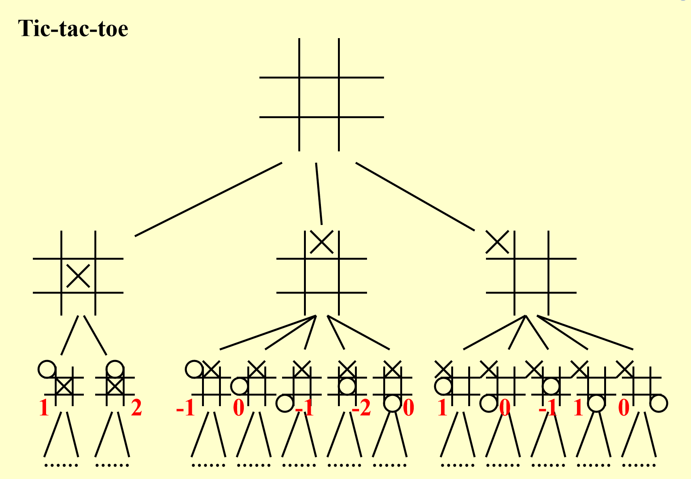
        </div> 

        先计算在第二轮结束后所有情况下的评估函数值（红色数字）

    === "第1轮后"

        <div style="text-align: center">
            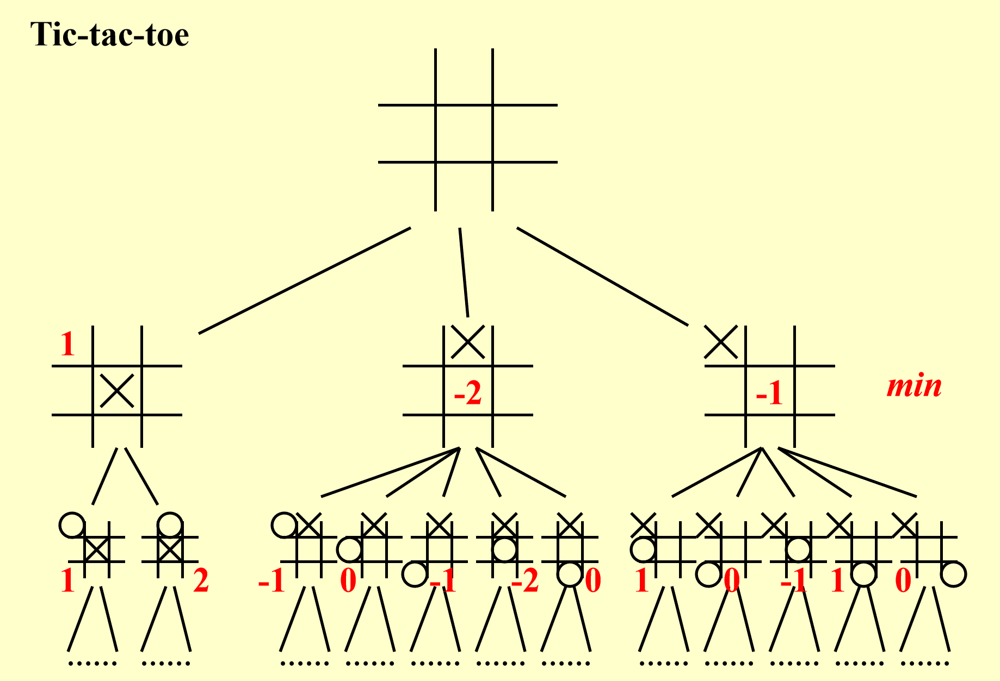
        </div> 

        - 可以看出，第二轮是**人类**下棋，因此第一轮的评估函数值为第二轮评估函数中的**最小值**
        - 这样的话人类在第二轮中应该选择第二种情况，因为它的评估函数值最小，说明它获胜的希望更大


    === "第0轮后（即刚开始）"

        <div style="text-align: center">
            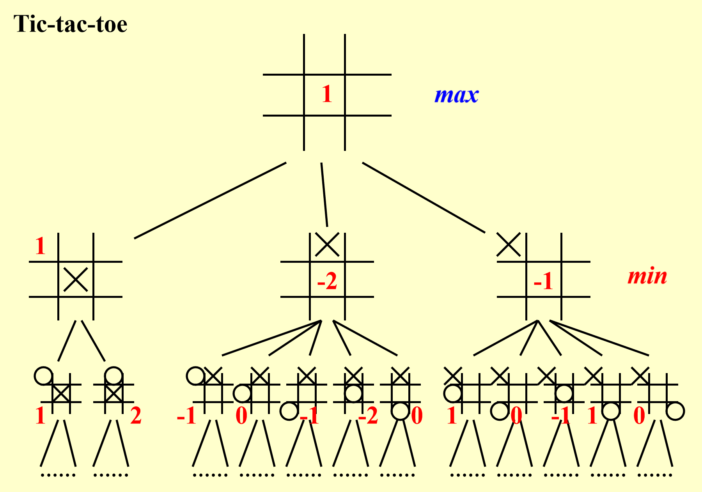
        </div> 

        - 第一轮是**计算机**下棋，因此第0轮的评估函数值为第一轮评估函数中的**最大值**

**$\alpha-\beta$剪枝**：它结合了$\alpha$剪枝和$\beta$剪枝，能够将博弈树的搜索规模限制在$O(\sqrt{N})$个节点（$N$为博弈树的节点数），提升搜索的效率。

- $\alpha$剪枝：对于下列情况，我们不需要再搜索根节点为`?`的子树

    <div style="text-align: center">
        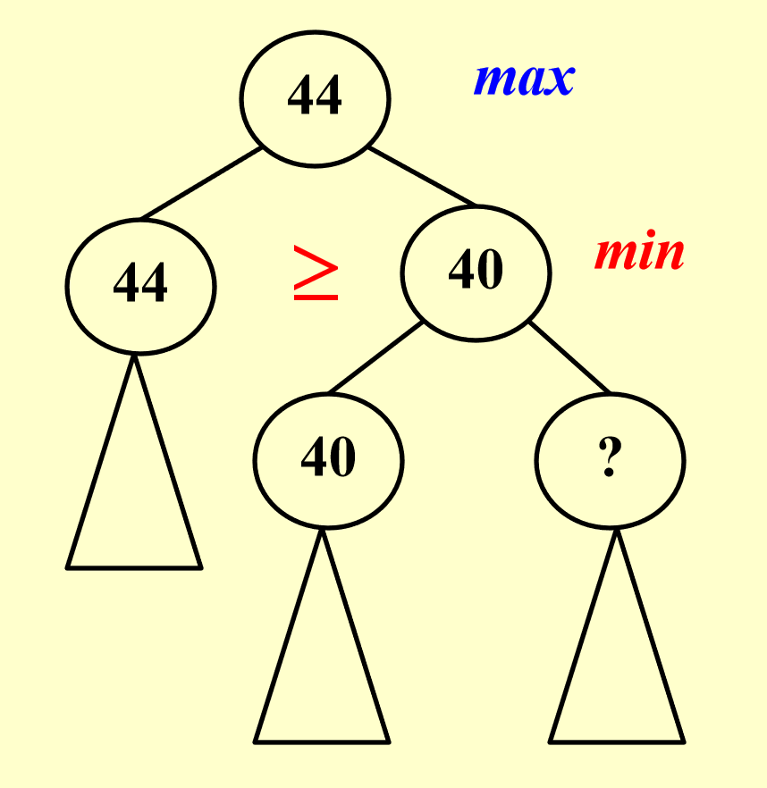
    </div> 

    - 若`? >= 40`，第二层的节点`40`不会更新，因为该节点取的是左右孩子的最小值
    - 若`? < 40`，虽然第二层节点的`40`会更新，但是不影响第一层的节点，因为第一层节点取的是左右孩子的最大值，而最大值原来就不是这个更新的节点


- $\beta$剪枝：对于下列情况，我们不需要再搜索根节点为`?`的子树

    <div style="text-align: center">
        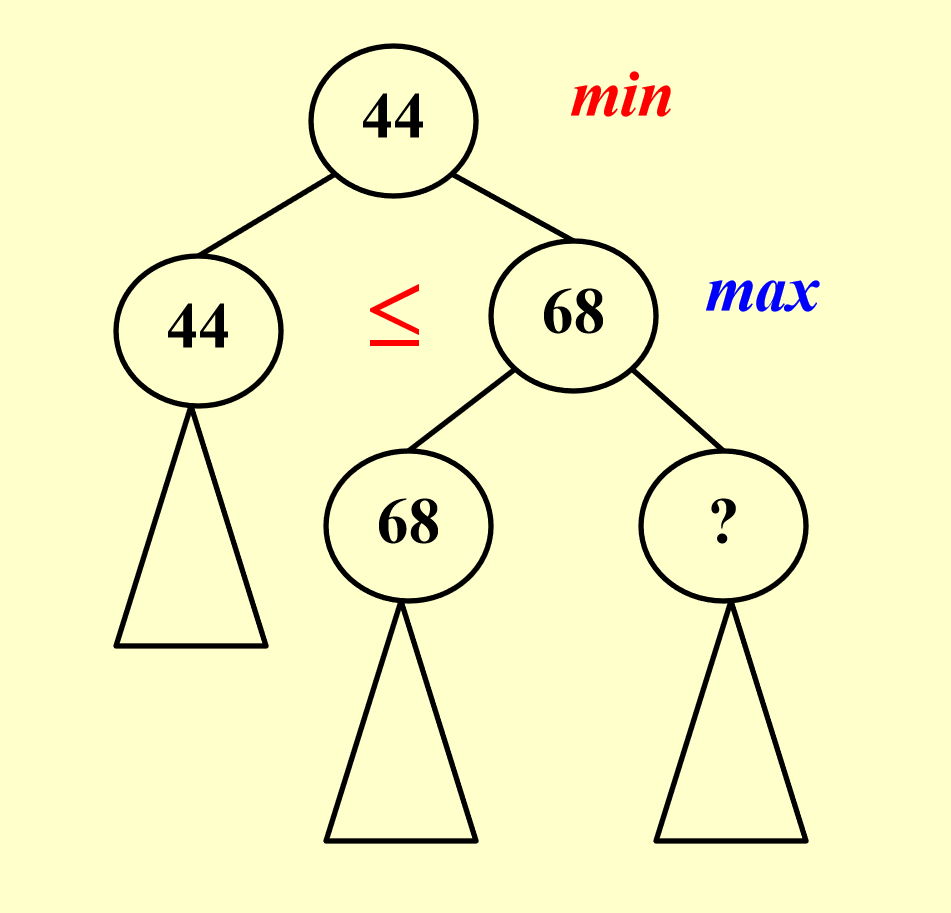
    </div> 

    - 若`? <= 68`，第二层的节点`68`不会更新，因为该节点取的是左右孩子的最大值
    - 若`? > 68`，虽然第二层节点的`68`会更新，但是不影响第一层的节点，因为第一层节点取的是左右孩子的最小值，而最小值原来就不是这个更新的节点