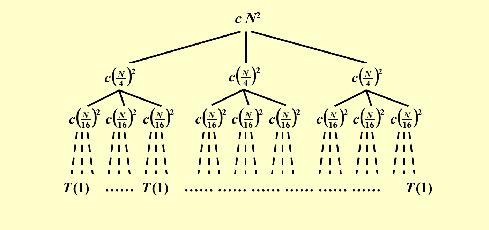

# Lec 7: Divide and Conquer

**分治(divide and conquer)算法**已经是我们的老朋友了——在FDS的学习中，我们已经在这些问题中用到了分治算法：

- [求最大子序列之和](../fds/2.md#algorithm-3)（$O(N \log N)$）
- [树的遍历](../fds/4.md#tree-traversals)（$O(N)$）
- [归并排序](../fds/7.md#mergesort)、[快速排序](../fds/7.md#quicksort)（$O(N \log N)$）

再来简单回顾一下分治的大致思想：该算法**递归**地进行下列操作

- 将问题分成(divide)一系列的子问题
- 递归解决(conquer)这些子问题
- 将子问题的解合并起来(combine)，构成原问题的解

时间复杂度的递推公式为：

$$
T(N) = aT(\dfrac{N}{b}) + f(N)
$$

## Examples

如果好久没有接触过分治算法，不妨拿下面这道题练练手，温习一下分治算法的做法。

### Closest Points Problem

!!! question "问题描述"

    在平面上给定$N$个点，请找出距离最近的一对点（如果两个点位于相同的位置，则认为它们之间的距离为0，但本题保证所有点均分布在不同的位置上）。

!!! note "解法"

    === "法1：简单的穷举查找"

        一共有$N$个点，那么就有$\dfrac{N(N - 1)}{2}$个距离，逐一遍历和比较这些距离，时间复杂度为$T = O(N^2)$。

    === "法2：分治算法"

        回顾一下最大子序列之和的解法：我们先将整个序列拆成两半，然后分别计算左半边子序列，右半边子序列，以及分界线中间区域子序列的最大和，最后取这3个结果中的最大者，作为该序列的最大子序列之和。这里我们借鉴这种解法来解决这一问题。

        <div style="text-align: center">
            
        </div>

        - 首先，我们根据这些点的x轴坐标，将整个区域一分为二（用绿色竖线隔开），划分时确保两边的点的数目大致相等
        - 这里仅画了三根两点间的连线，分别对应了三种不同的情况：左半边、中间和右半边
        - 其中左半边和右半边这两种情况可以递归解决，因此我们最关心的问题是如何处理**中间**的情况，如何确保它的时间复杂度是**线性**的（因为只有这样才确保整个算法的时间复杂度为$O(N \log N)$）

        ??? proof "解释"

            在这个问题中，对于时间复杂度的递推公式$T(N) = aT(\dfrac{N}{b}) + f(N)$，$a = b = 2$，令$f(N) = cN$，那么：

            $$
            \begin{align}
            T(N) & = 2T(\dfrac{N}{2}) + cN \notag \\
            & = 2[2T(\dfrac{N}{2^2}) + c\dfrac{N}{2}] + cN \notag \\
            & = 2^2 T(\dfrac{N}{2^2}) + 2cN \notag \\
            & = \dots \notag \\
            & = 2^k T(\dfrac{N}{2^k}) + kcN \notag \\
            & = N + cN \log N = O(N \log N) \notag
            \end{align}
            $$

            如果$f(N) = cN^2$，那么：

            $$
            \begin{align}
            T(N) & = 2T(\dfrac{N}{2}) + cN^2 \notag \\
            & = 2[2T(\dfrac{N}{2^2}) + c\dfrac{N^2}{2^2}] + cN^2 \notag \\
            & = 2^2 T(\dfrac{N}{2^2}) + cN^2(1 + \dfrac{1}{2}) \notag \\
            & = \dots \notag \\
            & = 2^k T(\dfrac{N}{2^k}) + cN^2(1 + \dfrac{1}{2} + \dots + \dfrac{1}{2^{k-1}}) \notag \\
            & = O(N^2) \notag
            \end{align}
            $$

            这里用到的分析方法就是下面即将介绍的**代换法**(substitution)。

        - 如果考虑分隔线两边所有的点，那么时间复杂度就会来到了$O(N^2)$的水平，这显然不是我们所希望的
        - 一种可行的改进方法是：<u>仅考虑距分隔线水平距离为$\delta$内的点</u>，其中$\delta$是我们提前选定的常数。现在，我们得到了一个位于中间部分，且宽度为$2\delta$的区域，称为$\delta$带($\delta$-strip)。这个区域之外的点显然不会是最近点对的可能点

            <div style="text-align: center">
                
            </div>  

            - 代码实现如下：

            ??? code "代码实现"

                ```cpp
                // points are in the strip
                for (i = 0; i < NumPointsInStrip; i++)
                    for (j = i + 1; j < NumPointsInStrip; j++)
                        if (Dist(Pi, Pj) < delta)
                            delta = Dist(Pi, Pj);
                ```

            - 如果能够确保$\delta$带内的点数为$O(\sqrt{N})$，那么计算中间情况的时间复杂度就是$O(\sqrt{N} \times \sqrt{N}) = O(N)$了
            - 然而，如果$\delta$没有选好，最坏情况下$\delta$带内包含了所有点，那这个算法又退回到$O(N^2)$了。因此需要再次改进这个算法，避免这种最坏情况的发生

        - 进一步的改进方法是：在确定垂直$\delta$带区域的基础上，再划分水平$\delta$带区域。详细步骤为：
            - 根据点的y坐标，从y坐标最大的点开始依次遍历垂直$\delta$带内的每个点，对于每个点，我们仅计算位于该点下方且距离该点小于等于$\delta$的点和它之间的距离（划分水平$\delta$区域）
            - 对于y坐标相同的点，它们将会被一起处理
            - 对于正在被处理的点$p$，它一定位于一个$2\delta \times \delta$的矩形区域内，如图所示：

                <figure style=" width: 50%" markdown="span">
                    
                    
                    <figcaption></figcaption>
                </figure>

                - 分隔线正好将矩形划分为2个方形L和R
                - 可以验证，在最坏情况下，每个点只需要考虑与其他7个点的距离即可。此时，这些点分布于方形L的四个角以及方形R的四个角上（其中L的右侧与R的左侧重合，因此会有一些点重合），在上图分别为红色的四个点和绿色的四个点。如果在这个区域内，存在点不在这些角上，那么在该区域就会有两个点的距离小于$\delta$，那么这就不是最坏的情况了
                - 因此，即使所有的点都在垂直$\delta$带内，因为每个点的判断是常数次的，因此中间情况的时间复杂度就是$O(N)$了
            
            ??? code "代码实现"

                ```cpp
                // points are in the strip
                // and sorted by y coordinates
                for (i = 0; i < NumPointsInStrip; i++)
                    for (j = i + 1; j < NumPointsInStrip; j++)
                        if (Dist_y(Pi, Pj) > delta)
                            break;
                        else if (Dist(Pi, Pj) < delta)
                            delta = Dist(Pi, Pj);       
                ```

            ??? play "动画演示"

                <div style="text-align: center">
                    
                </div>  

        综上，本题分治算法的时间复杂度为$T(N) = 2T(\dfrac{N}{2}) + O(N) = O(N \log N)$


## Analysis

对于时间复杂度的递推公式$T(N) = aT(\dfrac{N}{b}) + f(N)$，我们有以下求解方法：

- **代换(substitution)法**
- **递归树(recursive-tree)法**
- **主方法(master method)**

在分析的时候，我们会忽略以下细节问题：

- 不关心$\dfrac{N}{b}$是否是整数
- 对于较小的$n$，始终假定$T(n) = \Theta(1)$

### Substitution

代换法是三种方法中最简单的一种（用来做判断、选择题较为方便）。它的主要思路是：先**猜**一个结论，然后用**归纳法**证明该结论的正确性。

???+ example "例子"

    已知$T(N) = 2T(\lfloor \dfrac{N}{2} \rfloor) + N$，求$T(N)$。

    - 先猜测$T(N) = O(N \log N)$
    - 再证明：

    ??? proof "证明"

        - 假设对于$m < N$，该结论成立
        - 取$m = \lfloor \dfrac{N}{2} \rfloor$，那么存在一个常数$c > 0$，使得
        $$
        T(\lfloor \dfrac{N}{2} \rfloor) \le c \lfloor \dfrac{N}{2} \rfloor \log \lfloor \dfrac{N}{2} \rfloor
        $$

        - 将这个式子带入递推公式，得：

        $$
        \begin{align}
        T(N) & = 2T(\lfloor \dfrac{N}{2} \rfloor) + N \notag \\
        & \le 2c \lfloor \dfrac{N}{2} \rfloor \log \lfloor \dfrac{N}{2} \rfloor + N \notag \\
        & \le cN(\log N - \log 2) + N \notag \\
        & \le cN \log N \quad \text{for}\ c \ge 1 \notag
        \end{align}
        $$

        - 不必特别在意$N = 1$的情况：前面的假设2已经“忽略”这种trivial case；或者也可以将$N = 2$或$N = 3$作为基本情况(base case)，只要$c$足够大这个式子一定成立

    ??? failure "错误的猜测"

        如果我们猜测$T(N) = O(N)$，那么会有以下证明：

        - 假设对于$m < N$，该结论成立
        - 取$m = \lfloor \dfrac{N}{2} \rfloor$，那么存在一个常数$c > 0$，使得
        $$
        T(\lfloor \dfrac{N}{2} \rfloor) \le c \lfloor \dfrac{N}{2} \rfloor
        $$

        - 将这个式子带入递推公式，得：

        $$
        \begin{align}
        T(N) & = 2T(\lfloor \dfrac{N}{2} \rfloor) + N \notag \\
        & \le 2c \lfloor \dfrac{N}{2} \rfloor + N \notag \\
        & \le cN + N = O(N) \notag
        \end{align}
        $$        

        这样的证明看起来没什么问题，但错误发生在最后一个不等式上：我们得到了$cN + N = (c + 1)N$，虽然它的时间复杂度确实是$O(N)$，但在形式上它是错误的，因为我们预先假设正确的结论是$T(m) \le cm$，所以要根据这个条件证明出形如$T(N) \le cN$的不等式正确，$(c + 1)N$在形式上就不满足要求了。换句话说，我们必须证明出**精确的形式**(exact form)，连系数也必须保持一致。

通过对这个例子的分析，我们发现这个方法最困难的点在于**做出一个好的猜测**。

???+ note "小技巧"

    - 如果时间复杂度的递推关系式中出现类似$T(\sqrt{N})$等形式，可以考虑**换元法**：
        - 令$m = \log n$，那么$T(\sqrt{n}) = T(2^{\frac{m}{2}})$，$T(n) = T(2^m)$
        - 再令$S(m) = T(2^m)$，那么$S(\dfrac{m}{2}) = T(2^{\frac{m}{2}})$，这样整个递推关系式就被转化为一般的形式了
    - 如果出现形如$T(f(N) + c)$的形式（$c$为常数），由于$N$足够大，因此可以忽略常数$c$

### Recursive Trees

顾名思义，就是根据递推关系递归地来画一棵树。这棵树具有以下特征（假如递推关系形如$T(N) = aT(\dfrac{N}{b}) + f(N)$）：

- 根节点为$f(N)$
- 一个节点有$a$个孩子，每个孩子节点为$f(\dfrac{N}{b})$，因此这棵树根据递推公式延伸下去，体现了“递归”的特性
- 叶子节点为$T(1)$
- 树的高度为$\log_b N$
- 时间复杂度 = 所有节点之和 = 内部节点（对应合并操作的时间复杂度）之和 + 叶子节点（对于base case的时间复杂度）之和

???+ example "例子"

    === "例1"

        已知$T(N) = 3T(\dfrac{N}{4}) + \Theta(N^2)$，求$T(N)$。

        根据这个递推关系和递归树的特征，我们可以一层层地画出这棵树：

        ???+ play "动画演示"

            === "Step 1"

                <div style="text-align: center">
                    
                </div>

                先令$T(N)$作为根节点  

            === "Step 2"

                <div style="text-align: center">
                    
                </div>  

                展开$T(N)$，令$f(N)$，即$cN^2$作为根节点，剩下的三个$T(\dfrac{N}{4})$作为它的孩子节点

            === "Step 3"

                <div style="text-align: center">
                    
                </div>  

                分别展开$T(\dfrac{N}{4})$，令$f(\dfrac{N}{4})$，即$c(\dfrac{N}{4})^2$作为根节点，剩下的三个$T(\dfrac{N}{16})$作为它的孩子节点 

            === "Step 4"          

                <div style="text-align: center">
                    
                </div>  

                一直展开下去，直到生成孩子节点$T(1)$为止

        对于这棵递归树，我们可以获得的信息有：

        - 树的高度为$\log_4 N$
        - 第$i$层一共有$3^i$个节点，且节点之和为$(\dfrac{3}{16})^i cN^2$
        - 由以上两条信息，可以推得最后一层的节点（全是$T(1)$）之和为$3^{\log_4 N} = N^{\log_4 3} = \Theta(N^{\log_4 3})$

        <div style="text-align: center">
            
        </div> 

        由以上信息，我们可以计算出$T(N)$：

        $$
        \begin{align}
        T(N) & = \sum\limits_{i=0}^{\log_4 N - 1}(\dfrac{3}{16})^i cN^2 + \Theta(N^{\log_4 3}) \notag \\
        & < \sum\limits_{i=0}^{\infty}(\dfrac{3}{16})^i cN^2 + \Theta(N^{\log_4 3}) \notag \\
        & = \dfrac{cN^2}{1 - \frac{3}{16}} + \Theta(N^{\log_4 3}) = O(N^2) \notag
        \end{align}
        $$ 

        - 第2行到第3行的不等式中，用到了一个常用的幂级数展开公式：
        $$
        \dfrac{1}{1 - x} = \sum\limits_{n = 0}^{\infty} x^n, |x| < 1
        $$

        - 这道题可以用代换法来验证答案的正确性

    === "例2"

        已知$T(N) = T(\dfrac{N}{3}) + T(\dfrac{2N}{3}) + cN$，求$T(N)$。

        - 先按照上个例子的方法画递归树

        <div style="text-align: center">
            
        </div>

        - 由于这不是一个标准形式下的递推关系，因此画出来的递归树并不是一棵完全树（即不平衡），而且显然最右侧路径是最深的
        - 但好消息是我们可以确定以下信息：
            - 树的高度为最右侧路径的高度。可以看到第$i$层中最右侧的节点为$c(N \cdot (\dfrac{2}{3})^i) = c(\dfrac{N}{(\frac{3}{2})^i})$，因此树高为$\log_{\frac{3}{2}} N$
            - 每层节点和为$cN$

        - 根据这些信息，我们可以做一个稍微有把握的猜测：$T(N) = O(N \log N)$——没错，接下来用代换法来证明这个结论的正确性！

        ??? proof "证明"

            $$
            \begin{align}
            T(N) & = T(\dfrac{N}{3}) + T(\dfrac{2N}{3}) + cN \notag \\
            & \le d(\dfrac{N}{3}) \log (\dfrac{N}{3}) + d(\dfrac{2N}{3}) \log (\dfrac{2N}{3}) + cN \notag \\
            & = dN \log N - dN (\log_2 3 - \dfrac{2}{3}) + cN \notag \\
            & \le dN \log N \quad \text{for}\ d \ge \dfrac{c}{\log_2 3 - \frac{2}{3}} \notag
            \end{align}
            $$

    === "例3"

        摘自wyy的ADS讲义，个人感觉这个例子有一定的难度：

        <div style="text-align: center">
            
        </div>


### Master Method

主方法，或者**主定理**(master theorem)（更常用的叫法），一共有以下几种形式：

#### Form 1

令常数$a, b \ge 1$，$f(N)$为关于$N$的函数，$T(N) = aT(\dfrac{N}{b}) + f(N)$，那么：

- 若对于常数$\varepsilon > 0$，有$f(N) = O(N^{\log_b a - \varepsilon})$成立，则$T(N) = \Theta(N^{\log_b a})$
- 若$f(N) = \Theta(N^{\log_b a})$，则$T(N) = \Theta(N^{\log_b a} \log N)$
- 若对于常数$\varepsilon > 0$，有$f(N) = \Omega(N^{\log_b a + \varepsilon})$，且对于常数$c < 1$和充分大的数$N$，有$af(\dfrac{N}{b}) < cf(N)$成立（正则条件(regularity condition)），那么$T(N) = \Theta(f(N))$

需要注意的是，主定理并不是万金油，它并没有覆盖所有的情况。

??? example "例子"

    === "例1"

        对于归并排序，$a = b = 2$，且合并操作是线性时间的，那么根据第2类情况，我们可以直接得到它的时间复杂度为$T = O(N \log N)$

    === "例2"

        若$a = b = 2, f(N) = N \log N$，我们无法用这种主定理得到合适的时间复杂度：

        - 第1类：$N^{\log_b a - \varepsilon} = N^{1 - \varepsilon} < N \log N$，所以不符合第1类情况
        - 第2类：$N^{\log_b a} = N \ne N \log N$，所以不符合第2类情况
        - 第3类：$N^{\log_b a + \varepsilon} = N^{1 + \epsilon} > N \log N$（因为当$N$足够大时，$N^{\varepsilon} > \log N(\varepsilon > 0)$），所以不符合第3类情况

可以用**递归树**来证明主定理的正确性。

??? proof "证明"

    先令$N = b^k$，其中$k$为整数

    <div style="text-align: center">
        
    </div>

    那么这棵树的节点之和为：$T(N) = \Theta(N^{log_b a}) + \sum\limits_{j = 0}^{\log_b N - 1}a^j f(\dfrac{N}{b^j})$

    可以看到，最麻烦的部分在于这个求和公式。下面我们根据这三种不同的情况分类讨论（~~后面两种情况我偷个懒，就直接贴上教材截图了~~）：

    === "Case 1"

        此时$f(N) = O(N^{\log_b a - \varepsilon})$，那么：

        $$
        \begin{align}
        \sum\limits_{j = 0}^{\log_b N - 1}a^j f(\dfrac{N}{b^j}) & = O(N^{\log_b a - \varepsilon} \sum\limits_{j = 0}^{\log_b N - 1} (b^{\varepsilon})^j) \notag \\
        & = O(N^{\log_b a - \varepsilon} \dfrac{b^{\varepsilon \log_b N} - 1}{b^{\varepsilon} - 1}) \notag \\
        & = O(N^{\log_b a - \varepsilon } N^{\varepsilon}) \notag \\
        & = O(N^{\log_b a}) \notag \\
        \end{align}
        $$

        所以$T(N) = T(N) = \Theta(N^{log_b a}) + O(N^{log_b a}) = \Theta(N^{log_b a})$

    === "Case 2"

        >摘自《算法导论》

        <div style="text-align: center">
            
        </div>


    === "Case 3"

        >摘自《算法导论》

        <div style="text-align: center">
            
            
        </div>


#### Form 2

上面介绍的主定理在形式上过于复杂，因此这里给出一个简单形式的主定理（递推关系仍然是$T(N) = aT(\dfrac{N}{b}) + f(N)$）

- 若对于常数$\kappa < 1$，有$af(\dfrac{N}{b}) = \kappa f(N)$成立，则$T(N) = \Theta(f(N))$
- 若对于常数$K > 1$，有$af(\dfrac{N}{b}) = K f(N)$成立，则$T(N) = \Theta(N^{\log_b a})$
- 若$af(\dfrac{N}{b}) = f(N)$成立，则$T(N) = \Theta(f(N) \log_b N)$

这个形式虽然简单，但是能够计算的时间复杂度相当有限，一些能由前一种形式的主定理解决的问题，用这种形式的主定理无法解决；前一种形式的主定理无法解决的问题，这种形式的主定理更无法解决。

??? example "例子"

    已知$a = 4, b = 2, f(N) = N\log N$，能否用第二种形式的主定理算出时间复杂度呢？

    - 先计算$af(\dfrac{N}{b}) = 4(\dfrac{N}{2}) \log (\dfrac{N}{2}) = 2 N \log N - 2N$
    - 显然找不到任何常数$c$满足$cf(N) = 2 N \log N - 2N$，因此无法用这种主定理计算
    - 然而，用前一种主定理是可以算出来的：发现$O(N^{\log_b a - \varepsilon}) = O(N^{2 - \varepsilon}) = f(N)$，符合第1类情况，那么时间复杂度为$T = O(N^2)$

!!! note "注"

    想看证明过程的话可以参考[修佬的笔记](https://note.isshikih.top/cour_note/D2CX_AdvancedDataStructure/Lec07/#%E5%BD%A2%E5%BC%8F%E4%BA%8C)。


#### Form 3

主定理还有一种更为简单的形式（但对形式的限制更大）：当$a \ge 1, b > 1, p \ge 0$时，方程

$$
T(N) = aT(\dfrac{N}{b}) + \Theta(N^k \log^p N)
$$

的解为

$$
T(N) = \begin{cases}O(N^{\log_b a}) & \text{if}\ a > b^k \\ O(N^k \log^{p+1}N) & \text{if}\ a = b^k \\ O(N^k \log^p N) & \text{if}\ a < b^k \end{cases}
$$

??? example "例子"

    === "例1"

        对于归并排序，$a = b = 2, p = 0, k = 1$，满足第2种情况（$a = b^1$），因此$T(N) = O(N^k \log^{p+1} N) = O(N \log N)$。

    === "例2"

        假设某种分治算法中，对于每次递归，$a = 3, b = 2$，且合并操作的时间复杂度为$O(N)$，即$k = 1, p = 0$。
        
        不难发现，它符合第1种情况，因此$T(N) = O(N^{\log_2 3}) = O(N^{1.59})$。

        >如果合并时间复杂度为$O(N^2)$，那么$T(N) = O(N^2)$。

    === "例3"

        再来解决前两种形式都没法计算的问题：$a = b = 2, f(N) = N \log N$（即$k = p = 1$）。此时满足第2种情况，因此时间复杂度$T(N) = O(N^k \log^{p+1} N) = O(N \log^2 N)$。

!!! note "助记方法"

    看完主方法的三种形式，各位是否觉得已经被绕晕了（~~没错我也晕了~~）。想要死记这些公式并不容易，如果有时间能够自己推导一遍那最好不过了，但如果只是为了应试被迫死记的话，我的建议是必须记住三种形式的大致特征，如果对某一形式下在何种条件下用何种公式有点搞不清楚，只要记住一条原则：**不等号或等号两边较大的一项支配时间复杂度**，即$T(N) = O(\text{Bigger term})$；若相等则共同支配时间复杂度。

??? info "拓展：更更强大的主定理（不作要求）"

    对于递推关系$T(N) = aT(\dfrac{N}{b}) + \Theta(N^k \log^p N)$，其中$a \ge 1, b > 1, k \ge 0$，$p$为任意实数，那么：

    - 若$a > b^k$，则$T(N) = \Theta(N^{\log_b a})$
    - 若$a = b^k$，则
        - 若$p > -1$，$T(N) = \Theta(N^k \log^{p+1} N)$
        - 若$p = -1$，$T(N) = \Theta(N^k \log \log N)$
        - 若$p < -1$，$T(N) = \Theta(N^k)$
    - 若$a < b^k$，则
        - 若$p \ge 0$，$T(N) = \Theta(N^k \log^p N)$
        - 若$p < 0$，$T(N) = \Theta(N^k)$


