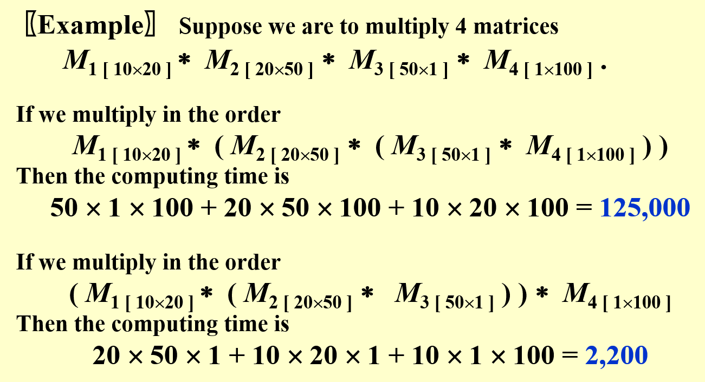

# Lec 8: Dynamic Programming

!!! info "注"

    （噩）梦开始的地方...

    相信很多同学会认为动态规划可能是ADS中最难的部分之一，然而课程安排上却只花了2-3个课时讲解这一部分，PPT也仅仅讲这么几个例子。如果光照着课程安排学习肯定是学不好的，甚至连考试都应付不过去，所以需要我们在课后投入更多的时间精力来学习DP（看教材、网上搜点资料，刷题等等）。

    我会先按照cy的PPT分析那几个例子，之后会根据Hello算法、wyy的讲义以及其他资料进行更全面的补充。

    [动态规划背后的故事](https://zhuanlan.zhihu.com/p/607595830)

!!! abstract "参考资料"

    - wyy的讲义
    - [Hello 算法](https://www.hello-algo.com/chapter_dynamic_programming)
    - [OI Wiki](https://oi-wiki.org/dp/)
    - [Wikipedia](https://en.wikipedia.org/wiki/Dynamic_programming)
    - 可以看看教材，但我实在没时间看了...

## Theory Background

动态规划的概念：

>动态规划（dynamic programming）是一个重要的算法范式，它将一个问题分解为一系列更小的子问题，并通过存储子问题的解来避免重复计算，从而大幅提升时间效率。（摘自[Hello算法](https://www.hello-algo.com/chapter_dynamic_programming/intro_to_dynamic_programming/)）

动态规划的问题特性：

- 重叠子问题：动态规划的子问题是相互依赖的（而分治算法处理的是独立的子问题）
- 最优子结构：原问题的最优解是从子问题的最优解构建得来的
- 无后效性：给定一个确定的状态，它的未来发展只与当前状态有关，而与过去经历的所有状态无关（否则难以用动态规划解决）

满足上述特性的问题用动态规划解决较为合适。

**动态规划**(dynamic programming, DP)的基本思想：

- 每个子问题仅解决一次，将得到的解存入一张表中
- 如果某个子问题需要其他子问题的解，可先查表，看是否已经求过解，若是则直接用，否则再计算
- “以空间换时间”——**记忆化搜索**

>注：下面的理论部分建议在阅读完[Examples](#Examples)一节的前4个例子后再来阅读，这样理解会更深刻些。

:star:动态规划的解题步骤：

1. 用符号化或数学化的语言描述问题的**一个**最优解，即定义状态
    - 可能是最难的部分
    - 这里之所以强调“一个”，是因为一个问题可能有多个最优解
2. 递归地定义最优解的值
    - 得到一个递推关系式（称为**状态转移方程**）、base case和其他边界条件
3. 确定好计算的顺序
    - 自底向下/自顶向下
    - 迭代计算，得到一张状态表
4. （可选）重构解决问题的策略
    - 有些题目可能要求画出最优解情况的方案，比如画出一棵树或一条路径等


## Examples

### Climbing Stairs Problem

!!! question "问题描述"

    楼底和楼顶之间有n段台阶，每步可以上1个或2个台阶，请问有多少种爬到楼顶的方法。

- 假如我们现在站在第i个台阶上，因为每步可以上1个或2个台阶，所以在上一步我们应该站在第i-1或第i-2个台阶上
- 令爬到第i个台阶的方案树为$F_i$，那么很自然地，我们得到了一个递推关系式：$F_i = F_{i - 1} + F_{i - 2}$
- 不难发现，这是一个斐波那契数列，因此我们可以采用FDS介绍的[暴力搜索算法](../fds/2.md#general-rules)来解决这一问题

然而，也是在FDS中，我们已经分析过，这种算法（实际上是递归算法）的时间复杂度是指数级的，有点吓人。之所以速度如此之慢，原因在于几乎所有的子问题都被重复计算了很多次，产生了大量的冗余计算。现在我们学习的是ADS，是时候拿出更高级的算法——动态规划来优化一下了：

- 根据递推关系，要得到$F_N$，只需知道$F_{N-1}$和$F_{N-2}$的值
- 那么我们可以在计算过程中仅保留这两个值，即上一次和上上次计算的结果，将它们相加即可得到本次计算的结果，无需存储所有$F_i$的值（空间复杂度$O(N) \rightarrow O(1)$）
- 然后更新上一次和上上次的值，进入下一轮的计算（$F(N+1)$）
- 所以这种方法是**自底向上**计算的，而递归算法是自顶向下计算的

??? code "代码实现"

    ```cpp
    int Fibonacci(int N) {
        int i, Last, NextToLast, Answer;
        if (N <= 1)
            return 1;
        Last = NextToLast = 1;    // F(0) = F(1) = 1

        for (i = 2; i <= N; i++) {
            Answer = Last + NextToLast;    // F(i) = F(i - 1) + F(i - 2)
            NextToLast = Last;    // update F(i - 1) and F(i - 2)
            Last = Answer;
        }    // end-for

        return Answer;
    }
    ```

时间复杂度：$T(N) = O(N)$


### Ordering Matrix Multiplications

!!! question "问题描述"

    对于多个矩阵的乘法，乘法的顺序相当关键，如果顺序选择不当，会让计算次数变得相当多。

    ??? example "例子"

        <div style="text-align: center">
            
        </div>

    对于一个给定的多矩阵乘法，请找出最优的乘法顺序。

??? bug "Bad idea：穷举法"

    令$b_n$的值为计算矩阵乘法$\mathbf{M}_1 \cdot \mathbf{M}_2 \cdot \dots \cdot \mathbf{M}_n$的顺序数。易知前几项为$b_2 = 1, b_3 = 2, b_4 = 5, \dots$。

    再令$\mathbf{M}_{ij} = \mathbf{M}_i \cdot \dots \cdot \mathbf{M}_j$，那么$\mathbf{M}_{1n} = \mathbf{M}_1 \cdot \dots \cdot \mathbf{M}_n = \mathbf{M}_{1i} \cdot \mathbf{M}_{i+1\ n}$。

    如果令$b_n = \mathbf{M}_{1n}$的乘法顺序数，$b_i = \mathbf{M}_{1i}$的乘法顺序数，$b_{n - i} = \mathbf{M}_{i + 1\ n}$的乘法顺序数，不难想到$b_n = \sum\limits_{i = 1}^{n - 1}b_i b_{n - i}$，其中$n > 1$且$b_1 = 1$。

    经计算，$b_n = O(\dfrac{4^n}{n\sqrt{n}})$，且$b_n$是一个[卡特兰数](https://en.wikipedia.org/wiki/Catalan_number)(Catalan number)，时间复杂度如此之大，因而想要实现穷举就不太现实了。

假设我们计算$n$个矩阵的乘法$\mathbf{M}_1 \cdot \dots \cdot \mathbf{M}_n$，其中$\mathbf{M}_i$是一个规模为$r_{i-1} \times r_i$的矩阵。令计算矩阵乘法$\mathbf{M}_i \cdot \dots \cdot \mathbf{M}_j$的最优成本为$m_{ij}$，那么我们可以得到以下递推关系式：

$$
m_{ij} = \begin{cases}0 & \text{if}\ i = j \\ \min\limits_{i \le l < j}\{m_{il} + m_{l+1\ j} + r_{i-1}r_lr_j\} & \text{if}\ j > i\end{cases}
$$

- 我们需要计算的$m_{ij}$有$O(N^2)$个（$i, j$的范围在$[1, n]$之间）
- 根据递推关系式，某个子问题的解一定来自比该子问题规模更小的子问题的解中。因此为了节省计算次数，我们还是**自底向上**计算：先算最小规模（即$i = j$时）的$m_{ij}$，再计算更大规模的$m_{ij}$，这样规模较大的子问题可以利用规模较小的子问题的解直接计算，而无需重复计算更小规模的子问题
- 在计算过程中，我们保存了一张形如下三角矩阵的表：

<div style="text-align: center">
    
</div>

??? code "代码实现"

    ```cpp
    // r contains numbers of columns for each of the N matrices
    // r[0] is the number of rows in matrix 1
    // Minimum number of multiplications is left in M[1][N]
    void OptMatrix(const long r[], int N, TwoDimArray) {
        int i, j, l, L;
        long ThisM;

        for (i = 1; i <= N; i++)
            M[i][i] = 0;
        for (k = 1; k < N; k++)    // k = j - i
            for (i = 1; i <= N - k; i++) {    // For each position
                j = i + k;
                M[i][j] = Infinity;
                for (L = i; L < j; L++) {
                    ThisM = M[i][L] + M[L + 1][j] + r[i - 1] * r[L] * r[j];
                    if (ThisM < M[i][j])    // Update min
                        M[i][j] = ThisM;
                }    // end for-L
            }    // end for-Left
    }
    ```

    可以看到这个函数只是计算了n个矩阵的乘法的最小计算次数，并没有保存乘法的顺序。感兴趣的读者可以尝试着在该代码的基础上增添这个功能，从而最终实现一个完整的矩阵乘法的程序。

    ??? code "改进版"

        ```cpp
        // Compute optimal ordering of matrix multiplication
        // c contains number of columns for each of the n matrices
        // c[0] is the number of rows in matrix 1 
        // Minimum number of multiplications is left in M[1][n] 
        // Actual ordering can be computed via 
        // another procedure using last_change 
        // M and last_change are indexed starting at 1, instead of zero 

        void opt_matrix( int c[], unsigned int n, two_d_array M, two_d_array last_change) {
            int i, k, Left, Right, this_M;

            for (Left = 1; Left <= n; Left++)
                M[Left][Left] = 0;
            for (k = 1; k < n; k++)    // k is Right-Left 
                for (Left = 1; Left <= n-k; Left++) {    // for each position 
                    Right = Left + k;
                    M[Left][Right] = INT_MAX;
                    for (i = Left; i < Right; i++) {
                        this_M = M[Left][i] + M[i+1][Right]
                        + c[Left-1] * c[i] * c[Right];
                        if(this_M < M[Left][Right]) {    // Update min
                            M[Left][Right] = this_M;
                            last_change[Left][Right] = i;
                        }
                    }
                }
        }
        ```

时间复杂度：$T(N) = O(N^3)$


### Optimal Binary Search Trees

**最优二叉查找树**(optimal binary search trees, OBST)：静态查找(static search)（即没有插入和删除操作）的最优方法。

!!! question "问题描述"

    给定$N$个单词，满足词典序$w_1 < w_2 < \dots < w_N$，且每个词$w_i$出现的概率（以下称为“词频”）为$p_i$。现在要求将这些词排列在一个二叉查找树上，使得所有单词的预期查找时间（$T(N) = \sum\limits_{i=1}^N p_i \cdot (1 + d_i)$，其中$d_i$为$w_i$在树中的深度）尽可能小，即构造一棵OBST。

??? example "例子"

    === "问题"

        下面给出一个程序用到的关键词以及对应的词频：

        <div style="text-align: center">
            
        </div>

        请分别用[贪心算法](9.md)（下一节会讲到，在这里指的是优先插入词频最大的单词）、红黑树来构建二叉查找树。

    === "答案"

        这里分别给出用贪心算法、红黑树和OBST的方法构建出来的二叉查找树，以及对应的$T(N)$：

        <div style="text-align: center">
            
        </div>   

        - 贪心算法之所以慢，是因为它优先考虑词频最大的单词，这可能导致某些高词频的单词被放在深度很大的地方，从而增大了总的查找时间。
        - 红黑树之所以慢，是因为它在构建树的过程中仅考虑了黑高，压根没有考虑词频的问题，所以可以看到虽然整棵树挺平衡的，但词频最大的那几个词全在深度最深的地方，使得总查找时间变的很大。

构造OBST的解法与计算矩阵乘法的最优顺序类似。先令：

- $T_{ij}$：由单词$w_i \dots w_j(i < j)$构成的OBST
- $c_{ij}$：$T_{ij}$的成本（$c_{ii} = p_i$，PPT上的是错的）
- $r_{ij}$：$T_{ij}$的根节点
- $w_{ij}$：$T_{ij}$的权重，等于$\sum\limits_{k = i}^j p_k$（$w_{ii} = p_i$）

如果令$w_k = r_{ij}$，那么$T_{ij}$的结构如下所示：

<div style="text-align: center">
    
</div>  

对于这棵树，它的成本为：

$$
\begin{align}
c_{ij} & = p_k + \text{cost}(L) + \text{cost}(R) + \text{weight}(L) + \text{weight}(R) \notag \\
& = p_k + c_{i, k - 1} + c_{k + 1, j} + w_{i, k - 1} + w_{k + 1, j} \notag \\
& = w_{ij} + c_{i, k - 1} + c_{k + 1, j} \notag
\end{align}
$$

若$T_{ij}$是最优的，那么需要满足$c_{ij} = w_{ij} + \min\limits_{i < l \le j}\{c_{i, l - 1} + c_{l + 1, j}\}$

??? example "例子"

    基于上面的那个例子，下面演示如何构建一棵OBST（这里还是依据**自底向上**的思想来计算的）：

    <div style="text-align: center">
        
    </div>

    ???+ play "动画演示"

        这里只是简单地罗列结果，建议读者先自己动手画一下，然后再来与下面的结果比对。

        === "绘制表格"

            === "1个单词"

                <div style="text-align: center">
                    
                </div>

            === "2个单词"

                <div style="text-align: center">
                    
                </div>

            === "3个单词"

                <div style="text-align: center">
                    
                </div>

            === "4个单词"

                <div style="text-align: center">
                    
                </div>

            === "5个单词"

                <div style="text-align: center">
                    
                </div>

            === "6个单词"

                <div style="text-align: center">
                    
                </div>

            === "7个单词"

                <div style="text-align: center">
                    
                </div>

        === "构建OBST"

            - 得到完整的表后，先将位于表格最后一行的单词插入树内，作为根节点
            - 根据词典序将剩余的单词划分为左右两半，按照中序遍历的顺序逐一插入

            === "Step 1"

                <div style="text-align: center">
                    
                </div>

            === "Step 2"

                <div style="text-align: center">
                    
                </div>

            === "Step 3"

                <div style="text-align: center">
                    
                </div>

            === "Step 4"

                <div style="text-align: center">
                    
                </div>

            === "Step 5"

                <div style="text-align: center">
                    
                </div>

            === "Step 6"

                <div style="text-align: center">
                    
                </div>

            === "Step 7"

                <div style="text-align: center">
                    
                </div>

    可以看到OBST可以确保词频较大的单词的深度尽可能小，从而有效降低了总的查找时间。
    
时间复杂度：$T(N) = O(N^3)$

>注：教材*Data Structures and Algorithm Analysis in C*第十章课后习题还给出了一个$O(N^2)$的解法，感兴趣的同学可以自行研究一下。


### Floyd Shortest Path Algorithm

在FDS的课上，我们已经介绍过单源最短路算法——[Dijkstra算法](../fds/9.md#single-source-shortest-path-problem)，它的时间复杂度为$O(|V|^2)$（$|V|$为图的顶点数），因此通过该算法计算任意两点间的最短路需要$O(|V|^3)$的复杂度（每个点都需要用一次该算法）。这种算法在稀疏图上运行较快，对于稠密图而言，更快的算法是下面要讲的**Floyd算法**：

先给出定义：

- $D^k[i][j] = \min\{\text{length of path}\ i \rightarrow \{l \le k\} \rightarrow j\}$，其中$k$为当前判断的第$k$个节点（$k \in [0, N - 1]$，共$N$个待判断的点）
- $D^{-1}[i][j] = \text{Cost}[i][j]$（$k = -1$表示$i, j$之间没有任何节点，即初始状态）

则从顶点$i$到顶点$j$之间的最短路径长度为$D^{N-1}[i][j]$。

Floyd算法的大致思路：从$D^{-1}$开始，连续得到$D^0, D^1, \dots, D^{N-1}$。如果已经解决了$D^{k-1}$，则此时有两种可能的情况：

- 第$k$个节点并不在最短路内，即$D^k = D^{k - 1}$
- 第$k$个节点在最短路内，那么满足$D^k[i][j] = D^{k-1}[i][k] + D^{k-1}[k][j]$

因此有递推关系：$D^k[i][j] = \min\{D^{k-1}[i][j], D^{k-1}[i][k] + D^{k-1}[k][j]\}, k \ge 0$

??? code "代码实现"

    ```cpp
    // A[] contains the adjacency matric with A[i][i] = 0
    // D[] contains the values of the shortest path
    // N is the number of vertices
    // A negative cycle exists iff D[i][i] < 0

    void AllPairs(TwoDimArray A, TwoDimArray D, int N) {
        int i, j, k;
        for (i = 0; i < N; i++)    // initialize D
            for (j = 0; j < N; j++)
                D[i][j] = A[i][j];
        
        for (k = 0; k < N; k++)      // add the kth vertex into the path
            for (i = 0; i < N; i++)
                for (j = 0; j < N; j++)
                    if (D[i][k] + D[k][j] < D[i][j])    // update shortest path
                        D[i][j] = D[i][k] + D[k][j];
    }
    ```

    - 该算法适用于负权边，但不适用于负权环
    - 可以看到，上述函数仅计算了任意两点间的最短路径长度，并没有记住最短路径是什么样子的，读者可以尝试着添加这个功能。

    ??? code "记录路径的版本"

        ```cpp
        // Compute All-Shortest Paths 
        // A[] contains the adjacency matrix 
        // with A[i][i] presumed to be zero 
        // D[] contains the values of shortest path 
        // |V| is the number of vertices 
        // A negative cycle exists iff 
        // d[i][j] is set to a negative value
        // Actual Path can be computed via another procedure using path 
        // All arrays are indexed starting at 0 
        void all_pairs( two_d_array A, two_d_array D, two_d_array path ) {
            int i, j, k;
            for( i = 0; i < |V|; i++ ) // Initialize D and path 
                for( j = 0; j < |V|; j++ ) {
                    D[i][j] = A[i][j];
                    path[i][j] = NOT_A_VERTEX;
                }
            for( k = 0; k < |V|; k++ )
                // Consider each vertex as an intermediate 
                for( i = 0; i < |V|; i++ )
                    for( j = 0; j < |V|; j++ )
                        if( d[i][k] + d[k][j] < d[i][j] ) {    // update min 
                            d[i][j] = d[i][k] + d[k][j];
                            path[i][j] = k;
                        }
        }
        ```

时间复杂度：$T(N) = O(N^3)$，但是在稠密图中表现较好。

>注：离散数学提到过与Floyd算法等价的算法——[Warshall算法](../../math/dm/9.md#warshalls-algorithm)，用于计算传递闭包。


### Product Assembly

!!! question "问题描述"

    产品组装(product assembly)问题，有以下条件

    - 一辆车的生产需要用到两条组装线
    - 每个阶段会用到不同的工艺（时间，即不同的节点值）
    - 在各阶段中，可以随时切换组装线

    现在要求你求出最短的组装总时间。

    <div style="text-align: center">
        
    </div>

??? bug "穷举算法"

    把每个点当作一个二进制位，不同的二进制数对应不同的情况。

    - 时间复杂度：$O(2^N)$（每个点都有选或不选这两种选择）
    - 空间复杂度：$O(N)$

    显然这种算法是不现实的。

下面我们严格按照[Background](#Background)提到的解题步骤来解决这一问题：

1. 定义状态

    <div style="text-align: center">
        
    </div>

    - 这张图给出了在*stage*阶段时的最优解（绿点 + 蓝线）
    - 红色虚线表示虽然有一条同样能在*stage*阶段到达同一个点的路径，但这条路径所花的时间更差，因此被pass掉了

2. 递归地定义最优解的值

    <div style="text-align: center">
        
    </div>

    - 可以看到，在*stage*阶段时，我们有两种到达对应点的路径：要么来自第一条组装线，要么来自第二条组装线
    - 因此，我们不难得出以下递推关系式：

    $$
    \begin{align}
    f[line][stage] & = \min\{f[line][stage - 1] + t_{process}[line][stage - 1] \notag \\ 
    & , f[1 - line][stage - 1] + t_{transit}[1 - line][stage - 1]\} \notag 
    \end{align}
    $$

    其中$f[line][stage]$表示在*stage*阶段时，在第*line*条组装线上的最优时间，$t_{process}[line][stage]$表示在同一条组装线上进入*stage*阶段所需的时间，$t_{process}[line][stage]$表示从不同组装线上进入*stage*阶段所需的时间。

3. 确定好计算的顺序。这里直接看代码：

    ??? code "代码实现"

        ```cpp
        // Initialization
        f[0][0] = 0; 
        f[1][0] = 0;
        // Outer loop: start from the first stage, end with the last stage
        for (stage = 1; stage <= n; stage++) {
            // Inner loop: test each line and find the minimum path
            for (line = 0; line <= 1; line++) {
                f[line][stage] = min(f[line][stage - 1] + t_process[line][stage - 1], f[1 - line][stage - 1] + t_transit[1 - line][stage - 1]);
            }
        }
        // The solution comes from the last stage of two lines
        Solution = min(f[0][n], f[1][n]);
        ```

4. 重构解决问题的策略。这里要求输出最短时间的组装顺序，代码如下所示：

    ??? code "代码实现"

        ```cpp
        f[0][0] = 0; 
        f[1][0] = 0;

        // L[line][stage]: record the source of the stage, either 0 or 1(the number of assembly lines) 
        L[0][0] = 0;
        L[1][0] = 0;

        for (stage = 1; stage <= n; stage++) {
            for (line = 0; line <= 1; line++) {
                f_stay = f[line][stage - 1] + t_process[line][stage - 1];
                f_move = f[1 - line][stage - 1] + t_transit[1 - line][stage - 1];
                if (f_stay < f_move) {
                    f[line][stage] = f_stay;
                    L[line][stage] = line;
                } else {
                    f[line][stage] = f_move;
                    L[line][stage] = 1 - line;       
                }
            }
        }

        // save the optimal path in plan[]
        line = f[0][n] < f[1][n] ? 0 : 1;
        for (stage = n; stage > 0; stage--) {
            plan[stage] = line;
            line = L[line][stage];
        }
        ```

### Knapsack Problem

>背包问题这块内容主要参照[Hello 算法](https://www.hello-algo.com/chapter_dynamic_programming/knapsack_problem/)和[OI Wiki](https://oi-wiki.org/dp/knapsack/)来写的。

**背包问题**(knapsack problem)可能是最常见的动态规划入门题，大致的问题描述为：

!!! question "问题描述"

    有$n$个物品和一个容量为$W$的背包，每个物品有重量$w_{i}$和价值$v_{i}$两种属性，要求选若干物品放入背包使背包中物品的总价值最大且背包中物品的总重量不超过背包的容量（摘自[OI wiki](https://oi-wiki.org/dp/knapsack/#%E5%BC%95%E5%85%A5)）。

背包问题的有多种类型，包括：

- **0-1背包问题**(0-1 knapsack problem)
- **完全背包问题**(unbounded knapsack problem)
- **多重背包问题**(bounded knapsack problem)

#### 0-1 Knapsack Problem

0-1背包问题在原问题上多了一个限制：**每个物品只能选一次**。

解题步骤：

1. 定义状态
    - 观察发现，放入物品会改变背包内物品的总价值和背包容量，因此需要记录的量为**前$i$个物品在容量为$c$的背包中的最大价值**，用符号化的语言表示为$dp[i, c]$，那么要求的就是$dp[n, cap]$
    - 用一张$n \times cap$的表来记录状态

2. 推导状态转移方程
    - 当我们对物品$i$做出决策时，需要考虑两种情况
        - 不放入物品：$c$不变，即$dp[i, c] = dp[i - 1, c]$
        - 放入物品：$dp[i, c] = dp[i - 1, c - w_i] + v_i$
    - 因此完整的状态转移方程为：

    $$
    dp[i, c] = \max\{dp[i - 1, c], dp[i - 1, c - w_i] + v_i\}
    $$
        
3. 确定计算顺序
    - 首先确定一下边界条件：当无物品或背包容量为0时最大价值为0，即状态表首列$dp[i, 0]$和首行$dp[0, c]$均等于0
    - 根据状态方程知，当前状态是根据它上方和左上方的状态推出来的，因此只需正向循环遍历这张状态表即可

下面展示对应的代码实现：

??? code "代码实现"

    ```cpp
    int knapsack_01(int weight[], int val[], int n, int cap) {
        int i, j;
    }
    ```

#### Unbounded Knapsack Problem

完全背包问题则解放了0-1背包的限制：**每个物品可以重复选取（无数次）**。


#### Bounded Knapsack Problem

多重背包问题有了更复杂的限制：**物品$i$最多只能选取$k_i$次**。


