# Lec 9: Greedy Algorithms

## Introduction

实际上，**贪心算法**(greedy algorithms)也已经在FDS中介绍过，比如求单源最短路的Dijkstra算法、求最小生成树的Kruskal算法等。本篇笔记将会更系统地讲解贪心算法的知识，以及补充更多相关的经典例子。先来了解一下基本概念：

- **优化问题**(optimization problem)：给定一组**限制条件**(constraints)和**优化函数**(optimization function)，称满足限制条件的解为**可行解**(feasible solutions)。如果一个可行解在优化函数中取得最佳值，则称该解为**最优解**(optimal solution)。

- **贪心法**(greedy method)：
    - 根据预先设定的贪心标准，在每个阶段中作出最佳决策
    - 当前作出的决策不允许在后面改变，所以确保作出的每个决策都是可行的，否则就是“一步错，步步错”
    - 只有当“**局部最优 = 全局最优**”时，贪心算法才是可行的
    - 贪心算法**不保证**得到最优解，但它能够产生与最优解相当接近的解（所以贪心算法属于一种**[启发式算法](https://en.wikipedia.org/wiki/Heuristic_(computer_science))**(heuristics)），因此当直接找最优解耗时太长时，贪心算法可能更加适合。

贪心算法的范式：

- 优化问题 -> 做出一个选择后，剩下一个有待继续解决的子问题
- 需要证明：对于原问题，贪心选择总能保证得到最优解
- 证明问题具备**最优子结构**(optimal substructure)——做出贪心选择后，剩余的子问题具备这样的性质：子问题的最优解 + 做出的贪心选择 = 原问题的最优解

!!! info "注"

    每个贪心算法的背后，总有一个更笨拙的DP解。

    <div style="text-align: right">-- cy</div>

贪心算法的正确性证明包括：

- 贪心选择性质：通过局部最优贪心选择来构造全局最优解，而在做当前选择的时候不必考虑子问题的解（而DP需要考虑子问题的解）。
- 最优子结构：原问题的最优解包含子问题的最优解。


## Examples

### Activity Selection

!!! question "问题描述"

    - 给定一组活动集$S = \{a_1, a_2, \dots, a_n\}$，这些活动均在一个房间开展，活动$a_i$的进行时间为$[s_i. f_i)$
    - 如果$a_i$和$a_j$满足$s_i \ge f_j$或$s_j \ge f_i$（即两个活动的时间不重叠），称这两个活动是**兼容的**(compatible)
    - 为了解题方便，预先将这些活动根据结束时间的先后排好序，即保证$f_1 \le f_2 \le \dots f_{n-1} \le f_n$

    问题：请你求出最大的、活动之间相互兼容的子集，即求在不发生冲突的前提下能安排的最多活动的方案

??? example "例子"

    下面以表格形式给出活动集$S$，并且将每个活动的时间区间关系表示出来：

    <div style="text-align: center">
        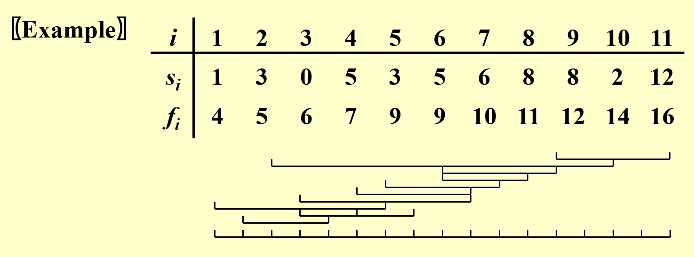
    </div>

    ??? hint "答案"

        最优解为最多安排4个活动，但有多个最优解，如下所示（用红色或绿色标出的区间）：

        <div style="text-align: center">
            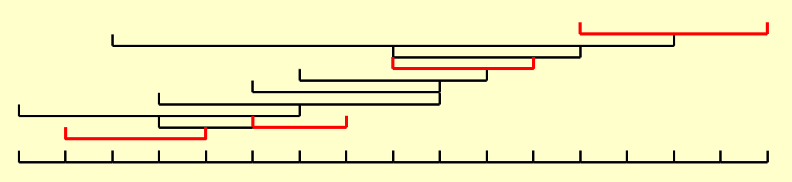
        </div>

        <div style="text-align: center">
            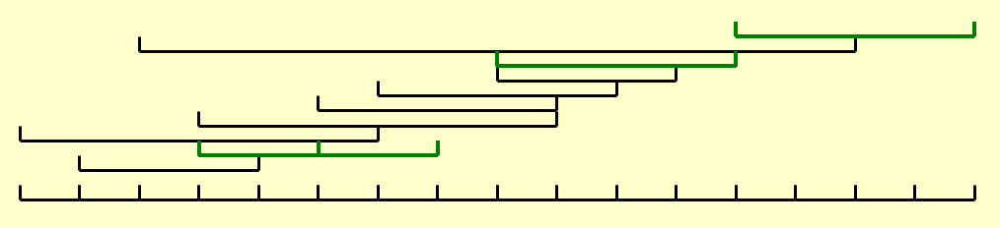
        </div>    

- 我们先尝试用上节课讲到过的DP来解
    - 规定：$a_1\ a_2 \dots \underbrace{a_i \dots a_k \dots a_j}_{S_{ij}} \dots a_n$，注意$a_i$和$a_j$不在$S_{ij}$内，即$S_{ij}$是一个开区间
    - 令$c_{ij}$为活动$a_i$和$a_j$之间最多的活动数，则得到状态转移方程

        $$
        c_{ij} = \begin{cases}0 & \text{if}\ S_{ij} = \emptyset \\ \max\limits_{a_k \in S_{ij}} \{c_{ik} + c_{kj} + 1\} & \text{if}\ S_{ij} \ne \emptyset\end{cases}
        $$

        其中在$S_{ij} \ne \emptyset$的情况用到了分治算法的思想：根据中间的某个活动$a_k$，将整个区间分为左右两半，分而治之，最后再算上$a_k$（$+1$）

    - 由于$i, j, k$都是$O(n)$的，因此时间复杂度为$O(N^3)$，所以整个算法感觉就像是在暴力搜索（我认为PPT的$O(N^2)$是错的，但是可以通过其他技巧优化到$O(N^2)$）。但为了提升速度，我们可以算得更“贪心”一些

- 我们先尝试几个贪心策略（假设红色区间表示最优解）：
    - 策略1：挑选最早开始的活动:-1:
        - 反例：

            <div style="text-align: center">
                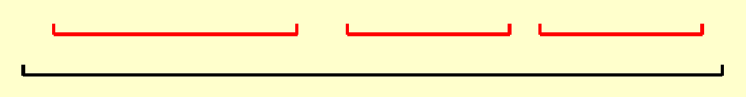
            </div>

            如果采用这种策略，那么就要先挑选那个最早开始，也是时间最长的区间，这样的话剩余的三个区间就没得选了，因此这种方法肯定是不行的。

    - 策略2：挑选时间最短的活动:-1:
        - 反例：

            <div style="text-align: center">
                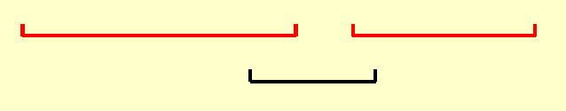
            </div> 

            如果采用这种策略，那就要先挑选那个最短的，且和剩余两个区间都冲突的区间，这样的话剩余的两个相互不冲突区间就没得选了，因此这种方法也是不行的。

    - 策略3：挑选冲突最少的活动:-1:
        - 反例：

            <div style="text-align: center">
                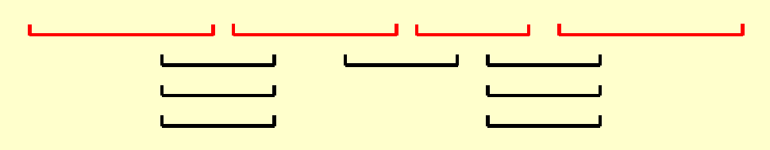
            </div> 

            可以看到冲突最少的区间是位于中间位置的黑色区间，如果选择它的话，与它冲突的两个区间就不能选了，这样的话最多只能选择3个区间，而不是最优解的4个区间，因此这种方法也行不通。

    - 策略4：挑选**最早结束**的活动:+1:
        - 可以自行检验，这种策略可以解决上面给出的所有反例
        - 接下来需要验证这种策略的正确性：
            - 贪心选择性质：考虑任意非空子问题$S_k$，令$a_m$为$S_k$中最早结束的活动，那么$a_m$一定被包含在$S_k$中的**某些**（注意不是所有哦~）满足活动相互兼容的最大子集中

                ??? proof "证明"

                    - 令$A_k$为最优解集，$a_{ef}$为$A_k$中最早结束的活动
                    - 如果$a_m = a_{ef}$，那么定理成立；否则的话需要用$a_m$替代$a_{ef}$，得到$A_k'$
                    - 因为$f_m \le f_{ef}$（由条件知），因此$A_k'$是另一个最优解，得证。

                    这种证明方法称为**交换参数法**：假设存在一个最优选择，其中的某些元素不在贪心选择中，此时可以通过交换贪心选择和最优选择的元素来构造一个不可能变差的解。

            - 最优子结构：在活动选择问题中，用贪心策略选择$a_k$之后得到子问题$S_k$，那么$a_k$ + 子问题$S_k$的最优解一定可以得到原问题的一个最优解
        
        - 实现步骤：
            - 选择首先结束的活动，递归解决剩余的活动子集
            - 由于这是一个尾递归，因此可以用迭代方法替代
            - 时间复杂度：$O(N \log N)$，下面给出解释：
                - 先将活动按照结束时间升序排序（$O(N \log N)$）
                - 然后遍历每个活动，按照贪心策略得到最优解（$O(N)$）
    - 对应地，也可以采取“选择最晚开始的活动”这一策略，具体原因这里就不分析了

- 得到正确的贪心算法后，我们回过头来修改DP的状态转移方程：

    $$
    c_{1, j} = \begin{cases}1 & \text{if}\ j = 1 \\ \max \{c_{1, j - 1}, c_{1, k(j)} + 1\} & \text{if}\ j > 1\end{cases}
    $$

    - 其中$c_{1, j}$是$a_1$到$a_j$之间的最优解，$a_{k(j)}$是$a_1$到$a_j$之间最晚结束的，且与$a_j$不冲突的活动，即$1 \le k(j) \le j,\ f_{k(j)} \le s_j$
    - 此时只需要两层循环就OK了，因此时间复杂度为$O(N^2)$，还是比贪心法差一些

---
活动选择问题的变体：

- 加权活动选择问题：现在考虑的不是尽可能多的活动，而是权重尽可能大的活动，此时一般的贪心算法会失效，但可以用动态规划来解决本问题，状态转移方程为：

    $$
    c_{1, j} = \begin{cases}w_j & \text{if}\ j = 1 \\ \max \{c_{1, j - 1}, c_{1, k(j)} + w_j\} & \text{if}\ j > 1\end{cases}
    $$

- **区间调度问题**：要求用尽可能少的教室举办所有的活动
    - 解决方案（~~比前面的活动选择问题还要简单~~）：
        - 首先设置初始教室数量为1，将所有活动按照开始时间排序，然后从前往后遍历
        - 每次选择一个活动时，看当前有无空闲教室，如果有就直接放进对应的教室，否则的话则新开一个教室
    - 正确性证明：我们可以用一个时间轴（如下图的红色虚线）来扫一遍所有的活动。根据算法，只需要扫每个活动的开头即可，因为：
        - 活动一旦开始就不会被中断，因此后面的选择不会影响当下的选择（所以无需遍历每个时间点，可见贪心提高了效率）
        - 在这个时间点上，如果存在多个活动举行，那么就需要将该活动放在别的房间举行；如果没有多余的房间，就需要新增一个房间了。因此该算法能够正确得到所需最少的房间数

        <div style="text-align: center">
            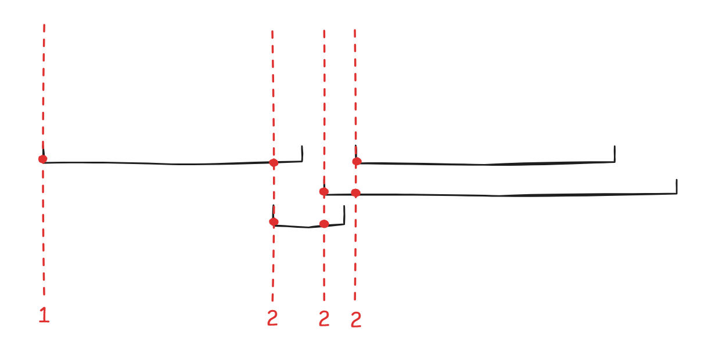
        </div> 
    
    - 如果继续采用活动选择问题中的算法（即先使用贪心法选出尽可能多的活动放入一个教室，然后在剩余活动中挑选尽可能多的活动放入第二个教室，以此类推直到所有活动都被放入教室里），则无法得到最优解，上面的图片便是反例，读者可自行检验。


### Schedule Problems

>注：这一部分摘自wyy的讲义（我发现历年卷中有一些类似这里的题目，所以赶紧补个课）。

!!! question "问题描述"

    **调度问题**(schedule problem)：给定$n$个任务，每个任务$i$有一个完成所需时间$l_i$和权重$w_i$。这些任务只能被依次执行，不能并行执行。

    记$\sigma$为一种调度（某种对任务的排序），任务$i$的完成时间为$C_i(\sigma) = l_i + i$之前的任务时长之和。题目要求最小化加权完成时间和，即求$T = \min\limits_{\sigma}\sum\limits_{i=1}^n w_i C_i(\sigma)$。

这类问题很适合用贪心策略解决：将权重更大、时间更短的任务放在前面处理，这样得到的解应为最优解。从定量的角度描述，我们应根据$\dfrac{w_i}{l_i}$的值（权重/时长之比）对任务降序排序。这一贪心策略的正确性表现在：

- 贪心选择性质：若任务$i$为当前问题下$\dfrac{w_i}{l_i}$最大的任务，则一定存在将$i$排在首位的最优调度方式
- 最优子结构：调度问题$S$中的贪心选择（任务$i$，$\dfrac{w_i}{l_i}$最大）与剩余子问题$S_1$的最优解$C_1$之和构成了$S$的最优解$C$

由于时间原因，这里就不给出具体证明了，感兴趣的同学可以参考wyy的讲义。

时间复杂度：$O(N \log N)$（最耗时的部分还是在排序上）

---
变体：

- 最小化最大延时
    - 问题描述：有$n$个任务，每个任务$j$的完成所需时间为$t_j$，截止时间为$d_j$，超出ddl的时间记作$L_i = \max(0, d_j - f_j)$（$f_j$表示任务$j$的完成时间）。我们只能依次完成这些任务，不能并行。请求出最大延时$L = \max\limits_{1 \le i \le n}L_i$的最小值
    - 下图展示了某种调度（这是一种幸运的情况，因为所有任务都在ddl前完成了）：

    <div style="text-align: center">
        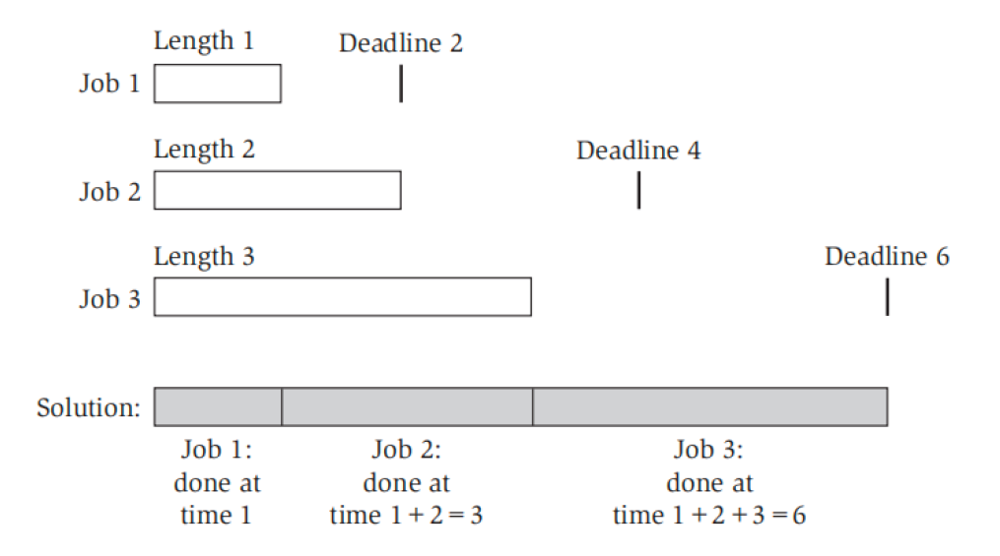
    </div> 

    - 贪心策略：
        - 失败的尝试：以$t_j$作为任务排序的依据。尝试过后，我们发现了一个矛盾：$t_j$短的最先完成（类似接水问题）的策略看似合理，但是这会导致冗余时间（$d_j - t_j$）更长，应该晚完成，于是得到了矛盾的结论。
        - 正确的方法：根据$d_j$大小按顺序排序
            - 具体的证明参见《*Algorithm Design*》$P_{125-131}$

- 最小化延时惩罚
    - 问题描述：在“最小化最大延时”问题的基础上，为每个任务增加一个超时惩罚$w_j$，我们的目标是最小化总的延时惩罚
    - 具体内容见《算法导论》（英文第3版）$P_{443-446}$

- 完成工时最小化
    - 问题描述：在调度问题的基础上，我们可以将任务分配到$m$台相同的机器上并行完成。现在的目标是找到一个完成总时间最短的调度方案
    - 具体内容见“近似算法”一讲


### Huffman Codes

??? info "历史背景"

    [哈夫曼编码](https://en.wikipedia.org/wiki/Huffman_coding)与[信息论](https://en.wikipedia.org/wiki/Information_theory)有很深的联系，对此感兴趣的读者可以在互联网上搜索相关资料。

!!! example "例子"

    假设给出一段长为1000个字符的字符串文本，仅包含字符a, u, x和z。因为一个字符占1字节空间，因此如果直接存储字符，就需要1000字节，即8000位的空间。

    - 如果预先进行编码：a = 00, u = 01, x = 10, z = 11，那么每个字符仅占2位空间，整个字符串的大小降为2000位（以及额外的一些空格）。不难得到：如果有$C$个字符，那么每个字符的编码长度为$\lfloor \log C \rfloor$位。

    - 更高效的编码方式——**根据字符出现的频率编码**。
        - 假如给定字符串<span style="color: blue">aaa</span><span style="color: green">x</span><span style="color: red">u</span><span style="color: blue">a</span><span style="color: green">x</span><span style="color: purple">z</span>，那么频率为$f(a) = 4, f(u) = 1, f(x) = 2, f(z) = 1$
        - 如果用前面那种定长字符编码，得到的结果为：<span style="color: blue">000000</span><span style="color: green">10</span><span style="color: red">01</span><span style="color: blue">00</span><span style="color: green">10</span><span style="color: purple">11</span>（长16位）
        - 而用基于频率的编码方法（令a = 0, u = 110, x = 10, z = 111），得到的结果为：<span style="color: blue">000</span><span style="color: green">10</span><span style="color: red">110</span><span style="color: blue">0</span><span style="color: green">10</span><span style="color: purple">111</span>（长14位）
        - 但如果遇到所有字符出现频率相等的情况，这种方法便起不到任何优化效果

    !!! warning "注意"
    
        想要无歧义地对每个字符进行译码，那么在为字符编码的时候需要保证：任意一个编码**不是**其他编码的**前缀**(prefix)。

我们通常用一棵二叉树来表示这些字符编码（这种树称为**字典树**(trie)）

- 对于字符$C_i$，它的深度和频率分别为$d_i$和$f_i$，那么总的编码成本为$\sum d_i f_i$
- 对于前一种原始的编码方式，得到的字典树如下所示：

    <div style="text-align: center">
        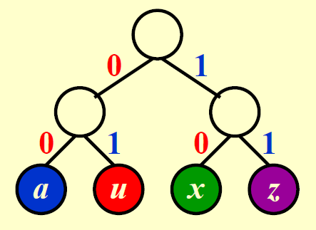
    </div>

    成本 = 2 * 4 + 2 * 1 + 2 * 2 + 2 * 1 = 16

- 而对于后一种优化的编码方式，得到的字典树如下所示：

    <div style="text-align: center">
        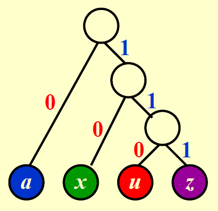
    </div>  

    成本 = 1 * 4 + 3 * 1 + 2 * 2 + 3 * 1 = 14 

不难发现，这些字典树均有这样一个特征：**所有的字符位于叶子节点上**，而不会位于内部节点，因为这样可以避免“某个字符的编码是另一个字符的编码的前缀”的问题。像这样的树称为**满树**(full tree)，树上的01编码称为**前缀码**(prefix code)。

事实上，第二种编码方式便是经典的**哈夫曼编码**(Huffman Codes)，其算法的伪代码如下所示：

??? code "代码实现"

    ```c
    void Huffman(PriorityQueue heap[], int C) {
        consider the C characters as C single node binary trees,
        and initialize them into a min heap;
        
        for (i = 1; i < C; i++) {
            create a new node;
            // be greedy here
            delete root from min heap and attach it to left_child of node;
            delete root from min heap and attach it to right_child of node;            
            weight of node = sum of weights of its children;
            // weight of a tree = sum of the frequencies of its leaves
            insert node into min heap;
        }
    }
    ```

    具体步骤为：

    - 初始化：将每个字符作为一个二叉树的节点，并将它们放在一个最小堆内
    - 循环执行以下步骤（共（节点数 - 1）次）
        - 从最小堆的根节点取出频率最小的节点，作为新树的左孩子
        - 再取出频率次小的节点，作为新树的右孩子
        - 这棵新树的根节点是两者频率之和，然后将新树重新插回最小堆内

时间复杂度：$T = O(C \log C)$

??? example "例子"

    === "题目"
        
        给定以下字符及其频率，请你得到对应的哈夫曼编码，并计算编码的总成本。

        <div style="text-align: center">
            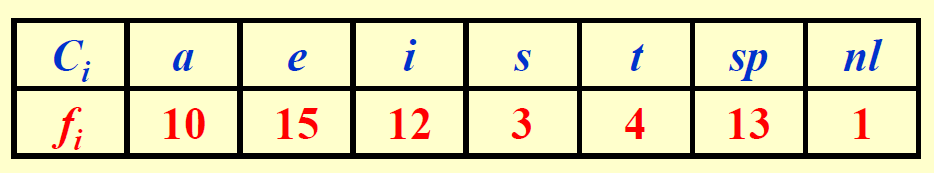
        </div> 

    === "答案"

        !!! play "动画演示"

            <div style="text-align: center">
                
            </div> 

我们还要证明这种贪心算法的正确性：

- 贪心选择：令$C$为一张字母表，其中字符$c \in C$的频率为$c.freq$。令$x, y$为$C$内频率最小的两个字符，那么在$C$中存在一个最优的前缀码，$x$和$y$的编码具有相同的长度，且只有最低位不同。

    <div style="text-align: center">
        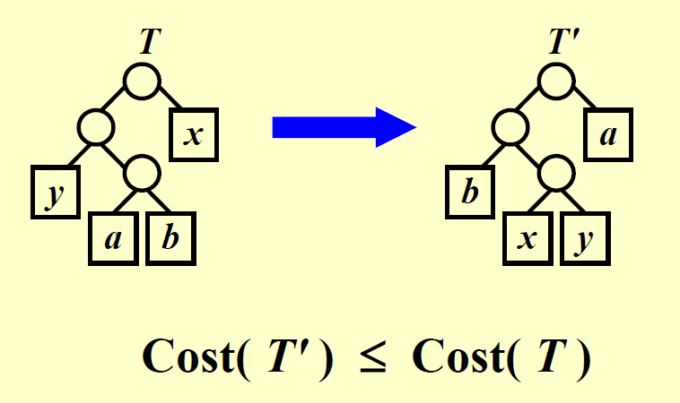
    </div>

- 最优子结构：（与前一条引理一样的前提条件）令$C'$为加入新字符$z$并移除$x$和$y$后的字母表，满足$z.freq = x.freq + y.freq$。令$T'$为表示字母表$C'$的最优前缀码的树，那么树$T$可以通过移除树$T'$的叶子节点$z$，用$x, y$以及一个内部节点构成的子树替代得到，它能够表示字母表$C$的最优前缀码（可用归谬法证明）。

    <div style="text-align: center">
        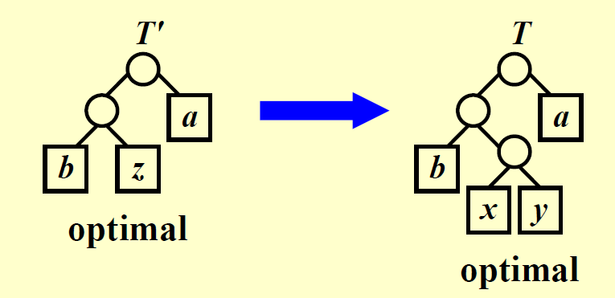
    </div>

???+ note "一些小结论"

    - 若字符个数为$C$，那么
        - 哈夫曼树的节点数为$2C - 1$
        - 编码位长不超过$C - 1$
    - 再次提醒：出现频率最低的两个字符的编码具有相同的最长长度，且它们的编码仅相差1位


### Other Examples

下面给出了其他的贪心算法相关的问题，建议大家了解一下：

- 田忌赛马
- 硬币找零问题：
    - 一般描述：给定不同面值且数量足够的硬币，以及给定价值n，要求用最小的硬币数表示n
    - 对于美国硬币面值系统{1, 5, 10, 25}而言，用贪心法可以得到最优解
    - 事实上，只要给出的硬币面值满足**大硬币面值是小硬币面值的倍数**，确保局部最优不会破坏全局最优，那么贪心法总是可以得到最优解

- [拟阵](https://en.wikipedia.org/wiki/Matroid#Algorithms)
- [聚类问题](https://en.wikipedia.org/wiki/Cluster_analysis)
- 匹配问题
    - [稳定匹配问题](https://en.wikipedia.org/wiki/Stable_marriage_problem)
- [分数背包问题](https://www.hello-algo.com/chapter_greedy/fractional_knapsack_problem/)
- [最大容量问题](https://www.hello-algo.com/chapter_greedy/max_capacity_problem/)
- [最大切分乘积问题](https://www.hello-algo.com/chapter_greedy/max_product_cutting_problem/)