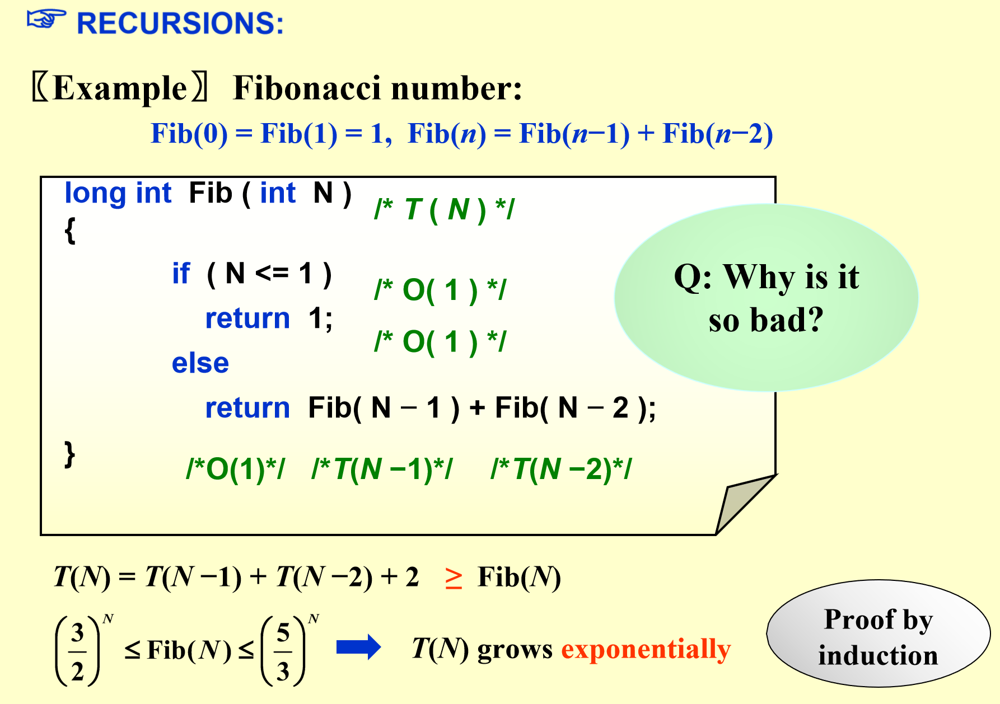
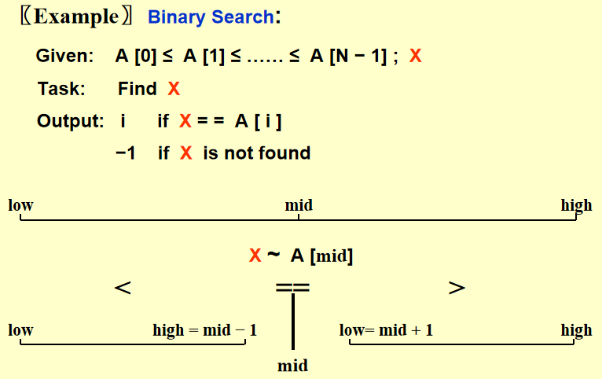

# Chap 2: Algorithm Analysis

??? abstract "核心知识"

    + 时间、空间复杂度

    ~~这章貌似没什么东西，可以重点看看递归吧~~

**算法(algorithm)**：完成特定任务的有限步指令。所有的算法都具备以下特征：

+ *输入(input)*：0个或多个输入
+ *输出(output)*：**至少有1个**输出
+ *确定性(definiteness)*：每条指令都是明确的
+ *有限性(finiteness)*：不管什么在什么情况下，算法需要在经过有限步后终止
+ *有效性(effectiveness)*：每条指令足够简单可行，原则上使用纸和笔便能表达出来。

???+ info "注"

    + **程序**由编程语言书写，但不必在有限步内完成，比如操作系统的时钟
    + **算法**能由以下方法描述：

        + 人类语言(human languages)
        + 流程图(flow charts)
        + 编程语言(programming languages)
        + 伪代码(pseudo-code)

## What to Analyze

我们需要分析算法的**时间和空间复杂度(time & space complexity)**

在分析复杂度前，我们作出以下假设：

+ 每条指令按顺序执行
+ 每条指令很简单，且执行一条指令仅花费一个时间单元
+ 规模是整数且是固定的，并且假设有无限的内存

通常，我们分析以下两种时间复杂度，它们的输入规模均为$N$：

+ $T_{avg}(N)$：平均时间复杂度
+ $T_{worst}(N)$​​：最差时间复杂度:star:

## Asympotic Notation

### Definition

此部分知识（大$O$、大$\Omega$、大$\Theta$表示法及其相关规则）在离散数学的 3.2 节中讲得更为详细，请移步[此处](../../math/dm/3.md#the-growth-of-functions)。但这里还介绍了小$o$表示法：

$T(N) = o(p(N))$：当$T(N) = O(p(N))$ 且 $T(N) \ne \Theta(p(N))$​

>参考资料：[Big-O Cheat Sheet](https://www.bigocheatsheet.com/)

### General Rules

+ **for循环(FOR LOOPS)**：for循环的运行时间不超过“循环体内部语句 $\times$ 迭代次数”
+ **嵌套for循环(NESTED FOR LOOPS)**：在一组嵌套循环内的一条语句的执行时间为 “该语句 $\times$ 所有的for循环规模的乘积”
+ **连续的语句(CONSECUTIVE STATEMENTS)**：简单地相加
+ **条件语句(IF/ELSE)**：对于下面代码块

	``` c
	if (condition) S1;
	else S2
	```

	它的运行时间不会超过“测试条件 + S1 和 S2 中运行时间的最长者”

+ **递归(RECURSION)**：我们从斐波那契数的例子下手分析：

<div style="text-align: center; margin-top: 15px;">

</div>

???+ note "关于斐波那契数"

    + **空间**复杂度：$O(N)$。理解递归的堆栈调用（串行程序）：比如要算$Fib(N)$，一定是先**算完**$Fib(N - 1)$再算$Fib(N - 2)$ ，不会同时计算两者，所以是线性复杂度
    + 准确的**时间**复杂度：$T = \Theta((\dfrac{1 + \sqrt 5}{2})^n)$，利用离散数学教的线性齐次递推关系求解

在计算递归的时间复杂度中，我们常常建立关于时间复杂度的**递推关系**。下面举几个常见的递推关系：

+ [线性齐次递推关系](../../math/dm/8.md#solving-linear-recurrence-relations)
+ 形如$T(N) = T(N / a) + b$，则$T(N)$大致为$O(\log N)$（严谨的形式可参见主定理）

>补充(不做要求)：[主定理](https://zh.wikipedia.org/wiki/%E4%B8%BB%E5%AE%9A%E7%90%86)

## Compare the Algorithms

!!! question "问题"

    如何求解**最大连续子列和**？
    
下面给出了4种算法，时间复杂度逐一减小

### Algorithm 1

时间复杂度：$O(N^3)$

```c
int MaxSubsequenceSum(const int A[ ], int N)
{
    int ThisSum, MaxSum, i, j, k;
    
    MaxSum = 0;
    for (i = 0; i < N; i++)
        for (j = i; j < N; j++)
        {
            ThisSum = 0;
            for (k = i; k <= j; k++)// 这里浪费了时间，不需要重新从i开始
                ThisSum += A[k];
            
            if (ThisSum > MaxSum)
                MaxSum = ThisSum;
        }
    return MaxSum;
}
```

### Algorithm 2

时间复杂度：$O(N^2)$

```c
int MaxSubsequenceSum(const int A[ ], int N)
{
    int ThisSum, MaxSum, i, j, k;
    
    MaxSum = 0;
    for (i = 0; i < N; i++)
    {
        ThisSum = 0;
        for (j = i; j < N; j++)
        {
            ThisSum += A[j];
            
            if (ThisSum > MaxSum)
                MaxSum = ThisSum;
        }
    }
    return MaxSum;
}
```

### Algorithm 3

时间复杂度：$O(NlogN)$

采用**分治(divide-and-conquer)算法**，只需递归比较**左半边子列**、**右半边子列**和**中间**的子列，选择其中最大的作为最大值。

示意图：

<div style="text-align: center; margin-top: 15px;">

</div>

```c
static int MaxSubSum(const int A[ ], int Left, int Right)
{
    int MaxLeftSum, MaxRightSum;
    int MaxLeftBorderSum, MaxRightBorderSum;
    int LeftBorderSum, RightBorderSum;
    int Center, i;
    
    // Base Case
    if (Left == Right)
        if (A[Left] > 0)
            return A[Left];
    	else
            return 0;
   	
    // 处理左右两半
    Center = (Left + Right) / 2;
    MaxLeftSum = MaxSubSum(A, Left, Center);
    MaxRightSum = MaxSubSum(A, Center + 1, Right);
    
    // 处理中间部分
    // 从中间开始左半部分
    MaxLeftBorderSum = 0;
    LeftBorderSum = 0;
    for (i = Center; i >= Left; i--)
    {
        LeftBorderSum += A[i];
        if (LeftBorderSum > MaxLeftBorderSum)
            MaxLeftBorderSum = LeftBorderSum; 
    }
    // 从中间开始右半部分
    MaxRightBorderSum = 0;
    RightBorderSum = 0;
    for (i = Center + 1; i <= Right; i++)
    {
        RightBorderSum += A[i];
        if (RightBorderSum > MaxRightBorderSum)
            MaxRightBorderSum = RightBorderSum; 
    }
    
    return Max3(MaxLeftSum, MaxRightSum, MaxLeftBorderSum + MaxRightBorderSum); // 自定义函数，比较3个数的大小
}
```
时间复杂度分析：

$$
\begin{align}
\text{Base case:  }\ T(1) = 1 \quad &  T(N) = 2T(N/2) + O(N) \notag \\
\therefore T(N) & = 2T(N/2) + cN \notag \\
& = 2[2T(N/2^2) + cN/2] + cN \notag \\
& = 2^kO(1) + ckN \quad \text{where } N/2^k = 1 \notag \\
& = O(NlogN) \notag
\end{align}
$$

### Algorithm 4

时间复杂度：$O(N)$

采用**在线(on-line)算法**：随着程序的运行，在<u>任意时间阶段</u>内计算当前情况下的解

```c
int MaxSubsequenceSum(const int A[ ], int N)
{
    int ThisSum, MaxSum, j;
    
    ThisSum = MaxSum = 0;
    for (j = 0; j < N; j++)
    {
        ThisSum += A[j];
        
        if (ThisSum >= MaxSum)
            MaxSum = ThisSum;
        else if (ThisSum < 0)
            ThisSum = 0;
    }
    return MaxSum;
}
```

## Logarithm in the Running Time

下面分析的三种算法，它们的时间复杂度均为$O(\log N)$

### Binary Search

使用前提：列表已排好序

分析：

<div style="text-align: center; margin-top: 15px;">

</div>

代码实现：

```c
int BinarySearch(const ElementType A[ ], ElementType X, int N)
{
    int Low, Mid, High;
    
    Low = 0;
    High = N - 1;
    while (Low <= High)
    {
        Mid = (Low + High) / 2;
        if (A[Mid] < X)
            Low = Mid + 1;
        else if (A[Mid] > X)
            High = Mid - 1;
        else
            return Mid;
    }
    return NotFound;  // NotFound被定义为-1
}
```

### Euclid’s Algorithm

又称**辗转相除法**，用于求解两个数的**最大公约数(greatest common divisor, gcd)**

>参考：离散数学[相应章节](../../math/dm/4.md#the-euclidean-algorithm)

???+ note "分析"

    要求解两个数$M, N(M \ge N)$的最大公约数，先算出两者相除得到的余数，然后用小的数$N$除以余数得到新的余数，以此类推，当较小数为0时结束。此时剩下的非0数（即较大数）即为最大公约数。

    要说明它的时间复杂度为 $O(logN)$，先证明下面这个定理：
    $$
    \text{If }M > N\text{ ,then }M\text{ mod }N < M / 2
    $$

    提示：分$N \le M/2$ 和 $N > M/2$两种情况讨论，易证，故略去证明过程

    有了这个定理后，自然而然就能得到其时间复杂度在 $O(logN)$ 左右。事实上，实际的复杂度还略微低一些。

代码：
```c
unsigned int Gcd(unsigned int M, unsigned int N)
{
    // 这里已经假设 M > N了
    unsigned int Rem;
    
    while (N > 0)
    {
        Rem = M % N;
        M = N;
        N = Rem;
    }
    return M;
}
```

### Exponentation

```c
long Pow(long X, unsigned int N)
{
    if (N == 0)
        return 1;
    // 6、7两行可以不写，因为前后的代码可以应对该情况
    if (N == 1)   // 6
        return X; // 7
    if (IsEven(N))  // int IsEven(int N){return N % 2 == 0}
        return Pow(X * X, N / 2);
    else
        return Pow(X * X, N / 2) * X;
}
```

最后注意递归程序的书写问题，错误的书写会影响效率，甚至导致死循环（见书上反例）

## Checking Your Analysis

如果程序过于复杂，无法直接看出时间复杂度（这种情况常常发生），那么下面的方法会帮到我们：

$$
\text{When }T(N) = O(f(N)) \text{ , check if }
\lim\limits _{N \rightarrow \infty} \frac{T(N)}{f(N)} \approx \text{ Constant}
$$

如果是常数的话，说明我们估计的时间复杂度$O(f(N))$基本正确