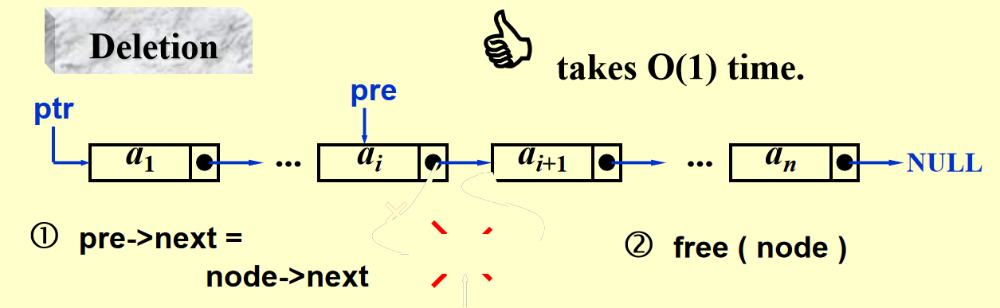
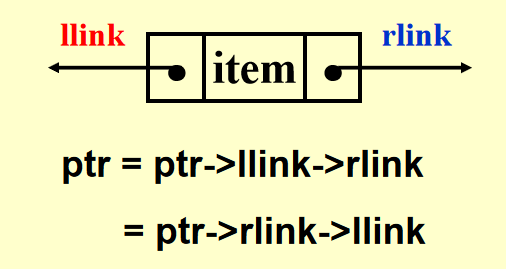
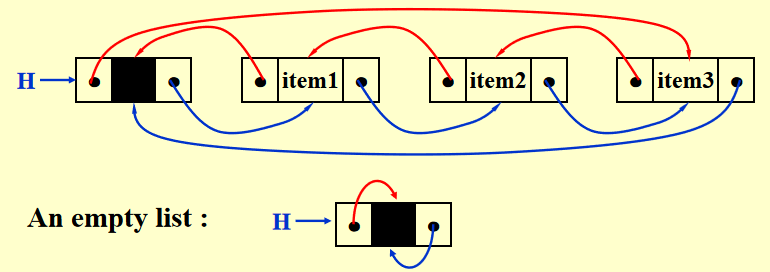
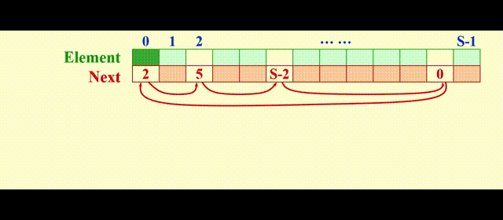
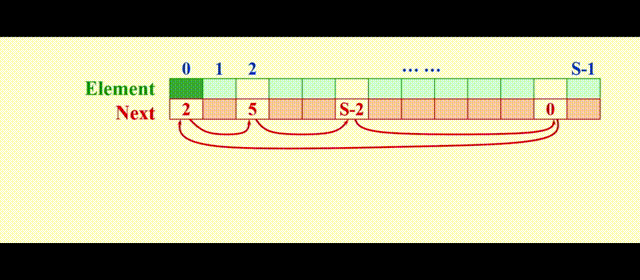
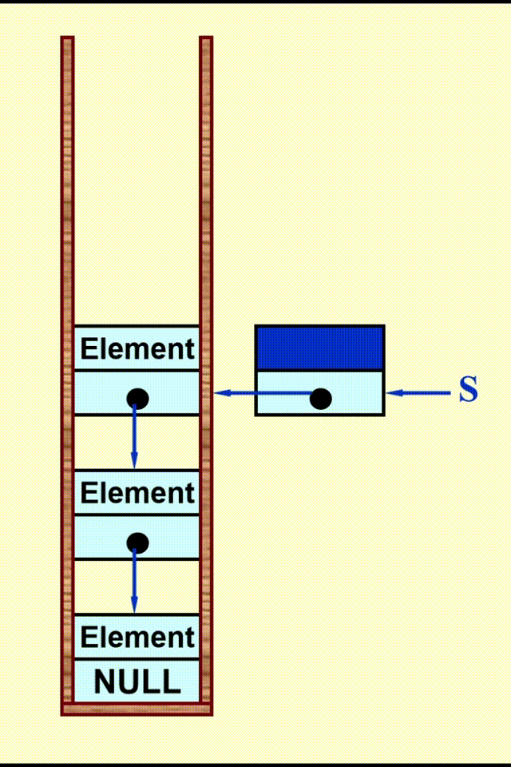
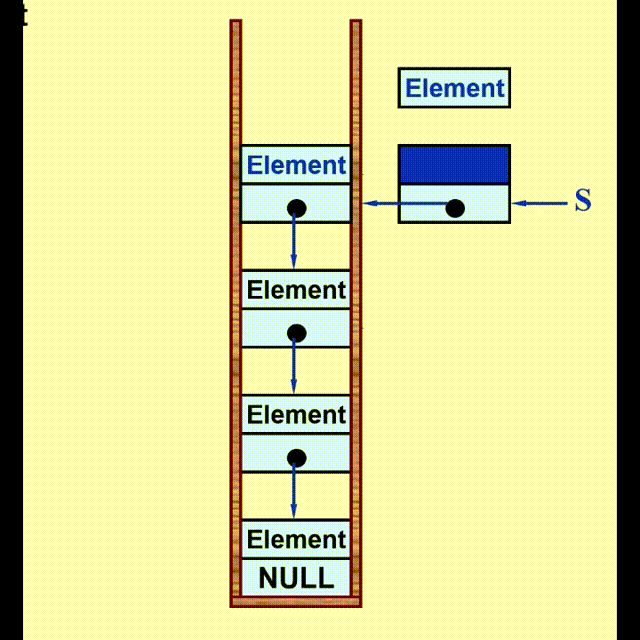

# Chap 3: Lists, Stacks, and Queues

??? abstract "核心知识"

	+ 列表
	+ 栈
		+ 操作：入栈、出栈...
		+ 应用：求解后缀，中缀转后缀...
	+ 队列
		+ 操作：入队、出队...

	这3种 ADT 均有数组表示法和链表表示法

## Abstract Data Type (ADT)

数据类型(data type) = {对象(objects)} $\cup$ {运算(operations)}

**抽象数据类型(ADT)**是将对象和运算的**规范**（就是我们定义的函数），以及它的**表示和实现**（个人理解为接口(interface)，便于用户调用）分离开来的一种方法。

## The List ADT

### Simple Array Implementation of Lists

+ **Objects**: {$item_0, item_1, \dots, item_{N - 1}$}
+ **Operations**: 

	+ `Finding_the_length`：求链表长度$N$
	+ `Printing`：打印列表所有元素
	+ `Making_an_empty`：建立空列表
	+ `Finding`：查找第$k$项，$0 \le k < N$ :star:
	+ `Inserting`：在第$k$项**后**插入新的项，$k$的范围同上 :star:
	+ `Deleting`：删除一项 :star:
	+ `Finding_next`：查找下一个项
	+ `Finding_previous`：查找上一个项，用于删除列表首项

时间复杂度：
	
+ 查找：$O(1)$
+ 插入&删除：$O(N)$

对于频繁进行插入和删除的列表，我们需要用到另一种实现形式——**链表**(linked list)

### Linked Lists

!!! note 

	+ 链表相比数组占用空间更多（额外的指针域），但它不要求空间连续
	+ 虽然查找时间慢（$O(N)$），但插入和删除很快（$O(1)$），通过下面图示可以较为直观地感受到
	+ 最后一项的指针指向`NULL`
	+ 对于**头指针**，我们不将第一项作为头指针，而是采用一个**虚拟节点(dummy node)**。这个节点数据域为空，指针指向列表中的第一项。这样做的好处有：

		+ **删除**首项时无需使用`Finding_previous()`了
		+ $\dots$

	>注：除非作特殊说明，FDS 中所有链表的实现默认将虚拟节点作为头指针

!!! example "图示"

	=== "插入"

		<div style="text-align: center; margin-top: 15px;">
		
		</div>

	=== "删除"

		<div style="text-align: center; margin-top: 15px;">
		
		</div>

??? code "代码实现"

	```c title=".h file"
	// 链表的类型声明，一般放在 .h 文件中
	#ifndef _List_H

	struct Node;
	typedef struct Node *PtrToNode;
	typedef PtrToNode List;
	typedef PtrToNode Position;

	List MakeEmpty(List L);
	int IsEmpty(List L);
	int IsLast(Position P, List L);
	Position Find(ElementType X, List L);
	void Delete(ElementType X, List L, Position P);
	Position FindPrevious(ElementType X, List L);
	void Insert(ElementType X, List L, Position P);
	void DeleteList(List L);
	Position Header(List L);
	Position First(List L);
	Position Advance(Position P);
	ElementType Retrieve(Position P);

	#endif
	```

	```c title=".c file"
	// 链表的具体实现，一般放在.c文件中

	// 节点
	struct Node
	{
		ElementType Element;
		Position Next;
	};

	// 检查链表是否为空
	int IsEmpty(List L)
	{
		return L->Next == NULL;
	}

	// 检查节点 P 是否为最后一项
	// 注意到链表 L 没有用上，放在这里是为了应付特殊情况的处理
	int IsLast(Position P, List L)  
	{
		return P->Next == NULL;
	}

	// 查找数据 X 在链表 L 中的位置
	Position Find(ElementType X, List L)
	{
		Position P;
		
		P = L->Next;
		while (P != NULL && P->Element != X)
			P = P->Next;
		
		return P;
	}

	// 删除链表 L 中的数据 X
	void Delete(ElementType X, List L)
	{
		Position P, TmpCell;
		
		P = FindPrevious(X, L);
		
		if (!IsLast(P, L))
		{
			TmpCell = P->Next;
			P->Next = TmpCell->Next;
			Free(TmpCell); // 删除节点时不要忘记释放内存！！！
		}
	}

	// 查找前一项
	Position FindPrevious(ElementType X, List L)
	{
		Position P;
		
		P = L;
		while (P->Next != NULL && P->Next->Element != X)
			P = P->Next;
		
		return P;
	}

	// 在位置 P 后插入新数据 X
	void Insert(ElementType X, List L, Position P)
	{
		Position TmpCell;
		
		TmpCell = (PtrToNode)malloc(sizeof(struct Node)); 
		if (TmpCell == NULL)
			FatalError("Out of Space!!!"); // 这里用到处理错误信息的自定义函数
		
		TmpCell->Element = X;
		TmpCell->Next = P->Next;
		P->Next = TmpCell;
	}
	```

### Common Errors

!!! warning "关于链表的常见错误"

	+ **内存访问错误(memory access violation)** 或**段错误(segmentation violation)**：可能因为<u>错误的初始化</u>，或者<u>引用不存在的指针</u>（该指针已被 `free()` 了）
	+ 判断何时使用 `malloc()`
		+ 如果想要创建一个之前未声明的指向结构的指针，需要用到 `malloc()`
		+ 如果想要用指针遍历一遍链表，则无需使用 `malloc()`
		> 注意：`malloc()` 是给指针分配存储空间，而不是用于结构的
	+ 记得使用 `free()`，尤其是**删除**节点时，否则会带来严重后果

### Double Linked Circular Lists

图示：

<div style="text-align: center; margin-top: 15px;">

</div>

声明：

``` c
typedef struct node *node_ptr;
typedef struct node
{
	node_ptr llink;
	element item;
	note_ptr rlink;
};

```

例子：

<div style="text-align: center; margin-top: 15px;">

</div>

作用：简化**删除**节点的过程

### Applications

#### The Polynomial ADT

+ **Objects**：$P(x) = a_1x^{e_1} + \dots + a_nx^{e_n}$，有一组有序对$<e_i, a_i>$，其中$a_i$被称为*系数(coefficient)*；$e_i$被称为*指数(exponent)*，为非负数
+ **Operations**：

	+ `Finding_degree`：判断多项式的最高次
	+ `Addition`
	+ `Subtraction`
	+ `Multiplication`
	+ `Differentiation`：求导

两种实现方法：

```c
// 1. 数组——编写加法、乘法等函数较为简单，但会有很大的空间浪费
typedef struct
{
    int CoeffArray[MaxDegree + 1];
    int HighPower;
} *Polynomial;

// 2. 链表——节省空间，但编写加法、乘法和函数较为困难
typedef struct Node *PtrToNode;

struct Node
{
    int Coefficient;
    int Exponent;
    PtrToNode Next;
};

typedef PtrToNode Polynomial;  // 节点根据指数大小排序好
```

下面用**数组**形式编写加法和乘法函数

``` c
// Addition
void add_polynomial( POLYNOMIAL poly1, POLYNOMIAL poly2, POLYNOMIAL poly_sum )
{
	int i;
	zero_polynomial( poly_sum );
	poly_sum->high_power = max( poly1->high_power, poly2->high_power);
	for( i = poly_sum->high_power; i >= 0; i-- )
		poly_sum->coeff_array[i] = 
			poly1->coeff_array[i] + poly2->coeff_array[i];
}

// Multiplication
void mult_polynomial( POLYNOMIAL poly1, POLYNOMIAL poly2, POLYNOMIAL poly_prod )
{
	unsigned int i, j;
	zero_polynomial( poly_prod );
	poly_prod->high_power = poly1->high_power + poly2->high_power;
	if( poly_prod->high_power > MAX_DEGREE )
		error("Exceeded array size");
	else
		for( i = 0; i <= poly->high_power; i++ )
			for( j = 0; j <= poly2->high_power; j++ )
				poly_prod->coeff_array[i+j] +=
					poly1->coeff_array[i] * poly2->coeff_array[j];
}
```

??? info "补充：**链表**实现加法函数（自己写的，有些啰嗦）"

	``` c
	Polynomial Add( Polynomial a, Polynomial b )
	{ 
		PtrToNode head = (PtrToNode)malloc(sizeof(struct Node));
		head->Next = NULL;
		Polynomial ans = head;
		Polynomial cur = head;

		while (a->Next != NULL && b->Next != NULL)
		{
			PtrToNode temp = (PtrToNode)malloc(sizeof(struct Node));
			temp->Next = NULL;
			if (a->Next->Exponent > b->Next->Exponent)
			{
				temp->Coefficient = a->Next->Coefficient;
				temp->Exponent = a->Next->Exponent;
				a = a->Next;
			}
			else if (a->Next->Exponent < b->Next->Exponent)
			{
				temp->Coefficient = b->Next->Coefficient;
				temp->Exponent = b->Next->Exponent;
				b = b->Next;
			}
			else
			{
				temp->Coefficient = a->Next->Coefficient + b->Next->Coefficient;
				if (temp->Coefficient == 0)
				{
					a = a->Next;
					b = b->Next;
					free(temp);
					continue;
				}
				else
				{
					temp->Exponent = a->Next->Exponent;
				}
				a = a->Next;
				b = b->Next;
			}
			cur->Next = temp;
			cur = cur->Next;
		}

		while (a->Next != NULL)
		{
			PtrToNode temp = (PtrToNode)malloc(sizeof(struct Node));
			temp->Coefficient = a->Next->Coefficient;
			temp->Exponent = a->Next->Exponent;
			temp->Next = NULL;
			cur->Next = temp;
			a = a->Next;
			cur = cur->Next;
		}

		while (b->Next != NULL)
		{
			PtrToNode temp = (PtrToNode)malloc(sizeof(struct Node));
			temp->Coefficient = b->Next->Coefficient;
			temp->Exponent = b->Next->Exponent;
			temp->Next = NULL;
			cur->Next = temp;
			b = b->Next;
			cur = cur->Next;
		}    
		return head;
	}
	```

#### Multilists

!!! question "问题"

	有 40000 名学生和 2500 门课，要求列出每门课学生的名单，以及每位学生的课表

+ 如果用数组（40000 $\times$ 2500）做，会浪费巨大的空间。
+ 因此用**循环链表**，而且对于链表的每个节点，有两组指针：
	+ 一组指向选这门课的其他学生
	+ 另一组指向这位学生的其他课程

图示：

<div style="text-align: center; margin-top: 15px;">

</div>

然而，虽然看起来很优雅，但实现起来困难重重（想象一下插入和删除的操作），很难编写好代码。

#### Cursor Implementation of Linked Lists

用指针实现的链表的特征：

+ 链表为一组结构体，每个结构体包含一个数据域和指针域（指向下一个结构）
+ 通过 `malloc()` 分配新的结构体，且通过调用 `free()` 释放

!!! question "问题"

	对于一些没有指针类型的编程语言，如何做到**不用指针**实现链表呢？

	——用**游标实现(cursor implementation)**!

通常游标实现法比用指针更快，因为这种方法没有调用`malloc()`和`free()`等内存管理函数。我们可以用游标“模拟”基于指针的链表实现。

我们需要额外用一个列表(被称为`freelist`)，保存不在原列表中的元素，模拟内存的空闲空间，这里我们用游标空间(cursor space)来实现，它的图示如下：

<div style="text-align: center; margin-top: 15px;">

</div>

声明：

``` c
typedef unsigned int node_ptr;
struct node
{
	element_type element;
	node_ptr next;
};
typedef node_ptr LIST;
typedef node_ptr position;
struct node CURSOR_SPACE[SPACE_SIZE];
```

实现思路：

+ `malloc`：将表中第一个元素移出
+ `free`：将新的位置放在表的前面

???+ play "动画演示"

	=== "`malloc()`"

		<div style="text-align: center; margin-top: 15px;">
		
		</div>

	=== "`free()`"

		<div style="text-align: center; margin-top: 15px;">
		
		</div>	

??? code "代码实现"

	``` c
	// 链表的类型声明，一般放在.h文件中
	#ifndef _Cursor_H

	typedef int PtrToNode;
	typedef PtrToNode List;
	typedef PtrToNode Position;

	void InitializeCursorSpace(void);

	List MakeEmpty(List L);
	int IsEmpty(List L);
	int IsLast(Position P, const List L);
	Position Find(ElementType X, const List L);
	void Delete(ElementType X, List L);
	Position FindPrevious(ElementType X, const List L);
	void Insert(ElementType X, List L, Position P);
	void DeleteList(List L);
	Position Header(const List L);
	Position First(const List L);
	Position Advance(const Position P);
	ElementType Retrieve(const Position P);

	#endif
	```

	```c
	// 链表的具体实现，一般放在.c文件中

	// 节点
	struct Node
	{
		ElementType Element;
		Position Next;
	};

	struct Node CursorSpace[SpaceSize];

	// 假设游标分配和释放函数已有函数原型
	// 游标分配
	static Position CursorAlloc(void)
	{
		Position P;
		
		P = CursorSpace[0].Next;
		CursorSpace[0].Next = CursorSpace[P].Next;
		
		return P;
	}

	// 游标释放
	static void CursorFree(Position P)
	{
		CursorSpace[P].Next = CursorSpace[0].Next;
		CursorSpace[0].Next = P;
	}

	// 检查链表是否为空
	int IsEmpty(List L)
	{
		return CursorSpace[L].Next == 0;
	}

	// 检查节点 P 是否为最后一项
	// 注意到链表 L 没有用上，放在这里以防特殊情况的处理
	int IsLast(Position P, List L)  
	{
		return CursorSpace[P].Next == 0;
	}

	// 查找数据 X 在链表 L 中的位置
	Position Find(ElementType X, List L)
	{
		Position P;
		
		P = CursorSpace[L].Next;
		while (P && CursorSpace[P].Element != X)
			P = CursorSpace[P].Next;
		
		return P;
	}

	// 删除链表 L 中的数据 X
	void Delete(ElementType X, List L)
	{
		Position P, TmpCell;
		
		P = FindPrevious(X, L);
		
		if (!IsLast(P, L))
		{
			TmpCell = CursorSpace[P].Next;
			CursorSpace[P].Next = CursorSapce[TmpCell].Next;
			CursorFree(TmpCell); // 删除节点时不要忘记释放内存！！！
		}
	}

	// 在位置 P 后插入新数据 X
	void Insert(ElementType X, List L, Position P)
	{
		Position TmpCell;
		
		TmpCell = CursorAlloc();
		if (TmpCell == 0)
			FatalError("Out of Space!!!"); // 这里用到处理错误信息的自定义函数
		
		CursorSpace[TmpCell].Element = X;
		CursorSpace[TmpCell].Next = CursorSpace[P].Next;
		CursorSpace[P].Next = TmpCell;
	}
	```

### Supplement: Reverse a Linked List

``` c
List Reverse( List L )
{
    Position cur;
    Position pre;
    Position rear;

    cur = L->Next;
    while (cur != NULL)
    {
        rear = cur->Next;
        if (cur == L->Next)
            cur->Next = NULL;
        else
            cur->Next = pre;
        pre = cur;
        cur = rear;
    }
    L->Next = pre;

    return L;
}
```

## The Stack ADT

### ADT

**stack(栈)**：一种**LIFO(last-in-first-out，后进先出)**的列表，即仅在有序列表的顶端(top)进行插入和删除操作

+ **Objects**：拥有0个或多个元素的有限有序列表
+ **Operations**：
	+ `Int IsEmpty(Stack S);`：检查栈是否为空
	+ `Stack CreateStack();`：创建栈
	+ `DisposeStack(Stack S);`  
	+ `MakeEmpty(Stack S);`：清空栈
	+ `Push(ElementType X, Stack S);`：插入新元素 :star:
	+ `ElementType Top(Stack S);`：获得栈顶元素 :star:
	+ `Pop(Stack S);`：删除栈顶元素 :star:


!!! warning "注意"

	+ 对**空**的栈使用 `Pop` 或 `Top` 操作将会引发**栈ADT错误**
	+ 对**满**的栈使用 `Push` 操作将会引发**实现错误(implementation error)**

### Implementations

#### Linked List Impletation

!!! play "动画演示"

	=== "Push"

		<div style="text-align: center; margin-top: 15px;">
		
		</div>

	=== "Top"

		<div style="text-align: center; margin-top: 15px;">
		
		</div>

	=== "Pop"

		<div style="text-align: center; margin-top: 15px;">
		
		</div>

??? code "代码实现"

	``` c
	// .h文件代码：栈 ADT 的类型声明
	#ifndef _Stack_h

	struct Node;
	typedef struct Node *PtrToNode;
	typedef PtrToNode Stack;

	int IsEmpty(Stack S);
	Stack CreateStack(void);
	void DisposeStack(Stack S);
	void MakeEmpty(Stack S);
	void Push(ElementType X, Stack S);
	ElementType Top(Stack S);
	void Pop(Stack S);

	#endif /* _Stack_h*/
	```

	``` c
	// .c 文件代码：链表方式的实现
	struct Node
	{
		ElementType Element;
		PtrToNode Next;
	};

	int IsEmpty(Stack S)
	{
		return S->next == NULL;
	}

	Stack CreateStack(void)
	{
		Stack S;

		S = (Stack)malloc(sizeof(struct Node));
		if (S == NULL)
			FatalError("Out of space!!"); // 自定义函数
		MakeEmpty(S);
		return S;
	}

	void MakeEmpty(Stack S)
	{
		if (S == NULL)
			Error("Must use CreateStack first");  // 自定义函数
		else 
			while (!IsEmpty(S))
				Pop(S);
	}

	void Push(ElementType X, Stack S)
	{
		PtrToNode TmpCell;

		TmpCell = (PtrToNode)malloc(sizeof(struct Node));
		if (TmpCell == NULL)
			FatalError("Out of space!!");
		else
		{
			TmpCell->Element = X;
			TmpCell->Next = S->Next;
			S->Next = TmpCell;
		}
	}

	ElementType Top(Stack S)
	{
		if (!IsEmpty(S))
			return S->Next->Element;
		Error("Empty stack");
		return 0; // Return value used to avoid warning
	}

	void Pop(Stack S)
	{
		PtrToNode FirstCell;

		if (IsEmpty(S))
			Error("Empty stack");
		else
		{
			FirstCell = S->Next;
			S->Next = S->Next->Next;
			free(FirstCell);
		}
	}
	```

时间复杂度：常数$O(1)$

缺点：多次使用 `malloc()` 和 `free() `开销太大

改进方法：额外创建一个栈，用于存放本来应该 `free()` 掉的空间，等到有新的元素需要 `push` 的时候就可以用这个“**回收站**”中的空间，而无需再使用 `malloc()`

#### Array Impletation

??? code "代码实现"

	``` c
	// .h 文件代码：栈 ADT 的类型声明
	#ifndef _Stack_h

	struct StackRecord;
	typedef struct StackRecord *Stack;

	int IsEmpty(Stack S);
	int IsFull(Stack S);
	Stack CreateStack(int MaxElements);
	void DisposeStack(Stack S);
	void MakeEmpty(Stack S);
	void Push(ElementType X, Stack S);
	ElementType Top(Stack S);
	void Pop(Stack S);
	ElementType TopAndTop(Stack S);

	#endif /* _Stack_h*/
	```

	``` c
	// .c 文件代码：(动态分配)数组方式的实现
	#define EmptyTOS (-1)   // 加括号是为了防止运算顺序的错误
	#define MintackSize (5) // 同上
	struct StackRecord
	{
		int Capacity;
		int TopOfStack;
		ElementType *Array;
	};

	Stack CreateStack(int MaxElements)
	{
		Stack S;

		if (MaxElemets < MinStackSize)
			Error("Stack size if too small");

		S = (Stack)malloc(sizeof(struct StackRecord));
		if (S == NULL)
			FatalError("Out of space!!!");
		S->Array = (ElementType *)malloc(sizeof(ElementType) * MaxElements);
		if (S->Array == NULL)
			FatalError("Out of Space!!!");
		S->Capacity = MaxElements;
		MakeEmpty(S);
		
		return S;
	}

	void DisposeStack(Stack S)
	{
		if (S != NULL)
		{
			free(S->Array);
			free(S);
		}
	}

	int IsEmpty(Stack S)
	{
		return S->TopOfStack == EmptyTOS;
	}

	void MakeEmpty(Stack S)
	{
		S->TopOfStack = EmptyTOS;
	}

	void Push(ElementType X, Stack S)
	{
		if(IsFull(S))
			Error("Full stack");
		else
			S->Array[++S->TopOfStack] = X;
	}

	ElementType Top(Stack S)
	{
		if (!IsEmpty(S))
			return S->Array[S->TopOfStack];
		Error("Empty stack");
		return 0; // Return value used to avoid warning
	}

	void Pop(Stack S)
	{
		PtrToNode FirstCell;

		if (IsEmpty(S))
			Error("Empty stack");
		else
		{
			S->TopOfStack--;
		}
	}

	// 市面上很多教材都会把 Pop 和 Top 函数集成到 Pop 函数上
	// 而本书的作者将两者分开，但他也提供了集成的版本(前面没有写函数原型)
	ElementType TopAndPop(Stack S)
	{
		if(!IsEmpty(S))
			return S->Array[S->TopOfStack--];
		Error("Empty stack");
		return 0; // Return value used to avoid warning
	}
	```
!!! note "注"

	+ 栈模型需要**封装**好。也就是说，除了栈相关函数外，代码的其他部分不能使用 `Array` 或 `TopOfStack` 的变量
	+ 在执行 `Push` 和 `Pop` 前必须进行**错误检查**

### Applications

#### Balancing Symbols

:dart:：检查表达式的括号是否匹配

伪代码实现：

``` c
Algorithm
{
	Make an Empty stack S;
	while (read in a character c)
	{
		if (c in an opening symbol)
			Push(c, S);
		else if (c is a closing symbol)
		{
			if (S is empty)
			{
				ERROR;
				exit;
			}
			else // stack is okay
			{
				if (Top(S) does not match c)
				{
					ERROR;
					exit;
				}
				else 
					Pop(S);
			}  // end else-stack is okay
		} // end else-if-closing symbol
	} // end while-loop
	if (S is not empty)
		ERROR;
}
```

时间复杂度：$O(N)$，这是一个[**在线算法**](2.md#algorithm-4)

#### Postfix Evaluation


???+ play "动画演示"

	>注：gif 图片最多播放 30s，因此播放速度调成了 1.57 倍，可能会影响观感（当然对整个原理较为理解的话其实影响不大）

	<div style="text-align: center; margin-top: 15px;">
	
	</div>

处理步骤：

+ 遇到**操作数**，将其压入栈中
+ 遇到**运算符** $opt$，弹出栈最顶上两个元素$a, b$，其中 $top = a$，然后计算 $c = b\ opt\ a$，最后将 $c$ 压入栈中
+ 遍历完后缀表达式后，栈中应当剩下一个元素，该元素即为最终结果

>注：后面讲到的[表达式树](4.md#expression-treessyntax-trees)的构建也采用类似步骤

??? code "代码实现"

	``` c
	// 这里的栈用的是数组表示法
	// 而且该算法只能处理 10 以内的整数四则运算，仅供参考
	int PostExp(char * exp, stack S)
	{
		int len;
		int i;
		element a, b;
		int ans;

		len = strlen(exp);

		for (i = 0; i < len; i++)
		{
			if (exp[i] == ' ' || exp[i] == '\n')
				continue;
			else if (isdigit(exp[i]))
				Push(exp[i], S);
			else
			{
				b = Pop(S);
				a = Pop(S);
				if (!a || !b)
				{
					printf("wrong expression!\n");
					return INT_MAX; // 无穷大表示错误信号
				}
				switch(exp[i])
				{
					case '+':
						Push(a + b - '0', S);
						break;
					case '-':
						Push(a - b + '0', S);
						break;
					case '*':
						Push((a - '0') * (b - '0') + '0', S);
						break;
					case '/':
						Push((a - '0') / (b - '0') + '0', S);
						break;    
					default:
						printf("wrong expression!\n");
						return INT_MAX;     
				}

			}
		}
		ans = Pop(S) - '0';
		return ans;
	}
	```

#### Infix to Postfix Conversion

!!! info "关键点"

	+ **操作数(operands)**的顺序不变，因此直接输出
	+ 在栈内，**高**优先级的**运算符(operators)**在**低**优先级运算符的前面
	+ 注意：如果‘(’<u>不在栈内</u>，则它的优先级**最高**；如果它<u>在栈内</u>，则优先级**最低**

!!! note "具体实现"

	1. 如果待判断的运算符的优先级**高于**栈顶运算符(包括`(`)，或者栈内无元素，将其压入栈
	2. 否则，若运算符是`)`，则将栈内包括`(`前的**所有**运算符按出栈顺序弹出（`(`也仅在该情况下才能弹出）
	3. 否则的话，从栈顶开始依次弹出运算符，直到满足条件1，再将该运算符压入栈中

	>注：上述原则适用于加减乘除四则运算，但<u>不适合**幂运算**</u>，因为幂运算符 ^ 结合方向自右向左

???+ play "动画演示"

	<div style="text-align: center; margin-top: 15px;">
	
	</div>

??? code "代码实现"

	``` c
	// 直接摘自我的 project 2
	Queue InToPost(char * exp)
	{
	    char * tmp = (char *)malloc(sizeof(char) * VLENGTH);  // Containing the variables or constant
	    Stack s;   // The stack for operators, in order to getting the proper order in postfix form
	    Queue q;   // The postfix expression, split them into variables, constants and operators in a queue
	    char opt;  // The operator
	    char * head = exp;  // Cheking if it's the first character in the expression
	    
	    // Initialization
	    s = CreateStack();
	    q = CreateQueue();
	    tmp[0] = '\0';
	    
	    while (*exp != '\0') // Traversing the infix expression
	    {
	        if (isalnum(*exp))  // Finding the potential variables and constants
	        {
	            CharToString(*exp, tmp);  // Receiving it
	        }
	        else if (*exp == '-' && (exp == head || *(exp - 1) == '(')) // Handling with the case with minus sign
	        {
	            Enqueue("0", q);
	            Push2(*exp, s);
	        }
	        else  // If it's an operator
	        {
	            if (strlen(tmp))  // If there is a variable or a constant
	            {
	                if (*exp == '(' && (!strcmp(tmp, "sin") || !strcmp(tmp, "cos") || !strcmp(tmp, "ln")))  // Dealing with math functions
	                {
	                    Enqueue("0", q);
	                    switch (tmp[0])
	                    {
	                        case 's':           // sin
	                            Push2('!', s);
	                            break;
	                        case 'c':           // cos
	                            Push2('@', s);
	                            break;
	                        case 'l':           // ln
	                            Push2('#', s);
	                            break;
	                    }
	                }
	                else
	                    Enqueue(tmp, q);  // Outputting it
	                tmp[0] = '\0';    // Resetting
	            }
	            // If it's an empty stack or the priority of the current operator is higher than the top element, or the top element is the left parentheses
	            if (IsEmpty(s) || priority(*exp) < priority(s->top->operator) || s->top->operator == '(')
	                Push2(*exp, s);  // Pushing the operator into the stack
	            else if (*exp == ')')  // If it's a right parentheses
	            {
	                while (s->top->operator != '(')  // Poping out all the operators on the left parentheses in the stack
	                {
	                    opt = Top2(s);
	                    Pop(s);
	                    CharToString(opt, tmp);
	                    Enqueue(tmp, q);  // Don't forget to output it!
	                    tmp[0] = '\0';    // Resetting
	                }
	                Pop(s);  // Don't forget throw the left parentheses out!
	                while (s->top->operator == '!' || s->top->operator == '@' || s->top->operator == '#') // Coping with math functions, but unluckily, there are still some bugs
	                {
	                    opt = Top2(s);
	                    Pop(s);
	                    CharToString(opt, tmp);
	                    Enqueue(tmp, q);  // Don't forget to output it!
	                    tmp[0] = '\0';    // Resetting
	                }
	            }
	            else // Else Poping out all elements with the higher priority out, until encountering the '(' or the lower one
	            {
	                while (s->top->operator != '(' && priority(*exp) >= priority(s->top->operator))
	                {
	                    opt = Top2(s);
	                    Pop(s);
	                    CharToString(opt, tmp);
	                    Enqueue(tmp, q);  // Don't forget to output it!
	                    tmp[0] = '\0';    // Resetting
	                }
	                Push2(*exp, s);  // Pushing the new one to the stack
	            }
	        }
	        exp++;  // Checking the next one
	    }

	    // Dealing with the remaining part(important!)
	    if (strlen(tmp))
	    {
	        Enqueue(tmp, q);
	        tmp[0] = '\0';
	    }

	    while (!IsEmpty(s))  // Disposing of the remaining elements in the stack
	    {
	        if (Top2(s) != '('  && Top2(s) != ')')  // Special case for parentheses
	        {
	            opt = Top2(s);
	            Pop(s);
	            CharToString(opt, tmp);
	            Enqueue(tmp, q);
	            tmp[0] = '\0';  
	        }
	        else
	            Pop(s);        
	    }

	    return q;   // Returing the output sequence

	}
	```
	>注：
	>
	>+ 这里的代码是针对 project 的问题“定制”的，因此可能不太具有通用性
	>+ 这里我将得到的后缀表达式存储为队列，是为了方便后续构建表达式树

#### Function Calls

每一次函数调用产生的数据，包括局部变量(local variables)和返回地址(return address)，都会被存入到**栈帧(stack frame)**当中，而这个帧会被存到**系统栈(system stack)**中。

<div style="text-align: center; margin-top: 15px;">

</div>

由于系统不会检查栈**溢出(overflow)**的情况，因此当调用函数过多时会带来灾难性后果（比如漏掉基本情况的递归函数）

**尾部递归(tail recursion)**：递归函数在最后一行进行递归调用。这时系统往往将递归函数改写成循环形式（`goto`，当然自己写循环时千万别用这个），见下面的例子：
``` c
// Recursion
void PrintList(List L)
{
	if (L != NULL)
	{
		PrintElement(L->Element);
		PrintList(L->Next);
	}
}  // a bad use of recursion

// Iteration
void PrintList(List L)
{
	top: if (L != NULL)
	{
		PrintElement(L->Element);
		L = L->Next;
		goto top;
	}  // do NOT do this!
}  // compiler removes recursion
```
虽然对于同一问题，非递归的程序往往快于递归，但递归程序通常更加简单和易于理解。

## The Queue ADT

### ADT

**队列(queue)**：一种**FIFO(first-in-first-out，先进先出)**的列表，即在有序列表的一端插入，另一端删除

+ **Objects**：拥有0个或多个元素的有限有序列表
+ **Operations**：

	+ `Int IsEmpty(Queue Q);`：检查队列是否为空
	+ `Stack CreateQueue();`：创建队列
	+ `DisposeQueue(Queue Q);`  
	+ `MakeEmpty(Queue Q);`：清空队列
	+ `Enqueue(ElementType X, Queue Q);`：入队 :star:
	+ `ElementType Front(Queue Q);`：获得队首元素 :star:
	+ `Dequeue(Queue Q);`：出队 :star:

### Array Implementation

??? code "代码实现"

	``` c
	// .h文件代码：队列ADT的类型声明
	#ifndef _Queue_h

	struct QueueRecord;
	typedef struct QueueRecord *Queue;

	int IsEmpty(Queue Q);
	int IsFull(Queue Q);
	Stack CreateQueue(int MaxElements);
	void DisposeQueue(Queue Q);
	void MakeEmpty(Queue Q);
	void Enqueue(ElementType X, Queue Q);
	ElementType Front(Queue Q);
	void Dequeue(Queue Q);
	ElementType FrontAndDequeue(Queue Q);

	#endif /* _Queue_h*/
	```

	``` c
	// .c 文件代码：(动态分配)数组方式的实现
	#define MintackSize (5) // 加括号是为了防止运算顺序的错误
	struct QueueRecord
	{
		int Capacity;
		int Front;
		int Rear;
		int Size;
		ElementType *Array;
	};

	int IsEmpty(Queue Q)
	{
		return Q->Size == 0;
	}

	void MakeEmpty(Queue Q)
	{
		Q->Size = 0;
		Q->Front = 1;
		Q->Rear = 0;
	}

	// 形成循环队列
	static int Succ(int Value, Queue Q)
	{
		if (++Value == Q->Capacity)
			Value = 0;
		return Value;
	}

	void Enqueue(ElementType X, Queue Q)
	{
		if (IsFull(Q))
			Error("Full Queue");
		else
		{
			Q->Size++;
			Q->Rear = Succ(Q->Rear, Q);
			Q->Array[Q->Rear] = X;
		}
	}

	void Dequeue(Queue Q)
	{
		if (IsEmpty(Q))
			Error("Empty Queue");
		else
		{
			Q->Size--;
			Q->Front = Succ(Q->Front, Q);
		}
	}

	ElementType Front(Queue Q)
	{
		if (IsEmpty(Q))
			Error("Empty Queue");
		else
			return Q->Array[Q->Front];
	}
	```

上述代码中采用了**循环队列(circular queue)**的方法，能够最大化利用队列的空间。对于循环队列，区分空队列和满队列有2种做法：

+ 空出一块空间
+ 增加一个 `Size` 的字段，用来实时统计队列元素个数，这样无需浪费空间（上述代码便采用这种做法）
>在法2中，如果用 `front` 表示队首元素，`size` 表示当前队伍大小，`m` 表示队伍最大大小，则队尾元素 `rear = (front + size - 1) % m`

### Linked List Implementation 

??? code "代码实现（直接摘自我的某个作业）"

	``` c
	// Declaration
	typedef struct QueueNode * PtrToQueue;  // The pointer to a queue node
	typedef struct queue * Queue;           // The actual queue
	struct QueueNode                        // The node(double linked list)
	{
		char var[VLENGTH];
		PtrToQueue next;                    // The pointer to the next node
		PtrToQueue pre;                     // The pointer to the previous node
	};

	struct queue                            // just a structure, the real one is defined above!
	{
		PtrToQueue front;                 
		PtrToQueue rear;
		int size;
	};

	int IsEmptyQ(Queue Q);                  // Detecting whether the queue is empty
	Queue CreateQueue();                    // Creating the queue
	void DisposeQueue(Queue Q);             // Clearing the queue
	void Enqueue(char * x, Queue Q);        // Putting the element into the queue
	char * Front(Queue Q);                  // Obtaining the front element
	void Dequeue(Queue Q);                  // Deleting the front element

	
	// Functions
	int IsEmptyQ(Queue Q)
	{
		return Q->size == 0;   // Just Cheking the size
	}

	// Creating the queue
	Queue CreateQueue()
	{
		Queue q;
		// Allocating spaces for the while queue, the front node and the rear node
		q = (Queue)malloc(sizeof(struct queue));
		q->front = (PtrToQueue)malloc(sizeof(struct QueueNode));
		q->rear = (PtrToQueue)malloc(sizeof(struct QueueNode));
		q->front = q->rear; // Letting the front pointer and the rear pointer point to the same position, representing the empty queue
		q->size = 0;   // Letting the size be 0(empty)

		return q;
	}

	// Clearing the queue
	void DisposeQueue(Queue Q)
	{
		while (!IsEmptyQ(Q))  // Deleting all the element until all the element is out
			Dequeue(Q);
	}

	// Putting the element into the queue
	void Enqueue(char * x, Queue Q)
	{   // Allocating a space for the temporary node
		PtrToQueue tmp = (PtrToQueue)malloc(sizeof(struct QueueNode));

		strcpy(tmp->var, x);  // Assignment
		tmp->pre = Q->rear;   // Building the relationship with the originally rear node
		tmp->next = Q->rear->next;
		Q->rear->next = tmp;
		Q->rear = tmp;        // Setting the new node as the rear node
		Q->size++;            // Incrementing the size
	}

	// Obtaining the front element
	char * Front(Queue Q)
	{
		if (!IsEmptyQ(Q))           // If not empty, obtaining the front node
			return Q->front->next->var;
		
		printf("Empty Queue!!!\n");  // Warning!!!
		return 0;
	}

	// Deleting the front element
	void Dequeue(Queue Q)
	{// Allocating a space for the temporary node
		if (IsEmptyQ(Q))     // Warning!
			printf("Empty Queue!!!");
		else
		{
			PtrToQueue tmp = Q->front->next; // Remember the queue has a dummy header!
			Q->front->next = tmp->next;   // Setting the next node as the new front node
			tmp->next->pre = Q->front;
			free(tmp);   // Deleting the originally front node
			Q->size--;   // Decrementing the size
		}
		
	}
	```

### Applications

+ 操作系统中的任务安排：每个任务按照 FIFO 原则执行
>这里有个小问题：每个任务可以在中途 `kill` 掉，这不符合队列的出队方法
