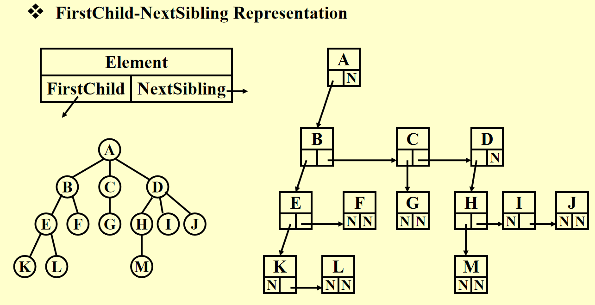
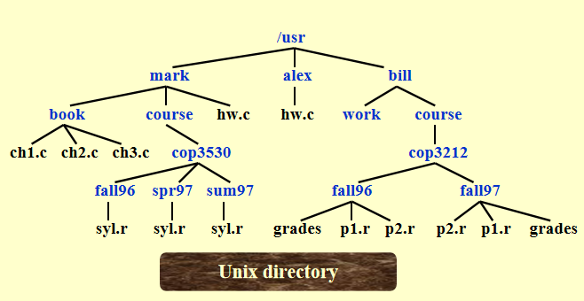
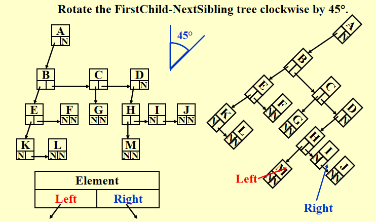
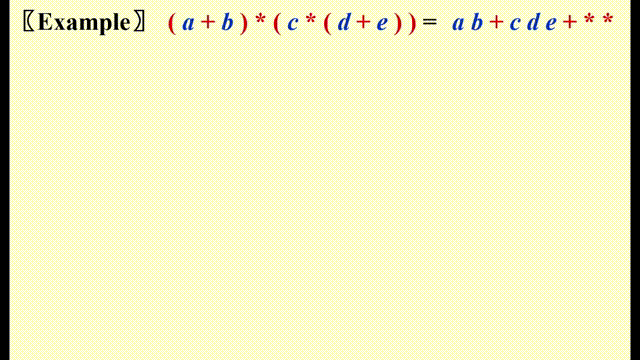

# Chap 4: Trees

??? abstract "核心知识"

	+ 树的表示法：first-child-next-sibling
	+ 二叉树
		+ 性质
		+ 树的遍历：前、中、后、层
		+ 线索二叉树
		+ 应用：文件系统、表达式树
	+ **二叉搜索树**
		+ 各种操作，重点是插入和删除

>注：更多理论部分的知识可参见离散数学[同名章节](../../math/dm/11.md)

## Preliminaries

### Definitions

+ **树(trees)**：它是一组节点，可以为空，如果不为空：

	+ 包含1个**根节点(root)** $r$
	+ 有0个或多个**子树(subtrees)** $T_1, \dots, T_k$，每个子树的根节点都和$r$通过一条**边(edge)**连接

>注：
>
>+ 子树之间不会相互连接，因此每个节点都是某个子树的根节点
>+ 对于一棵有 $N$ 个节点的树，它有 $N - 1$ 条边

+ **度(degree)**：
	+ 一个*节点*的度指的是它<u>所有子树的个数</u>
	+ 一棵*树*的度为$\max\limits_{\text{node } \in \text{ tree}}\{\text{degree(node)}\}$
+ **父节点(parent)**：有子树的节点
+ **孩子节点(children)**：父节点子树的根节点
+ **兄弟节点(siblings)**：有共同父节点的孩子节点
+ **叶子节点(leaf)**：度为0的节点
+ 从$n_1$到$n_k$**路径(path)**：一个包含节点 $n_1, n_2, \dots, n_k$ **唯一**的序列，满足 $n_i$ 是 $n_{i+1}$ 的父节点($1 \le i < k$)
+ 路径**长度(length)**：路径上边的条数
+ 顶点$n_i$的**深度(depth)**：从根节点出发到$n_i$的路径长度，规定 $\mathrm{depth}(root) = 0$
+ 顶点$n_i$的**高度(height)**：从$n_i$到叶子结点的**最长**路径长度，规定 $\mathrm{height}(leaf) = 0$

$$\therefore \mathrm{height}(root) = \mathrm{depth}(deepest\text{ }leaf)$$

+ **祖先(ancestor)**：从该节点到根节点的路径上所有的节点
+ **后代(descendant)**：该节点所有子树的节点
+ **内部节点(internal vertices)**：有孩子节点的顶点

### Implementation

#### List Representation

<div style="text-align: center; margin-top: 15px;">

</div>

缺陷：每个节点的空间大小取决于它有多少个子树，这样实现起来就很麻烦

#### FirstChild-NextSibling Representation

<div style="text-align: center; margin-top: 15px;">

</div>

> 注：对于同一棵树，这种表示并**不唯一**，因为孩子的顺序可以是任意的

### Application(File System)

Unix 文件树 $\Rightarrow$ DOS 目录列表

!!! example "分层文件系统的目录列表"

	=== "Unix 系统"

		<div style="text-align: center; margin-top: 15px;">
		
		</div>

	=== "DOS 系统"

		<div style="text-align: center; margin-top: 15px;">
		
		</div>

注意：在UNIX系统中位于深度 $d_i$ 的文件，在转化为 DOS 系统的表示法时需要将它们的名字缩进 $d_i$ 倍的多个空格
	
代码实现（**前序遍历**）：
``` c 
static void ListDir(DirOfFile D, int Depth)
{
	if (D is legitimate entry)
	{
		PrintName(D, Depth);
		if (D is a directory)
			for (each child C of D)
				ListDir(C, Depth + 1);
	}
}
```
`Depth` 变量是不应该被用户看到的**内部变量**，需要隐藏起来。一种解决方法是像下面那样定义另外一个函数，隐藏`Depth` 接口

``` c
void ListDirectory(DirOfFile D)
{
	ListDir(D, 0);
}
```

---
计算目录大小：

<div style="text-align: center; margin-top: 15px;">

</div>

代码实现（**后序遍历**，时间复杂度$O(N)$）
``` c
static int SizeDir(DirOrFile D)
{
	int TotalSize;
	TotalSize = 0;
	if (D is a legitimate entry)
	{
		TotalSize = FileSize(D);
		if (D is a directory)
			for (each child C of D)
				TotalSize += SizeDir(C);
	} // end if D is legal
	return TotalSize;
}
```

## Binary Trees

**二叉树(binary tree)**：每个节点拥有不超过两个孩子的树

<div style="text-align: center; margin-top: 15px;">

</div>

补充：一般树（左图）的后序遍历 = 由上述方法得到的二叉树（右图）的中序遍历

### Expression Trees(syntax trees)

+ 先将[中缀表达式 -> 后缀表达式](3.md#infix-to-postfix-conversion)
+ 然后类似[后缀表达式求解](3.md#postfix-evaluation)的方法，遇到运算符时，将栈内的两个操作数弹出，与运算符构建一棵树，对应关系如下：

	+ 左子树：栈顶下面的元素
	+ 根节点：运算符
	+ 右子树：栈顶元素

	将这棵树压入栈中，重复上述步骤直到遍历完整个表达式

???+ play "动画演示"

	<div style="text-align: center; margin-top: 15px;">
	
	</div>

??? code "代码实现"

	``` c
	// from my work of project 2
	Tree ExpTree(Queue q)
	{
	    Tree ans;   // The final expression tree
	    Stack s;    // The stack for tree construction, containing the nodes or the trees
	    PtrToNode node, op1, op2, new;  // node for all element in the queue; op1 and op2 are operands;and new is a new tree
	    PtrToQueue cur = q->front->next;  // Starting from the second element, for the queue has a dummy header

	    s = CreateStack();  // Initialization
	    while (cur != NULL)  // Traversing all the element in the queue
	    {
	        node = CreateNode(cur->var);  // Creating node for every element in the queue
	        if(isalnum(cur->var[0]) || cur->var[0] == '-' && isalnum(cur->var[1]))  // If it's an operand, push it into the stack
	        {
	            Push1(node, s);
	            // printf("%s\n", str);
	        }
	        else  // If it's a operator,
	        {

	            op2 = Top1(s);  // Obtaining the top two operands from the stack
	            Pop(s);
	            op1 = Top1(s);
	            Pop(s);
	            new = CreateTree(node, op1, op2);  // Creating an expression (sub)tree
	            Push1(new, s);
	        }
	        cur = cur->next;
	    }
	    ans = Top1(s); // The remaining tree in the stack is the answer

	    return ans;

	}
	```

### Tree Traversals

**树的遍历(tree traversals)**：对树的每个节点都访问一次，时间复杂度为 $O(N)$

<div style="text-align: center; margin-top: 15px;">

</div>

**前序遍历(preorder traversal)**

``` c
void preorder(tree_ptr tree)
{
	if (tree)
	{
		visit(tree);
		for (each child C of tree)
			preorder(C);
	}
}
```

**后序遍历(postorder traversal)**

``` c
void postorder(tree_ptr tree)
{
	if (tree)
	{
		for (each child C of tree)
			postorder(C);
		visit(tree);
	}
}
```

**层序遍历(levelorder traversal)**

``` c
void levelorder(tree_ptr tree)
{
	enqueue(tree);
	while (queue is not empty)
	{
		visit(T = dequeue());
		for (each child C of T)
			enqueue(C);
	}
}
```

??? info "补充：“之”字形遍历"

	可以认为是“层序遍历 pro”：第 0 层（根节点）从右往左、第1层从左往右、第2层从右往左...，也就是说每层遍历完后都要改变一次遍历方向

	实现方法：用 2 个栈，一个存从左往右遍历的节点，一个存从右往左遍历的节点

**中序遍历(inorder traversal)**
``` c
// Recursion
void inorder(tree_ptr tree)
{
	if (tree)
	{
		inorder(tree->Left);
		visit(tree->Element);
		inorder(tree->Right);
	}
}

// Iteration(using stack)
void iter_inorder(tree_ptr tree)
{
	Stack S = CreateStack(MAX_SIZE);
	for (;;)
	{
		for (; tree; tree = tree->left)
			Push(tree, S);
		tree = Top(S);
		Pop(S);
		if (!tree)
			break;
		visit(tree->Element);
		tree = tree->Right;
	}
}
```

!!! note "注"

	+ 知道<u>前序或者后序遍历</u> + 中序遍历，可以确定唯一的一棵树
	+ 知道前序遍历 + 后序遍历，一般情况下无法确定树的形状

### Threaded Binary Trees

对于一般的二叉树，它的叶子节点的左右指针指向 `NULL`，这浪费了很多空间。而**线索二叉树(threaded binary trees)**很好地利用了闲置的节点，具体规则如下：

+ 如果 `Tree->Left` 为空，将它指向**中序**遍历中的**前一个节点**
+ 如果 `Tree->Right` 为空，将它指向**中序**遍历中的**后一个节点**
+ 有一个**头节点**(dummy node)，使得*最左边*和*最右边*孩子分别指向这个节点的左右孩子

``` c
// 结构声明
typedef struct ThreadedTreeNode *PtrTo ThreadedNode;
typedef struct PtrToThreadedNode ThreadedTree;
struct ThreadedTreeNode
{
	int LeftThread;      // if it is True, then Left
	TreadedTree Left;    // is a thread, not a child ptr
	ElementType Element;
	int RightThread;     // if it is True, then Right
	ThreadedTree Right;  // is a thread, not a child ptr
}
```

!!! example "例子"

	<div style="text-align: center; margin-top: 15px;">
	
	</div>

	可以看到，我们从 dummy head node 出发，重复“左线索 $\rightarrow$ 右线索 $\rightarrow$ 左线索 $\rightarrow$ 右线索 $\dots$”的遍历过程，最后回到 dummy head node ，这样我们可以对整棵树进行一趟完整的中序遍历。

???+ note "注"

	虽然这里默认使用中序遍历的定义，但我们也可以将其修改成**前序**或者**后序**遍历的版本(比如对于后序遍历版的线索二叉树，某个节点空出来的左子树指向它在后序遍历中的前一个节点，空出来的右子树指向它在后序遍历中的后一个节点)

### Special Cases

+ **歪斜二叉树(skewed binary trees)**：

<div style="text-align: center; margin-top: 15px;">

</div>

+ **完全二叉树(complete binary trees)**：

<div style="text-align: center; margin-top: 15px;">

</div>


### Properties

+ 第 $i$ 层($i \ge 1$)最多拥有 $2^{i - 1}$ 个节点；深度为 $k$ 的二叉树最多有 $2^k - 1$ 个节点($k \ge 1$)

+ 对于非空的二叉树，$n_0 = n_2 + 1$，其中 $n_0$ 是叶子节点个数，$n_2$ 是度为 2 的节点个数

!!! note "证明"

	>注：该证明可推广至n叉树

	+ 令 $n_1$ 为度为 1 的节点，$n$ 为节点总数，则$n = n_0 + n_1 + n_2$
	+ 令 $B$ 为边的条数，则 $n = B + 1$，而且不难发现 $B = n_1 + 2n_2$
	+ 联立上述三个方程，可以得到 $n_0 = n_2 + 1$($n_1$ 被消掉了)

推论1：对于一棵完全二叉树，易知 $n_1 = 0$ 或 $1$。由 $n_0 = n_2 + 1$ 知:

+ 完全二叉树有奇数个节点时，$n_1 = 0$
+ 完全二叉树有偶数个节点时，$n_1 = 1$

:star:推论2：$n$ 叉树的叶子节点个数与 $n_1$ 无关，且 $n_0 = \sum\limits_{i = 2}^n (i - 1)n_i + 1$

## Binary Search Tree

### Definition

**二叉搜索树(Binary Search Tree)**是一棵二叉树，它可以是空树，如果非空，则遵循以下规则：

+ 每个节点有一个整数的**键(key)**，每个键互不相同
>这里这么定义是为了方便后面的操作，实际上键不必是整数，键也可以相同

+ 非空**左**子树的键必须**小于**根上的键
+ 非空**右**子树的键必须**大于**根上的键
+ 左右子树也是二叉搜索树

!!! note "注"

	+ 对二叉搜索树的**同一层**从左往右遍历，得到的键的序列是**有序**的
	+ 通过对二叉搜索树的**中序遍历**得到的元素序列是**有序**的
	+ 给出一棵二叉搜索树的**前序***或者***后序**遍历，根据二叉搜索树的定义，我们应当可以还原出这棵树
	+ 对于一棵*完全*的二叉搜索树，它**最小**的节点一定是**叶子节点**，最大的就不一定了

### ADT

**Objects**：拥有 0 个或多个元素的有限有序表

**Operations**：

+ `SearchTree MakeEmpty(SearchTree T);`
+ `Position Find(ElementType X, SearchTree T);`
+ `Position FindMin(SearchTree T);`
+ `Position FindMax(SearchTree T);`
+ `SearchTree Insert(ElementType X, SearchTree T);` :star:
+ `SearchTree Delete(ElementType X, SearchTree T);` :star:
+ `ElementType Retrieve(Position P);`

### Implementations

??? code "预先处理"

	``` c
	// 声明部分
	#ifndef _Tree_H

	struct TreeNode;
	typedef struct TreeNode * Position;
	typedef struct TreeNode * SearchTree;

	SearchTree MakeEmpty(SearchTree T);
	Position Find(ElementType X, SearchTree T);
	Position FindMin(SearchTree T);
	Position FindMax(SearchTree T);
	SearchTree Insert(ElementType X, SearchTree T);
	SearchTree Delete(ElementType X, SearchTree T);
	ElementType Retrieve(Position P);

	#endif // _Tree_H

	// 写在执行文件部分
	struct TreeNode
	{
		ElementType Element;
		SearchTree Left;
		SearchTree Right;
	}

	// 初始化处理（用到后序遍历），时间复杂度 O(logN)
	SearchTree MakeEmpty(SearchTree T)
	{
		if (T != NULL)
		{
			MakeEmpty(T->Left);
			MakeEmpty(T->Right);
			free(T);
		}
		return NULL;
	}
	```

#### Find

??? code "代码实现（递归版）"

	``` c
	Position Find(ElementType X, SearchTree T)
	{
		if (T == NULL)
			return NULL; // not found in an empty tree
		if (X < T->Element)  // if smaller than root
			return Find(X, T->Left);  // search left subtree
		else if (X > T->Element)  // if larger than root
			return Find(X, T->Right);  // search right subtree
		else  // if X == root
			return T;  // found
	}
	```

+ 时间复杂度 $T(N)$ 和空间复杂度 $S(N)$ 都等于 $O(d)$，其中 $d$ 为树 $X$ 的深度
+ 函数开始时应先判断树是否为空，如果少了这句，后面就会发生段错误（在不存在的树中获取元素，这是未定义的）
+ 这里的递归函数是[**尾递归(tail recursions)**](3.md#function-calls)，因此系统会自动将递归优化为循环

??? code "代码实现（迭代版）"

	``` c
	Position Iter_Find(ElementType X, SearchTree T)
	{
		while (T)
		{
			if (X == T->Element)
				return T;  // found
			if (X < T->Element)
				T = T->Left;  // move down along left path
			else
				T = T->Right;  // move down along right path
		} // end while-loop
		return NULL;  // not found
	}
	```

#### FindMin

??? code "代码实现"

	``` c
	Position FindMin(SearchTree T)
	{
		if (T == NULL)
			return NULL;  // not found in an empty tree
		else if (T->Left == NULL)  // found left most
			return T;
		else
			return FindMin(T->Left); // keep moving to left
	}
	```

#### FindMax

??? code "代码实现"

	``` c
	Position FindMax(SearchTree T)
	{
		if (T != NULL)
			while (T->Right != NULL)
				T = T->Right;  // keep moving to find right most
		return T;  // return NULL or the right most
	}
	```
`FindMin()` 和 `FindMax` 函数的时间复杂度均为 $O(d)$，$d$ 为树的深度

#### Insert

!!! note "思路"

	执行过程类似 `Find`

	+ 如果找到了该节点，可以不做任何处理，也可以给它的计数器 +1（如果节点有计数字段的话）
	+ 否则将最后遇到的**非空节点**视为新节点的父节点，然后将新节点插入 `NULL` 的位置上

??? code "代码实现"

	``` c
	SearchTree Insert(ElementType X, SearchTree T)
	{
		if (T == NULL)  // Create and return a one-node tree
		{
			T = (SearchTree)malloc(sizeof(struct TreeNode));
			if (T == NULL)
				FatalError("Out of space!!!");
			else
			{
				T->Element = X;
				T->Left = T->Right = NULL;
			}
		}  // End create a one-node tree
		else
		{
			if (X < T->Element)
				T->Left = Insert(X, T->Left);
			else if (X > T->Element)
				T->Right = Insert(X, T->Right);
			// Else X is in the tree already, we'll do nothing
		}
		return T; // Don't forget this line!!
	}
	```

时间复杂度：$O(d)$

!!! question "思考"

	=== "问题"

		可不可以这样简化一下插入函数——将函数返回类型改为`void`，然后在第一个`else`中不采用赋值语句，最后也不返回`T`

	=== "答案"

		NO!!!

		如果最后没有在树中找到要插入的节点，那么就需要新建一棵子树。如果建完这棵树后没有返回，那么这棵子树的父节点无法与它建立联系，这棵子树与原来的树就是断开的，因此建了也等于白建。


#### Delete

这是二叉搜索树中最难处理的部分。我们要处理有三种情况：

+ 叶子结点
+ 有一个孩子
+ ==有两个孩子==

!!! note "具体分析"

	其中前两种情况的实现较为简单，最后的情况较为复杂

	+ 删除**叶子节点**：直接将它的父节点连接到空节点上
	+ 删除**度为1**的节点：用该节点的子节点替换它自身
	+ 删除**度为2**的节点：

		+ 用该节点**左子树的最大节点**或**右子树的最小节点**（挑一种）替换它自身
		>解释：以右子树最小节点为例，将其作为新的父节点，因为它既满足比左子树所有节点大（右子树的节点>左子树的节点），又满足比新的右子树所有节点小（它原本就是右子树最小的节点）
		
		+ 从子树中删除用来替换的节点
		>注意用来替换的节点的度不超过1

??? code "代码实现"

	``` c
	// 这里删除度为 2 的节点时采用拿右子树最小节点替换的方法
	SearchTree Delete(ElementType X, SearchTree T)
	{
		Position TmpCell;
		if (T == NULL)
			Error("Element not found");
		else
		{
			if (X < T->ELement)  // Go left
				T->Left = Delete(X, T->Left);
			else if (X > T->Element)  // Go right
				T->Right = Delete(X, T->Right);
			else  // Found element to be deleted
			{
				if (T->Left && T->Right)  // Two children
				{  // Replace with smallest in right subtree
					TmpCell = FindMin(T->Right);
					T->Element = TmpCell->Element;
					T->Right = Delete(T->Element, T->Right);
				}  // End if 
				else  // One or zero child
				{
					TmpCell = T;
					if (T->Left == NULL)  // Also handles 0 child
						T = T->Right;
					else if (T->Right == NULL)
						T = T->Left;
					free(TmpCell);  // End else 1 or 0 child
				}
			}
		} 
		return T;
	}
	```

时间复杂度：$O(h)$，$h$ 是树的高度。显然，这种删除的操作效率不高

改进方法：如果删除操作用的不多，可以采用 **lazy deletion** 的方法——为每个节点添加一个 `flag` 字段，来标记节点是否被删除。因此我们不必通过释放节点的空间的方式来删除节点；而且如果我们重新插入已经删除的节点，也不需要使用 `malloc()` 分配内存，从而提高程序的效率。

### Average-Case Analysis

通过计算发现，树的所有节点的平均深度为 $O(logN)$（证明过程见教材 $P_{108}$）

 二叉搜索树的大小取决于**插入的顺序**和**删除**操作

+ 插入：如果顺序不够随机（最坏的情况：升/降序），则树会**退化**成一个链表，因此**最坏情况**的时间复杂度为$O(N)$
+ 删除：以替换为右子树最小节点为例，过多的删除操作会导致右子树不断缩小，左子树的规模会大于右子树，破坏了树的平衡

