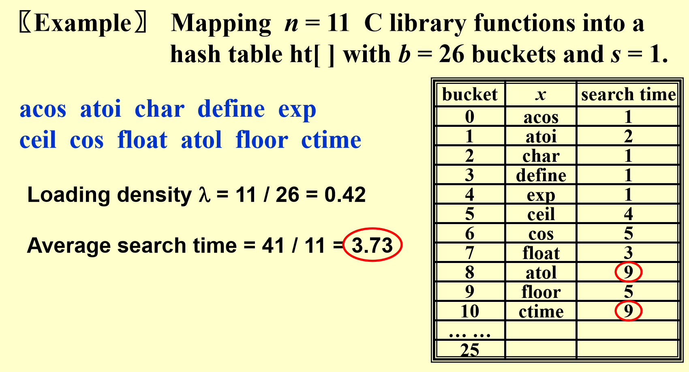

# Chap 5: Hashing

??? abstract "核心知识"

    + 散列函数
    + 单独链表法
    + 开放地址
        + 线性探测
        + 二次探测
        + 双重散列法
    + 再散列

??? info "引入：插值排序(interpolation sort)"

    在 [Chap 7](7.md) 中，我们介绍了一些基于比较的排序算法，这类算法的最优时间复杂度为 $O(n \log n)$，然而这不是排序算法的极限——**插值排序**为我们提供了时间复杂度仅为 $O(1)$ 的方法，其本质为*基于公式的搜索(search by formula)*。

    题目：从有序列表 f[l].key, f[l+1].key, ..., f[u].key 中找到特定的 key

    <div style="text-align: center; margin-top: 15px;">
    
    </div>

## General Idea

**简单表(symbol table)** ADT

+ **Objects**：一组"名称 + 属性"对的集合，集合中的每个名称是唯一的

+ **Operations**：

    + `SymTab Create(TableSize)`
    + `Boolean IsIn(symtab, name)`
    + `Attribute Find(symtab, name)`:star:
    + `SymTab Insert(symtab, name, attr)`:star:
    + `SymTab Delete(symtab, name)`

**散列表(hash tables)**

对于每个标识符 x，我们定义一个**散列函数(hash function)** f(x)，用来表示 x 在 ht[] 的位置，即下图中包含 x 的篮子(bucket)的索引

<div style="text-align: center; margin-top: 15px;">

</div>

+ T 表示标识符的总数
+ n 表示 ht[] 中（即已排好序的）标识符的总数
+ **标识符密度(identifier density)** = $\dfrac{n}{T}$
+ **加载密度(loading density)**$\lambda = \dfrac{n}{s \cdot b}$

!!! warning "散列表的常见问题"

    + **冲突(collision)**：2 个不同的标识符放入相同的篮子内，即 $f(i_1) = f(i_2)$ 且 $i_1 \ne i_2$
    + **溢出(overflow)**：某个（些）篮子的空间已满，无法安置新的标识符
    >注：当篮子容量 s = 1 时，冲突和溢出同时发生

    ??? example

        <div style="text-align: center; margin-top: 15px;">
        
        </div>

若没有溢出，散列表的主要操作的时间复杂度均为常数级，即：

$$
T_{search} = T_{insert} = T_{delete} = O(1)
$$

## Hash Function

散列函数f的性质：

+ f(x) 必须容易计算，且能最小化冲突的可能
+ f(x) 不能有"偏见"，能够将所有的键<u>平均分配</u>至散列表内，也就是说： $\forall x,\ \forall i$，$f(x) = i$ 的概率为 $\dfrac{1}{b}$。这样的散列函数被称为*统一散列函数(uniform hash function)*

!!! example "一些散列函数"

    === "函数1"

        $$f(x) = x\ \%\ TableSize$$

        >x 为整数

        这不是一个好的散列函数，因为用这种函数很容易发生冲突。然而，若我们让 $TableSize$ 为一个**质数**，且令所有的键尽可能随机，冲突就不那么容易发生了

    === "函数2"

        $$f(x) = (\sum x[i])\ \%\ TableSize$$

        >x 为字符串

        这是前一种函数的变种，用于字符串的情况，$\sum x[i]$ 为所有字符的 ASCII 码之和。这种方法也很简单，也很容易产生冲突

    === "函数3"

        $$f(x) = (x[0] + x[1] * 27 + x[2] * 27^2)\ \%\ TableSize$$

        >x 为长度为 3 的英文字符串（全大写或全小写）（27 = 26 个字母 + NULL(空)）

        这是对前一种函数的改良，把每个字符串表示为一个唯一的27进制数。这确实能完全避开冲突，然而实际长度为3的英语单词的个数远少于散列表的篮子个数，从而导致空间的巨大浪费

    === "函数4"

        $$f(x) = (\sum x[N - i - 1] * 32^i)\ \%\ TableSize$$

        如果我们将 27 改成 32，则用左移 5 位的运算替代乘以 26 的运算，效率更高(移位的速度大于乘法)。由于是左移位，所以需要稍微调整一下散列值的表示，如下图所示

        <div style="text-align: center; margin-top: 15px;">
        
        </div>

        代码：
        ``` c
        Index Hash3(const char *x, int TableSize)
        {
            unsigned int HashVal = 0;
            while (*x != '\0')
                HashVal = (HashVal << 5) + *x++;
            return HashVal % TableSize;
        }
        ```
        缺点：若字符串 x 太长，那么最先进入散列值的字符会被左移到边界外面，因此我们需要谨慎挑选 x 的字符

## Separate Chaining

**单独链表法(separate chaining)**：将所有散列值相同的键放入同一张链表中

>注：这种方法又被称为**开散列法(open hashing)**

??? code "代码实现"

    + 初始化

    ``` c
    struct ListNode;
    typedef struct ListNode * Position;
    struct HashTbl;
    typedef struct HashTbl * HashTable;

    struct ListNode
    {
        ElementType Element;
        Position Next;
    };
    typedef Position List;

    /* List *TheList will be an array of lists, allocated later */ 
    /* The lists use headers (for simplicity), */ 
    /* though this wastes space */ 
    struct HashTbl
    {
        int TableSize;
        List * TheLists;
    };
    ```

    + 创建空表
    
    ``` c
    HashTable InitializeTable(int TableSize)
    {
        HashTable H;
        int i;
        if (TableSize < MinTableSize)
        {
            Error("Table size too small");
            return NULL;
        }
        H = (HashTable)malloc(sizeof(struct HashTbl)); // Allocate table
        if (H == NULL) 
            FatalError("Out of Space!!!");
        H->TableSize = NextPrime(TableSize);  // Better be prime
        H->TheLists = malloc(sizeof(List) * H->TableSize);  // Array of lists
        if (H->TheLists == NULL)   
            FatalError("Out of space!!!"); 
        for(i = 0; i < H->TableSize; i++) 
        {   // Allocate list headers
            H->TheLists[i] = malloc(sizeof(struct ListNode)); // Slow! 
            if ( H->TheLists[i] == NULL )  
                FatalError("Out of space!!!"); 
            else    
                H->TheLists[i]->Next = NULL;
        } 
        return H; 
    }
    ```

    ??? example "散列表示意图"

        <div style="text-align: center; margin-top: 15px;">
        
        </div>

        注意：散列表的开头，以及每个篮子都是有"空头"的，这主要是为了删除操作的方便。若没有删除操作，则最好不要用空头，这样可以节省空间

    + 从散列表中找键
    
    ``` c
    Position Find(ElementType Key, HashTable H)
    {
        Position P;
        List L;

        L = H->TheLists[Hash(Key, H->TableSize)];

        P = L->Next;
        // Identical to the code to perform a Find for List ADT
        while (P != NULL && P->Element != Key) // Probably need strcmp
            P = P->Next;
        return P;
    }
    ```

    + 将键插入散列表内（放在篮子的最上（前）面）
    
    ``` c
    void Insert(ElementType Key, HashTable H)
    {
        Position Pos, NewWell;
        List L;
        Pos = Find(Key, H);
        if (Pos == NULL) // Key is not found, then insert
        {
            NewCell = (Position)malloc(sizeof(struct ListNode));
            if (NewCell == NULL)
                FatalError("Out of space!!!");
            else
            {
                L = H->TheLists[Hash(Key, H->TableSize)];
                NewCell->Next = L->Next;
                NewCell->Element = Key; // Probably need strcpy
                L->Next = NewCell;
            }
        }
    }
    ```

>注：
>
>+ 不好的一点是该函数用了两次 `Hash()` 函数，所以这里需要改进一下
>+ 我们要让 `TableSize` 尽可能接近键的数量，即让加载密度 $\lambda \approx 1$
>+ 这里仅考虑所有键都不同的情况，若出现相同的键，要么选择无视，要么增加一个额外的字段记录重复的次数

## Open Addressing

**开放地址(open addressing)**：通过寻找下一个空的单元来解决冲突，这样我们就不必使用指针了。

>注：这种方法又被称为**闭散列法(close hashing)**

模版：

``` c
Algorithm: insert key into an array of hash table
{
    index = hash(key);
    initialize i = 0  // the counter of probing
    while (collision at index)
    {
        index = (hash(key) + f(i)) % TableSize;
        if (table is full) break;
        else i++;
    }
    if (table is full)
        ERROR("No space left");
    else
        Insert key at index;
}
```
其中，f(i)为**冲突解决函数**，初始状态为f(0) = 0。通常用于$\lambda < 0.5$的情况。

正如 `while` 循环所示，若使用一次冲突解决函数后，冲突仍然发生，那就继续使用冲突解决函数，直至冲突解决，或发现无法解决直接退出。

### Linear Probing

最简单的冲突解决函数为**线性探测(linear probing)**：f(i) = i，它仅是一个线性函数

!!! example 

    <div style="text-align: center; margin-top: 15px;">
    
    </div>

    对比[前面的例子](#general-idea)，可以发现：虽然加载密度得到不小的提升，但是平均搜索时间比较长。
    
线性探测中预期探测次数关于加载密度的表达式：

$$
p = \begin{cases}\dfrac{1}{2}(1 + \dfrac{1}{(1 - \lambda)^2}) & \text{for insertion and unsuccessful searches}\\ \dfrac{1}{2}(1 + \dfrac{1}{1 - \lambda}) & \text{for successful searches}\end{cases}
$$

对于上面的例子，p = 1.36。虽然很小，但是在最坏情况下p会很大。

!!! warning "线性探测的问题：**基本聚集(primary cluster)**"

    线性探测将位置不匹配的键安放至后面最近的空内，这样做会形成*区块(cluster)*，使得散列表分布不均匀，导致即使表的空间看起来挺空的，但是某些地方聚集了一堆元素。

??? info "随机冲突解决策略(random collision resolution strategy)"

    + 不成功的探测次数：$\dfrac{1}{1 - \lambda}$
    + 成功探测的平均次数 = 不成功的探测次数

    线性探测与随机策略的效率比较（其中 S 表示成功的搜索，U 表示不成功的搜索，I 表示插入）

    <div style="text-align: center; margin-top: 15px;">
    
    </div>

### Quadratic Probing

**二次探测(quadratic probing)** 的函数为：$f(i) = i^2$

**定理**：若使用二次探测，且表的大小是一个质数，则当表至少有一半的空余空间时，新的元素总是能够被成功插入。

??? note "证明"

    只要证明前 $\lfloor \dfrac{TableSize}{2} \rfloor$ 个可替代的位置是不同的，也就是说，$\forall\ 0 < i \ne j \le \lfloor \dfrac{TableSize}{2} \rfloor$，我们有：

    $$
    (h(x) + i^2)\ \%\ TableSize \ne (h(x) + j^2)\ \%\ TableSize
    $$

    反证法：假设 $h(x) + i^2 \equiv h(x) + j^2 (\text{mod }\  TableSize)$，那么可以得到 $(i + j)(i - j) \equiv 0(\text{mod } TableSize)$，即 (i + j) 或 (i - j) 能够被质数 TableSize 整除，但这显然是不可能的，推出矛盾，因此定理成立。

!!! note "注"

    若表的大小是一个形如 4k + 3 的质数，则使用二次探测 $f(i) = \pm i^2$ 来探测整张表

??? code "代码实现"

    + 声明

    ``` c
    #ifndef _HashQuad_H

    typedef unsigned int Index;
    typedef Index Position;

    struct HashTbl;
    typedef struct HashTbl *HashTable;

    HashTable InitializeTable(int TableSize);
    void DestroyTable(HashTable H);
    Position Find(ElementType Key, HashTable H);
    void Insert(ElementType Key, HashTable H);
    ElementType Retrieve(Position P, HashTable H);
    HashTable Rehash(HashTable H);
    // Routine such as Delete and MakeEmpty are omitted

    #endif // _HashQuad_H

    // Place in the implementation file

    enum KindOfEntry {Legitimate, Empty, Deleted};

    struct HashEntry
    {
        ElementType Element;
        enum KindOfEntry Info;
    };

    typedef struct HashEntry Cell;

    // Cell * TheCells will be an array of HashEntry cells, allocated later
    struct HashTbl
    {
        int TableSize;
        Cell * TheCells;
    };

    ```

    + 初始化

    ``` c
    HashTable InitializeTable(int TableSize)
    {
        HashTable H;
        int i;

        if (TableSize < MinTableSize)
        {
            Error("Table size too small");
            return NULL;
        }

        // Allocate table
        H = (HashTable)malloc(sizeof(struct HashTbl));
        if (H == NULL)
            FatalError("Out of Space!!!");

        H->TableSize = NextPrime(TableSize);

        // Allocate array of Cells
        H->TheCells = (Cell *)malloc(sizeof(Cell) * H->TableSize);
        if (H->TheCells == NULL)
            FatalError("Out of Space!!!");

        for (i = 0; i < H->TableSize; i++)
            H->TheCells[i].Info = Empty;

        return H;
    }

    ```

    + 寻找位置

    ``` c
    Position Find(ElementType Key, HashTable H)
    {
        Position CurrentPos;
        int CollisionNum = 0;
        CurrentPos = Hash(Key, H->TableSize);
        while (H->TheCells[CurrentPos].Info != Empty && 
                H->TheCells[CurrentPos].Element != Key) 
        {
            CurrentPos += 2 * ++CollisionNum - 1;  // 1
            if (CurrentPos >= H->TableSize)        // 2
                CurrentPos -= H->TableSize;      
        }
        return CurrentPos;  // 3
    }
    ```
    !!! note "注"

        !!! warning "若交换 `while` 循环内的两个判断条件，程序很有可能出现段错误，因为没有先判断是否有元素"

        1. 这里用到二次探测函数的递推关系：$F(i) = F(i - 1) + 2i - 1$，避免使用乘法，从而提高效率
        2. 这块语句替换了原来的模除运算，提高了效率；但是若 `CurrentPos` 大于2倍的 `TableSize`，就无法实现模除的功能了（因此使用前确保 `CurrentPos` 不超过2倍的 `TableSize`）
        3. 返回可插入的位置

    + 插入元素

    ``` c
    void Insert (ElementType Key, HashTable H)
    {
        Position Pos;
        Pos = Find(Key, H);
        if (H->TheCells[Pos].Info != Legitimate)  // Ok to insert here
        {
            H->TheCells[Pos].Info = Legitimate;
            H->TheCells[Pos].Element = Key; // Probably need strcpy
        }
    }
    ```

!!! note "注"

    + 如果有过多的插入和删除操作，插入的效率会显著降低
    + 尽管二次探测解决了基本聚集的问题，但它会导致**二次聚集**：通过散列函数被分配到相同位置的键，探测到相同的可替代的位置。

### Double Hashing

**双散列(double hashing)**的函数：$f(i) = i * \mathrm{hash}_2(x)$，其中$\mathrm{hash}_2(x)$为第 2 个散列函数

+ $\mathrm{hash}_2(x) \ne 0$
+ 确保所有位置都能被探测到

较好的散列函数：$\mathrm{hash}_2(x) = R - (x \% R)$，其中 R 为小于 `TableSize` 的质数

!!! note "注"

    + 若双散列函数能正确执行，那么由模拟结果知，预期的探测次数和随机冲突解决策略的大致相同
    + 二次探测不需要使用第二个散列函数，因此在实践中更简单、更快

## Rehashing

在二次探测中，我们有时会用到“**再散列(rehashing)**”的技巧

!!! question "何时使用再散列"

    + 被占用的表空间达到一半时
    + 插入失败时
    + 散列表的加载因数达到特定值时

具体做法：

+ 建立一张额外的表，大小是原来的两倍
+ 遍历原来的整张散列表中未删除的元素
+ 使用新的散列函数，将遍历到的元素插入新的表中

如果表内有N个键，则时间复杂度$T(N) = O(N)$

??? code "代码实现"

    ``` c
    HashTable ReHash(HashTable H)
    {
        int i, OldSize;
        Cell * OldCells;

        OldCells = H->TheCells;
        OldSize = H->TableSize;

        // Get a new, empty table
        H = InitializeTable(2 * OldSize);

        // Scan through old table, reinserting into new
        for (i = 0; i < OldSize; i++)
            if (OldCells[i].Info == Legitimate)
                Insert(OldCells[i].Element, H);
        
        free(OldCells);

        return H;
    }
    ```


