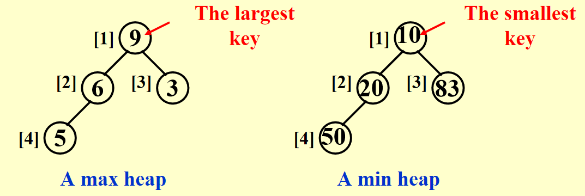
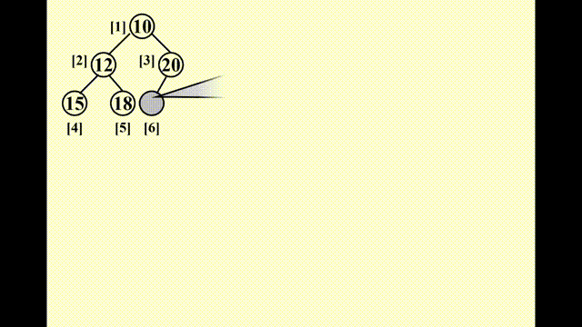
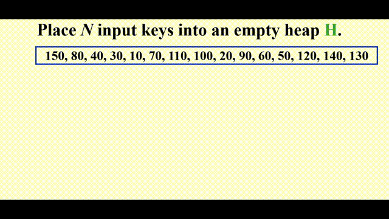
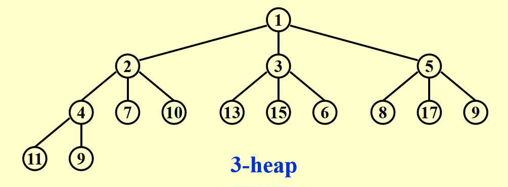

# Chap 6: Priority Queues(Heaps)

??? abstract "核心知识"

	+ 二叉堆的表示：数组
	+ 常用操作：`Insert`、`DeleteMin`，分别涉及“上滤”和“下滤“的思想
	+ 其他操作：`BuildHeap`

??? question "何时用堆？"

	当我们只关心一个列表中最小（大）的元素时（频繁查找或使用），我们应优先使用**堆**

## Simple Implementation

比较下列几种实现方式：

+ 数组
	+ 插入：在尾部添加项 \~ $\Theta(1)$
	+ 删除：找最大/最小的键 \~ $\Theta(n)$；删除项后移动剩余项 \~ $O(n)$
+ **链表**
	+ 插入：在头部添加项 \~ $\Theta(1)$
	+ 删除：找最大/最小的键 \~ $\Theta(n)$；删除项 \~ $\Theta(1)$
+ 有序数组
	+ 插入：找到正确的位置 \~ $O(n)$；移动数组并加入该项 \~ $O(n)$
	+ 删除：移除首项/末项 \~ $\Theta(1)$
+ 有序链表
	+ 插入：找到正确的位置 \~ $O(n)$；加入项 \~ $\Theta(1)$
	+ 删除：移除首项/末项 \~ $\Theta(1)$

可以看出，这些结构实现起来相对比较容易，且各有优劣。一般情况下，**插入的操作 > 删除的操作**，因此教材作者更推荐**链表**。

???+ question "What about **BST(二分搜索树)**？"

	二分搜索树有以下问题：

	+ 虽然理论上它的插入和删除操作时间复杂度为$O(\log n)$，然而实际应用中**插入**操作是**随机**的，这会导致树的不平衡，从而影响时间复杂度
	+ 虽然**删除**操作并不是随机的，但我们只要找最小节点并且删除它，这会导致左子树越来越小，破坏了树的平衡，从而影响复杂度
	+ 我们可能想到构建一棵平衡的树，比如 AVL 树。但是 AVL 树中的很多操作在优先队列中用不到，且它的指针使用很危险。 

## ADT Model

**优先队列/堆(priority queue/heap)**：

+ **Objects**：含有 0 个或多个元素的有限有序表
+ **Operations**：
	+ `PriorityQueue Initialize(int MaxElements);`
	+ `void Insert(ElementType X, PriorityQueue H);` :star:
	+ `ElmentType DeleteMin(PriorityQueue H);` :star:
	+ `ElementType FindMin(PriorityQueue H);`

现在，我们正式介绍新的数据结构——**二叉堆**(binary heap, 简称**堆**(heap))

## Binary Heap

### Structure Property

**完全(complete)二叉树**：一棵有 $n$ 个节点且高为 $h$ 的树，它的节点与一棵高为 $h$ 的**完美二叉树(perfect binary tree)**的节点（从 1到 $n$ 标号）一一对应
>完美二叉树：除了最后一层外的所有节点都有两个孩子，最后一层的节点为叶子节点

>另一种定义：除了最后一层外，每层的节点都填满，最后一层的节点从左往右填补的树

一棵高为 $h$ 的完全二叉树有 $2^h$~$2^{h + 1} - 1$ 个节点 $\Leftrightarrow h = \lfloor \log N \rfloor$

因为完全二叉树的规律性，我们可以使用**数组**存储二叉堆，用**索引**找到相应节点（见下面引理），十分简单，但创建堆的时候要考虑最大容量

<div style="text-align: center; margin-top: 15px;">

</div>

🌟引理：如果一棵有$n$个节点的**完全二叉树**按**层序**表示，则对于索引为 $i(1 \le i \le n)$ 的节点，我们有：

+ **父节点**的索引 $= \begin{cases} \lfloor \dfrac{i}{2} \rfloor & \text{if } i \ne 1 \\ \text{None} & \text{if } i = 1\end{cases}$
>C语言的整数除法自动帮我们向下取整，因此直接除就行了

+ **左孩子**的索引 $= \begin{cases} 2i & \text{if } 2i \le n \\ \text{None} & \text{if } 2i > n\end{cases}$

+ **右孩子**的索引 $= \begin{cases} 2i + 1 & \text{if } 2i + 1 \le n \\ \text{None} & \text{if } 2i + 1 > n\end{cases}$

!!! note "注"

	索引从 1 开始，看似只是为了得到比较舒服的表示法。但这样做后，索引为 0 的位置就空出来了，我们之后会利用这个位置，作为**哨兵(sentinel)**（将其设为整个堆的最小值），方便后面的*插入*和*删除*操作

声明部分：

``` c
struct HeapStruct
{
	/* Maximum size that can fit in the heap */
	unsigned int max_heap_size;
	/* Current size of elements in the heap */
	unsigned int size;
	element_type *elements;
};
typedef struct HeapStruct *PriorityQueue;
```

#### Initialize

``` c
PriorityQueue Initiailize(int MaxElments)
{
	PriorityQueue H;
	if (MaxElements < MinPQSize)
		return Error("Priority queue size is too small");
	H = (PriorityQueue)malloc(sizeof(struct HeapStruct));
	if (H == NULL)
		return FatalError("Out of Space!!!");
	// Allocate the array plus one extra for sentinel
	H->Elements = (ElementType * )malloc((MaxElements + 1) * sizeof(ElementType));
	if (H->Elements == NULL)
		return FatalError("Out of Space!!!");
	H->Capacity = MaxElements;
	H->Size = 0;
	H->Elements[0] = MinData;  // set the sentinel
	return H;
}
```
### Heap Order Property

+ **最小树(min tree)**：一棵树中每个节点的键值不大于它的孩子
+ **最小堆(min heap)**：完全二叉树 + 最小树

> 我们也能以类似的方法定义**最大堆**，这里就不写出来了

<div style="text-align: center; margin-top: 15px;">

</div>

+ 显而易见，**根节点**是堆中最小(大)的节点
+ 从堆的根节点出发，到任意节点的路径上的节点是**有序**的（比如最小堆中路径上的节点是按升序排列的）
+ 但是对整个堆的遍历无法表示所有节点的顺序

### Basic Heap Operations

#### Insertion

!!! note "思路"

	+ 因为要保持完全二叉树的状态，因此**唯一**可插入节点的位置是**最后一个位置**
	+ 插入以后要调整节点的位置：
		+ 将该节点与其父节点比较，如果比父节点小，则将父节点往下移
		+ 重复该步骤，直至比当前比较的节点更大则停止，此时的位置即为新节点的位置
		
	这种技巧被称为“**上滤(percolate up)**”。

???+ play "动画演示"

	<div style="text-align: center; margin-top: 15px;">
	
	</div>

	这里的动画演示稍微有点小问题：实际过程中，新加入的值要等到位置确定后再放入数组中，而不是马上就放入（这样看起来就像是在“交换”两个数，实际上没有出现过交换的操作）

??? code "代码实现"

	``` c
	// H->Elements[0] is a sentinel
	void Insert(ElementType X, PriorityQueue H)
	{
		int p = ++H->Size;
		H->Element[p] = X;
		PercolateUp(p, H);
	}

	void PercolateUp(int p, PriorityHeap H)
	{
		int i;
		ElementType x = H->Elements[p];

		for (i = p; H->Elements[i / 2] > x; i /= 2)
			H->Elements[i] = H->Elements[i / 2];

		H->Elements[i] = x;
	}
	```

+ 在比较过程中，并没有直接交换两个数，因为实现一次交换就需要三条赋值语句。如果一个节点向上移动 $d$ 层，则需要执行 $3d$ 次运算；而上面的方法只需 $d + 1$ 次运算，显然**更快**
+ 正如上面所说，0 位置的节点被称为**哨兵**，将它的值设为整个堆的最小值。有了它，我们就不需要用“`while`循环 + 根节点位置特判“这么麻烦，对待根节点也能像对待其他节点一样，因此只要用简单的 `for` 循环就能实现
+ 时间复杂度：$T(N) = O(\log N)$

#### DeleteMin

!!! note "思路"

	+ 要找到最小值非常简单——就是**首项**
	+ 但是删除首项后，还是要保证该树是完全二叉树+最小树。因此实际上我们应删除**最后一个节点**，然后考虑如何安置原来在最后位置上的节点：
		+ 先将它放入根节点的位置（因为”删除“操作，这个位置空出来了），再让它和左右孩子比较
		+ 如果比左右孩子都大，则要将最小的孩子放入根节点
		+ 接着将它与这个孩子的左右孩子比较，……，直至比左右孩子都小为止
		
	这种技巧被称为“**下滤(percolate down)**”。

???+ play "动画演示"

	<div style="text-align: center; margin-top: 15px;">
	
	</div>

	这里的动画同样有点小问题：注意“下滤”和“上滤”的本质相同，它们只是通过比较元素大小确定新元素应放的位置，中间**没有**采用**交换**的操作。

??? code "代码实现"

	``` c
	ElementType DeleteMin(PriorityQueue H)
	{
		ElementType MinElement;
		MinElement = H->Elements[1];
		H->Elements[1] = H->Elements[H->Size--];
		PercolateDown(1, H);
		return MinElement;
	}

	void PercolateDown(int p, PriorityQueue H)
	{
		int i, child;
		ElementType last = H->Elements[p];

		for (i = p; i * 2 <= H->Size; i = child)
		{
			child = i * 2;
			if (child != H->Size && H->Elements[child + 1] < H->Elements[child])
				child++;
			if (last > H->Elements[child])
				H->Elements[i] = H->Elements[child];
			else
				break;
		}
		H->Elements[i] = last;
	}

	```

+ 看到 `PercolateDown()` 函数的 `for` 循环中的第一个 `if` 语句：
	+ 它考虑了只有一个左孩子的节点的情况
	+ 同时，它也选择了最小的孩子作为接下来的比较对象
+ 可以使用另一个**哨兵**来移除这个 `if` 语句：对于节点总数为偶数的堆（由完全二叉树的性质知，此时存在一个只有左孩子的节点），在最后位置的下一个位置上添加一个节点，并将其值设为整个堆的最大值，这样就可以防止某个节点下滤的时候被安置在不存在的节点上，而不需要特判
+ 时间复杂度：$T(N) = O(\log N)$

### Other Heap Operations

!!! warning "注意"

	+ 如果我们想要频繁地**查找**某个列表中的**任意**元素，那么**堆**绝对**不是**合理的选择，因为在堆里找元素需要线性扫描（$O(n)$）。我们应该采用二分搜索树、散列表等方法
	+ 在最小堆中找最大值也是不合理的，理由同上

$\mathrm{DecreaseKey}(P, \Delta, H)$

将位置为$P$的节点的键值减去 $\Delta$，这样对应节点的优先级就会提高（**上滤**）

$\mathrm{IncreaseKey}(P, \Delta, H)$

将位置为$P$的节点的键值加上 $\Delta$，这样对应节点的优先级就会下降（**下滤**）

>注：这两个操作一般由**系统管理员**，而非一般的用户使用。比如：
>
>+ 前者可使某个程序提到最高优先级
>+ 后者可将占用CPU时间过多的进程的优先级往下调

$\mathrm{Delete}(P, H)$

从堆中移除位置为$P$的节点（删除由用户终止（非正常结束）的进程）。看似很复杂，实际上我们可以运用之前的 `DecreaseKey()` 和 `DeleteMin()` 函数，其中前者第二个参数令为 $\infty$（减去无限大的数，成为最小的数，然后利用 `DeleteMin()`）

$\mathrm{BuildHeap}(H)$

:dart:：列表（数组）$\rightarrow$ 最小堆

!!! note "方法"

	=== "法1"

		对于每个节点使用`Insert()`函数 $\rightarrow O(N\log N)$ ？❌

	=== "法2"

		采用“**下滤**”思想：

		+ 先将表中的元素按**层序**放入一棵完全二叉树中
		+ 然后从层序遍历中的**最后一个内部节点**开始，按层序的逆序到**根节点**为止，每个节点都需要使用 `PercolateDown()` 函数，确定自己的最终位置

		定理：对于一棵高为 $h$，拥有 $2^{h+1}-1$ 个节点的完美二叉树，所有节点高度之和为 $2^{h+1} - 1 - (h+1)$

		由这个定理，可推得时间复杂度为：$O(N)$

???+ play "动画演示"

	<div style="text-align: center; margin-top: 15px;">
	
	</div>

代码实现：

``` c
for (i = N / 2; i > 0; i--)
	PercolateDown(i);
```


## Applications of Priority Queues

举例：

+ [操作系统](#other-heap-operations)
+ 外部排序（之后 ADS 会讲到）
+ 贪心算法
+ 离散事件模拟（见[下面](#event-simulation)）

### The Selection Problem

!!! question "问题"
	
	给定$N$个元素，找到第$k$大的元素

!!! note "算法"

	这两个算法易于理解但效率不高：

	=== "算法1"

		对所有元素排好序，再找第$k$大的数 $\rightarrow O(N^2)$

	=== "算法2"

		先取前$k$个数并对这些数排好序，再将剩余 $N - k$ 个数分别与这 $k$ 个数比较：如果比这 $k$ 个数中最小的数更大，将最小的数踢出去，让待判断的数进去并放入正确的位置。
		
		时间复杂度为 $O(N \cdot k)$。最坏情况 $k = \lceil N/2 \rceil$ 时，时间复杂度为 $O(N^2)$

	---
	利用我们刚学的堆，可以得到两个复杂度均为 $O(N \log N)$ 的算法：

	=== "算法3"

		为了方便起见，这里我们讨论找第 $k$ 小的数（道理都是一样的）。先对这 $N$ 个元素构建堆（使用 `BuildHeap()` 函数），然后使用 $k$ 次 `DeleteMin()` 函数，最后一次从堆中得到的元素便是我们想要的第 $k$ 小的元素。时间复杂度 $O(N + k \log N)$，最坏情况为 $k = \lceil N/2 \rceil$，时间复杂度为 $\Theta(N \log N)$

	=== "算法4"

		借鉴算法2的思想，先对前$k$个数构建堆(使用 `BuildHeap()` 函数)，然后将剩下 $N - k$ 个元素与堆中根节点(最小值)进行比较，如果比它大，则需要使用 `DeleteMin()` 和 `Insert()` 两个函数。时间复杂度为 $O(k + (N - k)\log k) = O(N \log k)$，最坏情况为 $\Theta(N \log N)$

### Event Simulation

!!! question "问题"

	在银行中，顾客排在一列队伍中，等待 $k$ 位出纳员中的一位有空。分析每位顾客的平均等待时间、队伍的长度

???+ note "分析"

	该模拟中包含两个事件：*顾客到达银行*，*顾客离开银行（一位出纳员因此处于空闲状态）*

	我们可以使用概率函数产生输入流，该输入流包含一组有*到达时间*和*服务时间*的有序对，按到达时间排序。我们不采用精确的时间，而是以 tick 作为计时单位。开始时，将 tick 初始化为 0；当没有顾客进来且所有出纳员都处于空闲状态时，模拟结束。

	如果我们通过循环每个 tick 来处理整个程序的话，那么运行时间跟顾客和时间的数量无关，而且运行效率很低。因此我们**根据最近时间发生的事件来增加 tick**，这分为两种情况：下一位顾客的到来，有一位顾客离开。

	对于正在排队的顾客，我们用**队列**来存储；对于每位顾客离开时间的存储，我们用**优先队列**存储，以便我们找到最近发生的事件。
	
	时间复杂度：$O(C \log(k + 1))$

## d-Heaps

d叉堆：所有节点最多有 $d$ 个孩子

<div style="text-align: center; margin-top: 15px;">

</div>

$d$并不是越大越好，理由如下：

+ 虽然 `Insert()` 速度变快（$O(\log_dN)$），但`DeleteMin()`要找到最小的孩子，需要 $d - 1$ 次比较，因此时间复杂度将会变成 $O(d \log_d N)$
+ 在找某个节点的左右孩子或父节点时，二叉堆中的 $\times 2$ 或 /2 仅仅是个**移位**操作，但d-Heap中的 $\times d$ 或 $/ d$ 则更加复杂

优势：

+ 就如前文所说，插入操作往往比删除操作多，因此我们从 `Insert()` 的提速中获得的好处比 `DeleteMin()` 的降速带来的弊端更多
+ 如果优先队列太大，以至于主内存无法容纳，则d-Heap比二叉堆更有优势

补充：对于节点$i$

+ 父节点：$\lfloor \dfrac{i + d - 2}{d} \rfloor$
+ 第一个孩子：$(i - 1)d + 2$
+ 最后一个孩子：$id + 1$