# Chap 9: Graph Algorithm

??? abstract "核心知识"

	+ 图的定义、性质、表示法
	+ 拓扑排序（AOV网）
	+ 最短路问题
		+ 无权
		+ 带正边权：Dijkstra 算法
		+ 有负边权
		+ AOE网
	+ 网络流
		+ 解题：流量图、残量图
	+ 最小生成树(MST)
		+ Prim算法
		+ Kruskal算法
	+ 深度优先搜索(DFS)
		+ 基本算法
		+ 关节点（割点）、双连通分量
		+ 欧拉路、欧拉环

>详细的图论知识见离散数学[同名章节](../../math/dm/10.md)

## Definitions

+ **G(V, E)**：$G$ 表示**图(graph)**，$V = V(G)$ 表示关于**顶点(vertices)**的有限非空集合，$E = E(G)$ 表示关于**边(edges/arcs)**的有限集合
+ **无向图(undirected graph)**：$(v_i, v_j) = (v_j, v_i)$ 表示相同的边
+ **有向图(directed graph, digraph)**：$<v_i, v_j> \ne <v_j, v_i>$

???+ example "$<v_i, v_j>$"

	<div style="text-align: center; margin-top: 15px;">
	
	</div>

???+ warning "限制"

	+ **自环(self loop)**是非法的

		<div style="text-align: center; margin-top: 15px;">
		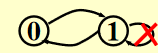
		</div>

	+ 不考虑**多重图(multigraph)**（两个节点间有多条边）的情况

		<div style="text-align: center; margin-top: 15px;">
		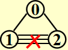
		</div>

+ **完全图(complete graph)**：图上任意两点间都有一条边

	+ 无向图：$V = n \quad E = C^2_n = \frac{n(n - 1)}{2}$

		<div style="text-align: center; margin-top: 15px;">
		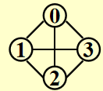
		</div>

	+ 有向图：$V = n \quad E = P^2_n = n(n - 1)$

		<div style="text-align: center; margin-top: 15px;">
		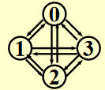
		</div>	
		
+ **邻接(adjacent)**

	+ 无向图：如果$(v_i, v_j)$存在，则称$v_i, v_j$是*邻接的*

		<div style="text-align: center; margin-top: 15px;">
		
		</div>	

	+ 有向图：如果$<v_i, v_j>$存在，则称$v_i$ to $v_j$是*邻接的*，或者说$v_j$ from $v_i$是*邻接的*

		<div style="text-align: center; margin-top: 15px;">
		
		</div>

+ **子图(subgraph)** $G' \subset G$，$V(G') \subseteq V(G)$ 且 $E(G') \subseteq E(G)$
+ 从$v_p$到$v_q$的**路径(path)**($\subset G$)：$\{v_p, v_{i1}, v_{i2}, \dots, v_{in}, v_q\}$，满足 $(v_p, v_{i1}), (v_{i1}, v_{i2}), \dots, (v_{in}, v_q)$ 或者 $<v_p, v_{i1}>, <v_{i1}, v_{i2}>, \dots, <v_{in}, v_q> \subset E(G)$
+ 路径的**长度(length)**：路径上边的条数
+ **简单路径(simple path)**：对于上述路径，$v_{i1}, v_{i2}, \dots, v_{in}$ 是不同的(不会多次经过同一顶点)
+ **环(cycle)**：对于一条简单路径，起点与终点相同，即 $v_p = v_q$
+ **连通(connected)**
	+ 无向图：
		+ 对于两个顶点 $v_i, v_j$ 而言，如果它们之间存在一条路径，则称它们是*连通的*
		+ 对于整张无向图 $G$ 而言，如果图内任意两点之间相互连通，则称整张图是*连通的*
		>对于 $n$ 个顶点的无向图，最少需要 $n - 1$ 条边来实现整张图的连通
		+ 无向图 $G$ 的**（连通）分量(component)**：极大连通子图（一张图中可能有多个连通分量）
		+ **树**是连通且无环(acyclic)的图

	+ 有向图：
		+ **有向无环图(directed acyclic graph, DAG)**
		+ **强连通(strongly connected)**有向图 $G$：对于 $V(G)$ 中的每对顶点 $v_i, v_j$，存在从 $v_i$ 到 $v_j$ **以及**从 $v_j$ 到 $v_i$ 的有向路径
		+ **弱连通(weakly connected)**有向图：在不考虑方向的情况下（即无向图），整张图是连通的（即对于 $V(G)$ 中的每对顶点 $v_i, v_j$，存在从 $v_i$ 到 $v_j$** 或 **从 $v_j$ 到 $v_i$ 的有向路径）
		>对于 $n$ 个顶点的*弱连通有向图*，最少需要 $n - 1$ 条边来实现整张图的连通

		+ **强连通分量(strongly connected component)**：极大强连通子图
		+ **弱连通分量(weakly connected component)**：极大弱连通子图

+ **度(degree)**：$\mathrm{degree}(v)$，与顶点v相连的边数

	对于一个有向图 $G$ 而言，度分为**入度(in-degree)**和**出度(out-degree)**，例如：

	<div style="text-align: center; margin-top: 15px;">
	
	</div>

	假如 $G$ 有 $v$ 个顶点和 $e$ 条边，那么 $e = \dfrac{\sum\limits_{i = 0}^{n - 1}d_i}{2}$，其中 $d_i = \text{degree}(v_i)$（[握手定理](../../math/dm/10.md#basic-terminology)）
	
	对于有向图而言，所有顶点入度之和 = 所有顶点出度之和

### Representation of Graph

法一：**邻接矩阵(adjacency matrix)**

对于一张具有 $n(n \ge 1)$ 个节点的图 $G(V, E)$，定义邻接矩阵 $adj\_mat [i] [j]$为

$$
adj\_mat[i][j] = \begin{cases}1 & \text{if } (v_i, v_j) \text{ or } <v_i, v_j> \in E(G) \\ 0 & \text{otherwise}\end{cases}
$$

所以也就有：

$$
\text{degree}(i) = \begin{cases}\sum\limits_{j = 0}^{n - 1} adj\_mat[i][j] & \text{if G is undirected} \\ \sum\limits_{j = 0}^{n - 1} adj\_mat[i][j] + \sum\limits_{j = 0}^{n - 1}adj\_mat[j][i] & \text{if G is directed} \end{cases}
$$

不难看出，如果$G$是无向的，则该邻接矩阵是对称的，因此浪费了一半的空间和时间（复杂度：$\Theta(|V|^2)$），但是用在**稠密(dense)图**（$|E| = \Theta(|V|^2)$）中是比较合适的。

改进措施：通过将**下三角矩阵**存入一维数组中，节省了一半的空间

$adj\_mat[n(n+1)/2] = \{a_{11}, a_{21}, \dots, a_{n1}, \dots, a_{nn}\}$，其中 $a_{ij}$ 的索引为 $\dfrac{i(i-1)}{2} + j$

---
法二：**邻接表(adjacency lists)**

???+ example "例子"

	如何存储这张图？

	<div style="text-align: center; margin-top: 15px;">
	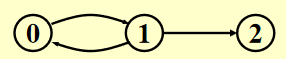
	</div>

	=== "邻接矩阵"

		$$adj\_mat = \begin{bmatrix}0 & 1 & 0 \\ 1 & 0 & 1 \\ 0 & 0 & 0\end{bmatrix}$$

	=== "邻接表"

		<div style="text-align: center; margin-top: 15px;">
		
		</div>

		>注：节点的顺序并不重要

对于无向图 $G$，邻接表的空间 $S = n$ 个头 + $2e$个节点 = $(n + 2e)$个指针 + $2e$个整型

时间复杂度 $T = E(G) = O(|V| + |E|)$，适用于**稀疏(sparse)图**($|E| < \Theta(|V|^2)$)中

>注：事实上，邻接表可以胜任各种图的存储

!!! note "如何计算某个顶点的度"

	=== "无向图"

		Degree(i) = graph[i]中节点的个数

	=== "有向图"

		我们需要找到in-degree(i)

		+ 法 1：“逆转”邻接链表

			<div style="text-align: center; margin-top: 15px;">
			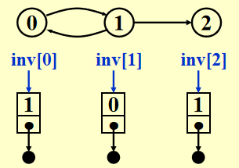
			</div>

		+ 法 2：用[**多链表(multilist)**](3.md#multilists)表示邻接矩阵$adj\_mat[i][j]$

			<div style="text-align: center; margin-top: 15px;">
			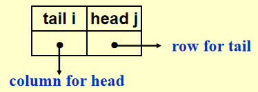
			</div>

		众所周知，多链表实现相当复杂，因此更推荐法 1

	???+ info "补充"

		有时顶点的值不一定是整数，也有可能是字符串，这时需要维护一张从字符串映射到整数索引的表格，在图中用索引代替字符串

---
法三：邻接多重表(adjacency multilist)
>注：这个不作要求，了解即可

在之前的邻接表里，对于每条边 $(v_i, v_j)$，我们会有两个节点：

<div style="text-align: center; margin-top: 15px;">
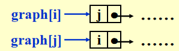
</div>

通过改进，将这两个节点结合到一起：

<div style="text-align: center; margin-top: 15px;">
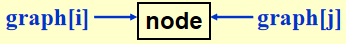
</div>

于是就有如下表示方法（mark 表示某一条边）：

<div style="text-align: center; margin-top: 15px;">

</div>

最终效果：

<div style="text-align: center; margin-top: 15px;">
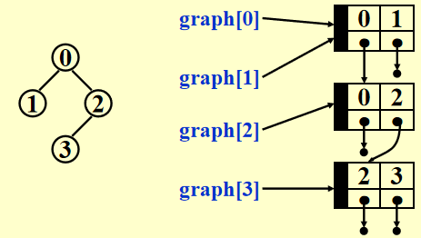
</div>

观察发现，在没有考虑 mark 存储的情况下，这种表示法的占用空间与邻接表完全一样。虽然它的空间复杂度略微高了点，但是在某些情况下（比如检验某条边后还要检验下一条边）比较有利。

---
有时，我们会遇到**带权边(weighted edges)**的情况，处理方式如下：

+ 邻接矩阵：$adj\_mat[i][j] = \text{weight}$
+ 邻接表/邻接多重表：为每个节点添加权重的字段

## Topological Sort

**AOV网(activity on vertex network)**：对于有向图 $G$，$V(G)$ 表示活动，$E(G)$ 表示位次关系

:chestnut:（C1 是 C3 的前置活动）

<div style="text-align: center; margin-top: 15px;">
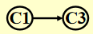
</div>

+ 如果从 $i$ 到 $j$ 有一条路径，则称 $i$ 是 $j$ 的**前任(predecessor)**
+ 如果 $<i, j> \in E(G)$，则称 $i$ 是 $j$ 的**直接前任(immediate predecessor)**。称 $j$ 是 $i$ 的 **（直接）后任((immediate) successor)**

可行的AOV网必须是一个**有向无环图(DAG)**

>补充阅读：[AOE网](https://oi-wiki.org/graph/topo/)

**偏序(partial order)**是一种具有以下性质的关系

+ **反自反性(irreflexive)**（不存在 $i \rightarrow i$）
+ **反对称性(anti-symmetric)**（$(i \rightarrow j) \wedge (j \rightarrow i) \Rightarrow i = j$）
+ **传递性**（$i \rightarrow j, j \rightarrow k \Rightarrow i \rightarrow k$）

!!! info "说明"

	+ 这里的偏序指的是**严格偏序**，因此和离散数学定义的[偏序](../../math/dm/9.md#partial-orderings)略有区别
	+ 如果具有自反性，就会出现要做一件事 $i$ 之前要完成 $i$ 的怪圈，因此❌

---
**拓扑序(topological order)**是一张图的顶点的线性顺序，满足：对于任意两个顶点 $i, j$，如果 $i$ 是 $j$ 的前任，则在线性顺序中 $i$ 要出现在 $j$ 之前

注：

+ 拓扑序不一定是唯一的
+ 如果拓扑序中一个顶点出现在另一个顶点的前面，它们之间不一定存在路径
+ 可以用拓扑序检验有向图是否存在环

??? code "代码实现"

	``` c
	// version 1
	void Topsort(Graph G)
	{
		int Counter;
		Vertex V, W;
		for (Counter = 0; Counter < NumVertex; Counter++)
		{
			V = FindNewVertexOfDegreeZero(); // O(|V|)
			if (V == NotAVertex)
			{
				Error("Graph has a cycle");
				break;
			}
			TopNum[V] = Counter; // or output V
			for (each W adjacent from V)
				indegreep[W]--;
		}
	}
	```

+ `FindNewVertexOfDegreeZero()`：扫描 `Indegree[]` 数组，找到入度为 0 且未赋予拓扑序的顶点，如果没有找到顶点，那么表明图中出现了环
+ 每处理完一个顶点 V 后，就需要让从 V 出发与 V 邻接的顶点的入度 -1，相当于在图上移除了顶点 V 以及它的所有出边
+ 时间复杂度：$T = O(|V|^2)$ 👎

---
改进方法：将所有**未赋予拓扑序的、度为 0 的顶点**放入特殊的盒子（比如**队列**或**栈*）里

??? play "动画演示"

	<div style="text-align: center; margin-top: 15px;">
	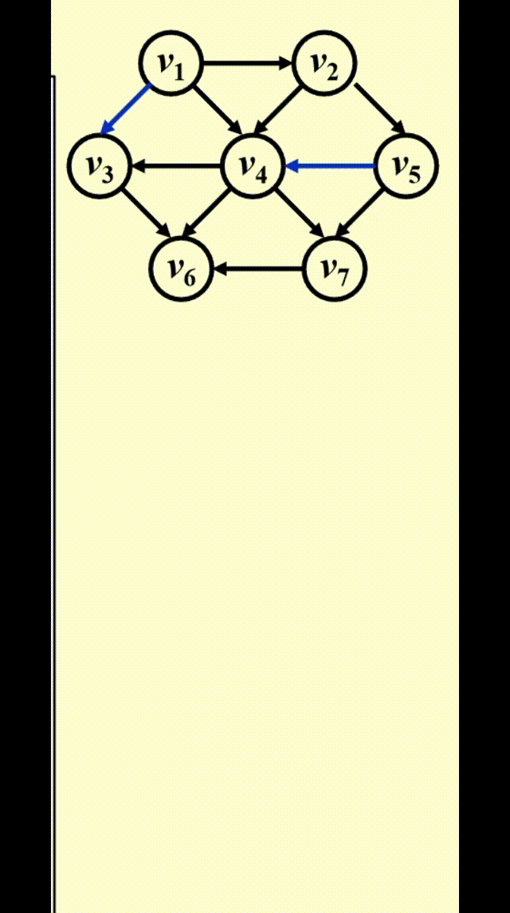
	</div>

??? code "代码实现"	

	``` c
	// version 2, using queue ADT
	void Topsort(Graph G)
	{
		Queue Q;
		int Counter = 0;
		Vertex V, W;
		
		Q = CreateQueue(NumVertex); 
		for (each vertex V)
			if (indegree[V] == 0) 
				Enqueue(V, Q);
		while (!isEmpty(Q))
		{
			V = Dequeue(Q);
			TopNum[V] = ++Counter;  // assign next
			for (each W adjacent from V)
				if (--indegree[W] == 0)
					Enqueue(W, Q);
		} // end-while
		if (Counter != NumVertex)
			Error("Graph has a cycle")
		DisposeQueue(Q); // free memery
	}
	```

时间复杂度：$O(|E| + |V|)$

??? example "例题"

	=== "问题"

		<div style="text-align: center; margin-top: 15px;">
		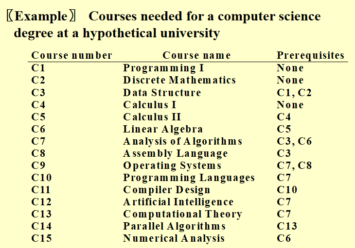
		</div>

	=== "答案"

		<div style="text-align: center; margin-top: 15px;">
		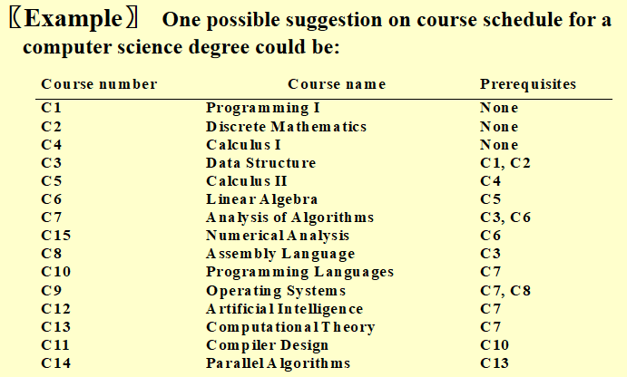
		</div>

## Shortest Path Algorithms

给定一张有向图 $G(V, E)$，以及成本函数 $c(e)$，$e \in E(G)$，从**源(source)**到**目的地(destination)**的路径 $P$ 的长度(length)为 $\sum\limits_{e_i \subset P}c(e_i)$（也被称为**带权路径长度(weighted path length)**）

### Single-Source Shortest-Path Problem

!!! question "问题"

	给定一张权重图 $G(V, E)$，以及一个可区分的顶点 $s$，寻找从 $s$ 到 $G$ 中所有其他顶点的最短权重路径

:chestnut:：

<div style="text-align: center; margin-top: 15px;">

</div>

+ 右图存在负的边，这样最短路的长度可以是无穷小。因此在这种情况下，最短路是未定义的，因为陷入了死循环。这种循环被称为**负值环(negative-cost cycle)**
+ 从 $s$ 到 $s$ 的最短路径被定义为 0
+ 现在，还没有一种最短路算法的速度快于找到从 $s$ 到所有顶点的路径的算法

#### Unweighted Shortest Paths

在这种情况下，所有边的权重 = 1

<div style="text-align: center; margin-top: 15px;">
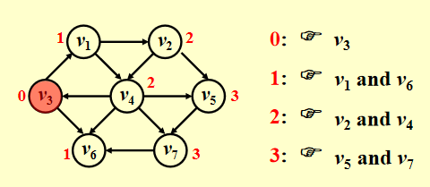
</div>

如图所示，为了找到从 $v_3$ 出发到其他顶点的所有最短路径：

+ 先找到与 $v_3$ 邻接的顶点，记从 $v_3$ 到这些顶点的最短路径为 1
+ 然后再从这些顶点出发，找到与它们邻接的顶点。如果新找到的顶点还没有相应的最短路径，那就记这些顶点的最短路径为 2
+ 重复步骤 2，直至所有顶点的最短路径都已找到

这种方法被称为**宽度优先搜索(breadth-first search, BFS)**：该方法一层层地处理顶点：最近的顶点最先处理，最远的顶点最后处理。这和树中的[层序遍历](4.md#tree-traversals)类似

宽度优先搜索的示意图：

<div style="text-align: center; margin-top: 15px;">
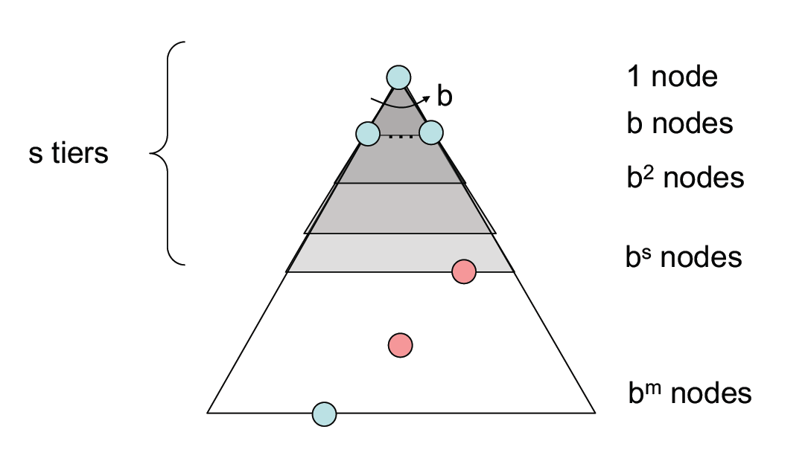
</div>

!!! note "实现"

	+ `Table[i].Dist` ::= 从$s$到$v_i$的距离 $= \begin{cases}\infty & \text{if } v_i \ne s \\ 0 & \text{if } v_i = s\end{cases}$

	+ `Table[i].Known` ::= $\begin{cases}1 \quad \text{if } v_i \text{ is checked} \\ 0 \quad \text{if not}\end{cases}$

	>+ 其实没有必要设这个字段(因为 `Table[i].Dist` 同时具备**标记**功能)，写在这里只是提醒一下要做一下标记
	>+ 在初始化中，所有顶点的 `Table[i].Known = 0`，包括起始顶点，因为没有任何顶点被处理过

	+ `Table[i].Path` ::= 记录路径上 $v_i$ 的前一个顶点，以便打印整条路径

??? code "代码实现"

	``` c
	// version 1
	void Unweighted(Table T)
	{
		int CurrDist;
		Vertex V, W;
		for(CurrDist = 0; CurrDist < NumVertex; CurrDist++)
		{
			for (each vertex V)
				if (!T[V].Known && T[V].Dist == CurrDist)
				{
					T[V].Known = true;
					for (each W adjacent to V)
						if (T[W].Dist == infinity)
						{
							T[W].Dist = CurrDist + 1;
							T[W].Path = V;  // (*)
						}// end-if Dist == Infinity
				} // end-if !Known &&Dist == CurrDist
		} // end-for CurrDist
	}
	```

这个算法显然没什么效率，因为外层循环要循环 `NumVertex - 1` 次才结束，即使所有的顶点早就处理过了。虽然可以增加一个额外的判断提前结束循环，但这并没有影响最坏情况的运行时间，比如：

<div style="text-align: center; margin-top: 15px;">
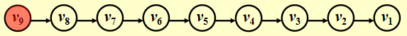
</div>

起始点为 $v_9$，第一次循环要找 `CurrDist == 0` 的顶点（即 $v_9$）。我们一般会按照节点下标的递增顺序查找，则要找到 $v_9$ 需要从头遍历到尾；而且不难看出，每次循环均会从头遍历到尾（越来越靠前）

时间复杂度 $T = O(|V|^2)$👎

---
可以发现，如果顶点 $V$ 未被标记，但 $d_v \ne \infty$，那么 $d_v = CurrDist$ 或 $d_v = CurrDist + 1$，因此没有必要像上面那个算法一样扫描整个表来找到合适的顶点。

??? info "改进思路"

	用两个箱子，一个箱子放未标记的 $d_v = CurrDist$ 的顶点，另一个箱子放未标记的且 $d_v = CurrDist + 1$ 的顶点。那么，原来扫描整张表的操作可以变成：从第 1 个箱子找任一顶点 $V$，等到 (\*) 那行代码执行完后，将 $W$ 放入第 2 个箱子。等到外层 `for` 循环一轮结束后，第 1 个箱子为空，将第 2 个箱子的顶点转移到第 1 个箱子，进行下一轮循环。

事实上，我们只需要一个**队列**就能完成上述改进思路：
>这里不用 `Known` 字段是因为 `Dequeue` 就代表顶点已经被处理过了，不会再回到队列里

??? code "代码实现"

	``` c
	// version 2
	void Unweighted(Table T)
	{
		// T is initialized with the source vertex S given
		Queue Q;
		Vertex V, W;
		Q = CreateQueue(NumVertex);
		MakeEmpty(Q);
		Enqueue(S, Q); // Enqueue the source vertex
		while (!IsEmpty(Q))
		{
			V = Dequeue(Q);
			T[V].Known = true;  // not really necessary
			for (each W adjacent to V)
				if (T[W].Dist == Infinity)
				{
					T[W].Dist = T[V].Dist + 1;
					T[W].Path = V;
					Enqueue(W, Q);
				} // end-if Dist == Infinity
		} // end-while
		DisposeQueue(Q); // free memory
	}
	```

>可以看到，这和拓扑排序的算法很像

???+ play "动画演示"

	<div style="text-align: center; margin-top: 15px;">
	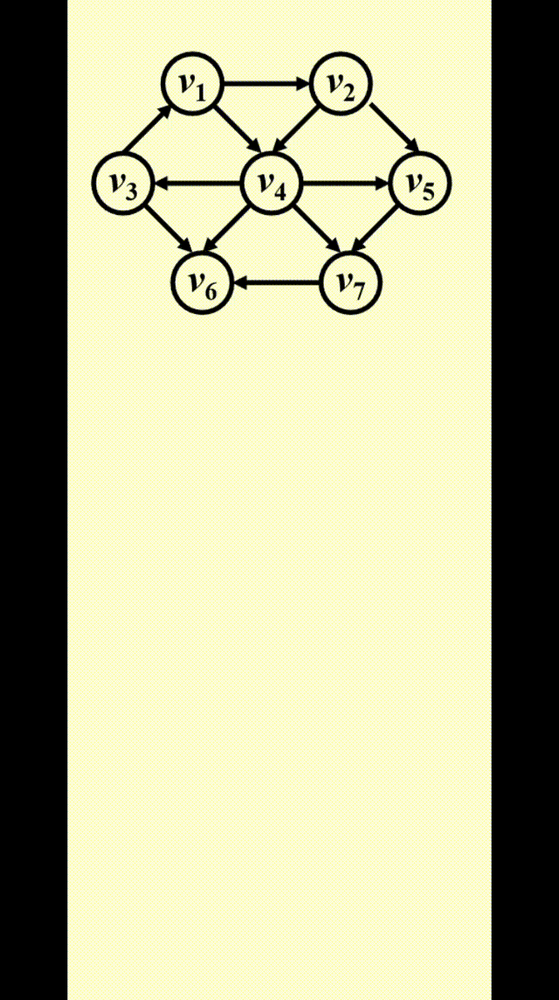
	</div>

#### Dijkstra's Algorithm(for weighted shortest paths)

!!! note "Dijkstra算法的思路"

	令 $S =$ {$s$ 和已找到最短路径的顶点 $v_i$ 的集合}。对于 $\forall u \notin S$，定义`distance[u]` = 路径 $\{s \rightarrow (v_i \in S) \rightarrow u\}$ 的最小长度

	+ Dijkstra 算法按阶段执行，在每个阶段中，挑选一个顶点$v$，保证它是所有**未被标记**的顶点中路径长度$d_v$**最短**的那个顶点（如果有多个最短路径长度，则任意挑选顶点）
	+ 对于从顶点 $v$ 出发的邻接顶点 $w$，$d_w = \min(d_w, d_v + c_{v, w})$
	+ 标记顶点 $v$，即令 $v \in S$
	+ 然后对于剩余未被标记的顶点，重复上述操作，直至所有顶点均被标记

	不难发现，这是一种**贪心算法**

??? code "预备工作"

	``` c
	// Declarations for Dijkstra's algorithm
	typedef int Vertex

	struct TableEntry
	{
		List Header; // Adjacency list
		int Known;
		DistType Dist;
		Vertex Path;
	};

	// Vertices are numbered from 0
	#define NotAVerTex (-1)
	typedef struct TableEntry Table[NumVertex];

	// Initialization
	void InitTable(Vertex Start, Graph G, Table T)
	{
		int i;

		ReadGraph(G, T);
		for (i = 0; i < NumVertex; i++)
		{
			T[i].Known = False;
			T[i].Dist = Infinity;
			T[i].Path = NotAVerTex;
		}
		T[Start].dist = 0;
	}

	// Print shortest path to V after Dijkstra has run
	// Assume that the path exists
	void PrintPath(Vertex V, Table T)
	{
		if(T[V].Path != NotAVertex)
		{
			PrintPath(T[V].Path, T);
			printf(" to");
		}
		printf("%v", V) // %v is pseudocode
	}
	```

??? code "代码实现"

	``` c
	void Dijkstra(Table T)
	{
		Vertex V, W;
		for(;;)  // O(|V|)
		{
			V = smallest unknown distance vertex;
			if (V == NotAVertex)
				break;
			T[V].Known = true;
			for (each W adjacent to V)
				if (!T[W].Known)
					if(T[V].Dist + Cvw < T[W].Dist) // 这步操作被称为“松弛”
					{
						Decrease(T[W].Dist to T[V].Dist + Cvw); 
						T[W].Path = V;
					} // end-if update W
		} // end-for(;;)
	} // now work for edge with negative cost
	```

???+ play "动画演示"

	<div style="text-align: center; margin-top: 15px;">
	
	</div>

Dijkstra 算法的运行时间取决于我们<u>如何寻找距离最短且未被标记的顶点</u>

!!! note "方法"

	=== "方法1"

		+ 仅仅简单扫描一遍整张表来找到 $d_v$ 最小的顶点 $v \rightarrow O(|V|)$；而且外层循环遍历所有顶点，因此时间复杂度为 $O(|V|^2)$
		+ 每条边最多会更新一次，时间复杂度为 $O(|E|)$，而且与顶点的遍历是*独立*的
		+ 因此 $T = O(|V|^2 + |E|)$，适用于*稠密图*（此时复杂度相当于线性复杂度）

	=== "方法2"

		将距离保存在**堆**里，调用 `DeleteMin` 来找到未标记的最小顶点，并且之后不去管它。
		
		那么如何实现算法中的 `Decrease(T[W].Dist to T[V].Dist + Cvw);` 呢？
		
		=== "法1"
		
			`DecreaseKey()` $\rightarrow O(\log |V|)$，因此$T = O(|V|\log |V| + |E| \log |V|) = O(|E|\log |V|)$，适用于*稀疏图*
			
			但是，因为堆不能有效支持 `Find` 操作，当 $d_i$ 的值发生改变时，它的位置需要维护和更新，用二叉堆实现起来有些麻烦。
			
			>如果用到[**配对堆(pairing heap)**](https://oi-wiki.org/ds/pairing-heap/)，情况就会改善，这种改进不做要求


		=== "法2"
		
			将更新后的 $d_w$ 插入堆中，这样的话堆内就会出现多个表示同一顶点的距离。因此在 `V = smallest unknown distance vertex;` 这一句中，要重复使用 `DeleteMin`，直到未标记的点出现（标记过的点就扔掉不用）。虽然这种方法会扩大堆的规模（$O(|E|)$），但是因为 $|E| \le |V|^2$。所以 $\log |E| \le 2\log |V|$，因此 $T = O(|E| \log |V|)$。但它占用空间大于法 1 需要 $|E|$ 次 `DeleteMin` 操作，因此在实际运行中可能会变慢。

			>其他改进方法：[斐波那契堆(Fibonacci heap)](https://zh.wikipedia.org/wiki/%E6%96%90%E6%B3%A2%E9%82%A3%E5%A5%91%E5%A0%86)

??? code "具体实现"

	``` c
	void Dijkstra(VType s, Table T, int n)   // Finding all the shortest paths  
	{
		VType V, W;           // V: the current vertex; W: the vertex adjacent to V
		Heap H;               // A heap maintaining the shortest unknown vertex
		Vertex cur, tmp;      // cur: obtaining the information of all adjacent vertice regarding V; tmp: containing new previous vertex adjacent to W
		int len, cnt = n;     // len: the distance of T[V].dist + the distance between V and W; cnt: used to terminate the loop

		H = InitHeap(n, s);   // Initialization of the heap

		while (cnt > 0)
		{
			V = DeleteMin(H); // Obtaining the shortest unknown vertex
			T[V].Known = 1;   // Marking it
			cnt--;
			cur = G[V];       // Getting all adjacent successors
			while (cur != NULL)  // Traversing all successors
			{
				W = cur->vertex;  // The current successor
				if (!T[W].Known)  // If W isn't marked, then try to update it
				{
					len = T[V].Dist + cur->length;   // New distance
					if (len < T[W].Dist)  // If the new distance is shorter than the previous one, then update it
					{
						T[W].Dist = len;
						if (pos[W] == 0)  // If W hasn't been in the heap, then insert it into the heap
							Insert(W, len, H);
						else  // If W is in the heap, then update the distance of W and update the whole heap
							DecreaseKey(pos[W], len, H);

						T[W].Path = NULL;    // Clearing out all previous vertice, because we find the new optimal one
						tmp = (Vertex)malloc(sizeof(struct node));    // Insert the new one into the T[W].Path
						tmp->vertex = V;
						tmp->next = T[W].Path;
						T[W].Path = tmp;
					}
					else if (len == T[W].Dist)  // If the new distance is equal to the old one, then just involve the new solution
					{        
						tmp = (Vertex)malloc(sizeof(struct node));    // The same operations 
						tmp->vertex = V;
						tmp->next = T[W].Path;
						T[W].Path = tmp;    
					}
				}
				cur = cur->next;     // Finding the next one
			}
		}
	}
	```

#### Graphs with Negative Edge Costs

如果出现负的边成本，那么我们就不能在使用`Known`字段标记是否已经处理过某个顶点，因为有可能在第一次处理该顶点之后，又发现更小的路径长度（因为负的边），需要重复处理某个顶点

???+ info "一种尝试❌"

	给所有边<u>加上一个相同的正常数</u>，使得所有边的成本为正数

	分析：这样做的话，原本包含边数较多的路径，它的成本增长就明显多于边数较少的路径，这就有可能改变最短路径的取法。

	>然而，若所有边的权重都<u>乘上一个相同的正常数</u>，这不影响最短路的结果

我们用“无权重最短路算法 + Dijkstra算法”来解决这一问题：

??? code "代码实现"

	``` c
	void WeightedNegative(Table T)
	{
		Queue Q;
		Vertex V, W;
		Q = CreateQueue(NumVertex);
		MakeEmpty(Q);
		Enqueue(S, Q); // Enqueue the source vertex
		while (!IsEmpty(Q)) // each vertex can dequeue at most |V| times
		{
			V = Dequeue(Q);
			for (each W adjacent to V)
				if (T[V].Dist + Cvw < T[W].Dist) // no longer once per edge
				{
					T[W].Dist = T[V].Dist + Cvw;
					T[W].Path = V;
					if (W is not already in Q)
						Enqueue(W, Q);
				} // end-if update
		} // end-while
		DisposeQueue(Q); // free memory
	} // negative-cost cycle will cause indefinite loop
	```

+ 时间复杂度：$O(|E| \cdot |V|)$
+ 如果出现[**负值环**](#single-source-shortest-path-problem)，该算法将会陷入无限循环。因此，记录每个顶点的出队次数，发现有顶点出队次数多于 $|V|$ 次时，就终止程序，这样可以避免这一问题

#### Acyclic Graphs

如果图是*无环(acyclic)*，我们可以按照拓扑序选择顶点，因为当选择某个顶点后，它的距离不可能因为它前面顶点的入边而减少，这样只需执行一趟算法即可。

时间复杂度$T = O(|E| + |V|)$，不需要优先队列

---
应用：**关键路径分析(critical path analysis)**

+ AOV网：每个顶点表示一个活动，且包括需要完成该活动的时间。边(v, w) 表示 w 完成之前，v必须完成

<div style="text-align: center; margin-top: 15px;">

</div>

+ **AOE网(activity on edges networks)**

	<div style="text-align: center; margin-top: 15px;">
	
	</div>

	表示方法：

	<div style="text-align: center; margin-top: 15px;">
	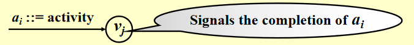
	</div>

	>注：必要时需要添加dummy edges和dummy nodes，避免错误或缺少的依赖关系产生

<div style="text-align: center; margin-top: 15px;">

</div>

+ $EC[j]$：节点$v_j$ **最早**的完成时间
+ $LC[j]$：节点$v_j$ **最晚**的完成时间

🌰

<div style="text-align: center; margin-top: 15px;">
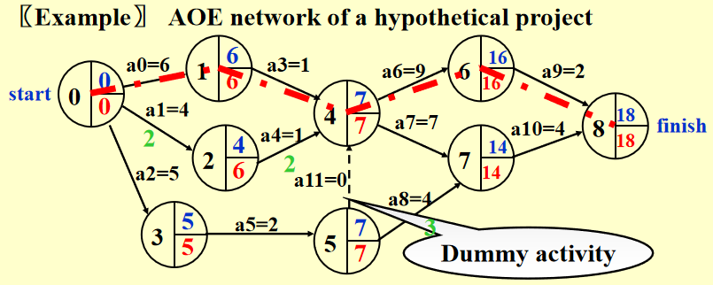
</div>

>注：蓝字表示EC，红字表示LC，绿字表示*空闲时间*（后面会讲到）

+ 计算EC：找到第一个事件到最后一个事件之间*最长*的路

	>注： 图如果是有环的，因为**正成本环(positive-cost cycles)**的存在，这种算法无法实现。然而这里已经规定是无环图，所以无需担心

	从起点 $v_0$ 开始，对于任意的 $a_i = <v, w>$，我们有

	$$
	EC[0] = 0 \quad EC[w] = \max\limits_{(v,w) \in E} \{EC[v] + C_{v, w}\}
	$$

	>按**拓扑序**计算

+ 计算 LC：从终点 $v_8$ 开始，对于任意的 $a_i = <v, w>$，我们有

	$$
	LC[8] = EC[8] \quad LC[v] = \min\limits_{(v,w) \in E} \{LC[v] - C_{v, w}\}
	$$

	>按**逆向拓扑序**计算

+ $<v, w>$ 的**空闲时间(slack time)** = $LC[w] - EC[v] - C_{v, w}$
+ **关键活动(critical activity)**：空闲时间为0的活动
+ **关键路径(critical path)**：所有边的空闲时间均为0的路径

### All-pairs Shortest Path Problem

对图中任意一对顶点 $v_i, v_j(i \ne j)$，要求它们的最短路径，有以下方法：

+ 使用 $|V|$ 次**单源算法**（比如 Dijkstra），时间复杂度 $T = O(|V|^3)$，在*稀疏图*中运行较快
+ 用 Chap 10 给出的算法，时间复杂度 $T = O(|V|^3)$，在*稠密图*中运行较快，这里就略过了<span class="heimu">我也不知道是什么算法(doge)</span>

## Network Flow Problems

考虑下面的管道网络：

<div style="text-align: center; margin-top: 15px;">
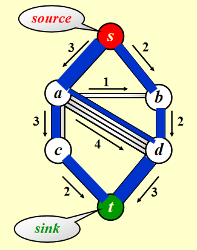
</div>

+ 这是一个有向图 $G(V, E)$，每条边的**容量(capacity)**为 $c_{v, w}$，经过该边的**流量(flow)**不得超过它的容量
+ 我们称起点 s 为**源点(source)**，终点 t 为**汇点(sink)**
+ 对于所有顶点 $v \notin \{s, t\}$，总流入 = 总流出，即 $\text{Total coming in}(v) \equiv \text{Total going out}(v)$，也就是说顶点**不具备存储的能力**

🎯：确定从 s 到 t 的**最大流(maximum-flow)**

### Simple Algorithm

<div style="text-align: center; margin-top: 15px;">
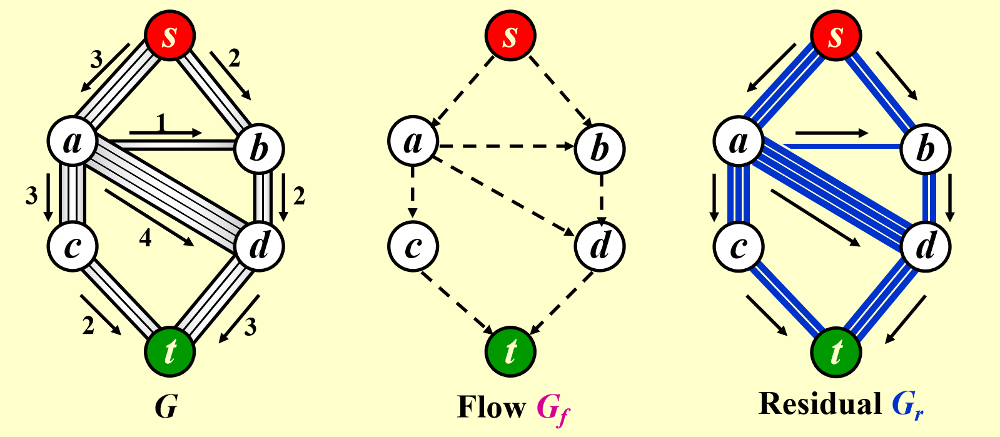
</div>

注：使用这个算法时，我们需要3张图：

+ 原图 $G$
+ **流量(flow)图** $G_f$：表示算法运行的每个阶段中已经得到的流量，初始情况下每条边的流量均为 0
+ **残量(residual)图** $G_r$：表示对于图中的每条边，还剩下多少流量可以被添加

!!! note "步骤"

	1.  在**残量图(residual graph)** $G_r$ 中找一条 $s \rightarrow t$ 的简单路径，该路径被称为**增广路径(augmenting path)**
	2. 增广路径的流量为路径上的所有边中最小的流量，用该流量更新**流量图(flow graph)** $G_f$
	3. 更新 $G_r$，并移除流量为0的边
	4. 如果 $G_r$中还存在 $s \rightarrow t$ 的路径，回到步骤 1，否则终止程序

???+ play "动画演示"

	<div style="text-align: center; margin-top: 15px;">
	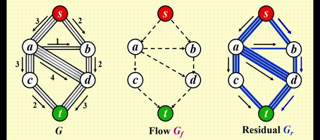
	</div>

!!! warning "问题"

	如果我们采用**贪心**的策略，对于上图，我们会先选择$s \rightarrow a \rightarrow d \rightarrow t$，这样得到的流量为 3，如下图所示。然而，这样做的话我们就无法再找到第 2 条路径，因此总流量为3，不满足要求。因此我们需要改进上述算法。

	<div style="text-align: center; margin-top: 15px;">
	
	</div>

### Solution

!!! info "改进"

	让算法具备**撤销(undo)**决策的能力：对于流量图 $G_f$ 中的每条边 (v, w)，它的流量为 $f_{v, w}$，在**残量图**中添加一条反向的边 (w, v)，它的流量也为 $f_{v, w}$

令 $f$ 表示图 $G = (V, E)$ 的流量，则残差图的边的权重为：

$$
r(u, v) = \begin{cases}r(u, v) - f(u, v) & \text{if }(u, v) \in E \\ f(v, u) & \text{if }(v, u) \in E \\ 0 & \text{otherwise}\end{cases}
$$

???+ play "动画演示"

	<div style="text-align: center; margin-top: 15px;">
	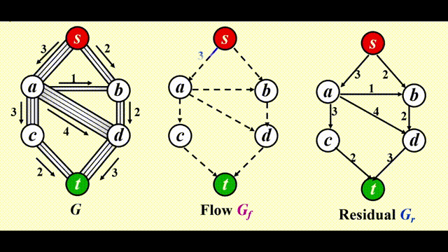
	</div>

最终效果：

<div style="text-align: center; margin-top: 15px;">
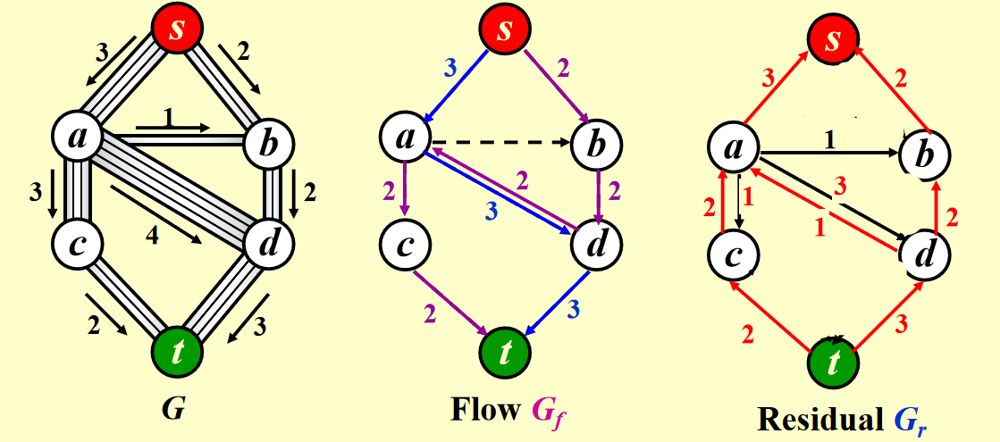
</div>

>注：如果边的容量是*有理数*，那么该算法在终止时总能得到一个最大流（图有**环**的话也可以）

### Analysis

>前提：所有边的容量为整数

我们可以利用[**无权最短路径算法**](#unweighted-shortest-paths)来找到**增广路径**
>时间复杂度 $T = O(f \cdot |E|)$，$f$表示最大流量

但对于以下特殊情况：

<div style="text-align: center; margin-top: 15px;">
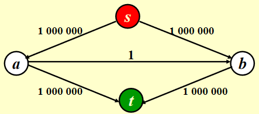
</div>

如果我们随机挑选增广路径，挑到一条包括 $a \rightarrow b$ 的路径，就会产生问题：

>Random augmentations could continually augment along a path that includes the edge connected by a and b. If this were to occur repeatedly, 2,000,000 augmentations would be required, when we could get by with only 2.

!!! note "解决方法"

	=== "法1"

		在选择增广路径时，总是挑选**对流量提升最大**的路径
		
		如何实现：稍微改变一下 Dijkstra 算法

		时间复杂度：
		
		$$
		\begin{align}
		T = & T_{augmentation} \cdot T_{find\ a\ path} \notag \\
		= & O(|E| \log cap_{max}) \cdot O(|E|\log |V|) \notag \\ 
		= & O(|E|^2 \log |V|) (\text{if } cap_{max} \text{ is a small integer}) \notag
		\end{align}
		$$

	=== "法2"

		在选择增广路径时，挑选**边最少**的增广路径
		
		时间复杂度：
		
		$$
		\begin{align}
		T = & T_{augmentation} \cdot T_{find\ a\ path} \notag \\ 
		= & O(|E|) \cdot O(|E| \cdot |V|)\quad (\text{unweighted shortest path algorithm}) \notag \\
		= & O(|E|^2 |V|) \notag
		\end{align}
		$$

### Supplements

+ 更优的算法，时间复杂度可以将至 $O(|E||V|\log(|V|^2/|E|))$和$O(|E||V| + |V|^{2 + \epsilon})$
+ 对于某些特殊情况，时间复杂度还可以降低：如果除了源点和汇点外的所有顶点的入边容量为1，或者出边容量为 1，那么最优算法的时间复杂度为 $O(|E||V|^{\frac{1}{2}})$
+ 更复杂的问题：*最小费用流问题(min-cost flow problem)*——每条边不仅有容量，还要考虑单位流量的费用。🎯：要找到所有最大流量中的最小成本

## Minimum Spanning Tree

定义：图 $G$ 的**生成树(spanning tree)**是一棵包含所有顶点 $V(G)$（但不一定包含所有边）的树

🌰：

<div style="text-align: center; margin-top: 15px;">

</div>


如何理解**最小生成树(minimum spanning tree)**？

+ “树”：无环且边的数量为 |V| - 1
>因此当图的边数 < |V| - 1时，该图不存在最小生成树

+ “最小”：保证生成树的所有边的权重和最小
+ “生成”：覆盖所有的顶点
+ 最小生成树存在的**充要条件**是图$G$是**连通的**
+ 如果在生成树中添加一条边，就会形成一个*环*
+ 最小生成树是并不一定是唯一的，但最小生成树的**总权重是唯一的**

如何求解？——**贪心算法(greedy algorithm)**，每一步都采取最优策略，但有以下限制：

+ 必须使用图里面的边
+ 必须用到 $|V| - 1$ 条边
+ 不能出现环

### Prim's Algorithm

方法：生成一棵树，与 Dijkstra 算法非常相似，适用于**稠密图**中

+ 初始情况下，先将一个顶点作为树的**根**放入树内
+ 在每个阶段，添加边(u, v)，满足 (u, v) 的权重是来自已有生成树的顶点 u 和来自生成树外的 v 之间的所有边中权重最小的那条，且不产生环，然后将新的顶点 v添加至树里
+ 重复上述步骤，直至所有顶点均在生成树内

???+ play "动画演示"

	<div style="text-align: center; margin-top: 15px;">
	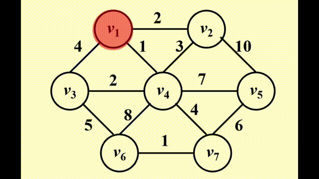
	</div>

与Dijkstra不同之处在于：

+ 要保存两类值 $d_v$ 和 $p_v$：
	+ $d_v$：连接 $v$ 和已知顶点的最短路的权重
	+ $p_v$：最后一个导致 $d_v$ 改变的顶点

+ 更新规则更加简单：对于已经选入树内的顶点 $v$，它的邻接顶点 $w$ 满足 $d_w = \min(d_w, c_{w, v})$

>注：由于这是无向图，因此需要用到<u>两张邻接表</u>存储图

时间复杂度：

+ 不用堆（适用于*稠密图*）：$O(|V|^2)$
+ *二叉堆*（适用于*稀疏图*）：$O(E\log|V|)$

??? code "代码实现"

	``` c
	/*
	* Function: prim
	* --------------
	*   Find a minimum spanning tree for the given undirected
	*   graph by using Prim's algorithm
	*
	*   w_adj_mat: the weighted adjacency matrix
	*   n: the number of vertices
	* 
	*   returns: the total edge weights of the MST
	*/
	int prim(int w_adj_mat[MAX][MAX], int n)
	{
	int dist[MAX]; // distance from vertex i to the known part
	int prev[MAX]; // for tracing the edges of MST
	int known[MAX]; // 1 if the vertex i is checked, 0 if not

	// initialization
	for (int i = 0; i < n; i++)
	{
		dist[i] = INFINITY;
		prev[i] = -1;
		known[i] = 0;
	}

	dist[0] = 0; // start from vertex 0
	for (int k = 0; k < n; ++k)
	{
		// choose the vertex closest to the known part
		int min_d = INFINITY;
		int min_v = -1;
		for (int i = 0; i < n; i++)
		{
		if (!known[i] && dist[i] < min_d)
		{
			min_d = dist[i];
			min_v = i;
		}
		}

		// relaxation of vertices adjacent to the chosen one
		known[min_v] = 1;
		for (int i = 0; i < n; i++)
		{
		if (!known[i])
		{
			if (w_adj_mat[min_v][i] && dist[i] > w_adj_mat[min_v][i])
			{
			dist[i] = w_adj_mat[min_v][i];
			prev[i] = min_v;
			}
		}
		}
	}

	// total edge weights
	int total_w = 0;
	for (int i = 1; i < n; ++i)
		total_w += dist[i];
	return total_w;
	}
	```

### Kruskal's Algorithm

方法：维持一片森林（一组树），适用于**稀疏图**中

+ 初始情况下，有 $|V|$ 棵单个节点构成的树
+ 添加一条边，可以合并两棵树。当算法结束时，应当只剩下一棵树。因此，我们很自然地想到使用**并查集**的算法
+ 挑选边（这里假设挑选边 $(u, v)$ ）时要注意的细节：

	+ 如果 u, v 在同一个集合内，则不能添加这条边（否则会出现环）
	+ 否则加入这条边，使用 `Union` 算法将两个集合合并起来
+ 用**堆**维护未被检验过的最小的边，每当检验一条边时，使用 `DeleteMin` 算法

图示：

<div style="text-align: center; margin-top: 15px;">
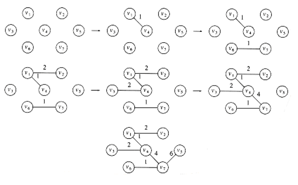
</div>

伪代码实现：

``` c
void Kruskal(Graph G)
{
	T = { };
	while (T contains less than [V] - 1 edges && E is not empty)
	{
		choose a least cost edge(v, w) from E; // DeleteMin
		delete(v, w) from E;
		if ((v, w) does not create a cycle in T)
			add(v, w) to T; // Union/Find
		else
			discard(v, w);
	}
	if (T contains fewer than [V] - 1 edges)
		Error("No spanning tree");
}
```

??? code "正式代码实现"

	``` c
	void Kruskal(Graph G)
	{
		int EdgesAccepted;
		DisjSet S;
		PriorityQueue H;
		Vertex U, V;
		SetType Uset, Vset;
		Edge E;

		Initialize(S);
		ReadGraphIntoHeapArray(G, H);
		BuildHeap(H);

		EdgeAccepted = 0;
		while (EdgesAccepted < NumVertex - 1)
		{
			E = DeleteMin(H);  // E = (U, V)
			Uset = Find(U, S);
			Vset = Find(V, S);
			if (Uset != Vset)
			{
				// Accept the edge
				EdgesAccepted++;
				SetUnion(S, Uset, Vset);
			}
		}
	}
	```

由于每条边要存 3 个字段，因此用*指针数组*存储边可能更加高效。

时间复杂度：$T = O(|E|\log |E|) = O(|E| \log |V|) \quad (|E| = O(|V|^2))$

## Applications of Depth-First Search

**深度优先搜索(depth-first search, DFS)**是一种<u>前序遍历</u>的泛化

+ 树：时间复杂度 $T = O(|E|)\ (|E| = \Theta(|V|))$
+ 图：注意要避免环(cycles)，所以访问过的顶点就要对其**标记**，然后接着访问未访问过的顶点。
+ 如果无向图不连通，或者有向图不是强连通的，那么用一次 DFS 无法访问所有顶点，需要对未标记的顶点再用一次 DFS，直至所有顶点都被标记。因此，时间复杂度为 $O(|E| + |V|)$

示意图：

<div style="text-align: center; margin-top: 15px;">
	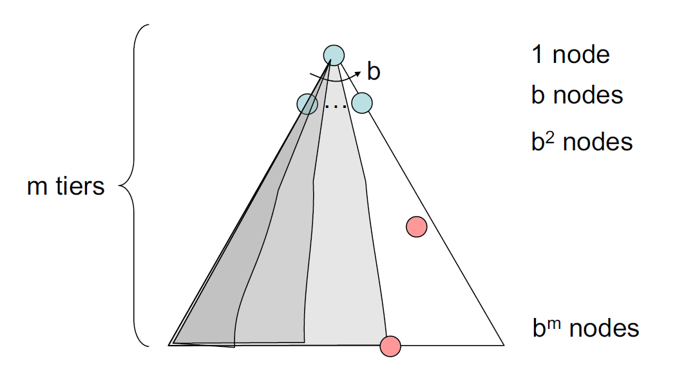
</div>

!!! code "代码模板（**递归**版）"

	``` c
	void DFS(Vertex V)
	{
		visited[V] = true; // mark this vertex to void cycles
		for (each W adjacent to V)
			if (!visited[W])
				DFS(W);
	}
	```

!!! info "注"

	DFS也可以用**迭代**方法实现，具体来说我们可以用一个**栈**来存放正在探索的路径上的顶点，当要探索另一条路径时，就把不在该路径上的节点从栈内弹出，然后放入在该路径上的节点。


### Undirected Graphs

当且仅当 1 次 DFS 能够遍历所有顶点时，无向图是连通的

<div style="text-align: center; margin-top: 15px;">
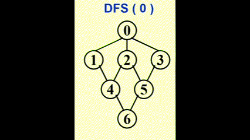
</div>

我们可以使用**深度优先生成树(depth-first spanning tree)**来形象展示 DFS 的过程。当我们发现某条边(v, w) 中的 w 已被标记过，用虚线画出这条边，称作“**回边(back edge)**”，表示这条边不包含于生成树里，如图所示：

<div style="text-align: center; margin-top: 15px;">
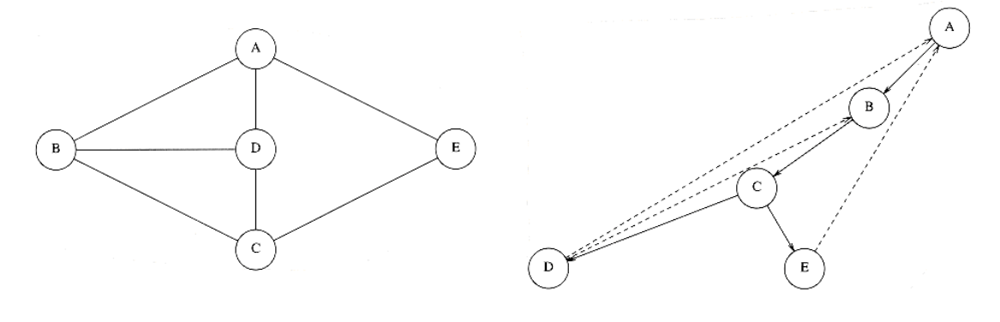
</div>

如果无向图不连通，则可以生成*深度优先生成森林(depth-first spanning forest)*

代码实现：
``` c
void ListComponents(Graph G)
{
	for (each V in G)
	{
		if (!visited[V])
			DFS(V);
			printf("\n");
	}
}
```

### Biconnectivity

+ 当`G' = DeleteVertex(G, v)`至少有 2 个连通分量时，称`v`为**关节点(articulation point)**或者**割点(cut vertex)**
>换句话说，关节点的移除能够破坏图的连通性

+ 没有关节点的连通图 `G` 被称为**双连通图(biconnected graph)**
>注：之所以被称为双连通图，是因为至少需要移除两个及以上的顶点，才能形成有多个连通分量的子图

+ **双连通分量(biconnected component)**：极大双连通子图

<div style="text-align: center; margin-top: 15px;">
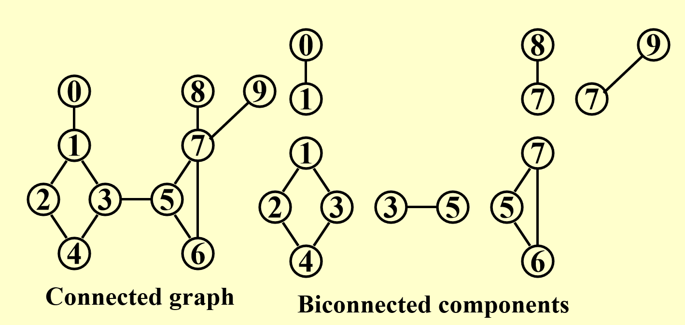
</div>

>注：没有一条边会同时出现在多个双连通分量中。因此 E(G) 被双连通分量划分，而双连通分量又被关节点划分

!!! question "问题"

	寻找无向连通图 G 中的**双连通分量的个数 = 关节点的个数 + 1**


!!! note "解决方法"

	如果题目给出一张图，叫我们找出所有关节点，这只要对每个顶点进行判断（假设移除某个顶点后，会不会多一些连通分量），很容易地找到所有关节点。但下面我们要用程序来解决这一问题

	用到的变量：

	+ `Num(v)`：顶点 v 的 DFS 序号
	+ `Low(v)`：生成树中顶点 v 的所有孩子节点以及 v 回边上的顶点中 `Num` 的最小值($\min(Num(w_i))$)（用到**后序遍历**）

	---
	+ 使用**深度优先搜索(depth first search)**得到G的生成树

		???+ play "动画演示"

			<div style="text-align: center; margin-top: 15px;">
			
			</div>

		我们得到：

		<div style="text-align: center; margin-top: 15px;">
		
		</div>

		**回边(back edges)**(u, v)：在图中而不在生成树内的边(u, v)，它反映了 u 和 v 之间有祖辈和后辈的关系。如果 u 是 v 的祖先，则 `Num(u) < Num(v)`；反之 `Num(u) > Num(v)`


		`Low(u)` 的计算公式：

		$$
		\begin{align}
		Low(u) = & \min\{Num(u), \min\{Low(w)\ |\ w \text{ is a child of }u\} \notag \\
		& , \min\{Num(w)\ |\ (u, w) \text{ is a back edge}\}\} \notag
		\end{align}
		$$

		表格（记录了`Num(v)`和`Low(v)`）：

		<div style="text-align: center; margin-top: 15px;">
		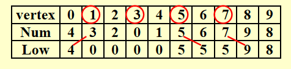
		</div>

	+ 找到G内的**关节点**

		+ 当且仅当**根节点**至少有 2 个孩子时，根节点为关节点
		+ 当且仅当**除根节点外的顶点u**至少有 1 个孩子，且该孩子与它的祖先之间没有回边（即`Low(child) >= Num(u)`）时，u 为关节点

??? code "代码实现"

	``` c
	// Assign Num and compute Parents
	void AssignNum(Vertex V)
	{
		Vertex W;

		Num[V] = Counter++;
		Visited[V] = ture;
		for each W adjacent to V
			if (!Visited[W])
			{
				Parent[W] = V;
				AssignNum(W);
			}
	}

	// Assign Low; also check for articulation points
	void AssignLow(Vertex V)
	{
		Vertex W;

		Low[V] = Num[V]; // Rule 1
		for each W adjacent to V
		{
			if (Num[W] > Num[V])
			{
				AssignLow(W);
				if (Low[W] >= Num[V])
					printf("%v is an articulation point\n", v);
				Low[V] = Min(Low[V], Low[W]);  // Rule 3
			}
			else if (Parent[V] != W)
				Low[V] = Min(Low[V], Num[W]);  // Rule 2
		}
	}

	// Testing for articulation points in one depth-first search
	void FindArt(Vertex V)
	{
		Vertex W;

		Visited[V] = True
		Low[V] = Num[V] = Counter; // Rule 1
		for each W adjacent to V
		{
			if (!Visited[W])
			{
				Parent[W] = V;
				FindArt(W);
				if (Low[W] >= Num[V])
					printf("%v is an articulation point\n", v);
				Low[V] = Min(Low[V], Low[W]);  // Rule 3
			}
			else if (Parent[V] != W)
				Low[V] = Min(Low[V], Num[W]);  // Rule 2
		}
	}
	```

### Euler Circuits

+ **欧拉路(Euler tour)**：在笔不离纸的情况下，图上的每条边均被遍历一遍（一笔画）
+ **欧拉环(Euler circuit)**：在笔不离纸的情况下，图上的每条边均被遍历一遍，且最后回到起点的位置

??? play "动画演示"

	<div style="text-align: center; margin-top: 15px;">
	
	</div>

判断方法：

+ 无向图：
	+ 当且仅当图是连通的，且**每个顶点的度为偶数**时，存在**欧拉环**
	+ 当且仅当图是连通的，且**仅有两个顶点的度为奇数**时，存在**欧拉路**
+ 有向图：
	+ 当且仅当图是弱连通的，且每个顶点的**出度 = 入度**时，存在**欧拉环**
	+ 当且仅当图是弱连通的，且有且仅有**一个**顶点的<u>出度 = 入度 + 1</u>，有且仅有**一个**顶点的<u>入度 = 出度 + 1</u>，其余顶点的<u>出度 = 入度</u>时，存在**欧拉路**

利用**DFS**寻找欧拉环：

???+ play "动画演示"

	<div style="text-align: center; margin-top: 15px;">
	
	</div>

+ 用*链表*维护路径
+ 对于每个邻接表，维护一个指向最后被扫描的边
+ 时间复杂度 $T = O(|E| + |V|)$

??? info "补充：[**哈密顿环(Hamilton cycle)**](https://zh.wikipedia.org/wiki/%E5%93%88%E5%AF%86%E9%A1%BF%E5%9B%BE)"

	无向图中能够访问所有**顶点**的环。

	??? code "代码实现"

		``` c
		#include <stdio.h>
		#include <stdlib.h>

		#define SIZE 201
		#define PSIZE 2001

		typedef struct AdjVNode *PtrToAdjVNode; 
		struct AdjVNode{
			int AdjV;
			PtrToAdjVNode Next;
		};

		typedef struct Vnode{
			PtrToAdjVNode FirstEdge;
		} AdjList[SIZE];

		typedef struct GNode *PtrToGNode;
		struct GNode{  
			int Nv;
			int Ne;
			AdjList G;
		};
		typedef PtrToGNode LGraph;

		void HCycle(LGraph g, int p[ ]);

		int main()
		{
			int n, m, k, q;
			int i, j;
			int v1, v2;
			int path[PSIZE];
			LGraph Graph;
			PtrToAdjVNode cur1, cur2;

			Graph = (PtrToGNode)malloc(sizeof(struct GNode));
			scanf("%d%d", &n, &m);
			Graph->Nv = n;
			Graph->Ne = m;
			for (i = 0; i < n; i++)
			{
				Graph->G[i].FirstEdge = NULL;
			}

			for (i = 0; i < m; i++)
			{
				scanf("%d%d", &v1, &v2);
				cur1 = (PtrToAdjVNode)malloc(sizeof(struct AdjVNode));
				cur1->AdjV = v2;
				cur1->Next = Graph->G[v1 - 1].FirstEdge;
				Graph->G[v1 - 1].FirstEdge = cur1;
				cur2 = (PtrToAdjVNode)malloc(sizeof(struct AdjVNode));
				cur2->AdjV = v1;
				cur2->Next = Graph->G[v2 - 1].FirstEdge;
				Graph->G[v2 - 1].FirstEdge = cur2;
			}

			scanf("%d", &k);
			for (i = 0; i < k; i++)
			{
				scanf("%d", &q);
				for (j = 0; j < q; j++)
					scanf("%d", &path[j]);
				if (q != Graph->Nv + 1)
					printf("NO\n");
				else
					HCycle(Graph, path);
			}

			return 0;

		}

		void HCycle(LGraph g, int p[ ])
		{
			int i;
			int flag[SIZE];
			PtrToAdjVNode cur;

			if (p[0] != p[g->Nv])
			{
				printf("NO\n");
			}
			else
			{
				for (i = 0; i < g->Nv; i++)
					flag[i] = 0;
				for (i = 1; i < g->Nv + 1; i++)
				{
					if (flag[p[i - 1] - 1] == 1)
					{
						printf("NO\n");
						return;
					}
					cur = g->G[p[i - 1] - 1].FirstEdge;
					while (cur != NULL && cur->AdjV != p[i])
						cur = cur->Next;
					if (cur == NULL)
					{
						printf("NO\n");
						return;
					}
					flag[p[i - 1] - 1] = 1;
				}
				printf("YES\n");
			}
		} 
		```
