# Mistakes in My Homework and Tests

## Chap 3

Question 1:

If a queue is implemented by a circularly linked list, then the insertion and deletion operations can be performed with one pointer rear instead of rear and front.

Answer: **T**

!!! note "分析"

    见下面评论区的回复（~~学了ADS后再看这道题，好像没有整理的必要(x)~~）

## Chap 4

Question 1:

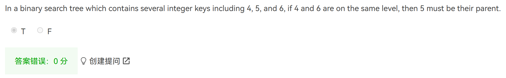

Answer: **F**

如图所示，5不必是4和6的直接父亲，也可以是它们的祖先：

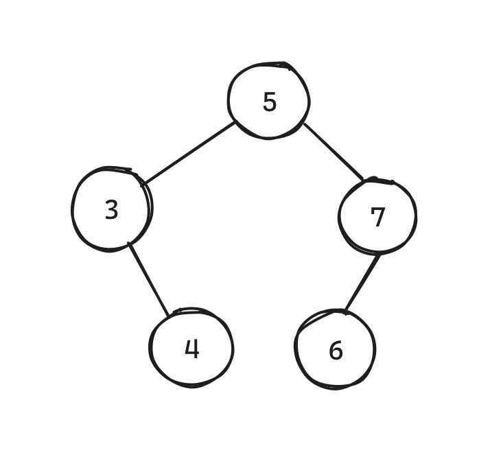

---
Question 2:

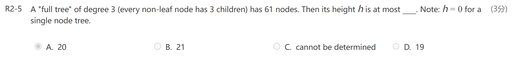

Answer: **A**

!!! note "分析"

    利用离散数学得到的公式：$n = mi + 1$，可计算内部顶点i的个数为20个。令这20个内部顶点相互连接，使树“退化”为一个类似链表的样子，此时树的高度为20（算上1层叶子节点）

---
Question 3:

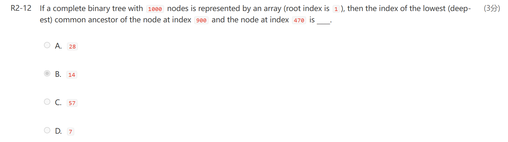

Answer: **B**

!!! note "分析"

    对于节点$i$，它的父节点的索引为$\lfloor \dfrac{i}{2} \rfloor$。

    对这2个节点不断除以2，列出它们所有祖先节点的索引并比较，最先发现的共同祖先即为题目要求的答案

---
Question 4:

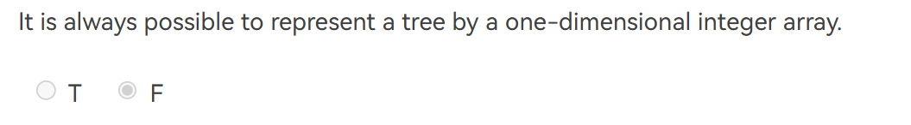

Answer: **T**

!!! note "分析"

    我不理解为什么？我想，万一每棵树的内部节点的孩子个数不定的话，怎么用一维数组(array)来存放这棵树呢？

    现在只能死记了...

---
Question 5:

14 distinct binary search trees can be created from 4 distinct keys

Answer: **T**

!!! note "分析"

    问n个不同顶点最多构造多少棵不同的BST，就用卡特兰数做

    $$
    C_n = \dfrac{C(2n, n)}{n+1}
    $$

    $n = 4$，所以$C_4 = 14$

    >推荐阅读：[**卡特兰数**](https://oi-wiki.org/math/combinatorics/catalan/)的N种用法

## Chap 5

Question 1:

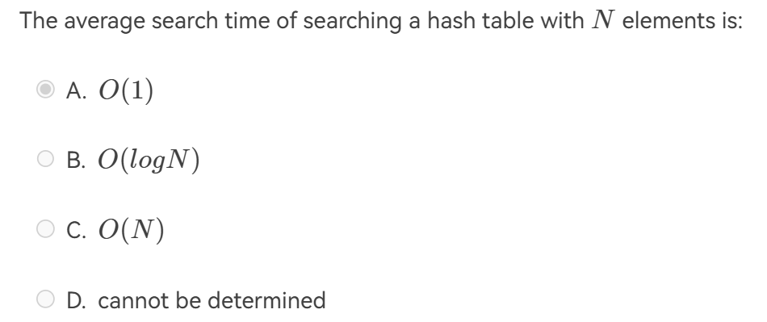

Answer: **D**

!!! note "分析"

    + 若没有冲突，平均查找时间为$O(1)$
    + 若出现冲突，最坏情况下平均查找时间为$O(N)$

    但我们不知道冲突发生的频率和其他情况，因此无法确定总的平均查找时间

---
Question 2:

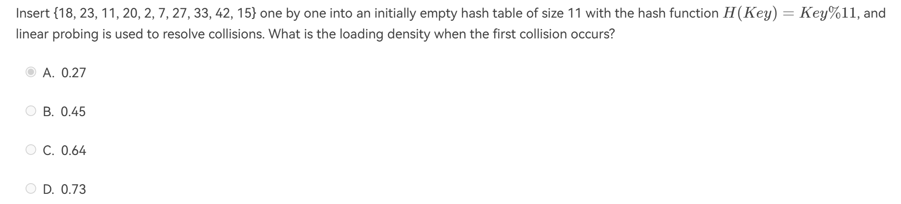

Answer: **B**

!!! note "分析"

    不要想太多！

    + 线性探测中，篮子个数b = TableSize，篮子容量s = 1
    + 冲突发生在7上（它与18冲突），此时已有5个元素已放在散列表内
    + $\lambda = \dfrac{5}{11} \approx 0.45$

---
Question 3:

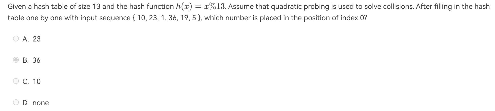

Answer: **D**

!!! note "分析"

    

    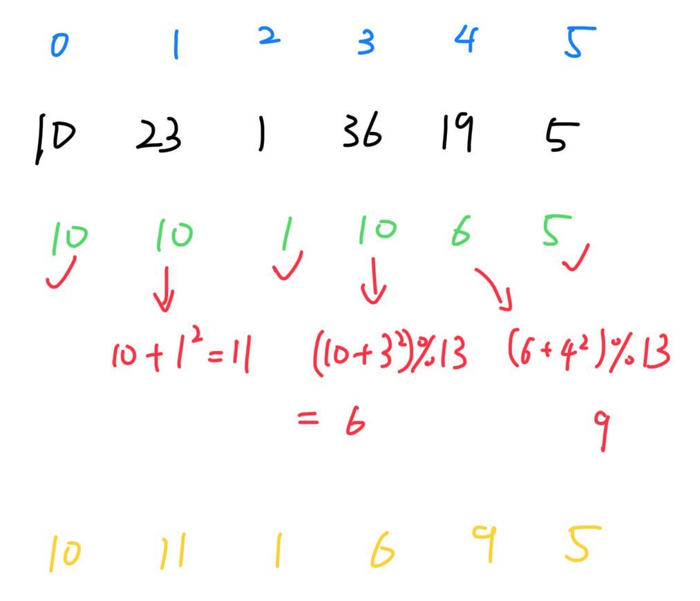
    

    + 蓝字：序号
    + 黑字：原始数据
    + 绿字：模除13后的结果（判断冲突）
    + 红字：使用二次探测后的结果
    + 黄字：原始数据在散列表的位置

    可以发现散列表索引为0的位置上没有数据，因此选D

## Chap 6

Question 1:

What is the minimum number of comparisons between heap elements required to construct a max heap of 5 elements using the $O(n)$ BuildHeap(array)?

A. 2    B. 4    C. 5    D. 3

Answer: **B**

!!! note "分析"

    堆的形状如图所示：

    

    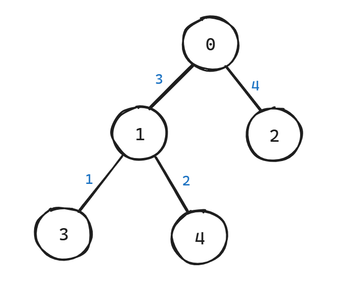
    
  

    蓝字表示需要的比较次数，共4次 

## Chap 7

Question 1:

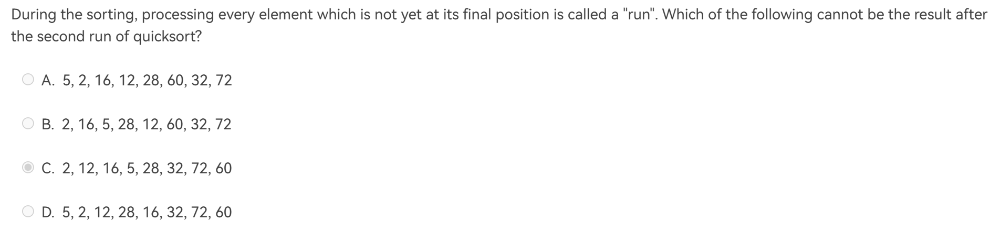

Answer: **D**

!!! note "分析"

    + 第一趟(run)快排后，确定**一个**元素的位置
    + 第二趟(run)快排后，
        + case 1: 若第一趟快排确定的是**两边**的元素，则本趟确定**一个**元素的位置
        + case 2: 若第一趟快排确定的是**中间**的元素，则本趟确定**两个**元素的位置
    
    因此，两趟排序后能够确定2-3个元素的位置，我们先找出每个选项中位置正确的元素（加粗表示）：

    + A. 5, 2, 16, 12, **28**, 60, 32, **72**
    + B. **2**, 16, 5, 28, 12, 60, 32, **72**
    + C. **2**, 12, 16, 5, **28**, **32**, 72, 60
    + D. 5, 2, **12**, 28, 16, **32**, 72, 60

    可以看到，A和B满足case 1，C满足case 2，而D均不满足，因此选D

    >这题很考验对快排的理解，如果做不出来应当再巩固相应知识

## Chap 8

Question 1:

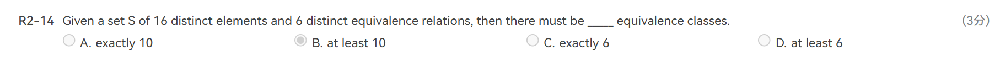

Answer: **B**

!!! note "分析"

    将16个元素看成顶点，6个等价关系看成边，等价类看成连通分量，这样比较容易理解——题目就转化为**至少**有多少连通分量

    每条边（等价关系）连接两个顶点（元素），这样就至少有6 + (16 - 2 * 6) = 10个连通分量（等价类）了

    补充：**至多**有16个等价类，因为任意两个元素之间可以没有任何等价关系

## Chap 9

Question 1:

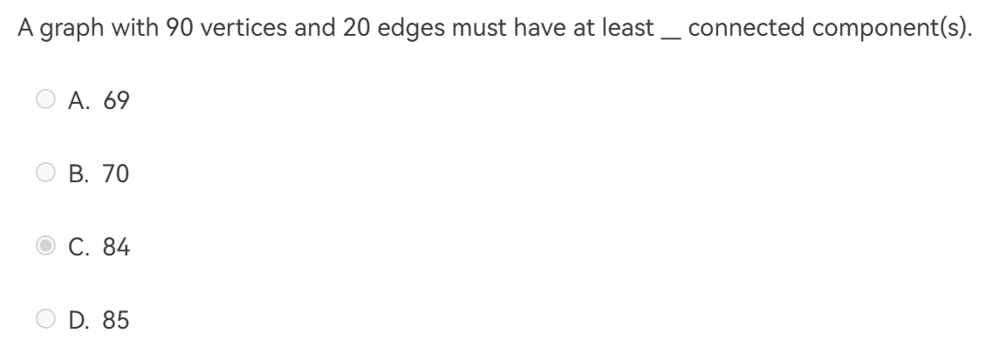

Answer: **B**

Question 2:

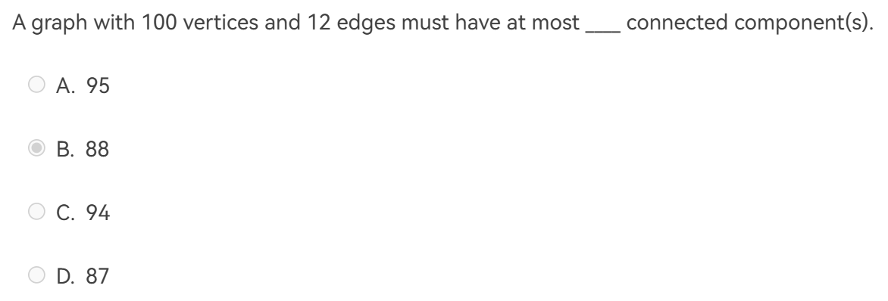

Answer: **A**

!!! note "分析（q1 & q2）"

    先读题，q1问**至少**有多少个连通分量，而q2问**至多**有多少个连通分量。

    q1: 20条边**最多**连接21个顶点（利用**环**），这21个顶点形成1个连通分量，再加上剩余69个单独的顶点，因此至少有70个连通分量

    q2: 12条边**最少**少连接6个顶点（利用**完全图**），这6个顶点形成1个连通分量，再加上剩余94个单独的顶点，因此至多有95个连通分量

---
Question 3:

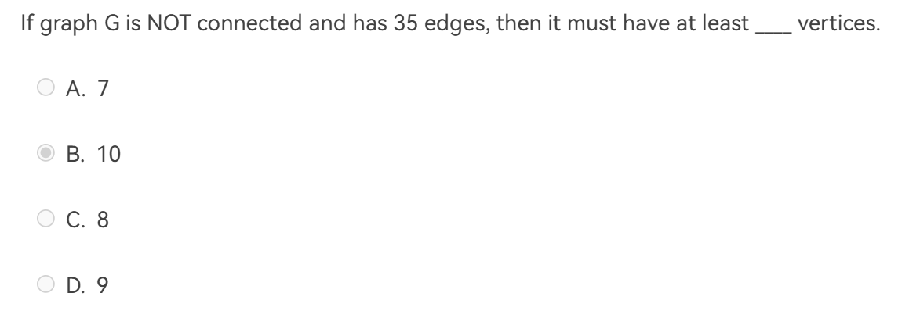

Answer: **B**

!!! note "分析"

    还是**先读题**：题目要求G**不连通**

    利用**完全图**的知识，35条边最少连接9个顶点，因此还需再加1个顶点，才能使整张图是不连通的，所以共10个顶点

---
Question 4:

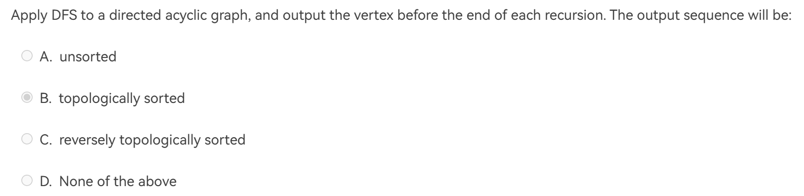

Answer: **D**(ChatGPT回答)

!!! note "分析"

    见下方评论区回复，建议读者自己画画图推导一下，感觉还是挺简单的（~~当时的我可能大脑一团浆糊吧~~）

---
Question 5:

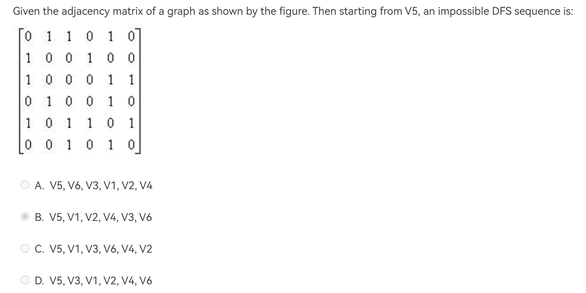

Answer: **C**

!!! note "分析"

    这个邻接矩阵是对称的，因此表示的是一张无向图，画出来，将每个选项一一带进去验证一下

    C的正确顺序应该是：V5, V1, V3, V6, <u>V2, V4</u>

---
Question 6:

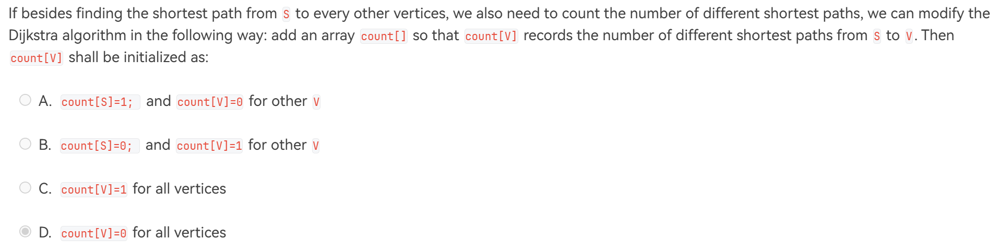

Answer: **A**

!!! note "分析"

    从起点S到起点S算一条路径，因此初始化`count[S] = 1`，否则的话根据历年卷（2020-2021）对应的实现代码，与它相邻的顶点的`count`的值就为0，这样传递下去后所有的`count`都为0了。

    其他顶点的`count`初始化为0就行了，不用多想

---
Question 7:

To find the minimum spanning tree of graph G(V,E) by ***Prim’s algorithm***, it is possible that the first collected edge is the longest one in E where each edge’s length is different.

Answer: **T**

!!! note "分析"

    假设|E| = |V| - 1，所有的边都是生成树的边，那么先挑哪一条边都无所谓了