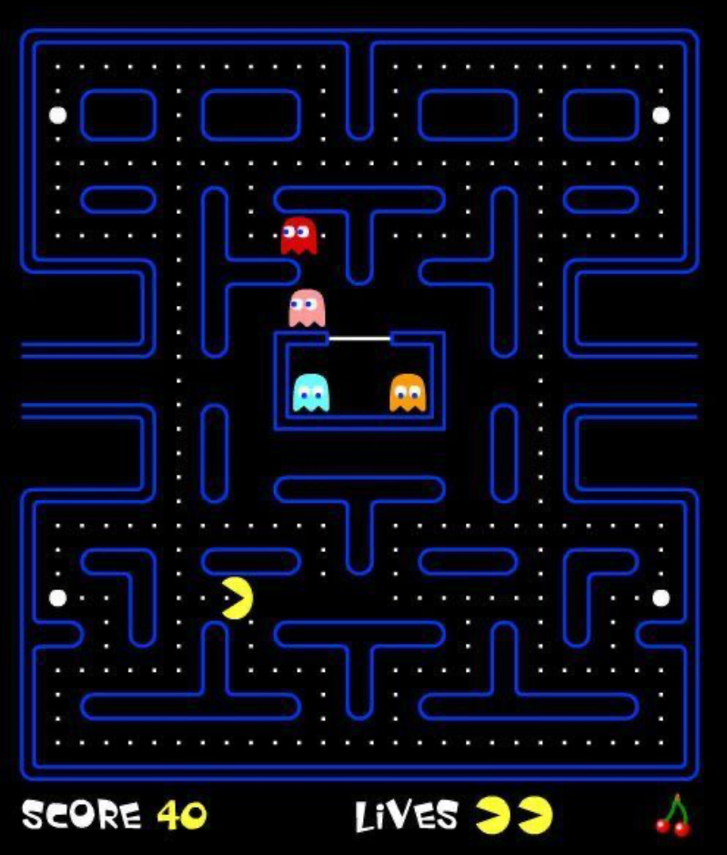
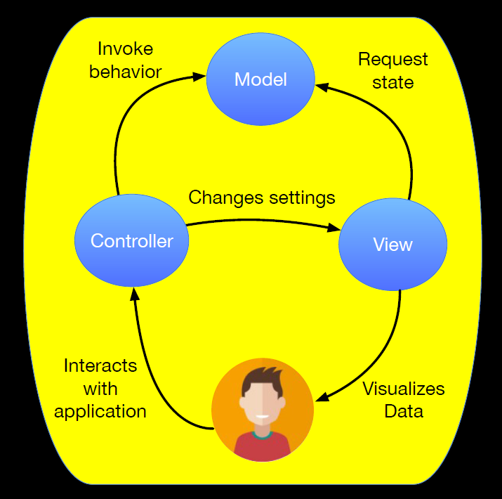

# Lec 1: Introductions, Games, Architecture, Engine

## Introduction

游戏的分类：

- 按平台分类：PC、控制台、浏览器、移动端、VR、AR
- 按目的分类：严肃的、教育意义的、随意的
- 按设备分类：触摸屏、动作捕捉、舞蹈垫


## Pygame

本课程采用[Pygame](https://www.pygame.org/news)来开发游戏。正如它的字面意思所示，我们会用Python语言来编写代码，所以也可以将Pygame简单理解为Python的一个（开源的）库。Pygame具备以下特点：

- 建立在[SDL](https://en.wikipedia.org/wiki/Simple_DirectMedia_Layer)之上
- 可以进行低级访问，即可以访问帧缓存(framebuffer)、音频设备、鼠标、键盘和手柄等设备
- 对大多数平台而言是便携的

Pygame下有多个模块(modules)，用于控制游戏环境的各方面，包括：

<div style="text-align: center">
    
</div>

Pygame安装：

``` sh
# Install using pip
$ pip3 install pygame
# Check Installation
$ python3 -m pygame.examples.aliens
```

??? example "例子"

    ```py
    #! /usr/bin/env python3
    ''' A simple pygame intro example '''
    import pygame
    from pathlib import Path

    pygame.init()

    size = width, height = 1024, 768
    speed = [3,2]
    black = (0, 0, 0)

    screen = pygame.display.set_mode(size)        # screen is a "surface" object  
    logo = pygame.image.load(logo_file)           # so is logo
    logo_width, logo_height = logo.get_size()     # surface methods let you get the size(width, height)
    logo_x = logo_y = 0

    running = True
    clock = pygame.time.Clock()
    while running:
        clock.tick(30)
        for event in pygame.event.get():
            if event.type == pygame.QUIT:         # check if the user closed the window
                running = False
        
        # move the logo position
        logo_x += speed[0]
        logo_y += speed[1]
        
        # check if going off screen
        if logo_x < 0 or logo_x + logo_width > width:
            speed[0] = -speed[0]
        if logo_y < 0 or logo_y + logo_height > height:
            speed[1] = -speed[1]
        
        screen.fill(black)                        # draw all black
        # now copy/paste in the logo at its (x, y) location
        screen.blit(logo, (logo_x, logo_y))
        pygame.display.flip()
    ```

    运行该程序，结果是一个Pygame的Logo在黑色画布上弹跳，~~类似Windows XP的屏保~~。

### Game Loop

一种很常见的游戏基本结构为：

- 一些初始化操作
- 一个循环，当循环结束时游戏便结束了。
    - 在每趟循环中：
        - 检查（来自用户、网络等的）输入
        - 基于这些输入来更新游戏的状态值
        - 基于状态值来绘制下一帧的画面。其中**帧**(frame)是指每次循环中渲染出来的画面
            - fps：帧每秒，一个衡量游戏性能的重要指标。一般情况下，如果游戏低于30fps，玩家会感到明显的延迟；若游戏在60fps以上会相当流畅。
    - 循环体现的思想：游戏需要保持响应、通常需要检查用户的输入并响应

下面用伪代码的形式来描述这一结构：

```py
# Normal structure of a game

initialize_game()
while not done:
    *user_inputs, done = get_inputs()
    game_state = update_game_state(user_inputs)
    render_game(game_state)
```

??? example "例子：[**吃豆人**](https://en.wikipedia.org/wiki/Pac-Man)(pac-man)"

    <div style="text-align: center">
        
    </div>

    简化的游戏结构框架为：

    ```py
    # Simplfied game loop for Pac-Man
    while player.lives > 0:
        inputs = get_joystick_data()
        player.move(inputs)
        for g in ghosts:
            if player.collides(g):
                player.kill()
            else:
                g.move(player.position)
        # Pac-man eats pellets, fruit, power-ups...
        # ...
        # Generate outputs
        graphics.draw()
        audio.play(sounds)
    ```

### Event Queue

Pygame通过一个**事件队列**(event queue)来处理用户的输入（和一些别的功能）。其中**事件**表示系统所发生内容的一个对象，包括键盘按键、窗口缩放、鼠标点击等等；**队列**表示一个FIFO的列表。

- 游戏的每趟循环必须处理队列中的所有事件，（多数情况下）以响应用户的行为，这种代码称为事件驱动代码(event driven code)。
- Pygame的事件模块提供了处理事件队列的扩展功能。

事件对象(event objects)：事件队列中的元素

- 每个事件对象都有一个**类型**(type)属性，对象的其余属性都是基于类型属性而设定的，下面给出一些例子（不同类型对应的属性）
    - `type = KEYDOWN`：
        - `key`：按键
        - `mod`：是否按下++shift++，++ctrl++等特殊键
        - `unicode`
        - `scancode`
    - `type = MOUSEBUTTONDOWN`：
        - `pos`：光标的x、y坐标
        - `button`：鼠标按键（左、中、右）
    - `type = VIDEORESIZE`：
        - `size`：窗口的尺寸（宽、高）

下面给出对应的伪代码：

```py
# Example event processing
def get_inputs():
    done = left = right = False
    for event in pygame.event.get():
        if event.type == pygame.QUIT:
            done = True
        elif event.type == pygame.KEYDOWN:
            if event.key == pygame.K_ESCAPE:
                done = True
            elif event.key == pygame.K_RIGHT:
                right = True
            elif event.key == pygame.K_LEFT:
                left = True
    return (left, right, done)
```


## Game Architecture

**架构**(architecture)指的是整个游戏代码的结构，包括各个组成部分（对象、函数、模块等）以及它们之间的交互（接口、传参等）。

???+ bug "不良的编写代码习惯：[意大利面(spaghetti)代码](https://en.wikipedia.org/wiki/Spaghetti_code)"

    当代码量变得很大的时候，架构的意义就更加重要了。当一个架构能够帮助你容易发现和理解每个代码段的作用时，即使是这个架构不是很好那也不成问题。

    然而，太复杂混乱的代码结构不利于我们能够在添加或改变代码时不犯错，这样的代码称为**意大利面代码**。

接下来将介绍一种常见且较为简单的游戏架构——**MVC**(Model-View-Controller)。

### MVC

MVC是一种常见于GUI、web应用和游戏中的架构风格，它由以下三部分构成：

- **模型**(model)：管理数据以及对数据的操作
    - 模型提供了一个对于数据定义良好的接口，使得我们改变数据结构时不需要再改变代码的剩余部分
    - 在很多web和GUI应用中，模型通常是一个数据库
    - 在编写游戏代码时，首先要考虑的便是模型（需要什么数据，如何存储等）
- **视窗**(view)：提供一种数据的可视化方法
    - 举例：每一帧的画面、音效、音乐等
    - 理论上说，不同的视窗组件会用到来自模型中的相同数据
        - 比如需要用文本视窗辅助游戏开发，或者需要一个特殊的视窗来帮助调试...
- **控制器**(controller)：将输入行为映射到模型或视窗行为上，即处理输入
    - 输入行为：鼠标点击、键盘按压、网络信息等
    - 模型行为：角色移动、敌人死亡、飞船爆炸等
    - 视窗行为：窗口缩放、即时重放、菜单键按下等
    - 控制器可以有不同的映射规则，比如移动键可能会映射到箭头键，也有可能映射到WASD等

下图展现了MVC模型中三者的相互关系：

<div style="text-align: center">
    
</div>

### OO Model/View

**面向对象**(oriented-object)是另一种常见的游戏代码风格。游戏中的每个物体(item)对应代码中的对象(object)。

- 对象是模型的一部分：对象可以知道自己的状态，而模型的组件能够持续跟踪对象并告诉它们何时更新状态（调用`update()`方法）。
- 对象也是视窗的一部分：对象知道如何绘制物体，视窗可以调用`draw()`方法来绘制，要注意绘制的顺序


## Graphic Primitives

绝大多数游戏都依赖于计算机图形学(computer graphics, CG)，因为它能够向玩家提供可视化的反馈和引导。

>[CG的发展历史](https://en.wikipedia.org/wiki/Computer_graphics#1960s)

游戏**引擎**(engine)提供了可嵌入于游戏代码中的图形算法，这样的话游戏开发者就不必考虑绘图的具体实现了，从而更加专注于游戏逻辑本身。

- 本课程所用到的Pygame也可以视为一个2D游戏的引擎
- 3D游戏引擎：[Unreal](https://en.wikipedia.org/wiki/Unreal_Engine)、[Unity](https://en.wikipedia.org/wiki/Unity_(game_engine))


---
计算机上的一幅图像(image)就是一个包含像素(pixel)的数组

- 行(row)、列(column)
- 每个像素都有一个颜色，用数字表示，由R(red)、G(green)、B(blue)、alpha四部分构成，每部分是一个8位的值。其中alpha通道通常会被忽略，所以一般称之为“24位色”
- 在Python和Pygame中，
    - 可以用元组来表示像素的颜色，比如`Mario = (112, 136, 242)`
        - 元组的第四个元素用于表示alpha通道，取值也是0-255，值越低越透明，255表示不透明(opaque)
    - 也可以用`Color`类表示，此时可以用一个6位十六进制字符串来表示颜色，比如`Mario = 0x7088F2`


