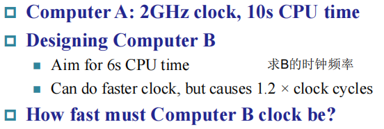
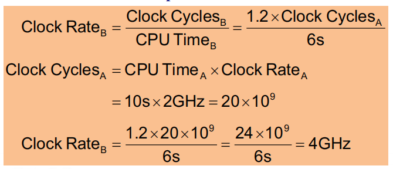
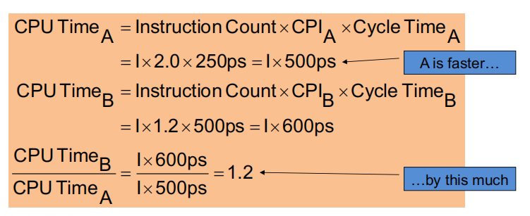
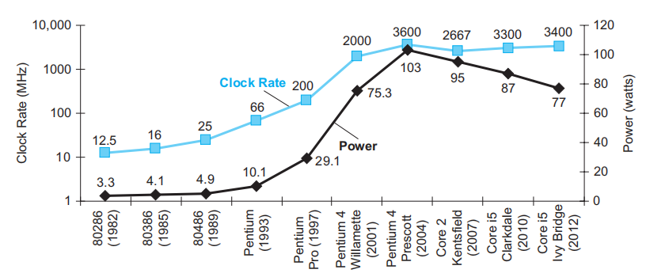

# Chap 1: Computer Abstractions and Technology

!!! abstract "核心知识"

    - 八个伟大思想（贯穿本课程始末）
    - CPU性能的衡量
        - 相关指标：执行时间、吞吐量（单位时间内完成的工作量）
        - 性能 = 执行时间的倒数
        - 执行时间 -> CPU时间 -> 周期数 / 频率（周期数 * 周期）
        - 周期数 = 指令数 * CPI
        - 因此衡量CPU性能的最关键的3个因素：指令数、CPI、时钟频率
    - 边际收缩效应规律：$\mathrm{T_{improved}} = \dfrac{T_{affected}}{\mathrm{Amount\ of\ improvement}} + T_{unaffected}$
    - $\mathrm{MIPS} = \dfrac{\mathrm{Instruction\ count}}{\mathrm{Execution\ time} \times 10^6}$

    >感觉这一章花了很大的篇幅讲述与计算机相关的历史背景，真正有用的知识点感觉很少......

??? info "零碎的背景知识"

    - 第一台机械式计算器（加、减） —— by Blaise Pascal
    - 图灵机
    - 冯·诺依曼架构
        - 计算与存储分离
        - 数据与指令保存在同一个存储器
    

        
    

    - 计算机的演进
        - 电子管（真空管）
            - ENIAC
        - 晶体管
            - IBM 1401
            - UNIVAC III
        - 集成电路
            - IBM 360
        - 微处理器

    - 电脑具备什么特征
        - 电子化的实现方式
        - 有指令集
        - 可执行指令
        - 可存储指令与数据
        - 计算能力上是图灵完备的

    - PC
        - 第一台现代 PC：[Xerox Alto](https://zh.wikipedia.org/wiki/Xerox_Alto)
        - Macintosh
        - Windows

    - [**RISC**](https://en.wikipedia.org/wiki/Reduced_instruction_set_computer)(Reduced Instruction Set Computer, 精简指令集计算机)

    - 计算机类型
        - 个人计算机(personal computers)
        - 服务器(server computers)
        - 超级计算机(supercomputers)
        - 嵌入式计算机(embedded computers)

    - 后 PC 时代
        - 个人移动设备(personal mobile device, PMD)
        - 云计算(cloud computing)

## Eight Great Ideas

- 设计紧跟**摩尔定律**(Design for Moore's Law)
- [摩尔定律](https://en.wikipedia.org/wiki/Moore%27s_law)：18-24 个月内集成电路的性能就会翻一番
- 采用**抽象**简化设计(Use abstraction to simplify design)
- 加速大概率事件(Make the common case fast)
- 通过**并行**提高性能(Performance via parallelism)
- 通过**流水线**提高性能(Performance via pipelining)
- 通过**预测**提高性能(Performance via prediction)
- **存储器分层**(Hierarchy of memories)
- 通过**冗余**提高可靠性(Dependability via redundancy)

## Below the Program

**指令集**(instruction set architecture)：硬件和软件之间的接口

高级语言 -> 硬件语言的过程：

<figure style=" width: 80%" markdown="span">
    
    
    <figcaption></figcaption>
</figure>

- 高级编程语言（`A + B`）
    - 形式上更接近自然语言
    - 编译器(compiler)将其翻译其汇编语言
    - 独立于硬件之外
- 汇编语言（`add A, B`）
    - 汇编器(assembler)将其翻译为机器语言
- 机器语言（`1000110010100000`）
    - 计算机仅理解电子信号的开闭（二进制 0/1）
    - 机器语言用二进制数字表示机器指令

## Compute Organization

<figure style=" width: 70%" markdown="span">
    
    
    <figcaption></figcaption>
</figure>

硬件的组成部分：

- 输入设备
- 输出设备
- CPU（位于主板(logical board)）
    - 控制器(controler)：根据程序指令来控制数据通路、内存和 I/O 设备
    - 数据通路(datapath)：执行算术运算
- 内存：
    - 主存(main memory)：易失性(volatile)
        - RAM：DRAM、SRAM
    - 外存(secondary memory)：非易失性(nonvolatile)
        - 磁盘(magnetic disk)
        - 闪存(flash memory)

---
软件的分类：

- 应用软件
    - 办公软件
    - ...
- 系统软件
    - 操作系统(operating system)
    - 编译器(compiler)：将由高级编程语言(high-level language, HLL)编写的程序翻译成机器能够理解的内容
    - 驱动(firmware)
        - 网卡驱动
        - ...

## The Technology of Building Processors and Memories

集成电路的制作流程：

    

成本计算：

$$
\begin{align}
\rm{Cost\ per\ die} & = \dfrac{\rm{Cost\ per\ wafer}}{\rm{Dies\ per\ wafer} \times \rm{Yield}}\notag \\
\rm{Dies\ per\ wafer} & = \dfrac{\rm{Wafer\ area}}{\rm{Die\ area}} \notag \\
\rm{Yield} & = \dfrac{1}{(1 + \rm{Defects\ per\ area} \times \dfrac{\rm{Die\ area}}{2})^2} \notag
\end{align}
$$

## Performance

衡量计算机性能的指标：

- 响应时间/执行时间(response time/execution time)：执行任务所需的时间
- 吞吐率(throughput/bandwidth)：单位时间内完成的工作量

>注：我们目前仅考虑响应时间

- 性能 = 1 / 执行时间，即$\text{Performance}_X = \dfrac{1}{\text{Execution}_X}$
- X 的性能比 Y 快 n 倍：$\dfrac{\rm{Performance}_X}{\rm{Performance}_Y} = \dfrac{\rm{Executino\ time}_Y}{\rm{Execution\ time}_X} = n$

执行时间的测量：

- 运行时间(elapsed/wall clock/response time)：完成任务的总耗时，包括磁盘和内存的访问、I/O活动等，它反映了系统的性能
- CPU时间：执行给定任务总共所花的时间，包括用户CPU时间（程序运行耗时）和系统CPU时间（执行与该程序相关的操作系统任务的耗时）

    

**CPU周期(clock cycle)**/**CPU频率(clock rate)**的相关公式：

$$
\begin{align}
\rm{CPU\ Time} & = \rm{CPU\ Clock\ Cycles} \times \rm{Clock\ Cycle\ Time} \notag \\
& = \dfrac{\rm{CPU\ Clock\ Cycles}}{\rm{Clock\ Rate}} \notag
\end{align}
$$

由此，我们可以得出性能提升的方法：

- 降低CPU周期数(CPU clock cycle)
- 提升CPU频率(CPU rate)
- 但是改善其中的一个属性，就会拉低另一个属性，所以需要权衡好两者

??? example "例题"

    === "问题"

        

            
        
         

    === "答案"

        

            
        

:star:**指令数**(instruction count, IC)和**CPI**(clock cycles per instruction)的相关公式：

$$
\begin{align}
\mathrm{CPU\ Clock\ Cycles} & = \mathrm{Instruction\ Count} \times \mathrm{Cycles\ per\ Instruction} \notag \\
\mathrm{CPU\ Time} & = \mathrm{Instruction\ Count} \times \mathrm{CPI} \times \mathrm{Clock\ Cycle\ Time} \notag \\
& = \dfrac{\mathrm{Instruction\ Count} \times \mathrm{CPI}}{\mathrm{Clock\ Rate}} \notag
\end{align}
$$

- 指令数：**取决于指令集架构**，而非具体的实现方式
>注：如果题目说这几个处理器的指令集架构是一样的，这就说明它们的指令数也是一样的。

- CPI：每条指令的平均周期数，取决于很多的设计细节，包括内存系统、处理器结构等
- 不同的指令集架构、不同的指令类别（比如RISC-V的R型指令、I型指令等等）会产生不同的CPI，如果CPU执行多种类型的指令，上面的公式需要修改为：

$$
\mathrm{CPU\ Clock\ Cycles} = \sum\limits_{i=1}^n(\mathrm{CPI}_i \times \mathrm{Instruction\ Count_i})
$$

??? example "例题"

    === "题目"

        

            
        
 

    === "答案"

        

            
        
 

- 加权平均 CPI

$$
\mathrm{CPI} = \dfrac{\mathrm{Clock\ Cycles}}{\mathrm{Instruction\ Count}} = \sum\limits_{i=1}^n(\dfrac{\mathrm{CPI}_i \times \mathrm{Instruction\ Count}_i}{\mathrm{Instruction\ Count}})
$$

??? example "例题"

    

        
    
 

!!! note "总结"

    $$
    \mathrm{CPU\ Time} = \dfrac{\mathrm{Seconds}}{\mathrm{Program}} = \dfrac{\mathrm{Instructions}}{\mathrm{Program}} \times \dfrac{\mathrm{Clock\ cycles}}{\mathrm{Instruction}} \times \dfrac{\mathrm{Seconds}}{\mathrm{Clock\ Cycle}}
    $$

---
决定性能的因素：

- 算法
- 编程语言、编译器和架构
- 处理器和内存系统
- I/O 系统（硬件 + 操作系统）

## The Power Wall

处理器时钟频率的提升往往伴随着能耗(power)的增加——两者是相互关联的。然而近几年两者的增长速度不断放缓，原因在于能耗上的限制，防止处理器过热。

    

CMOS 是集成电路上常常用到的工艺，它的能量消耗在于动态能源(dynamic energy)：晶体管在高低电平之间切换的时候会消耗能量。能耗与以下因素相关：

$$
\mathrm{Power} \propto \dfrac{1}{2} \times \mathrm{Capacitive\ load} \times \mathrm{Voltage}^2 \times \mathrm{Frequency\ switched}
$$

虽然降低电压看起来可以有效减小能耗，但它会带来另外一个问题：晶体管会更容易泄露能量，造成更多的浪费。

## The Switch from Uniprocessors to Multiprocessors

如今，单个处理器的性能受物理因素的限制，已经很难再有快速的提升了。因此最近的这十几年里，设计者们开始在一个芯片内放置多个处理器（其中处理器被称为“核”(core)），这种设计对吞吐量的提升较为显著。

处理器从单核到多核的转变，也促使程序员重写之前写的代码，以获得多核处理器带来的好处。然而，这对程序员而言是不小的挑战：

- 写出来的程序不仅要确保正确性，还要保证速度够快
- 需要将一个任务分成多个小块，让每个处理器分别处理，其中要考虑包括调度、加载平衡、同步时间以及各部分间的通信等问题

## Fallacies and Pitfalls

!!! bug "错误观点"

    - 改善电脑的其中一个方面，就能使电脑的整体性能有所提升
        - 阿姆达尔定律/边际收益递减规律：

        $$
        \mathrm{T_{improved}} = \dfrac{T_{affected}}{\mathrm{Amount\ of\ improvement}} + T_{unaffected}
        $$

        ??? example "例子"

            === "问题"

                假设一个程序在一台电脑里运行耗时100s，其中的乘法运算耗时80s。如果我想让程序运行比原来快5倍（也就是耗时20s），乘法运算的速度需要提升多少？

            === "答案"

                根据条件，运用上面的公式，可以得到以下式子：

                $$
                20 = \dfrac{80}{n} + 20
                $$

                显然$n$无解，因此无法通过这种方式提升性能。

    - 电脑空闲的时候耗电更少
    - 性能和能效(energy efficiency)是互不相干的两个因素

    - 使用“[性能](#performance)”一节最后总结的公式中的一部分作为性能的量度
        - MIPS(millions of instructions per second, 每秒百万条指令数)就是这样的一类量度，它的公式是：

        $$
        \begin{align}
        \mathrm{MIPS} & = \dfrac{\mathrm{Instruction\ count}}{\mathrm{Execution\ time} \times 10^6} \notag \\
        & = \dfrac{\mathrm{Instruction\ count}}{\dfrac{\mathrm{Instruction\ count} \times \mathrm{CPI}}{\mathrm{Clock\ rate}} \times 10^6} = \dfrac{\mathrm{Clock\ rate}}{\mathrm{CPI} \times 10^6} \notag
        \end{align}
        $$

        - MIPS 的问题：
            - 实际上，它没有考虑到指令数（从公式最后的结果可以看出），因此我们不能用它来比较使用不同指令集的电脑性能
            - 即使在相同的电脑上，MIPS 也会随程序的不同而不同，也就是说一台电脑可能有多个 MIPS 值
            - 如果一台电脑执行很多指令，但是每条指令都运行地很快，那么 MIPS 将无法反映实际的性能