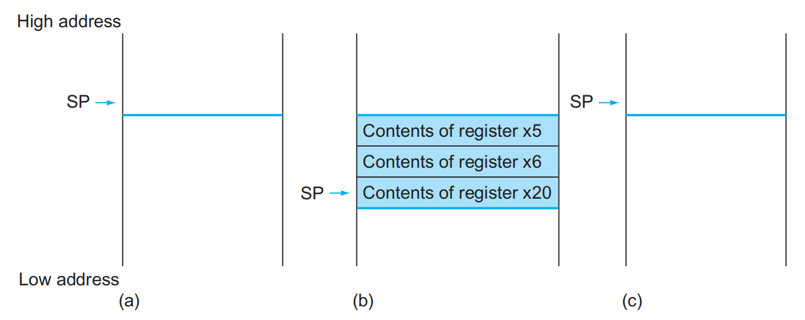
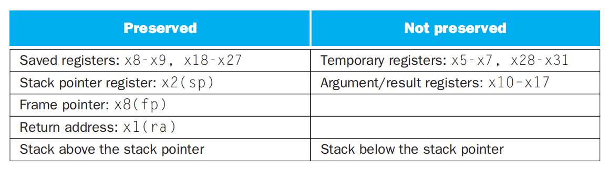
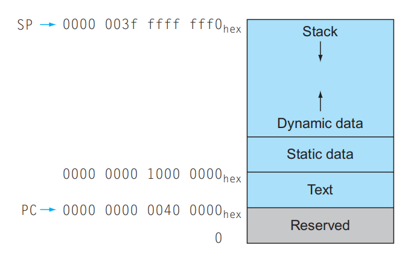
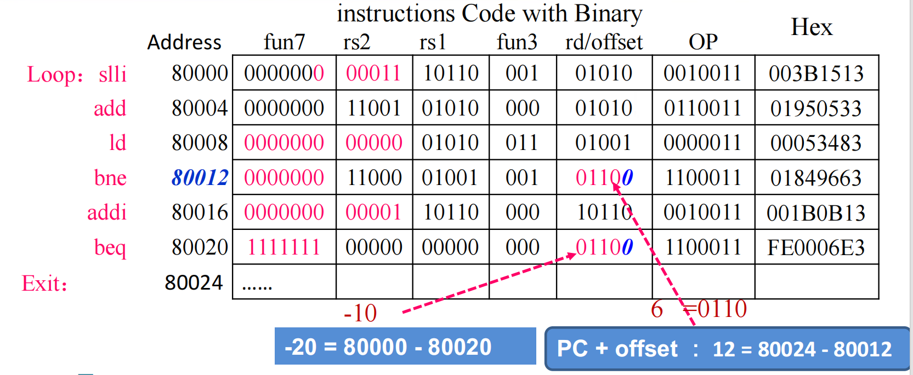
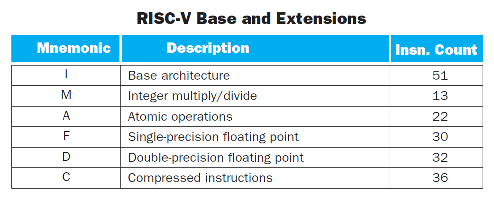
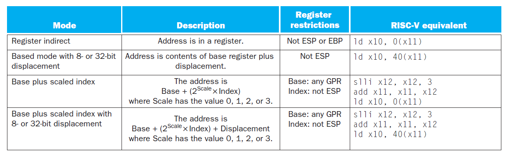

# Chap 2: Language of the Machine

## Basis

**指令集**(instruction set)：一组能被特定架构理解的指令。

目前比较流行的指令集有RISC-V、MIPS和Intel x86。本笔记主要介绍的是RISC-V指令集。（Intel x86指令集可以看我的[汇编语言](../../lang/asm/index.md)笔记）

**存储程序**(stored-program)概念，包含以下两个关键原则：

- 指令用数字表示
- 程序就像数据一样存储在内存中，用来被读取或写入

<div style="text-align: center">
    
</div>


??? note "本章将会介绍的RISC-V中各种操作数和指令"

    <div style="text-align: center">
        
    </div>

在RISC-V汇编语言中，用`//`表示注释，用法与C++的相同。

:star:设计原则：

- Simplicity favors regularity
    - 规整(regularity)使实现更简单
    - 简约(simplicity)保证在较低能耗的情况下获取更高的性能
- Smaller is faster
- Good design demands good compromises
- Make common case fast(from eight great idea)


## Registers

**寄存器**(registers)：CPU内用来暂存指令、数据和地址的内部存储器。在RISC-V架构中，一共有32个寄存器，且每个寄存器的大小为64bit。

- 由于64bit经常会用到，因此在RISC-V中又称为**双字**(doubleword)（32bit被称为**字**(word)）。下图展示了双字宽度的值：

    <div style="text-align: center">
        
    </div>

- 之所以寄存器的个数不多，是因为过多的寄存器会增加电子信号的传播距离，从而导致时钟周期的延长
- 寄存器的命名规则：`xn`，其中`n`为数字，取值范围为`0-31`
- 每种寄存器的用途：
    <div style="text-align: center">
        
    </div>

    - `x0`：其值恒为0

- 将不常用的（或之后用到的）变量放入内存的过程被称为溢出寄存器(spilling register)

由于寄存器的大小和数量有限，因此对于更复杂的数据结构（比如数组和结构体等），寄存器无法直接保存它们的内容。因此小规模的数据会放在寄存器内，而更大规模的数据则会存储在计算机的**内存**(memory)中。

???+ note "寄存器与内存之间的区别"

    - 寄存器存储空间小，内存存储空间大
    - 各种操作和运算只能在寄存器内完成（因此需要寄存器和内存间的[数据传输](#data-transfer)）
    - 寄存器有着更快的运行速度和更高的吞吐量，使得访问寄存器内的数据更加迅速和方便，且访问寄存器的能耗更低（~~当然寄存器会更贵一点~~）


## Instructions

### Arithmetic Operations

- 加法
    - `add`：寄存器1 + 寄存器2

    ```asm
    add reg1, reg2, reg3    // (in C) reg1 = reg2 + reg3
    ```

    - `addi`(add immediate)：寄存器 + 常量

    ```asm
    addi reg1, reg2, const  // (in C) reg1 = reg2 + const
    ```

- 减法

    - `sub`：寄存器1 - 寄存器2

    ```asm
    sub reg1, reg2, reg3    // (in C) reg1 = reg2 - reg3
    ```

    - 注意：没有`subi`，可以通过`addi`一个负常数


### Data Transfer

由于对数据的各种操作只能在寄存器内完成，而无法在内存中实现，因此数据需要再寄存器和内存之间来回传递，来完成这一传递操作的指令被称为**数据传输指令**(data transfer instructions)。要想访问内存中的某个字或双字，我们需要它们的**地址**(address)，而这样的地址在内存（可以看作一个很大的一维数组）中作为索引使用，从0开始。下图展示的是RISC-V架构下的内存结构：

<div style="text-align: center">
    
</div>

- RISC-V的每个地址对应一个字节，且内存存储的数据是双字宽度的，因此内存地址是8的倍数
- RISC-V在使用地址时采用**小端序**(little-endian)：对于一个数据，低位放在小地址，高位放在大地址

    ??? info "补充：小端序vs大端序"

        <div style="text-align: center">
            
        </div>

- RISC-V不要求内存数据对齐(alignment)

    ??? info "补充：内存对齐"

        <div style="text-align: center">
            
        </div>


有以下数据传输指令：

- `ld`(load doubleword)：**加载**(load)指令，将内存的数据拷贝到寄存器内
    - 格式：
    ```asm
    ld reg, offset(mem_base_addr)
    // reg: register
    // mem_base_addr: a register containing the base address of memory, also called base register
    // offset: constant
    ```

    - 内存数据的实际地址 = `mem_base_addr + offset`
    - 符号数的加载会用到*符号扩展*(sign extension)（若符号位不在最高位上，符号位左侧的位与符号位相等），无符号数的加载会用到*零扩展*（左侧全是0）
- `sd`(store doubleword)：**存储**(store)指令，将寄存器的数据拷贝到内存中
    - 格式（与`ld`基本一致）：
    ```asm
    sd reg, offset(mem_base_addr)
    // reg: register
    // mem_base_addr: a register containing the base address of memory, also called base register
    // offset: constant
    ```

- `lbu`(load byte unsigned)：加载1字节的数据，并看作无符号数，因此最左侧的位采用零扩展
- `lb`(load byte)：`lbu`的符号数版本

!!! note "更多的数据传输指令见“[字符串](#strings)”一节"

??? example "例题"

    === "问题"

        用RISC-V汇编语言实现下面的C语言赋值语句：

        ```c
        A[12] = h + A[8]
        ```

        其中变量`h`的值存储在寄存器`x21`内，数组`A`的基地址(base address)存储在寄存器`x22`内。

    === "答案"

        ```asm
        ld   x9, 64(x22)  // Temporary reg x9 gets A[8]
        add  x9, x21, x9  // Temporary reg x9 gets h + A[8]
        sd   x9, 96(x22)  // Stores h + A[8] back into A[12]
        ```

### Logical Operations

下表展示了RISC-V中关于逻辑运算的指令（同时与C、Java对比）：

<div style="text-align: center">
    
</div>

- 移位(shifts)
    - 前面两个操作为**逻辑左移/右移**
        - 左移$i$位相当于乘以$2^i$
        - 逻辑右移时最左边补0
        - 不带`i`的指令表示根据寄存器的值确定移动位数，带`i`的指令表示用立即数确定移动位数，比如：
        ```asm
        slli x11, x19, 4    // reg x11 = reg x19 << 4 bits
        ```

    - 第三种移位操作为**算术右移**，最左边补符号位

- AND、OR、XOR：与、或、异或，它们的格式一致：

    ```asm
    and | or | xor    reg1, reg2, reg3
    // reg reg1 = reg reg2 &(, |, ^) reg reg3
    ```

    - RISC-V中没有NOT指令，因为它可以通过异或表示出来：任何数与111...111异或的结果即为该数取反后的结果
    - AND、OR、XOR也有立即数版本的指令，分别为：`andi`、`ori`和`xori`

### Making Decision

计算机与计算器的一大不同之处在于计算机具备决策的能力：它能够执行分支（条件）语句、循环语句等。在RISC-V汇编语言中，关于决策的指令有以下特征：

- 它们的格式均为（`rs1`、`rs2`是寄存器，`L1`是标签，`inst`是指令）：
    ```asm
    inst rs1, rs2, L1
    ```
- 比较的是补码值
- 类型：
    - **条件分支**(conditional branch)：先检测值，根据检测结果决定是否将控制权转交给新地址上的语句的一类指令
    - **无条件分支**(unconditional branch)：条件恒为真的条件分支，因此该语句一定会执行


有以下几种可用指令：

- `beq`(branch if equal)：如果寄存器`rs1`和`rs2`的值**相等**，那么跳转至带标签`L1`的语句
- `bne`(branch if not equal)：如果寄存器`rs1`和`rs2`的值**不相等**，那么跳转至带标签`L1`的语句
- `blt`(branch if less than)：如果寄存器`rs1`的值**小于**`rs2`的值，那么跳转至带标签`L1`的语句
    - `bltu`：无符号版本
- `bge`(branch if greater than or equal)：如果寄存器`rs1`的值**大于等于**`rs2`的值，那么跳转至带标签`L1`的语句
    - `bgeu`：无符号版本

!!! warning "注意"

    实际上，分支指令的最后一个字段不仅可以是代表跳转地址的标签，也可以是一个立即数`imm`，此时如果发生跳转，将会跳转至地址`PC + imm`。

??? example "例题"

    === "例1：if-then-else条件分支"

        === "问题"

            将下列C语句转化为RISC-V汇编代码：

            ```c
            if (i == j)
                f = g + h;
            else 
                f = g - h;
            ```

            其中`f`、`g`、`h`、`i`、`j`这五个变量分别存储在`x19`-`x23`这五个寄存器内。

        === "答案"

            ```asm
                // go to Else if i != j
                bne x22, x23, Else
                // f = g + h(skipped if i != j)
                add x19, x20, x21
                // if 0 == 0, go to Exit(unconditional branch)
                beq x0, x0, Exit
            Else:
                // f = g - h(skipped if i == j)
                sub x19, x20, x21
            Exit:
            ```

    === "例2：while循环"

        === "问题"

            将下列C语句转化为RISC-V汇编代码：

            ```c
            while (save[i] == k)
                i += 1;
            ```

            其中变量`i`、`k`分别存储在寄存器`x22`、`x24`内，数组`save`的基地址存储在寄存器`x25`内。

        === "答案"

            ```asm
            Loop:
                // Temp reg x10 = i * 8
                slli x10, x22, 3
                // x10 = address of save[i]
                add  x10, x10, x25
                // Temp reg x9 = save[i]
                ld   x9, 0(x10)
                // go to Exit if save[i] == k
                bne  x9, x24, Exit
                // i = i + 1
                addi x22, x22, 1
                // go to Loop
                beq  x0, x0, Loop
            Exit:
            ```

对于`case/switch`语句，我们可以使用一张放有可选指令序列地址的表格（称为**分支地址表**(branch address table)），这样的话程序就可以根据条件判断的结果，通过表格的索引找到合适的指令序列。

<div style="text-align: center">
    
</div>

??? example "例题"

    === "题目"

        用RISC-V的分支地址表实现下面的C语言`switch`语句：

        ```c
        switch (k) {
            case 0: f = i + j; break;
            case 1: f = g + h; break;
            case 2: f = g - h; break;
            case 3: f = i - j; break;
        }
        ```

        假设变量`f-k`分别对应寄存器`x20-x25`，寄存器`x5`的值为4。

    === "答案"

        <div style="text-align: center">
            
        </div>

!!! note "基本块(basic block)"

    **基本块**是一个没有内嵌分支（除了在末尾）且没有跳转目标（除非在开头）的指令序列。基本块的概念有以下好处：

    - 编译器通过识别出基本块来进行编译的优化
    - 高级处理器能够加速基本块的执行


### Strings

C语言采用ASCII字符集，它规定了一个字符占8位或1字节的空间。RISC-V为我们提供了从双字中提取单个字节的指令，便于我们访问字符：

- `lbu`(load byte unsigned)：从内存中加载1字节，并把它放在寄存器最右侧的8位上
- `sb`(store byte)：将寄存器最右端的8位写入内存中

??? example "例题"

    === "问题"

        C语言的`strcpy()`函数的实现如下所示：

        ```c
        void strcpy(char x[], char y[]) {
            size_t i;
            i = 0;
            // copy and test byte
            while ((x[i] = y[i]) != '\0')
                i += 1;
        }
        ```


        将其转化为RISC-V的形式。

    === "答案"

        ```asm
        strcpy:
            // adjust stack for 1 more item
            addi sp, sp, -8
            // save x19
            sd   x19, 0(sp)
            
            // i = 0 + 0
            add x19, x0, x0

        L1:
            // address of y[i] in x5
            add  x5, x19, x11
            // x6 = y[i]
            lbu  x6, 0(x5)
            
            // address of x[i] in x7
            add  x7, x19, x10
            /// x[i] = y[i]
            sb   x6, 0(x7)

            beq  x6, x0, L2

            // i = i + 1
            addi x19, x19, 1
            // go to L1
            jal  x0, L1

        L2:
            // restore old x19
            ld   x19, 0(sp)
            // pop 1 doubleword off stack
            addi sp, sp, 8
            // return
            jalr x0, 0(x1)
        ```

---
而Java采用Unicode字符集，它规定了一个字符占16位（称为**半字**(halfword)）的空间。RISC-V同样也提供了访问半字的一些指令：

- `lhu`(load half unsigned)：从内存中加载半字，并放入寄存器中最右端的16位空间内
- `lh`(load half)：类似`lhu`，但会将数据看作一个符号数，因此寄存器左边的48位采取符号扩展的填充方式
- `sh`(store half)：获取寄存器最右边16位的数据并写入内存中

???+ info "补充"

    RISC-V也支持对字的数据传输指令：`lwu`、`lw` 和 `sw`，它们的意义可对应于其他位宽的相似指令，这里不再赘述。

## Instruction Representations

我们可以把每条指令当作一块块二进制数字构成的组合，而这单块的数字被称为**字段**(field)。对于一条加法指令`add x9, x20, x21`，我们可以表示成以下形式：

<div style="text-align: center">
    
</div>

- **机器语言**(machine language)：指令的数字形式
- **机器码**(machine code)：一条数字形式的指令
- 如果觉得看这么一长串二进制数字太累了，可以写成十六进制的形式

我们为字段赋予了一些名称，每个字段有不同的功能：

- `opcode`：指令要做的运算，可用这个字段区分各种类型的**指令格式**(instruction format)
- `funct3`：额外的`opcode`字段
- `funct7`：额外的`opcode`字段
- `rd`：寄存器目标操作数，保存运算的结果
- `rs1`：第一个寄存器源操作数
- `rs2`：第二个寄存器源操作数
- `immediate`：立即数，即常数（在S-type中会被拆成两半）


有以下几种指令格式：

- R-type：用于算术、逻辑运算

    <div style="text-align: center">
        
    </div>

- I-type：用于加载操作、涉及立即数的算术逻辑运算、`jalr`指令

    <div style="text-align: center">
        
    </div>

    - 由于寄存器的大小为64位，也就是说最多移位64位，因此移位操作中`immediate`字段只有低6位存储移位的步数，而高6位存储额外的`opcode`字段（`funct6`）
    - 关于`jalr`指令
        - 如果跳转地址（立即数）过大，超过了20位，那么可以先用`lui`指令（[后面](#wide-immediate-operands)会讲到这条指令，也会介绍类似的方法）将高20位数字放入临时寄存器中，然后再用`jalr`指令，跳转到地址 `剩余的低位数字(临时寄存器)` 上

- S-type：用于存储操作

    <div style="text-align: center">
        
    </div>

- U-type：用于与高位立即数相关的操作（比如[这个](#wide-immediate-operands)）
- SB-type：用于条件分支指令

    <div style="text-align: center">
        
    </div>

    - 可表示的地址范围为-4096-4094，且都是2的倍数（因为立即数第一位恒为0）

    ??? example "例子"

        ```asm
        bne x10, x11, 2000  // if x10 != x11, go to location 2000
        ```

        它的指令格式为：

        <div style="text-align: center">
            
        </div> 


- UJ-type：用于无条件分支指令（`jal`）
    - `rd`用于存放链接地址（即返回地址）
    - 注意：与`jal`对应的无条件分支指令`jalr`是**I型指令**

    ??? example "例子"

        ```asm
        jal x0, 2000  // go to location 2000
        ```

        它的指令格式为：

        <div style="text-align: center">
            
        </div>  

!!! note "总结"

    <div style="text-align: center">
        
    </div>

    可以看到，RISC-V的指令统一为**32位**长度（体现了设计原则"Simplicity
     favors regularity"）


## Procedures

**过程**(procedure)（或函数）：一种被存起来的子程序(subroutine)，基于提供的参数来执行一些特定的任务。这可以使程序员更加容易理解代码的功能以及更加方便地重用这些代码。

在执行一个过程的时候，程序将会遵循以下步骤：

1. 将参数放在过程可以访问得到的地方
2. 将控制权转交给过程
3. 获取过程所需的存储资源
4. 执行目标任务
5. 将结果值放在调用程序访问得到的地方
6. 将控制权还给原主，因为一个过程可以被调用多次

在调用过程的时候，程序会用到以下寄存器：

- `x10-x17`：8个用于传递参数或返回值的参数寄存器(parameter register)
- `x1`（或称为`ra`）：1个用于返回原位的返回地址寄存器(return value register)

此外，程序还会用到过程调用指令(procedure call instructions)：

- `jal`(jump and link)：
    - 格式：
    ```asm
    jal x1, ProcedureAddress
    // jump to ProcedureAddress and write return address to x1
    ```

    - 该指令由**调用者**(caller)使用：跳转到目标地址（`ProcedureAddress`），同时也会将后面要执行的指令的地址保存到目标寄存器（`x1`）中
    - 名称中的link（链接）指的是指向调用位置的地址或链接（称为**返回地址**(return address)），它能确保过程结束后能够返回到正确的地址上
    - 可用于无条件分支中：`jal x0, Label`，由于`x0 = 0`，因此该指令意味着直接跳转至`Label`所在的语句

- `jalr`(jump and link register)
    - 格式：
    ```asm
    jalr x0, 0(x1)
    ```

    - 该指令由**被调用者**(callee)使用
    - 类似`jal`，但是跳转到地址`0 + address in x1`上
    - 将寄存器`x0`作为目标寄存器（`x0`不能被改变）
    - 也可以用于case/switch语句中

**程序计数器**(program counter)：一类寄存器，用于保存**当前正在执行的指令**的地址（更合理的名称是指令地址寄存器(instruction address register)，但因为历史原因还是习惯叫做前者，简称为PC）。

- 在`jal`指令中，地址寄存器`x1` = `PC + 4`，因为每个地址对应1字节空间，而一条指令占4字节大小

### Stack

在过程中，除了会用前面提到的寄存器外，可能还会用到其他的寄存器。需要注意的是：任何被调用者用到的寄存器，在过程被唤起之前必须复原(restore)（按照我的理解是类似C语言的“释放”）它们的值。因此，这里要用到前面提到过的[溢出寄存器](#registers)。

而用于存储这些溢出寄存器的数据结构是**栈**(stack)：

- 在栈中，需要用一个**栈指针**(stack pointer)来指向栈中最近被分配的地址，它起到了指示下一个溢出寄存器的位置，以及获取旧的寄存器的值的作用。RISC-V中，`x2`，或者（更常用）`sp`作为栈指针。
- 栈的两个常用操作是**压入**(push)和**弹出**(pop)，分别表示存储数据和移除数据。
- 由于历史原因，栈的高位地址在先，低位地址在后，因此要把这个栈看作是一个倒放的容器：栈底在上方，从下方的开口将数据压入

<figure style=" width: 50%" markdown="span">
    
    
    <figcaption></figcaption>
</figure>

??? example "例题"

    === "问题"

        将下面的C语言函数改写成RISC-V汇编语言的过程

        ```c
        long long int leaf_example(long long int g, long long int h, long long int i, long long int j) {
            long long int f;

            f = (g + h) - (i + j);
            return f;
        }
        ```

        其中，参数变量`g`、`h`、`i`、`j`对应寄存器`x10-x13`，`f`对应`x20`。

    === "答案"

        ```asm
        leaf_example:
            // adjust stack to make room for 3 items
            addi sp, sp, -24
            // save register x5, x6 and x20 for use afterwards
            sd   x5, 16(sp)
            sd   x6,  8(sp)
            sd   x20, 0(sp)

            // register x5 contains g + h
            add x5, x10, x11
            // register x6 contains i + j
            add x6, x12, x13
            // f = x5 - x6, which is (g + h) - (i + j)
            sub x20, x5, x6

            // returns f(x10 = x20 + 0)
            addi x10, x20, 0

            // restore register x20, x6 and x5 for caller
            ld   x20, 0(sp)
            ld   x6,  8(sp)
            ld   x5, 16(sp)
            // adjust stack to delete 3 items
            addi sp, sp, 24

            // branch back to calling routine
            jalr x0, 0(x1)
        ```

        图示（分别展示了过程调用前、中、后的时候栈的情况）：


        <div style="text-align: center">
            
        </div>


有些寄存器在调用过程的时候会被自动保存(preserve)下来，无需存入栈内。下图便根据这点给寄存器分类：

<div style="text-align: center">
    
</div>

### Nested Procedures

**叶子过程**(leaf procedure)：不调用其他过程的过程。

假设某个程序调用过程A，过程A又调用过程B。我们知道只有一个寄存器`x1`用于保存返回的地址，也就是说A和B需要共用`x1`，那么过程B结束后的返回会影响到过程A的返回。

一种解决方案是将需要的寄存器压入栈内保存起来，等到要用的时候再取出来。对于上面的例子，我们可以先将存储A的地址的`x1`先压入栈内，这样保存了A的返回地址；然后这个`x1`可以继续存储B的返回地址；等到A要返回的时候，`x1`从栈中获取A的返回地址，这样A便可以顺利返回了。

??? example "例题"

    === "问题"

        将下面用C语言写的递归程序（计算阶乘）用RISC-V汇编语言改写。

        ```c
        long long int fact(long long int) {
            if (n < 1) 
                return 1;
            else 
                return n * fact(n - 1);
        }
        ```

    === "答案"

        ```asm
        fact:
            // adjust stack for 2 items
            addi sp, sp, -16
            // save the return address
            sd   x1,  8(sp)
            // save the argument n
            sd   x10, 0(sp)

            // x5 = n - 1
            addi x5, x10, -1
            // if (n - 1) >= 0, go to L1
            bge  x5, x0,  L1

            // return 1
            addi x10, x0, 1
            // pop 2 items off stack
            addi sp,  sp, 16
            // return to caller
            jalr x0, 0(x1)

        L1: 
            // n >= 1: argument gets (n - 1)
            addi x10, x10, -1
            // call fact with (n - 1)
            jal  x1, fact

            // return from jal: move result of fact(n - 1) to x6
            addi x6, x10, 0
            // restore argument n
            ld   x10, 0(sp)
            // restore the return address
            ld   x1,  8(sp)
            // adjust stack pointer to pop 2 items
            addi sp, sp, 16

            // return n * fact(n - 1)
            mul  x10, x10, x6
            // return to the caller
            jalr x0, 0(x1)
        ```

有些递归过程可以被改写成等价的迭代版本，且迭代版的效率会更高。比如对于在过程末尾进行递归调用（即**尾调用**(tail call)）的过程，在C语言中会被自动转化为对应的迭代形式。

??? example "例子"

    对于以下C语言函数：

    ```c
    long long int sum(long long int n, long long int acc) {
        if (n > 0)
            return sum(n - 1, acc + n);
        else
            return acc;
    }
    ```

    转化为RISC-V汇编语言为：

    ```asm
    sum:
        // go to sum_exit if n <= 0
        ble x10, x0, sum_exit
        // add n to acc
        add x11, x11, x10
        // subtract 1 from n
        addi x10, x10, -1
        // jump to sum
        jal x0, sum
    sum_exit:
        // return value acc
        addi x12, x11, 0
        // return to caller
        jalr x0, 0(x1)
    ```

    可以看到，在RISC-V中该过程会转化为迭代的形式

### Space Allocation

- **过程帧**(procedure frame)/**活动记录**(activation record)：栈内的一段空间，里面存储了过程所需的寄存器和变量 。
- 寄存器`x8`（或者称为`fp`）是一个**帧指针**(frame pointer)，它指向过程帧内第一个双字。
    - 栈指针会随着过程的进行而不断变化，因此在过程的不同阶段访问同一个变量或寄存器时，用到的偏移量会不断变化，从而带来理解上的不便
    - 而帧指针在过程中为局部变量提供一个稳定的基址寄存器

    <div style="text-align: center">
        
    </div>

- 寄存器`x3`（或者称为`gp`）是一个**全局指针**(global pointer)，它指向的是静态(static)数据。
- Linux系统上RISC-V的内存分配示意图：

    <div style="text-align: center">
        
    </div>

    - 最底下的内存是保留的空间（不可访问）
    - 第二层的内存用于存放RISC-V的机器码，称为**文本段**(text segment)
    - 第三层的内存称为**静态数据段**(static data segment)，用于放置立即数和其他静态变量
    - 最上层同时存放栈和动态数据（比如链表等），其中存放动态数据的数据结构称为**堆**(heap)。注意到栈和堆位于这块内存的两端，分别自顶向下和自底向上增长
        - C语言中使用`malloc()`在堆中分配空间，使用`free()`释放堆内的空间。如果过晚释放空间，就会造成内存泄露问题；如果过早释放空间，就会造成悬空指针(dangling pointers)（类似野指针）问题。

## Addressing 

### Wide Immediate Operands

虽然在大多数情况下，立即数不会很大（$\le 2^{12}$），能够直接存在指令中；但如果超过12位，RISC-V会用`lui`(load upper immediate)指令来处理这类较大的立即数。

- `lui`的指令格式为U-type
- 它可以加载立即数的**高20位**，将其放入寄存器中间的第12位到第31位，寄存器的低12位用0填充，高32位用第31位上的数字填充
- 举个例子：要将32位立即数赋给寄存器，可以先用`lui`指令将高20位赋给寄存器，之后用`addi`指令将剩余的12位加到寄存器中（具体见下面的“例题”）


??? example "例题"

    === "题目"

        如何将下列的64位立即数放入寄存器`x19`内？

        <div style="text-align: center">
            
        </div>

    === "答案"

        - 先取这个立即数上第12位到第31位的数字，用指令`lui`将这些数字放入寄存器`x19`上的第12位到第31位
        ```asm
        lui x19, 976  // 976 = 0000 0000 0011 1101 0000
        ```

        - 然后将立即数的低12位加到寄存器上，这样便大功完成了
        ```asm
        addi x19, x19, 1280  // 1280 = 00000101 00000000
        ```


### Addressing Mode

**寻址模式**(addressing mode)：决定此架构下的机器语言指令对应的运算数。共有以下四种寻址模式：

<div style="text-align: center">
    
</div>

- **立即寻址**(immediate addressing)：操作数为指令内的立即数
- **寄存器寻址**(register addressing)：操作数为寄存器
- **基址或偏移寻址**(base or displacement addressing)：操作数位于指定的内存位置上，该位置是寄存器和立即数之和
- **PC相对寻址**(PC-relative addressing)：分支地址为PC和分支偏移量（立即数的2倍）之和

    $$
    \begin{align}
    \text{Target address} & = \text{PC} + \text{Branch offset} \notag \\
    & =  \text{PC} + \text{immediate} \times 2 \notag
    \end{align}
    $$

    ??? example "例子"

        接着"[Making Decision](#making-decision)"一节的例2，我们将汇编代码展开成机器码表示：

        <div style="text-align: center">
            
        </div>

        这里有2条分支指令：

        - `bne`：它的跳转地址为`Exit`标签位置上（地址为80024），而该指令的地址为80012，因此偏移量为80024 - 80012 = 12，立即数为 12 / 2 = 6
        - `bne`：它的跳转地址为`Loop`标签位置上（地址为80000），而该指令的地址为80020，因此偏移量为80000 - 80020 = -20，立即数为 -20 / 2 = -10

        >注意：这里完整的偏移值应该是`fun7`和`rd/offset`字段拼接而成的

    - 虽然大部分的跳转地址离分支指令都比较近（根据SPEC测试，一半左右的分支指令跳转距离不超过16条指令），但是仍会存在一些跳转距离很远，超过12位地址的指令。这时汇编器会采取以下挽救措施：
        - 插入一条无条件分支指令，它的跳转地址即为目标跳转地址
        - 将原来条件分支指令的条件取反，让条件分支语句自行决定是否跳过无条件分支

    ??? example "例子"

        ```asm
        beq x10, x0, L1
        ```

        如果`L1`地址过远，这条指令会被替换成以下指令：

        ```asm
            bne x10, x0, L2
            jal x0, L1
        L2:
        ```

### Decoding Machine Language

如果想将机器语言用RISC-V汇编语言翻译，可能需要参考下面这张RISC-V指令编码表：

???+ note "RISC-V指令编码表"

    <div style="text-align: center">
        
    </div>

??? example "例题"

    === "题目"

        这个机器码对应的汇编指令是什么呢？

        $00578833_{\text{hex}}$

    === "答案"

        <div style="text-align: center">
            
        </div>

## Synchoronization

假设两个处理器$P_1, P_2$在同一片内存空间中工作，并且它们的工作顺序为：$P_1$写入数据后，$P_2$再读取数据。如果$P_1$和$P_2$没有**同步**(synchoronize)好，那么就会产生**数据竞争**(data race)的问题（结果取决于$P_1$和$P_2$的访问顺序，因此这个结果就是不确定的）。

避免这一问题的方法是**原子**读取/写入(atomic read/write)内存操作，这种操作确保读和写之间不会有任何访问这块内存空间的行为。

有些处理器有专门实现原子操作的指令，比如原子交换(atomic swap/exchange)（实现寄存器和内存数据的交换）等。而RISC-V提供了一个指令对(instruction pair)`lr.d`和`sc.d`：

- `lr.d`(load-reserved doubleword)：
    - 格式：
    ```asm
    lr.d rd, (rs1)
    ```

    - 功能：将存储在寄存器`rs1`的内存地址上的数据加载到寄存器`rd`上，同时保留这块内存地址，除`sc.d`的其他指令不应该访问这块地址

- `sc.d`(store-conditional doubleword)：
    - 格式：

    ```asm
    sc.d rd, rs1, (rs2)
    ```

    - 功能：
        - 将寄存器`rs1`上的数据放入存储在寄存器`rs2`的内存地址上
        - 并且由寄存器`rd`指示该指令是否成功：若成功，则`rd = 0`，否则`rd`为一个非零值（表示有其他指令访问过这块内存空间）

??? example "例子"

    === "例1：原子交换"

        ```asm
        again: 
            lr.d x10, (x20)       // load reserved
            sc.d x11, x23, (x20)  // store conditional
            bne x11, x0, again    // branch if store fails
            addi x23, x10, 0      // put loaded value in x23
        ```

    === "例2：加锁&解锁"

        ```asm
        // Lock:
                addi x12, x0, 1       // copy locked value
        again:
                lr.d x10, (x20)       // load-reserved to read lock
                bne  x10, x0, again   // check if it is 0 yet
                sc.d x11, x12, (x20)  // attempt to store new value
                bne  x11, x0, again   // branch if store fails
        // Unlock:
                sd x0, 0(x20)         // free lock by writing 0
        ```

## Program Translation

下图展示了将一个C语言的程序（源代码）转化为存储在内存中的一个文件的过程：

<div style="text-align: center">
    
</div>

这个过程一共涉及到以下装置：

- 编译器(compiler)：高级编程语言 -> 汇编语言
    - 有的编译器兼具汇编器的功能
- 汇编器(assembler)：
    - 伪指令 -> 指令
        - **伪指令**(pseudoinstruction)：可以理解为汇编指令的扩展（或者缩写），形式上看似指令，而实际上并不存在这种指令，但汇编器会将其自动转化为实际存在的指令

        ??? example "例子"

            - `li`(load immediate)：加载立即数
                - 格式：
                ```asm
                li reg, imm
                ```

                - 等价于：
                ```asm
                addi reg, x0, imm
                ```

            - `mv`(move)：赋值
                - 格式：
                ```asm
                mv rd, rs
                ```

                - 等价于：
                ```asm
                addi rd, rs, 0
                ```
            - `j`：`jal`的缩写

    - 可接受各种进制的数
    - 用**符号表**(symbol table)存储标签名称和内存地址的对应关系，便于将标签转化为实际的地址
    - 基本的功能：汇编语言 -> 机器码，即汇编程序 -> **目标文件**(object file)。在UNIX系统中，目标文件包含以下内容：
        - 目标文件头(object file header)：描述目标文件中其他区域的大小和位置
        - 文本段(text segment)：包含机器码
        - 静态数据段(static data segment)：包含程序生命周期中分配的数据（在UNIX中这个区域同时存放静态和动态数据）
        - 重定位信息(relocation information)：根据程序被加载至内存的绝对地址来区分指令和数据
        - 符号表(symbol table)
        - 调试信息(debugging information)：简要描述模块的编译情况，使调试器能够将机器指令和C源文件关联起来，且能够读取其中的数据结构

- 链接器(linker)
    - 对于多文件的编译，采取的做法是先编译、汇编单个的文件，然后将这些机器语言程序链接起来，这样可以尽可能减少重编译和重汇编的情况
    - 工作流程：
        - 将代码和数据模块以符号化的形式存在内存中
        - 弄清数据和指令标志对应的地址
        - 补充好内部和外部的引用
    - 经链接器加工后，最终生成一个可执行文件(executable file)，它与目标文件的区别在于后者存在不确定(unresolved)的引用

    ??? example "例子"

        === "题目"

            推断下面两个目标文件（给出了目标文件头，以Name开头）经链接器链接后得到的可执行文件头是什么？

            <div style="text-align: center">
                
            </div>

        === "答案"

            <div style="text-align: center">
                
            </div>

- 加载器(loader)：将可执行文件放入内存或磁盘中，工作流程为：
    - 读取可执行文件头，得到文本段和数据段的大小
    - 创建一个指向足够容纳文本和数据的空间的地址
    - 将可执行文件的指令和数据拷贝到内存中
    - 将主程序的参数（如果有的话）放入栈中
    - 对寄存器进行初始化操作，并将栈指针指向第一个空闲的位置上
    - 跳转到启动例程，将参数拷贝到参数寄存器中，并调用程序的主例程。让主例程返回时，启动例程中止整个程序，附带`exit`系统调用

### Dynamically Linked Libraries

前面介绍的链接方法属于静态链接，虽然它能快速调用库函数，但它具有以下缺陷：不能及时更新库函数，会一次性加载所有库函数（即使很多库函数没被用到）。因此我们更多地会用到**动态链接库**(dynamically linked libraries, DLL)来克服这些缺陷——这种库可以在程序**运行时**被链接到程序里。

在原始版本的DLL中，程序和库都需要保留额外的信息，用于定位非局部的过程；加载器会运行一个动态的链接器，使用这些额外的信息找到合适的库并更新所有的外部引用。这种DLL的缺点是它仍然会一次性加载所有库函数。一种改进方法是使用**懒过程链接**(lazy procedure linkage)版本的DLL，它能保证只有当程序调用库函数时，对应的库才会被链接到程序里。下图展示了这种版本的DLL：

<div style="text-align: center">
    
</div>

总而言之，DDL具备以下特征：

- 需要可重定位的过程代码
- 能够避免由静态链接获取所有库函数带来的占用存储空间过大的问题
- 能够自动获取最新版本的库


### Starting a Java Program

<div style="text-align: center">
    
</div>

## RISC-V in C

### A C Sort example

在前面的学习中，我们只展示了汇编语言的代码片段，而没有展示过一个功能完备的完整的汇编代码。下面，我们将用RISC-V汇编语言翻译一个用C语言写的冒泡排序函数。

??? note "注"

    在此之前，可以先了解一下将C语言翻译成汇编语言的大致步骤：

    1. 为程序的每个变量分配相应的寄存器
    2. 为过程的主体部分书写代码
    3. 在过程调用期间保留要用的寄存器

先来翻译子过程`swap`（交换数组中相邻的两个元素）：

=== "C代码"

    ```c
    void swap(long long int v[], size_t k) {
        long long int temp;
        temp = v[k];
        v[k] = v[k+1];
        v[k+1] = temp;
    }
    ```

=== "RISC-V汇编代码"

    ```asm
    swap:
        slli x6, x11, 3      // reg x6 = k * 8
        add  x6, x10, x6     // reg x6 = v + (k * 8)
        ld   x5, 0(x6)       // reg x5 (temp) = v[k]
        ld   x7, 8(x6)       // reg x7 = v[k + 1]
        sd   x7, 0(x6)       // v[k] = reg x7
        sd   x5, 8(x6)       // v[k+1] = reg x5 (tmp)
        jalr x0, 0(x1)       // return to calling routine
    ```

再来翻译过程`sort`

=== "C代码"

    ```c
    void sort(long long int v[], size_t int n) {
        size_t i, j;
        for (i = 0; i < n; i++) {
            for (j = i - 1; j >= 0 && v[j] > v[j + 1]; j--) {
                swap(v, j);
            }
        }
    }
    ```

=== "RISC-V汇编代码"

```asm
// Saving registers
sort:
    addi sp, sp, -40      // make room on stack for 5 registers
    sd   x1, 32(sp)       // save return address on stack
    sd   x22, 24(sp)      // save x22 on stack
    sd   x21, 16(sp)      // save x21 on stack
    sd   x20, 8(sp)       // save x20 on stack
    sd   x19, 0(sp)       // save x19 on stack

// Procedure body
// Move parameters
    mv   x21, x10         // copy parameter x10 into x21
    mv   x22, x11         // copy parameter x11 into x22

// Outer loop
    li   x19, 0           // i = 0
for1tst: 
    bge  x19, x22, exit1  // go to exit1 if i >= n

// Inner loop
    addi x20, x19, -1     // j = i - 1
for2tst:
    blt  x20, x0, exit2   // go to exit2 if j < 0
    slli x5, x20, 3       // x5 = j * 8
    add  x5, x21, x5      // x5 = v + (j * 8)
    ld   x6, 0(x5)        // x6 = v[j]
    ld   x7, 8(x5)        // x7 = v[j + 1]
    ble  x6, x7, exit2    // go to exit2 if x6 < x7

// Pass parameters and call
    mv   x10, x21         // first swap parameter is v
    mv   x11, x20         // second swap parameter is j
    jal  x1, swap         // call swap

// Inner loop
    addi x20, x20, -1     // j for2tst
    j for2tst             // go yo for2tst

// Outer loop
exit2: 
    addi x19, x19, 1      // i++
    j for1tst             // go to for1tst

// Restoring registers
exit:
    ld   x19, 0(sp)       // restore x19 from stack
    ld   x20, 8(sp)       // restore x20 from stack
    ld   x21, 16(sp)      // restore x21 from stack
    ld   x22, 24(sp)      // restore x22 from stack
    ld   x1, 32(sp)       // restore return address from stack
    addi sp, sp, 40       // restore stack pointer

// Procedure return
    jalr x0, 0(x1)        // return to calling routine
```


### Arrays vs Pointers

也许读者在修C小程/C大程的时候就听老师说过：用指针访问数组元素比用索引访问数组元素更快一些——事实也确实如此。下面我们就通过分析一个具体的例子，来探究其中的原因。

!!! example "例子"

    下面我们用C语言编写了一个`clear()`函数，它将数组中所有元素置为0，以达到清空效果。这里同时给出了数组索引访问和指针访问两种版本：

    ```c
    void clear1(long long int array[], size_t int size) {
        size_t i;
        for (i = 0; i < size; i++)
            array[i] = 0;
    }

    void clear2(long long int *array, size_t int size) {
        long long int *p;
        for (p = array; p < &array[size]; p++) 
            *p = 0;
    }
    ```

    它们对应的RISC-V汇编代码分别为：

    === "Array"

        ```asm
            li   x5, 0            // i = 0
        loop1:                    
            slli x6, x5, 3        // x6 = i * 8
            add  x7, x10, x6      // x7 = address of array[i]
            sd   x0, 0(x7)        // array[i] = 0
            addi x5, x5, 1        // i++
            blt  x5, x11, loop1   // if (i < size) go to loop1
        ```

    === "Pointer"

        ```asm
            mv   x5, x10          // p = address of array[0]
            slli x6, x11, 3       // x6 = size * 8
            add  x7, x10, x6      // x7 = address of array[size]
        loop2:                    
            sd   x0, 0(x5)        // Memory[p] = 0
            addi x5, x5, 8        // p += 8
            bltu x5, x7, loop2    // if (p < &array[size]) go to loop2
        ```

    观察上面的汇编代码后，我们可以对比和总结一下数组索引访问和指针访问的特点：

    - 数组索引
        - 需要根据数组基地址、当前索引和元素大小计算出数组元素的地址，而且每趟循环都需要更新和重新计算，有些麻烦
        - 虽然从理论上来说效率不高，但实际上编译器已经为我们做了一定的优化，比如用移位运算替代乘法运算，避免在循环内进行数组地址计算等

    - 指针
        - 它直接指向内存地址（可以看到，在循环开始前就已经算好了），无需多余的计算步骤


## Fallacies and Pitfalls

!!! bug "误区"

    - 更多强大的指令会带来更高的性能
        - 虽然更强大的指令意味着执行相同功能所需指令数更少，但同时也意味着这些指令会更加复杂，难以实现，这样反而影响所有指令的效率
    - 直接用汇编语言编写的程序性能更高
        - 在现代的处理器中，编译器可能比人脑更擅长将高级语言代码转换为性能更优的汇编语言代码
        - 而且，对于人类来说，因为汇编代码量较大，所以会带来更多犯错的机会，且编写效率实在不高
    - 指令集的向后兼容意味着无需改变现有的指令集
        - 以x86为例，虽然它做到了向后兼容，但它的指令数还是呈上升趋势

!!! bug "坑点"

    - 忘记了用字节表示地址的机器内，连续的字或双字地址的间距不是1
        - 因此要牢记：连续的字的间距为4（字节）
    - 使用指向在定义过程外（~~即这个过程已经结束嘞~~）的自动变量的指针
        - 典型例子：某个过程返回一个指向局部数组的指针，但这个过程在返回后就没了，包括这个局部数组，因此这个指针指向一个没有任何意义的地方，如果动用这个指针，很可能会让整个程序崩溃

## Supplements

### RISC-V

- 32位指令
- 32个通用寄存器，其中一个寄存器的值始终为0
- 只能通过加载和存储指令来访问内存数据
- 没有能够批量加载/存储多个寄存器的指令
- 寻址模式适用于各种大小的数据

RISC-V和MIPS的不同之处有：

- 条件分支（除了相等和不等）：
    - RISC-V仅仅比较两个寄存器的大小，而RISC-V还会用一个寄存器存储比较结果（1或0，对应真值）
    - MIPS只有“小于”分支指令，该指令有符号数（`slt`）和无符号数（`sltu`）版本

比较RISC-V和MIPS的指令格式：

<div style="text-align: center">
    
</div>

拓展阅读：[wiki](https://en.wikipedia.org/wiki/MIPS_architecture)
RISC-V指令集被分为**基础架构**(base architecture)和一些**扩展**(extensions)，它们都是用单个英文字母命名的，如下所示：

<div style="text-align: center">
    
</div>

下表展示的是我们还没有讲到过的，属于基础架构的指令：

<div style="text-align: center">
    
</div>


- `slt rd, rs1, rs2`(set if less than)：如果`rs1 < rs2`，`rd = 1`，否则`rd = 0`
- `slti rd, rs1, imm`(set if less than, immediate)：如果`rs1 < imm`，`rd = 1`，否则`rd = 0`


这里简单介绍一下扩展指令集的内容：

- M：与乘除法相关的指令
- A：原子运算，包括前面提到过的`lr.d`和`sc.d`指令，以及它们的32位版本`lr.w`和`sc.w`等
- F：单精度浮点运算相关指令
- D：双精度浮点运算相关指令
- C：压缩的指令，只有16位宽（第5章会涉及到）

### MIPS

MIPS指令集架构有两种版本：MIPS-32和MIPS-64，分别对应32位和64位地址。下面给出了MIPS和RISC-V的一些共同点：


### x86

!!! warning "注意"

    由于x86有很多很多的版本，这里我们主要介绍的是80386指令集。

8086指令集仅支持字节（8位）和字（16位，注意RISC-V的字是32位）类型的数据，而80386增加了32位地址和数据（双字，注意RISC-V的双字是64位）。

x86指令与RISC-V的不同之处在于：

- x86指令的算术和逻辑指令中，有一个操作数同时充当源和目标；而RISC-V（以及MIPS）会将源寄存器和目标寄存器区分开来
- x86指令的其中一个操作数可以是内存，下面的表格展示了x86中所有可能的操作数搭配

<div style="text-align: center">
    
</div>

80386指令集有14个寄存器，如下所示：

<div style="text-align: center">
    
</div>

x86的寻址模式：

<div style="text-align: center">
    
</div>


x86的整数指令有以下几类：

- 数据传送指令
- 算术和逻辑指令
- 控制流
- 字符串指令

分别对应的常见指令有：

<div style="text-align: center">
    
</div>

下面展示了典型的x86指令格式：

<div style="text-align: center">
    
</div>

- 很明显，x86指令是不等长的（~~这也是x86的雷点之一~~）
- 每条指令的开头（左侧）指明了指令要做的操作
- 有些指令存在一个`Postbyte`字段，它用来指明寻址模式

拓展阅读：

- [wiki](https://en.wikipedia.org/wiki/X86)
- 我的[汇编语言笔记](../../lang/asm/index.md)（基于更古老的8086，但也会带点80386相关内容）

