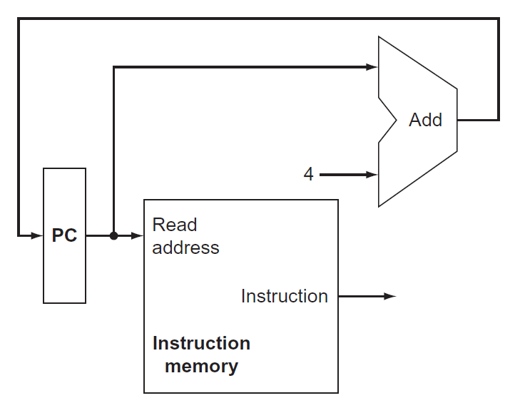
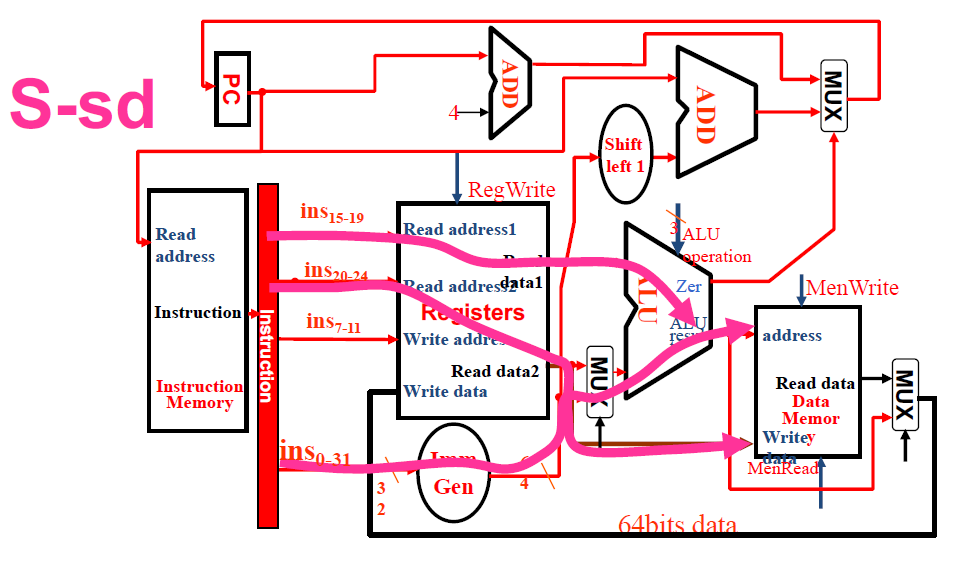
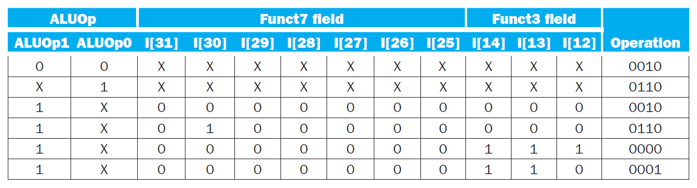
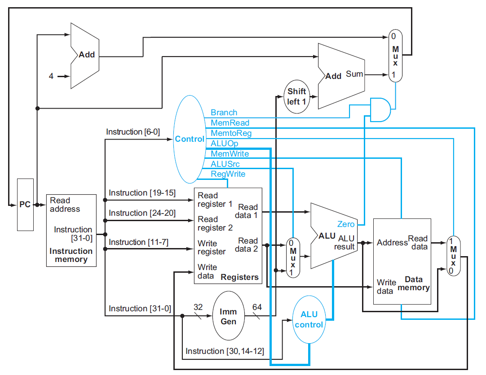
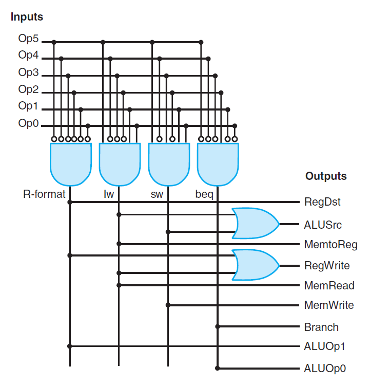
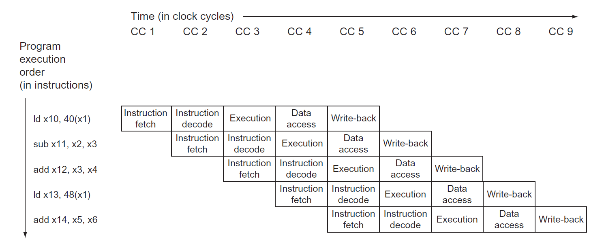
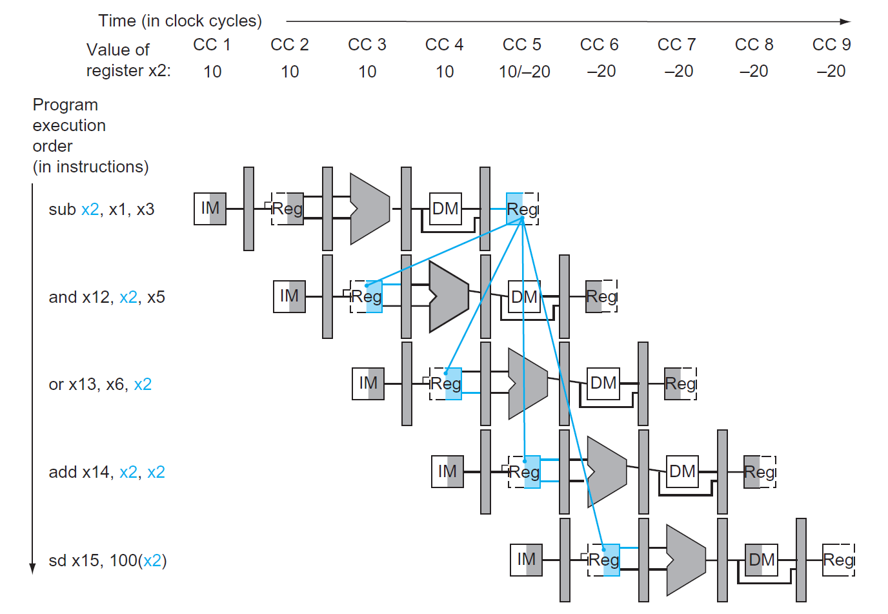

# Chap 4: The Processor

!!! info "前置知识"

    如果忘记以下知识，可以点击链接回顾一下：

    - [组合逻辑电路](../dld/3.md)
    - [时序逻辑电路](../dld/4.md)

## Single-Cycle

在第1章和第2章的学习中，我们已经知道：计算机的性能由以下因素衡量：

- **指令数**(instruction count)：取决于指令集架构(ISA)和编译器（[第2章](2.md)已介绍）
- **时钟周期**(clock cycle time)和每条指令周期数(**CPI**)：取决于CPU（第4章，也就是接下来要将的内容）

本章先介绍较为简单的单周期CPU（即一个时钟周期内只执行一条指令），之后会介绍更高效的流水线CPU。

CPU主要由两部分构成——**数据通路**(datapath)和**控制单元**(control unit)，我们将会按顺序介绍这两者。

### Datapath

#### Overview

RISC-V指令集架构下的最最简单的CPU应该要实现以下核心指令：

- **内存引用指令**(memory-reference instructions)：`ld`、`sd`...
- **算术逻辑指令**(arithmetic-logical instructions)/R型指令：`add`、`sub`、`and`、`or`...
- **条件分支指令**(conditional branch instructions)：`beq`...

>注：实验课上还需要我们实现更多的指令，包括与立即数相关的I型指令，以及无条件分支指令

下面简单介绍一下如何实现这些指令：

- 最开始的两步是相同的：
    - **取指**：将带有编码的PC（程序计数器）发给内存，从而得到内存中的指令
    - **译码**：根据指令的特定字段，读取一到二个寄存器内的数据（除了`ld`指令只需一个寄存器外，其他大多数指令需要两个寄存器）
- 后面的步骤则因指令的不同而不同：
    - **执行**：所有指令都会用到ALU，但是有不同的目的：
        - 内存引用指令：地址计算
        - 算术逻辑指令：执行算术逻辑运算
        - 条件分支指令：判断两数是否相等
    - **写回/访存**：ALU完成任务后，后续操作的区别会更大：
        - 内存引用指令：访问内存（加载 -> 读取数据（访存 + 写回），存储 -> 写下数据（访存））
        - 算术逻辑指令/加载指令：将ALU或内存中的数据写入寄存器中（写回）
        - 条件分支指令：根据比较结果，可能会改变下一条指令的地址（PC + 4 / 指定的指令地址）（写回）

>注：因此绝大多数指令只需四步即可完成，只有加载相关的指令需要五步。

下面给出对应的硬件框图（一个极简的处理器，只保留了最基本的功能，去掉了很多细节）：

<div style="text-align: center">
    
</div>

- 先来看左上角：PC的来源有两个：PC + 4（靠左的Add）或者来自指令内存的地址（靠右的Add）
- 再来看右边的ALU：第二个输入也有两个来源：寄存器或立即数

显然，一个输入端不可能同时接受两个来源的数据（用红笔标出的地方），因此需要用[**多路选择器**](../dld/3.md#multiplexer)(multiplexor)来选择其中一个来源，并且由控制单元来决定选择哪个来源，而控制单元是根据输入的指令来作判断的。此外，控制单元还负责功能的控制，比如寄存器和内存的读写、是否进行分支操作等。下图展示了添加控制单元后的硬件框图：

<div style="text-align: center">
    
</div>

- 前面提到的双来源输入都加入了MUX
- Branch用于决定是否进行分支跳转，只有当ALU结果为0（两数相等相减为0），且控制单元对应线路输入1时，PC的值为指定的地址
- 根据数逻的知识，我们可以将图中出现的元件归个类：
    - 组合元件(combinational elements)：ALU、MUX等
    - 状态（时序）元件(state elements)：内存、寄存器等

??? info "一些约定"

    - 如不做特殊说明，笔记中所涉及到的时序电路均属于上升沿触发的时序电路
    - 一些术语：
        - **有效**(asserted)：高电平
        - **无效**(deasserted)：低电平
        - 总线(bus)
    - 框图相关：
        - 用蓝色绘制控制单元和对应的线路

#### Elements

接下来，我们逐一讲解上面CPU硬件框图中的各个组成部分（数据通路元件(datapath elements)），以便更深入地了解数据通路。

- 取指令相关的数据通路元件（现在这个元件可以读取连续的指令）：

    <div style="text-align: center">
        
    </div>

    - 内存单元：存储程序的指令，并根据地址提供对应的指令
    - 程序计数器(program counter, PC)：保存当前指令的地址，本质上是一个寄存器
    - 加法器：递增PC，使其获得下一条指令的地址

- R型指令：

    <div style="text-align: center">
        
    </div>

    - **寄存器堆**(register file)（左图）：存储了所有的寄存器，通过指定具体的寄存器编号(register numbers)来控制对应寄存器的读写
        - 寄存器编号为5位，因为一共只有$2^5 = 32$个寄存器
        - R型指令需要两个可读的（源）寄存器和一个可写的（目标）寄存器
        - 读取数据只需输入寄存器编号即可，而写入数据除了额外输入写入的数据外，还要受控制信号`RegWrite`的控制，只有在`RegWrite = 1`时才可以进行写操作
    - 64位的ALU（右图）
        - 如果ALU结果为0，输出端`Zero = 1`，否则`Zero = 0`（一般用于条件指令）
        - 有1个4位的ALU运算的控制输入

- 内存访问指令：除了需要R型指令用到的两个元件外，还包括以下元件：

    <div style="text-align: center">
        
    </div>

    - 数据内存单元（左图）
        - 内存同时具备读（`ld`）和写（`sd`）的控制输入
    - 立即数生成单元（右图）：从32位指令中提取出与立即数相关的位，将这些位按正确的顺序拼接起来，同时对其**符号扩展**至64位

- 条件分支指令（仅考虑`beq`指令）

    <div style="text-align: center">
        
    </div>

    - 用到的元件：寄存器堆（包含两个寄存器，表示被比较的两个数）、立即数生成器（地址偏移量）、两个ALU（其中一个仅用于加法运算（`Add`），计算跳转目标地址）
    - 该数据通路元件要做的两件事：计算分支目标地址 + 检验寄存器内容
    - 一些细节问题：
        - 跳转地址的基(base)即为当前的分支指令的地址
        - 不要忘记：偏移量字段需左移一位！所以实际的偏移量是指定偏移量的两倍，且相邻偏移量相差2
    - 我们仅用ALU的`Zero`输出来获取比较结果

#### Composition

现在，我们将前面得到的数据通路元件组装起来！

- 残缺版：R型指令 + 内存访问指令

<div style="text-align: center">
    
</div>

- 完整版：

<div style="text-align: center">
    
</div>

- 这里标出了所有的控制信号（共7个），但是没有画出控制单元，因为现在我们只关心数据通路的结构

??? note "各类指令在数据通路中如何执行"

    虽然PPT上画的有点丑，但是画的比较清楚，便于理解。

    === "R型指令"

        <div style="text-align: center">
            
        </div>

    === "I型指令（`ld`）"

        <div style="text-align: center">
            
        </div>

    === "S型指令"

        <div style="text-align: center">
            
        </div>

    === "SB型指令"

        <div style="text-align: center">
            
        </div>

    === "J型指令"

        <div style="text-align: center">
            
        </div>


### Control Unit

#### The ALU Control

在所有的控制信号中，最重要的是ALU的控制信号（即上图的`ALU operation`），因为不管何种指令都需要用到这个元件，而且不同的指令会利用它达到不同的目的。

ALU控制信号一共有4位：

- 其中2位分别来自指令中的`funct3`和`funct7`字段
- 另外2位则来自一个称为`ALUOp`的字段，它来自主控制单元(main control unit)，用于指定具体执行何种指令，不同的值对应不同的类型：
    - `00`：加载/存储
    - `01`：`beq`指令
    - `10`：R型指令

下表展示了ALU控制信号及对应的操作：

|Instruction opcode|ALUOp|Opearation|Funct7 field|Funct3 field|Desired ALU action|ALU control Input|
|:-|:-|:-|:-|:-|:-|:-|
|ld|00|load doubleword|XXXXXXX|XXX|add|0010|
|sd|00|store doubleword|XXXXXXX|XXX|add|0010|
|beq|01|branch if equal|XXXXXXX|XXX|subtract|0110|
|R-type|10|and|0000000|111|AND|0000|
|R-type|10|or|0000000|110|OR|0001|
|R-type|10|add|0000000|000|add|0010|
|R-type|10|sub|0100000|000|subtract|0110|
|R-type|10|slt|0000000|010|slt|0111|
|R-type|10|srl|0000000|101|srl|0101|
|R-type|10|xor|0000000|011|xor|0011|


对应的真值表为（老规矩，用$\times$表示不关心(don't care)项）：

<div style="text-align: center">
    
</div>

---
可以看到，我们并没有用主控制单元来直接控制所有需要控制的元件，比如用ALU控制（`ALUOp`）来控制ALU，再由主控制单元改变`ALUOp`的值——这样的设计风格称为**多级控制**(multiple levels of control)，它的优势在于：

- 减小主控制单元的规模
- 减小对控制单元的潜在危害（负责某个功能的控制单元坏掉了并不会影响其他的控制单元），这对时钟周期有很大的影响

#### Main Control Unit

接下来，我们还要处理剩余的6个控制信号。在此之前，有必要回顾一下这里涉及到的指令格式：

<div style="text-align: center">
    
</div>

将这些指令格式应用于上面给出的完整版数据通路图，你将会更深入地理解什么是"**simplicity favors regularity**"了：

<div style="text-align: center">
    
</div>

正因为我们设计的指令格式相当规整（即使不同的指令也具备相似的格式），因此这有效降低了设计电路的成本。

现在再来看剩余6个控制信号的作用：

<div style="text-align: center">
    
</div>

- `RegWrite`、`MemRead`、`MemWrite`：它们在低电平的时候均无作用，高电平时会允许寄存器/内存的读写
- `ALUSrc`：低电平时ALU获取第2个寄存器的值，高电平时ALU获取立即数
- `PCSrc`：低电平时PC将会保存下一条连续指令的地址（PC + 4），高电平时PC将会保存分支目标地址
- `MemtoReg`：低电平时将ALU的结果返回给目标寄存器，高电平时将内存中的数据传给目标寄存器

最后，我们将所有的控制信号交给主控制单元管理，一个完整的简易版单周期CPU的硬件框图如下所示：

<div style="text-align: center">
    
</div>

对应的控制信号表（输入为Opcode的前7位）：

<div style="text-align: center">
    
</div>

补充：`jal`对应的输入和输出

- 输入：1101111
- 输出：
    - `ALUsrc`：X
    - `MemtoReg`：10
    - `RegWrite`：1
    - `MemRead`：0
    - `MemWrite`：0
    - `Branch`：0
    - `ALUOp1`：X
    - `ALUOp2`：X
    - （补充，其他类型指令中该字段值为0）`Jump`：1

逻辑电路图：

<div style="text-align: center">
    
</div>


#### Operation of the Datapath

=== "R型指令（以`add x1, x2, x3`为例）"

    <div style="text-align: center">
        
    </div>

    执行指令的步骤：

    1. 从指令内存中获取指令，并递增PC
    2. 从寄存器堆读取寄存器`x2`和`x3`，同时主控制单元设置好对应的控制信号
    3. ALU根据操作码确定运算类型，然后对上步中读取的数据进行计算
    4. 将ALU的计算结果写入目标寄存器`x1`

=== "内存访问指令（以`ld x1, offset(x2)`为例）"

    <div style="text-align: center">
        
    </div>

    执行指令的步骤：

    1. 从指令内存中获取指令，并递增PC
    2. 从寄存器堆读取寄存器`x2`
    3， ALU计算寄存器`x2`的数据和符号扩展后的12位立即数之和，该结果作为数据的内存地址
    4. 将对应的内存数据写入寄存器堆内（`x1`）

=== "条件分支指令（以`bqe x1, x2, offset`为例）"

    <div style="text-align: center">
        
    </div>

    执行指令的步骤：

    1. 从指令内存中获取指令，并递增PC
    2. 从寄存器堆读取寄存器`x1`和`x2`
    3. ALU将读取的两个数据相减；同时将PC的值与左移1位之后的立即数相加，得到分支目标地址
    4. 通过ALU的`Zero`信号来决定如何更新PC

#### Conclusion

现代的计算机不会用到这种单周期的CPU，因为规定每个时钟周期的长度一致，因此CPU中的最长通路决定了时钟周期的长度，从而导致CPU的低效。改进方法是用到流水线(pipelining)的思想，这种思想现在仍用于CPU的设计中，我们将在下一节介绍。


## Pipelining

### Overview

所谓的**流水线**(pipeline)，是一种使多条指令能够被重叠执行的实现技术，类似工厂里的组装线。在正式介绍流水线CPU之前，建议先看看下面的类比，对流水线的概念有一个大致的印象。

??? example "类比"

    假设我们要洗一堆脏衣服，将这件事分为四个步骤：用洗衣机洗、用烘干机烘干、折叠衣物、放入衣柜，并且为了方便后续解释，假定这四个步骤所花的时间是一样的。现在有四堆脏衣服要洗，如果一个时间段只完成一个步骤，那么整个过程如下所示（耗时：16）：

    <div style="text-align: center">
        
    </div> 

    但如果我们采用流水线的思想来洗这四堆衣物，那么整个过程所花的时间就会显著缩短（耗时：7）：

    <div style="text-align: center">
        
    </div> 

    - 可以看到，在每个阶段(stage)（即单位时间）内，我们可以并行执行多个任务。<u>流水线虽然没有缩短单步所花的时间（即时延(latency)），但是它增加了每个阶段内能够执行的任务（即增大了**吞吐量**(throughput)），从而缩短完成整个任务的总时间。</u>
    - 但并不是每个阶段内执行所有的任务，开头和结尾部分的阶段仅执行部分任务。如果任务数特别大的话，这并不会影响整体的性能。

!!! warning "注意"

    流水线CPU的时钟周期 = 耗时最长的**阶段**所花的时间

在RISC-V中，为了实现流水线指令的执行，需要将单个RISC-V指令划分为5个阶段（前面已经提到过，但在流水线一节中用到的更多一些），如下所示：

- **IF（取指）**：从内存中获取指令
- **ID（译码）**：读取寄存器，对指令进行译码
- **EX（执行）**：执行（算术/逻辑）运算或计算地址
- **MEM（访存）**：从数据内存中访问操作数
- **WB（写回）**：将结果写回寄存器中


用图形符号表示这五个阶段：

<div style="text-align: center">
    
</div> 

- 图形的左半边阴影表示写入，右半边阴影表示读取，全阴影表示两者皆有
- 之所以如此规定，是因为这里假设在一个时钟周期内，元件的前半个周期可以进行**写**操作，后半个周期可以进行**读**操作

本章讨论的流水线CPU均为这种五级流水线CPU，即单个时钟周期内至多能并行执行五个阶段的CPU。

??? example "例子：比较单周期和流水线的性能"

    假如规定内存访问、ALU操作所花的时间为200ps，寄存器读写所花时间为100ps，且规定单周期CPU单个周期内只执行一条指令。各种指令的执行时间如下所示：

    <div style="text-align: center">
        
    </div> 

    现需要执行以下指令：

    ```asm
    ld x1, 100(x4)
    ld x2, 200(x4)
    ld x3, 400(x4)
    ```

    那么单周期CPU和流水线CPU执行这段指令所花的时间如下所示：

    <div style="text-align: center">
        
    </div> 

    - 对于单周期CPU，因为周期的时长取决于执行时间最长的**指令**所花的时间，因此它的周期为800ps。执行3个`ld`指令所花时间为3 * 800 = 2400ps
        - 所以，这违背了"Make the common case fast"的设计原则
    - 对于流水线CPU，它将`ld`指令的执行分为五个阶段，它的周期时长则取决于执行时间最长的**阶段**所花的时间。因此即使内存读写时间为100ps，但它也还是要执行200ps。执行3个`ld`指令所花的时间为7 * 200 = 1400ps 

对于流水线和单周期CPU执行指令的总时间，我们有以下公式：

$$
\text{Time between instructions}_{\text{pipelined}} = \dfrac{\text{Time between instructions}_{\text{nonpipelined}}}{\text{Number of pipe stages}}
$$

然而这个公式仅在理想条件下（每个阶段花费相同的时间），比如且指令数很多的情况下较为准确，否则计算结果与实际情况之间有不小的偏差。（比如上面的例子中只执行了3条指令，单周期和流水线CPU的执行时间之比并不等于阶段数；然而当执行1,000,000条指令时，执行时间之比就近似等于阶段数。）

RISC-V指令集的设计很好地适配了流水线执行：

- 所有的指令都是等长的（32位），这便于取指和译码
- 指令格式少而规整，比如在不同指令中，源寄存器和目的寄存器字段位于同一位置上
- 只有加载和存储指令涉及到内存操作数

#### Graphical Representation

在介绍流水线CPU的过程中，经常会用到以下两种图示法来表示：

- 多时钟周期流水线图(multiple-clock-cycle pipeline diagrams)
    - 优势：对流水线指令的大致概括，使人一目了然
    - 电子元件表示法

    <div style="text-align: center">
        
    </div> 

    - 传统的文字表示法

    <div style="text-align: center">
        
    </div> 

- 单时钟周期流水线图(single-clock-cycle pipeline diagrams)
    - 优势：展现更多的实现细节，便于理解指令的执行原理

    <div style="text-align: center">
        
    </div> 

#### Pipeline Hazards

在流水线CPU的运行中，可能会遇到无法继续执行下条指令的情况，这称为**流水线冒险**(pipeline hazards)。有以下几类不同的冒险类型：

- **结构冒险**(structural hazard)：因硬件不支持某些指令的组合（比如在同一时段访问同一资源的两条指令）而无法继续执行指令
    - 举例：多条加载/存储指令在同一个时钟周期对同一内存进行访问
    - 解决方法：需要在IF阶段停止运行后面的指令，且最好有多个单独的内存
    - 该问题常出现于浮点数程序中
- **数据冒险**(data hazard)：因指令尚未得到所需的数据而不得不停下来(stall)，直到获取数据后才继续执行
    - 原因：指令之间存在依赖关系，而且这些依赖关系在指令中出现得十分频繁
    - 解决方案：添加额外的硬件（称为**前递**(forwarding)或**旁路**(bypassing)，下图用蓝色连线表示），从内部资源中检索指令所缺失的数据

        <div style="text-align: center">
            
        </div> 

        - 注意：只有当目标阶段比源阶段发生的更晚，或位于同一时刻时，这种前递才是合法的（即这根蓝色连线从左上到右下，或是一根竖直的线）
        - 具体的实现可见[下面的小节](#forwarding)
    - 上面的图给出的是两个R型指令的执行，只要加一个前递就能保证指令的连续执行。但是如果先执行加载指令，后执行依赖于该加载指令数据的指令，即使加了一个前递，CPU还是不得不暂停一个时钟周期，这种情况称为**加载使用数据冒险**(load-use data hazard)，如下图所示：

        <div style="text-align: center">
            
        </div>

        - 这种暂停的操作则称为**流水线停顿**(pipeline stall)（或者叫做**冒泡**(bubble)），上图中用蓝色的气泡图表示
        - 具体的实现可见[下面的小节](#stalling)
        - 虽然这种停顿能够解决此类数据冒险，但这么一停顿肯定会损失一些时间，所以如果可以的话，应尽量避免停顿。一种做法是：由硬件侦测加载使用数据冒险是否发生，若发生的话由软件重新为指令排序，使其尽可能地减少停顿

        ??? example "例子"

            将以下C语言转化为RISC-V汇编语句：

            ```c
            a = b + e;
            c = b + f;
            ```

            很自然地，我们得到以下汇编代码：

            ```asm hl_lines="2-3 5-6"
            ld  x1, 0(x31)
            ld  x1, 0(x31)
            add x3, x1, x2
            sd  x3, 24(x31)
            ld  x4, 16(x31)
            add x5, x1, x4
            sd  x5, 32(x31)
            ```

            高亮的指令便是数据冒险发生的地方，为了减少停顿，需要调整这些指令的顺序，在这里我们只需要将第3个`ld`指令提到前面来就行了（想想其中的原因）：

            ```asm hl_lines="3"
            ld  x1, 0(x31)
            ld  x1, 0(x31)
            ld  x4, 16(x31)
            add x3, x1, x2
            sd  x3, 24(x31)
            add x5, x1, x4
            sd  x5, 32(x31)
            ```       

            ??? hint "提示"

                <div style="text-align: center">
                    
                </div>            


    - 该问题常出现于整数和浮点数程序中

- **控制冒险/分支冒险**(control hazard/branch hazard)：取到的指令并不是CPU所需要的，即指令地址的流向并不在CPU的预期内（~~好奇怪的表述~~）
    - 举例：由于`beq`指令在IF阶段中还不清楚它包含的跳转地址，因此在下个时钟周期还不能执行下一条指令，需要等`beq`指令译码完成后再执行
    - 有两种可能的解决方案：
        - 停顿：让`beq`指令与下一条指令之间有一个固定的停顿（多等1个时钟周期）。这样虽然是稳扎稳打的做法，但是效率太低了。

            <div style="text-align: center">
                
            </div>


        - **分支预测**(branch prediction)：预先假设每次执行`beq`指令后，都会跳转到下一条连续指令（`PC + 4`），而不是跳转到指定指令（这是一种**静态预测**(static prediction)方法）
            - 如果预测正确，就无需停顿，可以连续地执行指令了（上图）
            - 而预测失败的话就要撤回那个错误的下条指令，这需要额外的一个时钟周期，其效果与停顿一样（下图）
            - 由于既能解决控制冒险，也保证了速度，因而这种方法实际用于RISC-V中

            <div style="text-align: center">
                
            </div>

            - 还有一种优化的方法——**动态预测**(dynamic prediction)，比如为每个分支指令分别保存历史记录，当下次执行分支指令时会根据上一次的执行情况选择是否跳转到指定地址。这种方法考虑到了不同分支指令的执行情况，从而做出更明智的预测

        - 延迟决策(delayed decision)：用于MIPS指令，这里就不作介绍了
    - 该问题常出现于整数程序中


### Pipelined Datapath

根据指令执行的五个阶段，用虚线将单周期CPU的数据通路划分为五个部分：

<div style="text-align: center">
    
</div>

不难发现，大多数指令在原理图的执行顺序为从左到右，但也有一些例外：

- 最后的写回阶段中，将内存的数据写入寄存器的线路方向是从右往左的（可能会导致数据冒险）
- PC寄存器的输入数据（`PC + 4`和指定分支地址）是从右往左传递给PC左边的MUX的（可能会导致控制冒险）

来看下面这个例子：

<div style="text-align: center">
    
</div>

这里要连续执行三个`ld`指令。可以看到对于每条指令，指令内存只用了一次（取指阶段），因为指令内存还要供后面的指令使用，但是指令剩余阶段的执行需要知道指令的内容，所以需要用寄存器来保存尚在执行的指令。这样的寄存器称为**流水线寄存器**(pipeline registers)，这些寄存器位于各阶段之间的中间位置，用于保存指令执行各阶段产生的数据，供下一阶段使用。一共有4类这样的寄存器，分别称为IF/ID, ID/EX, EX/MEM, MEM/WB，如下图所示：

<div style="text-align: center">
    
</div>

下面将在这个流水线数据通路上演示加载指令和存储指令的执行过程，以便更好地理解整个数据通路的原理

!!! note "分析"

    === "加载指令"

        === "取指"

            <div style="text-align: center">
                
            </div>

            这需要将PC寄存器内的指令地址保存给流水线寄存器IF/ID，以供下一条指令使用（比如`beq`指令），因为此时CPU还不知道指令的内容，因此需要及时保存

        === "译码"

            <div style="text-align: center">
                
            </div> 

            除了要将指令地址传给流水线寄存器ID/EX，还要将两个源寄存器的数据和立即数传给ID/EX，因为它们很有可能在之后的阶段中用到

        === "执行"

            <div style="text-align: center">
                
            </div> 

            需要将计算好的地址放入流水线寄存器EX/MEM

        === "访存"

            <div style="text-align: center">
                
            </div> 

            从EX/MEM读取内存地址，将对应的内存数据写入流水线寄存器MEM/WB内

        === "写回"

            <div style="text-align: center">
                
            </div> 

            从MEM/WB内读取数据，将其写入寄存器堆


    === "存储指令"

        === "取指&译码"

            前两步和加载指令基本一致，故略过（虽然在指令格式上有细微的差别，但在逻辑原理图中无法体现）

        === "执行"

            <div style="text-align: center">
                
            </div> 

            EX/MEM除了要保存计算出来的地址外，还要保存需要被写入内存的数据

        === "访存"

            <div style="text-align: center">
                
            </div> 

            将EX/MEM存储的数据，写入也是由它存储的内存地址对应的内存位置上。此阶段无需使用MEM/WB寄存器

        === "写回"

            <div style="text-align: center">
                
            </div> 

            存储指令无需写回这一步，因此无事发生。但这是个五级流水线CPU，每条指令必须经历五个阶段，即五个时钟周期，所以即使啥也不做也要等这一段时钟周期结束才算完成

这个版本的数据通路有一个bug：在加载指令的最后阶段，我们需要将内存数据写回给哪个寄存器呢？是的，我们忘记保存了目标寄存器的编号。下面给出修正过的数据通路原理图，其中蓝色部分为用于保存目标寄存器编号的部分。

<div style="text-align: center">
    
</div> 

### Pipelined Control

先将单周期CPU的控制信号加入进来，得到以下原理图：

<div style="text-align: center">
    
</div> 

- 由于在每个时钟周期内，PC寄存器和流水线寄存器都要进行写操作，所以它们不需要用一个单独的写入信号来控制
- 考虑流水线指令的每个阶段所涉及到的控制信号
    - 取指：无
    - 译码：无
    - 执行：`ALUOp`、`ALUSrc`，分别用于控制ALU运算和决定ALU第二个操作数用哪个（`rs2` or `imm`）
    - 访存：`Branch`（包括`PCSrc`）、`MemRead`、`MemWrite`，分别对应`beq`指令、加载指令和存储指令
    - 写回：`MemtoReg`
- 所以实际上无论是功能还是取指，这些控制信号和单周期的CPU没有什么区别，下面总结了一张流水线CPU的控制信号表：

<div style="text-align: center">
    
</div> 

- 同样地，这些控制信号也需要用流水线寄存器来保存和传递，确保当前执行的指令接收正确的控制信号

<div style="text-align: center">
    
</div> 

最后，我们给出更加完整的流水线CPU的原理图，包括了完整的数据通路和控制器（但没有考虑任何的流水线冒险问题，这个问题下面马上就会解决的）

<div style="text-align: center">
    
</div> 

### Data Hazards

在[前面](#pipeline-hazards)我们大致介绍过数据冒险的问题及其解决方案：**前递**(forward)和**停顿**(stall)，本节将会从逻辑设计的角度上来介绍如何具体实现这些方法。

#### Forwarding

给定以下指令段：

```asm
sub x2, x1, x3
and x12, x2, x5
or  x13, x6, x2
add x14, x2, x2
sd  x15, 100(x2)
```

可以看到，后面四条指令的输入均依赖于第一条指令的输出结果`x2`，所以很明显产生了数据冒险的问题，下面的多周期流水线图可以更清楚地显示这个问题：

<div style="text-align: center">
    
</div> 

可以看到，左边几根蓝线的方向是不对的，我们不可能将未来得到的数据传给过去要用到该数据的指令，所以`and`和`or`指令得到的是错误的`x2`（其值为10），而`add`和`sd`指令得到的`x2`是正确的（其值为-20）。

为了解决这个问题，首先要做的是**依赖侦测**(dependency detection)：确定何时发生数据冒险问题。下面用符号化的语言归纳了两大类数据冒险的情况：

- EX/MEM.RegisterRd = ID/EX.RegisterRs1(or ID/EX.RegisterRs2)
- MEM/WB.RegisterRd = ID/EX.RegisterRs1(or ID/EX.RegisterRs2)

其中等号的左右两边对应的是不同的指令，且等号右边对应的指令依赖于左边对应指令的结果。如果满足上述情况，等号左半边的寄存器的数据应当**前递**给等号右半边的寄存器。

对于上例，`sub`和`add`指令间的数据冒险属于第一类（EX/MEM.RegisterRd = ID/EX.RegisterRs1），而`sub`和`or`指令间的数据冒险属于第二类（MEM/WB.RegisterRd = ID/EX.RegisterRs2）。下图展示了正确实现前递的流水线图：

<div style="text-align: center">
    
</div> 

上面的判断方法还存在一些小瑕疵：

- 首先，并不是所有的指令都包含写入寄存器的操作，所以需要提前检测`RegWrite`信号是否为1，若是则继续进一步的判断；否则就直接pass掉，不用担心数据冒险的问题
- 其次，如果某个指令目标寄存器是`x0`的话，那么我们不希望将可能的非0结果（比如`addi x0, x1, 2`）前递给别的指令，避免带来不必要的麻烦，所以在依赖侦测前还得进行这一步的判断

综上，我们进一步修正依赖侦测的判断条件，并且将数据冒险细分为**执行阶段(EX)冒险**和**访存阶段(MEM)冒险**两类，得到以下语句：

```cpp hl_lines="12-13 18-19"
// EX hazard
if (EX/MEM.RegWrite and (EX/MEM.RegisterRd != 0)
    and (EX/MEM.RegisterRd = ID/EX.RegisterRs1))
        ForwardA = 10

if (EX/MEM.RegWrite and (EX/MEM.RegisterRd != 0)
    and (EX/MEM.RegisterRd = ID/EX.RegisterRs2))
        ForwardB = 10

// MEM hazard
if (MEM/WB.RegWrite and (MEM/WB.RegisterRd != 0)
    and not(EX/MEM.RegWrite and (EX/MEM.RegisterRd != 0)
        and (EX/MEM.RegisterRd = ID/EX.RegisterRs1))
    and (MEM/WB.RegisterRd = ID/EX.RegisterRs1))
        ForwardA = 01

if (MEM/WB.RegWrite and (MEM/WB.RegisterRd != 0)
    and not(EX/MEM.RegWrite and (EX/MEM.RegisterRd != 0)
        and (EX/MEM.RegisterRd = ID/EX.RegisterRs2))
    and (MEM/WB.RegisterRd = ID/EX.RegisterRs2))
        ForwardB = 01
```

- 高亮部分的语句理解起来可能不是那么直观：这是为了避免MEM/WB.RegisterRd, EX/MEM.RegisterRd和ID/EX.RegisterRs1(2)三者一起发生冲突，造成新的数据冒险问题
- 这里设置了两个前递信号：`ForwardA`和`ForwardB`，它们实质上是MUX的控制信号，而这两个MUX分别用来决定参加ALU运算的两个操作数。下表展示的是不同MUX控制信号对应的功能：

<div style="text-align: center">
    
</div> 

- 默认`ForwardA = 00`, `ForwardB = 00`

理论部分分析完毕，接下来我们将前递的功能添加到逻辑原理图中。下面这张图只展示了与前递相关的阶段（最后三个阶段）的元件

<div style="text-align: center">
    
</div> 

而这张图展示了加入前递单元后的整个流水线CPU：

<div style="text-align: center">
    
</div> 


#### Stalling

虽然前递能够解决大多数情况下的数据冒险问题，但还是无法克服与加载指令相关的数据冒险问题。前面提到过此类问题的解决方法是**停顿**(stall)一个时钟周期，那么何时需要停顿呢？所以需要在原来的CPU中再加入一个**冒险侦测单元**(hazard detection unit)，用于发现合适的停顿时机。与上面的分析类似，这里我们也给出它的判断条件：

```cpp
if (ID/EX.MemRead and        // MemRead represents load instruction
    ((ID/EX.RegisterRd = IF/ID.RegisterRs1) or (ID/EX.RegisterRd = IF/ID.RegisterRs2)))
    stall the pipeline       // the load instruction is stalled in the ID stage
```

具体来说要想停止流水线的运行，需要做到（这也是冒险侦测单元的三个输出）：

- 停止IF：不能改变PC寄存器的值（读取重复的指令），所以要为PC寄存器添加写信号PCWrite
- 停止ID：不能改变IF/ID流水线寄存器的值（读取重复的值）所以要为该寄存器添加写信号IF/IDWrite
- 停顿的那段时间，虽然CPU仍然在运行，但实际上没有改变任何状态，这种情况称为**空操作**(nops)。为了保证所有元件状态不变，还需要确保所有的控制信号均为0<span class="heimu">（事实上，只有RegWrite和MemWrite一定要设为0，其他的控制信号是don't care的）</span>

下面展示添加了冒险侦测单元后的流水线CPU原理图：

<div style="text-align: center">
    
</div> 

这样的流水线CPU就可以解决由加载指令带来的数据冒险问题了~

??? example "例子"

    对于以下指令段：

    ```asm
    ld  x2, 20(x1)
    and x4, x2, x5
    or  x8, x2, x6
    add x9, x4, x2
    sub x1, x6, x7
    ```

    如果只用前递来解决数据冒险的话，效果是这样的：

    <div style="text-align: center">
        
    </div> 

    可以看到，`ld`和`and`指令间存在数据冒险问题。如果加入了冒险侦测单元的话，就能在执行加载指令时及时停顿整个流水线，从而避免了加载指令带来的数据冒险问题，最终效果如下所示：

    <div style="text-align: center">
        
    </div> 


### Control Hazards


## Exceptions


### Parallelism via Instructions


## Fallacies and Pitfalls