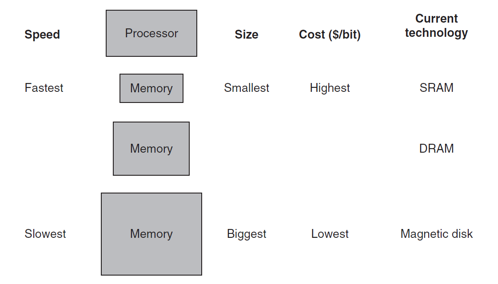
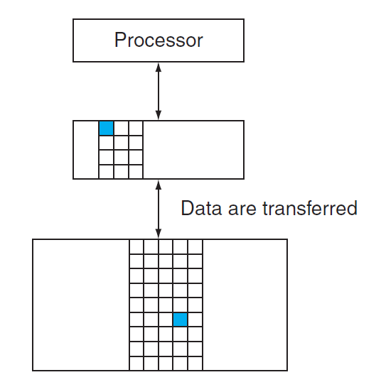
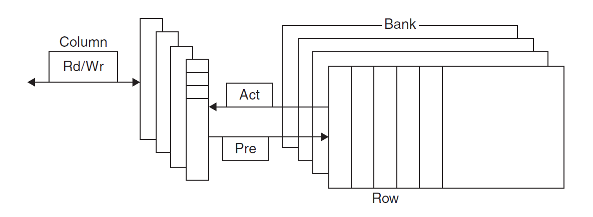
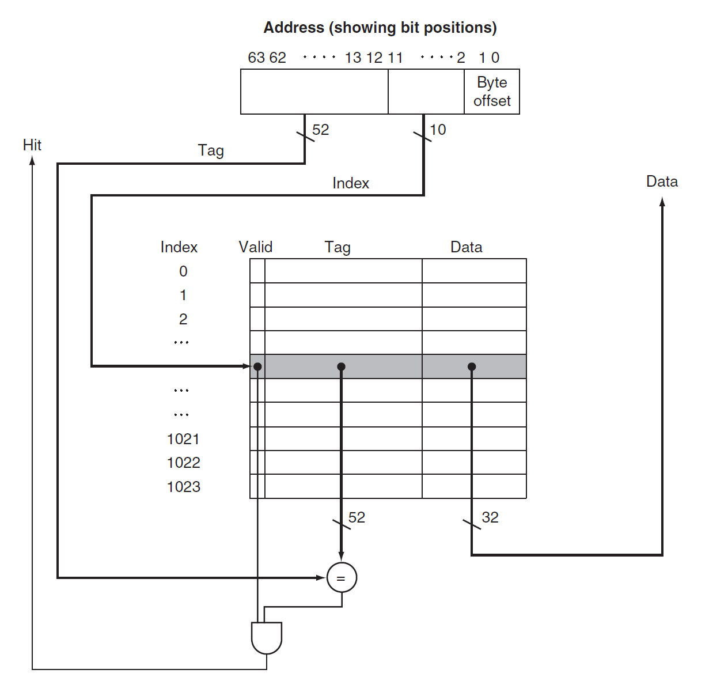
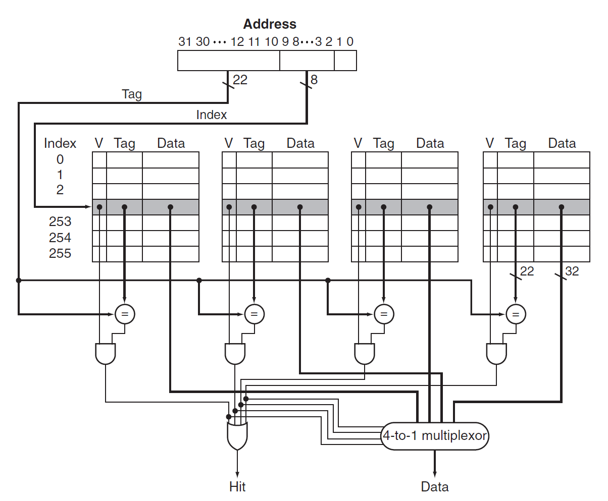

# Chap 5: Memory Hierarchy

## Introduction

内存层级中涉及到的一个重要思想是「局部性原则」(principle of locality)，它由以下两部分组成：

- **时间局部性**(temporal locality)：如果内存的某个项目被用到过，那么在短时间内它很有可能被再次使用
    - 举例：循环中的指令很可能会被重复访问

- **空间局部性**(spatial locality)：如果内存的某个项目被用到过，与它地址邻近的项目很可能在不久后也会被使用
    - 举例：通常指令是按顺序执行的、按顺序访问数组元素

**内存层级**(memory hierarchy)：一种多级的存储结构，它规定：越靠近处理器的内存，它的访问时间更短、存储空间更小、成本更高。

    

    

- 更靠近处理器的一级内存是离处理器更远的内存的一个子集，且所有的数据被存储在最底层的内存中
- 在一个时间段内，数据只能在相邻的两个内存层级之间进行传输（复制），因此在同一时间内我们仅关注相邻的两级内存结构

与内存层级相关的一些基本概念：

- 块/行(block/line)：在两级内存结构中的最小信息单元（下图标出的蓝色方块）

    

- **命中**(hit)：处理器所需的数据出现于上层内存中
    - **命中率**(hit rate)：能够在上层内存中找到数据的比率
    - **命中时间**(hit time)：访问上层内存所需的时间，包括判断是否命中或失效所需的时间

- **失效**(miss)：处理器所需的数据不存在于上层内存中，此时需要访问下层内存的内容并检索所需数据
    - **失效率**(miss rate)（= 1 - 命中率）：未能在上层内存中找到数据的比率
    - **失效损失**(miss penalty)：从下层内存中获取所需数据块的时间，包括以下操作：访问数据块、将数据从下层传输到上层、将数据插入上层内存的合适位置、将数据块继续传给处理器

## Memory Technologies

内存中常用的四大工艺：

- **SRAM**（静态随机访问存储器）：
    - 它只有一个访问端口，具备读和写的能力
    - 尽管读和写的访问时间不同，访问任何数据所需的时间是固定的
    - 由于无需刷新(refresh)，因此访问时间接近于处理器的周期时间
    - 通常，它用6-8个晶体管表示一个位，用于防止读取对存储信息的干扰
    - 耗电少

- **DRAM**（动态随机访问存储器）：
    - 1位数据以电荷的形式被存储在1个电容中
        - 因此需要周期性地对电容**刷新**(refresh)以长时间保存电荷，具体做法就是读取并且写回该数据
        - 为了减少刷新对访问时间的占用，DRAM通过两级译码结构实现一次性刷新一整行的数据（这种行结构也有助于提升性能）
    - 用1个晶体管对数据（电荷）进行访问（读/写）（晶体管用比SRAM少，因此更便宜）
    - DRAM内部被划分为多个**存储体**(memory bank)，每个存储体都有一些**行缓冲器**(row buffer)，这样可以实现对同一地址的同步访问
        - 假如有n个存储体，在一个访问时间内便能轮换访问n个存储体，使得带宽提升了n倍，这种轮换访问方法被称为地址交错(address interleaving)

        

            
        

    - 各种类型：
        - SDRAM（同步DRAM）：通过一个时钟来消除同步内存和寄存器所需的时间
        - DDR(double data rate) SDRAM：能在时钟的上升沿和下降沿中进行数据传输，从而提升了一倍的带宽(bandwidth)
        - 双内联内存模块(dual inline memory module)
    
- **闪存**(flash memory)：
    - 它是一种电子可擦除、可编程只读存储器(EEPROM)
    - 写操作可能会磨损存储器内的数据
    - 为减缓磨损，闪存会用一个控制器来分散(spread)写操作，这称为**磨损均衡**(wear leveling)

- **磁盘**(disk memory)：
    - 磁盘由一组绕轴旋转的金属盘片(platter)构成，盘片上覆有磁记录材料，通过一个读写头(read-write head)来读写信息，整个驱动器被密封在磁盘内部
    - 迹(track)：磁盘表面上的同心圆
    - 区(sector)：构成迹的某个片段，是能够被读写的最小单位的信息
    - 柱面(cylinder)：读写头下所有的迹（形成一个柱面）
    - 磁材料上记录的序列：区号、间隔、包含纠错码的区信息、间隔、下个区的编号...
    - 寻找(seek)：定位读写头到要被访问的迹的过程
    - 旋转时延(rotation latency)：将要访问的区旋转至读写头下所需的时间，通常假设为旋转时间的一半
    - 传输时间(transfer time)

## Basics of Caches

**缓存**(cache)：在内存层级中表示介于处理器和主内存之间的层级，也可以指代任何借助局部访问优势的存储器。但本章内容所涉及到的「缓存」均指<u>处理器内部的缓存</u>。

先考虑一种很简单的缓存，以及一个很简单的情况：假如处理器请求一个单字数据$X_n$，缓存的内容发生了如下的变化：

    

由于原来缓存内只有数据$X_1, X_2, \dots, X_{n-1}$，因此$X_n$不在缓存内，所以出现了失效的情况，需要从更底层的内存中获取该数据，并且放在缓存中。那么我们如何得知数据是否在缓存中，且如何找到该数据呢？

最简单的方法是让每个字数据基于内存地址进行定位，这能够确保每个字数据占据唯一的一块空间，这种缓存结构称为**直接映射缓存**(direct-mapped cache)。可以用下面的公式计算字数据在缓存中的位置：

$$
\text{Cache Location} = \text{(Block address) modulo (Number of blocks in the cache)}
$$

一般情况下，缓存块的个数是2的幂，那么这个模除运算就可以转化为对数运算$\log_2$。

不难发现，可能会存在不同字数据占据相同缓存块的情况，这里我们用**标签**(tag)来区分数据。因为底层内存的空间更大，因此通常会用数据在底层内存的低位地址来表示在缓存中的地址，而**高位地址**就作为区分相同缓存块下不同数据的标签，如下图所示：

    

上面的图片中，缓存块数为8，而内存块数为32，因此字数据内存地址的低3位对应它在缓存中的地址（灰色和蓝色表示两类低位地址），而高2位则作为区分同一缓存块下的不同数据的标签。

另外，我们还需要用一个称为**合法位**(valid bit)的字段来指示内存块里的数据是否合法。

### Cache Access

???+ example "例子"

    我们对一个八块的缓存进行九次访问：

    

        
    

    下图展示了在访问过程中缓存内容的变化：

    

        
    

    不难发现，第8次访问（$\mathtt{18 = 10010}_{\text{two}}$）与第2次访问（$\mathtt{26 = 11010}_{\text{two}}$）存在冲突，因为它们占据相同的缓存块。这种情况下，最近访问的数据将会占据该缓存块的位置（即覆写缓存块内已有的数据），这体现了时间局部性的思想。

下图展示了内存地址（假定为64位）与缓存位置之间的关系：

    

正如前面提到过的，我们可以将内存地址分为以下几部分：

- **标签字段**：用于区别相同缓存块下的不同数据
- **缓存索引**：用于选择缓存块
- 由于一个地址表示一个字节，并且在缓存中数据是以「字」（4字节）为单位的，因此地址的低2位可以被忽略

!!! note "计算直接映射缓存的空间大小"

    给定以下条件：

    - 64位的内存地址
    - 共有$2^n$个缓存块，因此用$n$位地址来表示索引
    - 每个缓存块可容纳$2^m$个字数据（即$2^{m+2}$字节的数据），因此用$m$位地址来表示字

    那么剩下用于表示标签字段的位数为：$64 - (n + m + 2)$

    缓存空间大小的计算公式为：

    $$
    \begin{align}
    &\ 2^n \times (\text{block size} + \text{tag size} + \text{valid field size}) \notag \\
    = &\ 2^n \times (2^m \times 32 + (64 - n - m - 2) + 1) \notag \\
    = &\ 2^n \times (2^m \times 32 + 63 - n - m) \notag \quad (\text{unit: bit})
    \end{align}
    $$

    对于上面给出的缓存，它有$2^{10}$个缓存块（有10位索引位），每个缓存块仅有$2^0$个字数据，因此它的标签位有52位。

!!! info "注"

    在一般的命名传统中，我们仅用缓存存储的子数据大小来表示缓存。对于上面的缓存，由于它一共可容纳1024个字数据，即4096字节的数据，因此可以称其为4 KiB缓存。

???+ example "例题"

    === "例1"

        === "题目"

            若一个缓存可容纳16 KiB的数据，且每个缓存块可容纳四个字数据（假定使用64位地址），那么该缓存所需的空间大小是多少呢？（单位：位）

        === "解答"

            - 先计算缓存块的个数：由题意缓存可容纳4096个字，又因每个块可装四个字，因此一共有1024个块
            - 标签位数为：64 - 10 - 2 - 2 = 50
            - 所以总的空间大小为：

            $$
            2^{10} \times (4 \times 32 + 50 + 1) = 2^{10} \times 179 = 179 \text{ Kibibits} = 22.4\text{ KiB}
            $$

    === "例2"

        === "题目"

            给定一个缓存，它有64块，每块空间为16字节，请问内存字节地址为1200的数据所映射到的块的编号为多少？

        === "解答"

            - 每个缓存块仅容纳一个字数据
            - 该数据是内存中第 1200 / 16 = 75 个字数据
            - 对应块编号 75 \% 64 = 11
            - 实际上，内存地址在1200-1215之间的数据都会映射到这个缓存块上

??? example "现实的例子：The Intrinsity FastMATH处理器的缓存"

    

        
    

想要降低失效率(miss rate)，一种可行的方法是**适当增加每个缓存块的大小**。然而，如果缓存块的空间过大，对于相同空间大小的缓存，那么该缓存的块数就会减小，那么就会产生更多的数据竞争问题，因此此时失效率反而会升高。下图便展示了这一结果，其中不同曲线表示不同的缓存大小：

    

事实上，增大缓存块的空间还会增大失效损失(miss penalty)，因为更大的缓存块意味着更久的传输时间。如果缓存块过大，由于失效率降低的效果更不明显，且失效损失会越来越大，因此最终会带来缓存性能的损失。

??? info "补充"

    下面给出一些减缓因增大缓存块而带来的失效损失增大的方法：

    - 早重启(early restart)：当所需字数据还未返回时，令处理器继续执行后面的操作，而不是等下去。这种方法更适用于指令缓存中，但在数据缓存中表现效果不太好
    - 需求字优先/关键字优先(requested/critical word first)：对内存进行组织，使得处理器请求的字数据得以优先进行传输，随后再传输其他不是那么重要的数据。该方法比早重启略快一些，但也有与前者同样的限制

### Handling Cache Misses

**缓存失效**(cache miss)：处理器向缓存请求当前不存在于缓存中的数据，可分为**指令**失效(instruction miss)和**数据**失效(data miss)两类，由处理器的控制单元和一个单独的控制器（初始化内存访问 + 重新填充缓存数据）共同处理。具体来说，指令失效和数据失效的处理方法是类似的，都遵循下面的步骤（这里以指令缓存为例）：

1. 向内存发送原来的PC值
2. 令主内存执行读取操作，并等待内存完成访问
3. 将从内存中读到的数据放入缓存对应位置上，将内存地址的高位写入标签字段，并将合法位置1
4. 重新执行第1步所对应的指令，此时处理器成功地在缓存中获取正确的指令

### Handling Writes

对缓存进行写操作时需要考虑以下问题：执行存储指令时，我们会向缓存写入一个新的数据，但由于此时并没有改变底下内存的数据，因此内存和缓存的数据就存在不一致(inconsistent)的现象。

下面提供了两类解决方案：

- **写透**(write-through)：在更新缓存数据的同时也要更新底层内存对应的数据，这样能始终保证两者的一致性
    - 这种方法简单粗暴，但是执行起来太慢了，因为每次向缓存写入数据就意味着要改变主内存的数据，要知道访问主内存的速度是很慢的（具体可以看教材的例子）
    - 补救措施：添加一个**写缓冲器**(write buffer)，它保存那些需要写入主内存的数据，此时向缓存写入数据后只需对写缓冲器进行写操作即可，处理器仍可以继续执行
    - 若缓冲器的内容被填满的话，处理器就不得不停下来，先让缓冲器向主内存写入数据、腾出一点空间后，它才能继续执行
    - 然而，如果向主内存写入数据的速度慢于处理器产生写操作的速度，那么无论多大的缓冲器都没有用

- **写回**(write-back)：执行写操作仅改变缓存的数据；当这个缓存块的数据要被新数据取代时，则将原数据写入底层的内存中
    - 相比上一种方法，它提升了性能，但也变得更复杂

>这里还缺了些东西，之后再补

??? info "补充"

    - 等价于两个分离缓存(split cache)（指令缓存 + 数据缓存）的空间大小的组合缓存(combined cache)通常会具备更好的命中率，因为它能够同时执行指令访问和数据访问（即带宽增加）
    - 但实际上用得更多的还是分离的指令和数据缓存

## Cache Performance Measurement and Improvement

### Cache Performance Measurement

!!! warning "注意"

    我们仅考虑最最简单的模型，实际情况很难用下面的公式来刻画！

在第1章中，我们已经知道处理器的性能与处理器的执行时间呈反比，并且给出了CPU时间的计算公式。现在将缓存给考虑进去——因为失效问题，缓存可能会引入额外的周期数，因此需要对原公式进行修改，得到以下公式：

$$
\begin{align}
\text{CPU time} & = (\text{CPU execution clock cycles} + \text{Memory-stall clock cycles}) \notag \\
& \times \text{Clock cycle time} \notag
\end{align}
$$

失效问题可以来自读操作，也可来自写操作：

$$
\text{Memory-stall clock cycles} = \text{Read-stall cycles} + \text{Write-stall cycles}
$$

读操作部分计算相对简单：

$$
\text{Read-stall cycles} = \dfrac{\text{Reads}}{\text{Program}} \times \text{Read miss rate} \times \text{Read miss penalty}
$$

写操作就比较复杂了，方便起见，我们假定使用「写透」(write-through)策略。此时停顿的原因可分为两类：写失效（要求我们在继续写操作前先获取该缓存块），以及写缓冲器停顿（缓冲器内容已满，需要向主内存倒入一些数据以腾出空间），用公式表示为：

$$
\begin{align}
\text{Write-stall cycles} & = \Big(\dfrac{\text{Writes}}{\text{Program}} \times \text{Write miss rate} \times \text{Write miss penalty}\Big) \notag \\
& + \text{Write buffer stalls} \notag
\end{align}
$$

- 我们很难用具体公式描述写缓冲器的停顿，因为它不仅与写操作的频率相关，还和写操作的接近程度(proximity)相关
- 然而，如果提供了足够深度的写缓冲器，且内存接受写操作的速度快于处理器生成写操作的速度，那么写缓冲器的停顿就变得很小，可以忽略不计

在大多数采取「写透」策略的缓存中，读和写的失效损失大致相等。假如不计写缓冲器停顿时间，那么可以同时考虑读和写操作，即：

$$
\text{Memory-stall clock cycles} = \dfrac{\text{Memory accesses}}{\text{Program}} \times \text{Miss rate} \times \text{Miss penalty}
$$

??? example "例题"

    === "题目"

        假设有一个缓存，它有以下特征：
        
        - 指令缓存的失效率为2%，数据缓存的失效率为4%
        - 若处理器在没有任何内存停顿的情况下，CPI = 2
        - 对于所有的失效，失效损失为100个时钟周期
        - 加载和失效指令的频率为36%

        那么一个带有不发生任何停顿的完美缓存的处理器比带此类缓存的处理器快了多少倍？

    === "解答"

        令$I$为指令数，则：

        $$
        \begin{align}
        \text{Instruction miss cycles} & = I \times 2% \times 100 = 2.00 \times I \notag \\
        \text{Data miss cycles} & = I \times 36% \tmes 4% \times 100 = 1.44 \times I \notag \\
        \text{Memory-stall cycles} & = 2.00 I + 1.44 I = 3.44 I \notag
        \end{align}
        $$

        因此算入内存停顿后，$\text{CPI} = 2 + 3.44 = 5.44$，与未停顿的$\text{CPI}$算个比值，得到$\dfrac{5.44}{2} = 2.72$，即完美处理器性能是一般处理器的2.72倍。

???+ warning "注意"

    如果只提升CPU的速度（比如提高CPU的时钟频率，降低周期数等等），而没有对内存系统进行相应的提升，那么反而会拉长CPU的执行时间，即降低CPU的性能。比如降低CPU的CPI值（无停顿），由于内存的停顿周期数不变，那么内存的停顿对实际CPI的影响占比就会增大，这意味着在相同的执行时间内，这类“改进后”的CPU反而遭遇更多的内存停顿，因而性能不佳。

硬件设计师们还会用**平均内存访问时间**(average memory access time, AMAT)这一指标来衡量缓存性能，因为它能同时反映命中和失效的情况，公式如下：

$$
\text{AMAT} = \text{Time for a hit} + \text{Miss rate} \times \text{Miss penalty}
$$

接下来，我们从两方面对缓存的性能进行改进，之后会逐一介绍这些内容：

- 降低失效率：联合置放方案(associative placement schemes)，包括全联合、组联合等
- 降低失效损失：多级缓存

### Miss Rates Reduction

在前面已经介绍过**直接映射**这一类简单的置放方案：一个数据块对应于缓存的**唯一**位置。下面将介绍其余两种置放方案：

- **全联合**(fully-associative)：一个数据块可以放在缓存的**任意**位置上
    - 它的优势在于选择空间的增大，使得缓存失效发生的次数减少
    - 要想在这种缓存里找到指定的数据，需要查找**所有缓存块的所有标签**
    - 较为实际的做法是用比较器(comparator)进行并行查找，提高查找速度，但显然会引入更大的硬件开销

- **组联合**(set-associative)：一个数据块可以放在固定大小（$\ge 2$）范围内的任意位置上
    - 若数据块可放在$n$个位置中的任意一个，则称该缓存为$n$路(n-way)组联合缓存
    - $n$路组联合缓存可分为多个组，每个组由$n$个缓存块构成，缓存块的数据可被组内任意的元素替代
    - 内存中的数据块根据内存地址，映射到缓存中**唯一的某个组**
    - 内存块在缓存中的大致位置（位于哪个组）的计算：

    $$
    (\text{Block number}) \text{ modulo } (\text{Number of } sets \text{ in the cache})
    $$

    - 要想找到内存块在缓存中的精确位置，需要查找它**所在组内所有元素的所有标签**

下面这张图展示了这三类缓存置放方案的区别：

    

事实上，我们可以把直接映射和全联合两种方式看作组联合的两种特殊情况。以带有8个缓存块的缓存为例，直接映射是一种单路(one-way)组联合，而全联合是一种8路组联合，如下图所示：

    

??? example "例题"

    === "题目"

        假设有一个具有4个单字缓存块的缓存，分别计算在采用以下三种不同置放方案后，根据以下给出的访问内存地址序列：0, 8, 0, 6, 8，计算缓存的失效次数。

        - 全联合
        - 2路组联合
        - 直接映射

    === "解答"

        === "直接映射"

            

                
            

            

                
            

            失效次数：5

        === "2路组联合"

            

                
            

            

                
            

            失效次数：4

        === "全联合"

            

                
            

            失效次数：3

下图展示了一个缓存块大小为16字的64KiB缓存，在采用不同的置放方案后，数据失效率的提升水平：

    

---
下面考虑如何在组联合缓存中寻找缓存块。与直接映射缓存一样，我们将内存地址划分为以下几个字段：

    

- **标签**(tag)：用于区分同一组内的不同缓存块
    - 需要通过比较器实现并行查找，对于n路组联合缓存，需要有n个比较器，以及一个n-1多路选择器
- **索引**(index)：用于区分不同的组
    - 对于全联合缓存，它没有索引位，因为它只有一个组
    - $n$位索引表示$2^n$个组
- 块偏移量(block offset)：表示单个缓存块的大小，块偏移量为$x$表示大小为$2^x$字节 = $2^{x-2}$字

??? example "例题"

    === "题目"

        假设一个缓存有4096个缓存块，每个块的大小为4字，并且内存采用64位地址。请计算在直接映射、两路组联合、四路组联合以及全联合的置放方案下缓存的组数以及总的标签位数。

    === "解答"

        - 每个块的大小为16字节，因此块偏移量为4，那么标签位和索引位的位数之和为 64 - 4 = 60
        - 直接映射：组数 = 块数，因此索引位数为$\log_2(4096) = 12$，那么总的标签位数为 (60 - 12) * 4096 = 197Kb
        - 两路组联合：组数 = 块数 - $\log_2(2)$，总的标签位数为 (60 - 12 + 1) * 2048 * 2 = 401Kb
        - 四路组联合：组数 = 块数 - $\log_2(4)$，总的标签位数为 (60 - 12 + 2) * 1024 * 4 = 205Kb
        - 全联合：60 * 4096 * 1 = 246Kb

下面展示一个4路组联合缓存的原理图：

    

不难发现，访问一个联合缓存需要先选择某个组，然后在组内进行查找，这带来了因比较和选择而产生的延时成本，因此在选择置放方案时需要权衡好**失效(miss)成本**和**联合(associativity)成本**。

---
在缓存中访问某个数据时，可能存在失效的情况，即该数据的对应缓存块已经放了别的数据。不同的置放方案会有不同的处理策略：

- 直接映射：由于数据在缓存中的位置是唯一的，所以新访问的数据就直接替代原来缓存块内的数据
- 全联合：由于可以随机访问缓存的任一位置，因此每个缓存块的原始数据都有被新数据替代的可能
- 组联合：新来的数据可能替代它所在组内的任何缓存块中的数据
    - 通常采取**最早使用**(least recently used, **LRU**)策略，即那些很久没有被访问过的数据会优先被新数据替代掉
    - 实现这一策略需要跟踪组内缓存块数据的使用情况，对于2路组联合缓存来说只需额外保留1位即可，但对于更多分路的组联合，实现该策略就想对比较困难了

### Miss Penalties Reduction

### Software Optimization

## Dependable Memory Hierarchy

## Virtual Machine

## Virtual Memory