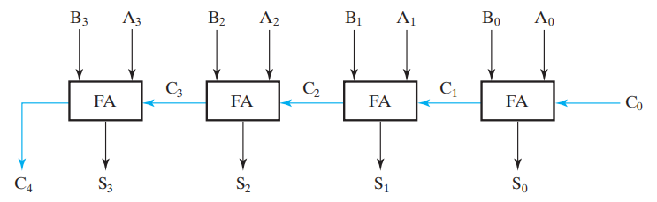

# Chap 3: Combinational Logical Design

??? abstract "核心知识"

	+ 设计流程
		+ 分层设计
		+ **工艺参数**：重点记忆与**延迟**相关的知识
		+ 工艺映射：只能用与非门/或非门构建电路
	+ 基本逻辑函数：值固定、传输、逆转、使能
	+ **译码器**
	+ 编码器
	+ **多路复用器**
	+ **加法器**：半加器、全加器、行波加法器、超前进位加法器
	+ **减法**的实现
		+ 补码
		+ 无符号与有符号
		+ 加减法器

## Design Procedure

两类逻辑电路：

+ **组合逻辑电路(combinational logic circuit)**：逻辑门的输出是只和**当前输入**有关的函数的电路，它包括：

	+ $m$个布尔输入
	+ $n$个布尔输出
	+ $n$个开关函数，每个函数将$2^m$种输入组合映射到一个输出，使得当前输出值仅取决于当前输入值

+ **时序逻辑电路(sequential logic circuit)**：逻辑门的输出是和**当前输入**，以及**之前的输入**（被称为*状态(state)*）都有关的函数的电路
>注：[Chap 4](4.md)会详细介绍时序电路的

### Design Concepts and Automation

分析逻辑电路的方法：

+ 写下电路图对应的布尔函数
+ 画出真值表
+ 函数分析
+ 检验

描述逻辑事件的形式：

+ 真值表
+ 布尔函数
+ 卡诺图
+ 时间图
+ 逻辑电路

#### Hierarchical Design

**分层设计(hierarchical design)** 是一种化简组合电路设计的方法：

+ 将函数分割成**块(blocks)**
+ 分割成更小的块，直至足够小
+ 不可再分被称为*原块(primitive block)*
+ 所有的块构成了分层结构

🌰：9输入”奇偶位树(parity tree)“

>如果直接徒手画，显然是不切实际的，因此按照下面的分层设计，从整体一层层拆分，最后到门级结构

#### Reusable Function Blocks

我们应尽量将复杂的设计分解为常见的、**可重用的函数块**，这些块应当通过检验，且放入库(library)中以供后续使用。
计算机辅助设计(computer-aided design, CAD)常用到函数块，比如：

+ 原理图捕获(schematic capture)
+ 逻辑模拟器(logic simulator)
+ 定时验证工具(tools for timing languages)
+ 硬件描述语言(hardware description languages)：Verilog 和 VHDL
+ 逻辑合成器(logic synthesizers)
+ 集成电路布局(integrated circuit layout)

#### Top-Down versus Bottom-Up

+ **自顶向下设计(top-down design)** 从抽象的、高级的具体实现出发，通过分解和连续的修改，进行越来越细节的设计，控制整个设计的*复杂程度*。它回答了：我们需要构建**什么**样的电路？
+ **自底向上(bottom-up design)** 从细节的、原始的块出发，将它们结合起来，形成更大更复杂的函数块，着重于*细节*。它回答了：我们**如何**构建电路？

在电子设计中，这两种设计思想往往*同时*进行。

### Design Space

#### Integrated Circuits

**集成电路(integrated circuit，又叫芯片)**，是一块具有相互连接的数字门电路和存储元件的半导体

分类：

+ *SSI(small-scale integrated)*：少于10个门
+ *MSI(medium-scale integrated)*：10-100个门
+ *LSI(large-scale integrated)*：100-1000个门
+ *VLSI(very large-scale ingegrated)*：成千上万的门

#### Technology Parameters

!!! note "工艺参数(technology parameters)"

	=== "**扇入(fan-in)**"

		门电路可用的输入数量

		

		
		

	=== "⭐**扇出(fan-out)**"

		在门电路输出的驱动下的*标准负载(standard loads)* 数量

		

		
		

		???+ note "相关知识" 

			1个**标准负载** = 1个**非门(inverter)** 的输入
				
			**过渡时间(transition time)**：门**输出**改变(高到低/低到高)所需的时间

			+ **上升时间(rise time)**$t_{LH}$：低电平 $\rightarrow$ 高电平
			+ **下降时间(fall time)**$t_{HL}$：高电平 $\rightarrow$ 低电平

			

			
			

			**最大扇出(maximum fan-out)**：门能够驱动的，不超过规定的最大过渡时间的标准负载的数量
			

			
			

			>随着标准负载的增加，过渡时间(这里是上升时间)也随之增加

	=== "**噪声容限(noise margin)**"

		在正常输入上施加的，不会导致电路输出的不良变化的最大外部噪声电压

	=== "**门电路成本(cost for a gate)**" 

		对于一个门电路对整个集成电路成本的贡献的测量

		在集成电路中：

		+ 门电路成本与**门电路占芯片面积的大小**成正比
		+ 门电路的面积大致与**晶体管的数量和大小**，以及**线连接的数量**成正比
		+ 如果无视连线区域，门电路面积大致与**门输入数量**成正比
		+ 所以我们用<u>门输入数量</u>大致测量门电路的成本

		在[上一章](2.md#cost-criteria)中我们已经详细分析过了，如果忘记就回去巩固一下

	=== "⭐**传播延迟(propagation delay)**"

		**从输入到输出**的传播过程中，信号值发生改变所需的时间

		???+ note "相关知识"
			
			**高到低**($t_{PHL}$)和**低到高**($t_{PLH}$)的输出信号的改变可能有不同的传播延迟。这两者<u>只与输出有关</u>，与输入不相关。
			
			通常，我们通过<u>输入/输出的高低电平的中点的延迟差</u>来计算传播延迟，见下图

			

			
			

			
			>注：注意**过渡时间**和**传播延迟**两个概念的区别！

			---
			**延迟模型(delay model)**：用于描述内部固有的门延迟

			1. **传输延迟(transport delay)**：输入发生变化后，输出在**固定的一段延迟**后才发生相应的变化
			2. **惯性延迟(inertial delay)**：类似传输延迟，但如果出现小于**拒绝时间(rejection time)** 的脉冲变化，则输出*将不会发生变化*。

			

			
			

			
			---
			**电路延迟(circuit delay)** 包括：

			+ 电路自身的固定延迟
			+ 不同负载导致的额外延迟(前面提到的“过渡时间”)

			

			
			

			延迟带来的问题：

			

			
			
	

			按照布尔代数的知识，我们知道$Y = A \overline{A} = 0$，但正因为延迟的存在，就会出现上图的**毛刺(glitch)**，这自然不是我们期望的结果
			
			更复杂的🌰：

			

			
			
	
			
			补救措施：添加一个冗余项$AB$

			

			
			

	=== "**功率耗散(power dissipation)**"

		电源供应和门电路的消耗

#### Design Trade-Offs

在电路设计中，我们常常需要权衡**成本(cost)**和**性能(performance)**

!!! example "例题"

	=== "题目"

		

		
		

	=== "答案"

		答案：2

		分析：

		+ 只有一个与非门：

			+ 延迟：0.45ns
			+ 成本：2.0
		+ 与非门 + 缓冲器：

			+ 延迟：0.33ns
			+ 成本：2.0 + 1.5 = 3.5

#### Positive and Negative Logic

相同的物理门有不同的逻辑意义，取决于对信号的解释

**正逻辑(Positive Logic)**：

+ **高电位(HIGH)**(more positive)代表逻辑1
+ **低电位(LOW)**(less positive)代表逻辑0

**负逻辑(Negative Logic)**：

+ **低电位(LOW)**(more positive)代表逻辑1
+ **高电位(HIGH)**(less positive)代表逻辑0

因此，一个执行**正逻辑与**的函数，也能执行**负逻辑或**的函数，反之亦然

🌰

下面两张表分别表示*正逻辑*和*负逻辑*的真值表

在门输入和输出上使用**极性指示器(polarity indicator)** 代表负逻辑的使用

### Design Steps

+ **规范(specification)**：写下电路行为的规范（*文本*、*HDL(硬件描述语言)*）
+ **构思(formulation)**：得到*真值表*或*布尔函数*，定义所需的关于输入输出的逻辑关系
+ **优化(optimization)**：使用*两级优化*，或者*多级优化*来最小化所用逻辑门的数量。画出一张用门电路构建的最终电路的*逻辑图*或*网图*
+ **工艺映射(technology mapping)**：使用现有的实现工艺，修改刚才得到的逻辑图或网图
+ **检验(verification)**：验证最终设计的正确性

### Technology Mapping

**工艺映射(technology mapping)** 是逻辑综合过程中的重要一环，它将不依赖具体工艺的逻辑表述，转化为一个特定的工艺规范（空想 $\rightarrow$ 现实）。工艺映射的其中一个关键操作是找到原先的逻辑描述和目标工艺之间的**逻辑等价**关系

#### Chip design styles

+ **高度定制(full customized)**：关注整个芯片的设计，一直到布局上的细节

	+ 昂贵
	+ 适用于密集的、快速的芯片

+ **标准单元(standard cell)**：在设计前已经构建好模块，或利用之前设计中的模块

	+ 中等耗费
	+ 相比full customized，密度更少，速度更慢

+ **门阵列(gate array)**：在很多设计中常用的门电路晶体管方案，已经在芯片中建好了。只专注于该芯片中特定的门之间的关系

	+ 耗费最少
	+ 相比前两者密度更少、速度更慢
>注：门阵列相关知识见[Chap 5](5.md#programmable-logic-device)

#### Cells and cell libraries

+ **单元(Cell)**：一个预先设计好的原始模块（前面三种芯片设计风格都会用到它）
+ **单元库(Cell library)**：对于某个设计的一组可用的单元
+ **单元特征(Cell characterization)**：由设计者所使用的单元的具体实现，通常基于实际单元设计、制造和测量值

典型单元特征的组成部分：

+ 示意图或逻辑图
+ 单元区域
+ **输入负载**（以标准负载）提交给驱动每个输入的输出
+ 来自每个输入和输出的延迟
+ 一个或多个关于工艺映射的单元模版
+ 一个或多个HDL模型
+ 自动布局：

	+ 单元电路的物理布局
	+ 提供单元的输入、输出、电源和接地位置的平面图布局

#### Mapping to NAND Gates

假定：

+ 原来的示意图中有与门、或门和非门
+ 单元库仅包括一个**非门**和**n输入与非门**($n = 2, 3, \dots$)
+ 忽略门加载和延迟的时间

实现步骤：

+ 移除与门和或门（使用**与非门**和**非门**）

+ 尽可能减少非门个数

🌰

#### Mapping to NOR Gates

假定：

+ 原来的示意图中有与门、或门和非门
+ 单元库仅包括一个**非门**和**n输入或非门**($n = 2, 3, \dots$)
+ 忽略门加载和延迟的时间

实现步骤：

+ 移除与门和或门（使用**与非门**和**非门**）

+ 尽可能减少非门个数

🌰

### Verification

+ **人工逻辑分析(Manual Logic Analysis)**

	+ 根据最终电路，得到真值表，或者布尔方程
	+ 比较现在得到的和之前得到的真值表，或者证明现在得到的布尔方程和之前得到的布尔方程等价

+ **仿真(Simulation)**

	+ 使用测试输入模拟最终电路、之前得到的真值表、布尔方程或HDL
	+ 对于组合电路，我们需要测试所有可能的有意义的输入组合来验证正确性

## Combinational Logic

### Functions and functional blocks

**函数块(functional block)** 是函数在组合电路上的实现。现在，它们常常由VLSI(超大规模集成电路)实现

??? info "Big Picture of Four Functioinal Blocks"

	

	
	

### Rudimentary Logic Functions

基本组合逻辑函数包括：

+ **值固定(value-fixing)**：$F = 0 \text{ or } F = 1$，没有布尔运算符
>注：值固定分为暂时固定和永久固定，常用于可编程逻辑设备中(见第5章)
+ **传输(transferring)**：$F = X$，没有布尔运算符
+ **逆转(inverting)**：$F = \overline{X}$，包含一个逻辑门
+ **使能(enabling)**：$F = X \cdot EN \text{ or } F = X + \overline{EN}$，包含一个或两个逻辑门
!!! note       

	+ *使能(enabling)* 允许输入对影响输出的影响
	+ *禁用(disabling)* 阻止输入对输出的影响，用一个固定值表示输出。这个值可以是*Hi-Z(高阻抗)*，0或1

	

	
	

	>其实，我们在上一章的[三态门](2.md#3-state-buffer)中已经介绍过使能信号了

其他3种基本函数的实现：

#### Multiple-bit Rudimentary Functions

+ 粗线用来表示**总线(bus)**，它是向量(简单理解为“数组”，但不准确)信号
+ 对于这样能够传输多位的导线，我们一般会在线上划一笔，并标注它的位数
+ 总线可以被分成多个1位信号
+ 可以从总线中分出一些位出来，且<u>不要求这些位一定要连续</u>(例(d))

### Decoder

**译码(decoding)**：从$n$位输入码到$m$位输出码的转换($n \le m \le 2^n$)，使得每个合法的输入码能够产生*唯一*对应的输出码

**译码器(decoder)**：执行译码的电路。

译码器的类型：

+ 变量译码器(variable decoder)(最小项侦测器，minterm detector)
+ 显示译码器(display decoder)
+ 编码翻译译码器(code translation decoder)

常用译码器：

+ 74LS139(2-4译码器)：2输入，4输出
+ 74LS138(3-8译码器)：3输入，8输出
+ MC14514(4-16译码器)：4输入，16输出

🌰：

+ 1-2译码器

+ 2-4译码器

>注：2-4译码器由2个*1-2译码器*和4个*与门*构成

#### Decoder Expansion

大型的译码器可以通过使用单个的，*带有更多输入的与门*来实现每个最小项函数来构建

显然，当译码器变得很大时，这种方法是不现实的——它的*扇入*和*门输入成本*太大啦！

因此，我们采用前面提到的**分层设计(hierarchical design)**(其实也是一种*分治(divide-and-conquer)* 的思想)和一组与门来构建译码器，通过*共享项(shared term)* 来减少扇入和门输入成本。

同时，这也体现了**自顶向下(top down)设计**的思想。

!!! example 

	=== "运用分层设计构建8-256译码器"

		

		
		

	=== "3-8译码器"

		

		
		

	=== "6-64译码器"

		

		
		

>个人理解：译码的实质是将一个**二进制数(编码)**转化为**[独热码](https://en.wikipedia.org/wiki/One-hot)**的过程

#### Decoder with Enable

+ 如何实现：在输出的位置上附上使能电路
+ 看下面的真值表：用$\times$表示0或1，因此两个$\times$的组合代表4种二进制组合
+ 这种电路被称为**信号分配器(demultiplexer)**

🌰：低阶译码器 + 使能 $\rightarrow$ 译码器的扩张(以2-4译码器扩展至3-8译码器为例)

译码器 + 或门 $\rightarrow$ **组合逻辑**的实现

实现m个n变量函数需要：

+ SOM表达式
+ n-$2^n$译码器
+ m个或门，每个输出对应一个

???+ example

	=== "二进制加法器"

		

		
		

		>注：[后面](#full-adderfa)有系统的讲解

	=== "奇校验函数"

		

		
		

	
#### Display Decoder(Seven-Segment Decoder)

???+ info "补充"

	+ **共阳极显示(The Common Anode Display, CAD)**：如下图所示，如果a~g = 0，开；a~g = 1，关（低电平活跃）
	+ **共阴极显示(The Common Cathode Display, CCD)**：如下图所示，如果a~g = 1，开；a~g = 0，关（高电平活跃）

	

	
	

布尔方程：

### Encoder

**编码(encoding)**：与译码相反，将$m$位输入码转化为$n$位输出码($n \le m \le 2^n$)，使得每个合法的输入码能够产生唯一的输出码

**编码器(encoder)**：执行编码的电路

类型：

+ 十进制-BCD编码器(decimal-to-BCD encoder)
+ 指令编码器(instruction encoder)
+ ==优先编码器(priority encoder)==
>注：这种编码器被广泛应用于 计算机优先级中断系统(computer priority interrupt system) 和 键盘编码系统(keyboard coding system)中
+ 密码编码器(cypher encoder)

🌰：十进制-BCD编码器

+ 输入：10个位，每位对应十进制数0-9($D_0, \dots, D_9$)——**独热码(one-hot encoding)**
+ 输出：4位的BCD码
+ 函数：$D_i = 1 \rightarrow$ 输出$(A_3, A_2, A_1, A_0)$表示数字i的BCD码

真值表：

我们得到布尔方程：

$$
\begin{align}
A_3 & = D_8 + D_9 \notag\\ 
A_2 & = D_4 + D_5 + D_6 + D_7 \notag \\
A_1 & = D_2 + D_3 + D_6 + D_7 \notag \\
A_0 & = D_1 + D_3 + D_5 + D_7 + D_9 \notag
\end{align}
$$

我们可以使用$F_1 = D_6 + D_7$，得到$A_1$和$A_2$的共享项，从而节省成本。

>所以，编码的实质即为将**独热码**转化成**二进制数(编码)**

我们可以直接从独热码的结果中进行化简，无需借助K-map的帮助。

	
#### Priority Encoder

!!! warning "普通编码器的问题"

	如果有多个输入的值为1，则编码器不能正常工作。

解决方案——**优先编码器(Priority encoder)**：

能够接受所有输入情况，并且产生有意义的结果的编码器。对于所有值为1的输入，它会选择位于**最高位**（或**最低位**）的输入，根据该位置输出相应的二进制码

!!! example

	=== "例1"

		题目：

		

		
		

		卡诺图：

		

		
		

		电路实现：

		

		
		

	=== "例2：五输入优先编码器"

		该编码器优先考虑最高位的1。其中X代表0或1，V代表输入中是否有1出现过。不难看出，这张真值表包含了所有32种情况。

		

		
		

		因此我们可以进行化简操作(也可以使用卡诺图)：

		$$
		\begin{align}
		A_2 & = D_4 \notag \\
		A_1 & = \overline{D_4}D_3 + \overline{D_4D_3}D_2  = \overline{D_4}F_1 \quad \text{其中 } F_1 = D_3 + D_2 \notag \\
		A_0 & = \overline{D_4}D_3 + \overline{D_4D_3D_2}D_1 = \overline{D_4}(D_3 + \overline{D_2}D_1) \notag \\
		V & = D_4 + F_1 + D_1 + D_0 \notag 
		\end{align}
		$$

### Multiplexer

执行**选择(selecting)** 功能的电路包含：

+ 一组信息输入
+ 一组用来做出选择的控制线路
+ 单个输出

**多路复用器(Multiplexers, MUX)**：执行选择的逻辑电路，可由**译码器 + 与-或门**(其中与门使每个译码器的输出起到使能作用)，或者由**三态门**实现

它包含：

+ $n$个控制输入($S_{n - 1}, \dots, S_0$)，被称为**选择输入(selection inputs)**
+ $2^n$个(最大数量)**信息输入(information inputs)**($I_{2^n - 1}, \dots, I_0$)，它的实际数量$m$可以小于$2^n$
+ 一个**输出**$Y$

!!! note "各种多路复用器"

	=== "2-1多路复用器"

		

		
		

		构成：

		+ 1个1-2*译码器*
		+ 2个*使能电路*
		+ 1个2输入*或门*

		单个选择变量$S$有两个值：

		+ $S = 0$选择输入$I_0$
		+ $S = 1$选择输入$I_1$

		方程：$Y = \overline{S}I_0 + SI_1$

		根据这个多路复用器的构成，我们可以扩展至$2^n$-1多路复用器：

		+ $n-2^n$译码器
		+ $2^n \times 2$ 与-或门

	=== "4-1多路复用器"

		

		
		

		构成： $2-2^2$译码器 + $2^2 \times 2$与-或门

		门输入成本 = 32

	=== "64-1多路复用器"

		

		
		

		构成：$6-2^6$译码器 + $2^6 \times 2$与-或门

!!! note "注意"

	对于大规模的电路结构，比如上面的64-1多路复用器，以及之后的算术逻辑单元、寄存器等，我们往往只要画出它**封装后的模块**即可，而不关注它的细节。

#### Multiplexer Width Expansion

方法：

+ 使用**位向量(vectors of bits)** 而非位(bit)
+ 并行使用多个$2^n \times 2$ 与-或门

🌰：4-1四位多路复用器

#### Other Selection Implementations

+ 用**三态门**代替与-或门

门输入成本：18(2个非门 + 4个与门 * 2 + 4个三态门 * 2)
>注：如果使用与-或门，成本 = 22
	
+ 用**三态门**实现译码器

门输入成本：14(2个非门 + 6个三态门 * 2)
	
#### Combinational Logic Implementation

!!! example "实例分析：格雷码 $\rightarrow$ 二进制码"

	

	
	

	>注：将格雷码按照计数顺序重新排列(如右图所示)

	=== "法1"

		???+ note "理论知识" 

			实现m个n变量函数需要：

			+ SOM表达式
			+ 一个m位$2^n$-1多路复用器

			设计：

			+ 找到函数的真值表
			+ 将函数输入变量与多路复用器的*选择输入*$S_{n-1}, \dots, S_0$按顺序对应
			+ 在多路复用器的*输出*上标注输出变量
			+ 使用真值表的值对多路复用器的*信息输入*进行*值固定*

		可以发现，函数y和z可以用两个8-1多路复用器来实现：

		+ 将A, B和C连接至多路复用器的选择输入
		+ 将y, z连接至多路复用器的输出
		+ 分别将它们真值表的值连接至信息输入

		

		
		

		>注：在后面的章节中，我们会发现这个值固定的多路复用器，与3位地址和2位数据的[ROM](5.md#read-only-memory)是一样的

	=== "法2"

		???+ note "理论部分"

			实现m个n变量的函数需要：

			+ 一个m位的$2^{n-1}$-1多路复用器
			+ 一个非门

			设计：

			+ 前n - 1个变量连接至选择输入
			+ 对于每个选择变量的组合，对应的输出是一个关于最后的变量$(0, 1, X, \overline{X})$的函数
			+ 这些值随后被应用于合适的数据输入中

		根据上面的设计原则，得到如下表格：

		

		
		

		实现：

		

		
		

		注：
		
		+ 这个方法相比前面那个，成本上减少了近乎一半
		+ 但这个实现就不像ROM了
		+ 扩展：多于n变量的函数可以被分解成一些子函数，这些子函数的变量是所有变量的子集。然后用多路复用器在这些子函数中进行选择。

??? info "补充：**多路复用器(multiplexer)** 与**信号分配器(demultiplexer)** 的区别"

	+ 多路复用器是“多对一”的

	

	
	

	+ 信号分配器是“一对多”的

	

	
	

	总体框架：

	

	
	

## Iterative Combinational Circuits

在逻辑电路中，**算术计算(arithmetic calculation)** (比如加法、减法)其实是一种编码翻译译码器。比如，N位二进制加法需要2N-(N+1)译码器。

然而，当操作数变得很大时，用译码器实现加法就比较困难了。这时，我们可以采用*二分法(bisection method)* 来构建大型译码器。但是，这种方法的效率不高。所以，我们需要遵循*计算法则(calculation rules)* 为算术函数构建新的函数块。

执行算术的函数块被称为**单元(cell)**，因此算术运算的总体实现是由一组单元构成的。

**迭代组(iterative array)** 是一种通过分解问题进行计算的方法，它利用*规律性(regularity)* 的优势，使得大型、多级的算术电路设计变得可行

**可迭代组合电路(iterative combinational circuits)** 包括：

+ **算数函数(arithmetic functions)**：对二进制向量进行运算，对其每一位使用相同的子函数。
+ **单元(Cell)**：子函数块
+ **迭代组(iterative array)**：具有互相联系的单元的阵列，可以是一维，也可以是多维

### Binary Adders

分类：

+ **半加器(half-adder)**：2输入按位加法函数块
+ **全加器(full-adder)**：3输入按位加法函数块
+ **行波加法器(ripple carry adder)**：执行二进制加法的迭代组
+ **超前进位加法器(carry-look-ahead adder)**：用来提升加法计算性能的分层结构

#### Half-Adder(HA)

**半加器(half-adder)** 是一种2输入，位宽为1的二进制加法器，将2个位相加，得到1个2位的和。具体如下：

>本质上，半加器是一个2-2译码器(2输入，2输出)

真值表：

>其中S被称为*和位(sum bit)*，C被称为*进位(carry bit)*

卡诺图：

观察得：
$$
S = X \oplus Y,\quad C = XY
$$

其他等价的布尔方程：

>注：
>
>+ (a), (b), (e)中的S分别用到了SOP, POS和XOR表示法
>+ (c)中，C作为S的AND-OR方程的一项；(d)中，$\overline{C}$作为S的POS方程的一项

实现：

+ 最常见的实现形式($S = X \oplus Y,\ C = XY$)：

+ 与非门的实现($S = (X + Y)\overline{C},\ C = \overline{(\overline{XY})}$)：

#### Full-Adder(FA)

**全加器(full adder)** 的工作原理类似半加器，但它在输入端多了一个（来自上一位的）*进位(carry-in bit)* 的输入

框图：

所有的计算情况：

真值表：

卡诺图：

布尔函数：

$$
\begin{align}
S & = X\overline{YZ} + \overline{X}Y\overline{Z}+\overline{XY}Z + XYZ  \notag \\
& = X \oplus Y \oplus Z \notag \\
C & = XY+XZ+YZ = XY+(X \oplus Y)Z \notag
\end{align}
$$

>注：其中，$X \cdot Y$被称为*进位生成(carry generate)*，$X \oplus Y$被称为*进位传播(carry propagate)*

实现：

#### Ripple Carry Adder

**行波加法器(ripple-carry binary adder)**：为了执行多位操作数的加法，我们将所有单个位“捆绑”在一起形成向量，然后使用函数块操作

🌰：四位行波加法器——将输入向量A(3: 0)和B(3: 0)相加，得到和向量S(3: 0)

>注：单元i的输出进位是单元i+1的输入进位

框图(4位行波加法器 = 4个全加器)：

!!! warning "行波加法器的问题——**进位的传播&延迟**"

	延迟：进位从最低位传播到最高位的时间

	上面的四位行波加法器的门级传播路径如下：

	

	
	

	其中最长的路径是从$A_0$或$B_0$到$S_3$的长度

	!!! note "理解延迟的产生"

		回顾全加器的<u>进位传播</u>和<u>进位生成</u>：对应两个函数：

		+ *传播函数(generate function)*：$P_i = A_i \oplus B_i$
		+ *生成函数(propagate function)*：$G_i = A_iB_i$

		我们得到：$S_i = P_i \oplus C_i,\ C_{i+1} = G_i + P_iC_i$

		在行波加法器中：

		+ $P_i, G_i$对于加法器的每个单元是*局部的(local)*
		+ $S_i, C_{i+1}$必须等待$C_i$的到来

		因此就有了传播延迟的问题。

#### Carry Lookahead Adder(CLA)

为了上述弊端，就要用到**超前进位加法器(carry lookahead adder)**，它基于对输入的*替换(substitution)*，提前计算进位。 

具体做法：单元中的$C_{i+1}$被一组关于进位的方程替代，因此所有的$C_i$都可以被$C_0$和其他变量表示，比如(4位加法器)：

使用这些公式，加法器的时间复杂度从O(n)降到O(1)。

电路实现（了解即可）：

!!! success "更深入的了解"

	上《计算机组成》课程的时候，超前进位加法器还会再讲解一遍。当时写数逻笔记的时候，我还不是特别理解它的原理，想要看更清晰的解释的话，就见我[计组的笔记](../co/3.md#fast-addition-carry-lookahead)。

#### Group Carry Lookahead Logic

**组合超前进位逻辑(group carry lookahead logic)**：实际应用中，由于门扇入的限制，超前进位的方法对于更大的加法器就不太可行。这时我们用到了*组合生成(group generate)* ($G_{0-3}$)和*组合传播(group propagate)*($P_{0-3}$)的概念，对于上述四位超前进位加法器：

$$
\begin{align}
G_{0-3} & = G_3 + P_3G_2+P_3P_2G_1+P_3P_2P_1P_0G_0 \notag \\
P_{0-3} & = P_3P_2P_1P_0 \notag 
\end{align}
$$

因此：

$$
\begin{align}
C_4 = & G_3 + P_3G_2 + P_3P_2G_1 + P_3P_2P_1G_0 + P_3P_2P_1P_0C_0 \notag \\
= & G_{0-3} + P_{0-3}C_0 \notag  
\end{align}
$$

🌰：使用4个4位超前进位加法器进行16位的加法运算

布尔方程：

框图实现：

??? note "summary"

	

	
	

### Binary Subtraction

#### Unsigned Subtraction

算法：

+ 减数N减去被减数M，即M - N
+ 如果没有向末位(指最高位的后一位)借位，则$M \ge N$，那么结果是非负且正确的
+ 如果向末位借位，则$N > M$，那么结果是负的，需要纠正

纠正方法：用差M - N + $2^n$减去$2^n$，得到M - N的绝对值
$$
2^n - (M - N + 2^n) = N - M
$$
>注：$2^n$ - X被称为X的**补码(2's complement)**（后面会讲到）

🌰：

同时实现**无符号加法**和**无符号减法**的电路图：

这种实现方法有些复杂，下面我们将介绍更为简单的实现方法

#### Unsigned 2's Complement Subtraction

如果要同时实现无符号的加法和减法，需要用到加法器、减法器和取补器(complementer)，这相当复杂。因此我们需要让加法和减法“共享”一些更简单的逻辑，为此引入“**补(complement)**”的概念作为解决方法。

>注：这里的概念讲过很多遍了，实在不熟悉的话可以参考一下:point_down:

??? note "补"

	分类：

	+ 🌟基数补(radix complement)——**补码**

		+ r进制：r's complement
		+ 二进制：2's complement
		+ N的补码为$r^n - N$

	+ 缩小基数补(diminished radix complement)——反码

		+ r进制：(r - 1)'s complement
		+ 二进制：1's complement
		+ N的反码为$(r^n-1) - N$ 

		速记1‘s complement：每1位取反，即$0 \rightarrow 1, 1 \rightarrow 0$

	2’s complement的几种取法：

	+ 根据定义：$2^n - X$
	+ 1‘s complement + 1
	+ 从最低位开始，从低到高扫描，遇到第1个‘1’后，这个‘1’后面所有的位均取反，即$0 \rightarrow 1, 1 \rightarrow 0$

	🌰：

	

	
	

!!! note ":star:用补码进行减法运算"

	已知n位无符号整数$M, N$，求$M - N$

	+ $M - N \Rightarrow M + (2^n - N) = M - N + 2^n$，即将$M - N$转化为$M + $($N$的补码)
	+ 如果$M \ge N$，加法产生的末进位$2^n$直接扔掉，保留$M - N$
	+ 如果$M < N$，加法未产生末进位，此时我们得到的结果是$M - N$的补码，那么答案为$-(N - M)$

???+ example "例题"

	=== "例1"

		

		
		

	=== "例2" 

		

		
		

>注：比较无符号算术和用补码的无符号算术，可以发现后者可以少用一个减法器，因此设计上更加简单，成本也得到降低

#### Signed Integers

用二进制表示**带符号整数(signed integers)**：$sa_{n-1}\dots a_2a_1a_0$，其中对于最高位s：

+ s = 0 $\rightarrow$ 正数
+ s = 1 $\rightarrow$ 负数

!!! note "带符号整数的表示法"

	=== "带符号的**量(magnitude)**"

		用最高位表示符号，其余位表示该数的绝对值。对于2个数的运算：

		+ 如果最高位加起来的和的最低位为0，则：

			+ 将它们的量*相加*
			+ *检查*结果是否溢出(有没有来自最高位的进位)
			+ 结果的*符号*同第1个操作数

		+ 如果最高位加起来的和的最低位为1，则：

			+ 用第2个数的量*减去*第1个数的量
			+ 如果*没有借位*，结果的符号同第1个操作数
			+ 如果*发生借位*，取结果的*补码*，它的符号为第1个操作数的符号
			+ 不用担心溢出(因为不可能发生)

		??? example 
			
			

			
			

		流程：

		

		
		

	=== "带符号的**补(complement)**"

		+ 带符号1's complement 
		+ ⭐带符号2's complement：正数无需变化，负数的话保留符号位，对其余位取补码

		🌰：3位二进制带符号整数

		

		
		

		更形象的观察：

		

		
		

		>注：n位带符号的补码
		>
		>+ 上限：$2^{n - 1} - 1$
		>+ 下限：$-2^{n-1}$
		>+ 且不会出现+0和-0同时存在的情况

???+ info "补充"

	+ **符号扩展(sign extension)** 保留补码的值

		+ 正数：高位添加0
		+ 负数：高位添加1

	🌰：0111 $\rightarrow$ <u>000</u>0111, 1011 $\rightarrow$ <u>111</u>1011

	具体原理：

	

	
	

	+ 在补码的算术运算中，最高位的进位并不一定意味着溢出

	🌰：

	

	
	

#### Signed 2's Complement Arithmetic

加法：

1. 两数相加(包括符号位)，扔掉符号位的进位
2. 如果两数符号相同，但结果的符号与两数不同，表明发生溢出
3. 结果的符号已经从步骤1得到

减法：减法(被减数 - 减数) $\rightarrow$ 被减数 + 减数的补，然后用加法的方法做即可

带符号的补码加法器/减法器：

+ 当$S = 0$时，此时B没有被改变，执行**加法**
+ 当$S = 1$时，此时通过异或的取反作用，加上$C_0 = 1$，我们得到了B的**补码**，执行**减法**

#### Overflow Detection

**溢出(overflow)** 可能发生于：

+ 两个符号相同的操作数的加法
+ 两个符号不同的操作数的减法

两个k位数的加法：$X_{k-1}\dots X_0 + Y_{k-1}\dots Y_0 = S_{k-1}\dots S_0$

侦测错误的公式：$V = X_{k-1}Y_{k-1}\overline{S_{k-1}} + \overline{X_{k-1}Y_{k-1}}S_{k-1} = C_{k-1} \oplus C_{k-2}$，应对两种情况：

+ 下溢(underflow)
+ 上溢(overflow)

🌰：带溢出侦测的补码加法器/减法器

+ 简化版：

+ 用于4位行波加法器：

???+ note "Summary"

	

	
	

### Other Arithmetic Functions

除了加减的算术函数外，还有以下算术函数：

+ *自增(incrementing)*
+ *自减(decrementing)*
+ *乘法(multiplication)*
+ *常数除法(division by a constant)* 
+ ...

#### Design by Contraction

🎯：利用来自之前设计的结果，实现逻辑电路或函数块的设计

我们可以通过使用类似给定电路的工艺，随后“压缩”成更简单的电路（比如利用*值固定(value fixing)*、*传输(transfer)* 和*逆转输入(inverting on its inputs)* 等方法），将其应用于特定场景来实现新的函数。

🌰：将行波加法器压缩成**自增器(incrementer)**：n = 3, $A_2A_1A_0 + 1$

#### Incrementing and Decrementing

**自增(incrementing)**：

+ 函数块：**自增器(incrementer)**
+ 🌰：A + 1, B + 4
+ 作用：算术变量 + 固定值
+ 固定值 = 1时被称为*向上计数(counting up)*

**自减(decrementing)**：

+ 函数块：**自减器(decrementer)**
+ 🌰：A - 1, B - 4
+ 作用：算术变量 - 固定值
+ 固定值 = 1时被称为*向下计数(counting down)*

>注：Chap 6的[计数器](6.md#counters)一节会涉及该部分知识

#### Multiplication and Division 

+ 与$2^n$相乘：向左移n位
+ 与$2^n$相除：向右移n位

>注：上面为乘法，下面为除法

🌰：$B(3: 0) \times (101)_2$

#### Zero Fill

**添0(zero fill)**：通过对m位的操作数添0，该操作数扩展至n位(m < n)。通常在*最高位(MSB)* 添0，也可以在*最低位(LSB)* 添0

🌰：将11110101扩成16位

+ MSB：<u>00000000</u> 11110101
+ LSB：11110101 <u>00000000</u>

#### Sign Extension

**符号扩展(sign extension)**：根据补码表示法的规则，在最高位后添加数字

🌰：

+ 正数：01110101 $\rightarrow$ <u>00000000</u> *0*1110101
+ 负数：11110101 $\rightarrow$ <u>11111111</u> *1*1110101

#### Arithmetic Logic Unit(ALU)

符号：

+ 2个n位输入：$A_0 - A_{n-1}, B_0 - B_{n-1}$
+ 符号算术：加/减/自增/自减
+ 逻辑运算：与/或/非/异或
+ 模式选择：算术/逻辑
+ 运算选择
+ 1位的进位输入和进位输出

框图：

实现：

+ 使用逻辑块，对加法器输入B的4种情况中进行选择
+ 改变生成函数$G_i$和传播函数$P_i$

根据实现方法，分解后的框图：

真值表 & K-map：

功能表——列出所有有用的函数

