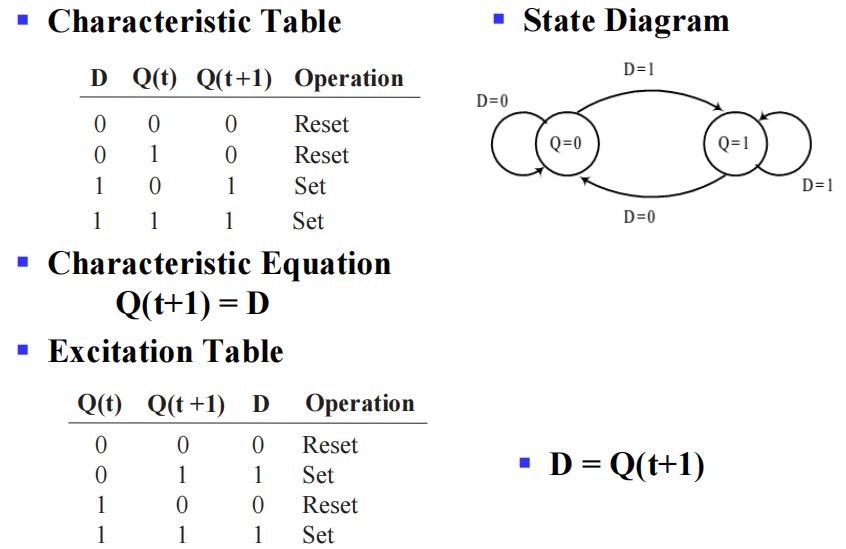
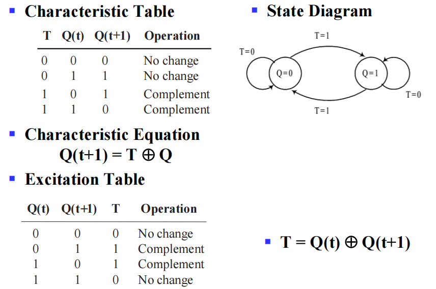
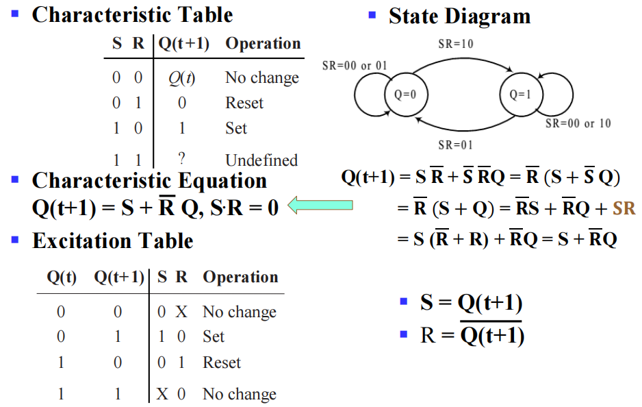
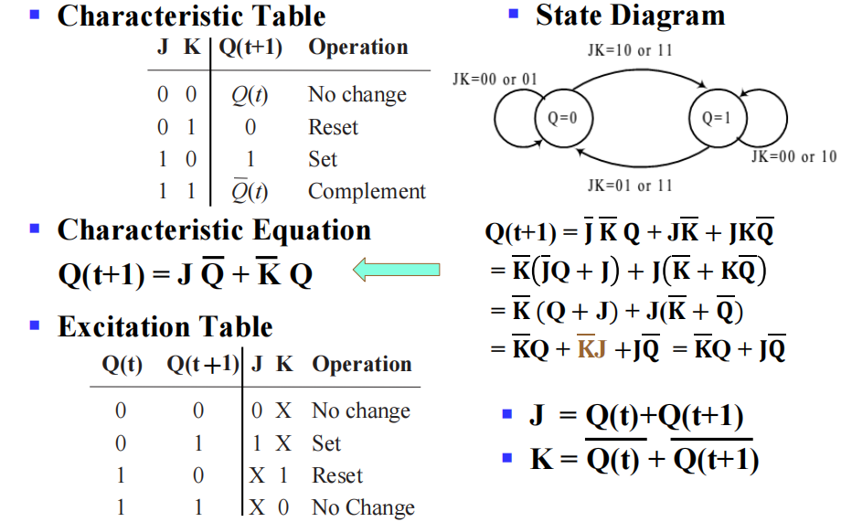
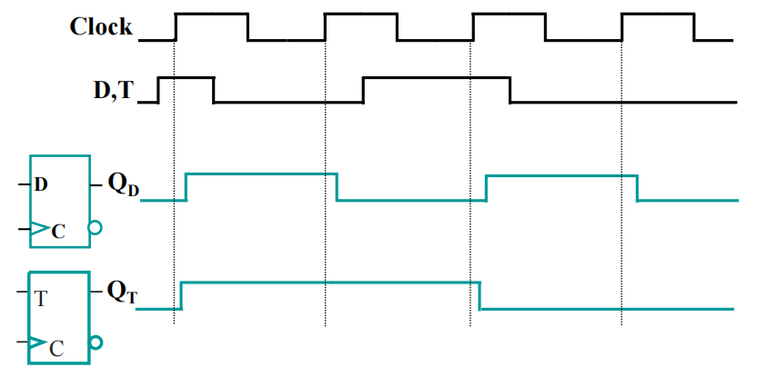
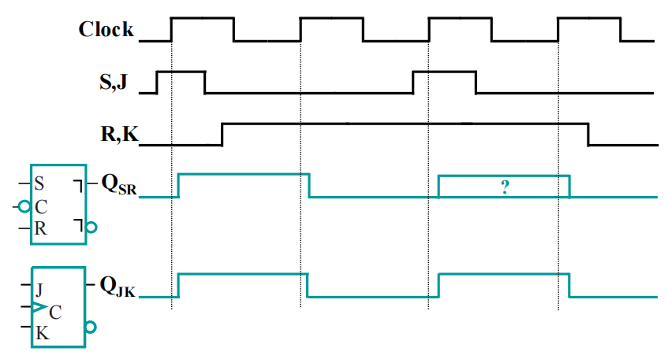
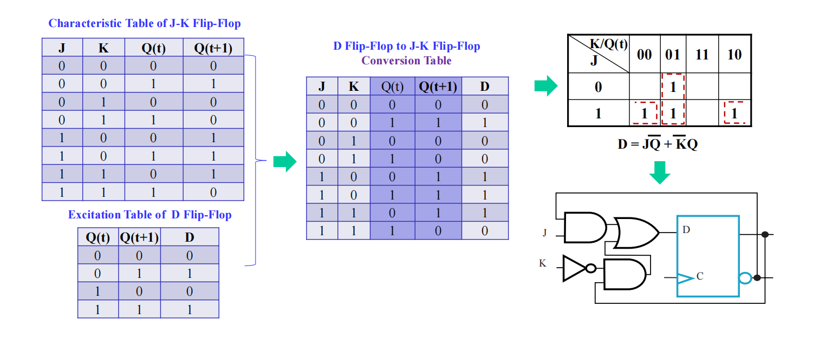

# Chap 4 Sequential Circuits

??? abstract "核心知识"

	+ 锁存器
		+ $SR$锁存器、$\overline{SR}$锁存器、带时钟的锁存器——有不确定的状态
		+ $D$锁存器——空翻问题
	+ 触发器
		+ 脉冲触发式：主从触发器——一次性采样问题
		+ **边沿触发式**
		+ 直接输入
	+ **时序电路分析**
		+ 输入、输出方程
		+ 状态表
		+ 状态图
		+ 等价状态
	+ **时序电路设计**
		+ 状态分配
	+ **时间分析**
		+ 触发器
		+ 整个时序电路

## Sequential Circuit Definition

>**时序电路(sequential circuit)**：输出不仅取决于*当前*的输入，也取决于*之前*的输入的电路。
>
>时序电路可以用一张**状态图(state diagram)** 表示，它由在任意给定时间内的有限数量的状态表示，且状态随着外部输入的变化而变化。

时序电路包括：

+ **存储元件(storage elements)**：能够存储二进制信息的电路，而这种在任意给定时间内存储的二进制信息被称为在那个时刻的**状态(state)**。

+ **组合逻辑**：

	+ 输入

		+ 来自外部的信号
		+ 来自存储元件的信号，称为**状态(state)**，或**当前状态(present state)**

	+ 输出

		+ 来自外部的信号
		+ 来自存储元件的信号，称为**下一状态(next state)**

### Types of Sequential Circuits

根据存储元件观察输入信号的时间和内部状态改变的时间，将时序电路分为：

+ **同步(synchronous)**： 

	+ 这种电路的行为可由它在*离散时间*内的信号来定义(人话：**随外部时钟脉冲变化**)
	+ 存储元件观察输入信号的时间，并且*仅*随时间信号(来自*时钟生成器(clock generator)* 的 *时钟脉冲(clock pulse)*)的变化而改变状态。因此它又被称为*时钟时序电路(clocked sequential circuits)*。因此，这种电路能够在电路的延迟下也能正常工作，而且相对来说比较容易设计出来。
	

	
	

+ **异步(Asynchronous)**

	+ 这种电路的行为依赖于某一时刻的输入信号以及*输入信号在连续时间内变化*的顺序(人话：**不随外部时钟脉冲变化**)
	

	
	

	
### Storage Elements

存储信息的方式多种多样，这可以通过逻辑电路实现，比如*缓冲器(buffer)*。假设缓冲器具有$t_G$时间的延迟，那么在$t$时刻进行输入，将会在$t + t_G$时刻得到输出，也就是说，信息被存储了$t_G$时间。

但是，我们希望信息存储的时间是**不定的(indefinite)**，应该比一个或多个门的延迟更长一些。因此，我们对缓冲器进行改装：==将它的输入与输出相连接==。假如输入为0，那么在$t_G$时间过后缓冲器将会输出0；然后这个0又回到输入，又过了$t_G$时间后被输出……如此往复，最终实现一直保存0的功能(输入为1同理)。

这个例子说明可以通过将具有延迟的逻辑电路构成**闭环(closed loop)**的方式来实现存储功能，同时要确保回路中没有逆转信号。一个缓冲器通常由两个*非门*构成的。

然而，上述方法虽然常用，但它存在一个明显的问题：<u>因为没有额外的输入来控制电路，我们无法改变缓冲器存储的信息</u>。如果我们用*或非门*或者*与非门*，就可以改变这一现状，后面讲到的*异步*存储电路**锁存器(latches)** 就是这么构建的。

---

??? info "引入"

	通常来说，很多复杂的异步时序电路很难设计，因为它们的行为高度依赖门的延迟和改变输入的时间。因此，大多数设计者会选择**同步时序电路**。尽管如此，有些异步时序电路是必需的，比如我们需要用*异步*的**锁存器**来构建*同步*电路**触发器(flip-flops)**。

	**触发器**是能够存储一位信息的二进制存储元件，并具有时间特征(在[Flip-Flop Timing](#flip-flop-timing)一节定义)。它仅根据时钟脉冲来改变状态，也就是说，如果没有时钟脉冲，即使触发器的输出改变了电路的输入，它的输出仍然不变，相当于组合逻辑电路与触发器的回路之间被“切断”了。触发器有1个或2个输出，一个用于输出存储的正常值，另一个可选的输出存储值的*补*。最常用的触发器是**$D$触发器**。在深入学习触发器之前，我们先了解锁存器的工作原理。

## Latches

### $SR$ and $\overline{SR}$ Latches

**锁存器(latches)** 有以下特征：

+ 两个**稳定的状态**，即`0`，`1`
+ 可以**长期保存**给定的状态值
+ 在特定条件下可以改变状态，比如置位(set)`1`或复位(reset)`0`

=== "**$SR$锁存器**"

	由两个**或非门**的**交叉耦合(cross-coupling)** 构成，如图所示：

	

	
	

	+ 其中，**输入**$S$用于置位(set)，$R$用于复位(reset)
	+ 当**输出**$Q = 1, \overline{Q} = 0$时，称为*置位状态(set state)*；当$Q = 0, \overline{Q} = 1$时，称为*复位状态(reset state)*
	+ 如果$S = R = 1$(同时输入1)，那么就会产生*未定义的(undefined)* 的状态(两个输出均为0，但我们希望两个输出是互补的)
	+ 如果$S = R = 0$时，锁存器处于置位或复位状态，取决于最近的一次输入

	$SR$锁存器的行为可以由下面的仿真波形图表述：

	

	
	

=== "**$\overline{SR}$ 锁存器**"

	由两个**与非门**的**交叉耦合**构成，如图所示：
	

	
	

	>注意：这种锁存器的输入信号要*取补*

???+ summary "总结"

	+ $SR$锁存器由<u>或非门</u>构成 $\rightarrow$ 对`0`敏感 $\rightarrow$ 同时为`0`是保持状态
	+ $\overline{SR}$锁存器由<u>与非门</u>构成 $\rightarrow$ 对`1`敏感 $\rightarrow$ 同时为`1`是保持状态

??? info "补充知识——不稳定的锁存器行为(考试应该不做要求)"

	+ **振荡(oscillation)**

		$\overline{S} = \overline{R} = 0$不能作为输入，因为：

		+ 如果两个门具有 ==相同的延迟==，那么它们将会同时输出0。将0反馈至输入端就会同时输出1，然后又同时输出0，如此往复。这种*振荡*行为称为**critical race**，它将会永远持续下去
		+ 如果两个门具有 ==不同的延迟==，那么锁存器就会改变状态。然而，我们不清楚锁存器会进入什么状态，因此锁存器的下一个状态是*未定义的*

	+ **亚稳态(metastable state)**

		$\overline{S} = \overline{R} = 1$，$\overline{S}-\overline{R}$锁存器等价于这种电路图：
		

		
		

		考虑两个非门的传输特征：
		

		
		

		中间的点代表**亚稳态**。任何信号的微小变化都会得到加强，且电路会离开亚稳态

	如何避免这些不稳定状态呢？

	+ 不要同时将$R, S$从0改变至1，这样可以避免**振荡**行为。一种方法是不能让它们同时为0
	+ 一旦改变一个输入后，就不要再改变它，直到电路完成信号传输并达到稳定状态。这样可以避免**亚稳态**行为。

---
**时钟$SR$锁存器(clocked $SR$ latches)**：在原先$\overline{SR}$锁存器的基础上增加两个<u>与非门</u>和一个**控制输入(control input)**$C$得到的，这个输入作为另外两个输入的*使能信号*

+ 它与基本的$SR$锁存器具有相同的时序行为，除了它只在$C$为高电平时正常运行
+ 基本的$\overline{SR}$锁存器是**异步时序电路**，而时钟$SR$锁存器是**同步时序电路**
+ 这种带控制输入的$SR$锁存器是构建其他类型的锁存器和触发器的基础

### $D$ Latch

如上所述，当$S = R = C = 1$时，锁存器的状态是未定义的。为了消除这种情况(即$S, R$不同时为1)，我们采用$D$锁存器，如图所示。

这种触发器只有两个输入：$D$(data)和$C$(control)。可以发现，$D$充当$S$的地位，而它的补$\overline{D}$则充当$R$的地位，这样就避免同时为1的情况。

但这样也消除了同时为0的情况，而这种情况本来表示保持状态不变。然而，当$C = 0$时(禁用)，锁存器依然能够实现保持状态；只有当$C = 1$时，数据输入$D$才能起作用。

???+ warning "D锁存器的问题：**空翻**"

	*触发(trigger)*：**控制输入**的值的改变使得触发器内的**锁存器**的状态也发生改变

	有时钟脉冲的$D$锁存器，在$C$达到*高电平(logic-1 level)* 时会被触发。在这种情况下，锁存器是**透明的(transparent)**，<u>因为当控制输入为1时，我们可以从它的输出中“看到”它的输入</u>。

	如[上图](#storage-elements)所述，触发器的输出与组合电路之间有一个反馈回路。因此，触发器的数据输入部分来自它自身或者其他触发器的输出(这里假定所有锁存器采用相同的时钟脉冲)。当我们用锁存器构建触发器时，就会产生一个严重的问题：由于*锁存器间的相互连接*(某个锁存器的输出$\overline{Q}$可能是另一个锁存器的输入$D$)，当控制输入$C = 1$时，就会发现锁存器的状态将会*不断改变*，而不是只改变1次，直到$C = 0$时才停止变化。所以，当所有锁存器由一个共同的时钟信号触发时，不能将它们直接相互连接。之所以会发生这个问题，正是因为锁存器**透明**的性质。

## Flip-Flops

为了阻止"透明"带来的问题，我们采用触发器的设计。在触发器内，在一个输出改变之前，输入与输出间的通路应当断开。有2种实现方法：

+ **脉冲触发式触发器(pulse-triggered flip-flop)**：

	+ 当**有**时钟脉冲时，触发器可以修改第1个锁存器的值，且保持第2个锁存器的值
	+ 当**没有**时钟脉冲时，触发器可以改变第2个锁存器的值，且保持第1个锁存器的值

>这里是正脉冲触发式触发器

+ **边沿触发式触发器(edge-triggered flip-flop)**：

	+ 只有当时钟脉冲发生0-1或者1-0的转变时，触发器被触发
	+ 在其他任何时间内，触发器的状态将保持不变(无论是否有脉冲)。

>注：<u>边沿触发式触发器</u>速度更快，而且它的设计限制更少，因此就更常用

### Pulse-Triggered Flip-Flop

**$SR$主从触发器($S-R$ Master-Slave Flip-Flop)**：将两个$SR$锁存器构成
>注意两个锁存器的控制输入是**互补**的关系

+ 当$C = 1$时，触发器中第一个锁存器，即**主(master)锁存器**的值*可以改变*，但无法改变第二个锁存器的状态
+ 当$C = 0$时，触发器中第二个锁存器，即**从(slave)锁存器**将主锁存器的输出作为输入，产生相应的输出，此时主锁存器的状态保持不变
+ 因此，原来锁存器中输入到输出之间的<u>持续连接</u>，被触发器中交替的时钟值打破

时序图：

+ 可以看出，触发器的输出变化因为脉冲宽度而变慢。
+ 当时钟为高电平时，$R$或$S$的*0-1-0 glitch*(短暂跳变到1)会被主锁存器发现，因此主锁存器的值发生意外的改变，而<u>这个异常数据会被写入到从锁存器中</u>，这种行为被称为**一次性采样(1‘s catching)**

>注：一次性采样很可能是由$SR$主从触发器有2种保持的状态：$C = 0$，和$C = 1, S = R = 0$导致的。比如：$C = 1$时，$Q = 0, S = 0, R = 0$处于保持状态。若$S$发生0-1-0的跳变，则$Q$的值从0变成1，也就是说异常的数据被写入主锁存器内。

### Edge-Triggered Flip-Flop

**边沿触发式触发器(edge-triggered flip-flop)** 忽视处在稳定电平的时钟脉冲，仅当时钟信号发生转变时而被触发。

 **$D$主从触发器($D$ Master-Slave Flip-flop)**

>注：在$SR$主从触发器的基础上，将主锁存器换成了D锁存器，其余部分不变

$D$主从触发器避免了上述的一次性采样问题。它输出的改变与脉冲结束时的**下降沿(negative edge)** 有关，因此它又被称为**下降沿触发的触发器(negative-level triggered flip-flop)**，即1-0的转变会触发触发器
>注：它的原理和下面介绍的触发器类似，因此这里就不解释了

---
**上升沿触发的$D$触发器(Positive-Edge-Triggered $D$ Flip-flop)**

!!! note "分析"

	这种触发器在0-1的转变，即*上升沿(positive edge)* 处会触发触发器。它也是一种主从触发器。与上面的触发器不同的是，它的时钟输入上多了个非门，因此：

	+ 当时钟输入$C = 0$时，主锁存器处于使能状态并且是透明的，因此能够接受$D$的输入；而从锁存器就被禁用了，并保持之前的状态
	+ 当**上升沿**出现时，$C$开始变成1，这时主锁存器被禁用了，它的值被固定了；而从锁存器就拷贝了主锁存器的状态
	+ 当保持$C = 1$时，由于主锁存器被禁用，因此两个锁存器的状态均保持不变
	+ 当**下降沿**处显示，$C$开始变成0，主锁存器恢复使能，而从锁存器被禁用了，因此从锁存器仍然保存之前的状态

	所以说这个触发器是由上升沿触发的。

???+ info "注"

	通常，电路中所有的触发器都会采用同一种类型的。如果采用不同的类型，就要考虑采用<u>不同的时钟脉冲</u>，确保所有触发器的输出能够同时改变，从而正常运行。后面的章节若不做特殊说明，均采用同一类型的触发器。

注意到$D$触发器<u>没有保持状态</u>，我们可以通过下列方法"添加"保持状态：

+ *时钟门控(clock gating)*：禁用输入$C$的时钟脉冲。虽然节省成本，但会延迟时钟脉冲，这种延迟被称为**时钟偏移(clock skew)**。因此<u>避免采用这种方法</u>
+ 保持时钟脉冲不受干扰，并使用多路选择器，将输出连接到输入$D$

### Standard Graphics Symbols

>注：
>
>+ 输入或输出引脚处的圈表示取*补*
>+ 第二行中，第1、3个触发器名称左边的记号表示**正脉冲**，第2、4个触发器的记号表示**负脉冲**
>+ 第三行中，第1个触发器名称左边的记号表示**上升沿**，第2个触发器的记号表示**下降沿**
>+ 第二行的输出引脚旁边有$\daleth$记号，它是*延迟输出标识符(postponed output indicator)*，表示输出将会在脉冲结束后改变
>+ 第三行的输出引脚旁边有$\vartriangleright$记号，它是*动态(输入)标识符(dynamic input)*，表示触发器响应的是时钟脉冲的转变

### Direct Inputs

**触发器**通常提供特殊的输入，用于**异步**的置位和复位

+ **直接输入/预置(direct input/preset)**：用于异步置位S的输入
+ **直接复位/清空(direct output/clear)**：用于异步复位R的输入
如果没有这些输入，触发器在刚通电时的状态是任意的。因此，通过这些直接输入，我们可以提前**初始化**触发器的状态，从而使触发器在通电后能够正常运行

>注：
>
>+ 控制输入被标记为$Cn$，表示它可以控制标记为$nD$的数据输入
>+ 没有标上数字的$S, R$表明它们不受控制输入控制。可以看出，它们是*低电平*活跃的，因此它们的行为类似 **$\overline{SR}$锁存器**(异步时序电路)
>+ 函数表中的$\uparrow$表示$C$处于**上升沿**

### Flip-Flop Timing

+ **建立时间(setup time)**$t_s$：在时钟边沿**前**，输入$S, R$或$D$必须保持稳定状态的最小时间，这样数据才能成功被存入触发器内
	+ 脉冲触发式触发器：等于时钟脉冲宽度(如果在这段时间修改数据，就会出现**一次性采样**的问题)
	+ 边沿触发式触发器：通常比时钟脉冲宽度小得多，因此它的速度更快
+ **保持时间(hold time)**$t_h$：在时钟边沿**后**，输入$S, R$或$D$必须保持稳定状态的最小时间，这样数据才能可靠地被时钟采样

!!! warning "因此在$t_s$和$t_h$的时间段内，我们不能改变触发器的输入！"

+ **时钟脉冲宽度(clock pulse width)**$t_w$：确保主锁存器能够有足够时间正确获取输入
+ **传播延迟(propogation delay)**$t_{p-}$：与门电路中的同名参数类似，但它测量从触发时钟边沿到输出稳定之间的时间。因为触发器输出的改变将会被触发器输入的控制分开，因此<u>最小传播延迟应当**长于**保持时间</u>

	+ $t_{PHL}$：高电平 $\rightarrow$ 低电平
	+ $t_{PLH}$：低电平 $\rightarrow$ 高电平
	+ $t_{pd} = \max(t_{PHL}, t_{PLH})$

>注：*阴影部分*表示我们*可以改变数据*的时间段

??? example "例题"

	=== "问题"

		

		
		

		

		
		

	=== "答案"

		

		
		

???+ note "总结"

	

	
	

## Sequential Circuits Analysis

通用模型：

+ time(t)时刻的*当前状态*被存储在一组触发器中
+ time(t)时刻的*下一状态的输入*，是关于<u>当前状态(t)</u>和(有时)<u>输入(t)</u>的布尔函数
+ time(t+1)时刻的*下一状态*是下一状态输入(t)的布尔函数
+ time(t)时刻的*输出*，也是关于<u>当前状态(t)</u>和(有时)<u>输入(t)</u>的布尔函数
>所以，"状态"可以简单理解为<u>触发器的输出</u>

**时序电路分析**：对于给定的时序电路，说明对应的逻辑图的过程。它包括：

+ 从*状态表(state table)*、*状态图(state diagram)* 和输入、输出布尔方程中**得到时序电路的功能**
+ **找到时间限制**，使得时序电路能够避免亚稳态，从而使电路运行无误

!!! note "步骤"

	1. 得到*输入*、*下一状态*以及*输出*的方程
	2. 得到*状态表*（带有状态的真值表）：
		+ 输入：电路输入，触发器的当前状态
		+ 输出：电路输出，触发器的下一状态

	3. 列出时序电路的下一状态
	4. 得到*状态图*
	5. 分析电路性能
	6. 验证电路正确性，检查自我恢复能力(self-recovery capability)，画出时间参数

	

	
	

### Input Equations

触发器的输入方程：

+ 用D表示触发器的输入，用下标表示特定的触发器的输出
+ 有多少个触发器，就有多少输入方程

🌰；

### State Tables

**状态表(state table)** 是一个包含多变量的表格，分为以下4个部分：

+ *输入*：t时刻的输入组合
+ *当前状态*：t时刻的状态值
+ *下一状态*：t+1时刻(即下一时刻)的状态值(基于<u>当前状态</u>和<u>输入</u>)
+ *输出*：t时刻的输出值，即关于<u>当前状态</u>和(有时)<u>输入</u>的函数

>注：从真值表的角度看，<u>输入部分</u>为*输入*和*当前状态*，<u>输出部分</u>为*输出*和*下一状态*

🌰(接着上面的例子)
我们从输入、下一状态、输出方程中得到以下状态表；

>注：对于一个具有m个触发器和n个输入的时序电路，它的状态表一共有$2^{m+n}$行。下一状态共有m列

状态表的另一种形式——*二维表*。它能够较好地匹配K-map，可以看到表格中的当前状态是按照<u>格雷码</u>顺序排列的：

### State Diagrams

时序电路的功能还可以用**状态图(state diagram)** 表示，它由以下部分组成：

+ 用*圆圈*表示**状态**，圆圈内部写有当前状态的名称
+ 用*有向边*表示从当前状态到下一状态的**状态过渡(state transition)**
+ 有向边上的*标签*表示导致某种状态过渡的输入
+ 根据输出表示方法的不同，我们有以下2类：

	+ **米里型(Mealy type)**：当输出依赖于*状态*和*输入*时，输出写在有向边上（输入和输出的标签用斜杠(/)区分）
	+ **摩尔型(Moore type)**：当输出仅依赖于*状态*时，输出写在圈内

???+ note "具体介绍"

	=== "**摩尔型(Moore model)**"
	
		输出是仅关于*状态*的函数，因此在状态图中与状态一起写在*圈*内
			
		

		
		

	=== "**米里型(Mealy model)**"
	
		输出是关于*输入*和*状态*的函数，因此在状态图中位于状态过渡的*弧*上
			
		

		
		

🌰(还是接着之前的例子)
从二维的状态表中得到(米里型)状态图：

!!! note "状态表 vs 状态图"

	+ 状态表：更容易从逻辑图和输入方程中得到
	+ 状态图：更形象地展现不同状态间转变的过程，方便人们理解电路的运作方式

### Equivalent States

如果两个状态对于每个可能的输入，都得到相同的输出(包括下一状态)，则称这两个状态是*等价的(equivalent)*。等价的两个状态可以进行*合并*，达到化简的目的。
>注：状态的减少不一定减少成本，因为门成本取决于*组合逻辑电路*和*触发器*的总成本。尽管如此，合并等价的状态为设计、验证和测试带来内在的好处

???+ example 

	接着上面的例子，圈内的数字用字母编号表示

	=== "初始状态"

		

		
		

		观察**S2**和**S3**，当它们的输入相同时，*下一状态*和*输出*均相同

		+ 输入0，下一状态为S0，输出为1
		+ 输入1，下一状态为S2，输出为0

		所以，S2和S3是*等价的*。因此，我们可以对状态图进行化简，见"化简1"

	=== "化简1"

		

		
		

		对于这张新的状态图，我们观察**S1**和**S2**，发现它们也是*等价的*，因为：

		+ 输入0，下一状态为S0，输出为1
		+ 输入1，下一状态为S2，输出为0

		以我们又可以对状态图化简，最终的化简结果如"化简2"所示：

	=== "化简2"

		

		
		

等价状态的类型(前提：对于所有输入，输出都是一样的)：

+ *相同*的下一状态
+ *交错(interleaved)*的下一状态
+ *循环(circular)*的下一状态

???+ example

	=== "相同的下一状态"

		

		
		

	=== "相同或交错的下一状态"

		

		
		

	=== "交错或等价($S_k$和$S_l$等价)的下一状态"

		

		
		

	=== "交错、等价或循环的下一状态"

		

		
		

### Sequential Circuit Simulation

时序电路的仿真(模拟)需要考虑：

+ 输入序列中必须出现一组特定的模式(pattern)，包括随时间应用的输入模式和时钟脉冲
+ 开始仿真前，需要初始化一个确定的状态，即*复位信号(reset signal)*
+ 通过观测状态，验证正确性。一个简单的方法是，对每一个状态信号添加一个输出(就像调试C代码时添加一些`printf()`语句)
+ 随时间应用的输入和对输出的观察与正时钟边沿有关

	+ *功能仿真(functional simulation)*：验证电路的功能，假设电路元件没有延迟或延迟很小。有的仿真器使用一个很小的延迟，以便于观测信号改变的顺序，但如果这个延迟不够小，就会导致问题
	+ *时间仿真(timing simulation)*：验证电路是否正常运作(考虑时间)，此时考虑电路元件的实际延迟

### Timing Analysis of Sequential Circuits

时序电路的**时间分析**的🎯：找到电路的*最大延迟* $\rightarrow$ **最大时钟频率**$f_{\max}$(或者**最小时钟周期**$t_p$)

>Why?
>
>如果时钟周期过短，在建立时间开始前，从电路传到触发器的数据可能来不及改变。

有下列时间参数：

+ $t_p$：**时钟周期**
+ $t_{pd, FF}$：**触发器的传播延迟**——从到达时钟边沿，到触发器的输出开始稳定之间的时间
+ $t_{pd, COMB}$：**组合逻辑的延迟**——从触发器的输出到触发器的输入之间的通路上，组合逻辑的总延迟
+ $t_s$：**触发器的建立时间**——在时钟事件发生前，数据输入应该保持稳定的时间
+ $t_{slack}$：**松弛时间**——时钟周期中额外的时间

>注：
>
>+ 中间3个时间限制均来自电路通路
>+ 注意到触发器的保持时间$t_h$并不在讨论范围内，但它和其他情况的时间限制方程有关
>+ 到达一个或多个触发器的时钟信号有延迟，称为**时钟偏移(clock skew)**，这会影响$f_{\max}$

时序电路的时间通路(timing paths)：

下列时序图标注了上述的时间参数：

我们可以得到时间方程：
$$
t_{pi} \ge t_{slack} + (t_{pd, FF} + t_{pd, COMB} + t_s)
$$
若$t_{slack} \ge 0$，则
$$
t_p \ge \max(t_{pd, FF} + t_{pd, COMB} + t_s) = t_{p, \min}
$$
这对从触发器输出到触发器输入间的*所有通路*都是适用的

>注：虽然我们可以用$t_{PHL}$和$t_{PLH}$来代替$t_{pd}$，使时间分析更加准确，但这样就需要额外考虑通路的逆向。因此为了方便，我们统一采用$t_{pd}$

???+ example "例题"

	=== "例1"

		=== "题目"

			对下列电路进行时间分析：

			

			
			

			其中：

			+ $t_{pd, NOT} = 0.5ns$
			+ $t_{pd, FF} = 2.0ns$
			+ $t_{pd, XOR} = 2.0ns$
			+ $t_s = 1.0ns$
			+ $t_{pd, AND} = 1.0ns$
			+ $t_h = 0.25ns$

			求：

			1. 外部输入 $\rightarrow$ 输出之间的最大延迟
			2. 外部输入 $\rightarrow$ 正边沿
			3. 正边沿 $\rightarrow$ 输出
			4. 正边沿 $\rightarrow$ 正边沿

		=== "答案"

			1. 外部输入 $\rightarrow$ 输出之间的最大延迟：$t_{pd, XOR} + t_{pd, XOR} = 4.0ns$
			2. 外部输入 $\rightarrow$ 正边沿：$t_{pd, XOR} + t_{pd, NOT} + t_s = 3.5ns$
			3. 正边沿 $\rightarrow$ 输出：$t_{pd, FF} + t_{pd, AND} + t_{pd, XOR} + t_{pd, XOR} = 7ns$
			4. 正边沿 $\rightarrow$ 正边沿：$t_{pd, FF} + t_{pd, AND} + t_{pd, XOR} + t_{pd, NOT} + t_s = 6.5ns$

			所以最大延迟为6.5ns，最大频率为$f_{max} = \frac{1}{6.5 \times 10^{-9}} \approx 154MHz$

	=== "例2"

		(来自教材习题)

		=== "题目"

			

			
			
	

			

			
			

			

			
			

		=== "答案"

			

			
			

## Sequential Circuit Design

时序电路**设计**的流程如下：

为了确定电路的初始状态(即复位状态)，我们需要用到**复位信号**，有*异步*和*同步*之分：
>注：如果用的是异步复位(直接输入)，这违反了触发器的同步性质

???+ example "序列识别器"

	>注：这里的序列识别器用来识别序列1101

	+ 输入：$x(t) \in \{0, 1\}$
	+ 输出：$z(t) \in \{0, 1\}$
	+ 函数：$z(t) = \begin{cases}1 & \text{if } x(t-3, t) = 1101 \\ 0 & \text{otherwise}\end{cases}$

	某个给定的序列

	

	
	

	特殊情况：1101101，
	
	可以发现序列的首尾均出现了1101，而且它们是**重叠的**，即<u>1101</u>101和110<u>1101</u>

	时序电路的设计：

	=== "流程"

		+ 对于*正确*的序列：

			+ 开始于**初始状态**(即复位状态)
			+ **添加一个状态**，表明识别到所要识别序列中的第1个符号
			+ 当连续识别到正确的符号时，就连续**添加状态**
			
		+ 对于*错误*的序列：

			+ **最终状态**代表输入序列(可能小于最终输入值)的出现
			+ **添加状态过渡弧**，表明当前符号不在所要识别序列时发生的情况
			+ 对于所有非识别序列输入，**添加其他的弧**，表明代表那种错误序列出现时的状态过渡

	=== "米里型状态图"

		先找到正确序列情况下的状态图(较为容易)，这里我们列出了所有4个状态

		

		
		

		!!! question "思考"

			当处于D状态时，如果我们输入1，应该回到哪个状态？(最右边的箭头该指向哪？)
			>还是举这个例子：1101101，可以发现第1个1101中*最后一个1*，可以作为第2个1101中*第一个1*，因此D $\rightarrow$ B。也就是说，我们重新利用了之前的状态，而不是盲目地添加新状态

		除此之外，我们得考虑错误序列的情况，最终的状态图如下所示：

		

		
		

		从状态图中，我们很容易地得到状态表
	
		

		
		

	=== "摩尔型状态图"

		+ 在摩尔型中，输出与状态相关
		+ 我们需要添加额外的状态E，它对应的输出为1
		>E虽然与B很相似，但它的输出为1，因此与B不同
		+ 因此，摩尔型相比米里型有更多的状态
		>“Moore is More”

		状态图：

		

		
		

	
		状态表：
		
		

		
		

		然而，虽然前面说过B和E“不一样”，但如果我们在将带有E的状态图转变回米里型：
		
		

		
		

		再画出对应的状态表：
		
		

		
		

		不难发现，B和E其实是**等价**的，所以我们可以进一步化简：
		
		

		
		

		
		一切回到了原点😂

### The Design Procedure

+ **规范(specification)**
+ **构思(formulation)**：得到状态图或状态表
+ **状态最少化(state minimization)**：最小化状态的数量
+ **状态分配(state assignment)**：为状态分配二进制码
+ **找到触发器的输入方程(flip-flop input equation determination)**：选择触发器的类型，从表中的“下一状态”一项中得到触发器的方程
+ **找到输出方程(output equation determination)**：从表中的“输出”一项中得到输出方程
+ **优化(optimization)**
+ **工艺映射(technology mapping)**：从方程中得到电路，并映射到指定的触发器和门
+ **验证(verification)**：验证最终设计的正确性

### Specification

说明形式：

+ 书面描述
+ 数学描述
+ HDL
+ 表格描述
+ 方程描述
+ 描述运算的图(不只是结构)

### Formulation

>🎯：找到状态图

在电路说明时，我们用*状态*来记住关于*过去的输入序列的有意义的性质*，这对于*预测未来的输出值*至关重要

### State Minimization(Reduction)

通过减少或最小化状态的总数，所需的*触发器数量*也随之减少。
我们可以通过消除**等价状态(equivalent states)** 来减少状态总数。

**等价定理(equivalence theorem)**：对于每个状态表，存在一个*唯一*的等价表，使得状态的数量*最小*

如何做?

+ 手工：观察、implication chart
+ 算法：Hopcroft, Moore, Brzozowski

🌰：

>注：可以借鉴离散数学的[等价类](../dm/9.md#equivalence-classes)的知识，我们得到了3个等价类：{A}, {B}, {C, D}，分别记作A', B', C'

??? info "补充：Implication Chart"

	按顺序比较两个等价状态

	+ 如果发现等价状态，在对应位置上打$\surd$
	+ 如果状态不相等，打$\times$
	+ 如果需要进一步比较，列出下一状态的对

	🌰：
	
	

	
	

	+ 在进一步的比较中，发现CD，DE不是等价的，因此DG不是等价的
	+ 这样，我们得到：
	

	
	

	+ 找到最大的等价类：(A, B, E), (C, F), (D), (G)，标记这4个状态位a, b, c, d

### State Assignment

我们需要将所有$m$个状态赋上一个唯一的编码，编码的长度$n \ge \lceil \log_2 m \rceil$。这样会产生$2^n - m$个**无用的状态**

方法：计数顺序分配、**格雷码**分配、**独热码**分配

???+ example 

	对于前面的1101序列识别器，我们采用上述3种方法进行状态分配，得到以下状态表：

	=== "计数顺序分配"

		

		
		

	=== "格雷码分配"

		

		
		

	=== "独热码分配"

		

		
		

		注：独热码的优劣：

		+ 优：得到更简单、更快速的逻辑，便于调试和分析
		+ 劣：触发器的成本会提高(m个状态需要m位独热码，也就需要m个触发器)，这样就产生$2^m - m$个没有用到过的编码

不难发现，不同的分配会产生不同的输入、输出函数，也会影响电路的复杂度。状态分配的目标是：

+ 决定编码的长度
+ 找到最佳或近似最佳的状态分配
当*N很大*时，找到最佳分配是件很困难的事；而且状态分配的性能也取决于*触发类型*。实际上，我们采用工程方法进行状态分配，这需要用到*启发性的规则(heuristic rules)*

### Flip-Flop Input and Output Equation Determination

???+ example

	对于前面的序列识别器，我们分别用上述三种方法进行状态分配：

	=== "计数顺序分配"
	
		

		
		

		
		由卡诺图，我们得到：
		$$
		D_2 = Y_2\overline{Y_1} + X\overline{Y_2}Y_1 \quad D_1 = \overline{X}Y_2\overline{Y_1} + X\overline{Y_2Y_1} + XY_2Y_1 \quad Z = XY_2Y_1
		$$
		门输入成本 = 22

	=== "格雷码分配"

		

		
		

		由卡诺图，可以得到：$$
		D_2 = Y_2Y_1 + XY_1 \quad D_1 = X \quad Z = XY_2\overline{Y_1}
		$$
		门输入成本 = 9

		电路图：
		
		

		
		

	=== "独热码分配"
	
		(没有卡诺图，注意有4个输入方程)
		
		$$
		\begin{align}
		D_4 = \overline{X}Y_3 & \quad D_3 = X(Y_2 + Y_3) \notag \\
		D_2 = X(Y_1 + Y_4) \quad D_1 & = \overline{X}(Y_1 + Y_2 + Y_4) \quad Z = XY_4 \notag
		\end{align}
		$$

		门输入成本 = 17

		电路图：

		

		
		

### Technology Mapping

🌰(接着上面的例子，我们选取最优的格雷码分配)：

假设我们的库中只有D触发器和与非门(包括非门，至多4输入)，那么我们需要技术映射，电路图如下：

### Designing with Unused States

对于没有用到的状态，我们把它当作**不关心的情况(don't-care conditions)**，然后就在k-map的相应位置上打上'$\times$'，利用这些'$\times$'进行化简

???+ example

	

	
	

在实现中，我们如何应对未使用的状态？

+ 对于未使用的状态，需要说明它对应的输出，这样，来自未使用的状态及其状态过渡的行为就不会是有害的
+ 为未使用的状态添加额外的输出，表明电路进入不正确的状态
+ 对于未使用状态下的下一状态行为需要指定，以确保电路能在不使用复位的情况下回到正常的运行

### Verification

+ **手工模拟(manual verification)**：手工地将所有的输入组合都试一遍，看结果是否符合预期
+ **仿真验证(verification with simulation)**：只要准备好输入组合的序列和时钟，剩下的过程交给计算机自动处理，结果以时序图(波形图)的形式呈现

🌰：验证“1101”序列识别器的正确性：

+ 手工模拟

+ 仿真验证

---
??? example "设计1个2位模3累加器"

	定义：

	+ **模n加法器(modulo n adder)**：$a +_m b = (a + b)\ \mathbf{mod}\ m$
	+ **累加器(accumulator)**：随时间变化累加输入之和的电路，初始为0

	规范：

	+ 输入：$(X_1, X_0)$
	+ 被存储的和：$(Y_1, Y_0)$
	+ 输出：$(Z_1, Z_0)$

	状态图(*摩尔型*)：

	

	
	

	
	状态表：
	
	

	
	

	
	>注：可以看到，表中的编码按格雷码顺序排列，方便后面用K-map化简

	状态分配：$(Y_1, Y_0) = (Z_1, Z_0)$

	利用K-map找到D触发器最优的输入方程：

	

	
	

	输入方程：$$
	\begin{align}
	D_1 & = Y_1\overline{X_1X_0} + Y_0X_0 + \overline{Y_1Y_0}X_1 \notag \\ 
	D_0 & = Y_0\overline{X_1X_0} + Y_1X_1 + \overline{Y_1Y_0}X_0 \notag
	\end{align}
	$$
	电路实现：

	

	
	

## ~~State Machine Design~~

>这一节内容在课件里没有详细讲述，而且考试不要求，所以这里就稍微提一下(~~写的很水~~)，具体内容见[修佬的笔记](https://note.isshikih.top/cour_note/D2QD_DigitalDesign/Chap04/#%E7%8A%B6%E6%80%81%E6%9C%BA)

??? info "~~可略过~~"

	+ **传统的状态图(traditional state diagram)** 的局限，导致其不适用于大型电路：

		+ 对于n个输入变量，必须指定$2^n$个输入组合，即使下一状态或输出仅取决于部分输入
		+ 对于m个输入变量，必须指定$2^m$个输入组合，即使仅有部分的输出受状态和输入的影响

	+ **状态机(state-machine diagram)**

		+ 使用*摩尔型*来指定输出
		+ 通过*布尔表达式和方程*来替代输入、输出组合的枚举

	通用状态机模版：

	

	状态机模型主要分为3部分：输入条件、过渡、输出行为

	+ **输入条件(input condition)**：表述为关于输入变量的布尔表达式或方程
	+ **过渡条件(transition condition, TC)**：在过渡弧上的输入条件
	+ **输出条件(output condition, OC)**：当值为1时，导致输出行为产生的输入条件
	+ **无条件过渡(unconditional transition)**：无视输入值，总是发生于下一个时钟的过渡(内在传输条件 = 1)

	+ **摩尔输出行为(Moore output actions)**：仅取决于状态，即无条件的
	+ **过渡条件独立的米里输出行为(transition-condition independent(TCI) Mealy output action)**
	+ **过渡条件依赖的米里输出行为(transition-condition dependent(TCI) Mealy output action)**
	+ **过渡和输出条件依赖的米里输出行为(transition and output-condition dependent(TOCD) Mealy output action)**：取决于状态、过渡条件和输出条件

	🌰：

	+ 传统状态图

		+ 输入：$\overline{AB} + \overline{A}B = \overline{A}$
		+ 输出：$Z = \overline{AB}$

	+ 状态机

		+ 输入：$A\overline{B} + AB = A$
		+ 输出：$Y = A\overline{B}$

	不正确的状态图：

	

	用Verilog实现状态机(略)

### Limitations of Finite State Machines

+ 在无限序列，比如$[0]^*[1]^+$之类的序列里，只能使用有限的状态来识别特定的序列模式
???+ example

	

+ 有限状态机只能识别有规律的语言，然而现实中有许多例子是无规律的

## Other Flip-Flop Types

### J-K Flip-Flop

+ 符号：

+ 类似S-R触发器，J类似S，K类似R，除了该触发器允许J = K = 1时的情况
+ J = K = 1时，触发器进入**相反状态(opposite state)**
+ 作为*主从触发器*，J-K触发器也有和S-R触发器一样的一次性采样问题，即：如果*主锁存器*的异常状态会传入*从锁存器*内
+ 为了避免这一问题，可以用边沿D触发器作为核心的触发器

电路结构：

### T(Toggle) Flip-Flop

+ 符号：

+ 只有单个输入T：当位于上升沿时(如图所示的类型)，T = 0时不改变状态；T = 1时切换至相反状态
+ 当J-K触发器的输入J = K = T时，它与T触发器的功能相同
+ 不能用输入T初始化触发器至确定状态
+ 作为主从触发器，也有一次性采样问题，解决方法同上

电路结构：

## ~~Basic Flip-Flop Descriptors~~

+ 用于**分析**：

	+ **特征表**：定义关于输入和当前状态的*下一状态*
	+ **特征方程**(下一状态方程)：定义*下一状态*为输入和当前状态的函数
+ 用于**设计**：

	+ **激励表**：定义关于当前状态和下一状态的*输入*
	+ **激励方程**：定义*输入*为当前状态和下一状态的函数

=== "D触发器"
	
	

=== "T触发器"

	

=== "S-R触发器"

	

=== "J-K触发器"

	

波形图：

=== "D触发器 & T触发器"

	

=== "S-R触发器 & J-K触发器"

	

## ~~Flip-Flop Conversion~~

🌰：D触发器 $\rightarrow$ J-K触发器

步骤：

+ 画出*想要得到的触发器*的**特征表**
+ 画出*给定的触发器*的**激励表**
+ 合并两表为**转换表**
+ 找出*给定触发器*的**输入方程**

## Appendix

### Other Implementation of Latches and Flip-Flops

=== "D Latch with Transmission Gates"

	

	
	

=== "D Latch with MUX"

	

	
	

=== "D Flip-Flip with MUXs"

	

	
	

