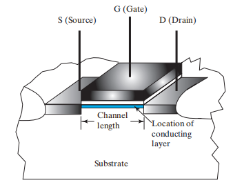
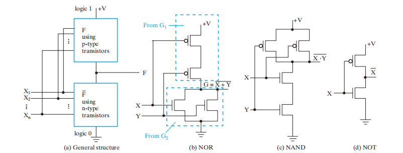
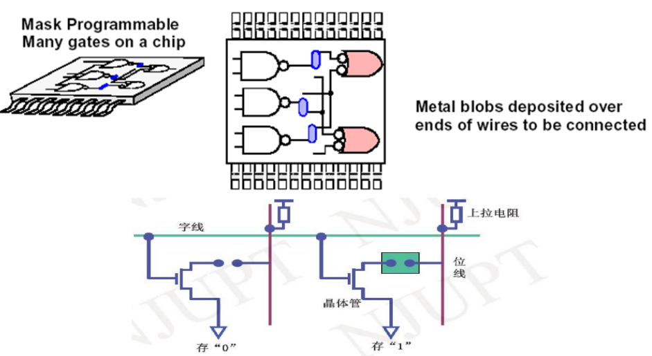
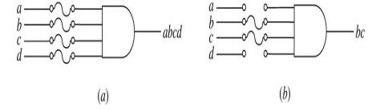
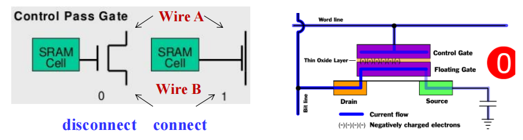
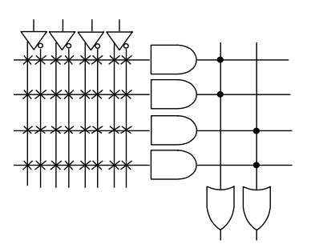
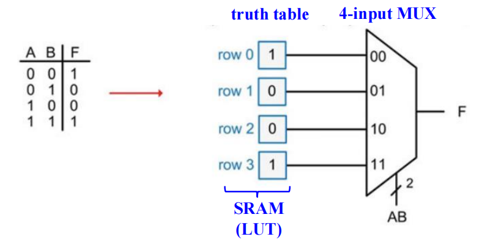
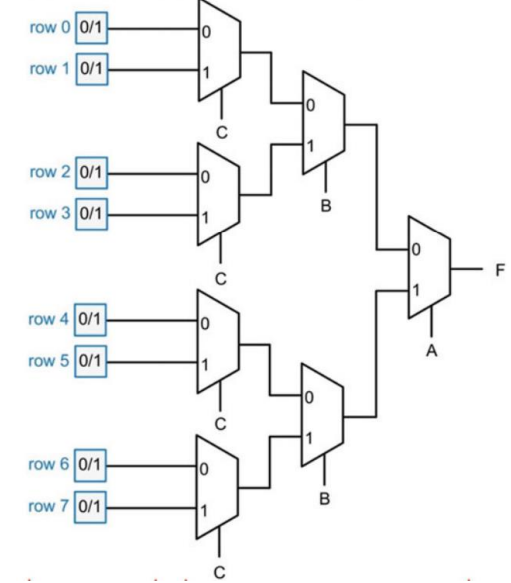

# Chap 5: Digital HardWare Implementation

??? abstract "核心知识"

	+ ROM
	+ PAL&reg;
	+ PLA

## Design Space

>注：本节中出现的<u>技术参数</u>等重要知识点见[Chap 3](3.md)。由于考试不考，这里仅仅稍微谈一下CMOS电路，若要了解具体原理，推荐阅读[修佬的笔记](https://note.isshikih.top/cour_note/D2QD_DigitalDesign/Chap05/#cmos)和[wiki](https://en.wikipedia.org/wiki/CMOS)。

### CMOS Circuit Technology

CMOS全称：互补式金属氧化物半导体(complementary metal-oxide semiconductor)

CMOS晶体管的几何图形：

n-channel CMOS 和 p-channel CMOS：

使用CMOS晶体管构建开关电路的模型：

>注：左边表示$XY$，右边表示$X + Y$

CMOS的通用结构及其常见应用

## Programmable Implementation Technologies

### Why Programmable Logic?

现实：

+ 大规模生产**集成电路(IC)**更加经济
+ 但许多设计只要求小规模的IC

因此我们需要能够被大规模生产，且能够实现很多只要求小规模设计的IC。而**可编程逻辑(programmable logic)**能够实现这些目标。

其他好处：

+ 很多可编程逻辑设备是**现场可编程的(field-programmable)**，即能够在生产环境之外的地方进行编程
+ 大多数可编程逻辑设备是*可删除的(erasable)*，并且是*可重新编程的(reprogrammable)*

	+ 允许更新设备或纠正错误
	+ 允许将设备重用于不同的设计中
	+ 课程实验的理想选择

+ 可编程逻辑设备被用于原型设计，用于常规IC的销售

### Programmable Logic Technologies

+ **连接控制(control connections)**

	+ mask programming
	

	
	

	+ 保险丝(fuse)：切断不想要的连接
	

	
	

	+ antifuse：生成连接

	

	
	

>参考：[antifuse](https://en.wikipedia.org/wiki/Antifuse)

+ **晶体管开关控制(control transistor switching)**

	+ 单位存储元素(single-bit storage element)
	+ 在**浮栅(floating gate)** 上存储电荷		

		+ 可删除
		+ 电子可删除
		+ 迅速（在闪存内）

	

	
	

>参考：[浮栅](https://zh.wikipedia.org/wiki/%E6%B5%AE%E6%A0%85%E9%87%91%E5%B1%9E%E6%B0%A7%E5%8C%96%E7%89%A9%E5%8D%8A%E5%AF%BC%E4%BD%93%E5%9C%BA%E6%95%88%E5%BA%94%E6%99%B6%E4%BD%93%E7%AE%A1)

+ 查找表的构建(build lookup tables(LUT))：存储函数的元素
	
??? example	"3人投票器"

	

	
	

### Programmable Logic Device

+ **只读存储器(read only memory, ROM)**：**与门**的*固定*阵列的和**或门**的*可编程阵列*
+ **可编程阵列逻辑(programmable array logic, PAL&reg;)**：**与门**的*可编程*阵列，以及**或门**的*固定*阵列 
+ **可编程逻辑阵列(programmable logic array, PLA)**：**与门**的*可编程*阵列，以及**或门**的*可编程*阵列
+ **复杂可编程逻辑器件(complex programmable logic device, CPLD)/现场可编程逻辑门阵列(field-programmable gate array, FPGA)**：由于它相当复杂，因此被被称为“建筑(architecture)”(此块内容不会详细展开)

#### Logical Symbols

下面这些符号在本章后续部分将会经常用到，请务必弄清楚它们的含义！

#### Read Only Memory

**只读存储器(read only memories)**/**可编程只读存储器(programmable read only memories)** 拥有：

+ $N$个输入
+ $M$个输出
+ $2^N$个译码后的最小项

>输出项即为**SOM**(可与[PAL](#programmable-array-logicpal)的输出对照)

+ 用带有$2^N$个输出的**固定(fixed)** 与门阵列(即$N-2^N$译码器)，实现所有$N$个最小项
+ 通过带有$M$个输出的**可编程(programmable)** 或门阵列，构成$M$个最小项之和的表达式

关于ROM和PROM的程序只是一个多输出的真值表：

+ 如果是`1`，则表明相应的最小项与其对应的输出之间建立了连接
+ 如果是`0`，则表明没有连接

只读存储器可被视为*内存(memory)*，而它的输入被视为*数据(即输出)地址(addresses)*

ROM的规模 = 地址宽度(字的个数) $\times$ 字的位宽
>如果不理解这个概念，可参考[Chap 7](7.md)对RAM规模的描述

???+ example 

	=== "$8 \times 4 \text{ ROM }$ (N = 3条输入线路，M = 4条输出线路)"

		

		
		

		+ *固定与门阵列*是一个3-8译码器，用来实现最小项
		+ *可编程或门阵列*使用单线，表示对或门的所有输入
		+ 阵列中的"$\times$"表示最小项与或门的连接

		🌰：如果输入为$(A_2, A_1, A_0) = 001$，那么输出位$(F_3, F_2, F_1, F_0) = 0011$

	=== "3位二进制数的平方"

		通过真值表分析($B[5: 0] = A[2: 0] \times A[2: 0]$)：

		

		
		

		根据结果，我们采用$2^3 \times 4$ ROM，框图如下：

		

		
		

		化简后的真值表：

		

		
		

		电路实现：

		

		
		

		>注：B0和B1并不在可编程阵列中(原因见前面的分析)

	=== "ROM扩展(类似[RAM扩展](7.md#array-of-sram-ics))"

		=== "题目"

			

			
			

		=== "答案"

			

			
			

!!! info "该部分可结合[RAM](7.md#random-access-memoryram)一节阅读"

#### Programmable Array Logic(PAL)

构成：可编程与门阵列 + 固定或门阵列(与ROM正好相反)

可以看到与门的输出线路和或门的输入线路之间的交点并不是用$\times$，而是用$\cdot$表示的，说明或门阵列是固定的，即对应布尔方程的<u>乘积项数量是固定的</u>。再加上每个乘积项的字面量个数可以改变，因此它的输出本质上是**SOP**。

弊： ROM保证实现任意有$N$个输入的$M$个函数，但PAL的或门输入有限

利：

+ 对于特定的内部复杂度，PAL拥有较大的$N$和$M$
+ 一些PAL的输出能被取*补(complement)* * (实现POS函数)
+ ROM无法实现**多级电路(multi-level circuits)** (输入输出间没有外部连接)；而PAL由于其自身结构特征，可以轻松实现多级电路

!!! note

	因为每个或门对应的与门数量(或门的输入)是有限的，因此我们得预先做好函数的优化，有时可能需要**因式分解**

!!! example

	对于下列给定的布尔方程，用PAL实现其功能

	

	
	

	电路实现：

	

	
	

	化简后的布尔方程：

	$$
	\begin{align}
	W & = AB\overline{C} + \overline{AB}C\overline{D} \notag \\
	X & = A + BCD \notag \\
	Y & = \overline{A}B + CD + \overline{BD} \notag \\
	Z & = AB\overline{C} + \overline{AB}C\overline{D} + A\overline{CD} + \overline{ABC}D \notag \\
	& = W + A\overline{CD} + \overline{ABC}D \notag
	\end{align}
	$$

#### Programmable Logic Array(PLA)

相较于前两者而言，PLA更加灵活，因为它的与门和或门阵列都是可编程的

利：

+ PLA拥有较大的$N$和$M$，可以实现在ROM无法完成的方程(因为ROM的输入固定为N)
+ PLA的所有乘积项均能与或门(输出)相连接，克服了PAL或门有限个输入的问题
+ 有些PLA的输出能取*补(complement)*（实现POS函数）

弊：

+ ⭐乘积项的数量限制了PLA的应用：从后面的例子中可以发现——所有的输出“共享”所有的乘积项。因此很容易出现乘积项太多无法表示出来的情况，这时需要通过优化，使一些输出使用相同的乘积项，来节省乘积项的个数
+ PAL的多级电路能力在PLA上行不通。因此PLA需要外部连接来实现多级电路

!!! example

	=== "3输入-2输出PLA(有4个乘积项)"

		

		
		

		布尔方程：

		$$
		\begin{align}
		F_1 & = 0 \oplus (AB + BC + AC) = AB + BC + AC \notag\\
		F_2 & = 1 \oplus (AB + \overline{AB}) = \overline{A}B + A\overline{B} \notag 
		\end{align}
		$$

		可以看到异或门的作用：决定是否取输出的*补*

	=== "考虑乘积项的“共享”问题"

		给定布尔方程为：

		$$
		\begin{align}
		F_1 & = \overline{AB}C + \overline{A}B\overline{C} + A\overline{BC} \notag \\
		F_2 & = AC + AB + BC \notag 
		\end{align}
		$$
		可以发现它们的乘积项个数为6。如果我们再用上面那个PLA(4个乘积项)，看起来无法实现这2个函数。然而，通过对$F_1$取补，我们发现一线生机：
		$$
		\overline{F_1} = AB + AC + BC + \overline{ABC}
		$$
		现在，$\overline{F_1}$与$F_2$有3个相同的乘积项，因此总乘积项个数降至4个，可以用前面的PLA实现了！

		电路实现：

		

		
		

#### Lookup Tables

>注：貌似考试不考

+ 内存(通常是静态随机存储器(static random-acess memory, SRAM))能够实现组合逻辑。在FPGA中，这样的内存被称为**查找表(lookup tables, LUTs)**

🌰：通过4-1MUX实现的2输入查找表

更大的MUX可以通过利用一组更小的MUX搭建树状结构来实现。

对上例的改进

:chestnut:：用7个2-1MUX形成树状结构，实现3输入LUT

注：

+ 查找表通常比较小：输入为4或6个，1个输出，包括16或64个项
+ 因为查找表存储了真值表，因此它可以实现任何4或6输入的函数
+ 因此，设计问题转为：如何将一组给定的函数分解为一组4输入或6输入的两级函数

#### ~~FPGA~~

FPGA的内部结构分成3部分：

+ **可编程逻辑块(programmable/configurable logic block, CLB)**，它是FPGA的基本逻辑单元

	+ 在LUTs中的存储单元是易变的(断电后不保存数据)
	+ 使用PROM(可编程ROM)永久保存数据
	+ 当芯片初始化开关箱/矩阵时，存储单元从PROM中加载

+ **可编程开关箱/矩阵(programmable switch box/matrix, SM)**，它允许CLB的输入和输出通过不同的线路相互连接
	+ 灵活(flexibility)：单根线可以连接多少条线路
	+ 拓扑(topology)：哪些线路可以被连接
	+ 可路由(routability)：多少电路能够被路由到

+ **可编程输入输出模块(programmable input outout module, IOB)**，它是在设备外围的特殊逻辑块，用于外部连接

🌰：
用FPGA实现3变量函数$f = x_1x_2 + \overline{x_2}x_3$，使用3个CLB(这里用到的是4-1 MUX)

FPGA使用包含bit的**位文件(bitfile)** 进行编程

### Programmable Logic Functions Implementation

目前已知的实现技艺(Implementation techniques)：

+ 译码器 + 或门
+ 多路复用器 （+ 非门）
+ ROM
+ PLA
+ PAL
+ 查找表(Lookup tables)

它们被视为*结构化实现方法(structrued implementation methods)*，因为在各种情况中，它们潜在的结构已经做了预设（即我们直接使用这些techniques，而不去关注它的细节）

