# Chap 6: Registers and Register Transfers

??? abstract "核心知识"

	+ 寄存器的基本结构
	+ 寄存器传输
		+ 几种实现：
			+ 专用MUX
			+ 总线：共用MUX、三态门
	+ 微操作
		+ 算术
		+ 逻辑
		+ 移位：关注移位寄存器的实现(串行、并行)
	+ 计数器
		+ 行波计数器
		+ 同步计数器
		+ 双向计数器
		+ 模N计数器：比如BCD码计数器
	+ 寄存器单元设计

## Registers and Load Enable

??? info "引入"

	当n很大时，状态和输入组合的数量将随之变大，此时用状态图/状态表模型的表示就不太现实了。所以，我们用**寄存器传输层级(Register Transfer Level, RTL)** 设计模型来描述复杂电路的大量状态。在RTL设计方法中，通过不同类型的寄存器和组合电路来构建基本块，实现时序逻辑电路的设计。

	大型数字系统的设计往往采用*模块化(modular)*、*分层(hierarchical)* 的方法，将系统划分为一些子系统或模块，包括寄存器、计数器、译码器、多路复用器、总线、算术元件、触发器和基本门等。

	可将这一节视为时序逻辑电路的延伸。

n位**寄存器(register)** 由一组*触发器*和*组合逻辑门*构成，用来实现多位数据的存储等操作

+ n位触发器*保存*一位或多位数据
+ 组合逻辑门对数据进行*加工*

[**计数器(counter)**](#counters)：随着时间脉冲的变化，不断在某个固定序列内循环“扫描”的一种寄存器

寄存器和计数器都是**时序函数块(sequential functional blocks)**

+ 寄存器主要用于存储和操纵信息
+ 计数器主要用于序列和控制操作

???+ example 

	=== "2位寄存器"

		

		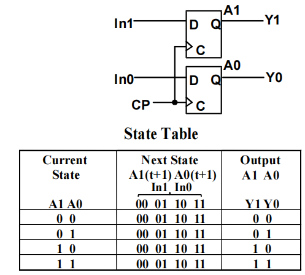
		

	=== "4位寄存器"

		

		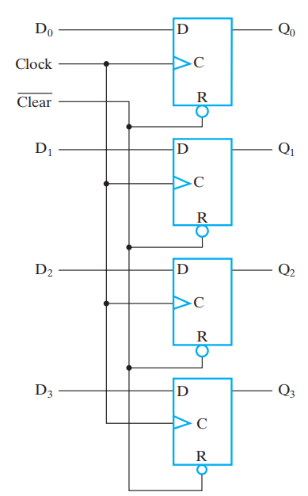
		

		>这里多了一个*清除输入*$\overline{Clear}$，用于在正式运行前的初始化(寄存器的所有值均置0)，当$\overline{Clear} = 0$时，对触发器进行<u>异步复位</u>。在正常运行时，$\overline{Clear}$应保持1，除非需要复位。这个输入是可选的。

寄存器能在每个时钟周期里*加载(loading)*信息：将新的信息传输至寄存器内。如果加载操作在同一时钟脉冲内完成，称之为*并行*完成。

**加载(load)**：控制寄存器的存储和加载的信号：

+ load = 1：**加载**数据输入的值
+ load = 0：将值**存储**至寄存器内

寄存器的符号：

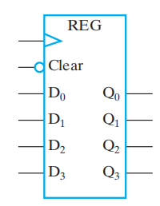

>注：由于Clear写在方框内部，且外部有个圆圈，因此Clear没有取反；但如果Clear写在外面，就需要写成$\overline{Clear}$

为了更合理地存储或加载信息，寄存器需要用**控制信号**实现人为的控制，实现方法如下：

+ 用一个信号来*阻止*寄存器的*时钟输入* $\Rightarrow$ [门控时钟](#registers-with-clock-gating)
+ 用一个信号，将寄存器的输出*反馈*至它的输入 $\Rightarrow$ [控制数据](#registers-with-load-controlled-feedback)

### Registers with Clock Gating

>主时钟生成器(master clock generator)：提供一个应用于所有触发器和寄存器的时钟脉冲

**门控时钟(clock gating)**：控制时钟的使用，其中的$Load$相当于时钟的使能信号，起到“开关”的作用

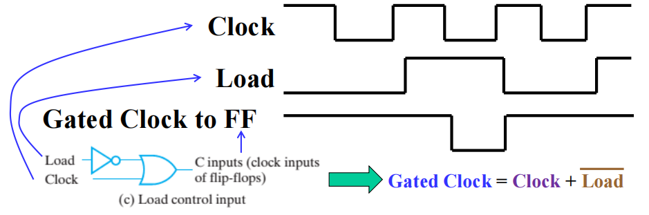

此时控制信号$C = Clock + \overline{Load}$

+ 当$Load = 0$时，$C = 1$，时钟信号失效，寄存器**保持**原来的数据
+ 当$Load = 1$时，$C = Clock$，时钟信号生效，寄存器**加载**新数据

!!! warning "可能的问题"

	由于门延迟的问题(上面例子中的非门)，因而整个电路出现了**时钟偏移(time skew)**，即在同步时序电路中，相同的源时钟信号在不同的时间里到达不同的元件中，这是应当需要避免的问题。因此，我们将采用下面的方法来解决。

### Registers with Load-Controlled Feedback

解决方案：

+ 保持时钟的连续运行
+ 用一个**加载控制**，在原数据和新数据之间进行**选择**，即是要保持数据还是加载数据(类似一个2-1 MUX)
电路实现：

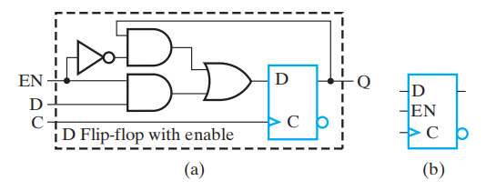

+ $EN = 0$时，$D = Q$，也就是**保持**之前的值
+ $EN = 1$时，$D$**加载**新的值

这种电路被称为**带使能的D触发器(D flip-flop with enable)**，可避免时钟移，所以更推荐这个方案。

🌰：带有**并行加载**的4位寄存器

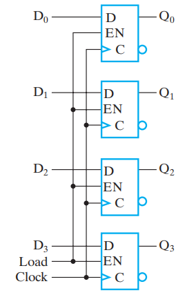

>之所以说是“并行加载”的，是因为每个触发器均由一个$Load$信号控制，因此要么同时保持4位数据，要么同时加载4位数据

### Datapath and Control Signals

+ **数据通路(datapath)** 是执行数据加工操作(寄存器传输和微操作)的一组函数单元(比如ALU, MUX)，寄存器和总线
+ **控制单元(control unit)** 产生控制信号，告诉数据通路要做什么(决定操作序列)

## Register Transfer Operations

**寄存器传输操作(register transfer operations)**：对存储于寄存器内的数据进行移动和加工操作，它由以下部分组成：

+ 一组*寄存器*
+ **微操作(microoperations)**：对存储于寄存器内的数据进行的基本操作，比如加载(load)、计数(count)、移位(shift)、加(add)、按位或(bitwise OR)，等等
+ *控制*操作：监督系统的操作序列

**寄存器传输语言(register transfer language, RTL)**：一种用于描述寄存器传输中的逻辑行为的语言

表示寄存器的图形化符号：

RTL中的常用表示法：

???+ info "注"

	+ 特殊意义的字母：
		+ AR：地址寄存器(address register)
		+ PC：程序计数器(program counter)
		+ IR：命令寄存器(instruction register)
	+ n位寄存器，标号为0~n-1，默认0标在最右边，从右往左标号，这种顺序被称为*小端序(little-endian)*，相反的顺序(即0在最左边，从左往右标号)被称为*大端序(big-endian)*
	+ 看到上方图(d)：我们用L表示低阶字节0$\sim$7，用H表示高阶字节8$\sim$15。PC(L)可以写成PC(7:0)，PC(H)可以写成PC(15:8)
	+ R1 $\leftarrow$ R2表示将R2的<u>副本值</u>传输给R1，其中R2被称为*源(source)*，R1被称为*目的地(destination)*
	+ 时钟不在寄存器传输操作的讨论范围内

**条件传输(conditional transfer)**

**控制表达式(control expression)** 具体说明了运算的逻辑条件：

+ if 控制表达式 == 逻辑`1` $\rightarrow$ 执行运算
+ if 控制表达式 == 逻辑`0` $\rightarrow$ 不执行运算

If (K1 = 1) then (R2 $\leftarrow$ R1) 可以简记为：
$$
K1: (R2 \leftarrow R1)
$$
其中K1为控制变量，具体说明微操作的条件执行

图示：

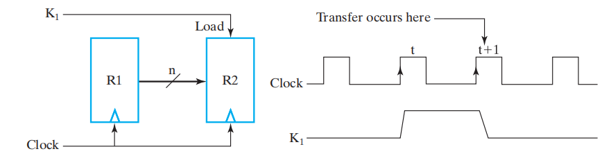

而$K3: R2 \leftarrow R1, R1 \leftarrow R2$ 表示同时*交换*R1和R2的值

???+ info "RTL, VHDL和Verilog的寄存器传输符号"

	

	
	

## Microoperations

**微操作(microoperation)** 的4种类型：

+ *传输(transfer)*：将数据从某个寄存器转移到另一个寄存器内
+ *算术(arithmetic)*：对寄存器内的数据执行算术运算
	+ 加法 +
	+ 减法 -（一般用补码实现，具体操作见[Chap 3](3.md#unsigned-2s-complement-subtraction)）
	+ 乘法 *
	+ 除法 /
+ *逻辑(logic)*：执行按位逻辑运算
	+ 逻辑或 $\vee$
	+ 逻辑与 $\wedge$
	+ 逻辑异或 $\oplus$
	+ 非(取反码) $\overline{X}$
+ *移位(shift)*：对寄存器内的数据进行移位

!!! note "具体描述"

	=== "算术微操作"

		

		
		

		>注：关注第2,3行(反码、补码的表示)

		!!! example "加减法器"

			>回顾[Chap 3](3.md#signed-2s-complement-arithmetic)的加减法器设计

			$$
			\begin{align}
			\overline{X} \cdot K1: & R1 \leftarrow R1 + R2 \notag \\
			X \cdot K1: & R1 \leftarrow R1 + \overline{R2} + 1 \notag
			\end{align}
			$$

			>注：$X$决定运算模式(0：加法，1：减法)，$K1$为使能信号

			电路实现：

			

			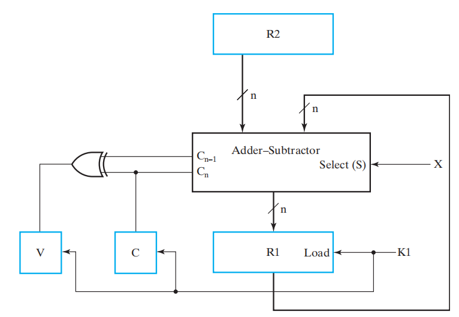
			

			>注：**溢出(即最高位的进位)**输出会被传输到V中(一个触发器)(前提是K1 = 1)

	=== "逻辑微操作"

		

		
		

		>注：对于n位的寄存器，一个逻辑微操作需要的门的数量为n个

		??? example 

			=== "区别一些符号"

				$$
				(K1 + K2):\ R1 \leftarrow R1 \vee R3
				$$
				>注：
				>
				>+ 条件中出现的'+'表示“或”运算
				>+ 而$R1 \leftarrow R1 + R3$ 中的‘+’表示“加法”微操作
				>+ 用'$\vee$'表示“或”微操作

			=== "掩码"

				+ 逻辑与：
						

						
						

				我们仅保留了R1的低位部分，高位部分均变成0
				+ 逻辑或：
						

						
						

				我们仅保留了R1的低位部分，高位部分均变成1
				+ 逻辑异或：R1的低位部分得到保留，而高位部分全部取反
						

						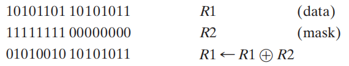
						

	=== "移位微操作"

		

		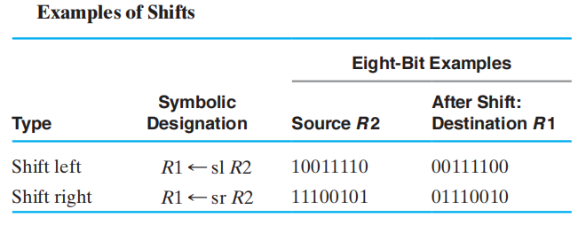
		

		+ 具体实现方法见[移位寄存器](#shift-registers)一节
		+ 移位往往用到“*0填充(zero fill)*”：左移-右边补0，右移-左边补0。这样的位被称为**进入位(incoming bit)**
		+ 移出去的位一般就抛弃掉，这种位被称为**移出位(outgoing bit)**
		+ 有时，需要用1个单独的触发器提供要移位的数据，或者获取移位后的数据
		+ 还有更复杂的移位（翻转，算术运算……），这里就略过了
		+ 还可以实现多个位的移动，如果通过1个变量指定移动的位数，称该变量为*移位量(shift amount)*

## Register Transfer Structures

类别：

+ **基于多路选择器的传输(multiplexer-based transfer)**：由单个MUX，从多个输入中进行挑选
+ **基于总线的传输(bus-based transfer)**：由一个共用的MUX(它驱动一条向多个寄存器提供输入的总线)从多个输入中进行挑选
+ **三态总线(three-state bus)**：由一个三态门驱动器(其输出与供给多个寄存器的总线相连接)从多个输入中进行挑选

### Multiplexer-Based Transfers

🌰：

$$
K1: R0 \leftarrow R1 \quad K2\overline{K1}: R0 \leftarrow R2
$$
框图：

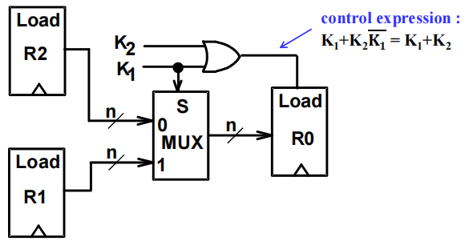

更详细的内部结构图(4位寄存器)：

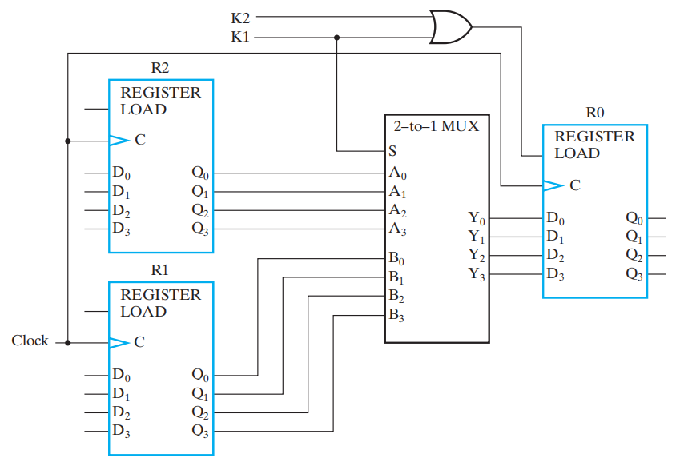

该类模型的泛化：

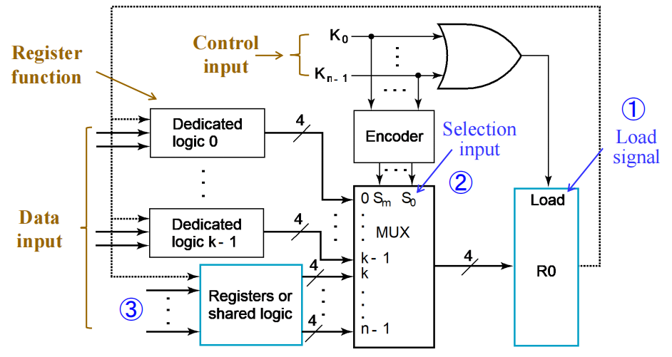

+ MUX的信息输入部分中，有k个来自**专用逻辑**的输入，以及n - k个来自寄存器或**公用逻辑**的输入
+ 通过一个编码器，将n个选择转化为MUX的m个选择输入
+ 缺陷：开销较大

>专用逻辑、公用逻辑的概念见后面的[小节](#register-cell-design)

### Bus-Based Transfers

=== "dedicated MUX-based transfers"

	>事实上，这种寄存器传输并不是基于总线实现的，放在这里只是为了和后面的设计进行对比

	

	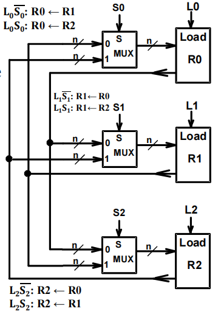
	

	+ 每个MUX都是某个寄存器的**专用逻辑(dedicated logic)**
	+ 能够实现同步传输

=== "multiplexer bus"

	

	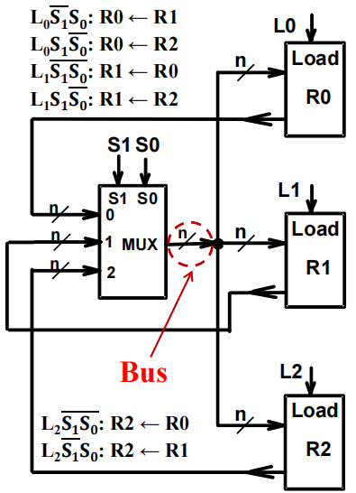
	

	+ 由一个MUX驱动的单个总线，也就是说该MUX是寄存器的**共用逻辑(shared logic)**
	+ 优点：电路更精简，成本更低
	+ 缺点：同一时间内只能传输一个数据

=== "three-state bus"

	

	
	

	+ 三态门的实现与共用MUX本质上是差不多的，因此它也只能一次传一个数据
	+ 但是三态门的实现降低了成本，因而也更常用
	+ 这里的符号可以进一步简化，最终可以得到右侧的电路图

	

	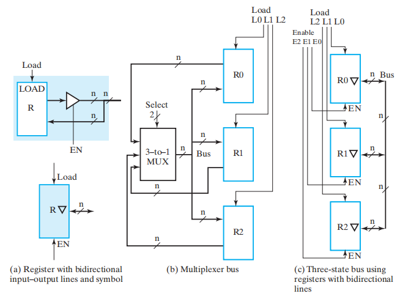
	

	+ 这里我们用到了使能信号$EN$：当$EN = 1$时表示输出，当$EN = 0$时表示输入
	+ 真正决定是否读入寄存器的是$Load$

## Shift Registers

**移位寄存器(shift register)** 能将数据向MSB或LSB的位置移动

### Serial Shift Register

移位寄存器最简单的实现：仅用一组按行排列连接起来的*D触发器*构成：

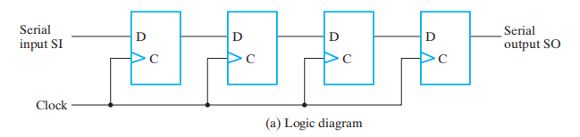

+ **串行输入/右移输入(serial input/ shift right input)**——数据输入
+ **串行输出(serial output)**——数据输出

符号：

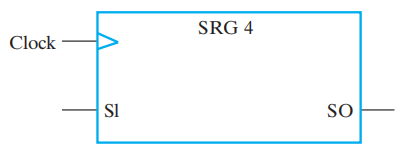

:chestnut:

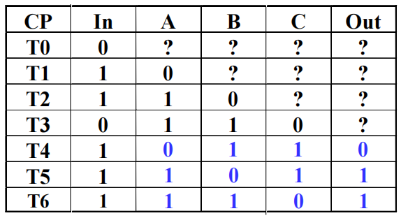

+ CP表示时钟脉冲，$T_i$表示第i个时钟周期
+ '?'表示未知状态，

### Parallel Load Shift Registers

"并行"主要体现在两方面：

+ **并行输出(parallel output)**：在同一时钟周期内得到所有触发器的结果
+ **并行载入(parallel load)**：在同一时钟周期内对所有触发器载入数据

n位**并行加载移位寄存器(parallel load shift registers)**

!!! note "细节分析"

	+ 观察右侧的触发器，发现其结构大致类似上面的串行移位
	+ 较麻烦的可能还是分析每个触发器对应的逻辑门，每个与门的功能如下：

		+ 第一个与门$F_{i1} = \begin{cases}Shift \cdot SI & \text{第一个FF} \\ Shift \cdot Q_{i - 1} & \text{其余FF}\end{cases}$，当$Shift = 1$时，寄存器执行**移位**操作

		+ 第二个与门$F_{i2} = \overline{Shift} \cdot Load \cdot D_i$，当$\overline{Shift} \cdot Load = 1$时，寄存器执行**并行加载**
		+ 第三个与门$F_{i3} = \overline{Shift} \cdot \overline{Load} 
		\cdot Q_i$，当$\overline{Shift} \cdot \overline{Load} = 1$时，寄存器**保持**上次的值

	功能表：

	

	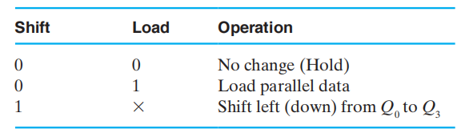
	

### Shift Registers with Additional Functions

上述移位寄存器只能进行单向移位操作，因此被称为**无向移位寄存器(undirectional SHR)**。下面我们将实现一个具备*右移*、*左移*、*并行加载*、*保持*功能的SHR，被称为**双向移位寄存器(bidirectional SHR)**

这里只展示整个移位寄存器的一部分，不难想到对于寄存器的每一位，我们都要用一个MUX进行选择

功能表：

## Counters

两种常见类型：

+ **异步计数器/行波计数器(asynchronous counters/ripple counters)**

	+ 对于表示最低位的触发器，它的时钟输入与时钟相连
	+ 对于表示其他位的触发器，它们的时钟输入与来自上一位的输出相连，因此电路不是同步的
	+ 当逐位接近最高位时，由于电路元件自身的延迟，输出发生改变的延迟将会越来越大
	+ 优点：低能耗

+ **同步计数器(synchronous counters)**

	+ 时钟与触发器的时钟输入直接相连
	+ 用逻辑实现想要的状态序列

### Ripple Counters

=== "2位行波计数器"

	

	
	

	工作流程：

	+ 当触发器A的时钟输入出现正边沿时，A取补，即从0变成1或从1变成0
	+ 触发器B的时钟输入 = $\overline{A}$
	+ 当触发器A的输出从1 $\rightarrow$ 0时，触发器B的时钟输入就会出现正边沿，此时B取补

	下面的时序图可以更加直观地展示上述内容：

	

	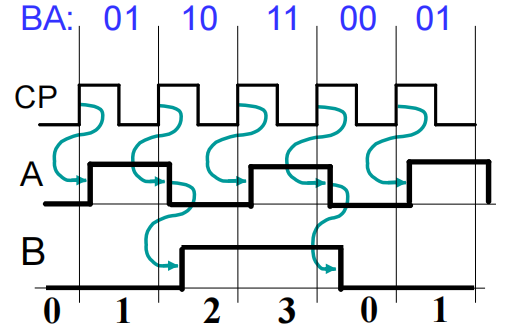
	

	+ 蓝绿色箭头表示“工作流程”所述的因果关系
	+ 对应的状态序列(B, A) = (0, 0), (0, 1), (1, 0), (1, 1), (0, 0), (0, 1)……

=== "3位行波计数器"

	对于3位行波计数器，当C = B = A = 1时，计数器的状态为(C, B, A) = (1, 1, 1)，下一次时钟的增加使得(C, B, A) = (0, 0, 0)。从下面的时序图中，我们发现：

	+ 时钟-输出延迟$t_{PHL}$导致时钟边沿不断增加的延迟
	+ 对于n为行波计数器，最坏情况的延迟为$n \cdot t_{PHL}$

	

	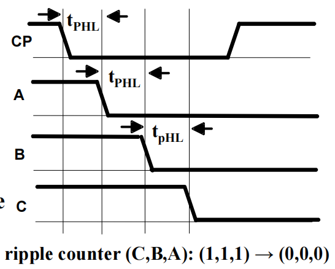
	

=== "4位行波计数器"

	4位行波计数器的框图

	

	
	

!!! note "理解行波计数器"

	这种电路之所以成为行波计数器，是因为每次边沿的变化（这里是正边沿）都会导致下一个触发器状态的改变。这种变化就像水面的涟漪一样在触发器“链”上传播(每次变化发生于前一阶段的时钟-输出延迟之后)

### Synchronous Counters

!!! note "类别"

	=== "serial gating"

		为了消除行波影响，我们让每个触发器使用共同的时钟，并用一个组合电路来生成下一状态。例如对于升计数器(up-counter)，我们会使用一个**自增器(incrementer)**

		

		
		

		内部细节：

		

		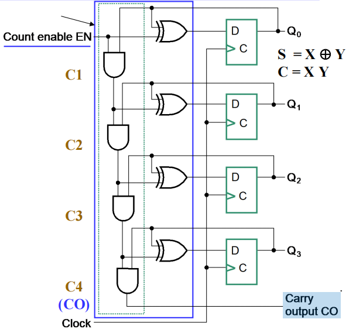
		

		+ 内部逻辑：蓝色方框表示[自增器](3.md#incrementing-and-decrementing)
		+ **计数使能(count enable, EN)**：迫使与门链的输出均为0，用来保持状态
		+ **出进位(carry out, CO)**：自增器的一部分。通过将CO与另一个计数器的EN端连接，构建一个更大的计数器

		上图中，与门链导致“进位链(carry chain)”的出现，因而产生较长的通路延迟，这种计数器的形式被称为**串行门(serial gating)**

	=== "parallel gating"

		将与门链 $\Rightarrow$ 并列的与门，我们得到了另一种形式——**并行门(parallel gating)**，这种形式减少了通路延迟，类似[超前进位](3.md#carry-lookahead-addercla)。它利用CO和EN来阻止较长的通路。逻辑图如下(用它替换serial gating电路图中蓝框部分的电路)：

		

		
		

		布尔方程：

		$$
		\begin{align}
		C1 & = EN \cdot Q_0  \notag \\
		C2 & = EN \cdot Q_0 \cdot Q_1 \notag \\
		C3 & = EN \cdot Q_0 \cdot Q_1 \cdot Q_2 \notag \\
		C4 & = EN \cdot Q_0 \cdot Q_1 \cdot Q_2 \cdot Q_3 \notag \\
		\end{align}
		$$

符号：

### Other Counters

+ **降计数器(down counter)**：向下计数
+ **升降计数器(up-down counter)**：既可以向上，也可以向下计数，取决于控制输入的值，比如$Up/\overline{Down}$
+ **并行加载计数器(parallel load counter)**：能够并行加载可用的值，取决于控制输入(比如$Load$)
+ **模n计数器(divide-by-n/ modulo n counter)**：
	+ 对除以n的余数进行计数
	+ 或者对任意n个状态的序列进行计数（根据具体状态分析）
	+ BCD计数器是一个模10计数器

#### Up-Down Binary Counter

🌰：4位升降计数器，有使能输入EN，选择输入S(S = 0时向上数，S = 1时向下数)

输入方程：

$$
\begin{align}
D_{A0} & = Q_0 \oplus EN  \notag \\
D_{A1} & = Q_1 \oplus ((Q_0 \cdot \overline{S} + \overline{Q_0} \cdot S) \cdot EN) \notag \\
D_{A2} & = Q_2 \oplus ((Q_0 \cdot Q_1 \cdot\overline{S} + \overline{Q_0} \cdot \overline{Q_1} \cdot S) \cdot EN) \notag\\
D_{A3} & = Q_3 \oplus ((Q_0 \cdot Q_1 \cdot Q_2 \cdot \overline{S} + \overline{Q_0} \cdot \overline{Q_1} \cdot \overline{Q_2} \cdot S) \cdot EN) \notag
\end{align}
$$

该方程既能用串行门实现，也能用并行门实现，这里就不给出具体的实现了。

#### Counter with Parallel Load

将[并行加载](#registers-with-load-controlled-feedback)的功能用于计数器内，这样可以给计数器设定一个我们想要的数字

电路实现：

功能表：

>注：可以看到Load的优先级高于Count，因为只要Load = 1，不管Count有什么值，计数器执行加载功能

#### Synchronous BCD

状态表：

>注：10-15(即1010-1111)是我们*不关心(don't care)* 的情况

使用K-maps，对下一状态的方程进行两级优化，得到以下方程：

$$
\begin{align}
D_1 & = \overline{Q_1} \notag \\
D_2 & = Q_2 \oplus Q_1\overline{Q_8} \notag \\
D_4 & = Q_4 \oplus Q_1Q_2 \notag \\
D_8 & = Q_8 \oplus (Q_1Q_8 + Q_1Q_2Q_4) \notag \\
\end{align}
$$

???+ question "思考"

	如果计数器的电源受到干扰，或者受到其他影响，使得计数器的状态不在0000-1001之间，会出现什么问题呢？

	$\therefore$ 我们需要让计数器具备“*自愈能力(self-healing ability)*”，使得它能在2个时钟周期内，从异常状态中回到正常状态。利用好那6个“不关心”的状态，可以实现这个“自愈能力”，状态表和状态图如下：

	

	
	

???+ info "考虑更高要求的自愈能力"

	+ 报错功能：电路需要表明遇到了非法状态。对于上述电路，$Error = Q_8Q_4 + Q_8Q_2$
	+ 在1个时钟周期内，状态从非法回到合法
	+ 从非法状态返回至一个具体的状态(比如0)

另一种实现方法：并行加载二进制计数器 + 与门

电路实现：

>注：当计数到1001时，Q0 = Q3 = 1，这使得Load = 1，计数器执行加载功能，将读入D(3: 0)的值，即0000，从而实现0-9之间的计数

??? example "例题"

	=== "问题"

		

		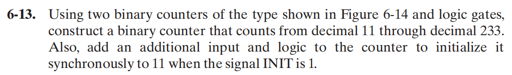
		

	=== "答案"

		

		
		

#### Counting Modulo N

下列技术将用到带有异步/同步的*清空(clear)*，以及/或者并行*加载(load)* 的n位二进制计数器：

+ ❌在模N计数中，当检测到最后的数*N*时，进行*异步清0*，或者*异步加载值0*。然而，这种方法使得数字仅在很短的时间内出现，导致在某些情况下无法正常工作
+ ✅在模N计数中，当检测到最后的数*N - 1*时，*同步清0*，或者*同步加载值0*
+ 检测最后的数，使用加载功能提前预设值，满足==最后的数 - 预设值 = N - 1==，也就是说计数的范围变成了[预设值，最后的数]。实在看不懂的话见下例中第2种实现方法

??? example "模7计数器"

	=== "常规实现"

		

		
		

		>注：原理同BCD计数器，只是它是数到6就要返回0

	=== "一点改变"

		预设加载值9，当数到14时，由于 14 - 9  =  7 - 1，因此需要回到9，计数范围为$[9, 14]$

		电路实现：

		

		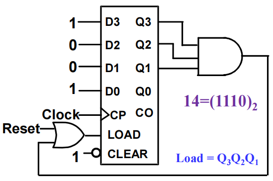
		

		>注：
		>
		>+ 预设值是在输入D(3: 0)处设置
		>+ 对于该计数器，如果最后的数设为了15，那么可以利用进位CO检测该最后的值(这样就省去一个与门了)

## Register Cell Design

??? info "时序电路设计的两种方法"

	+ **基本设计方法**：将*触发器*和*逻辑门*作为基本的构建模块
	+ **寄存器传输层级(register transfer level, RTL)设计**：将不同类型的*寄存器*(e.g. 计数器，移位寄存器)和*函数块*(e.g. MUX, 加法器)作为基本的构建模块
	>注：RTL设计是一种数据流方法——能够将数据从一个寄存器传到另一个

	比较：

	| Basic Design  | RTL Design               |
	| :-: | :-: |
	| 基本构建块为逻辑门和触发器 | 基本构建块为寄存器和函数块            |
	| 本质上更加机械化      | 更贴合行为描述，更加符合直觉(建立了数据流模型) |
	| 仅适用于状态数量少的电路  | 能够实现具有大量状态的复杂电路          |

在组合电路中，我们使用迭代阵列实现复杂的组合电路。同样地，我们可以将这种思想运用到时序电路的设计中——将迭代组合电路和触发器相连接，构建一个双态时序电路，被称为**寄存器单元(register cell)**。只要我们构建了一个存储器单元，然后复制n份副本，我们就构建出能够执行一个或多个微操作的n位寄存器。

由此，我们得到了寄存器设计的*步骤*：

+ ⭐设计具有代表性的寄存器单元
+ 复制并连接寄存器单元，构成完整的寄存器
+ 修改某几个寄存器单元以解决一些特殊情况或边界问题

寄存器单元设计的*方法*：

+ MUX：使用n输入MUX，以及一系列的传输源和函数

	[图片](#multiplexer-based-transfers)

	+ **专用逻辑(dedicated logic)**：实现微操作的组合逻辑被视为寄存器的一部分
	+ **共用逻辑(shared logic)**：被多个寄存器共用的，实现微操作的组合逻辑
	+ 通过控制信号$K_0, K_1, \dots, K_{n-1}$的或运算，生成加载使能信号
	+ 如何选择来自源，或/和传输函数？

		+ MUX + 编码器(如图所示)：控制输入需要被编码
		+ n $\times$ 2 与-或门：控制输入不需要被编码

+ [时序电路设计](4.md)
	+ 找到状态图或状态表，注意只有两个状态分配后的状态 = 寄存器单元的输出值
	+ 运用Chap 4介绍的流程来完成单元设计
	+ 优化：K-maps(4-6个变量)、手动优化或计算机辅助(更多的变量)

寄存器单元的*规范*包括：

+ **寄存器函数(register functions)**：一般用寄存器传输表示
+ **控制输入(control input)**
	+ *无编码*形式：比如Load, Shift, Add，1个时钟周期内至多有1个输入为1，即(0, 0, 0), (1, 0, 0), (0, 1, 0), (0, 0, 1)
	+ *编码*形式：比如S1, S0，所有的组合为(00, 01, 10, 11)
+ **数据输入(data input)**

!!! example "例题"

	=== "例1"

		=== "题目"

			

			
			

		=== "法一：MUX"

			+ 寄存器的加载信号：Load = CX + CY
			+ 由于控制输入的数量少，因此不需要用到编码器，我们直接将控制输入与MUX的选择输入连接，得到：S1 = CY, S0 = CX
			+ 寄存器的数据输入：

			$$
			\begin{align}
			D1 & = A_i \leftarrow B_i \vee A_i \quad (CY, CX) = (0, 1) \notag \\
			D2 & = A_i \leftarrow B_i \oplus A_i \quad (CY, CX) = (1, 0) \notag \\
			\end{align}
			$$

			+ 当Load = 0，即(CX, CY) = (0, 0)时，寄存器A保持状态

			电路实现：

			

			
			

			单个元件的门成本 = 19，共享译码器的成本 = 8

		=== "法二：时序电路设计"

			状态表：

			

			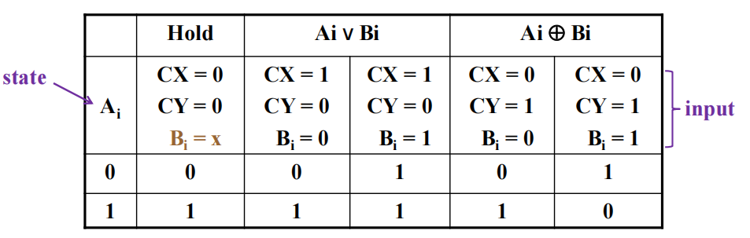
			

			+ 4个变量将给出状态表的16个状态项
			+ 因为我们不会用到CX = CY = 1的条件(即don't care conditions)，因此实际上我们只关心12个项

			K-map化简：

			

			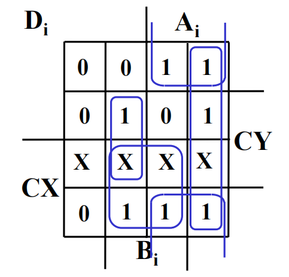
			

			我们得到SOP方程为：
			$$
			D_i = CXB_i + CY\overline{A_i}B_i + A_i\overline{B_i} + \overline{CY}A_i
			$$
			进一步化简(为了减少门成本)，得到：
			$$
			D_i = CXB_i + A_i \oplus (CYB_i)
			$$
			门输入成本 = 2 + 8 + 2 + 2 = 14，因此比法一更节省成本。而且由于没用到使能信号，成本将进一步减少

	=== "例2"

		=== "题目"

			

			
			

		=== "答案"

			

			
			

!!! info 

	书上($P_{354-359}$)还有2个寄存器单元设计的例子，均采用时序电路设计的方法（没用到寄存器），值得好好阅读和理解

## Control of Register Transfers

### Introduction to Register Transfer Systems

基本元素：

+ 一组寄存器：大多数是数据通路，部分为控制单元
+ 基本操作(微操作)：寄存器传输
+ 控制：监督寄存器传输序列

### Register Transfer System Design Procedure

+ 写下详细的系统**规范(specification)**
+ 找出所有的*输入信号*(数据、控制、状态)，所有的*输出信号*(数据、控制、状态)，以及*寄存器*的数据通路和控制单元
+ 找出系统的**状态机(state machine diagram)**，包括作为输出的数据通路和控制单元上的*寄存器传输*
+ <u>找出所有的内部控制和状态信号</u>，用这些信号将状态机中的输出条件和行动分开(包括寄存器传输)，并将它们用表格表示出来
+ <u>画出数据通路的框图</u>，包括所有的控制、状态输入和输出；如果包括寄存器传输的硬件，画出控制的框图
+ <u>设计出具体的寄存器传输逻辑</u>，用于数据通路和控制
+ <u>设计控制单元逻辑</u>
+ 验证数据通路和控制单元结合后的操作是否正确，若失败，调试系统并验证改变后的系统，直至符合预期目标

??? example "A Design Example(涉及到[状态机](4.md#state-machine-design)的知识，可以选择性阅读)"

	🌰：Dashwatch（一种简单的停表，时间上限为99.99s）
	

	
	

	+ 输入：
		+ START：将时间复位至0，随后开始计时
		+ STOP：停止计时，在4位BCD数码管上显示最近的时间
		+ CSS：比较、存储和显示最小的时间
		+ RESET
	+ 输出：4位BCD数码管 + 小数点
	+ 寄存器：
		+ 4位BCD计数器(TM)：每隔0.01s向上数
		+ 16位并行加载计时器(SD)：存储最短的时间

	所有的输入、输出和寄存器：

	

	
	

	*寄存器传输输出*的状态机(摩尔型)

	

	
	

	+ S1：复位状态，初始化SD位1001100110011001(99.99)，即最大值
	+ S2：紧随S1发生，使TM = $(0000)_{BCD}$
	+ S3：计时状态。按下START键后进入计时状态，按下STOP键后退出。在该状态下，T的值在每个时间脉冲内自增1(0.01s，时钟频率 = 100Hz)，DIS显示TM的值
	+ S4：决定阶段，从以下3个状态中选择1个：
		+ 比较、存储并显示最短时间
		+ 继续显示TM的值
		+ 重新开始
	+ S5：比较TM和SD的值
	+ S6：如果TM更小，TM的值被加载至SD内
	+ S7：重新开始，并显示SD存储的最短时间

	输出控制/状态表：

	

	
	

	找出内部控制/状态信号：

	+ TM：计时器

		+ 复位至0：RSTM
		+ 向上计数的使能信号：ENTM
	+ SD：最短时间

		+ 加载SD：LSR = 1
		+ 选择输入 9999：UPDATE = 0
		+ 选择输入 TM：UPDATE = 1
	+ DIS：显示($B_1, B_0, DP, B_{-1}, B_{-2}$)

		+ 选择输入 TM：DS = 0
		+ 选择输入 SD：DS = 1
	+ 比较TM 和 SD（状态）

		+ TM < SD：ALTB = 1
		+ TM $\ge$ SD：ALTB = 0

	数据通路：

	

	
	

	数据通路的开发细节：

	+ TM：带有同步复位的4位BCD计数器

		+ 基于先前的BCD加法器设计
		+ 添加同步复位SRST
		+ SRST = RSTM
		+ C0(进入的进位) = ENTM
	+ A < B 比较器

		+ 比较TM 和 SD
		+ 设计从左往右的迭代单元阵列，输出C0
	+ SD：标准16位并行加载寄存器

		+ LOAD = LSR
		+ 使用16位2-1MUX，从$9999_{BCD}$和TM中选择并行加载输入D
		+ S = UPDATE

	显示逻辑：

	+ 16位2-1MUX
	+ 4位BCD7段数码管转换器
	+ 4位七段数码管显示器(带有小数点)：小数点控制：DP = 1

	取代寄存器传输的*控制信号输出*的状态机：

	

	
	

	使用D触发器进行独热码状态分配(7位)，得到下列输入方程：

	

	
	

	输出方程为：

	$$
	\begin{align}
	LSR & = S1 + S6 \notag\\
	RSTM & = S2 \notag\\
	ENTM & = S3 \notag\\
	UPDATE & = S6 \notag\\
	DS & = S7 \notag
	\end{align}
	$$

	>注：课本上还有一个更复杂的例子，我还没来得及看……

### Microprogrammed Control

+ **不可编程的系统(non-programmable system)**——具体系统
	+ 没有**编程计数器(program counter, PC)** 或者类似的寄存器
	+ 控制单元不进行获取和执行指令的操作，而是基于输入和数据通路的状态位，决定要执行的操作(序列)
+ **可编程的系统(programmable system)**——通用系统
	+ 一部分输入由一系列**指令(instruction)** 构成，被称为**程序(program)**
	+ 通常存储于内存，并且由PC决定地址
	+ 控制单元负责获取和执行指令

## Serial Transfers and Microoperations

+ 当系统在一段时间内只能传递或操作1位信息时，称这个系统处于**串行模式(serial mode)**
+ 与串行传输相对的**并行传输(parallel transfer)**：同时传输寄存器的所有位

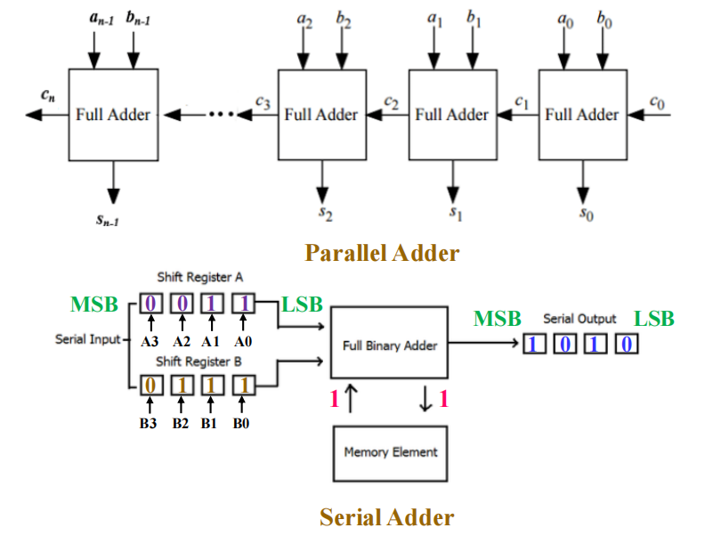

串行传输(移位)：

!!! example "串行加法器(serial adder)"

	它是一个时序电路，一次只能执行1位二进制加法

	用2个状态记住进位：
	
	+ G：carry in = 0
	+ H：carry in = 1

	=== "米里型"

		状态图：

		

		
		

		状态表：

		

		
		

		状态分配后的状态表：

		

		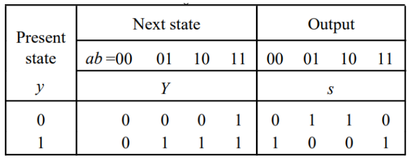
		

		化简(略)

		输入方程：$D = ab + ay + by$
		输出方程：$S = a \oplus b \oplus y$

		框图：

		

		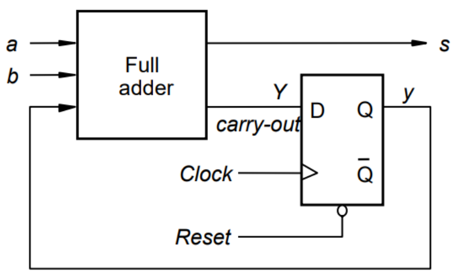
		

	=== "摩尔型"

		状态图：

		

		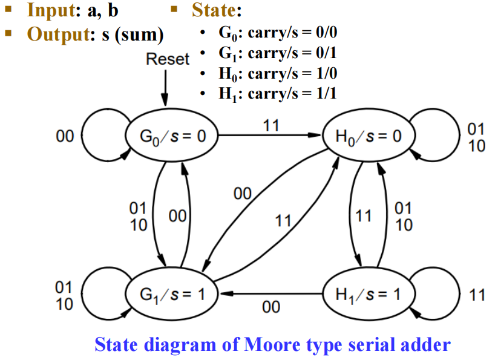
		

		状态表，输入方程和输入方程

		

		
		

		框图：

		

		
		

		上面2个电路仅保存了进位，如果我们想实现 $A \leftarrow A + B$，就需要保存A的值。教材给出了对应的实现：
		

		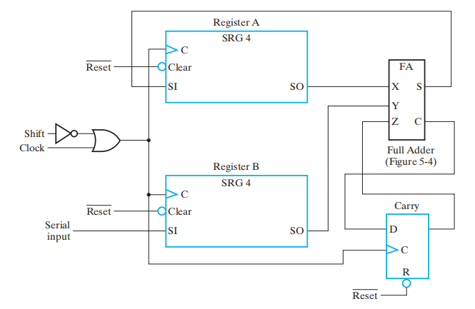
		
