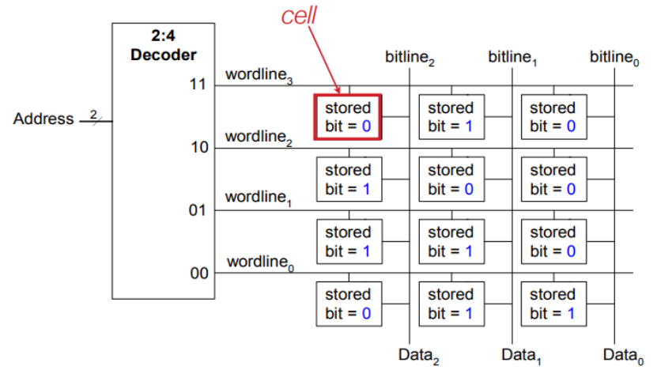
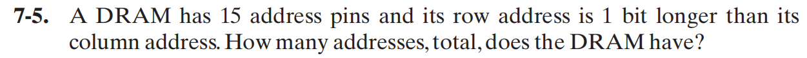
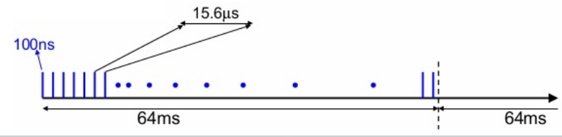
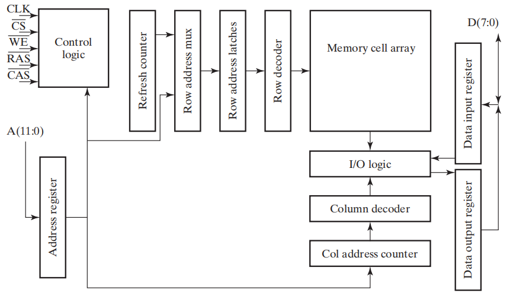

# Chap 7: Memory Basics

??? abstract "核心知识"

	+ 内存的基本知识
	+ SRAM
		+ 位切片
		+ 重合选择
		+ 字扩展和位扩展
	+ DRAM
		+ 位切片
		+ 刷新
		+ 类型：SDRAM、DDR SDRAM、RDRAM

## Memory Definitions

+ **内存(memory)**：由一组存储单元和其他必要电路组成，主要有以下两大类：

	+ **随机访问存储器(random access memory, RAM)**：数据能够在任何单元之间进行传输，且不依赖于特定的单元的一种内存
	+ **只读存储器(read-only memory, ROM)**：具体内容见[Chap 5](5.md#read-only-memory)

### Memory Organization

**内存组织(memory organization)**反映了内存中的数据是如何通过地址被访问的。

+ **内存数据(memory data)**：在内存中被存储的或被访问的1位或一组位
+ **内存地址(memory address)**：用来识别特定内存元素的一组位
+ **内存规模(memory size)**：字数(即深度，与地址个数相关) $\times$ 位数(即宽度，每个字的位长度)，比如2K $\times$ 8，32M $\times$ 16

!!! note "内存的数据类型"

	+ **位(bit)**：单个二进制数字
	+ **字节(byte)**：连续的8位数据
	+ **字(word)**：一组二进制位，大小一般为内存访问数据的规模，通常是2的幂的倍数个byte，比如2 bytes, 4 bytes。可以用来表示一个数字，一条指令，一个或多个数字字母字符，或者二进制编码的信息等。
	>个人理解：1个字 $\approx$ 1个数据

??? info "历史上较为知名的计算机架构及其内存组织"

	+ PDP-8：使用12位地址访问$2^{12}$个12位字
	+ IBM 360：使用24位地址访问$2^{24}$个字节，或者$2^{22}$个字
	+ Intel 8080：16位地址访问$2^{16}$个字节

### Memory Block Diagram

$2^k \times n$的内存单元：

+ k表示**地址线路(address lines)**的宽度，通过译码器，可以得到$2^k$个地址，每个地址指定一个特定的字
+ n表示字的位宽，注意：$2^k \ge n$
+ **读**和**写**用到了单个**控制线路(control lines)**，它们是最简单的内存操作
+ 有些内存单元还包括**芯片选择(chip select, CS)** / **芯片使能(chip enable, CE)**：内存的使能输入

!!! note "注"

	我们常常会看到RAM的规模会用$xK \times y$的表示法
	
	+ 这里的$xK$是指$x Kb$大小的深度，那么地址线路个数为$\log_2 x + 10$个
	+ 这块RAM的容量为$x \cdot y \cdot 1024$ bit

🌰：$1024 \times 16$的内存单元

该内存具有1024个字(地址个数)，每个字的内容为16位

### Basic Memory Operations

+ **内存操作(memory operations)**：对内存数据的操作，通常是对一些数据元素的**读(read)**和**写(write)**的操作

内存操作需要：

+ **地址(address)**：指明需要操作的内存位置，地址线路将这些信息带入内存中
+ **数据(data)**：需要写入或读出的数据
+ **操作(operation)**：传入内存并由控制信号指明类型的信息。典型的操作是**读(read)**和**写(write)**。

??? info "连接内存和CPU的总线"

	+ **地址总线(address bus)**：指明内存位置
	+ **数据总线(data bus)**：包含传入/出指定位置的数据
	+ **控制总线(control bus)**：额外的控制，比如芯片选择、读/写……

	

	
	

+ **读**：读取内存数据的操作，它的工作流程如下：
	+ 将想获取的字的二进制地址放入地址线路上
	+ 激活“读”输入
+ **写**：将数据写入内存的操作，它的工作流程如下：
	+ 将想获取的字的二进制地址放入地址线路上
	+ 将必须存入内存的数据位放入数据输入线路上
	+ 激活“写”输入

!!! note "内存的控制输入"

	+ 芯片选择(Chip Select)：决定是否进行读或写的操作(使能信号)
	+ 读/写($Read/\overline{Write}$)：指定特定的操作(读写二选一)

	功能表如下：
	

	
	

	+ 有时读和写的使能线路是一个带有精确时间信息的时钟(比如读取时钟(read clock)，写入频闪(write strobe))
	+ 有时内存必须对完成操作进行响应

??? info "异步RAM vs 同步RAM"

	+ **异步RAM**不依赖外部时钟的状态，只要接收到指令就开始读写数据
	+ **同步RAM**通过外部时钟进行同步，根据特定的时钟状态读写数据

	

	
	

### Memory Operation Timing

多数基本内存是*异步的*，即没有外部时钟(但有内部时钟)，且受控制输入和地址控制。

+ (读取)**访问时间(access time)**：从使用地址，到数据输出上数据出现之间的最大时间
+ **写入周期时间(write cycle time)**：从使用地址，到所有需要用来存储字的内存内部操作全部完成之间的最大时间

CPU必须提供一个内存控制信号，使得它自身内部的时钟操作与内存的读写操作同步，这意味着内存的访问时间和写入周期时间，与CPU时钟周期的固定数值相关

=== "读操作时序图"

	

	
	

=== "写操作时序图"

	

	
	

	写操作的关键时间位于1-0-1脉冲的边沿处：

	+ **地址**必须在1-0前的一段时间内*建立*起来，并且在0-1之后再消失，以防对其他地址的内容的干扰
	+ **数据**必须在1-0前的一段时间内*建立*起来，并且在0-1之后再消失，确保正确写入

## Random Access Memory(RAM)

RAM的类型：

+ **静态(static)**：信息被存储在*锁存器*内
+ **动态(dynamic)**：信息以*电荷*的形式被存储在*电容(capacitors)* 内，且用n型晶体管“访问”电容。由于电容会漏电，因此需要定期*刷新(refresh)* 电容的电荷

??? info "SRAM vs DRAM"

	

	
	

根据对电源的依赖性，我们也可以将内存分为以下两类：

+ **易变的(volatile)**：当电源切断时存储的信息丢失
+ **不变的(non-volatile)**：当电源切断时仍然保存信息

内存阵列结构：我们可以把内存看作位的二维阵列，每一位用一个**单元(cell)** 存储，如下图所示：

>注：存储单元通常作为电子电路来设计的，而非逻辑电路。尽管如此，方便起见，我们还是使用逻辑模型描述

## Static RAM(SRAM) Integrated Circuits

SRAM的存储单元包括：

+ SR 锁存器
+ 用于控制的选择输入
+ 双轨数据输入$B$和$\overline{B}$
+ 双轨数据输出$C$和$\overline{C}$

图示：

+ 输入：

	+ Select = 0：保持已被存储的内容
	+ Select = 1：存储内容取决于B和$\overline{B}$的值

+ 输出：

	+ Select = 0：C = $\overline{C}$ = 0
	+ Select = 1：C为存储值，$\overline{C}$为其补

### Bit Slice

要利用RAM片构建RAM IC，我们需要：

+ 译码器：将n个地址线路译码为$2^n$个字选择线路，用于挑选需要读取或写入的字
+ 数据输出上的三态门允许RAM IC能被结合为$2^n$个字的RAM

这种方法被称为RAM**位切片(bit slice)** ，下图展示了它的模型(以$2^n \times 1$ RAM为例)：

构成：

+ 多个RAM单元
+ 控制线路：

	+ 字选择(word select)：用于选择对哪一个RAM单元进行操作。==同时只能选择一个单元==，即只有一个单元对应的字选择输入为`1`，其余的字选择输入均为`0`

		+ word select = `0`：单元锁存器的值不变
		+ word select = `1`：值被加载至锁存器
	
	+ 位选择(bit select)：用于选择启用哪个位，在这里相当于整个$2^k \times 1$的使能信号(因为整个RAM只有1位)

	+ 读/写($Read/\overline{Write}$)

		+ $Read/\overline{Write}$ = `0`：写操作
		+ $Read/\overline{Write}$ = `1`：读操作

+ 数据线路

	+ 数据输入
	+ 数据输出

🌰：$16 \times 1$ RAM

与上面的模型略有不同：

+ 数据输出处用到了一个**三态门**，这样我们可以将RAM芯片的输出连在一起
+ 芯片选择(chip select)与RAM上的位选择接口相连，作为使能信号

### Coincident Selection

对于一个大型的内存阵列，我们需要更大的译码器，因此位线路上就会有更大的扇出，导致RAM的访问时间和写入周期时间延长，这会制约内存的扩展。

一种有效的解决方法是**重合选择(coincident selection)**：用2个译码器构建一个二维的RAM阵列，它们分别负责横向和纵向的选择，这可以有效削减译码器的大小和扇出。

在重合选择中：

+ 字选择 $\rightarrow$ **行选择(row select)**
+ 位选择 $\rightarrow$ **列选择(column select)**

!!! example "用 $4 \times 1$ RAM + 重合选择 实现RAM的扩展"

	=== "用$4 \times 4$的RAM单元阵列实现$16 \times 1$ RAM"

		

		
		

		+ 行译码器和列译码器均为2-4译码器
		+ 地址的高2位通过**字选择**来选择行，低2位通过**位选择**来挑选列，从而找到特定的RAM单元
		+ 列译码器有一个作为使能信号的芯片选择输入：

			+ 其值为0时，译码器的输出为0，因此不选择任何列
			+ 其值为1时，可以访问RAM的特定位

	=== "用$4 \times 4$的RAM单元阵列实现$8 \times 2$ RAM"

		

		
		

		+ 行译码器为2-4译码器，而列译码器为1-2译码器
		+ 地址的高2位挑选行，低1位挑选列(同时选中某2列，因为位宽为2)
		+ 输入输出都是2 bit，数据输入0被传入第一、三个 $4 \times 1$ RAM，数据输入1被传入第二、四个 $4 \times 1$ RAM

??? example "更复杂的例子"

	对于$1K \times 1$的内存

	+ 使用1个10-1024译码器，我们需要1024个10输入的与门
	+ 使用2个5-32译码器，我们需要32 * 2 = 64个5输入的与门
	
	

	
	

## Array of SRAM ICs

内存的容量是由地址宽度($\log_2$(字的数量))和位宽决定的，要想扩展内存，可以从下面两个角度考虑：

+ 地址空间扩展(地址位增加)——**字扩展(word extension)**
+ 字的位宽扩展——**位扩展(bit extension)**

🌰：

>其实，在介绍重合选择的时候，我们已经实现了字扩展和位扩展，但上面的例子用到的只是小规模的RAM单元，对于更大型的RAM扩展，我们需要用下面的方法来实现。

为了便于后面介绍RAM IC阵列，我们先给出$64K \times 8$ RAM的符号：

>注：输出部分的倒三角形表明使用了三态门，因此当CS = 0时，数据输出处于高阻抗(Hi-Z)状态(被禁用)；CS = 1时，数据输出被启用

### Word Extension

🌰：用$64K \times 8$ RAM构建$256K \times 8$ RAM

+ 输入数据、低位地址(即小RAM的全部地址，0-15)和读/写输入被传入每一个小的RAM
+ 高位地址(即扩展的RAM多出来的地址位，16-17)用一个**译码器**进行分配，用来挑选用哪个小的RAM；再由低位地址选择访问该RAM的哪个字

??? example "例题"

	=== "问题"

		

		
		

		

		
		
	

	=== "答案"

		

		
		

### Bit Extension

🌰：用$64K \times 8$ RAM构建$64K \times 16$ RAM 

+ 数据输入、数据输出均被分成两路8 bit信号，分别传输至两个的小RAM中
+ 这两个RAM接受相同的地址、芯片选择和读/写信号

---
??? info

	为了减少芯片引脚的数量，很多RAM ICs为数据输入和输出提供一个”公共站点(common terminal)“，我们认为这是**双向的(bidirectional)**，即：当*读*取数据时作为*输出*，当*写*入数据时作为*输入*。**三态门**便是一个不错的选择。

## Dynamic RAM(DRAM) Integrated Circuits

DRAM单元的构成：

+ 晶体管T作为"开关"使用，用来控制外部输入信号B和电容C
+ 电容C用于存储数据，当电容充满电时表示`1`，电容没有电时表示`0`

由于电容会慢慢漏电，所以需要定期**刷新(refresh)**电容，这样才能保证数据不会丢失，因此这种RAM被认为是“动态的”。

符号：

DRAM单元的逻辑模型(左下)以及与水压控制装置的类比(右)

基本操作：

+ 写：如上图(d)表示写入高电平，(e)表示写入低电平

+ 读：如上图(f)表示读取高电平，(g)表示读取低电平

??? info "sense amplifier"

	

	
	

观察上面的图(f)和图(g)，不难发现每次读操作都会稍微改变电容中存储的电荷量，这就是所谓“**毁灭性的读取(destructive read)**“：读取内存数据后，原来的内容被删除。下面的折线图直观反映该结果。

因此对于每一操作，都要进行**复原(restore)**操作，也就是**刷新**，将电容中的电荷量恢复至读取前的水平。

### Bit Slice

+ 如下图所示，DRAM的位切片与SRAM的[位切片](#bit-slice)本质上没有多大区别
+ 但是DRAM位切片的输出多了一个**感测放大器**，从而将电荷量的微小变化转换成变化明显的数字信号
+ B, C和感测放大器输出被连接在一起(三态门)，以防“毁灭性的读取”发生
+ 由于DRAM结构简单，成本更低，因此相比SRAM被更加广泛地应用于大型内存中

大型DRAM的框图：

+ 为了减少引脚的数量，DRAM地址通常被分为连续的两部分：*先*是*行*地址，*后*为*列*地址。这是因为：用来执行行选择的行地址需要在列地址之前使用(列地址需要根据行选择的结果读取数据)
>这里类似SRAM中[重合选择](#coincident-selection)的思想

!!! warning "误区"

	先看一些例题

	???+ example "例题"

		=== "例1"

			=== "问题"

				a DRAM has 15 address lines and 32 data lines, its maximum capacity is ____ Bytes.
			
			=== "答案"

				$2^{32}$ Byte

				分析：
				
				+ 总地址线路 = 行地址 + 列地址 = 15 + 15 = 30
				+ 总容量 = $\dfrac{2^{\text{总地址线路}} \times 32}{8} = 2^{32}$ Byte

	 	=== "例2"

			=== "问题"

				

				
				
	

			=== "答案"

				

				
				
	
	
	事实上，通过将地址分为连续的2部分(行地址 + 列地址，它们都是原地址的“副本”)，相当于将原来的地址线路条数“翻倍”了，从而有效减少地址线路的条数

+ 用寄存器保存来自读取或写入周期的行/列地址
+ **行地址选通(row address strobe)**$\overline{RAS}$：行地址寄存器的加载信号
+ **列地址选通(column address strobe)**$\overline{CAS}$：列地址寄存器的加载信号
+ 以及输出使能$\overline{OE}$，它们均为<u>低电平活跃</u>
+ *寄存器控制器(refresh controller)*和*寄存器计数器(refresh counter)*模块负责实现刷新功能

??? info "DRAM的访问顺序"

	

	
	

!!! note "DRAM的时序图"

	=== "读取"

		

		
		

	=== "写入"	

		

		
		

### Refreshing

!!! note "三种刷新方式"

	=== "**只刷新RAS(RAS-only refresh)(仅访问行，不访问列)**"

		+ RAS被激活，一个行地址(**刷新地址**)用于DRAM；CAS不动
		+ DRAM在内部读取一行，并放大读取数据。由于CAS被禁用，没有数据被传到输出引脚上
		+ 缺点：需要额外的外部逻辑设备来连续生成行地址

		

		
		

	=== "**RAS刷新前的CAS(CAS before RAS refresh)**"

		+ DRAM有自己的刷新逻辑——地址计数器。当序列用于CAS和RAS上，内部刷新逻辑生成一个地址，并刷新对应的单元
		+ 每个周期后，地址计数器会自增
		+ 内存控制器只需发出信号

		

		
		

	=== "**隐蔽刷新(hidden refresh)**"

		+ 伴随正常的读取或写入，CAS = 0，RAS按周期变化，有效执行第二种刷新方法。在这种刷新方法中，之前读取的输出数据依旧合法，因此认为刷新是隐蔽的
		+ 缺点：花费时间太长，导致后续读写操作的延迟

		

		
		

刷新模式：

+ **爆发模式(burst mode)**：停止工作，刷新所有数据

+ **分布模式(distributed mode)**：间隔一段时间刷新，从而避免长时间的内存阻塞，这种刷新方式更加常用

## DRAM Types

类型：

+ 同步DRAM(**SDRAM**)：DRAM + clock，实现同步
+ 双倍数据率SDRAM(**DDR** SDRAM)：在SDRAM的基础上，同时利用上升沿和下降沿读取数据
+ RAMBUS&reg; DRAM(**RDRAM**)：用相对更窄的总线来实现极高的内存访问速度

**爆发读取(burst read)**：高速缓存从DRAM读取数据时，总是一次性读取一串相邻的字，这样可以达到更快的内存访问速度。

### Synchronous DRAM

+ 所有的信号与**外部时钟(external clock)** 关联
	+ 使时间与其他系统(比如CPU)的匹配更加精确
	+ 同步寄存器出现于地址输入、数据输入和输出中
+ 爆发且有方向的读取和写入访问：
	+ **列地址计数器(column address counter)**：用来为将随时钟周期传输的内部数据分配地址
	+ 计数器的上限：address + burst length - 1
	+ **爆发(读取)长度(burst length)**
+ 一种用户可编程模式的寄存器
	+ CAS潜伏(latency)，爆发(读取)长度、爆发类型

🌰：16MB SDRAM的框图

SDRAM的时序图：

>注：这里的例子和时序图我理解的不是很透彻，推荐看[修佬の解释](https://note.isshikih.top/cour_note/D2QD_DigitalDesign/Chap07/#sdram)

**内存带宽(memory bandwidth)**：内存的速度——数据读取或存入的最大速率。单位一般为MB/s或GB/s。SDRAM的内存带宽与爆发大小(burst size)相关

???+ example "例题"

	+ 内存数据路径宽度：1B
	+ 内存时钟周期：7.5ns
	+ 等待时间(从应用行地址开始，直到第一个可用的字出现的时间)：4个周期

	=== "爆发读取长度：8B"

		+ 读取周期：(4 + 8) * 7.5 = 90ns
		+ 内存带宽：8 / (90 * $10^{-9}$) = 88.89 MB/s

	=== "爆发读取长度：2048B"

		+ 读取周期：(4 + 2048) * 7.5 = 15390ns
		+ 内存带宽：2048 / (15390 * $10^{-9}$) = 133.07 MB/s

### Double Data Rate Synchronous DRAM

+ 在时钟两侧的边沿均可传输数据
+ 提供每个周期内2个数据字的传输速率

🌰：

### RAMBUS DRAM(RDRAM)

>注：这块内容仅做了解即可

+ 在RDRAM ICs与连至处理器的内存总线之间的连接中使用**基于包的总线(packet-based bus)**
+ 总线包括：
	+ 3位行地址总线
	+ 5位列地址总线
	+ 16或18位(用于错误纠正)数据总线
+ 总线是同步的，在时钟两侧的边沿均可传输
+ 每个**包(packet)** 在4个时钟周期内提供8次传输，这意味着：
	+ 12位的行地址包
	+ 20位的列地址包
	+ 128或144位的数据包
+ RDRAM利用多个内存库，允许用不同的行地址对内存进行同时访问
+ 通过精密的电路设计，可以提高时钟频率，从而大大提高内存访问速度

🌰：16 MB RDRAM的时序图

## Arrays of DRAM Integrated Circuits

DRAM的阵列与SRAM类似，除了多了一个被称为**DRAM控制器(DRAM controller)** 的IC

+ 将地址分为行地址和列地址，并为它们的使用计时
+ 提供$\overline{RAS}$和$\overline{CAS}$，并为它们的使用计时
+ 在要求的间隔内执行刷新操作
+ 为系统的剩余部分提供状态信号(表明内存是否是处于活跃状态，或者是否在执行刷新操作)

DRAM组织：

