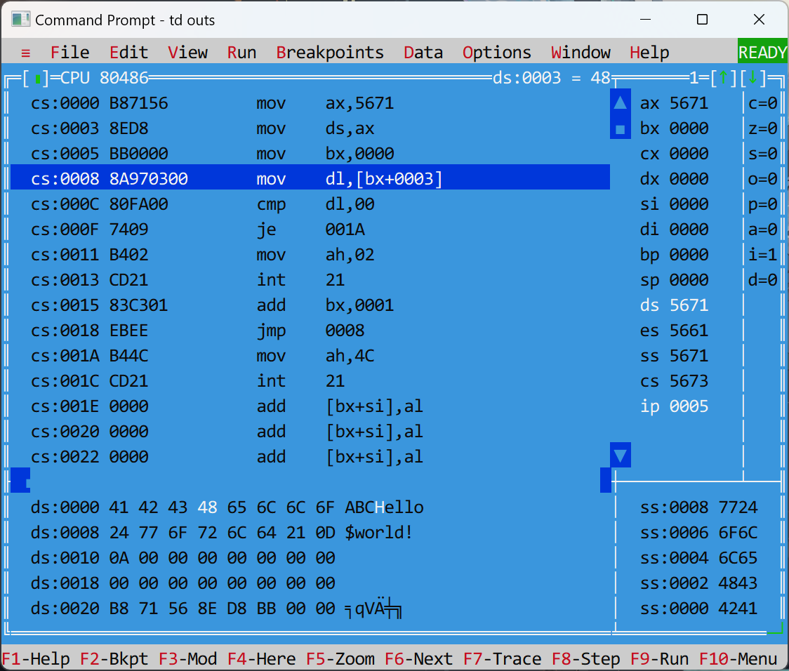
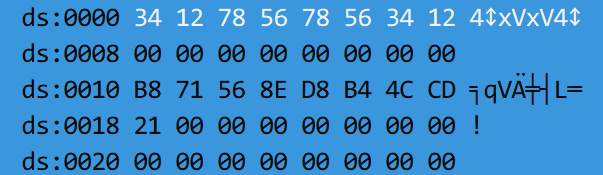

# 第3章 CPU、内存和端口

- CPU
    - 算术逻辑单元(ALU)：算术、逻辑和移位运算
    - 控制单元(CU)：取指令、解释指令、执行指令
    - 寄存器(register)：可以理解为CPU下的全局变量，CPU中只有它是可编程控制的
>注：这里只是简单提一下CPU的组成，具体原理可参见[《计算机组成》笔记](../../hardware/co/index.md)（目前还没学到CPU部分）

- 内存：存储指令和变量，是程序的运行空间
- 端口：CPU与I/O设备之间的接口


## 内存

### 物理地址与逻辑地址

DOS系统运行在CPU的实模式(real mode)下，可访问的地址范围为$[00000h, 0FFFFFh]$，即最多只能访问1MB内存空间。

用单个数值表示的地址称为**物理地址**(physical address)。由于8086芯片的每个寄存器只有16位宽度，寄存器无法直接存储物理地址，所以用存储在段地址寄存器和偏移地址寄存器的**逻辑地址**(logical address)（即**段地址:偏移地址**）来间接访问物理地址。

令物理地址为$\text{phy\_addr}$，逻辑地址为$\text{seg\_addr:off\_addr}$，物理地址与逻辑地址的转换关系式为：

$$
\text{phy\_addr} = \text{seg\_addr} \times 10h + \text{off\_addr}
$$

一个物理地址可以表示成多个逻辑地址，例如：12398h = 1234:0058 = 1235:0048 = 1236:0038 = 1230:0098。

- **段**(segment)：一块内存，满足：
    - 长度为$10000h$字节，即64KB
    - **20位首地址的低4位必须为0**，换句话说，段首地址的十六进制形式下的偏移地址的个位必须为0
- **偏移地址**(offset address)：段内某个变量或标号与行首之间的距离
    - 偏移地址 = 物理地址 - 段首地址（注意不是段地址）
    - 用`offset 变量名或标号名`表示变量或标号的偏移地址
    - 可以用常数表示
- **段地址**(segment address)：20位段首地址的高16位
    - 用`seg 变量名或标号名`或`段名`表示变量或标号的段地址
    - 不能用常数表示，只能用段寄存器表示
    - 段地址的1相当于偏移地址的10h


如何在已知某个变量的偏移地址`off_addr`和段地址`seg_addr`访问该变量：

- 将`seg_addr`赋值给某个段寄存器（比如`ds`）
- 再用`ds:[off_addr]`访问该变量

??? example "例子"

    ```asm
    data segment
        s db "ABC"
        s db "Hello$world!", 0Dh, 0Ah, 0
    data ends

    code segment
    assume cs:code, ds:data
    main:
        mov ax, data
        mov ds, ax
        mov bx, 0
    next: 
        mov dl, s[bx]
        cmp dl, 0
        je exit
        mov ah, 2
        int 21h
        add bx, 1
        jmp next
    exit:
        mov ah 4Ch
        int 21h
    code ends
    end main
    ```

    使用Turbo Debugger调试该程序：

    <div style="text-align: center">
        
    </div>

    观察发现：

    - `data`段的首字节为`a[0]`，数组`s`的偏移地址`offset s=3`（底部用白色高亮表示`s`的首字节）
    - `code`段的首字节为`main`标号对应指令的机器码的首字节，标号`next`的偏移地址`offset next=8`（用蓝色高亮表示`next`对应指令的位置，可以看到左侧`cs:0008`表示这条命令的逻辑地址）


### 直接寻址和间接寻址

>假设变量名或数组名为`var`

- **直接寻址**
    - 一般形式为：`段寄存器:var[常数]`或`段寄存器:[var+常数]`
- **间接寻址**
    - 一般形式为：`var[寄存器1+寄存器2+常数]`或`[var+寄存器1+寄存器2+常数]`，其中寄存器1和寄存器2至少存在1个，常数是整数，可正可负也可以是0
        - 寄存器只能在`bx`、`bp`、`si`、`di`四种寄存器内选
        - 如果出现两个寄存器相加的情况，其中一个寄存器必须从`bx`、`bp`中选，另一个必须从`si`、`di`中选
    - 80386的一般形式为：`段寄存器:[寄存器1+寄存器2*N+常数]`，其中`N`是集合$\{1, 2, 4, 8\}$内的一个元素，寄存器1与寄存器2只能在`eax`、`ebx`、 `ecx`、 `edx`、 `esp`、 `ebp`、 `esi`、 `edi`八种寄存器内选

### 小端规则

**小端规则**(little-endian)：当CPU<u>写入</u>或<u>读取</u>宽度大于8位的数据时，会按照“**低位在先高位在后**”的顺序存储或获取数据。换句话说，存储在寄存器内的数据的位顺序和我们看到的位顺序是相反的。

??? example "例子"

    假如内存中有以下数据：

    ```asm
    data segment
        a dw 1234h
        b dw 5678h
        c dd 12345678h
    data ends
    ```

    实际的内存空间为：

    <div style="text-align: center">
        
    </div>

    可以看到，白色高亮部分表示的是`a`, `b`, `c`的值，它们的值分别为`3412`, `7856` 和 `78563412`


### 缺省段址和段覆盖

缺省段址的规则：

- 直接寻址：令段址为`ds`
- 间接寻址：
    - 偏移地址含寄存器`bp`：令段址为`ss`
    - 偏移地址不含寄存器`bp`：令段址为`ds`

段覆盖：在操作数前添加一个段前缀（比如`cs:`、`ds:`等）来强制改变操作数的段址

>注：这两个概念并不是什么特殊情况，寻址的时候一定会涉及两者中的一种。

### 内存空间划分和显卡地址映射

16 位 CPU 只能访问 0000:0000 到 F000:FFFF 之间的1M内存空间，其划分如下：

|地址范围|用途|说明|
|:-|:-|:-|
|[0000:0000, 9000:FFFF]|操作系统和用户程序|占384K的内存|
|[A000:0000, A000:FFFF]|映射显卡内存|图形模式|
|[B000:0000, B000:FFFF]|映射显卡内存|-|
|[B800:0000, B800:FFFF]|映射显卡内存|文本模式|
|[C000:0000, F000:FFFF]|映射ROM|占640K的内存|

其中显卡地址映射分为**文本模式**(text mode)和**图形模式**(graphics mode)，具体来说：

#### 文本模式下的显卡地址映射

$80 \times 25$（每行80个字符，每列25个字符）文本模式的屏幕坐标系统如图所示：

<figure style=" width: 60%" markdown="span">
    
    
    <figcaption></figcaption>
</figure>

- 每两个内存单元（2字节）决定屏幕上的一个字符
    - 前一个内存单元（1字节）表示字符的ASCII码值
    - 后一个内存单元（1字节）表示字符的颜色，每个位的意义如下所示：

        ```
        7: 闪烁
        6: 红
        5: 蓝
        4: 绿

        3: 高亮
        2: 红
        1: 绿
        0: 蓝
        ```

        - 高4位表示背景色
        - 低4位表示前景色
- 屏幕坐标(x, y)对应的显卡偏移地址`text_mode_offset`的计算公式为：
```
text_mode_offset = (y * 80 + x) * 2
```

- 虽然这是一个二维平面，但是在内存中所有的数据都是连续的（图中的79x2和80x2表示的是十进制的偏移地址，为了方便就这样写了）

??? example "例子"

    设`ds=0B800h`

    ```asm
    mov byte ptr ds:[0], 'A'
    mov byte ptr ds:[1], 74h
    mov byte ptr ds:[2], 'B'
    mov byte ptr ds:[3], 72h
    ```

    结果是：

    <figure style=" width: 60%" markdown="span">
        
        
        <figcaption></figcaption>
    </figure>

    


#### 图形模式下的显卡地址映射

$320 \times 200$图形模式的屏幕坐标系统如图所示：

<figure style=" width: 60%" markdown="span">
    
    
    <figcaption></figcaption>
</figure>

- 1个内存单元（1字节）决定屏幕上的一个点，其值代表该点的颜色（256种）
- 屏幕坐标(x, y)对应的显卡偏移地址`graphics_mode_offset`的计算公式为：
```
graphics_mode_offset = y * 320 + x
```

### 宽度修饰

宽度修饰词用于限定变量（**不能**修饰常数）的宽度，有以下几种：

- `byte ptr`：变量宽度为8位
- `word ptr`：变量宽度为16位
- `dword ptr`：变量宽度为32位

不必使用宽度修饰的情况：

- 指令中的变量有变量名时（比如`mov s[1], 0`）
- 指令中的另一个操作数有明确宽度时（比如`mov ds:[bx], ax`）

对应的，当某个指令中的变量无变量名，且无法根据另一个操作数推断变量宽度时，必须对该变量加上宽度修饰。

## 寄存器

- 8086一共有14个寄存器（均为16位宽度），分别为：`ax`、`bx`、`cx`、`dx`、`sp`、`bp`、`si`、`di`、`cs`、`ds`、`es`、`ss`、`ip`、`fl`
- 80386除了段寄存器仍为16位，其余寄存器均扩展至32位，这14个寄存器分别为：`eax`、`ebx`、`ecx`、`edx`、`esp`、`ebp`、`esi`、`edi`、`cs`、`ds`、`es`、`ss`、`eip`、`efl`

按照寄存器的用途可分为：

- 通用寄存器
- 段地址寄存器
- 偏移地址寄存器
- 标志寄存器

### 通用寄存器

- 作用：算术、逻辑、移位运算
- 寄存器：`ax`、`bx`、`cx`、`dx`（80386中寄存器名称前多个`e`）
    - 其中`ax`的低8位和高8位可以分别用寄存器`al`和`ah`表示。下图展示了`eax`、`ax`、`ah`、`al`的关系：

    <figure style=" width: 80%" markdown="span">
        
        
        <figcaption></figcaption>
    </figure>

    - `bx`、`cx`、`dx`与`ax`同理。

### 段地址寄存器

- 作用：表示段地址
- 寄存器：
    - `cs`：代码段寄存器
        - 不能用`mov`指令赋值，只能用以下指令间接改变其值
            - `jmp far ptr`
            - `jmp dword ptr`
            - `call far ptr`
            - `call dword ptr`
            - `retf`
            - `int`
            - `iret`
    - `ds`：数据段寄存器
    - `es`：附加段寄存器
    - `ss`：堆栈段寄存器
        - 后三者可以用`mov`指令赋值，但源操作数不能是常数，只能是寄存器或变量
            - 寄存器只能在`ax`、`bx`、`cx`、`dx`、`sp`、`bp`、`si`、`di`中选
            - 变量必须是`word ptr`宽度的

### 偏移地址寄存器

- 作用：表示偏移地址
- 寄存器：
    - `ip`
        - 与`cs`搭配使用，`cs:ip`指向当前将要执行的指令
        - 该寄存器的名称不能在任何指令中出现
    - `sp`
        - 与`ss`搭配使用，`ss:sp`指向堆栈顶端
        - 不能置于`[]`内用于间接寻址
    - `bp`、`si`、`di`以及`bx`（通用寄存器）
        - 能放在`[]`内用于间接寻址
        - 还可以参与算术、逻辑、移位运算

!!! note "寄存器的初始化"

    DOS把可执行程序加载到内存后，即将控制权交给可执行程序前，会对以下寄存器初始化：

    - `cs`：代码段的首地址
    - `ip`：首条指令的偏移地址
    - `ss`：堆栈段的段地址
    - `sp`：堆栈段的长度
    - `ds`：PSP段地址
    - `es`：PSP段地址

    其中PSP（程序段前缀，program segment prefix）是一个由DOS分配给当前可执行程序，位于首段之前，长度为`100h`字节的内存块，它存储了与当前可执行程序的进程相关的一些信息，比如程序的命令行参数等

### 标志寄存器

- 作用：存储标志位
- 寄存器：`fl`，它里面的位分为3类
    - 状态标志：反映当前指令的执行情况，包括：`cf`、`zf`、`sf`、`of`、`pf`、`af`
    - 控制标志：控制CPU，包括：`df`、`if`、`tf`
    - 保留位（下图用 X 表示）：除了第1位为1，其余保留位恒为0

<figure style=" width: 90%" markdown="span">
    
    
    <figcaption></figcaption>
</figure>

- 各类标志如下：
    - （第0位）**进位标志**(carry flag) `cf`：
        - 两数相加产生进位，`cf = 1`
        - 两数相减产生借位，`cf = 1`
        - 两数相乘的乘积宽度超过被乘数宽度，`cf = 1`
        - 移位指令最后移除的那1位保存在`cf`中
        - 相关指令：`jc`、`jnc`、`clc`、`stc`、`cmc`、`adc`等
    - （第6位）**零标志**(zero flag) `zf`：
        - 运算结果为0时，`zf = 1`；运算结果不为0时，`zf = 0`
        - 相关指令：`jz`、`jnz`、`je`、`jne`
    - （第7位）**符号标志**(sign flag) `sf`：
        - 表示运算结果的最高位，当运算结果为正时`sf = 0`，为负时`sf = 1`
        - 相关指令：`js`、`jns`
    - （第11位）**溢出标志**(overflow flag) `of`：
        - 用于检测溢出情况，包括：
            - 两个正数相加变负数时，`of = 1`
            - 两个负数相加变正数时，`of = 1`
            - 两数相乘的乘积宽度超过被乘数宽度时，`of = 1`
            - 当仅移动1位且移位前的最高位$\ne$移位后的最高位时，`of = 1`
        - 相关指令：`jo`、`jno`
    - （第2位）**奇偶校验标志**(parity flag) `pf`：
        - 当运算结果低8位中`1`的个数为偶数时，`pf = 1`，否则`pf = 0`（偶校验）
        - 相关指令：`jp`、`jnp`、`jpe`、`jpo`
    - （第4位）**辅助进位标志**(auxiliary flag) `af`：
        - 若执行加法时第3位向第4位产生进位时，`af = 1`
        - 若执行减法时第3位向第4位产生借位时，`af = 1`
        - 无相关指令，但它跟BCD码调整指令有关
    - （第10位）**方向标志**(direction flag) `df`：
        - 作用：控制字符串操作指令的运行方向
            - `df = 0`：字符串操作指令按正向（从低到高）运行
            - `df = 1`：字符串操作指令按反向（从高到低）运行
        - 相关指令：`cld`（使`df = 0`）、`std`（使`df = 1`）
    - （第9位）**中断标志**(interrupt flag) `if`：
        - 作用：控制硬件中断
            - `if = 0`：禁止硬件中断
            - `if = 1`：允许硬件中断
        - 相关指令：`cli`（使`if = 0`）、`sti`（使`if = 1`）
    - （第8位）**陷阱标志**(trap flag) `tf`：
        - 作用：设置CPU的运行模式，与调试相关
            - `tf = 0`：常规模式，连续执行指令
            - `tf = 1`：单步模式，每执行一条指令后都会跟随执行`int 01h`中断指令，用于调试
        - 相关指令：`pushf`、`popf`

        ```asm
        ; 令tf = 1
        push            ; 将fl压入堆栈中
        pop  ax         ; 从堆栈中弹出`fl`的值并保存到ax中
        or   ax, 100h   ; 把ax的第8位置1
        push ax
        popf            ; 从堆栈中弹出ax的值并保存到fl中，此时tf = 1

        ; 令tf = 0
        pushf
        pop  ax
        and  ax, 0FEFFh  ; 把ax的第8位清零
        push ax
        popf             ; 从堆栈中弹出ax的值并保存到fl中，此时tf = 0
        ```

## 端口

- CPU不能直接控制I/O设备，它通过以下方式访问I/O设备：
    - 读：CPU从I/O设备相关端口读取信号，获取I/O设备的反馈信息
    - 写：CPU向I/O设备相关端口发送信号，将控制信号输出到I/O设备
- 端口地址仅有16位偏移地址，无段地址，取值范围为[0000h, 0FFFFh]
- 读写端口地址的指令是`in`和`out`

