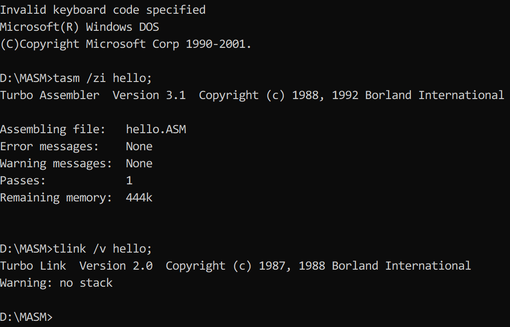
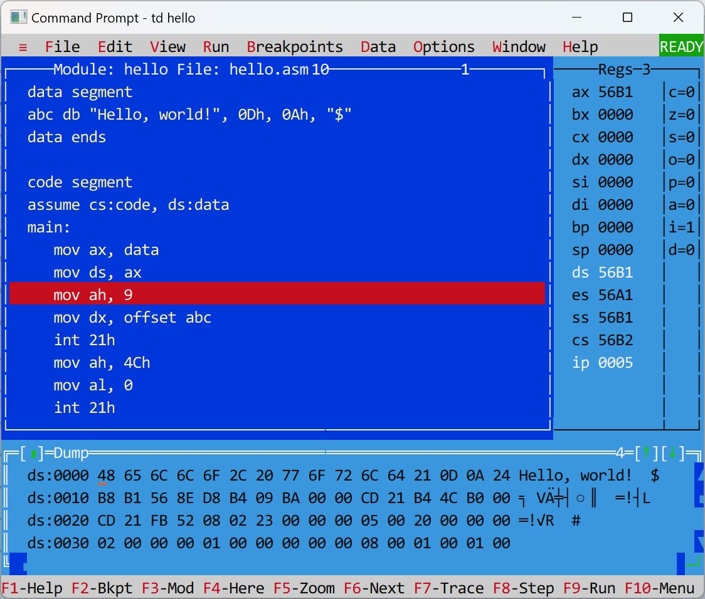
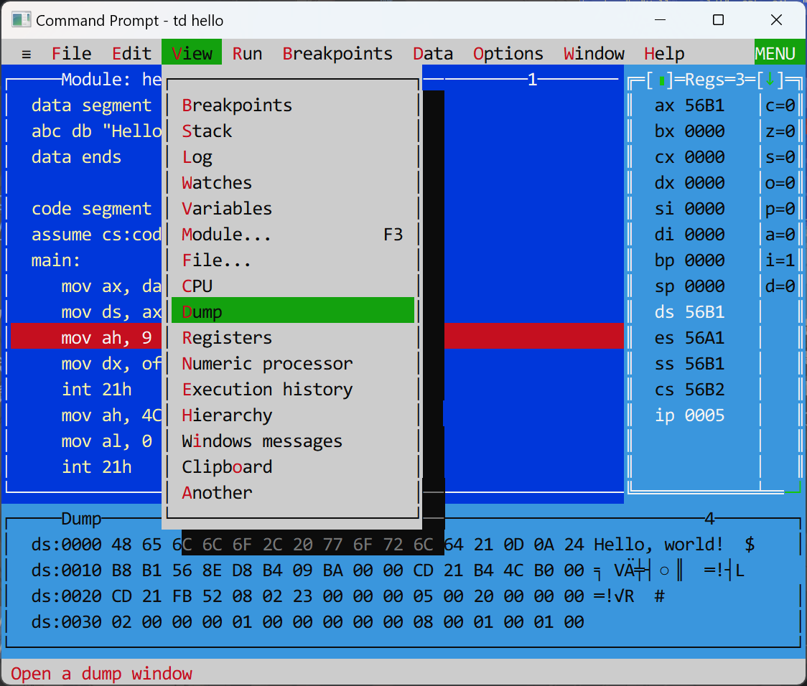
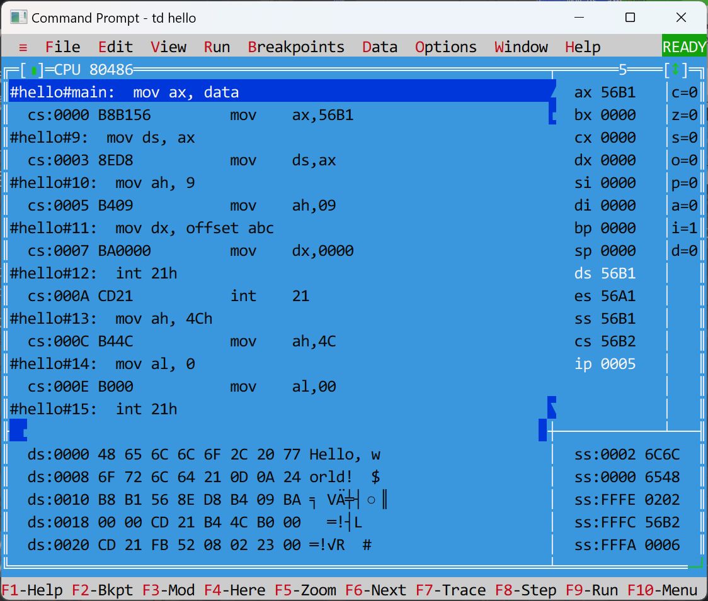
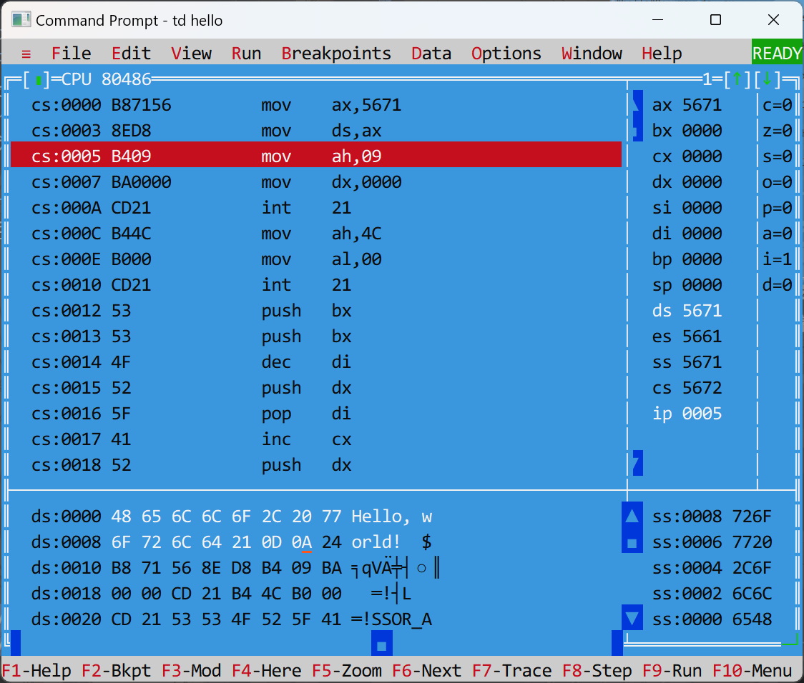
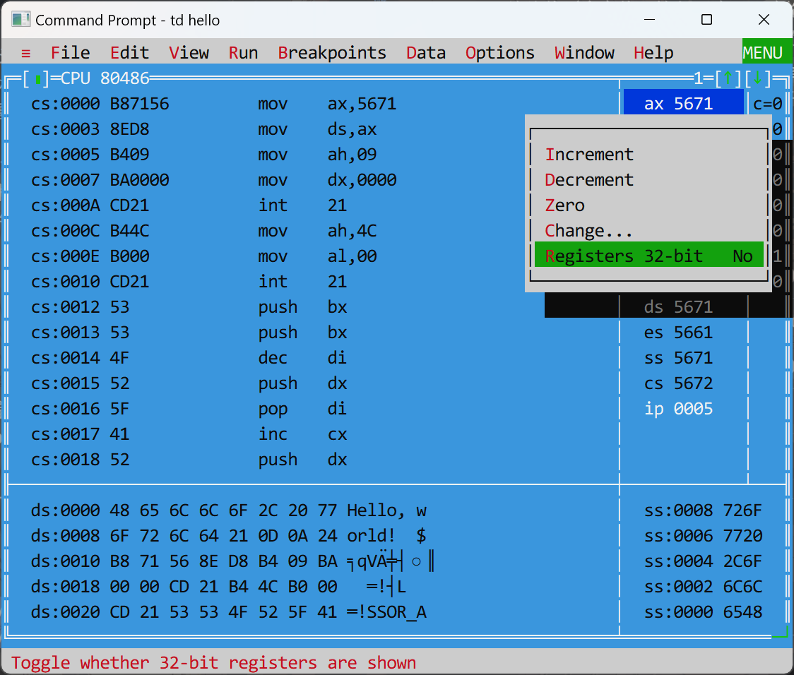
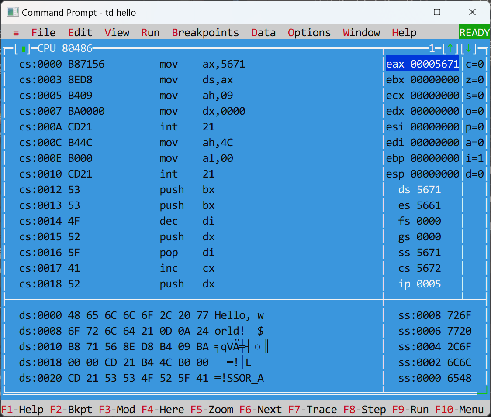
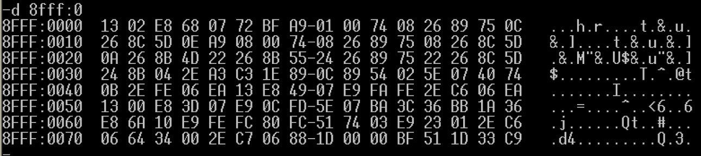
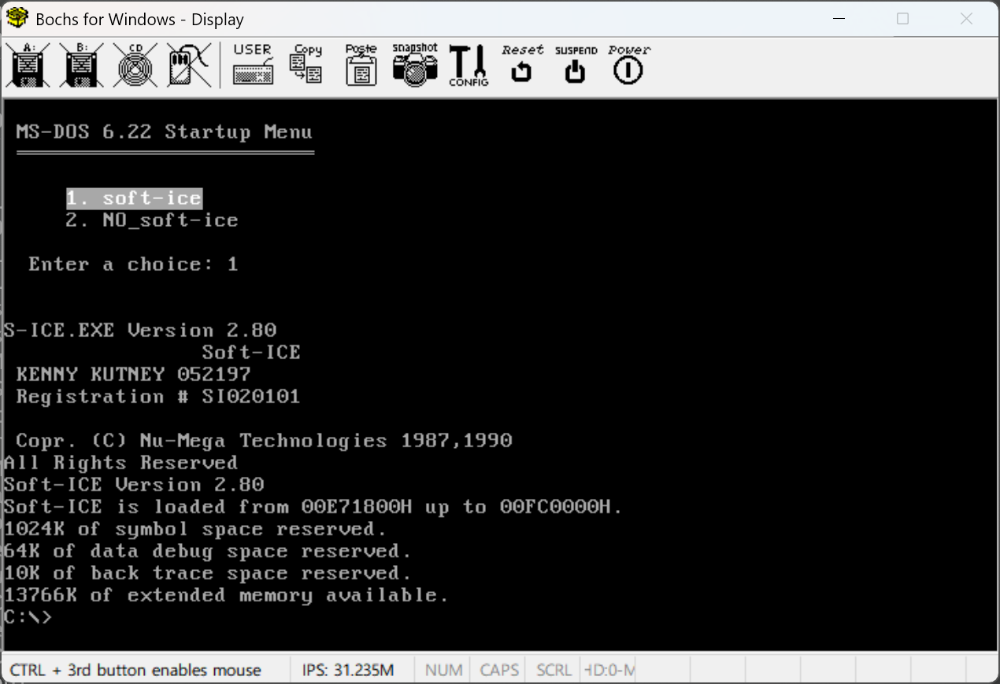
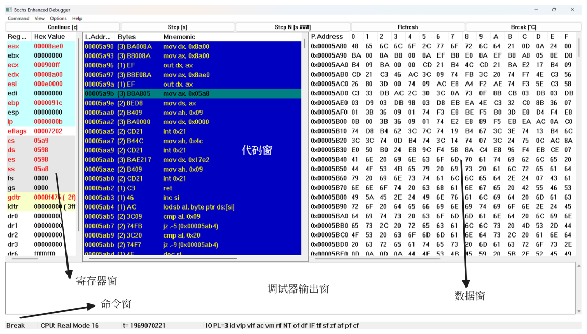

# Part 3. 汇编程序

## 程序编写

!!! code "一个简单的汇编语言程序"

    ```asm title="hello.asm"
    data segment
    s db "Hello, world!", 0Dh, 0Ah, '$'
    data ends

    code segment
    assume cs:code, ds:data
    main:
        mov ax, data
        mov ds, ax
        mov ah, 9
        mov dx, offset s
        int 21h
        mov ah, 4Ch
        int 21h
    code ends
    end main
    ```

### 段

段定义的一般格式为：

```asm
segmentname segment [use] [align] [combine] ['class']
    statements
segmentname ends
```

- 关键字：`segment`表示段定义的开始，`ends`表示段定义的结束，它们是必需的
- `segmentname`表示段名，遵循前面提到过的[命名规则](2.md#变量定义)。注意段定义的开始和结束的段名必须一致
- `statements`表示汇编语言的语句（指令\~、伪指令\~、汇编指示\~）
- 一个汇编程序是由多个段构成的，必要的段是代码段
- 可选部分（用方括号括起来的，一般情况下用不到）：
    - `use`：段内偏移地址宽度
        - 可用关键字有`use16`、`use32`，分别表示16位和32位段内地址宽度
        - 若源程序开头有语句`.386`，表示接下来每个段的偏移地址宽度默认为`use32`，否则的话默认为`use16`
    - `align`：对齐方式
        - 可用关键字有：`byte`、`word`、`dword`、`para`（节，16字节，默认对齐方式）、`page`（页，256字节），用于规定所定义段的边界宽度
        - 段首地址能够被对齐方式（段的边界宽度）整除
    - `combine`：合并类型
        - 可用关键词有：
            - `public`：用于代码段或数据段的定义。凡是段名相同、类别名相同、合并类型为`public`的段，在链接时将合并成一个段
            - `stack`：用于堆栈段的定义。凡是段名相同、类别名相同、合并类型为`stack`的段，在链接时将合并成一个段；且在程序载入内存准备运行时，`ss`和`sp`会自动初始化为该堆栈段的段址和长度
        - 如果不存在同名的代码段或数据段，则可省略合并类型
        - 如果定义了堆栈段，则必须指定该段的合并类型为`stack`，否则编译器会把它当作一个普通的数据段，因而`ss`和`sp`会被分别初始化为首段的段地址和0
    - `'class'`：类别名
        - 名称可变，且必须被单引号括起来
        - 相同类别名的段在链接时会被链接器重新安排顺序，使它们在可执行文件中是邻近的

### 假设

汇编指示语句`assume`可以用来建立编译器所需的段和段寄存器之间的关联。格式如下：

```asm
assume segreg:segmentname
```

- `segreg`表示四个段寄存器（`cs`、`ds`、`es`、`ss`）中的一种
- `segmentname`表示某个段的段名

一般来说，段和段寄存器的匹配关系如下所示：

```asm
asusme cs:code, ds:data, es:extra, ss:stk
```

注意：“建立关联”意味着并不是将段地址直接赋值给段寄存器，而是提醒编译器在编译时将段地址替换为关联的段寄存器。

在前一章中，我们知道`ds`和`es`在程序开始执行时被赋值为PSP段址。因此若想在程序中正确引用数据段内的变量或数据元素，必须在代码段一开始对`ds`进行以下赋值：

```asm
mov ax, data
mov ds, ax
```

### 语句

汇编语言的语句可分为以下三类：

- **指令语句**(instruction statement)：源程序的核心成分，编译后变成机器码
- **伪指令语句**(pseudo-instruction statement)：
     - 用于定义变量、数组或标号
     - 编译后仅剩下变量或数组的初始值，名称及类型均在编译后消失
- **汇编指示语句**(assembler directive statement)：
    - 它的作用是告诉编译器如何编译源程序
    - 编译后自动消失

??? example "例子"

    ```asm linenums="1"
    .386
    data segment use16
        c db 0FFh
        s db "ABCD", 0
        i dw 1234h, 5678h
        d dd 8086C0DEh
    data ends

    code segment use16
    assume cs:code, ds:data, ss:stk
    main:
        mov ax, data
        mov ds, ax
        mov eax, [d]
        rol eax, 16
        push eax
        pop dword ptr [i]
        mov ah, 4Ch
        int 21h
        code ends

        stk segment use16 stack
        db 100h dup('S')
    stk ends
    end main
    ```

    其中：

    - 指令语句：12-19行
    - 伪指令语句：3-6, 11, 23行
    - 汇编指示语句：1, 2, 7, 9, 10, 20, 22, 24, 25行


#### 格式

汇编语句的一般格式为：

```asm
name mnemonic operand   ; comment
; 例如：
; main: mov ax, data   ; 把 data 段地址赋值给 ax
```

- `name`：名字项
    - 可以表示变量名、标号名、段名、过程名
    - 该项不是必需的，大多数语句并不需要
- `mnemonic`：助记符项，包括80x86指令（`mov`、`add`、`jmp`等）、汇编指示指令（`segment`、`assume`、`end`）、伪指令（`db`、`dw`、`dd`）
- `operand`：操作数项，作为助记符项的参数
    - 操作数的个数取决于助记符，可以有0个或多个，没有助记符就没有操作数
- `comment`：注释项
    - 源程序编译时，注释项会被全部忽略，因此注释仅对源程序的作者、读者有意义
    - 以分号开始，只能用于单行注释
    - 多行注释：

    ```asm
    ; 法1
    ; #号可以换成其他字符，比如%、@、|，但要保证开始和结束标记一定要相同，且注释内容中不得包含标识符
    comment #
      注释
    #

    ; 法2
    IF 0
    注释
    ENDIF
    ```

四个项之间可以用一个或多个空白字符（空格、制表符、回车）间隔。

### 常数

- 整数常数
    ```asm
    ; 以下4条语句等价
    mov ah, 83
    mov ah, 01010011B
    mov ah, 123Q
    mov ah, 53h
    ```

- 浮点型常数
    ```asm
    x dd 3.14          ; float
    y dq 1.6E-307      ; double
    z dt 3.14159E4096  ; long double
    ```

- 字符常数
    - 可用单引号或双引号括起来
    - 数值上等于该字符的ASCII码值
- 字符串常数
    - 可用单引号或双引号括起来（所以汇编语言中单引号和双引号没有区别）
    - 不同于C语言，字符串末尾并没有结束符`00h`
    - 将字符串常量拆成一个个字符，用逗号间隔，这样构成的字符数组与原字符串等价
    ```asm
    s db 'H', 'e', 'l', 'l', 'o'
    ; 等价于 s db "Hello"
    ```

#### 常数表达式

常数与运算符结合就构成了**常数表达式**。下面列出汇编语言中常数表达式可用的运算符

|运算符|格式|含义|
|:-:|:-:|:-:|
|`+`|`+`表达式（一元） 或 表达式1`+`表达式2（二元）|正（一元）或加（二元）|
|`-`|`-`表达式（一元） 或 表达式1`-`表达式2（二元）|负（一元）或减（二元）|
|`*`|表达式1`*`表达式2|乘|
|`/`|表达式1`/`表达式2|除|
|`mod`|表达式1`mod`表达式2|求余|
|`shl`|表达式1`shl`表达式2|左移|
|`shr`|表达式1`shr`表达式2|右移|
|`not`|`not`表达式2|非|
|`and`|表达式1`and`表达式2|与|
|`or`|表达式1`or`表达式2|或|
|`xor`|表达式1`xor`表达式2|异或|
|`seg`|`seg`变量名或标号名|取段地址|
|`offset`|`offset`变量名或标号名|取偏移地址|

- 常量表达式可用于变量定义，也可作为指令的操作数
- 常量表达式只能包含运算符和常数

??? example "例子"

    ```asm hl_lines="2-5 13-14 17"
    data segment
    abc  dw 80*10-20
    x    dw offset abc
    y    dw seg abc
    var  db (7 shl 3) or (not 0FEh)
    data ends
    
    code segment
    assume cs:code, ds:data
    main:
        mov ax, seg abc
        mov ds, ax
        mov bx, offset var
        mov dl, 5 mod 3
        add dl, -2
        add dl, [bx]
        mov ah, (7/2) xor 1
        int 21h
        mov ah, 4Ch
    code ends
    end main
    ```

    其中高亮行用到了常量表达式。

#### 符号常数

**符号常数**(symbolic constant)是以符号形式表示的常数，可用`equ`和`=`定义符号常数，格式如下：

```asm
symbol equ expression
symbol  =  expression
; symbol：符号名，expression：表达式
```

- `=`的操作数只能是数值类型或字符类型的常数或常数表达式，可以对同一个符号进行多次定义
- `equ`的操作数还可以是字符串或汇编语句，但它不允许对同一个符号进行多次定义
- 个人感觉这个语法类似C语言的宏定义

??? example "例子"

    ```asm
    char     =    'A'
    exitfun  equ  <mov ah, 4Ch>
    dosint   equ  <int 21h>
    code segment
    assume cs:code
    main:
        mov ah, 2
        mov dl, char
        dosint
        char = 'B'     ; 重新定义char
        mov ah, 2
        mov dl, char
        dosint
        exitfun
        dosint
    code ends
    end main
    ```

### 标号

**标号**是符号形式的跳转目标地址，既可作为跳转指令（比如`jmp`、`jnz`、`loop`等）的目标地址，也可作为`call`指令的目标地址。标号的定义格式如下：

```asm
; 定义1
labelname:

; 定义2
labelname label near|far|byte|word|dword|qword|tbyte
; label: 伪指令
; label 后面所跟关键词为标号的类型
```

- 前2个（`near`、`far`）为标号类型，分别表示**近标号**和**远标号**
- 后5个为变量类型
- 可使用`label`定义变量

    ```asm
    data segment
        ; 常规定义
        abc db 1, 2, 3, 4

        ; 等价的label定义
        xyz label byte
        db 1, 2, 3, 4   ; 这两句话实际上是连在一起的
    data ends
    ```

    - 好处：可以在同一地址上同时定义字节、字等多种类型的变量

    ??? example "例子"

        ```asm
        b label byte
        w label word
        d label dword
        db 12h, 34h, 56h, 78h

        ; b == 12h
        ; w == 3412h
        ; d == 78563412h
        ; 这3个变量地址相同而值不同
        ```

关于近标号和远标号：

- 两者取决于以该标号为目标的`jmp`和`call`指令是否与该标号落在同一个段内
- 近标号：`jmp`、`call`与标号位于同一个段内
    - 格式：`labelname: ` 或 `labelname label near`
    - 会转化为该标号所在段中的偏移地址，可看作一个仅含**偏移地址**的**近指针**

- 远标号：`jmp`、`call`与标号不在同一个段内
    - 格式：`labelname label far`
    - 会转化为该标号所在段的段地址以及它所在段中的偏移地址，可看作一个含**段地址**和**偏移地址**的**远指针**
- 标号修饰：强制将指令中的标号编译成指定指针
    - `far ptr`：强制为远指针
    - `near ptr`：强制为近指针
    - 何时使用：
        - 当`jmp`、`call`指令引用不在同一个段内**近标号**时，或者当`jmp`、`call`指令**向前引用**(forward reference)（源程序上方的语句引用下方的变量或标号）不在同一个段内**远标号**时，必须在该标号前加`far ptr`修饰
        - 当`jmp`、`call`指令**向后引用**不在同一个段内**远标号**时，`far ptr`可省略
        - 若某个标号既被同一个段内的`call`、`jmp`指令引用，又被其他段内的`call`、`jmp`指令引用，
            - 将该标号定义为近标号
            - 同一段内的`call`、`jmp`指令可加`near ptr`修饰，也可以省略
            - 不同段内的`call`、`jmp`指令必须加`far ptr`修饰

标号的引用：若`lab`为标号名，则`lab`或`offset lab`均可作为该标号的偏移地址。

!!! info "注"

    变量本质上是一种更强大的标号，它不仅能像标号一样表示内存单元地址，还能表示内存单元长度（由伪指令`db`、`dw`、`dd`等设定）。

### 程序开始、结束

源程序的开始和结束位置用汇编指示语句`end`表示（同时也是编译结束的位置），格式如下：

```asm
labelname:
    ; ...
    ; statements
    ; ...
end labelname
; labelname 是标号名，用来指定程序首条汇编指令的位置
```

- 当源程序被编译成可执行程序并开始运行时，寄存器`ip`被赋值为该标号的偏移地址，`cs`被赋值为该标号的段地址即代码段的段地址
- 若`end`后省略`labelname`，则程序开始运行时`ip = 0`，`cs =`代码段的段地址（代码段首条指令的位置）
- 在一个完整的汇编程序中，`end`伪指令是必须存在的

---
然而，源程序的结束并不意味着可执行程序的结束，因为此时CPU的控制权仍然掌握在可执行程序那边。要想让程序真正中止，需要调用DOS的`4Ch`号中断功能，使得控制权被转交给可执行程序的父程序（即DOS）。这一过程称为**程序返回**。

调用格式如下：

```asm
mov ah, 4Ch
mov al, 返回码
int 21h
```

- `al`的返回码用于将本程序的运行状态传递给父程序，即当前运行程序的调用者
- 比如在DOS命令行下执行可执行程序时，DOS就是该程序的父程序。但DOS并不使用返回码，因此中间的语句可以省略
- 如果不调用`4Ch`号功能，那么CPU会继续执行当前程序后面的内存空间中的指令，而这些指令往往是一堆随机的机器码，因此CPU极有可能会因为无法解释这些指令而死机


## 程序编译、链接、运行

基本步骤（假设已经在D盘安装了MASM（小白老师的主页上有））：

- 将`hello.asm`放在目录`D:\masm`中，打开dos终端并切换至该目录下
- 执行以下命令

```sh
masm hello;  # 编译
link hello;  # 链接（注意前两个语句末尾都要带分号）
hello        # 运行（.exe文件可以直接输入文件名运行）
```

运行结果：

<div style="text-align: center">
    
</div>

??? info "补充知识：链接的作用"

    - 对于大型项目，往往会使用多个源程序文件，并且调用一些库文件。对这些文件进行编译后得到一系列零散的目标文件，这时需要将这些目标文件链接起来，得到一个完整的可执行文件
    - 即使只有单个目标文件也不能直接执行，因为其中可能有无法直接执行的信息，所以还是需要先链接得到对应的可执行文件


### 运行

在DOS系统中运行可执行文件的大致流程：

- 由cmd将可执行文件的程序加载到内存中，具体的加载过程：
    - 找到一段起始地址为SA:0000，容量足够的空闲内存区
    - 在内存区的前256字节的空间内创建**程序段前缀**(program segment prefix, PSP)，它存储了与当前可执行程序的进程相关的一些信息，比如程序的命令行参数等，DOS利用PSP的信息实现与被加载程序的通信
    - 在PSP后面将程序装入，初始地址为SA+10H:0000
    - 内存的段地址（SA）保存在ds中，并且设置CPU的cs:ip指向程序的第一条指令（即程序入口），从而使程序得以运行，此时cmd将CPU的控制权转交给该程序

    <figure style=" width: 40%" markdown="span">
        
        
        <figcaption></figcaption>
    </figure>

- 程序运行结束后，控制权还给cmd，CPU继续运行cmd


## 程序调试

### 软件断点和硬件断点

- 软件断点：通过改写指令首字节为`0CCh`来为该指令设置断点
    - 机器码`0CCh`对应指令`int 3h`，当执行到该指令时，先调用对应的中断函数，从而使调试器获得控制权
    - 此时屏幕上会显示当前寄存器的值以及将要执行的指令，并等待用户敲键
    - 当用户输入单步执行命令后，调试器会恢复断点处指令的首字节，再单步执行该条指令
    - 等该指令执行完后CPU会自动产生`int 1h`单步中断，并调用对应的中断函数，从而使调试器再次获得控制权
    - 该函数接着重新改写断点处指令的首字节为`0CCh`，即恢复原来的断点，并显示当前寄存器值以及将要执行的指令，再等待用户敲键
    - 软件断点不依赖CPU中的调试寄存器，因此断点数量任意
- 硬件断点：通过把指令首字节地址、变量地址写入调试寄存器来设置指令执行断点或变量读写断点
    - 由于CPU中用来保存断点地址的调试寄存器仅有4个，因此硬件断点的数量最多只有4个（但Bochs Enhanced Debugger可以设置类似硬件断点的16个指令执行断点和16个变量读写断点）
    - 硬件断点不会修改指令的首字节，也不会修改变量的值
    - 由于硬件断点可以监控指令对变量的读写动作，所以它可以帮助我们找出如数组越界等靠软件断点难以发现的bug

!!! info "注"

    下面介绍的调试工具请自行到[小白老师的个人网站](http://cc.zju.edu.cn/bhh/)上下载并安装。


### Turbo Debugger

在使用Turbo Debugger（以下简称TD）的调试功能前，我们应预先将源程序（.asm）编译为可执行程序（.exe），有以下两种编译方法：

```sh
# 法1
tasm /zi hello;    # 参数 /zi 表示 full debug info
tlink /v hello;    # 参数 /v  表示 include  full symbolic debug information

# 法2
masm hello;
link hello;
```

- 法1用到了Borland公司的Turbo Assembler和Turbo Link，在编译和链接的过程中会自动生成调试信息，比如变量名、标号名；并且在用TD调试时可以看到源代码，即可以进行源代码级的调试
    - 注意参数`/zi`、`/v`不能省略，否则调试效果和法2一样

<div style="text-align: center">
    
</div>

- 法2得到的可执行程序在TD中只能看到机器码和汇编代码，而无法看到源代码

通过以下命令进行调试：

```sh
td hello
```

下面是TD的界面：

<div style="text-align: center">
    
</div>

- 刚打开TD时应该只有代码窗口（就是左上深蓝色的区域）。要想显示寄存器窗口（右侧Regs）和数据窗口（底部Dump），点击上方选项`View`，在选项列表中找到`Register`和`Dump`，点击它们分别会弹出寄存器窗口和数据窗口

    <div style="text-align: center">
        
    </div>

- 调整各窗口的大小
    - 法1：鼠标按住窗口右下角的位置并拖动即可调整大小
    - 法2：先按`Ctrl+F5`键选中窗口，然后按`Shift+方向键`控制窗口变化方向，最后按回车键确定窗口大小
- 若想同时观察机器码和源代码，点击`View->CPU`，再按`F5`放大窗口，如图所示（不知道为什么我这边的代码好松散）：

    <div style="text-align: center">
        
    </div>

- 如果用`masm`和`link`得到可执行程序，那么TD界面应该是这样的：

    <div style="text-align: center">
        
    </div>

- 按`Tab`键可以顺时针切换到下一个子窗口，按`Shift+Tab`键则按逆时针方向切换到下一个子窗口
- 当光标位于某个子窗口或菜单项时，按F1即可获得与该子窗口或菜单项相关的帮助信息
- 当光标位于代码窗时，可通过键盘输入一条指令来改写当前指令
- 当光标位于寄存器窗、堆栈窗或数据窗时，也可通过键盘输入来改变当前光标处的值（注意值要输入正确，正确格式见[第2章](2.md#数据组织)）
- 在寄存器窗口中，默认只能看到16位寄存器。要想看到32位寄存器，在寄存器窗口处点击鼠标右键，然后选择`Registers 32-bit`（或者直接按快捷键`Ctrl+R`），这样就能看到32位寄存器了

    <div style="text-align: center">
        
        
    </div>


- TD常用快捷键如下：

|快捷键|含义|
|:-|:-|
|`Ctrl+F2`|重新开始跟踪(program reset)|
|`F2`|设置断点(breakpoint)，断点所在行用红色高亮标出|
|`F4`|运行到光标处(run to cursor)|
|`F7`|跟踪进入(trace into)，相当于DEBUG的`T`命令|
|`F8`|步过(step over)|
|`F9`|运行程序(run)|
|`Ctrl+G`|设置代码窗、堆栈窗、数据窗的起始地址，`G`代表go（常用操作是在数据窗查找`ds:0`）|
|`Ctrl+O`|在代码窗显示`cs:ip`指向的指令，`O`表示original|
|`Alt+F5`|观察用户屏幕即查看当前程序的输入输出窗口|
|`Alt+X`|退出TD|


### DEBUG

!!! warning "注意"

    - Debug是DOS、Windows（xp以前的版本）提供的实模式程序的调试工具。Windows xp及以后的OS即使安装了DOS虚拟机，由于OS自带的保护机制，所以Debug无法修改内存的信息，即使是管理员模式也没用。
    - Debug会将指令中的`[const]`（`const`表示常数）视为`const`，而不是内存单元，所以如果用Debug调试时需要显式标出段寄存器

常用的Debug命令“

- r命令：查看、改写CPU寄存器的内容，包括标志寄存器的各个状态位
    - 查看：直接输入`r`
    - 改写：`r reg`，输入后终端会显示当前`reg`的值，我们可以在第二行的冒号后输入要修改的值，然后按回车键完成修改
    - 标志寄存器各个位在Debug中的表示：

    |位状态|表示|含义|位状态|表示|含义|
    |:----|:--|:--|:----|:--|:--|
    |of = 0|NV|not overflow|of = 1|OV|overflow|
    |df = 0|UP|up|df = 1|DN|down|
    |if = 0|DI|disable interrupt|if = 1|EI|enable interrupt|
    |sf = 0|PL|plus|sf = 1|NG|negative|
    |zf = 0|NZ|not zero|zf = 1|ZR|zero|
    |af = 0|AC|auxiliary carry|af = 1|NA|not auxiliary|
    |pf = 0|PO|parity odd|pf = 1|PE|parity even|
    |cf = 0|NC|no carry|CF = 1|CY|carry|

- d命令：查看内存的内容
    - 查看预设内存内容：`d`
    - 查看指定地址后的一块内存的内容：`d seg_addr:ofs_addr`，输入该指令后终端会显示三部分内容：
        - 中间：用十六进制表示的128块内存单元的内容
        - 左边：每行的起始地址
        - 右边：内存单元对应的ASCII字符，若没有对应的ASCII字符则用`.`表示

        <div style="text-align: center">
            
        </div>

    - 指定查看范围：`d seg_addr:st_ofs_addr ed_ofs_addr`，显示`seg_addr:st_ofs_addr`~`seg_addr:ed_ofs_addr`之间的内容

- e命令：改写内存的内容
    - 修改指定地址后的多个内存单元内容：`e seg_addr:ofs_addr data1 data2 ... datan`
    - 以提问方式修改指定地址后的内存单元：`e seg_addr:ofs_addr`
        - 此时终端会显示指定地址，并列出第1个内存单元值，我们可以在`.`后面修改其值，也可以直接敲空格键跳过
        - 修改完成后也要敲空格键，对下一个内存单元修改
        - 敲回车键退出修改
    - `data`可以是数字，也可以是字符和字符串，还可以是机器码（由一组`data`组成，每个`data`是两位十六进制数）

- u命令：将内存中的机器指令翻译为汇编指令
    - 格式：`u seg_addr:ofs_addr`
    
- t命令：执行一条或多条机器指令
    - 执行cs:ip指向的地址的指令（单步执行）：`t`

- a命令：以汇编指令的格式在内存中写入一条机器指令
    - 格式：`a seg_addr:ofs_addr`
- g命令：从当前位置（cs:ip）执行指令直到指定地址处
    - 格式：`g ip_addr`
- p命令：在执行`loop`指令时使用，可以自动重复执行循环中的指令，直到`cx == 0`
- q命令：退出Debug程序


### S-ICE

特点：

- 全屏幕调试
- 源代码级调试
- 即使弹出
- 硬件断点
- 由于本身运行在保护模式下，因此不能调试保护程序用户程序

具体操作：

1. 准备好要调试的汇编文件（eg.asm）：打开Bochs虚拟机的硬盘镜像文件dos.img（需要用WinImage打开），将eg.asm拖到虚拟机c:\masm目录内
2. 启动虚拟机：
    - 打开bochsdbg.exe
    - 点击Load，选择文件dos.bxrc后再点击Start
    - 来到Bochs Enhanced Debugger窗口，点击Continue
    - 回到Bochs for Windows - Display窗口，选择`1. soft-ice`，敲回车

<div style="text-align: center">
    
</div>

3. 编译、链接、调试：输入以下命令后，进入S-ICE界面

    ```shell
    cd masm
    tasm /zi eg;
    tlink /v eg;
    LDR eg
    ```
        
    <figure style=" width: 80%" markdown="span">
        
        
        <figcaption></figcaption>
    </figure>

4. 现在就可以使用下面列出的调试命令进行调试啦！

常用调试命令：

|命令|快捷键|含义|
|:-|:-|:-|
|`CLS`||清楚命令窗|
||↑|在命令窗显示上次输入过的命令|
|`.`||在代码窗显示cs:ip指向的指令，同TD的Ctrl+O|
|`H|?`|F1|帮助|
|`BPX`|F2|设软件断点|
|`HERE`|F4|运行到光标处|
|`T`|F7|跟踪进入，同Debug的t命令|
|`P`|F8|步过，同Debug的p命令|
|`X`|F9\|Ctrl+d|运行，同Debug的g命令|
|`U`||反汇编，同Debug的u命令|
|`A`||汇编，同Debug的a命令|
|`D`||查看内存单元的值，同Debug的d命令|
|`E`||修改内存单元的值，同Debug的e命令|
|`R reg`||修改寄存器`reg`的值，同Debug的r命令|
|`RS`|F5|观察用户屏幕，同TD的Alt+F5|
|`EC`|F6|代码窗与命令窗切换|
|`WC|WC num`||关闭、显示代码窗\|调整代码窗的高度为`num`行|
|`WD|WD num`||关闭、显示数据窗\|调整数据窗的高度为`num`行|
|`? exp`||计算表达式`exp`的值|
|`SRC`|F3|源代码、源代码+机器码、机器码模式切换|

断点命令：

|命令|含义|
|:-|:-|
|`bpmb address x`|在地址`address`处设置一个硬件执行断点|
|`bpmb|bpmw|bpmd address r`|在地址`address`处设置一个硬件读断点|
|`bpmb|bpmw|bpmd address w`|在地址`address`处设置一个硬件写断点|
|`bpmb|bpmw|bpmd address rw`|在地址`address`处设置一个硬件读写断点|
|`bpx address`|在地址`address`处设置一个软件断点|
|`bl`|列出已设的断点|
|`be *|num`|激活全部\|编号为`num`的断点|
|`bd *|num`|禁用全部\|编号为`num`的断点|
|`bc *|num`|清除全部\|编号为`num`的断点|

- `bpmb`、`bpmw`、`bpmd`分别表示地址`address`所指对象的宽度为字节、字、双字
- `bpmw`要求`address`是2的倍数，`bpmd`要求`address`是4的倍数


### Bochs

特点：

- 能够调试保护模式/实模式下的用户程序
- 指令执行断点不依赖指令首字节和调试寄存器
- 指令执行断点和变量读写断点分别多达16个

具体操作：

0. 对原有的汇编文件（eg.asm）稍加修改：在代码段最开始添加以下指令：

```asm
; Bochs虚拟机在执行完这五条指令后会自动中断
mov dx, 8A00h
mov ax, 8A00h
out dx, ax
mov ax, 8AE0h
out dx, ax
```

1. 准备好要调试的汇编文件（eg_m.asm）：打开Bochs虚拟机的硬盘镜像文件dos.img（需要用WinImage打开），将eg.asm拖到虚拟机c:\masm目录内
2. 启动虚拟机：
    - 打开bochsdbg.exe
    - 点击Load，选择文件dos.bxrc后再点击Start
    - 来到Bochs Enhanced Debugger窗口，点击Continue
    - 回到Bochs for Windows - Display窗口，选择`2. No_soft-ice`，敲回车

3. 编译、链接、调试：输入以下命令后，转到Bochs Enhanced Debugger窗口

    ```shell
    cd masm
    masm eg_m;
    link eg_m;
    eg_m
    ```
        
<div style="text-align: center">
    
</div>

4. 现在就可以使用下面列出的调试命令进行调试啦！


常用调试命令：

|命令|快捷键|含义|
|:-|:-|:-|
||Ctrl+C\|Break按钮|中断程序运行，把控制权交给调试器|
||↑|在命令窗显示上次输入过的指令|
|`h|help`||帮助|
|`pb addr`|双击指令|在物理地址`addr`处设置指令执行断点|
|`s`|F11|跟踪进入，同Debug的t命令|
|`n`|F8|步过，同Debug的p命令|
|`c`|F5\|Continue按钮|运行程序，同S-ICE的x命令|
||Ctrl+D|设置代码窗的起始地址|
||Ctrl+F7|设置数据床的起始地址，同TD的Ctrl+G|
|`writemem "filename" addr len`||把地址`addr`起长度为`len`字节的内存块写入文件|
|`setpmem addr mem v`||修改物理地址`addr`处宽度为`len`字节的变量值为`v`|
||双击寄存器|修改寄存器的值|
|`? exp`||计算表达式`exp`的值|
|`sreg`||查看系统寄存器的值|
|`cr|creg`||查看控制寄存器的值|
|`info |gdt|idt|tss`||查看 全局描述符表\|中断描述符表\|任务状态段|


断点命令：

|命令|含义|
|:-|:-|
|`pb address`|在物理地址`address`处设置一个指令执行断点|
|`blist`|列出已设置的指令执行断点|
|`bpe num`|激活编号为`num`的指令执行断点|
|`bpd num`|禁用编号为`num`的指令执行断点|
|`delete|del|d num`|删除编号为`num`的指令执行断点|
|`watch r address len`|在物理地址`address`处设置一个宽度为`len`的变量读断点|
|`watch w address len`|在物理地址`address`处设置一个宽度为`len`的变量写断点|
|`watch`|列出已设的变量读写断点|
|`unwatch num`|禁用编号为`num`的变量读写断点|

- `address`必须是16进制的常数（形如0x1234）
- `len = 1`、`len = 2`、`len = 4`分别表示变量宽度为字节、字、双字