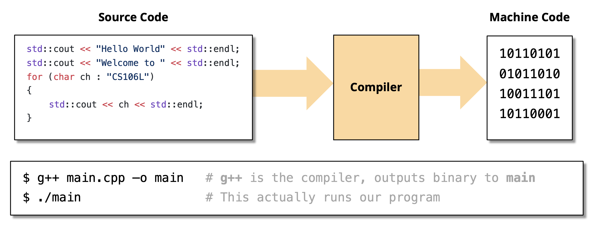

# Fundamentals

!!! info "注"

    这里的内容颇有些杂，涵盖了大多数 C++ 的基础知识。


## Background

在正式进入 C++ 的学习前，不妨先来简单了解一下 C++ 相关的背景知识。

??? info "C 语言的优劣"

    - 优势：
        - 高效编程
        - 能直接访问机器，适用于 OS 和 ES(end system)
        - 灵活
    - 劣势：
        - 不充分的类型检查
        - 缺乏对大规模编程的支持
        - 面向过程编程(procedure-oriented programming)

??? recommend "C++ 发展史"

    C++ 之父——Bjarne Stroustrup，这是他的[个人网站](https://www.stroustrup.com/)。

    具体内容参见 xyx 老师 [“C++ 的诞生”](https://xuan-insr.github.io/cpp/cpp_restart/1_birth/)。

    C++ 的第一个标准是 C++98(ISO/IEC 14882:1998)，目前最新的标准为 C++23(ISO/IEC 14882:2024)。


??? note "所以 C++ 是什么呢？"

    摘自 Wikipedia [Outline of C++](https://en.wikipedia.org/wiki/C%2B%2B) 的定义：

    >C++ is a **statically typed**, free-form, **multi-paradigm**, compiled, general-purpose programming language.

    其中最鲜明的两个特征是：

    - **静态类型**(statically typed)：
        - 类型在编译时确定——C++ 是一种**编译型语言**(compiled language)

            <div style="text-align: center">
                
            </div>

            相对应的概念是解释型语言(interpreted language)，代表语言有 Python 等。编译型语言胜过解释型语言之处在于它能够更加高效地生成机器码（编译器能一次看到所有代码，而解释器一次只能看一条语句）；但编译需要一定的时间。

        - C++ 有一个强大的**类型系统**(type system)

    - **多范式**(multi-paradigm)：包括以下范式：
        - [**面向过程**](https://en.wikipedia.org/wiki/Procedural_programming)(procedure-oriented)
        - [**面向对象**](https://en.wikipedia.org/wiki/Object-oriented_programming)(object-oriented)
        - [**泛型**](https://en.wikipedia.org/wiki/Generic_programming)(generic programming)

    

C++ 的设计哲学：

- **可读性**(readability)：直接用代码表达思想和意图
- **安全性**(safety)：尽可能在编译时强制保证安全性
- **高效性**(efficiency)：不浪费时间和空间
- **抽象性**(abstraction)：将杂乱的构造分好类
- **多范式**(multi-paradigm)：赋予程序员完全的控制权、责任和选择权

实际上，C++ 还有助于我们培养良好的编码习惯——在用 C++ 写代码时，我们会很自然地考虑到以下问题：

- 我是否在以对象本应被使用的方式使用它们？——类型检查、类型安全
- 我是否正在高效使用内存？——引用/拷贝语义、移动语义
- 我是否在修改我不应该修改的东西？——`const` 和 const 正确性

而其他语言则放宽了上述限制。


## The First C++ Program

```cpp
#include <iostream>
using namespace std;

int main() {
    int number;
    cout << "Enter a decimal number: ";
    cin >> number;
    cout << "The number you entered is " << number << endl;
    return 0;
}
```

!!! note "解释"

    - C++ 的头文件不用 `.h` 后缀，且头文件的名称由小写字母构成
    - `#!cpp cin` 和 `#!cpp cout` 分别表示**标准输入流**和**标准输出流**
        - 它们都支持连续输入/输出多个值
        - 注意：`#!cpp cin` 无法读取**空白字符**（包括空格、换行、制表符等）
    - 方便起见，源程序开头加一句 `#!cpp using namespace std;`，表示使用标准命名空间。如果没有这句的话，后面的 `#!cpp cin`、`#!cpp cout` 和 `#!cpp endl` 都要加上 `#!cpp std::` 前缀，否则无法编译

        !!! warning "注意"

            实际编程时，请尽可能避免使用这种语句，因为这被认为是一种不良的设计，破坏了 C++ [命名空间](#namespace)的设计本意。

    - `<<` 和 `>>` 分别表示**插入符**(insertor)和**提取符**(extractor)，并分别适用于 `#!cpp cout` 和 `#!cpp cin`
    - `#!cpp endl`：换行，意为 end of line

在 C++ 中，任何类型的变量存放的都是一个**对象**(object)。

??? info "Interesting Things"

    以下三段代码是等价的 C++ 代码：

    === "代码1"

        ```cpp
        #include <iostream>
        #include <string>
        int main() {
            auto str = std::make_unique<std::string>("Hello World!");
            std::cout << *str << std::endl;
            return 0;
        }
        // Prints "Hello World!"
        ```

    === "代码2"

        ```cpp
        #include "stdio.h"
        #include "stdlib.h"
        int main(int argc, char **argv) {
            printf("%s", "Hello, world!\n");
            // ^a C function!
            return EXIT_SUCCESS;
        }
        ```

    === "代码3"

        注：这段代码只能在 x86 架构的 CPU 上被编译。

        ```cpp
        #include "stdio.h"
        #include "stdlib.h"
        int main(int argc, char **argv) {
            asm(".LC0:\n\t"
            ".string \"Hello, world!\"\n\t"
            "main:\n\t"
            "push rbp\n\t"
            "mov rbp, rsp\n\t"
            "sub rsp, 16\n\t"
            "mov DWORD PTR [rbp-4], edi\n\t"
            "mov QWORD PTR [rbp-16], rsi\n\t"
            "mov edi, OFFSET FLAT:.LC0\n\t"
            "call puts\n\t");
            return EXIT_SUCCESS;
        }
        ```

    可以看到，C++ 既能向后兼容 C，也能执行汇编代码。Intersting!


## Type System

- 我们可以把**类型**(types)看作变量的“种类(category)”。
- C++ 提供了诸如 `#!cpp int`, `#!cpp double`, `#!cpp string`, `#!cpp bool`, `#!cpp size_t` 等多种内建类型(built-in types)。
- C++ 的一个鲜明特征是它是一种**静态类型**(statically typed)语言：每个变量都有一个类型，且一旦声明类型后，之后就不得再修改类型了（而动态类型语言允许这种操作）。
- 这种语言的优点是
    - 更加高效：
        - 为编译器提供额外的变量信息，这样它能为变量更加高效地分配内存
        - 根据内存中值的特殊结构，编译器还可能对性能进行优化，消除了运行时检查类型的需求
    - 易于理解
    - 提供了更方便的错误检查


### Modern Typing

#### Type Alias with using

有时，代码中可能会出现像这样冗长的类型：

```cpp
std::pair<bool, std::pair<double, double>> solveQuadratic(double a, double b, double c);
```

可以看到，这个函数的返回值类型特别“长”，不仅对敲代码的程序员而言不方便，也不方便其他人阅读代码。这时，我们可以使用 `using` 关键字，为类型创建别名：

```cpp
using Zeros = std::pair<double, double>;
using Solution = std::pair<bool, Zeros>;
Solution solveQuadratic(double a, double b, double c);
```

现在的函数签名就清爽了很多——不仅类型名缩短了，还能提高可读性！

??? info "typedef"

    `#!cpp typedef` 是 C 语言就有的一种用于为类型取别名的方法。虽然它的功能和 `#!cpp using` 几乎一致，但是从可读性和实用性角度而言不如 `#!cpp using`，且模板别名只能使用 `#!cpp using` 而不得使用 `#!cpp typedef`。所以建议平时写代码的时候就用 `#!cpp using` 好了。

    ```cpp
    typedef map<string,list<string>> PB;
    PB phonebook;
    PB::iterator finger;
    ```

更多内容：[`#!cpp using`](https://en.cppreference.com/w/cpp/keyword/using)


#### Type Deduction with auto

对于上述问题，还有一种“偷懒”的方法是使用 `#!cpp auto` 关键字——我们不指明类型，让编译器自行推断具体的类型，这样我们写代码时就无需操心类型的问题了：

```cpp
auto result = solveQuadratic(a, b, c);
// This is exactly the same as the above! 
// result still has type std::pair<bool, std::pair<double, double>>
// We just told the compiler to figure this out for us!
```

很显然，`result` 的返回结果类型就是 `Solution`，所以编译器在编译时会自动帮我们推断出这一类型，在编译成机器码前将类型替换为具体的类型。但如果存在歧义的话，编译就有可能会失败，比如：

```cpp
auto oops() {
  return { 106.0, 107.0 };
}
```

此时函数的返回值既可能是 `#!cpp std::pair<double, double>` 类型，也可能是 `#!cpp std::vector<double>` 类型，也就是说存在歧义。此时 `#!cpp auto` 就没用了，还得要我们明确指出返回值的类型。

虽然这种方法相当省事，但是也降低了代码的可读性，所以在代码编写时我们需要权衡好其中的利弊。

更多内容：[`#!cpp auto`](https://en.cppreference.com/w/cpp/keyword/auto)


## Structs

**结构体**(struct)本质上就是将多个具名变量绑定在一起，构成一个新类型。

```cpp
struct zjuIDCard {
    string name; 			
    string type; 		
    int idNumber;
};
```

结构体初始化的两种方式：

=== "为每个字段初始化"

    ```cpp
    zjuIDCard myCard;
    myCard.name = "NoughtQ";
    myCard.type = "Student"; 					
    myCard.idNumber = 3230100000;
    ```

=== "[统一初始化](#uniform-initialization)(uniform initialization)"

    ```cpp
    zjuIDCard myCard = {"NoughtQ", "Student", 3230100000};
    ```

在 C++ 中，我们还能为结构体定义成员函数（方法）

```cpp
struct zjuIDCard {
    string name; 			
    string type; 		
    int idNumber;

    void display() { 
        cout << "Name: " << name << "\nType: " << type 
             << "\nID: " << idNumber << endl;
    }
};
```

成员函数还可以在结构体外定义，但是要用到解析符 `::` 指明对应的结构体：

```cpp
struct zjuIDCard {
    string name; 			
    string type; 		
    int idNumber;

    void display();
};

void zjuIDCard::display() { 
    cout << "Name: " << name << "\nType: " << type 
            << "\nID: " << idNumber << endl;
}
```

到这里为止，我们得到的结构体已经具备了一个[类](3.md)该有的特征，那这涉及到后面的知识，我们之后再来介绍。

更多内容：[`#!cpp struct` 声明](https://en.cppreference.com/w/c/language/struct)


### std::pair

对于只有两个字段的结构体，我们可以用 C++ 自带的 `#!cpp std::pair` 类型来替代，使用起来更加方便！

=== "结构体"

    ```cpp
    struct Order {
        std::string item;
        int quantity;
    };
    Order dozen = { "Eggs", 12 };
    ```

=== "等价的 `#!cpp std::pair`"

    ```cpp
    std::pair<std::string, int> dozen { "Eggs", 12 };
    std::string item = dozen.first; 							// "Eggs"
    int quantity = dozen.second; 								// 12
    ```

    - 声明 `std::pair` 对象时需要指明每个字段的类型；它支持列表初始化
    - 我们用 `.first` 和 `.second` 分别获取 `std::pair` 对象的第一个和第二个字段

严格地说，`#!cpp std::pair` 不是一种类型，而是一种**模板**(template)（这一概念在[之后](10.md)会详细讲解）：

```cpp
template <typename T1, typename T2>
struct pair {
    T1 first;
    T2 second;
};
std::pair<std::string, int>
```

不要忘记在使用 `#!cpp std::pair` 前在程序开头加一句 `#!cpp #include <utility>`

更多内容：[`#!cpp std::pair`](https://en.cppreference.com/w/cpp/utility/pair)


## Namespace

在大型程序中，不同模块可能会定义相同名字的变量或函数，比如 `print()`、`data`、`init()` 等。C++ 引入了**命名空间**(namespace)的概念，将这些名称划分为多个组（即名称空间），以避免相同名称的冲突。常用到的运算符为**作用域解析符**(scope resolver) `::`，用于指明具体的命名空间。

??? example "例子"

    ```cpp
    namespace A {
        void print() {
            std::cout << "A's print" << std::endl;
        }
    }

    namespace B {
        void print() {
            std::cout << "B's print" << std::endl;
        }
    }

    int main() {
        A::print();  // 调用 A 的 print
        B::print();  // 调用 B 的 print
        return 0;
    }
    ```

    运行结果：

    ```
    A's print
    B's print
    ```

- 命名空间的定义一般放在头文件内
- 命名空间可以嵌套。使用嵌套命名空间的成员时要按嵌套顺序指明命名空间，中间用 `::` 间隔
- 若想使用命名空间的单个成员，可以用 `#!cpp using` 语句引入，之后使用该成员时就无需加命名空间的前缀了
- 而想引入整个命名空间的话，那就用 `#!cpp using namespace xxx;` 语句，该命名空间的所有成员在使用时都无绪添加前缀
    - 虽然很方便，但正如前面所说的，不推荐这样做；推荐的做法是使用 `#!cpp using` 语句引入必要的成员
- 匿名命名空间：没有名称的命名空间，只能在定义该命名空间的文件内被使用

更多内容：[Namespaces](https://en.cppreference.com/w/cpp/language/namespace)


### std

`std` 是我们最常用的命名空间，它为我们提供了 C++ 标准库的东西，包括一些内建类型、函数等等。

- 除去一些基本类型外，在使用内建类型前，需要用 `#!cpp #include` 导入相关的头文件，比如：
    - `#!cpp #include <string>` -> `#!cpp std::string`
    - `#!cpp #include <utility>` -> `#!cpp std::pair`
    - `#!cpp #include <iostream>` -> `#!cpp std::cout`, `#!cpp std::endl`
- `std` 里会存在这样的内容：

    ```cpp
    namespace std {
        template 
        <typename T1, typename T2>
        struct pair {
            T1 first;
            T2 second;
        };
        // Other utility code...
    }
    ```

- 可以看到，在使用这些内建类型的时候，我们必须加上前缀 `#!cpp std::`。
- 如果在程序开头使用语句 `#!cpp using namespace std;` 的话，我们就没有加前缀的必要了。但这样做被认为是一种不良的程序设计，因为它会带来歧义，尤其是在有多个命名空间的情况。
- 更多内容：[cppreference](https://en.cppreference.com/w/cpp/standard_library)


## Initialization

**初始化**(initialization)：在构造对象时为对象提供初始值的过程。

C++ 提供了以下几种初始化方式：

- **直接初始化**(direct initialization)
- **统一初始化**(uniform initialization)
- **结构化绑定**(structured binding)

更多内容：[Initialization](https://en.cppreference.com/w/cpp/language/initialization)


### Direct Initialization

```cpp hl_lines="3-4"
#include <iostream>
int main() {
    int numOne = 12;
    int numTwo(12);
    std::cout << "numOne is: " << numOne << std::endl;
    std::cout << "numTwo is: " << numTwo << std::endl;
    return 0;
}
```

高亮的两行就是直接初始化的两种方式：

- 使用赋值号 `=`：和 C 语言一样
- 使用圆括号 `()`：看起来像函数调用，类似创建自定义类对象的[构造函数](3.md#initialization-and-clean-up)（但实际上内建类型并没有构造函数）

这种初始化方法有一种特性，叫做**缩窄转换**(narrowing conversion)——C++ 不会进行类型检查，而是尝试将初始化值隐式转换为指定的类型（比如：`#!cpp int num(42.5);` -> `#!cpp num == 42`），如果能成功转换的话就不会报错。


### Uniform Initialization

统一初始化是 C++11 标准引入的特性。

```cpp hl_lines="4"
#include <iostream>
int main() {
    // Notice the brackets
    int numOne{12};
    std::cout << "numOne is: " << numOne << std::endl;
    return 0;
}
```

可以看到，统一初始化需要用到花括号 `{}`，此时 C++ 会进行类型检查且不支持类型转换。所以像 `#!cpp int num(42.5);` 这句话就无法通过编译，报错信息类似：

```
test.cpp:5:13: error: type 'double' cannot be narrowed to 'int' in initializer list [-Wc++11-narrowing]
    5 |     int num{42.0};
      |             ^~~~
test.cpp:5:13: note: insert an explicit cast to silence this issue
    5 |     int num{42.0};
      |             ^~~~
      |             static_cast<int>( )
```

所以，统一初始化有以下优点：

- **安全**(safe)：不允许缩窄转换，从而避免意外行为或致命系统错误的发生
- **泛用**(ubiquitous)：作用于所有类型，包括 `vector`、`map`，以及自定义类等

??? example "例子"

    === "`map`"

        ```cpp
        std::map<std::string, int> ages{
            {"Alice", 25},
            {"Bob", 30},
            {"Charlie", 35}
        };
        ```

    === "`vector`"

        ```cpp
        std::vector<int> numbers{1, 2, 3, 4, 5};
        ```


### Structured Binding

结构化绑定是 C++17 引入的新特性：

- 它提供了一种在编译时从具有固定大小的数据结构中初始化一些变量的有用方法
- 具备同时访问函数返回的多个值的能力
- 能作用在编译时大小已知的对象上

结构化绑定的语法为：

```cpp
auto [var1, var2, ..., varN] = expression;
```

???+ example "例子"

    ```cpp hl_lines="9"
    std::tuple<std::string, std::string, std::string> getClassInfo() {
        std::string className = "CS106L";
        std::string buildingName = "Thornton 110";
        std::string language = "C++";
        return {className, buildingName, language};
    }

    int main() {
        auto [className, buildingName, language] = getClassInfo();
        std::cout << "Come to " << buildingName << " and join us for " << className
                << " to learn " << language << "!" << std::endl;
        return 0;
    }
    ```

    高亮所示语句用到了结构化绑定的特性，可以看到三个在方括号内的变量可以依次接收函数的返回值（包含三个 `string` 的元组）。

结构化绑定和 Python 的**拆包**(unpacking)十分相似。


## Strings

- C++ 中，字符串有专门的类，叫作 `#!cpp string`
    - 在 C++ 中，强烈建议使用 `#!cpp string` 类表示字符串，因为它是真正的字符串类型。而在 C 语言中实际上没有字符串类型，只是用字符数组和字符指针来模拟字符串，而且后者不太安全
    - C++ 字符串末尾没有 `\0` 字符。事实上，除了 C 语言外，其他语言都是将字符串本身及其长度存在内存中，因此不用 `\0` 标记结尾
- 使用 `#!cpp string` 类时，必须在代码开头加上 `#!cpp #include <string>`
- 定义字符串变量：`#!cpp string str;`
    - 这样声明后，字符串 `str` **已经有确定的值**了
- 使用字符串字面量初始化的三种方式：

    ```cpp
    string str = "Hello";
    string str("Hello");
    string str{"Hello"};
    ```

    其中前两种方式是等价的，且这两种方式适用于其他类型（比如 `#!cpp int` 等）

- 赋值：

    ```cpp
    char char1[20];
    char char2[20] = "jaguar";
    string str1;
    string str2;
    char1 = char2;                // illegal
    str1 = str2;                  // legal
    ```

- 输入和输出
    - 可以直接用 `#!cpp cin`/`#!cpp cout` 读写

        ```cpp
        cin >> str;
        cout << str;
        ```

    - 读取一整行字符串：`#!cpp getline(cin, line_var)`

    !!! warning "注意"

        如果 `cin` 之后用到 `getline`，由于 `cin` 忽略空白字符，输入流里可能还有未被读取的换行符，而 `getline` 将会读取一行字符串，直到遇到换行符。所以在使用 `getline` 前，应当先用 `cin.get()` 读取换行符（这个函数的功能是读取单个字符），然后再用 `getline`。


- 获取字符串的单个字符：可以像字符数组一样访问字符串

    ```cpp
    string s = "Hello";
    s[0] = 'J';
    ```

- 字符串拼接(concatenation)

    ```cpp
    string str3;
    str3 = str1 + str2;
    str1 += str2;
    str1 += "lalala";
    ```

- 获取长度：`#!cpp s.length();`
    - 在 C 中，`.` 运算符用于检索结构体内的成员
    - 而在 C++ 中，它又是作为一个检索对象成员的运算符

    ??? info "小技巧"

        如果 vscode 中下载了 C/C++ 插件，那么编写代码时在对象后敲个 `.` 后，vscode 就会显示该对象可用的所有成员。

- 创建字符串（使用构造函数）

    ```cpp
    string(const char *cp, int len);
    string(const string& s2, int pos);
    string(const string& s2, int pos, int len);
    ```

- 获取子字符串：`#!cpp substr(int pos, int len);`
- 改变字符串：

    ```cpp
    // const 表示不可修改的变量
    insert(size_t pos, const string& s);
    // 从字符串中删除从 pos 位置开始，长度为 len 的子字符串
    erase(size_t pos = 0, size_t len = npos);
    append(const string& str);
    // 用字符串 str 替代原字符串中从 pos 位置，长为 len 的子字符串
    replace(size_t pos, size_t len, const string& str);  
    ```

- 寻找字符串
    - 该函数会返回找到的指定字符串首字符在原字符串中的索引，如果未找到，则返回 -1

    ```cpp
    size_t find(const string& str, size_t pos = 0) const;
    ```

???+ info "注"

    从子字符串开始的所有函数（更确切的说法是“方法”）都是字符串对象的成员，因此实际使用时要用 `.` 运算符访问：

    ```cpp
    string s = "NoughtQ666";
    string subs = s.substr(6, 3);
    ```

更多内容：[`#!cpp std::basic_string`](https://en.cppreference.com/w/cpp/string/basic_string)


## Pointers

- 指向对象的指针

    ```cpp
    string s = "hello";
    string* ps = &s;
    ```

- 指针运算符
    - `&`：获取地址（`#!cpp ps = &s;`）
    - `*`：获取对象（`#!cpp (*ps).length()`）
    - `->`：调用函数（`#!cpp ps->length()`）

- 对象和指针在声明时的区别
    - `#!cpp string s;`：此时对象 `s` 被创建并被初始化
        - 但是像 `#!cpp int i;` 这样的声明的变量不会被初始化
    - `#!cpp string *ps;`：此时对象 `ps` 还不清楚指向何处

- 赋值

    ```cpp
    string s1, s2;
    s1 = s2;
    string *ps1, *ps2;
    ps1 = ps2;
    ```

更多内容：[pointer](https://en.cppreference.com/w/cpp/language/pointer)


## Reference

我们可以将**引用**(reference)理解为“为已存在（于内存的）对象创建的别名(alias)”。引用的运算符为 `&`。

```cpp hl_lines="2"
int num = 5;
int& ref = num;   // ref is an "alias" of num
ref = 10; // Assigning a new value through the reference
std::cout << num << std::endl; // Output: 10
```

用图形化的方式表述上述语句：

<figure style=" width: 40%" markdown="span">
    
    
    <figcaption></figcaption>
</figure>


### Pass by Reference

```cpp
#include <iostream>
#include <math.h>
// note the ampersand!
void squareN(int& n) {
    // calculates n to the power of 2
    n = std::pow(n, 2);
}

int main() {
    int num = 2;
    squareN(num);
    std::cout << num << std::endl;
    return 0;
}
```

可以看到，`squareN` 函数的传参方式是**按引用传递**(pass by reference)。所以在调用语句 `#!cpp sqaureN(num);` 时，我们向函数传递的不是 `num` 的拷贝，而是真正的 `num`。所以 `num` 会被该函数处理，且最终结果为 `num == 4`。

相比传递指针实现实参在函数中的修改（这种方式本质上还是**按值传递**(pass by value)），按引用传递的方式会更加便捷，且更加安全。

---
下面考虑一种特殊情况：

```cpp
#include <iostream>
#include <math.h>
#include <vector>

void shift(std::vector<std::pair<int, int>> &nums) {
    for (auto [num1, num2] : nums) {  // structured binding
        num1++;
        num2++;
    }
}
```

调用该函数后，我们发现实参内的元素并没有像预期那样被修改，因为结构化绑定会绑定元素的副本，而不是元素本身，所以里面的内容没有任何改动。正确的做法是在 `#!cpp for` 语句内部也要做一次引用，让 `[num1, num2]` 绑定的是 `pair` 的引用，这样对 `num1` 和 `num2` 的修改也能作用在传入的元素上了。

```cpp hl_lines="2"
void shift(std::vector<std::pair<int, int>> &nums) {
    for (auto& [num1, num2] : nums) {  // structured binding
        num1++;
        num2++;
    }
}
```

??? info "另一种等价的修改方式"

    ```cpp
    void shift(std::vector<std::pair<int, int>> &nums) {
        for (size_t int i = 0; i < num.size(); i++) {
            nums[i].first++;
            nums[i].second++;
        }
    }
    ```


### L-Value and R-Value

- **左值**(left-value, l-value)可出现在赋值号的**左侧**或**右侧**
    - 包括：变量、引用、使用运算符 `*`、`[]`、`.` 和 `->` 的结果
    - 表达式求解完成后，左值仍被保留
- **右值**(right-value, r-value)只能出现在赋值号**右侧**
    - 包括：字面量、表达式
    - 表达式求解完成后，右值不会被保留，因此是个**临时**值


### Left Value Reference

由于右值是临时值，没有一个持久的地址，所以左值引用不得作用在右值上。来看下面的例子：

```cpp hl_lines="12"
#include <stdio.h>
#include <cmath>
#include <iostream>

int squareN(int& num) {
    return std::pow(num, 2);
}

int main() {
    int lValue = 2;
    auto four = squareN(lValue);
    auto fourAgain = squareN(2);  // error!
    std::cout << four << std::endl;
    return 0;
}
```

高亮行中 `#!cpp squareN(2)` 传递了右值 `2`，但该函数接收的是一个左值引用，因此在编译时会报错：

```
test.cpp:12:22: error: no matching function for call to 'squareN'
   12 |     auto fourAgain = squareN(2);  // error!
      |                      ^~~~~~~
test.cpp:5:5: note: candidate function not viable: expects an lvalue for 1st argument
    5 | int squareN(int& num) {
      |     ^       ~~~~~~~~
1 error generated.
```


---
引用规则：

- 定义引用时必须初始化，而初始化建立了一个绑定关系
- 不同于指针，绑定关系在运行时不会改变
- 引用的目标必须有一个具体的位置

    ```cpp
    void func(int &);
    func(i * 3);          // Warning or error!
    ```

???+ note "指针 vs 引用"

    - 引用：
        - 不能为空（`null`）
        - 依赖于已存在的变量，它们是变量的别名
        - 不能改变为一个新的地址
    
    - 指针：
        - 可以设为空
        - 指针独立于已存在的变量
        - 可以改变指针，指向不同的地址

!!! warning "引用的限制"

    - 不能引用一个引用
    - 不能声明引用指针，比如 `#!cpp int &*p;` 是非法的
        - 但是对指针的引用时 OK 的，比如 `#!cpp void f(int *&p);`

    - 不能声明引用数组


### Right Value Reference

- 右值引用：

    ```cpp
    int x = 20;    // left-value
    int && rx = x * 2;
    // the result of x * 2 is a right-value, rx extends its lifetime

    int y = rx + 2;
    rx = 100;
    // Once a right-value reference is initialized
    // this variable becomes a left-value that can be assigned

    int && rrx1 = x;
    // Illegal: right-value reference can not be initialized by a left-value
    ```

- 作为右值的参数：

    ```cpp
    // take left-value
    void fun(int& lref) {
        cout << "l-value" << endl;
    }

    // take right-value
    void fun(int&& rref) {
        cout << "r-value" << endl;
    }

    int main() {
        int x = 10;
        fun(x);     // output: l-value
        fun(10);   // output: r-value
    }
    ```

---
更多内容：[Reference declaration](https://en.cppreference.com/w/cpp/language/reference)


## Dynamically Allocated Memory

- 使用 `#!cpp new` 为运行时的程序分配内存空间。指针是唯一能够访问这种内存空间的途径

    ```cpp
    new int;
    new Stash;
    new int[10];
    ```

- 当完成对这块内存空间的使用时，使用 `#!cpp delete` 将这块内存空间返回给内存池

    ```cpp
    delete p;
    delete[] p;
    ```

- `{}` 用于向使用 `#!cpp new` 生成的对象传递初始值


动态数组：

```cpp
int * psome = new int [10];
delete[] psome;
```

- `#!cpp new` 运算符返回数组中第一个元素的地址
- 方括号的存在告诉程序需要释放整个数组的内存空间，而不是一个元素

`#!cpp new` 和 `#!cpp delete` 的搭配：

```cpp
int *p = new int;
int *a = new int[10];
Student *q = new Student();
Student *r = new Student[10];
delete p;
a++;
delete[] a;
delete q;
delete r;
delete[] r;
```

!!! tip "使用提示"

    - 不要用 `#!cpp delete` 释放不是用 `#!cpp new` 分配的内存
    - 不要用 `#!cpp delete` 连续释放两次相同的内存块
    - 如果使用 `#!cpp new []` 来分配数组的话，需要使用 `#!cpp delete []`
    - 如果使用 `#!cpp new` 来分配单个实体的话，需要使用 `#!cpp delete`
    - 在空指针上使用 `#!cpp delete` 是安全的（无事发生）

更多内容：

- [`#!cpp new` expression](https://en.cppreference.com/w/cpp/language/new)
- [`#!cpp delete` expression](https://en.cppreference.com/w/cpp/language/delete)