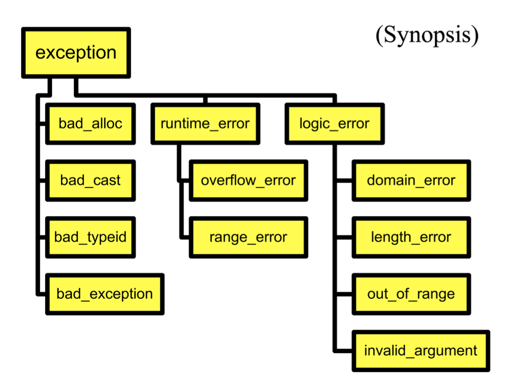

# Exception

运行时错误(run-time error)：

- C++ 的基本哲学：格式错误的代码将无法运行
- 处理未来运行中所有可能的情况非常重要

下面的代码能够处理运行代码时出现的各种异常：

```cpp
try {
    open the file;
    determine its size;
    allocate that much memory;
    read the file into memory;
    close the file;
} catch (fileOpenFailed) {
    doSomething;
} catch (sizeDeterminationFailed) {
    doSomething;
} catch (memoryAllocationFailed) {
    doSomething;
} catch (readFailed) {
    doSomething;
} catch (fileCloseFailed) {
    doSomething;
}
```

所谓**异常**(exception)，是指...

为什么要有异常：

- 很大的一个好处是它们能够清理错误的处理代码
- 并且它将描述你想做什么的代码与执行的代码分开

何时使用异常：？

发起异常：使用 `throw` 语句

```cpp
template <class T>
T& Vector<T>::operator[](int indx) {
    if (indx < 0 || indx >= m_size) {
        // throw is a keyword
        // exception is raised at this point
        throw <<something>>;
    }
    return m_elements[indx];
}
```

- `throw` 语句发起的异常将控制权传播给第一个对于该异常的处理函数
- 传播遵循调用链
- 在栈上的对象会被正确销毁
- `#!cpp throw exp;`：抛出匹配值
- `#!cpp throw;`：重新发起被处理的异常，仅在一个处理函数中有效

调用者需要做什么？

- 毫不关心：代码甚至可能没发现问题
- 十分关心
- 适中的关心
- 不关心某些特殊情况

`try` 语句块：

```cpp
try { ... }
catch ...
catch ...
```

- 建立了任意数量的处理函数
- 可以设置你想要处理的异常情况
- 耗时
- 异常处理函数
    - 根据类型选择异常
    - 能够重新发起异常
    - 两种形式（都只接受一个参数）：

        ```cpp
        catch (SomeType v) {
        }

        catch (...) {
        }
        ```

    - 会根据代码顺序来检查所有的处理函数
        - 找到完全匹配的
        - 应用基本的类转换，仅适用于引用和指针类型
        - 省略号 `...` 匹配所有类型

**继承**可用于构建异常结构。

??? example "例子"

    ```cpp
    class MathErr {
        ...
        virtual void diagnostic();
    };
    class OverflowErr : public MathErr { ... }
    class UnderflowErr : public MathErr { ... }
    class ZeroDivideErr : public MathErr { ... }

    // Using handlers
    try {
        // code to exercise math options
        throw UnderFlowErr();
    } catch (ZeroDivideErr& e) {
        // handle zero divide case
    } catch (MathErr& e) {
        // handle other math errors
    } catch (...) {
        // any other exceptions
    }
    ```

异常和 `new` 语句：`new` 在失败时不会返回0，而会抛出一个 `bad_alloc` 异常。

标准库异常：

<div style="text-align: center">
    
</div>

异常规范

- 声明可能要发起的异常函数
- 部分函数原型：

    ```cpp
    void abc(int a) throw(MathErr) {
        ...
    }
    ```

- 不在编译时检查
- 在运行时，如果列表中不包含的异常传播出去，则会引发 `unexpected` 异常

??? example "例子"

    ```cpp
    Printer::print(Document&) throw(PrinterOffLine, BadDocument) { ...
    PrintManager::print(Document&) throw (BadDocument) { ...
    // raises or doesn’t handle BadDocument
    void goodguy() throw () {
    // handles all exceptions
    void average() { } // no spec, no checking,
    void lala() noexcept; // spec no exceptions
    ```

在设计异常时，我们需要考虑以下因素：

- 异常需要反映错误
- 不要用异常替换良好的设计

!!! note "总结"

    - 错误恢复是一个很难的设计问题
    - 所有的子系统需要来自客户端的帮助，以处理异常情况
    - 异常提供了以下机制
        - 动态传播
        - 在栈上的对象被正确销毁
        - 终止有问题的函数
    - 另外一个大用处：构造函数无法完成任务时

---
构造函数的两个阶段：

- 构造函数里的正常工作
    - 初始化所有的成员对象
    - 初始化所有的原始成员
    - 初始化所有的指针为0
    - 不要对以下资源做任何请求：文件、网络连接、内存
- 在 `Init()` 里做额外的工作

对于失败的构造函数，可能有以下解决方案：

- 可能没有返回值
- 使用“未初始化的标志(flag)”
- 将初始化函数延后完成

但更好的做法还是**抛出异常**。此时对象的析构函数就不会被调用；且在抛出异常前清理掉所有被分配的资源。

---
异常和析构函数：

- 析构函数被调用的时机：
    - 正常调用：对象离开作用域
    - 发生异常时：栈展开调用
- 在析构函数中抛出异常，而该析构函数本身是由于另一个异常被调用时，将会触发 `std::terminate()`。