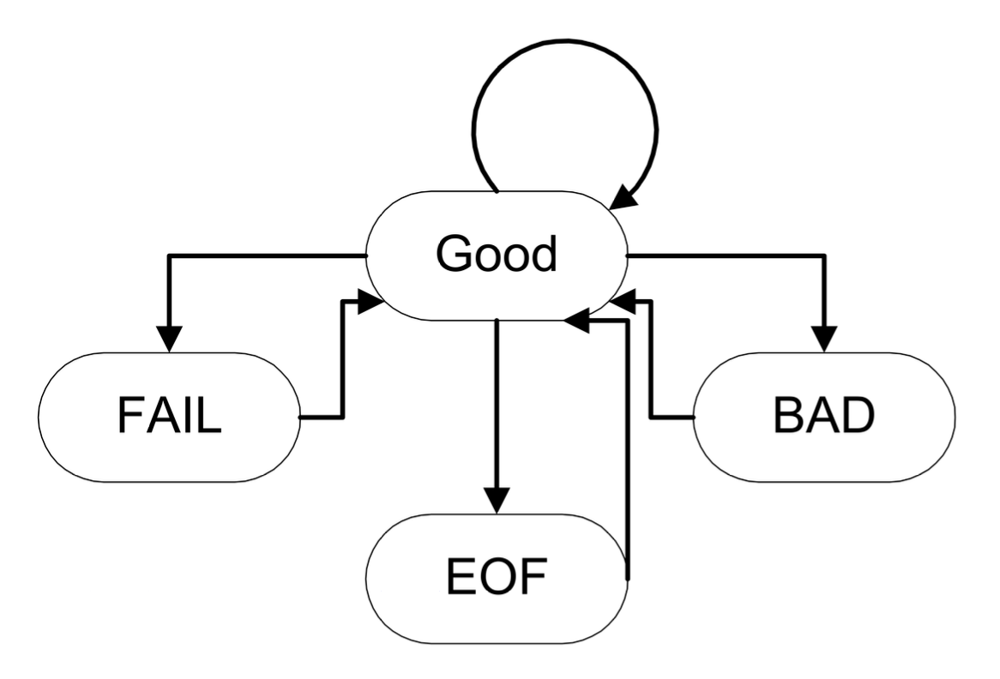

# Streams

**流**(stream)是一种为设备提供的公共逻辑接口，能够按顺序(sequentially)读取或写入值。

它的优缺点是：

- 优点：提供了更好的类型安全，具备可扩展性，体现更多面向对象的特征
- 缺点：代码更加冗长，执行速度更慢

流的名称：

||输入|输出|头文件|
|:-|:-|:-|:-|
|一般场景|`istream`|`ostream`|`<iostream>`|
|文件|`ifstream`|`ofstream`|`<fstream>`|
|字符串|`istringstream`|`ostringstream`|`<sstream>`|

所有流的继承图：

<div style="text-align: center">
    
</div>

流运算：

- **提取符**(extractor)：
    -  从流中读取值
    - 重载运算符 `>>`
- **插入符**(insertor)：
    - 将值插入到流中
    - 重载运算符 `<<`
- **操纵符**(manipulator)：改变流的状态
- 其他...

流的种类：

- 文本流
    - 用于处理 ASCII 文本
    - 以行的形式组织
    - 执行一些字符转换，比如将新的行转换为真正的 OS 文件
    - 包括：文件、字符缓冲区等
- 二进制流
    - 用于处理二进制数据
    - 没有转换

预定义的流：

- `cin`：标准输入，是 `std::istream` 的一个实例
- `cout`：标准输出，是 `std::ostream` 的一个实例
- `cerr`：未缓存的错误（调试）输出
- `clog`：缓存的错误（调试）输出

---
预定义的提取符 `#!cpp istream >> lvalue` 会忽视前导空白字符，它的定义如下：

```cpp
istream& operator>>(istream& is, T& obj) {
    // specific code to read obj
    return is;
}
```

其他的输入运算符：

- `#!cpp int get()`：返回流里面的下一个字符，如果流里没有字符的话则返回 `EOF`

    ```cpp
    int ch;
    while ((ch = cin.get()) != EOF)
        cout.put(ch);
    ```

- `#!cpp istream& get(char &ch)`：将下一个字符放到参数里，功能和上一个输入运算符类似
- `#!cpp istream& getline(istream& is, string& str, char delim = '\n');`：读取输入流，直到遇到字符 `delim`，然后将读取结果存储在缓冲区 `str` 内

!!! warning "注意"

    在混用 `cin` 和 `getline` 时要当心——由于它们对输入流的处理方式不同（`cin` 会把换行符留在输入缓冲区中，而 `getline` 读取换行符后就把它丢掉），所以稍不留神就可能会出现意料之外的问题。

- `#!cpp ignore(int limit = 1, int delim = EOF)`：跳过 `limit` 个字符以及分隔符
- `#!cpp int gcount()`：返回刚刚读取的字符数

    ```cpp
    string buffer;
    getline(cin, buffer);
    cout << "read " << cin.gcount() << " characters"
    ```

- `#!cpp void putback(char)`：将单个字符推回到流里面
- `#!cpp char peek()`：检查下一个字符，但不读取它

---
预定义的插入符 `ostream << expression`，它的定义如下：

```cpp
ostream& operator<<(ostream& os, const T& obj) {
    // specific code to write obj
    return os;
}
```

其他的输出运算符：

- `put(char)`：打印单个字符

    ```cpp
    cout.put('a');
    cerr.put('!');
    ```

- `flush()`：强制输出流的内容

    ```cpp
    cout << "Enter a number";
    cout.flush();
    ```


## Manipulators

使用操纵符进行格式化，修改流的状态

- 导入头文件：`#!cpp #include<iomanip>`
- 各种操纵符：

|操纵符|效果|类型|
|:-|:-|:-|
|`dec`, `hex`, `oct`|设置数值转换|I, O|
|`endl`|插入新行并清除流的内容|O|
|`flush`|清除流的内容（`cout` 和 `endl` 也具备该功能）|O|
|`setw(int)`|设置字段宽度|I, O|
|`setfill(char)`|改变填充字符|I, O|
|`setbase(int)`|设置数字的基底|O|
|`ws`|跳过空白字符|I|
|`setprecision(int)`|设置浮点数精度|O|

!!! info "注"

    由于每次执行 `endl` 都会清除流缓冲区，所以成本较高；所以为了提升程序的性能，最好用换行符 `'\n'` 替代 `endl`。

??? example "例子"

    ```cpp
    #include <iostream>
    #include <iomanip>
    int main() {
        cout << setprecision(2) << 1000.243 << endl;
        cout << setw(20) << "OK!";
        return 0;
    }
    ```

    运行结果：

    ```
    1e03
                    OK!
    ```

我们可以自定义操纵符：

```cpp
// skeleton for an output stream manipulator
ostream& manip(ostream& out) {
    ...
    return out;
}
ostream& tab ( ostream& out ) {
    return out << '\t';
}
cout << "Hello" << tab << "World!" << endl;
```


## Stream Control

流标志控制格式：

|标志|目的（何时设置）|
|:-|:-|
|`ios::skipws`|跳过前导空白字符|
|`ios::left`, `ios::right`|对齐|
|`ios::internal`|在符号和值之间填充|
|`ios::dec`, `ios::hex`, `ios::oct`|数字格式|
|`ios::showbase`|显示数字基底|
|`ios::showpoint`|始终显示小数点|
|`ios::uppercase`|让基底以大写形式呈现|
|`ios::showpos`|显示正数的 `+`|

设置标志：

- 使用操纵符：`setiosflags(flags)`, `resetiosflags(flags)`
- 使用 `stream` 成员变量：`setf(flags)`, `unsetf(flags)`

??? example "例子"

    ```cpp
    #include <iostream>
    #include <iomanip>
    int main() {
        cout setf(ios::showpos | ios::scientific);
        cout << 123 << " " << 456.78 << endl;
        cout << resetiosflags(ios::showpos) << 123;
        return 0;
    }
    ```

    运行结果：

    ```
    +123 +4.567800e+02
    123
    ```

流的错误状态：

<div style="text-align: center">
    
</div>

- 每次操作后都会设置错误状态
- `clear()` 用于重置错误状态为 `good()`
- 状态检查：
    - `good()`：当状态有效时返回 `true`
    - `eof()`：当遇到 EOF 时返回 `true`
    - `fail()`：当出现轻微故障或不良状态时返回 `true`
    - `bad()`：当状态不良时返回 `true`

??? example "例子"

    ```cpp
    int n;
    cout << "Enter a value for n, then [Enter]" << flush;
    while (cin.good()) {
        cin >> n;
        if (cin) { // input was ok
            cin.ignore(INT_MAX, '\n'); // flush newline
            break;
        }
        if (cin.fail()) {
            cin.clear(); // clear the error state
            cin.ignore(INT_MAX, '\n'); // skip garbage
            cout << "No good, try again!" << flush;
        }
    }
    ```


## File Streams

- `ifstream` 和 `ofstream` 将文件和流连接起来
- 需要导入头文件：`#!cpp #include <fstream>`
- 用模式指明如何创建文件：

    |模式|目的|
    |:-|:-|
    |`ios:app`|附加|
    |`ios:ate`|末尾位置|
    |`ios:binary`|处理二进制 I/O|
    |`ios:in`|为输入打开文件|
    |`ios:out`|为输出打开文件|

相关的流操作：

- `open(const char *, int flags, int)`：打开指定文件
- `is_open()`：检验文件是否打开
- `close()`：关闭流
- `fail()`

??? example "例子"

=== "输出文件流"

    ```cpp
    int main() {
        /// associating file on construction
        std::ofstream ofs(“hello.txt”)
        if (ofs.is_open()) {
            ofs << “Hello CS106L!” << ‘\n’;
        }
        ofs.close();
        ofs << “this will not get written”;
        ofs.open(“hello.txt”, std::ios::app);
        ofs << “this will though! It’s open again”;
        return 0;
    }
    ```

=== "输入文件"

    ```cpp
    int inputFileStreamExample() {
        std::ifstream ifs(“append.txt”)
        if (ifs.is_open()) {
            std::string line;
            std::getline(ifs, line);
            std::cout << “Read from the file: “ << line << ‘\n’;
        }
        if (ifs.is_open()) {
            std::string lineTwo;
            std::getline(ifs, lineTwo);
            std::cout << “Read from the file: “ << lineTwo << ‘\n’;
        }
        return 0;
    }
    ```


## I/O Stream Buffers

I/O 流缓冲区：

- 每个 I/O 都有一个流缓冲区
- 类 `streambuf` 定义了这个缓冲区的抽象
- 成员函数 `rdbuf()` 返回指向流缓冲区的指针
- `<<` 被重载，用于直接连接缓冲区

??? example "例子"

    ```cpp
    #include <fstream>
    #include <assert>
    int main(int argc, char *argv[]) {
        assert(argc == 2);
        ifstream in(argv[1]);
        assert(in); // check that stream opened
        cout << in.rdbuf(); // Drain file!
    }
    ```