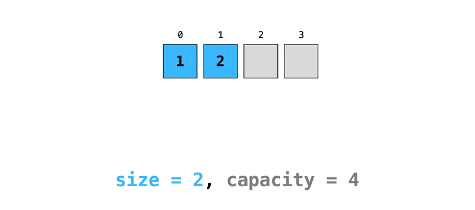
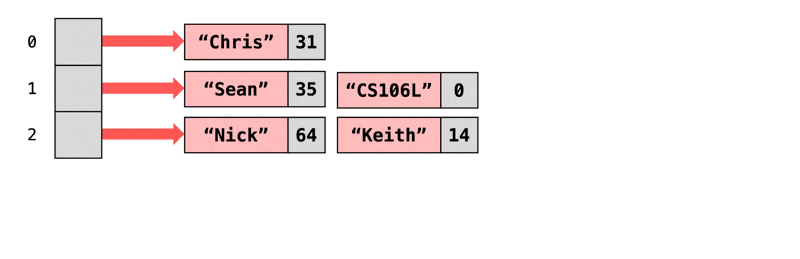

# STL Containers

## Introduction

C++ 的一大重要概念是**容器对象**(conllection objects)，它是能够存储其他任意数量对象的对象。

容器对象来自 **STL**（Standard Template Library，标准模板库），它是 ISO 标准下的 C++ 库的一部分，包含了各种数据结构和算法。而 STL 是 `#!cpp std` 的一部分。

使用 STL 的原因有：

- 节省开发时间：有现成的数据结构
- 代码可读性更强，STL 好比大家都知道的 C++ “黑话”
- 鲁棒性
- 可移植的代码
- 可维护的代码
- 容易使用

STL 包括以下组成部分：

- **容器**(containers)：存储成组的东西，本质上是[**模板**](10.md)
- **迭代器**(iterators)：遍历容器的方式
- **函子**(functors)：将函数作为对象表示的方式
- **算法**(algorithms)：转换和修改容器的通用方式

STL 中的顺序容器(sequential containers)：

- `vector`
- `deque`(dual-end queue, /dek/)：双端队列
- `list`
- `forward_list`：前向列表（不介绍）
- `array`
- `string`

STL 中的关联容器(associative containers)（根据唯一键组织元素）：

- `map`
- `set`
- `unordered_map`
- `unordered_set`


## Vectors

`#!cpp vector<type>`：变长数组，每个元素的类型为 `type`。

???+ example "例子"

    ```cpp
    #include <iostream>
    #include <vector>

    using namespace std;

    int main() {
        // Declare a vector of ints (no need to worry about size)
        vector<int> x;

        // Add elements
        for (int a = 0; a < 1000; a++)
            x.push_back(a);

        // Have a pre-defined iterator for vector class, can use it to print out the items in vector
        vector<int>::iterator p;
        for (p = x.begin(); p < x.end(); p++)
            cout << *p << " ";
        
        return 0;
    }
    ```

- `vector` 是一种**泛型类**(generic class)。这种类需要指定两种类型，其中一个是容器自身的类型（这里是 `vector`），另一个是容器内元素的类型（上例中就是 `int`）
- `vector` 的内部空间可按需扩大：当有更多项被放入时，它就会为这些项提供足够的空间
- `vector` 会记录当前保存的项数，可以用 `size` 方法读取
- `vector` 内部项的顺序即为项的插入顺序，因此可按相同的顺序检索
- 基本的运算：
    - 构造函数(constructors)：
        - `#!cpp vector<Elem> v;`：创建空向量
        - `#!cpp vector<Elem> v(n);`：向量内包含 `n` 个 0
        - `#!cpp vector<Elem> v(n, k);`：向量内包含 `n` 个 `k`
    - 获取大小：
        - `#!cpp V.size()`：当前容器内项数
        - `#!cpp V.empty()`：是否为空，相比 `.size()` 速度更快
        - `#!cpp V.capacity()`：在当前分配的存储空间内最多可以存放的项数
    - 迭代器：
        - `#!cpp I.begin()`：获取第一个位置
        - `#!cpp I.end()`：获取最后一个位置
    - 元素访问：
        - `#!cpp V.at(index)`：该方法会进行边界检查，如果越界，编译器会抛出异常，更加安全
        - `#!cpp V[index]`
            - <span style="color:red">注意：</span>不能用这种方法修改元素！
            - 该方法不会做边界检查，如果越界的话，则行为不可预测，是未定义的行为(undefined behaviour)，因此速度快，但不安全
            - “[零开销原则](https://en.cppreference.com/w/cpp/language/Zero-overhead_principle)”(zero-overhead principle)
        - `#!cpp V.front()`：第一项
        - `#!cpp V.back()`：最后一项
    - 添加/删除/查找：
        - `#!cpp V.push_back(e)`：在向量末尾添加元素
        - `#!cpp V.pop_back()`：移除末尾元素，但**不**返回该元素
        - `#!cpp V.insert(pos, e)`，其中 `pos` 是迭代器变量
        - `#!cpp V.clear()`：清空向量内所有元素
        - `#!cpp find(first, last, item)`，其中 `first`、`last` 是迭代器变量，返回的是位于 `first` 和 `last` 之间的迭代器，如果没有找到的话则返回 `last`
    - 其他：
        - 支持比较运算符 `==  !=  <  >  <=  >=`
        - `#!cpp V.swap(v2)`：交换

- 两种使用方法
    - 预分配

        ```cpp
        vector<int> v(100);   // capacity(not size) = 100
        v[80] = 1;            // okay
        v[200] = 1;           // bad(can't be out of the boundry)
        ```

    - 尾增长

        ```cpp
        vector<int> v2;
        int i;
        while (cin >> i)
            v.push_back(i);   // this vector can grow automatically
        ```

??? info "底层实现"

    ???+ play "动画演示"

        <div style="text-align: center">
            
        </div>

    向量是一种动态数组。首次插入元素时，`vector` 会分配一块初始内存（比如容量为 1、2、4 等）。当元素数量超过当前容量时，会分配一块更大的内存空间（一般是原容量的 1.5 到 2 倍）。所有旧数据会被拷贝到新内存中，旧内存被释放。


更多内容：[`#!cpp std::vector`](https://en.cppreference.com/w/cpp/container/vector)

??? note "`deque` 容器"

    `vector` 不支持在前端插入和删除元素。此时可以用 `deque` 替代，它支持首尾两端的插入和删除，和 `vector` 有相同的接口，但多了两个方法 `push_front` 和 `pop_front`。

    `deque` 的底层不是一块连续的内存，而是由多个定长的内存块(chunk)组成的“分段数组”结构。更详细的解释可以见[这里](https://cs106l.github.io/textbook/containers/sequence-containers#behind-the-scenes-1)。

    <div style="text-align: center">
        
    </div>

    这样的结构能够解释为什么 `deque` 支持在前端的快速插入和删除。

    但如果不需要频繁的前端插入和删除操作，那么就还是用 `vector`。

    更多内容：[`#!cpp std::deque`](https://en.cppreference.com/w/cpp/container/deque)


## Lists

`#!cpp list<type>`：本质上是一个双向链表，每个元素的类型为 `type`。

>`forward_list<type>` 表示的是一个单向链表。

与向量类似：

- 构造函数
- 能使用比较运算符比较列表
- 能够访问列表的首尾元素：`#!cpp x.front()`、`#!cpp x.back()`

列表相关的方法：

```cpp
x.push_back(item)
x.push_front(item)
x.pop_back()
x.pop_front()
x.erase(pos1, pos2)
x.count()
x.reverse(size)
x.resize()
```

列表元素大小不确定，因此：

- 使用迭代器对列表遍历时，只能使用 `==` 或 `!=` 比较运算符
- C++ 无法为列表预留空间，所以列表没有 `capacity()` 方法


!!! abstract "选择合适的顺序容器"

    - 除非有别的理由，通常使用 `vector`
        - `vector` 的排序速度很快
    - 如果程序里有很多小的元素，且对空间要求较高的话，不要使用 `list` 或 `forward_list`
    - 如果程序要求对元素的随机访问，那么就用 `vector` 或 `deque`
        - `vector` 是动态分配的数组，而 `deque` 是一块块连接起来的(linked-blocks)数组，因此后者的访问时间更长
    - 如果程序需要在容器中间插入元素，那么使用 `list` 或 `forward_list`
    - 如果程序仅需要再首尾两端插入元素，无需在中间插入元素，那么就用 `deque`

更多内容：[`#!cpp std::list`](https://en.cppreference.com/w/cpp/container/list)


## Maps

- **映射**(maps)是一种关联容器，用于存储由**键**(keys)及其映射值构成的元素，以特定顺序排列
- 键常用于排序或识别唯一的元素，映射值存储对应键的内容
- `map` 的初始化（统一初始化）：

    ```cpp
    std::map<std::string, int> map {
        { "Chris", 2 },
        { "Keith", 14 },
        { "Nick", 51 },
        { "Sean", 35 },
    };
    ```

- `map` 的方法：
    - 创建空的映射：`#!cpp std::map<K, V> m;`
    - 将值为 `v` 的键 `k` 插入到映射中：`#!cpp m.insert({k, v})` 或 `#!cpp m.insert(p)`（`p` 是 `std::pair<const K, V>` 类型）
    - 更新或设置（如果不存在的话）键为 `k` 的值为 `v`：`#!cpp m[k] = v;`
    - 获取键为 `k` 的值：
        - `auto v = m[k];`：如果访问不存在的键就会创建这个键，其值为默认初始化值
        - `auto v = m.at(k);`：如果访问不存在的键会报错
    - 将键 `k` 从映射中移除：`#!cpp m.erase(k);`
    - 检查 `k` 是否存在于映射中：`#!cpp m.count(k)`（返回出现次数） 或 `#!cpp m.contain(k)`（C++20 引入，仅告知是否出现，返回值为 `bool` 类型）
    - 检查映射是否为空：`#!cpp m.empty();`
    - 清空映射内容：`#!cpp m.clear();`

- `std::map<K, V>` 的存储的元素为 `std::pair<const K, V>`
- `for` 循环遍历映射元素：

    ```cpp
    std::map<std::string, int> map;
    for (auto kv : map) {
        // kv is a std::pair<const std::string, int>
        std::string key = kv.first;
        int value = kv.second;
    }

    // Or use structured binding
    for (const auto& [key, value] : map) {
        // key has type const std::string&
        // value has type const int&
    }
    ```


- `map` 的底层实现为[**红黑树**](../../algorithms/ads/2.md#red-black-trees)（一种平衡二叉搜索树），所以 `map` 内的元素是**有序的**，上面的遍历会按顺序获取元素
    - `map` 要求键必须支持运算符 `<`，否则没法进行比较；如果不支持的话，可以通过重载 `<` 运算符，创建函子或 lambda 函数让该类型支持 `<`（具体做法可见[这里](https://cs106l.github.io/textbook/containers/associative-containers#requirements)）

更多内容：[`#!cpp std::map`](https://en.cppreference.com/w/cpp/container/map)

??? note "其他关联容器"

    === "`set`"

        我们可以把 `set` 看作没有值的 `map`；另外 `set` 还会进行去重操作，也就是说无论重复插入多少次相同的元素，都相当于仅添加一次。

        - 统一初始化：

            ```cpp
            std::map<std::string, int> map {
                { "Chris", 2 },
                { "CS106L", 42 },
                { "Keith", 14 },
                { "Nick", 51 },
                { "Sean", 35 },
            };
            ```

        - `set` 相关的方法有
            - 创建空集合：`#!cpp std::set<typeA> s;`
            - 将 `k` 加入集合中：`#!cpp s.insert(k);`
            - 从集合中移除 `k`：`#!cpp s.erase(k);`
            - 检查 `k` 是否在集合中：`#!cpp s.count(k)` 或 `#!cpp s.contain(k)`
            - 检查集合是否为空：`#!cpp s.empty()`

        - `set` 的底层实现也是红黑树，所以元素是有序的。

        更多内容：[`std::set`](https://en.cppreference.com/w/cpp/container/set)
    

    === "`unordered_map`"

        `unordered_map` 和 `map` 具有相同的接口，区别在于它的底层实现是一个**哈希表**（n 个包含键值对的桶，里面的内容时**无序的**）。

        - 查找/插入/删除键值对时，需要用**哈希函数**找到键在哈希表的位置。这个哈希函数会把键映射到 `size_t` 类型的值上（64 位）
        - 如果两个键（不一定相同）的哈希值对应相同的桶时，**哈希冲突**就发生。一个好的哈希函数应当最小化哈希冲突的发生

            <div style="text-align: center">
                
            </div>

        - **加载因子**(load factor)：桶的平均项数
        - 如果加载因子过大（超过默认的 1.0），就需要对哈希表**重哈希**(rehash)（`#!cpp m.rehash(b)`）

            ??? play "动画演示"

                <div style="text-align: center">
                    
                </div>

            - 在重哈希前，我们可以自己控制最大加载因子（但一般情况下最好不要改）

                ```cpp
                std::unordered_map<std::string, int> map;

                double lf = map.load_factor(); // Get current load factor
                map.max_load_factor(2.0); // Set the max load factor
                ```

        - 相比 `map`，`unordered_map` 提供了更快的查找（只要加载因子足够小）（$O(\log n) \rightarrow O(1)$）。然而，该容器会用到更多的内存空间
            - 如果键没有 `<` 运算符的话，那就用 `unordered_map`
            - 但 `unordered_map` 要求是键是可哈希的，且支持相等比较（`==` 运算符）；如果不可哈希或不支持相等比较的话，则可以通过创建函子或 lambda 函数等方法实现（具体可见[这里](https://cs106l.github.io/textbook/containers/associative-containers#hash-function)）

        更多内容：[`std::unordered_map`](https://en.cppreference.com/w/cpp/container/unordered_map)

    === "`unordered_set`"

        这一容器之于 `set`，相当于 `unordered_map` 之于 `map`。故这里不再赘述。

        更多内容：[`std::unordered_set`](https://en.cppreference.com/w/cpp/container/unordered_set)

??? abstract "总结：各种容器的速度比较"

    <div style="text-align: center">
        
    </div>


## Iterators

**迭代器**(iterator)为遍历 STL 容器提供了一个统一的接口。

- 最基本的接口（无论何种迭代器都有的）：
    - `container.begin()`：获取指向容器内第一个元素的迭代器（假设容器不是空的）
    - `container.end()`：获取指向容器内最后一个元素<span style="color: red">后</span>的迭代器
        - 如果容器是空的，那么 `c.begin() == c.end()`
    - 拷贝构造函数：`#!cpp auto it = c.begin();`
    - 前移迭代器：`#!cpp ++it;`
    - 解引用迭代器：`#!cpp auto elem = *it;`（注意当 `it == end()` 时，解引用操作是未定义的）
    - 相等比较：`#!cpp if (it == c.end())`

- 常用于 `for` 循环语句：

    ```cpp
    for (const auto& elem : c) {
        // loop statements
    }

    // 等价语句为：
    for (auto it = c.begin(); it != c.end(); ++it) {
        const auto& elem = *it;
        // loop statements
    }
    ```

- 类型名：迭代器的类型名通常很长（容器类型 + `::iterator`），所以一般我们用 `#!cpp auto` 来表示其类型

    ??? example "例子"

        ```cpp
        // Inside <map> header
        template <typename K, typename V>
        class std::map {
            using iterator = /* some iterator type */;
        };
        // Outside <map> header (e.g. main.cpp)
        std::map<int, int>::iterator it = m.begin();
        ```

- `++it` 和 `it++`（`it` 为迭代器）：前者效率更高，因为前者返回的是（递增后）相同对象的引用（就地更新˚），而后者返回的是旧值的拷贝

    ```cpp
    // Prefix ++it
    // Increments it and returns a reference to same object
    Iterator& operator++(T);

    // Postfix it++
    // Increments it and returns a copy of the old value
    Iterator operator++();
    ```

- 迭代器类型
    - 输入迭代器：读取元素，即 `#!cpp auto elem = *it;`
    - 输出迭代器：写入元素，即 `#!cpp *it = elem;`
    - 前向(forward)迭代器：可以让迭代器“向前走”（`#!cpp ++it;`），且支持多次遍历
        - 到此为止，所有的迭代器都属于这一类
    - 双向(bidirectional)迭代器：可以让迭代器向前或向后走（`#!cpp --it;`）
        - `#!cpp std::map`、`#!cpp std::set` 属于这一类
    - 随机访问迭代器：同字面意思

        ??? example "例子"

            ```cpp
            auto it2 = it + 5; // 5 ahead
            auto it3 = it2 - 2; // 2 back

            // Get 3rd element
            auto& second = *(it + 2); 
            auto& second = it[2];
            ```

        - `#!cpp std::vector`、`#!cpp std::deque` 属于这一类

    - 为何要设计这么多的迭代器类型？
        - 目标：为所有容器提供一个统一的抽象
        - 注意：容器的实现方式会影响到迭代容器的方式
            - 比如让顺序容器（`vector`、`deque`）的迭代器向前移5步（随机访问）比关联容器的（`map`、`set`）会容易很多
        - C++ 在设计时会避免为我们提供较慢的方法，这也解释了为什么 `#!cpp map::iterator` 不支持随机访问

    - 总结：

        <div style="text-align: center">
            
        </div>

- 不难发现，迭代器的接口在指针中也有——我们可以把迭代器看作一类特殊的，仅作用在容器上的指针

    ```cpp
    template <typename T>
    class vector {
        using iterator = T*;
        // In the real STL implementation, the actual type is not T*.
        // But for all intents and purposes, you can think of it this way
        // Implementation details...
    };

    ```

更多内容：[`#!cpp std::iterator`](https://en.cppreference.com/w/cpp/iterator/iterator)

