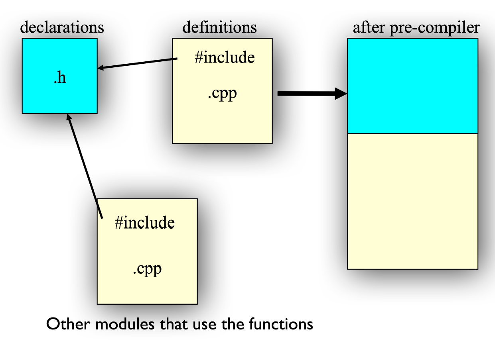

# Classes and Objects

## Classes

### Declaration and Definition

??? example "在 C 语言中定义结构体，并为该结构体定义一些函数"

    ```c
    /* Declaration */
    typedef struct point {
        float x;
        float y;
    } Point;
    void print(Point* p);
    void move(Point* p,int dx, int dy);

    /* Definition */
    void print(Point* p) {
        printf("%d %d\n",p->x,p->y);
    }

    void move(Point* p, int dx, int dy) {
        p->x += dx;
        p->y += dy;
    }

    /* Usage */
    Point a;
    Point b;
    a.x = b.x = 1;
    a.y = b.y = 1;
    move(&a,2,2);
    print(&a);
    print(&b);
    ```

    可以看到，这些函数的共同点是：接收的第一个参数都是 `Point` 结构体。
    
- 在 C++ 中，我们可以将函数**声明**直接放进结构体里，此时我们将结构体看作一个**类**(class)
- 而这些函数的**定义**既可以放在结构体里，也可以放在外面，但通常都放在外面
    - 定义函数时，函数名前面需要配合**解析符**(resolver) `::`，指出函数对应的类名，语法为：

        ```cpp
        // Method 1
        <class name>::<function name>

        // Method 2
        // use the global function
        ::<function name>
        ```
    
    - 解析符也可以用在类的属性（变量）上

        ??? example "例子"

            ```cpp
            void S::f() {  // f is a function for class S
                ::f();     // would be recursive otherwise!
                ::a++;     // select the global a
                a--;       // the a at class scope
            }
            ```

???+ example "例子：定义和声明一个类"

    ```cpp
    // 这里先介绍用 struct 声明的类，之后还会介绍用 class 声明的类，两者有一定区别
    struct Point {
        void init(int x, int y);
        void move(int dx, int dy);
        void print();
        int x;
        int y;
    };

    void Point::init(int ix, int iy) {
        x = ix; y = iy;
    }

    void Point::move(int dx,int dy) {
        x += dx; y += dy;
    }

    void Point::print() {
        cout << x << ' ' << y << endl;
    }
    ```


### Function Calling

调用类里面的成员函数时，调用函数的对象（变量）与被调用的函数之间有密切的联系，而这一联系是通过 `this` 这个隐藏于所有成员函数的参数实现的

- 它是一个局部变量，不能被定义，但可以直接使用
- `this` 实际上是一个指向调用函数的对象的**指针**
- 举例：`#!cpp void Point::move(int dx, int dy);` 会被识别为 `#!cpp void Point::move(Point *this, int dx, int dy);`
- 在成员函数内部调用同一个类里的其他成员函数时，无需指明来自哪个类（即无需使用 `this->`） 

    ```cpp
    void Point::move_and_print(int dx, int dy) {
        move(dx, dy);
        print();
    }
    ```

    - 尽管如此，有些程序员还是喜欢敲 `this->`，这是因为这样可以利用 IDE 的自动补全功能，无需专门去找类里面有哪些函数。


### Header Files

- 类的**声明**，以及成员函数的**原型**(prototype)应该要放在 .h 头文件内
    - 强烈建议一个头文件仅包含一个类声明
    - 如果函数/类在头文件中声明，那么需要将头文件**包括**(include)在所有使用和定义该函数/类的地方
    - 头文件 = 接口(interface)
        - 头文件是开发者和用户之间的合同(contract)
        - 编译器通过要求在使用前声明所有的结构和函数来强制执行合同
    - 外部变量(extern variable)也得在头文件中声明
    - `#!cpp #include`：
        - 它将被包含的文件插入到 .cpp 文件内这条语句的位置上
        - `#!cpp #include "xx.h"`：先搜索当前目录，然后寻找系统目录
        - `#!cpp #include <xx.h>`：直接搜索系统目录
        - `#!cpp #include <xx>`：与 `#!cpp #include <xx.h>` 相同

    - 以下是一个标准的头文件结构，里面的声明仅出现一次，这样可以避免头文件内容被多次包含，从而导致编译失败的问题

        ```cpp
        #ifndef HEADER_FLAG
        #define HEADER_FLAG
        // Type declaration here...
        #endif // HEADER_FLAG
        ```

- 成员函数的**定义**则要放在 .cpp 源文件内（建议与对应的头文件同名）
    - 编译器一次只看一个 .cpp 文件，并生成 .obj 文件
    - 链接器将所有的 .obj 文件链接为一个可执行文件
    - 通过 .h 文件为其他 .cpp 文件提供函数信息

<div style="text-align: center">
    
</div>


### Initialization and Clean-Up

- **构造函数**(constructor)
    - 如果类里面有一个构造函数，那么编译器在创建该类的对象时，在程序员能够操纵对象前，会自动调用构造函数
    - 构造函数的名称**与类名相同**
    - 可以声明带**参数**的构造函数，为对象指定初始值

        ```cpp
        Tree(int i) {...}
        Tree t(12);
        ```

    - **初始化列表**(initializer list)
        - 成员变量能够在类声明里面直接初始化

            ```cpp
            struct Point {
                int x = 0;
                int y = 0;
            };
            ```

        - 或通过构造函数的初始化列表实现

            ```cpp
            struct Point {
                Point(xx, yy);
                int x;
                int y;
            };

            Point::Point(int xx, int yy):x(xx),y(yy) { /* function body */}
            ```

    - **默认构造函数**：无需参数的构造函数
    - **“自动”默认构造函数**：如果在类里面没有声明构造函数，那么**编译器**会自动为该类创建一个构造函数
    - 存储分配和初始化
        - 编译器在作用域的起始部分（`{`），为作用域分配存储空间

- **析构函数**(destructor)
    - 在 C++ 中，**清除**(cleanup)操作与初始化同等重要，它是通过析构函数实现的
    - 析构函数的名称为在前面带波浪号（`~`）的类名，无需任何参数

        ```cpp
        struct Y {
            ~Y();
        };
        ```
    
    - 当对象离开作用域时（到达包裹对象的 `}` 时），析构函数由编译器自动调用


## Objects

!!! card ""

    <div style="text-align: center">
    <span class="fakeTitle">对象 = 属性（数据：性质/状态）+ 服务（操作：函数）</span>
    </div>


### Access Control

C++ 提供了以下三种对类成员的访问控制权（修饰符(modifiers)）：

- `public`：无论在类的内部还是外部，都可以被访问
- `private`：只能在类内部被访问
- `protected`：可以在类内部，以及该类的派生类内被访问

!!! note "注"

    - 这里的“访问控制权”是以类为边界的，所以某个类的对象**可以**通过成员函数来访问同一个类的不同对象的任意成员（包括私有成员）
    - 类默认采用 `private`，而结构体默认采用 `public`

---
**友元**(friend)是一种为某个**类**/某个**函数**授予在另一个类上的访问权限的手段。

- 因此，友元可以分为：
    - 友元类
    - 友元函数

- 友元类不具备：
    - 对称性：类 `A` 是类 `B` 的友元，不代表 `B` 一定是 `A` 的友元
    - 传递性：若类 `A` 是类 `B` 的友元，类 `B` 是类 `C` 的友元，那么 `A` 不一定是 `C` 的友元

???+ example "例子"

    ```cpp
    class X { 
    private:
        int i;
    public:
        friend void g(X&, int);   // 友元函数
        friend class Y;           // 友元类
    };

    class Y {
        //...
    };

    void g(X& inst, int n) {
        //...
    }
    ```


### Scope and Lifetime

#### Local Objects

字段、参数和局部变量的作用域和生命周期：

- **字段**(fields)
    - 在类里面，但是在构造函数和方法外定义
    - **生命周期**等同于对象的生命周期，因此可用来维护对象的当前状态等
    - **作用域**为整个类，因此可被类里面的构造函数或方法使用（包括相同类的不同对象）
    - 不过用 `private` 字段定义字段后，该字段不得在类之外的区域被访问（其他对象不得访问这样的字段）

- **形参**(parameters)：
    - 定义在构造函数或方法的签名/声明上，接收来自外部的值（实参值），该过程即为形参初始化的过程
    - **生命周期**仅在构造函数或方法的调用内，函数调用结束后就消失了
    - **作用域**限制在定义它们的构造函数或方法内

- **局部变量**(local variables)：
    - 定义在构造函数或方法的主体/定义内，仅在构造函数或方法内来初始化和使用变量
    - 由于局部变量没有被赋予默认值，在表达式中使用局部变量时必须先初始化
    - **生命周期**仅在构造函数或方法的调用内，函数调用结束后就消失了
    - **作用域**限制在定义它们的块内，在块外面无法访问它们


#### Global Objects

全局对象(global objects)：

- 全局对象的**构造函数**(constructor)需要在进入 `main()` 函数之前被调用，声明顺序即为代码书写顺序，因此 `main()` 不再是程序中第一个被调用的函数
- 全局对象的**析构函数**(destructor)在 `main()` 退出或 `exit()` 调用时被调用


#### Static

**静态初始化依赖性**(static initialization dependency)：单个文件内的对象构造顺序是已知的，但是多个文件之间的构造顺序是未定的。那么当位于不同文件的<u>非局部静态对象</u>有依赖关系时，就可能会带来问题。

满足以下情况的对象称为**非局部静态对象**(non-local static object)：

- 定义于**全局**或**命名空间**作用域内
- 在**类**中或**文件**作用域内声明为静态变量的

解决上述问题的方案：

- 避免非局部静态变量的依赖关系
- 按正确的顺序在单个文件内定义静态对象

---
关于**静态**(static)

- 静态的两个基本含义：静态存储、受限访问
- 在固定的地址上仅分配一次空间：
    - 名称可见性(visibility of a name)
    - 内部链接(internal linkage)
- 在 C++ 中，除了在**函数**或**类**内，**不要**使用静态变量

- 使用场景：
    - ~~静态自由函数：内部链接（已弃用）~~
    - ~~静态全局变量：内部链接（已弃用）~~
    - **静态局部变量**：持续存储
    - **静态成员变量**：实例间共享
    - **静态成员函数**：实例间共享，仅被静态成员访问

---
**静态局部变量**：

- 用于函数内部
- 整个程序都会记住该变量值，即不会随函数调用的结束而消失
- 仅初始化一次
- 用途：记录函数调用次数等等

???+ example "例子"

    ```cpp hl_lines="11"
    class X {

    public:
        X(int, int);
        ~X();
        // ...
    };

    void f(int x) {
        if (x > 10) {
            static X my_X(x, x * 21);
            // ...
        }
    }
    ```

    - 只有当 `x > 10` 时，静态局部变量 `my_X` 才会被构造，但仅构造一次
    - 之后再使用 `my_X` 时，它会继续沿用之前的值
    - 只有当 `my_X` 创建后，之后才有可能被销毁。所以如果 `x <= 10`，那就没有这个可能了

---
**静态成员**：

- 静态意味着隐藏和持续：
    - **隐藏**(hidden)：静态成员仍旧是成员，因而遵守一般成员的访问规则
    - **持续**(persistent)：独立于实例之外，即能被同一类的任何对象访问，所以需要用单独的语句为其声明空间

- 静态成员分为：
    - 静态成员**变量**
        - 在类内声明好静态成员变量后（一般位于 `.h` 文件），单独声明空间时**不需要**加 `static`（位于 `.cpp` 文件）

        ???+ example "例子"

            ```cpp title="StatMem.h"
            #ifndef _STAT_MEM_
            #define _STAT_MEM_

            class StatMem {
            public:
                static int m_h;
            // ...
            };

            #endif
            ```

            ```cpp title="StatMem.cpp"
            #include "StatMem.h"
            #include <iostream>
            using namespace std;

            int StatMem::m_h;

            int main() {
                // ...
            }
            ```


    - 静态成员**函数**
        - 该函数**没有**隐藏的 `this` 指针，因为它不属于任何对象
        - 与静态成员变量类似，在函数定义的时候无需使用 `static` 修饰符

        ???+ example "例子"

            ```cpp title="StatFun.h"
            #ifndef _STAT_FUN_
            #define _STAT_FUN_

            class StatFun {
            public:
                static void sf(); 
            // ...
            private:
                static int j;
            };

            #endif
            ```

            ```cpp title="StatFun.cpp"
            #include "StatFun.h"
            #include <iostream>
            using namespace std;

            int StatFun::j = 2;
            void StatFun::sf() { 
                j += 13; 
            }

            int main() {
                // ...
            }
            ```

- 访问静态成员的两种方法：

    ```cpp
    <class name>::<static member>
    <object variable>.<static member>
    ```


### Reference

**引用**(reference)是 C++ 中操纵对象的一种新方式，对应的运算符为 `&`。

```cpp
char c;          // a character
char *p = &c;    // a pointer to a character
char &r = c;     // a reference to a character
```

#### Left Value vs Right Value

在正式介绍引用之前，先来学习一下左值和右值的概念。

- **左值**(left-value)可以被简单地认为是用于赋值语句左侧的值，但也可以出现在右侧
    - 包括：变量、引用、使用运算符 `*`、`[]`、`.` 和 `->` 的结果
    - 表达式求解完成后，左值仍被保留
- **右值**(right-value)是**只能**出现在赋值语句右侧的值
    - 包括：字面量、表达式
    - 表达式求解完成后，左值不会被保留


#### Left Value Reference

对左值的引用可以作为已存在对象（包括局部和全局变量）的别名，语法为：`#!cpp type& refname = name;`。

```cpp
int X = 47;
int &Y = X;
// X and Y now refer to the same variable

cout << "Y = " << y;    // Y = 47
Y = 18;
cout << "X = " << X;    // X = 18
```

- 对于一般的变量而言，需要为引用赋予初始值
- 左值引用不能绑定右值，因为右值并没有持久的地址
- 但是**常量左值引用**可以绑定右值，这时引用会分配一个新的地址

---
在**函数参数**中也可以使用引用，可以做到在不使用指针的情况下修改参数。

```cpp
void f(int& x);
f(y);
```

---
引用规则：

- 定义引用时必须初始化，而初始化建立了一个绑定关系
- 不同于指针，绑定关系在运行时不会改变
- 引用的目标必须有一个具体的位置

    ```cpp
    void func(int &);
    func(i * 3);          // Warning or error!
    ```

???+ note "指针 vs 引用"

    - 引用：
        - 不能为空（`null`）
        - 依赖于已存在的变量，它们是变量的别名
        - 不能改变为一个新的地址
    
    - 指针：
        - 可以设为空
        - 指针独立于已存在的变量
        - 可以改变指针，指向不同的地址

!!! warning "引用的限制"

    - 不能引用一个引用
    - 不能声明引用指针，比如 `#!cpp int &*p;` 是非法的
        - 但是对指针的引用时 OK 的，比如 `#!cpp void f(int *&p);`

    - 不能声明引用数组


#### Right Value Reference

- 右值引用：

    ```cpp
    int x = 20;    // left-value
    int && rx = x * 2;
    // the result of x * 2 is a right-value, rx extends its lifetime

    int y = rx + 2;
    rx = 100;
    // Once a right-value reference is initialized
    // this variable becomes a left-value that can be assigned

    int && rrx1 = x;
    // Illegal: right-value reference can not be initialized by a left-value
    ```

- 作为右值的参数：

    ```cpp
    // take left-value
    void fun(int& lref) {
        cout << "l-value" << endl;
    }

    // take right-value
    void fun(int&& rref) {
        cout << "r-value" << endl;
    }

    int main() {
        int x = 10;
        fun(x);     // output: l-value
        fun(10);   // output: r-value
    }
    ```


### Constants

- C++ 使用 `const` 修饰符来声明一个常量，被 `const` 修饰的变量无法被修改。

    ```cpp
    const int x = 123;
    x = 27;                // Illegal!
    x++;                   // Illegal!
    int y = x;             // OK, copy const to non-const
    const int z = y;       // OK, const is safer
    ```

- 编译时常量：C++ 的常量默认使用**内部链接**(internal linkage)
    - 编译器尝试避免为常量创建存储空间，而是将常量值保存在**符号表**(symbol table)内

        ```cpp
        const int bufsize = 1024;
        ```

        此时必须初始化常量值

    - 使用 `extern` 关键字，强制为常量分配空间

        ```cpp
        extern const int bufsize;
        ```

        此时编译器不会让用户改变常量值

- 运行时常量

    ```cpp
    const int class_size = 12;
    int finalGrade[class_size]; // ok
    int x;
    cin >> x;
    const int size = x;
    double classAverage[size]; // error!
    ```

- **聚合**(aggregates)：一组数据
    - 可以为聚合使用 `const`，但此时会分配存储空间。在这种情况下，`const` 意味着“一块无法被改变的存储空间”
    - 然而，其值不能在编译时被使用，因为编译器并不被要求在编译时获知其中的内容

    ```cpp
    const int i[] = { 1, 2, 3, 4 };
    float f[i[3]]; // Illegal
    struct S { int i, j; };
    const S s[] = { { 1, 2 }, { 3, 4 } };
    double d[s[1].j]; // Illegal
    ```

- 指针和常量的关系：

    ```cpp
    char * const q = "abc";    // q is const
    *q = 'c';                  // OK
    q++;                       // ERROR
    const char *p = "ABCD";    // (*p) is a const char
    *p = 'b';                  // ERROR! (*p) is the const
    ```

    - `type * const`：不能移动指针指向的**位置**
    - `const type *`：不能修改指针指向的对象的**内容**

    ||`#!cpp int i;`|`#!cpp const int ci = 3;`|
    |:-|:-|:-|
    |`#!cpp int *ip;`|`#!cpp ip = &i;`|`#!cpp ip = &ci;  // ERROR`|
    |`#!cpp const int *cip;`|`#!cpp cip = &i;`|`#!cpp cip = &ci;`|


- 字符串与常量

    ```cpp
    char * s1 = "Hello, world!";
    char s2[] = "Hello, world!";
    ```

    - 字符**指针** `s1` 可以指向其他字符串，但是不可以改变指向字符串的内容
    - 字符**数组** `s2` 可以修改字符串的内容，但是不可以指向其他字符串

- 转换：
    - 可以将非常量值看作常量：

        ```cpp
        void f(const int* x);
        int a = 15;
        f(&a);                    // Ok
        const int b = a;

        f(&b);                    // Ok
        b = a + 1;                // Error!
        ```

    - 如果没有显式转换的话，不能将常量对象看作是一个非常量

- 传递常量值

    ```cpp
    void f1(const int i) {
        i++;          // Illegal -- compile-time error
    }
    ```

- 返回常量值

    ```cpp
    int f3() { return 1; }
    const int f4() { return 1; }
    int main() {
        const int j = f3();    // Works fine
        int k = f4();          // But this works fine too!
    }
    ```

- 传递和返回地址
    - 传递整个对象可能耗费过大的成本，因此推荐传递指针。但是在函数内可以通过这个指针修改原始值
    - 所以，当传递地址的时候，最好再用 `const` 修饰，避免意外的修改


#### Constant Objects

常量对象只能使用被 `const` 修饰的成员函数，而这些函数无法修改成员变量。

```cpp
int Date::set_day(int d){
    // ...error check d here...
    day = d;                // ok, non-const so can modify
}
int Date::get_day() const {
    day++;                  // ERROR modifies data member
    set_day(12);            // ERROR calls non-const member
    return day;             // ok
}
```

常量函数在定义和声明的时候都要使用 `const`

```cpp
int get_day () const;
int get_day() const { return day };
```

- 不会修改数据的函数成员应当是常量成员函数，这样对常量对象来说才是安全的


常量对象：

```cpp
// non-const object
Date when(1, 1, 2001);                // not a const
int day = when.get_day();           // OK
when.set_day(13);                   // OK

// const object
const Date birthday(12, 25, 1994);    // const
int day = birthday.get_day();       // OK
birthday.set_day(14);               // ERROR
```

重载常量和非常量函数：

```cpp
void f() const;
void f();
```

类里面的常量字段：必须在构造函数中被初始化

```cpp
class A {
    const int i;
};
```

类里的编译时常量：

```cpp
class HasArray {
    const int size;
    int array[size]; // ERROR!
};
```

- 可以使用“匿名枚举”

    ```cpp
    class HasArray {
        enum { size = 100 };
        int array[size]; // OK!
    };
    ```

- 或者使常量值静态化

    ```cpp
    class HasArray {
        static const int size = 100;
        int array[size];
    }
    ```

    - 静态意味着每个类（而不是每个对象）只有这样一个值


## Dynamically Allocated Memory

- 使用 `new` 为运行时的程序分配内存空间。指针是唯一能够访问这种内存空间的途径

    ```cpp
    new int;
    new Stash;
    new int[10];
    ```

- 当完成对这块内存空间的使用时，使用 `delete` 将这块内存空间返回给内存池

    ```cpp
    delete p;
    delete[] p;
    ```

- `{}` 用于向使用 `new` 生成的对象传递初始值


动态数组：

```cpp
int * psome = new int [10];
delete[] psome;
```

- `new` 运算符返回数组中第一个元素的地址
- 方括号的存在告诉程序需要释放整个数组的内存空间，而不是一个元素

`new` 和 `delete` 的搭配：

```cpp
int *p = new int;
int *a = new int[10];
Student *q = new Student();
Student *r = new Student[10];
delete p;
a++;
delete[] a;
delete q;
delete r;
delete[] r;
```

!!! tip "使用提示"

    - 不要用 `delete` 释放不是用 `new` 分配的内存
    - 不要用 `delete` 连续释放两次相同的内存块
    - 如果使用 `new []` 来分配数组的话，需要使用 `delete []`
    - 如果使用 `new` 来分配单个实体的话，需要使用 `delete`
    - 在空指针上使用 `delete` 是安全的（无事发生）